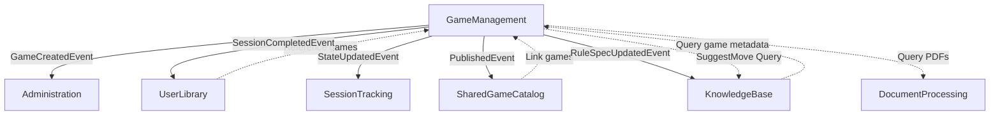

# GameManagement Bounded Context

**Game catalog, sessions, rules, FAQs, and state management**

> 📖 **Testing Reference**: See `tests/Api.Tests/GameManagement/` for implementation examples

---

## 📋 Responsibilities

- Game catalog CRUD (BGG integration, image upload)
- Game sessions (lifecycle: Setup → Active → Paused → Completed/Abandoned)
- Game state tracking (JSON state + snapshots, undo/redo support)
- Rule specifications (versioning, collaborative editing with locks)
- Rule comments (threaded discussions, resolution tracking)
- Game FAQs (community-driven Q&A)
- AI move suggestions (Player Mode integration)
- Similar games (RAG-based recommendations)
- Publication workflow (SharedGameCatalog integration)

---

## 🏗️ Domain Model

### Aggregates & Entities

| Aggregate/Entity | Key Fields | Domain Methods |
|-----------------|------------|----------------|
| **Game** (Root) | Title, Publisher, YearPublished, PlayerCount, PlayTime, BggId, SharedGameId, IsPublished, ApprovalStatus | UpdateDetails(), LinkToBggGame(), LinkToSharedGame(), Publish(), SetApprovalStatus() |
| **GameSession** (Root) | GameId, CreatedByUserId, Status, StartedAt, CompletedAt, WinnerName, Players | Start(), Pause(), Resume(), Complete(), Abandon(), AddPlayer() |
| **SessionPlayer** (Entity) | PlayerName, PlayerOrder, Color | - |
| **GameSessionState** (Entity) | GameSessionId, CurrentTurn, CurrentPhase, StateData (JSON), Snapshots | UpdateState(), CreateSnapshot(), RestoreFromSnapshot() |
| **GameStateSnapshot** (Entity) | TurnNumber, SnapshotData, Description | - |
| **RuleSpec** (Root) | GameId, Version, Content (Markdown), IsCurrent, CreatedBy, Comments | UpdateContent(), AddComment() |
| **RuleComment** (Entity) | RuleSpecId, LineNumber, CommentText, IsResolved, ParentCommentId | Resolve(), Unresolve(), Update() |
| **EditorLock** (Entity) | GameId, LockedBy, ExpiresAt | Refresh() |

### Value Objects

| Value Object | Validation Rules | Purpose |
|-------------|------------------|---------|
| **GameTitle** | 1-200 chars, required, trimmed | Game name with validation |
| **Publisher** | 1-200 chars, optional | Publisher name |
| **YearPublished** | 1900-current year | Publication year constraint |
| **PlayerCount** | Min/Max: 1-100, Min ≤ Max | Player count range |
| **PlayTime** | Min/Max: 1-10000 minutes, Min ≤ Max | Play duration range |
| **SessionStatus** | Enum: Setup, Active, Paused, Completed, Abandoned | Session lifecycle state |

---

## 📡 Application Layer (CQRS)

> **Total**: 47 operations (26 commands + 21 queries)

### Operation Matrix

| Category | Commands | Queries | Key Features |
|----------|----------|---------|--------------|
| **Game Retrieval** | 0 | 4 | Public access, pagination, search, similar games (RAG) |
| **Game Management** | 4 | 0 | Admin/Editor only, BGG import, image upload, publish |
| **Session Lifecycle** | 7 | 0 | Session-required, quota enforcement |
| **Session Queries** | 0 | 6 | Analytics, history, stats |
| **Game State** | 4 | 2 | Initialize, update, snapshot, restore |
| **AI Suggestions** | 2 | 0 | Move suggestions, apply |
| **Rule Specs** | 3 | 4 | Versioning, history, diff |
| **Rule Comments** | 5 | 2 | Threading, resolution |
| **Editor Locks** | 3 | 1 | Collaborative editing |
| **Bulk Operations** | 2 | 0 | Export, PDF import |

### A. GAME RETRIEVAL (Public)

| Query | Endpoint | Auth | Test Reference |
|-------|----------|------|----------------|
| `GetAllGamesQuery` | GET `/api/v1/games` | 🟢 Public | `GetAllGamesQueryHandler_Tests.cs` |
| `GetGameByIdQuery` | GET `/api/v1/games/{id}` | 🟢 Public | `GetGameByIdQueryHandler_Tests.cs` |
| `GetGameDetailsQuery` | GET `/api/v1/games/{id}/details` | 🟡 Auth | `GetGameDetailsQueryHandler_Tests.cs` |
| `GetSimilarGamesQuery` | GET `/api/v1/games/{id}/similar` | 🟢 Public | `SimilarGamesService_Tests.cs` |

**Query Parameters**:
- `GetAllGamesQuery`: `search?`, `page?`, `pageSize?` (max: 100)
- `GetSimilarGamesQuery`: `limit?` (default: 5), `minSimilarity?` (0-1)

### B. GAME MANAGEMENT (Admin/Editor)

| Command | Endpoint | Auth | Test Reference |
|---------|----------|------|----------------|
| `CreateGameCommand` | POST `/api/v1/games` | 🔴 Admin/Editor | `CreateGameCommandHandler_Tests.cs`, `CreateGameCommandValidator_Tests.cs` |
| `UpdateGameCommand` | PUT `/api/v1/games/{id}` | 🔴 Admin/Editor | `UpdateGameCommandHandler_Tests.cs` |
| `PublishGameCommand` | PUT `/api/v1/games/{id}/publish` | 🔴 Admin | `PublishGameCommandHandler_Tests.cs` |
| `UploadGameImageCommand` | POST `/api/v1/games/upload-image` | 🔴 Admin/Editor | `UploadGameImageCommandHandler_Tests.cs` |

**Validation**:
- Title: 1-200 chars
- YearPublished: 1900-current
- PlayerCount: 1-100, Min ≤ Max
- PlayTime: 1-10000 minutes

### C. SESSION LIFECYCLE (Session-Required)

| Command | Endpoint | Status Transition | Test Reference |
|---------|----------|------------------|----------------|
| `StartGameSessionCommand` | POST `/api/v1/sessions` | - → Setup | `StartGameSessionCommandHandler_Tests.cs` |
| `AddPlayerToSessionCommand` | POST `/api/v1/sessions/{id}/players` | - | `AddPlayerToSessionCommandHandler_Tests.cs` |
| `PauseGameSessionCommand` | POST `/api/v1/sessions/{id}/pause` | Active → Paused | `PauseGameSessionCommandHandler_Tests.cs` |
| `ResumeGameSessionCommand` | POST `/api/v1/sessions/{id}/resume` | Paused → Active | `ResumeGameSessionCommandHandler_Tests.cs` |
| `CompleteGameSessionCommand` | POST `/api/v1/sessions/{id}/complete` | Active → Completed | `CompleteGameSessionCommandHandler_Tests.cs` |
| `AbandonGameSessionCommand` | POST `/api/v1/sessions/{id}/abandon` | Any → Abandoned | `AbandonGameSessionCommandHandler_Tests.cs` |
| `EndGameSessionCommand` | POST `/api/v1/sessions/{id}/end` | Active → Completed | (Alias for Complete) |

**Session Status Flow**:
```
Setup → Active → Paused ⇄ Active → Completed
                   ↓
              Abandoned (from any state)
```

### D. SESSION QUERIES (Authenticated)

| Query | Endpoint | Test Reference |
|-------|----------|----------------|
| `GetGameSessionByIdQuery` | GET `/api/v1/sessions/{id}` | `GetGameSessionByIdQueryHandler_Tests.cs` |
| `GetGameSessionsQuery` | GET `/api/v1/games/{gameId}/sessions` | `GetGameSessionsQueryHandler_Tests.cs` |
| `GetActiveSessionsByGameQuery` | GET `/api/v1/games/{gameId}/sessions/active` | `GetActiveSessionsByGameQueryHandler_Tests.cs` |
| `GetActiveSessionsQuery` | GET `/api/v1/sessions/active` | `GetActiveSessionsQueryHandler_Tests.cs` |
| `GetSessionHistoryQuery` | GET `/api/v1/sessions/history` | `GetSessionHistoryQueryHandler_Tests.cs` |
| `GetSessionStatsQuery` | GET `/api/v1/sessions/statistics` | `GetSessionStatsQueryHandler_Tests.cs` |

**Analytics Data**: Total sessions, play time averages, most played games, top players, win rates

### E. GAME STATE MANAGEMENT (Session-Required)

| Command/Query | Endpoint | Purpose | Test Reference |
|---------------|----------|---------|----------------|
| `InitializeGameStateCommand` | POST `/api/v1/sessions/{sessionId}/state/initialize` | Create state tracking | `InitializeGameStateCommandHandler_Tests.cs` |
| `UpdateGameStateCommand` | PATCH `/api/v1/sessions/{sessionId}/state` | Update after move | `UpdateGameStateCommandHandler_Tests.cs` |
| `CreateStateSnapshotCommand` | POST `/api/v1/sessions/{sessionId}/state/snapshots` | Checkpoint state | `CreateStateSnapshotCommandHandler_Tests.cs` |
| `RestoreStateSnapshotCommand` | POST `/api/v1/sessions/{sessionId}/state/restore/{snapshotId}` | Undo to snapshot | `RestoreStateSnapshotCommandHandler_Tests.cs` |
| `GetGameStateQuery` | GET `/api/v1/sessions/{sessionId}/state` | Current state | `GetGameStateQueryHandler_Tests.cs` |
| `GetStateSnapshotsQuery` | GET `/api/v1/sessions/{sessionId}/state/snapshots` | Snapshot list | `GetStateSnapshotsQueryHandler_Tests.cs` |

**State Storage**: Flexible JSON schema, game-specific structure

### F. AI MOVE SUGGESTIONS (Player Mode)

| Command | Endpoint | Integration | Test Reference |
|---------|----------|-------------|----------------|
| `SuggestMoveCommand` | POST `/api/v1/sessions/{sessionId}/suggest-move` | KnowledgeBase AgentTypology | `SuggestMoveCommandHandler_Tests.cs` |
| `ApplySuggestionCommand` | POST `/api/v1/sessions/{sessionId}/apply-suggestion` | Game state update | `ApplySuggestionCommandHandler_Tests.cs` |

**AI Response**: Move description, reasoning, confidence (0-1), expected points, alternatives

### G-I. RULE SPECIFICATIONS

| Category | Operations | Test Reference |
|----------|-----------|----------------|
| **Core** | 3 commands, 1 query | `RuleSpec_Tests.cs`, `UpdateRuleSpecCommandHandler_Tests.cs` |
| **Versioning** | 4 queries | `GetVersionHistoryQueryHandler_Tests.cs`, `ComputeRuleSpecDiffQueryHandler_Tests.cs` |
| **Comments** | 5 commands, 2 queries | `RuleComment_Tests.cs`, `CreateRuleCommentCommandHandler_Tests.cs` |

**Versioning**: Auto-increment on update, IsCurrent flag, history tracking
**Comments**: Line-specific or general, threading support, resolution tracking

### J. COLLABORATIVE EDITING

| Command/Query | Endpoint | Purpose | Test Reference |
|---------------|----------|---------|----------------|
| `AcquireEditorLockCommand` | POST `/api/v1/games/{gameId}/rulespec/lock` | Lock before edit | `AcquireEditorLockCommandHandler_Tests.cs` |
| `ReleaseEditorLockCommand` | DELETE `/api/v1/games/{gameId}/rulespec/lock` | Release lock | `ReleaseEditorLockCommandHandler_Tests.cs` |
| `RefreshEditorLockCommand` | POST `/api/v1/games/{gameId}/rulespec/lock/refresh` | Keep-alive | `RefreshEditorLockCommandHandler_Tests.cs` |
| `GetEditorLockStatusQuery` | GET `/api/v1/games/{gameId}/rulespec/lock` | Check lock | `GetEditorLockStatusQueryHandler_Tests.cs` |

**Lock Configuration**: 5-minute timeout, auto-expiration, 409 Conflict on conflict

---

## 🔄 Domain Events

| Event | Trigger | Payload | Subscribers |
|-------|---------|---------|-------------|
| `GameCreatedEvent` | Game creation | GameId, Title, CreatedBy | Administration (audit), SharedGameCatalog |
| `GamePublishedEvent` | Publish command | GameId, SharedGameId | SharedGameCatalog (publication request) |
| `GameSessionStartedEvent` | Session start | SessionId, GameId, PlayerCount | SessionTracking, UserLibrary |
| `GameSessionCompletedEvent` | Session complete | SessionId, WinnerName, Duration | SessionTracking, UserLibrary |
| `GameStateUpdatedEvent` | State update | SessionId, TurnNumber | SessionTracking (real-time) |
| `StateSnapshotCreatedEvent` | Snapshot created | SessionId, SnapshotId | Administration (audit) |
| `RuleSpecUpdatedEvent` | RuleSpec update | GameId, Version, UpdatedBy | Administration, KnowledgeBase (re-index) |
| `RuleCommentCreatedEvent` | Comment created | CommentId, GameId, CreatedBy | UserNotifications (mentions) |
| `EditorLockAcquiredEvent` | Lock acquired | GameId, LockedBy | Administration (tracking) |

---

## 🔗 Integration Points

### Context Diagram



### Integration Summary

| Context | Relationship | Purpose |
|---------|-------------|---------|
| **KnowledgeBase** | Bidirectional | RAG context (inbound), AI suggestions (outbound) |
| **UserLibrary** | Inbound + Events | Game references, play history tracking |
| **SharedGameCatalog** | Bidirectional | Publication workflow, community linking |
| **Administration** | Events | Audit logging for all operations |
| **SessionTracking** | Events | Real-time session monitoring |
| **DocumentProcessing** | Outbound | PDF rulebook association |

---

## 🔐 Authorization Matrix

| Endpoint Pattern | Anonymous | User | Editor | Admin |
|------------------|-----------|------|--------|-------|
| `GET /games` | ✅ | ✅ | ✅ | ✅ |
| `GET /games/{id}` | ✅ | ✅ | ✅ | ✅ |
| `POST /games` | ❌ | ❌ | ✅ | ✅ |
| `PUT /games/{id}` | ❌ | ❌ | ✅ | ✅ |
| `PUT /games/{id}/publish` | ❌ | ❌ | ❌ | ✅ |
| `POST /sessions` | ❌ | ✅ | ✅ | ✅ |
| `PATCH /sessions/{id}/state` | ❌ | ✅ (owner) | ✅ | ✅ |
| `PUT /rulespec` | ❌ | ❌ | ✅ | ✅ |
| `POST /comments` | ❌ | ❌ | ✅ | ✅ |

**Authentication Levels**:
- 🟢 Public: No auth required
- 🟡 Authenticated: Session OR API Key (dual auth)
- 🔵 Session-Required: Active session mandatory
- 🔴 Admin/Editor: Role-based access control

---

## 📊 Performance

### Caching Strategy

| Query | TTL | Invalidation Trigger |
|-------|-----|---------------------|
| `GetGameByIdQuery` | 30 min | GameUpdatedEvent, GamePublishedEvent |
| `GetAllGamesQuery` | 5 min | GameCreatedEvent, GameUpdatedEvent |
| `GetSimilarGamesQuery` | 1 hour | GameUpdatedEvent (source game) |
| `GetGameSessionByIdQuery` | 2 min | Session lifecycle events |
| `GetActiveSessionsQuery` | 30 sec | SessionStartedEvent, SessionCompletedEvent |
| `GetRuleSpecQuery` | 1 hour | RuleSpecUpdatedEvent |

### Database Indexes

```sql
-- Games
idx_games_title (Title) WHERE NOT IsDeleted
idx_games_bgg (BggId) WHERE BggId IS NOT NULL
idx_games_published (IsPublished, ApprovalStatus) WHERE NOT IsDeleted

-- Sessions
idx_sessions_game_status (GameId, Status) WHERE NOT IsDeleted
idx_sessions_user_active (CreatedByUserId, Status) WHERE Status IN ('Active', 'Paused')

-- RuleSpecs
idx_rulespecs_game_current (GameId, IsCurrent) WHERE IsCurrent = TRUE
idx_rulespecs_version (GameId, Version)

-- Comments
idx_comments_rulespec (RuleSpecId, LineNumber)
idx_comments_parent (ParentCommentId) WHERE ParentCommentId IS NOT NULL
```

### Performance Targets

| Query Type | Target Latency | Cache Hit Rate |
|------------|----------------|----------------|
| Game by ID | <15ms | >85% |
| All games (paginated) | <50ms | >70% |
| Similar games (RAG) | <500ms | >80% |
| Active sessions | <20ms | >90% |
| RuleSpec (current) | <25ms | >90% |

---

## 🧪 Testing

### Test Coverage

| Category | Test Files | Coverage Target |
|----------|-----------|-----------------|
| **Domain** | `Game_Tests.cs`, `GameSession_Tests.cs`, `RuleSpec_Tests.cs`, `RuleComment_Tests.cs` | 90%+ |
| **Validators** | `CreateGameCommandValidator_Tests.cs`, `StartGameSessionCommandValidator_Tests.cs`, etc. | 90%+ |
| **Handlers** | `*CommandHandler_Tests.cs`, `*QueryHandler_Tests.cs` (47 files) | 90%+ |
| **Integration** | `GameManagementIntegration_Tests.cs` (Testcontainers) | 85%+ |
| **E2E** | `apps/web/__tests__/e2e/game-management/` (Playwright) | Critical flows |

### Test Locations

```
tests/Api.Tests/GameManagement/
├── Domain/                    # Domain logic tests
├── Validators/                # FluentValidation tests
├── Handlers/                  # Command/Query handler tests
└── Integration/               # Testcontainers integration tests

apps/web/__tests__/e2e/game-management/
└── *.spec.ts                  # Playwright E2E tests
```

---

## 📂 Code Structure

```
apps/api/src/Api/BoundedContexts/GameManagement/
├── Domain/
│   ├── Entities/              # Game, GameSession, RuleSpec, etc.
│   ├── ValueObjects/          # GameTitle, PlayerCount, PlayTime
│   ├── Repositories/          # Interfaces only
│   ├── Services/              # IBggApiService, ISimilarGamesService
│   └── Events/                # 12+ domain events
├── Application/
│   ├── Commands/              # 26 commands
│   ├── Queries/               # 21 queries
│   ├── Handlers/              # 47 handlers
│   ├── DTOs/                  # 30+ DTOs
│   └── Validators/            # 20+ FluentValidation validators
└── Infrastructure/
    ├── Persistence/           # EF Core repositories
    ├── Services/              # BGG API, Qdrant integration
    └── DependencyInjection/   # Service registration
```

**Routing**: `apps/api/src/Api/Routing/GameEndpoints.cs`

---

## 📈 Metrics

### KPIs

| Metric | Target | Description |
|--------|--------|-------------|
| Game Catalog Size | 500+ games | Total games in system |
| Active Sessions | 50+ concurrent | Peak concurrent sessions |
| Session Completion Rate | >80% | Completed vs abandoned |
| BGG Import Success | >95% | Successful metadata fetches |
| Similar Games Accuracy | >75% | User approval rate |
| RuleSpec Lock Duration | <5min avg | Editor lock time |

### Monitoring Queries

**Active Sessions by Game**:
```sql
SELECT g.Title, COUNT(*) as active_sessions
FROM GameSessions gs
JOIN Games g ON gs.GameId = g.Id
WHERE gs.Status IN ('Active', 'Paused') AND NOT gs.IsDeleted
GROUP BY g.Title ORDER BY active_sessions DESC LIMIT 10;
```

**Session Completion Rate**:
```sql
SELECT SUM(CASE WHEN Status = 'Completed' THEN 1 ELSE 0 END)::float / COUNT(*) * 100
FROM GameSessions WHERE StartedAt > NOW() - INTERVAL '30 days';
```

---

## 🚨 Known Issues

### Current Limitations

1. **BGG API Rate Limits**: 2 requests/second (implemented with throttling)
2. **Session Concurrency**: No quota limit (Issue #3070 adds per-tier limits)
3. **State Validation**: JSON not validated against schema (flexible but risky)
4. **Lock Timeout**: 5-minute expiration may be too short

### Related Issues

- ✅ **#1446**: Dual authentication (session or API key)
- ✅ **#2055**: Collaborative editing locks
- ✅ **#2373**: SharedGameCatalog linking
- ✅ **#2403**: GameSessionState with snapshots
- ✅ **#2404**: Player Mode move suggestions
- ✅ **#3353**: Similar games via RAG
- ✅ **#3481**: Publish to SharedGameCatalog
- 🔄 **#3070**: Session quota per user tier (In Progress)

---

## 🔗 Related Documentation

- [SharedGameCatalog BC](./shared-game-catalog.md) - Publication workflow
- [KnowledgeBase BC](./knowledge-base.md) - RAG, AI agents, similar games
- [DocumentProcessing BC](./document-processing.md) - PDF rulebook linking
- [UserLibrary BC](./user-library.md) - Collections, play history
- [SessionTracking BC](./session-tracking.md) - Real-time analytics
- [Administration BC](./administration.md) - Audit logs

### ADRs
- [ADR-018: PostgreSQL FTS](../01-architecture/adr/adr-018-postgresql-fts-for-shared-catalog.md)
- [ADR-023: Share Request Workflow](../01-architecture/adr/adr-023-share-request-workflow.md)
- [ADR-008: Streaming CQRS](../01-architecture/adr/adr-008-streaming-cqrs-migration.md)

---

**Status**: ✅ Production
**Last Updated**: 2026-02-12
**Operations**: 47 (26 commands + 21 queries)
**Test Coverage**: 90%+ (unit), 85%+ (integration)
**Domain Events**: 12+
**Integration Points**: 6 contexts
