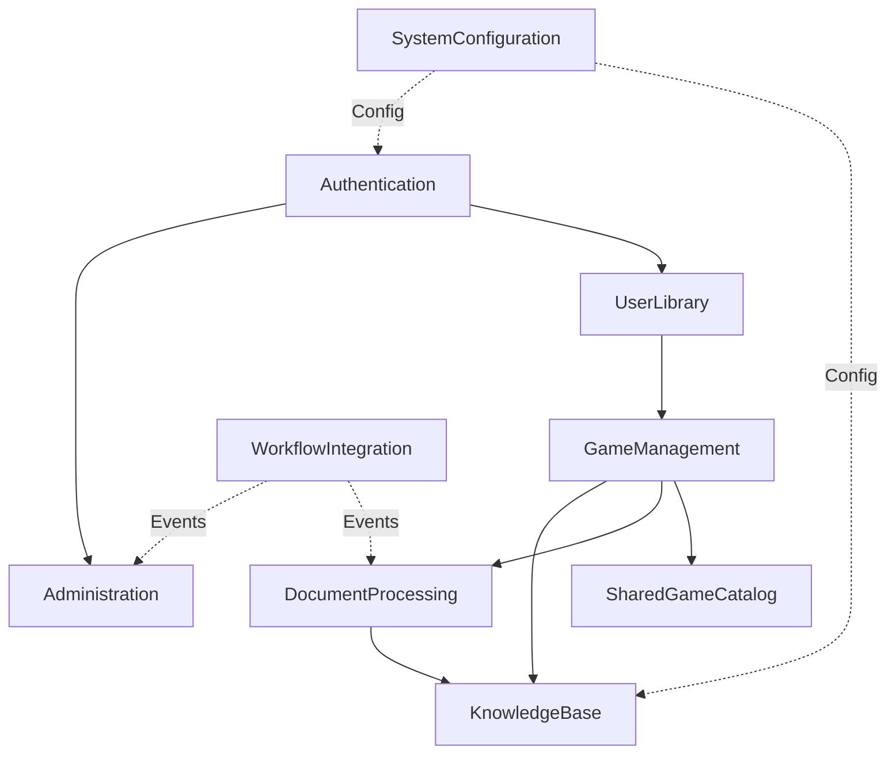
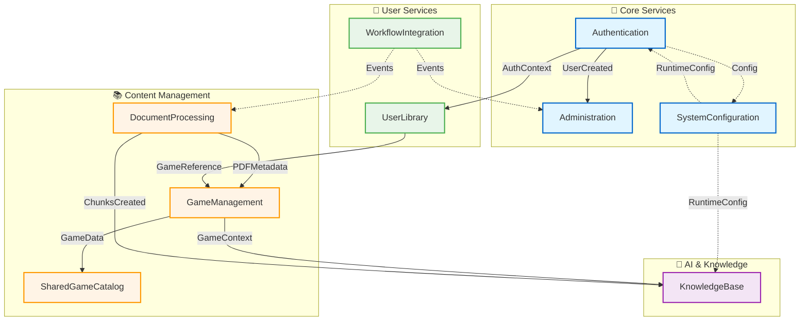

# Bounded Contexts Documentation

**Quick Navigation** - Guida ai 13 Bounded Contexts DDD di MeepleAI

---

## 🎯 Cos'è un Bounded Context?

Un **Bounded Context** è un confine esplicito all'interno del quale un particolare **modello di dominio** è definito e applicabile. In MeepleAI, ogni bounded context rappresenta un'area funzionale autonoma con:

- **Linguaggio Ubiquo**: Terminologia condivisa tra sviluppatori e domain experts
- **Modello di Dominio Autonomo**: Entità, value objects, aggregates specifici
- **Confini Chiari**: Comunicazione tra contexts via Domain Events o API
- **Team Ownership**: Ogni context può essere sviluppato indipendentemente

---

## 📂 Bounded Contexts Overview

MeepleAI ha **13 Bounded Contexts** organizzati per area funzionale:

| # | Context | Responsabilità | File | Status |
|---|---------|----------------|------|--------|
| 1 | **Administration** | Gestione utenti, ruoli, audit logs, analytics | `administration.md` | ✅ Production |
| 2 | **Authentication** | Autenticazione, sessioni, OAuth, 2FA, API keys | `authentication.md` | ✅ Production |
| 3 | **BusinessSimulations** | Ledger entries, cost scenarios, resource forecasts | `business-simulations.md` | ✅ Production |
| 4 | **DocumentProcessing** | PDF upload, extraction, chunking, validation | `document-processing.md` | ✅ Production |
| 5 | **Gamification** | Achievements, badges, leaderboards | `gamification.md` | ✅ Production |
| 6 | **GameManagement** | Catalogo giochi, sessioni di gioco, FAQ | `game-management.md` | ✅ Production |
| 7 | **KnowledgeBase** | RAG system, AI agents, chat threads, vector search | `knowledge-base.md` | ✅ Production |
| 8 | **SessionTracking** | Session notes, scoring, deck tracking, activity | `session-tracking.md` | ✅ Production |
| 9 | **SharedGameCatalog** | Database community giochi con soft-delete | `shared-game-catalog.md` | ✅ Production |
| 10 | **SystemConfiguration** | Config runtime, feature flags, environment settings | `system-configuration.md` | ✅ Production |
| 11 | **UserLibrary** | Collezioni giochi utente, wishlist, played history | `user-library.md` | ✅ Production |
| 12 | **UserNotifications** | Notifiche in-app, email, push notifications | `user-notifications.md` | ✅ Production |
| 13 | **WorkflowIntegration** | n8n workflows, webhooks, error logging | `workflow-integration.md` | 🚧 Beta |

---

## 🔍 Trova per Scenario

**Se vuoi...** | **Context** | **File**
---|---|---
Implementare login/registrazione | Authentication | `authentication.md`
Aggiungere nuovo gioco | GameManagement | `game-management.md`
Implementare chat RAG | KnowledgeBase | `knowledge-base.md`
Processare PDF regolamento | DocumentProcessing | `document-processing.md`
Gestire catalogo community | SharedGameCatalog | `shared-game-catalog.md`
Tracciare collezione utente | UserLibrary | `user-library.md`
Gestire notifiche utente | UserNotifications | `user-notifications.md`
Gestire utenti admin | Administration | `administration.md`
Configurare feature flags | SystemConfiguration | `system-configuration.md`
Integrare webhook esterno | WorkflowIntegration | `workflow-integration.md`
Tracciare costi e budget | BusinessSimulations | `business-simulations.md`
Gestire achievements/badges | Gamification | `gamification.md`
Gestire sessioni di gioco live | SessionTracking | `session-tracking.md`

---

## 🏗️ Architettura Layer per Context

Ogni Bounded Context segue la **Clean Architecture** con 3 layer:

```
{Context}/
├── Domain/                    # Pure business logic
│   ├── Entities/              # Aggregates with identity
│   ├── ValueObjects/          # Immutable objects (Email, Money, etc.)
│   ├── Repositories/          # Interface contracts
│   ├── Services/              # Domain services
│   └── Events/                # Domain events
│
├── Application/               # Use cases (CQRS)
│   ├── Commands/              # Write operations
│   ├── Queries/               # Read operations
│   ├── Handlers/              # MediatR handlers
│   ├── DTOs/                  # Data transfer objects
│   └── Validators/            # FluentValidation rules
│
└── Infrastructure/            # External concerns
    ├── Persistence/           # EF Core repositories
    ├── Services/              # External API clients
    └── DependencyInjection/   # Service registration
```

**Codice**: `apps/api/src/Api/BoundedContexts/{Context}/`

---

## 📖 Context Dependencies Map



**Legenda**:
- `→` Dipendenza diretta (forte accoppiamento)
- `-.->` Dipendenza via eventi/config (debole accoppiamento)

---

## 🎯 Quick Start per Context

### Adding a New Feature

**Pattern**: Domain → Application → Infrastructure → Endpoint → Tests

**Example: Add "MarkGameAsPlayed" in GameManagement**

1. **Domain** (`Domain/Entities/Game.cs`):
```csharp
public void MarkAsPlayed()
{
    PlayCount++;
    LastPlayedAt = DateTime.UtcNow;
}
```

2. **Application** (`Application/Commands/MarkGameAsPlayedCommand.cs`):
```csharp
public record MarkGameAsPlayedCommand(Guid GameId) : IRequest<GameDto>;

public class MarkGameAsPlayedCommandHandler : IRequestHandler<...>
{
    public async Task<GameDto> Handle(...) { /* implementation */ }
}
```

3. **Endpoint** (`Routing/GameEndpoints.cs`):
```csharp
app.MapPut("/api/v1/games/{id}/mark-played", async (
    Guid id,
    IMediator mediator) =>
{
    var result = await mediator.Send(new MarkGameAsPlayedCommand(id));
    return Results.Ok(result);
});
```

4. **Tests** (`tests/Api.Tests/GameManagement/MarkGameAsPlayedTests.cs`):
```csharp
[Fact]
public async Task MarkAsPlayed_ShouldIncrementCount()
{
    // Arrange, Act, Assert
}
```

---

## 🔗 Context Interactions

### High-Level Context Map



**Legenda**:
- `→` Dipendenza diretta (forte accoppiamento)
- `-.->` Dipendenza via config/eventi (debole accoppiamento)

### Event-Driven Communication

**Pattern**: Domain Events per comunicazione asincrona tra contexts

**Example**: DocumentProcessing → KnowledgeBase

```csharp
// DocumentProcessing raises event
public class DocumentProcessedEvent : INotification
{
    public Guid DocumentId { get; init; }
    public List<Chunk> Chunks { get; init; }
}

// KnowledgeBase handles event
public class DocumentProcessedEventHandler : INotificationHandler<DocumentProcessedEvent>
{
    public async Task Handle(DocumentProcessedEvent evt, CancellationToken ct)
    {
        // Create embeddings for chunks
        // Store in Qdrant
    }
}
```

### Direct API Calls

**Pattern**: REST API calls tra contexts (quando necessario)

**Example**: KnowledgeBase → GameManagement

```csharp
// KnowledgeBase chiama GameManagement API
var game = await _httpClient.GetFromJsonAsync<GameDto>(
    $"/api/v1/games/{gameId}");
```

**Regola**: Preferire Domain Events (asincroni) quando possibile, API calls solo per sincronizzazione critica.

---

## 📚 Risorse per Context

### Code Location
```
apps/api/src/Api/BoundedContexts/
├── Administration/
├── Authentication/
├── BusinessSimulations/
├── DocumentProcessing/
├── Gamification/
├── GameManagement/
├── KnowledgeBase/
├── SessionTracking/
├── SharedGameCatalog/
├── SystemConfiguration/
├── UserLibrary/
├── UserNotifications/
└── WorkflowIntegration/
```

### Documentation Location
```
docs/bounded-contexts/
├── administration.md           # Admin context details
├── authentication.md           # Auth context details
├── business-simulations.md     # Budget & cost tracking details
├── document-processing.md      # PDF context details
├── gamification.md             # Achievements & badges details
├── game-management.md          # Games context details
├── knowledge-base.md           # RAG context details
├── session-tracking.md         # Session tracking details
├── shared-game-catalog.md      # Shared catalog details
├── system-configuration.md     # Config context details
├── user-library.md             # User library details
├── user-notifications.md       # User notifications details
├── workflow-integration.md     # Workflow context details
└── README.md                   # This file
```

### Related Documentation
- [DDD Quick Reference](../architecture/ddd/quick-reference.md) - DDD patterns
- [CQRS Flow Diagram](../architecture/diagrams/cqrs-mediatr-flow.md) - Request flow
- [Bounded Contexts Diagram](../architecture/diagrams/bounded-contexts-interactions.md) - Context map
- [Development Guide](../development/README.md) - Adding features workflow

---

**Last Updated**: 2026-02-18
**Maintainers**: Architecture Team
**Total Contexts**: 13
**Pattern**: DDD + CQRS + Event-Driven