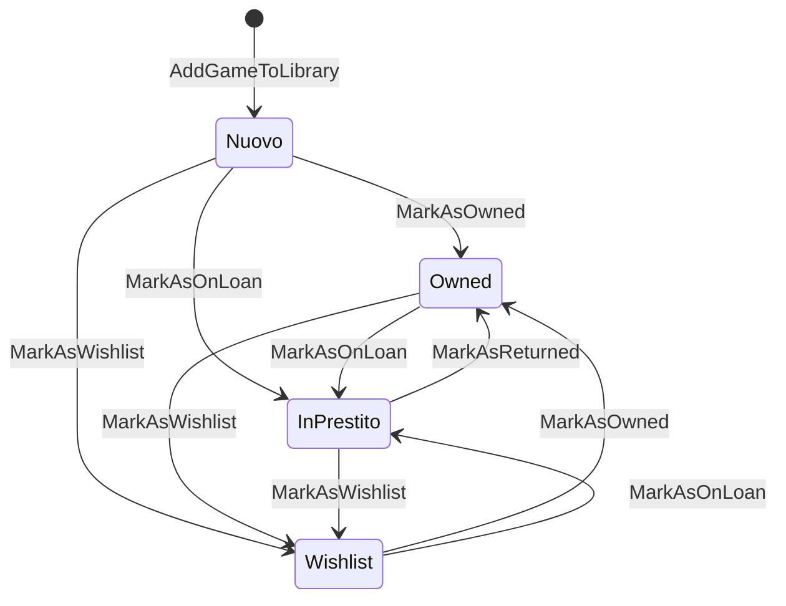

# UserLibrary — GameState Transition Diagram

## Stati

| Valore | Descrizione |
|--------|-------------|
| `Nuovo` | Aggiunto alla libreria, non ancora classificato |
| `Owned` | Posseduto dall'utente |
| `InPrestito` | Prestato a qualcuno (`StateNotes` = nome/contatto debitore) |
| `Wishlist` | Desiderato, non posseduto |

## Diagramma transizioni valide

## Regole

- `StateNotes` (nullable string) contiene le info sul debitore quando lo stato è `InPrestito`
- `ChangedAt` (nullable DateTime) traccia l'ultimo cambio di stato
- Le transizioni non valide lanciano `ConflictException`
- `DeclareOwnership` è ortogonale allo stato: può essere chiamata in qualsiasi stato
