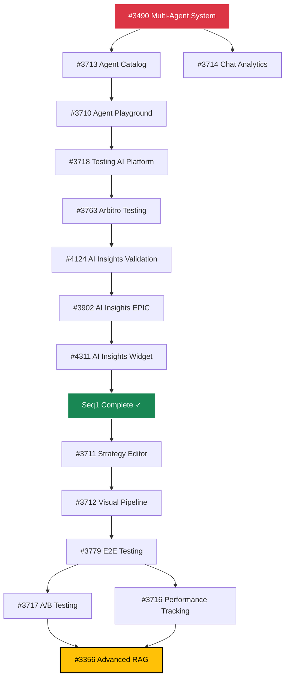

# 🤖 Chat Agent Roadmap - MeepleAI

> **Piano di Implementazione Sistematico per il Sistema Multi-Agent Chat**
>
> **Documento generato:** 2026-02-14
> **Total Issues:** 15 (22% delle 67 issue aperte)
> **Timeline Stimata:** 6-8 settimane (assumendo 2 issue/settimana)

---

## 📊 Executive Summary

Questo roadmap organizza sistematicamente **15 issue critiche** focalizzate sul **chat agent system** in **2 sequenze prioritizzate**:

1. **Sequenza 1 (Foundation):** 9 issue - Sistema chat funzionante MVP
2. **Sequenza 2 (Advanced):** 6 issue - Features avanzate production-ready

**Critical Path:** `#3490 → #3713 → #3710 → #3718 → Sequenza 2`

---

## 🏗️ Sequenza 1: Foundation & Core Infrastructure

**Obiettivo:** Costruire le fondamenta del sistema chat agent con architettura multi-agent, analytics e testing base.

**Issue Count:** 9
**Tipo:** Sequenziale (dipendenze lineari)
**Milestone:** Sistema chat MVP funzionante

### Issue Breakdown

#### 1. 🔴 #3490 - Multi-Agent System (Tutor, Arbitro, Decisore) [EPIC]
- **Priorità:** Critical
- **Tipo:** EPIC
- **Dipendenze:** Blocca tutto
- **Descrizione:** Architettura base del sistema multi-agent con 3 agenti specializzati
- **Link:** [GitHub Issue](https://github.com/DegrassiAaron/meepleai-monorepo/issues/3490)
- **Note:** ⚠️ Issue massive - potenziale collo di bottiglia. Iniziare immediatamente.

#### 2. 🔴 #3713 - Agent Catalog & Usage Stats
- **Priorità:** Critical
- **Dipendenze:** #3490
- **Descrizione:** Registry agenti disponibili con statistiche di utilizzo
- **Link:** [GitHub Issue](https://github.com/DegrassiAaron/meepleai-monorepo/issues/3713)
- **Note:** Necessario per #3710 e #3712. Può essere parallelizzato con #3714.

#### 3. 🔴 #3714 - Chat Analytics
- **Priorità:** Critical
- **Dipendenze:** #3490
- **Descrizione:** Sistema di tracking conversazioni e metriche performance
- **Link:** [GitHub Issue](https://github.com/DegrassiAaron/meepleai-monorepo/issues/3714)
- **Note:** Fondamentale per misurare performance. Può essere parallelizzato con #3713.

#### 4. 🟡 #3710 - Agent Playground
- **Priorità:** Important
- **Dipendenze:** #3713
- **Descrizione:** Testing interface per sviluppatori - sperimentazione agenti
- **Link:** [GitHub Issue](https://github.com/DegrassiAaron/meepleai-monorepo/issues/3710)
- **Note:** Permette validazione rapida durante sviluppo.

#### 5. 🟡 #3718 - Testing - AI Platform
- **Priorità:** Important
- **Dipendenze:** #3710
- **Descrizione:** Test suite base per piattaforma AI
- **Link:** [GitHub Issue](https://github.com/DegrassiAaron/meepleai-monorepo/issues/3718)
- **Note:** ⚠️ Setup CI/CD prima di iniziare.

#### 6. 🟡 #3763 - Arbitro Agent Testing & User Feedback
- **Priorità:** Important
- **Dipendenze:** #3718
- **Descrizione:** Validazione funzionalità agente Arbitro
- **Link:** [GitHub Issue](https://github.com/DegrassiAaron/meepleai-monorepo/issues/3763)
- **Note:** Parte critica del multi-agent system.

#### 7. 🟡 #4124 - AI Insights Runtime Validation
- **Priorità:** Important
- **Dipendenze:** #3763
- **Descrizione:** Performance monitoring e accuracy validation runtime
- **Link:** [GitHub Issue](https://github.com/DegrassiAaron/meepleai-monorepo/issues/4124)
- **Note:** Assicura qualità runtime del sistema AI.

#### 8. 🔴 #3902 - AI Insights & Recommendations [EPIC]
- **Priorità:** Critical
- **Tipo:** EPIC
- **Dipendenze:** #4124
- **Descrizione:** Integrazione sistema insights AI per raccomandazioni intelligenti
- **Link:** [GitHub Issue](https://github.com/DegrassiAaron/meepleai-monorepo/issues/3902)
- **Note:** Rende il chat agent più intelligente.

#### 9. 🟢 #4311 - AI Insights Widget Component
- **Priorità:** Normal
- **Dipendenze:** #3902
- **Descrizione:** UI component per visualizzazione insights AI
- **Link:** [GitHub Issue](https://github.com/DegrassiAaron/meepleai-monorepo/issues/4311)
- **Note:** Completamento Sequenza 1 - sistema MVP pronto.

---

## 🚀 Sequenza 2: Advanced Features & Optimization

**Obiettivo:** Potenziare il sistema con features avanzate, testing completo e strategie RAG ottimizzate.

**Issue Count:** 6
**Tipo:** Misto (alcune parallelizzabili)
**Milestone:** Sistema production-ready con features avanzate

### Issue Breakdown

#### 1. 🟡 #3711 - Strategy Editor
- **Priorità:** Important
- **Dipendenze:** Sequenza 1 completa
- **Descrizione:** UI per configurare strategie RAG personalizzate
- **Link:** [GitHub Issue](https://github.com/DegrassiAaron/meepleai-monorepo/issues/3711)
- **Note:** Permette personalizzazione comportamento agenti.

#### 2. 🟡 #3712 - Visual Pipeline Builder
- **Priorità:** Important
- **Dipendenze:** #3711
- **Descrizione:** Costruzione workflow AI visuali drag-and-drop
- **Link:** [GitHub Issue](https://github.com/DegrassiAaron/meepleai-monorepo/issues/3712)
- **Note:** Feature avanzata per power users.

#### 3. 🔴 #3779 - E2E Testing Suite - All Agent Workflows
- **Priorità:** Critical
- **Dipendenze:** #3712
- **Descrizione:** Validazione end-to-end completa di tutti i workflow agenti
- **Link:** [GitHub Issue](https://github.com/DegrassiAaron/meepleai-monorepo/issues/3779)
- **Note:** Prerequisito per production deployment.

#### 4. 🟢 #3717 - A/B Testing Framework
- **Priorità:** Normal
- **Dipendenze:** #3779
- **Descrizione:** Framework per sperimentazione varianti UI/UX
- **Link:** [GitHub Issue](https://github.com/DegrassiAaron/meepleai-monorepo/issues/3717)
- **Note:** ⚡ Parallelizzabile con #3716 - ottimizzazione continua.

#### 5. 🟢 #3716 - Model Performance Tracking
- **Priorità:** Normal
- **Dipendenze:** #3779
- **Descrizione:** Monitoraggio long-term performance modelli AI
- **Link:** [GitHub Issue](https://github.com/DegrassiAaron/meepleai-monorepo/issues/3716)
- **Note:** ⚡ Parallelizzabile con #3717 - tracking qualità modelli.

#### 6. 🟡 #3356 - Advanced RAG Strategies (9 varianti) [EPIC]
- **Priorità:** Important
- **Tipo:** EPIC
- **Dipendenze:** #3717, #3716
- **Descrizione:** Implementazione 9 strategie RAG avanzate per ottimizzazione retrieval
- **Link:** [GitHub Issue](https://github.com/DegrassiAaron/meepleai-monorepo/issues/3356)
- **Note:** Espande significativamente capacità sistema.

---

## 📈 Dependency Graph



---

## ⚡ Parallelization Opportunities

### Sequenza 1
- **#3713 ∥ #3714** (entrambe dipendono solo da #3490)
  - Agent Catalog + Chat Analytics possono essere sviluppati in parallelo
  - Risparmi stimati: 1 settimana

### Sequenza 2
- **#3717 ∥ #3716** (entrambe dipendono solo da #3779)
  - A/B Testing + Performance Tracking possono essere sviluppati in parallelo
  - Risparmi stimati: 1 settimana

**Total Parallelization Savings:** ~2 settimane (da 8 a 6 settimane totali)

---

## 🎯 Milestones & Checkpoints

### Milestone 1: Multi-Agent Core (Week 1-2)
- ✅ #3490 Multi-Agent System completato
- ✅ #3713 Agent Catalog operativo
- ✅ #3714 Chat Analytics funzionante
- **Checkpoint:** Sistema base può rispondere a query con multi-agent

### Milestone 2: Testing Infrastructure (Week 3-4)
- ✅ #3710 Agent Playground disponibile
- ✅ #3718 Test suite AI Platform completa
- ✅ #3763 Arbitro testing validato
- **Checkpoint:** Sistema testato e validato per sviluppo

### Milestone 3: AI Insights Integration (Week 4-5)
- ✅ #4124 Runtime validation attiva
- ✅ #3902 AI Insights integrato
- ✅ #4311 UI widget funzionante
- **Checkpoint:** Sequenza 1 completa - MVP pronto

### Milestone 4: Advanced Features (Week 6-7)
- ✅ #3711 Strategy Editor configurabile
- ✅ #3712 Visual Pipeline Builder operativo
- ✅ #3779 E2E testing completo
- **Checkpoint:** Features avanzate pronte per utenti power

### Milestone 5: Optimization & Production (Week 7-8)
- ✅ #3717 A/B Testing attivo
- ✅ #3716 Performance tracking in produzione
- ✅ #3356 Advanced RAG implementato
- **Checkpoint:** Sistema production-ready completo

---

## ⚠️ Risks & Mitigation Strategies

### Risk 1: #3490 EPIC Bottleneck
- **Probabilità:** Alta
- **Impatto:** Blocca tutto
- **Mitigazione:**
  - Iniziare immediatamente con focus totale
  - Code review obbligatorio incrementale
  - Spezzare in sub-task più piccole
  - Daily standup per monitoraggio progressi

### Risk 2: Testing Distribuito
- **Probabilità:** Media
- **Impatto:** Rallentamenti Seq1 e Seq2
- **Mitigazione:**
  - Setup CI/CD prima di #3718
  - Test automatici incrementali
  - Testcontainers per test isolati
  - Code coverage minimo 85%

### Risk 3: Scope Creep EPIC #3356
- **Probabilità:** Alta
- **Impatto:** Delay completamento Seq2
- **Mitigazione:**
  - MVP approach: implementare 3 strategie RAG inizialmente
  - Rimanenti 6 strategie in iterazioni successive
  - Feature flag per strategie sperimentali

### Risk 4: Performance Issues AI Runtime
- **Probabilità:** Media
- **Impatto:** Qualità sistema degradata
- **Mitigazione:**
  - #4124 Runtime Validation critico
  - Performance testing con k6
  - Monitoring Prometheus + Grafana
  - Alerting su degradazione performance

---

## 📊 Success Metrics

### Sequenza 1 Complete
- ✅ Sistema chat multi-agent funzionante
- ✅ 3 agenti (Tutor, Arbitro, Decisore) operativi
- ✅ Analytics tracking conversazioni
- ✅ Test coverage ≥ 85%
- ✅ AI Insights integrato e validato

### Sequenza 2 Complete
- ✅ Strategy Editor configurabile
- ✅ Visual Pipeline Builder operativo
- ✅ E2E testing completo tutti workflow
- ✅ A/B testing framework attivo
- ✅ Performance tracking production
- ✅ 9 strategie RAG implementate

### Production Readiness
- ✅ Latenza media < 2s per risposta chat
- ✅ Accuracy agenti > 90%
- ✅ Uptime > 99.5%
- ✅ Test coverage ≥ 90%
- ✅ Zero critical bugs
- ✅ Documentation completa

---

## 📝 Implementation Guidelines

### Pre-Requisites
1. **CI/CD Setup:** GitHub Actions configurato per test automatici
2. **Testing Tools:** Testcontainers, xUnit, Vitest, Playwright
3. **Monitoring:** Prometheus + Grafana per metriche runtime
4. **Load Testing:** k6 per performance testing

### Development Workflow
```bash
# 1. Inizio issue
git checkout main-dev && git pull
git checkout -b feature/issue-{n}-{desc}
git config branch.feature/issue-{n}-{desc}.parent main-dev

# 2. Implementazione
# ... sviluppo ...
dotnet test  # Backend tests
pnpm test    # Frontend tests

# 3. Commit & PR
git add .
git commit -m "feat(chat-agent): {description}"
git push -u origin feature/issue-{n}-{desc}
gh pr create --base main-dev --title "{title}"

# 4. Post-merge cleanup
git checkout main-dev && git pull
git branch -D feature/issue-{n}-{desc}
```

### Quality Gates
- ✅ Code review approval
- ✅ Test coverage ≥ 85%
- ✅ No TypeScript/C# errors
- ✅ Performance regression tests pass
- ✅ Documentation updated

---

## 🔗 Quick Links

- **Roadmap HTML Tracker:** [docs/chat-agent-roadmap.html](./chat-agent-roadmap.html)
- **GitHub Project Board:** [MeepleAI Chat Agent](https://github.com/DegrassiAaron/meepleai-monorepo/projects)
- **Architecture Docs:** [docs/01-architecture/](./01-architecture/)
- **API Documentation:** http://localhost:8080/scalar/v1

---

## 📅 Timeline Overview

```
Week 1-2: Milestone 1 - Multi-Agent Core
├─ #3490 Multi-Agent System (EPIC)
├─ #3713 Agent Catalog (∥ #3714)
└─ #3714 Chat Analytics (∥ #3713)

Week 3-4: Milestone 2 - Testing Infrastructure
├─ #3710 Agent Playground
├─ #3718 Testing AI Platform
└─ #3763 Arbitro Testing

Week 4-5: Milestone 3 - AI Insights Integration
├─ #4124 AI Insights Runtime Validation
├─ #3902 AI Insights & Recommendations (EPIC)
└─ #4311 AI Insights Widget Component

Week 6-7: Milestone 4 - Advanced Features
├─ #3711 Strategy Editor
├─ #3712 Visual Pipeline Builder
└─ #3779 E2E Testing Suite

Week 7-8: Milestone 5 - Optimization & Production
├─ #3717 A/B Testing Framework (∥ #3716)
├─ #3716 Model Performance Tracking (∥ #3717)
└─ #3356 Advanced RAG Strategies (EPIC)
```

---

## 🎉 Success Criteria

### Definition of Done (DoD)
- [ ] Tutte le 15 issue completate e chiuse
- [ ] Test coverage ≥ 90% (backend + frontend)
- [ ] E2E testing completo tutti workflow
- [ ] Performance benchmarks superati
- [ ] Documentation completa e aggiornata
- [ ] Production deployment riuscito
- [ ] User acceptance testing passato
- [ ] Zero critical/high severity bugs

### Production Launch Checklist
- [ ] Monitoring & alerting configurato
- [ ] Backup & disaster recovery testato
- [ ] Security audit completato
- [ ] Load testing superato (1000+ concurrent users)
- [ ] API rate limiting implementato
- [ ] Error tracking (Sentry) attivo
- [ ] Feature flags per gradual rollout
- [ ] Rollback strategy documentata

---

**Generated by:** PM Agent
**Last Updated:** 2026-02-14
**Status:** Planning Phase
**Next Review:** Weekly (ogni venerdì)
