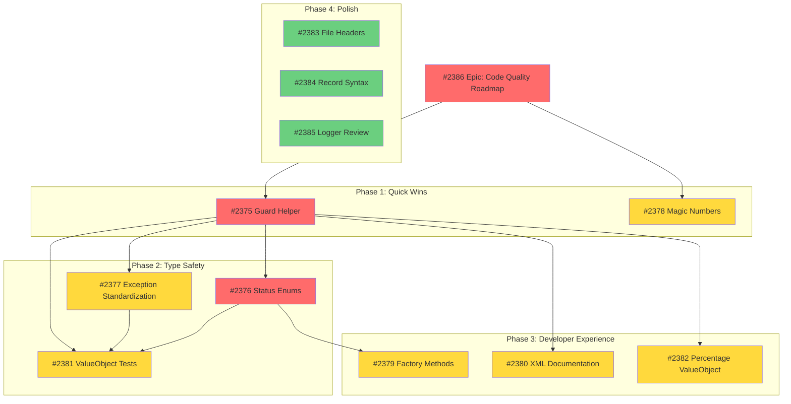

# GitHub Issues Created for Improvement Roadmap

**Date**: 2026-01-12
**Epic Issue**: [#2386 - Code Quality Improvement Roadmap - Q1 2026](https://github.com/DegrassiAaron/meepleai-monorepo/issues/2386)

---

## Issue Overview

Created **9 GitHub issues** organized by priority and phase to track the complete improvement roadmap.

---

## 🔴 HIGH Priority (Phase 1 & 2)

### #2375 - Create Guard Helper Class for ValueObject Validation
**URL**: https://github.com/DegrassiAaron/meepleai-monorepo/issues/2375
**Labels**: enhancement, area/api, backend, priority: high, refactor
**Effort**: 2-3 hours
**Impact**: 20% code reduction, ~150 lines saved
**Phase**: Phase 1 (This Week)

**Summary**: Create SharedKernel/Guards/Guard.cs helper to eliminate repetitive validation logic across 5+ ValueObjects.

---

### #2376 - Introduce Type-Safe Status Enums for ValueObjects
**URL**: https://github.com/DegrassiAaron/meepleai-monorepo/issues/2376
**Labels**: enhancement, area/api, backend, priority: high
**Effort**: 1-2 hours
**Impact**: Compile-time type safety, better IDE experience
**Phase**: Phase 2 (Next Sprint)
**Dependencies**: #2375 (Guard Helper)

**Summary**: Replace string-based status fields ("pass"/"warning"/"fail") with TestSuiteStatus and PerformanceBudgetStatus enums.

---

## 🟡 MEDIUM Priority (Phase 2 & 3)

### #2377 - Standardize Exception Types in ValueObjects
**URL**: https://github.com/DegrassiAaron/meepleai-monorepo/issues/2377
**Labels**: refactor, area/api, backend, priority: medium
**Effort**: 1 hour
**Impact**: Consistent error handling
**Phase**: Phase 2 (Next Sprint)
**Dependencies**: #2375 (Guard Helper)

**Summary**: Standardize on ValidationException for business rule violations across all ValueObjects.

---

### #2378 - Extract Magic Numbers to Named Constants in ValueObjects
**URL**: https://github.com/DegrassiAaron/meepleai-monorepo/issues/2378
**Labels**: refactor, area/api, backend, priority: medium
**Effort**: 30 minutes
**Impact**: Self-documenting code, easier configuration
**Phase**: Phase 1 (This Week)

**Summary**: Extract hardcoded thresholds (2500, 100, 0.1, 90) to named constants with documentation.

---

### #2379 - Add Factory Methods for Common ValueObject Scenarios
**URL**: https://github.com/DegrassiAaron/meepleai-monorepo/issues/2379
**Labels**: enhancement, area/api, backend, priority: medium
**Effort**: 3 hours (1 hour per ValueObject)
**Impact**: Reduced boilerplate, business logic encapsulation
**Phase**: Phase 3 (Sprint +2)
**Dependencies**: #2376 (Status Enums)

**Summary**: Add CreateDefault() and CreateFromTestRun() factory methods to simplify ValueObject creation.

---

### #2380 - Improve XML Documentation for ValueObject Business Logic Methods
**URL**: https://github.com/DegrassiAaron/meepleai-monorepo/issues/2380
**Labels**: documentation, area/docs, area/api, priority: medium
**Effort**: 2 hours
**Impact**: Knowledge preservation, better onboarding
**Phase**: Phase 3 (Sprint +2)

**Summary**: Enhance XML docs with <remarks>, <example>, ADR links for business logic methods.

---

### #2381 - Add Unit Tests for ValueObject Validation Logic
**URL**: https://github.com/DegrassiAaron/meepleai-monorepo/issues/2381
**Labels**: kind/test, area/testing, backend, priority: medium
**Effort**: 4 hours
**Impact**: 90%+ test coverage, regression prevention
**Phase**: Phase 2 (Next Sprint)
**Dependencies**: #2375, #2376, #2377 (all ValueObject improvements)

**Summary**: Create comprehensive unit test suite for all ValueObjects (E2EMetrics, PerformanceMetrics, FileSize, PageCount, PlayTime).

---

### #2382 - Consider Extracting Percentage ValueObject for Type Safety
**URL**: https://github.com/DegrassiAaron/meepleai-monorepo/issues/2382
**Labels**: enhancement, area/api, backend, priority: medium
**Effort**: 2 hours (if implemented)
**Impact**: DRY principle, type safety for percentages
**Phase**: Phase 3 (Sprint +2)
**Decision**: Evaluate only - implement if 5+ percentage fields exist

**Summary**: Extract reusable Percentage ValueObject to eliminate percentage validation duplication.

---

## 🟢 LOW Priority (Phase 4 - Backlog)

### #2383 - Standardize File Header Comments and Namespace Organization
**URL**: https://github.com/DegrassiAaron/meepleai-monorepo/issues/2383
**Labels**: chore, area/api, backend
**Effort**: 10 minutes (automated)
**Impact**: Code style consistency
**Phase**: Phase 4 (Backlog)

**Summary**: Apply .editorconfig rules for consistent file organization.

---

### #2384 - Evaluate Record Syntax for Simple ValueObjects
**URL**: https://github.com/DegrassiAaron/meepleai-monorepo/issues/2384
**Labels**: refactor, area/api, backend
**Effort**: N/A (architectural decision)
**Impact**: Modern C# patterns, less boilerplate
**Phase**: Phase 4 (Backlog)
**Decision**: Requires ADR and team discussion

**Summary**: Evaluate using C# 9+ record syntax for simple ValueObjects to reduce boilerplate.

---

### #2385 - Frontend: Review Logger Configuration Consolidation
**URL**: https://github.com/DegrassiAaron/meepleai-monorepo/issues/2385
**Labels**: refactor, frontend, area/ops
**Effort**: Review only
**Impact**: Logger optimization (if issues found)
**Phase**: Phase 4 (Backlog)

**Summary**: Review logger.ts modification and verify logging configuration best practices.

---

## Issue Dependencies Graph



---

## Implementation Timeline

| Phase | Week | Issues | Effort | Status |
|-------|------|--------|--------|--------|
| **Phase 1** | Week 1 | #2375, #2378 | 3-4 hours | 🔄 In Progress |
| **Phase 2** | Week 2-3 | #2376, #2377, #2381 | 6-7 hours | ⏳ Pending |
| **Phase 3** | Week 4-5 | #2379, #2380, #2382 | 7-8 hours | ⏳ Pending |
| **Phase 4** | Backlog | #2383, #2384, #2385 | 2-3 hours | ⏳ Pending |

**Total**: 3-4 working days across 3-4 weeks

---

## Quick Reference Commands

### Check All Issues
```bash
gh issue list --label "priority: high" --state open
gh issue list --label "priority: medium" --state open
gh issue view 2386  # Epic issue
```

### Start Working on Issue
```bash
# Phase 1 - Guard Helper
gh issue view 2375
git checkout -b feature/issue-2375-guard-helper-class
# Implement, test, commit, PR

# Phase 1 - Magic Numbers
gh issue view 2378
git checkout -b feature/issue-2378-magic-numbers
# Implement, test, commit, PR
```

### Update Progress
```bash
# Mark issue complete
gh issue close 2375 --comment "✅ Implemented Guard helper class. PR #XXXX merged."

# Update epic
gh issue comment 2386 --body "Phase 1 complete: #2375 ✅, #2378 ✅"
```

---

## Notes for Implementation

### Phase 1 Prerequisites
- [x] CLAUDE.md exists
- [x] IMPROVEMENT-RECOMMENDATIONS-2026-01-12.md exists
- [x] Codebase analysis complete
- [x] All issues created and linked

### Testing Strategy
- Run \`dotnet test\` after each phase
- Maintain 90%+ coverage throughout
- Integration tests should pass unchanged
- Frontend TypeScript compilation must pass

### Documentation Updates
- Update CLAUDE.md if patterns change
- Create ADR if architectural decisions made
- Update living documentation after completion

---

**Epic Tracking**: [Issue #2386](https://github.com/DegrassiAaron/meepleai-monorepo/issues/2386)
**Created**: 2026-01-12
**Last Updated**: 2026-01-12
