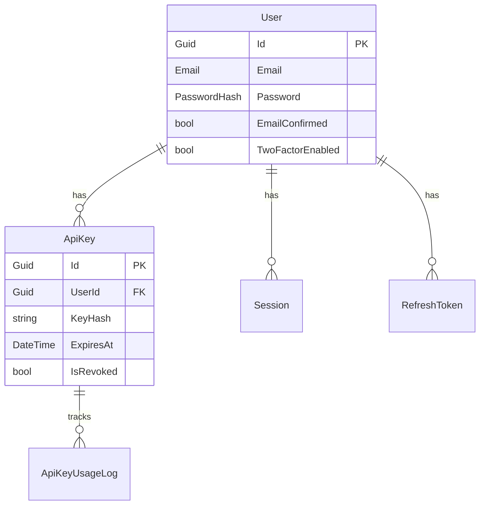

# Documentation Gap Discovery Session

**Date**: 2026-02-07
**Session Type**: Brainstorming & Gap Analysis
**Branch**: main-dev (clean)
**Context**: User request to analyze codebase state, open issues, and documentation gaps

---

## 🎯 Key Insights Discovered

### 1. **MASSIVE Bounded Context Documentation Gap** (93% Undocumented)

**Finding**: Bounded context documentation files are **skeleton templates**, not complete API references.

| Bounded Context | Implemented | Documented | Gap | Gap % |
|-----------------|-------------|------------|-----|-------|
| **SharedGameCatalog** | 234 files | 6 | 228 | 97% |
| **Administration** | 228 files | 6 | 222 | 97% |
| **UserLibrary** | 111 files | 7 | 104 | 94% |
| **KnowledgeBase** | 100+ files | ~10 | ~90 | 90% |
| **DocumentProcessing** | 52 files | 6 | 46 | 88% |
| **Authentication** | 68 files | 10 | 58 | 85% |
| **GameManagement** | 54 files | 11 | 43 | 80% |
| **TOTAL** | **~847** | **~56** | **~791** | **93%** |

**Evidence**:
```bash
# Example: Authentication Context
Implemented Commands (68):
- RegisterCommand, LoginCommand, LogoutCommand
- Enable2FACommand, Verify2FACommand, Disable2FACommand, AdminDisable2FACommand
- GenerateApiKeyCommand, RevokeApiKeyCommand, RotateApiKeyCommand, DeleteApiKeyCommand
- CreateApiKeyManagementCommand, UpdateApiKeyManagementCommand, RevokeApiKeyManagementCommand
- BulkImportApiKeysCommand, BulkExportApiKeysCommand
- CreateSessionCommand, RevokeSessionCommand, ExtendSessionCommand, RevokeInactiveSessionsCommand
- LogoutAllDevicesCommand, RevokeAllUserSessionsCommand
- ChangePasswordCommand, UpdateUserProfileCommand, UpdatePreferencesCommand
- RequestPasswordResetCommand, ResetPasswordCommand
- InitiateOAuthLoginCommand, HandleOAuthCallbackCommand, LinkOAuthAccountCommand, UnlinkOAuthAccountCommand
- VerifyEmailCommand, ResendVerificationCommand
- UnlockAccountCommand
- CreateShareLinkCommand, RevokeShareLinkCommand
- + many more...

Documented Commands (10):
- RegisterCommand ✅
- LoginCommand ✅
- LogoutCommand ✅
- EnableTwoFactorCommand ✅
- VerifyTwoFactorCommand ✅
- GenerateApiKeyCommand ✅
- RevokeApiKeyCommand ✅
- HandleOAuthCallbackCommand ✅
- (2 others)

Missing: 58 commands/queries (~85%)
```

**Impact**:
- New developers cannot discover available API operations
- API surface area unknown without code exploration
- Scalar API docs potentially incomplete
- Onboarding friction significantly increased

---

### 2. **Agent System Architecture Clarity** (POC vs Final)

**Clarification from User**:
- **AgentTypology system** = POC/MVP (temporary, simplified implementation)
- **LangGraph multi-agent** (Tutor/Arbitro/Decisore) = Final architecture (still planned)
- Current status: POC in production, final system pending

**Documentation Status**:
- ✅ LangGraph architecture documented: `docs/02-development/agent-architecture/`
- ❌ AgentTypology POC not documented anywhere
- ❌ Relationship between POC and final system unclear in docs

**Issue Coverage**:
- Issue #3780 "[Integration] Complete Documentation & User Guide"
  - Scope: "all 3 agents" (Tutor, Arbitro, Decisore)
  - Covers: LangGraph final architecture
  - Does NOT cover: AgentTypology POC documentation

---

### 3. **Critical Blockers Identified**

**#3782 - Authentication System Failure** (priority:critical):
- Impact: Login/registration completely broken
- Status: All investigation paths exhausted
- Urgency: IMMEDIATE (blocks system usage)

**#3231 - RAG Validation Blocked**:
- Impact: Cannot validate RAG quality metrics
- Status: ResponseEnded error in AskQuestionQueryHandler
- Urgency: HIGH (blocks Epic #3192 milestone)

---

## 📊 Gap Analysis Summary

### Documentation Gaps NOT Covered by Existing Issues:

**1. Bounded Context API Documentation** (MAJOR)
- **Scope**: Update all 10 bounded context docs with complete command/query lists
- **Effort**: ~791 commands/queries to document
- **Priority**: HIGH (critical for developer onboarding)
- **Existing Issues**: NONE found
- **Recommendation**: Create issue "Complete Bounded Context API Documentation"

**2. AgentTypology POC Documentation** (MEDIUM)
- **Scope**: Document current POC implementation (entities, commands, queries, workflow)
- **Effort**: ~100 files to document
- **Priority**: MEDIUM (clarifies current vs future architecture)
- **Existing Issues**: #3780 covers LangGraph, NOT AgentTypology POC
- **Recommendation**: Create issue "Document AgentTypology POC System" (separate from #3780)

**3. Bounded Context Architecture Diagrams** (MEDIUM)
- **Scope**: Add Mermaid diagrams for entity relationships in each context
- **Effort**: 10 bounded contexts × 1 diagram each
- **Priority**: MEDIUM (visual clarity for architecture understanding)
- **Existing Issues**: NONE found
- **Recommendation**: Create issue "Add Entity Relationship Diagrams to Bounded Contexts"

### Documentation Gaps COVERED by Existing Issues:

**1. Multi-Agent AI System Documentation** (Issue #3780)
- Covers: LangGraph architecture (Tutor, Arbitro, Decisore)
- Scope: Architecture docs, API reference, user guides, admin guides
- Priority: MEDIUM
- Status: OPEN

**2. Troubleshooting Procedures** (Issue #2975)
- Covers: Infrastructure troubleshooting documentation
- Scope: Optional improvement
- Priority: LOW
- Status: OPEN

---

## 🎯 Proposed New Issues

### Issue 1: Complete Bounded Context API Documentation

**Title**: `[Docs] Complete Bounded Context API Documentation - All Commands/Queries`

**Priority**: HIGH

**Labels**: `area/docs`, `kind/docs`, `priority:high`

**Description**:
```markdown
## Problem
Bounded context documentation files (docs/09-bounded-contexts/*.md) only document
~7% of implemented commands/queries, creating significant onboarding friction.

## Scope
Update all 10 bounded context documentation files with complete command/query reference:

1. Authentication: 58 missing commands/queries
2. GameManagement: 43 missing
3. KnowledgeBase: 90+ missing (includes AgentTypology POC)
4. UserLibrary: 104 missing
5. Administration: 222 missing
6. DocumentProcessing: 46 missing
7. SharedGameCatalog: 228 missing
8. SystemConfiguration: TBD
9. UserNotifications: TBD
10. WorkflowIntegration: TBD

**Total**: ~791 commands/queries to document

## Requirements
For each bounded context, document:
- Complete command list with handler and endpoint
- Complete query list with handler and endpoint
- Request/response DTOs reference
- Domain events raised
- Integration points with other contexts

## DoD
- [ ] All commands documented with endpoints
- [ ] All queries documented with endpoints
- [ ] Request/Response schemas included
- [ ] Domain events listed
- [ ] Integration points clarified
- [ ] Examples for common operations
- [ ] Cross-references to related ADRs

## Estimate
- Per context: 1-2 days
- Total: 10-20 days (can be parallelized across contexts)

## Dependencies
None - can start immediately
```

---

### Issue 2: Document AgentTypology POC System

**Title**: `[Docs] Document AgentTypology POC System (Current Implementation)`

**Priority**: MEDIUM

**Labels**: `area/ai`, `area/docs`, `kind/docs`, `priority:medium`

**Description**:
```markdown
## Problem
AgentTypology system is implemented and in production (~100 files) but completely
undocumented. This creates confusion with LangGraph multi-agent architecture
documentation (Issue #3780) which describes the FUTURE system, not current POC.

## Context
- **AgentTypology POC**: Current implementation (Issue #3175)
  - Template-based reusable agent archetypes
  - Approval workflow (Draft → Approved → Active)
  - Session management with game state snapshots

- **LangGraph Multi-Agent**: Future implementation (Issue #3780)
  - Specialized agents: Tutor, Arbitro, Decisore
  - Event-driven orchestration
  - Advanced context engineering

## Scope
Document AgentTypology POC system to clarify current vs future architecture:

1. Update `docs/09-bounded-contexts/knowledge-base.md`:
   - Add AgentTypology entities section
   - Document all AgentTypology commands/queries
   - Add architecture diagram
   - Include usage examples

2. Create `docs/10-user-guides/agent-typology-poc-guide.md`:
   - User guide for creating agent typologies
   - Common POC use cases
   - Limitations vs future LangGraph system

3. Create `docs/02-development/agent-typology-poc-architecture.md`:
   - POC architecture overview
   - Differences from LangGraph final architecture
   - Migration plan POC → LangGraph

4. Update API documentation (Scalar):
   - AgentTypology CRUD endpoints
   - Session management endpoints
   - Testing endpoints

## Requirements
- Clearly label as "POC/MVP implementation"
- Distinguish from LangGraph final architecture (#3780)
- Provide migration timeline POC → LangGraph

## DoD
- [ ] knowledge-base.md includes AgentTypology section
- [ ] User guide for POC created
- [ ] POC architecture documented
- [ ] POC vs LangGraph comparison table
- [ ] Scalar API docs include AgentTypology endpoints
- [ ] Examples for creating custom typologies

## Estimate
3-5 days

## Dependencies
None - can document current implementation immediately

## Related Issues
- #3780: [Integration] Complete Documentation & User Guide (LangGraph)
- #3175: Original AgentTypology POC implementation
```

---

### Issue 3: Add Entity Relationship Diagrams to Bounded Contexts

**Title**: `[Docs] Add Entity Relationship Diagrams to Bounded Context Documentation`

**Priority**: MEDIUM

**Labels**: `area/docs`, `kind/docs`, `priority:medium`, `good-first-issue`

**Description**:
```markdown
## Problem
Bounded context documentation lacks visual entity relationship diagrams,
making it difficult to understand domain models at a glance.

## Scope
Add Mermaid entity relationship diagrams to all 10 bounded context docs:

1. Authentication (User, ApiKey, Session, RefreshToken relationships)
2. GameManagement (Game, PlaySession, GameFaq, RuleSpec relationships)
3. KnowledgeBase (ChatThread, ChatMessage, Agent, AgentSession relationships)
4. UserLibrary (UserLibrary, LibraryGame, WishlistGame relationships)
5. Administration (AuditLog, SystemAlert, User relationships)
6. DocumentProcessing (Document, ExtractionAttempt, Chunk relationships)
7. SharedGameCatalog (SharedGame, SoftDelete audit relationships)
8. SystemConfiguration (ConfigEntry, FeatureFlag relationships)
9. UserNotifications (Notification, NotificationPreference relationships)
10. WorkflowIntegration (Webhook, WorkflowLog relationships)

## Example Diagram (for Authentication):


## Requirements
- Use Mermaid syntax for easy rendering in GitHub
- Include entity properties (PK, FK, key fields)
- Show cardinality relationships (1:1, 1:N, N:M)
- Add diagram to each bounded context .md file

## DoD
- [ ] Diagrams added to all 10 bounded context docs
- [ ] Diagrams render correctly in GitHub
- [ ] Key relationships clearly visible
- [ ] Entity properties included

## Estimate
- Per context: 1-2 hours
- Total: 2-3 days

## Dependencies
None - can start immediately
```

---

## 📋 Recommendations for Issue Creation

Based on user requirements:
> "Dobbiamo creare issue solo su punti della documentazione non ancora implementate o rappresentate da una issue."

### Recommended Issues to Create:

**✅ RECOMMEND CREATING:**

1. **Issue: "Complete Bounded Context API Documentation"**
   - **Reason**: ~791 commands/queries undocumented, NO existing issue covers this
   - **Priority**: HIGH (critical onboarding blocker)
   - **Scope**: All 10 bounded contexts
   - **Effort**: 10-20 days (parallelizable)

2. **Issue: "Document AgentTypology POC System"**
   - **Reason**: AgentTypology POC undocumented, Issue #3780 covers LangGraph NOT POC
   - **Priority**: MEDIUM (clarifies current vs future architecture)
   - **Scope**: KnowledgeBase context + user guides
   - **Effort**: 3-5 days

3. **Issue: "Add Entity Relationship Diagrams to Bounded Contexts"**
   - **Reason**: No visual diagrams exist, NO existing issue covers this
   - **Priority**: MEDIUM (improves comprehension)
   - **Scope**: All 10 bounded contexts
   - **Effort**: 2-3 days

**❌ DO NOT CREATE:**

1. **Multi-Agent AI System Documentation**
   - Reason: Already covered by Issue #3780
   - Covers: LangGraph architecture (Tutor, Arbitro, Decisore)

2. **Infrastructure Troubleshooting**
   - Reason: Already covered by Issue #2975
   - Covers: Optional troubleshooting procedures

---

## 🔍 Additional Context

### Why Bounded Context Docs Are Skeletal

**Current Documentation Pattern**:
- Shows 2-3 example commands (e.g., RegisterCommand, LoginCommand)
- Shows 1-2 example queries (e.g., GetCurrentUserQuery)
- Focuses on domain model entities (User, ApiKey, etc.)
- Provides minimal CQRS examples

**Missing from Documentation**:
- Bulk operations (BulkImportApiKeys, BulkExportApiKeys)
- Management endpoints (UpdateApiKeyManagement, RevokeApiKeyManagement)
- Advanced workflows (Session extension, inactive session cleanup)
- Admin operations (AdminDisable2FA, UnlockAccount)
- OAuth flows (Link, Unlink accounts)
- API usage tracking queries (GetApiKeyUsage, GetApiKeyUsageStats)

**Developer Impact**:
- Must read source code to discover available operations
- Cannot rely on docs for API surface area
- Scalar API docs likely incomplete (if generated from code comments only)

---

### AgentTypology POC vs LangGraph Confusion

**Why This Matters**:
- Issue #3780 describes LangGraph system as "all 3 agents"
- 18 open issues labeled `area/ai` (Arbitro, Decisore, Integration)
- Developers may think AgentTypology IS the final system
- No docs explain POC → LangGraph migration path

**Clarification Needed**:
1. Mark AgentTypology docs as "POC/MVP implementation"
2. State: "This is a simplified POC. Final system will use LangGraph orchestration."
3. Provide migration timeline
4. Link to Issue #3780 for final architecture

---

## 📝 Next Steps (User Decision Required)

### Option A: Comprehensive Documentation Update
**Approach**: Create all 3 recommended issues immediately
**Timeline**: 15-28 days total effort
**Pros**: Complete documentation coverage, clear architecture
**Cons**: Significant time investment

### Option B: Phased Documentation Approach
**Phase 1** (Week 1-2): Document AgentTypology POC + Critical bounded contexts
- Issue 2: AgentTypology POC documentation
- Partial Issue 1: Authentication + KnowledgeBase contexts only

**Phase 2** (Week 3-4): Complete remaining bounded contexts
- Complete Issue 1: Remaining 8 bounded contexts

**Phase 3** (Week 5): Visual enhancements
- Issue 3: Entity relationship diagrams

**Pros**: Incremental progress, prioritized by impact
**Cons**: Longer total timeline

### Option C: Minimal Documentation Update
**Approach**: Create only Issue 2 (AgentTypology POC)
**Timeline**: 3-5 days
**Pros**: Fastest, addresses immediate confusion
**Cons**: Leaves bounded context API gap unresolved

---

## 🤔 Questions for User

To prioritize correctly, I need to understand:

1. **Issue Creation Approval**:
   - Should I create the 3 recommended issues on GitHub?
   - Or do you want to review/modify the issue descriptions first?

2. **Priority Guidance**:
   - Which is more urgent: AgentTypology POC docs or Bounded Context API docs?
   - Should we tackle bounded contexts incrementally or all at once?

3. **Scope Decisions**:
   - Should bounded context docs include ALL commands/queries or just "commonly used" ones?
   - Should we include request/response schema examples for each endpoint?

4. **Timeline Constraints**:
   - Is there a deadline for completing documentation updates?
   - Can we parallelize work across multiple bounded contexts?

5. **AgentTypology POC Status**:
   - When is the migration to LangGraph expected?
   - Should POC docs emphasize temporary nature or treat as stable API?

---

**Session Status**: Analysis complete, awaiting user decision on issue creation
**Artifacts Created**:
- `docs/claudedocs/codebase-gap-analysis-2026-02-07.md` (complete technical report)
- `docs/claudedocs/brainstorming/2026-02-07-documentation-gap-discovery.md` (this file)
