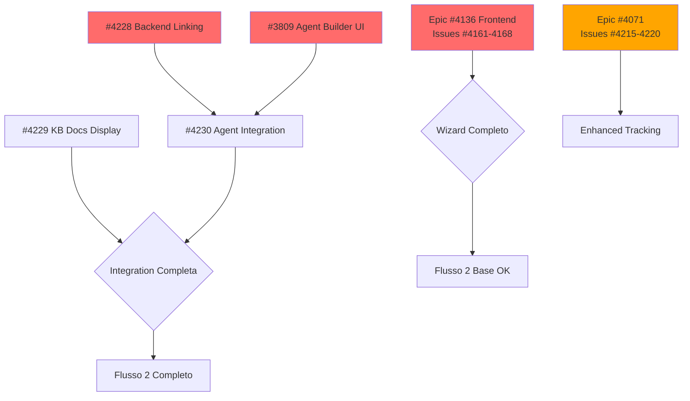

# 🗺️ Roadmap: SharedGame Admin Workflows

**Date:** 2026-02-12
**Goal:** Completare due flussi admin per gestione SharedGame

---

## 🎯 Flussi Target

### Flusso 1: Creazione Manuale (senza PDF)
```
Login Admin → Dashboard → Gestisci SharedGame → Crea Manuale → Visualizza Creato
```
**Status:** ✅ **100% COMPLETO** - Nessuna issue necessaria

### Flusso 2: Creazione con PDF + KB + Agent
```
Login Admin → Dashboard → Gestisci SharedGame →
Upload PDF → Preview → Embedding (progress visibile) →
KB Documents Lista → Crea Agent → Visualizza Creato
```
**Status:** ⚠️ **60% Completo** - 17 issue da completare

---

## 📊 Sequenza Issue per Flusso 2

### **Wave 1: PDF Wizard Frontend** (Epic #4136)
**Objective:** Wizard funzionante con nuovi endpoint API
**Timeline:** 2 settimane | **Priority:** P0 - Critical

| Week | Issue | Descrizione | Dipendenze |
|------|-------|-------------|------------|
| **Week 1** | #4161 | Wizard Container & State | - |
| Week 1 | #4162 | Step 1: Upload PDF | #4161 |
| Week 1 | #4163 | Step 2: Metadata Extraction | #4162 |
| Week 1 | #4166 | Navigation & Progress | #4161 |
| **Week 2** | #4164 | Step 3: BGG Match | #4163 |
| Week 2 | #4165 | Step 4: Enrich & Confirm | #4164 |
| Week 2 | #4167 | Error Handling | #4161-4165 |
| Week 2 | #4168 | E2E Tests | #4161-4167 |

**Deliverable:** Wizard completo che usa `/api/v1/admin/games/wizard/*`

---

### **Wave 2: Agent Integration** (New Issues)
**Objective:** Collegare AI Agent a SharedGame
**Timeline:** 1 settimana | **Priority:** P1 - High

| Day | Issue | Descrizione | Dipendenze |
|-----|-------|-------------|------------|
| **Day 1** | #4228 | Backend Agent Linking | - |
| **Day 2-3** | #3809 | Agent Builder UI | - |
| **Day 4** | #4229 | KB Documents Display | - |
| **Day 5** | #4230 | Agent Integration Frontend | #4228, #3809 |

**Deliverable:** Agent creabile da SharedGame detail, KB docs visibili

---

### **Wave 3: PDF Status Tracking** (Epic #4071)
**Objective:** Real-time tracking embedding pipeline
**Timeline:** 2 settimane | **Priority:** P1 - High (enhancement)

| Week | Issue | Descrizione | Dipendenze |
|------|-------|-------------|------------|
| **Week 1** | #4215 | 7-State Pipeline | - |
| Week 1 | #4216 | Error Handling & Retry | #4215 |
| Week 1 | #4217 | Multi-Location Status UI | #4215 |
| **Week 2** | #4218 | Real-Time Updates (SSE) | #4216, #4217 |
| Week 2 | #4219 | Duration Metrics & ETA | #4216 |
| Week 2 | #4220 | Multi-Channel Notifications | #4216 |

**Deliverable:** Progress tracking granulare con SSE e metriche

---

## 🔄 Dependency Graph



---

## 📅 Timeline Completo

### **Milestone 1: Wizard Funzionante** (Week 1-2)
**Issues:** #4161-4168 (Epic #4136)
**Outcome:** ✅ Upload PDF → Metadata → BGG → Crea SharedGame

### **Milestone 2: Agent Integration** (Week 3)
**Issues:** #4228, #3809, #4229, #4230
**Outcome:** ✅ Crea Agent da SharedGame + KB docs visibili

### **Milestone 3: Enhanced Tracking** (Week 4-5)
**Issues:** #4215-4220 (Epic #4071)
**Outcome:** ✅ Real-time progress + metriche + notifiche

**Total Duration:** 5 settimane (optimistic), 6-7 settimane (realistic)

---

## 🧪 Test Plan Summary

### Flusso 1 (Manuale) - Test Esistenti
- ✅ Unit: CreateSharedGameCommandHandlerTests.cs
- ✅ Integration: SharedGameCatalogEndpointsIntegrationTests.cs
- ❌ E2E: **DA CREARE** (vedi sezione Test Plan)

### Flusso 2 (PDF + KB + Agent) - Test da Completare
- ⏳ Wizard E2E (#4168)
- ⏳ Agent integration E2E (#4230 acceptance)
- ⏳ PDF tracking E2E (Epic #4071)
- ❌ Complete flow E2E: **DA CREARE**

---

## 🎯 Execution Strategy

### **Phase 1: Quick Win** (Flusso 1 validato)
```bash
# Flusso 1 già funziona, creare solo test E2E
→ Issue da creare: E2E test per flusso manuale
→ Estimate: 0.5 giorni
```

### **Phase 2: Critical Path** (Flusso 2 base)
```bash
# Completare wizard + backend linking
→ Epic #4136 frontend (#4161-4168): 2 settimane
→ #4228 backend linking: 1 giorno
→ Flusso 2 base funzionante (senza agent)
```

### **Phase 3: Full Integration** (Flusso 2 completo)
```bash
# Agent builder + integrazioni
→ #3809 Agent Builder: 3 giorni
→ #4229 KB docs: 1 giorno
→ #4230 Agent integration: 2 giorni
→ Flusso 2 completo con agent
```

### **Phase 4: Enhancement** (Opzionale)
```bash
# Real-time tracking e metriche
→ Epic #4071 (#4215-4220): 2 settimane
→ UX migliorata con progress granulare
```

---

## 🚀 Next Actions

1. ✅ Issue create (#4228, #4229, #4230)
2. **Immediate:** Start Epic #4136 frontend (#4161)
3. **Parallel:** Start #4228 backend linking
4. **After #4228:** Start #3809 Agent Builder
5. **Final:** Integrate #4229 + #4230

---

## 📈 Success Metrics

| Metric | Target | Validation |
|--------|--------|------------|
| **Flusso 1 E2E** | Pass | Playwright test green |
| **Wizard funzionante** | 100% | Tutti step completabili |
| **Agent linkabile** | 100% | Create + link + view successful |
| **KB docs visibili** | 100% | Lista populated correttamente |
| **Test coverage** | ≥85% FE, ≥90% BE | Coverage reports |
| **Performance** | PDF <30s | Metrics dashboard |

---

**Last Updated:** 2026-02-12
**Owner:** PM Agent
**Status:** 🔄 In Progress
