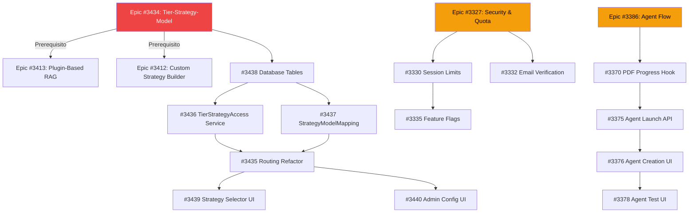

# Sequenza Implementazione Issue - MeepleAI

**Last Updated**: 2026-02-02
**Total Open Issues**: 90+
**Active Epics**: 8

# FLUSSI CRITICI - Sezione da Inserire in Testa a sequenza.md

---

## 🚀 FLUSSI CRITICI - User & Admin Journeys (PRIORITÀ MASSIMA)

**Status**: ✅ Epic e Issue create - Ready for implementation
**Timeline**: 3 weeks con parallelizzazione (vs 7 weeks sequential)
**Efficiency**: 65% time saving (~4 weeks saved)

### Obiettivo

Completare i due flussi end-to-end più critici per user e admin:

1. **FLUSSO ADMIN**: Dashboard → Wizard → Upload PDF → Publish to Shared Library
2. **FLUSSO USER**: Dashboard → Collection → Upload Private PDF → Chat → History

---

### 📅 Week 1 - Fondazioni (Sequential, BLOCKER)

**Prerequisiti per entrambi i flussi**:

| Issue | Titolo                        | Area     | SP  | Status  | Branch |
| :---: | ----------------------------- | -------- | :-: | :-----: | :----: |
| #3324 | SSE Infrastructure            | Backend  |  5  | ✅ Open |   -    |
| #3370 | usePdfProcessingProgress hook | Frontend |  2  | ✅ Open |   -    |

**Totale**: 7 SP, 5-7 giorni
**Critical Path**: SSE blocca progress real-time per PDF e chat

---

### 📅 Week 2 - Parallel Streams (3 stream concorrenti)

#### Stream A - Admin Flow (Epic #3306 estesa)

**Frontend Track**:
| Issue | Titolo | Area | SP | Status |
|:-----:|--------|------|:--:|:------:|
| #3480 | Admin Wizard - Publish to Shared Library | Frontend | 3 | ⬜ Open |
| #3482 | Game Approval Status UI | Frontend | 2 | ⬜ Open |

**Backend Track**:
| Issue | Titolo | Area | SP | Status |
|:-----:|--------|------|:--:|:------:|
| #3481 | SharedGameCatalog Publication Workflow | Backend | 5 | ⬜ Open |

**Totale Stream A**: 10 SP → ~5 giorni (parallelo)

#### Stream B - User Collection (Epic #3475 NUOVA)

**Frontend Track**:
| Issue | Titolo | Area | SP | Status |
|:-----:|--------|------|:--:|:------:|
| #3476 | User Collection Dashboard | Frontend | 5 | ⬜ Open |
| #3477 | Add Game to Collection Wizard | Frontend | 5 | ⬜ Open |

**Backend Track**:
| Issue | Titolo | Area | SP | Status |
|:-----:|--------|------|:--:|:------:|
| #3478 | UserLibraryEntry PDF Association | Backend | 3 | ⬜ Open |
| #3479 | Private PDF Upload Endpoint | Backend | 3 | ⬜ Open |

**Totale Stream B**: 16 SP → ~8 giorni (parallelo)

#### Stream C - Agent Foundation (Epic #3386 parziale)

**Frontend Track**:
| Issue | Titolo | Area | SP | Status |
|:-----:|--------|------|:--:|:------:|
| #3376 | Agent Creation Wizard | Frontend | 5 | ⬜ Open |
| #3375 | Agent Session Launch | Frontend | 3 | ⬜ Open |

**Totale Stream C**: 8 SP → ~8 giorni

**Week 2 Summary**: 34 SP parallelizzati → ~8 giorni (vs 34 giorni sequential)
**Efficiency**: ~70% time saving

---

### 📅 Week 3 - Integration & Chat History (Epic #3386 estesa)

**Dependencies**: Requires Week 2 Stream B (Collection) + Stream C (Agent) complete

**Backend Track**:
| Issue | Titolo | Area | SP | Status |
|:-----:|--------|------|:--:|:------:|
| #3483 | Chat Session Persistence Service | Backend | 5 | ⬜ Open |

**Frontend Track**:
| Issue | Titolo | Area | SP | Status |
|:-----:|--------|------|:--:|:------:|
| #3484 | Chat History Integration | Frontend | 3 | ⬜ Open |

**Totale Week 3**: 8 SP → ~5 giorni (parallelo)

---

### 🎯 Epic Summary - Flussi Critici

#### Epic #3475 (NUOVA): User Private Library & Collections Management

**Link**: https://github.com/DegrassiAaron/meepleai-monorepo/issues/3475
**Obiettivo**: User gestisce collezioni personali con PDF privati

|                                  Issue                                  | Titolo                           | SP  |  Week  |
| :---------------------------------------------------------------------: | -------------------------------- | :-: | :----: |
| [#3476](https://github.com/DegrassiAaron/meepleai-monorepo/issues/3476) | User Collection Dashboard        |  5  | Week 2 |
| [#3477](https://github.com/DegrassiAaron/meepleai-monorepo/issues/3477) | Add Game to Collection Wizard    |  5  | Week 2 |
| [#3478](https://github.com/DegrassiAaron/meepleai-monorepo/issues/3478) | UserLibraryEntry PDF Association |  3  | Week 2 |
| [#3479](https://github.com/DegrassiAaron/meepleai-monorepo/issues/3479) | Private PDF Upload Endpoint      |  3  | Week 2 |

**Totale**: 4 issues, 16 SP
**Spec**: `docs/claudedocs/epic-user-private-library-spec.md`

#### Epic #3306 (ESTESA): Dashboard Hub & Game Management

**Link**: https://github.com/DegrassiAaron/meepleai-monorepo/issues/3306
**Nuove Issue per Admin Flow**:

|                                  Issue                                  | Titolo                                   | SP  |  Week  |
| :---------------------------------------------------------------------: | ---------------------------------------- | :-: | :----: |
| [#3480](https://github.com/DegrassiAaron/meepleai-monorepo/issues/3480) | Admin Wizard - Publish to Shared Library |  3  | Week 2 |
| [#3481](https://github.com/DegrassiAaron/meepleai-monorepo/issues/3481) | SharedGameCatalog Publication Workflow   |  5  | Week 2 |
| [#3482](https://github.com/DegrassiAaron/meepleai-monorepo/issues/3482) | Game Approval Status UI                  |  2  | Week 2 |

**Totale estensione**: 3 issues, 10 SP

#### Epic #3386 (ESTESA): Agent Creation & Testing Flow

**Link**: https://github.com/DegrassiAaron/meepleai-monorepo/issues/3386
**Nuove Issue per Chat History**:

|                                  Issue                                  | Titolo                           | SP  |  Week  |
| :---------------------------------------------------------------------: | -------------------------------- | :-: | :----: |
| [#3483](https://github.com/DegrassiAaron/meepleai-monorepo/issues/3483) | Chat Session Persistence Service |  5  | Week 3 |
| [#3484](https://github.com/DegrassiAaron/meepleai-monorepo/issues/3484) | Chat History Integration         |  3  | Week 3 |

**Totale estensione**: 2 issues, 8 SP

---

### 🏗️ Architecture Highlights

#### Private vs Shared PDF Strategy

```
Shared PDF:  collection = "shared_{gameId}"
Private PDF: collection = "private_{userId}_{gameId}"
```

**Rationale**: Data isolation + code reuse (same processing pipeline)

#### UserLibraryEntry Extension

```csharp
public class UserLibraryEntry {
    public Guid? PrivatePdfId { get; private set; } // NEW
    public bool HasPrivatePdf => PrivatePdfId.HasValue; // NEW
}
```

**Rationale**: Backward compatible, maintains existing relationships

#### Wizard Pattern Reuse

- **Source**: Agent Creation Wizard (#3376)
- **Pattern**: Multi-step + Zustand state + validation
- **Benefits**: Proven pattern, consistent UX, faster development

---

### ✅ Definition of Done - Flussi Critici

#### FLUSSO 1 - Admin

- [ ] Admin può creare gioco da dashboard personale
- [ ] Wizard permette upload PDF principale
- [ ] Gioco pubblicato in SharedGameCatalog con approval status
- [ ] Stato approvazione visualizzabile e gestibile
- [ ] Test E2E: wizard completo → gioco in catalog

#### FLUSSO 2 - User

- [ ] User può visualizzare collezione personale con stats
- [ ] Wizard permette aggiunta gioco con PDF privato
- [ ] PDF associato correttamente a UserLibraryEntry
- [ ] User può creare chat con agente sul gioco
- [ ] Chat salvata automaticamente in history
- [ ] Test E2E: add game → upload PDF → chat → history

#### Cross-Cutting

- [ ] SSE infrastructure funzionante (#3324)
- [ ] Progress PDF real-time visualizzato (#3370)
- [ ] Parallelizzazione backend/frontend verificata
- [ ] Documentation aggiornata (sequenza.md, roadmap.md)
- [ ] Performance: Collection dashboard < 2s, Chat history < 500ms

---

### 📊 Success Metrics

**Coverage**:

- FLUSSO 1 (Admin): 75% → 100% (+25%)
- FLUSSO 2 (User): 40% → 100% (+60%)

**Efficiency**:

- Parallelization: 3 concurrent streams Week 2
- Time-to-completion: ~21 giorni vs 49 giorni sequential
- **Time Saved**: ~28 giorni (~4 weeks, ~65% faster)

**Epic Health**:

- Epic nuova (#3475): 4 issues, 16 SP (focused, manageable)
- Epic estese: +10 SP (#3306), +8 SP (#3386)
- No epic > 60 SP (mantiene dimensioni gestibili)

---

## **NOTE**: Questa sezione va inserita PRIMA della sezione "🎯 PRIORITÀ CORRENTE - Issue Critiche" in `sequenza.md`

## 🎯 PRIORITÀ CORRENTE - Issue Critiche

### 🔥 Critical Path (Da fare SUBITO)

#### Epic #3434: Tier-Strategy-Model Architecture Refactoring

**Prerequisito per**: Plugin-Based RAG (#3413)
**Blocca**: Admin config, Strategy UI improvements

**Sequenza**:

```
Phase 1: Database Foundation
  1. #3438 Add database tables for tier-strategy configuration
     → Create TierStrategyAccess & StrategyModelMapping tables
     → Seed default mappings

Phase 2: Backend Services
  2. #3436 Implement TierStrategyAccess validation service
     → Validate user tier has access to selected strategy

  3. #3437 Implement StrategyModelMapping configuration
     → Map strategy → model with fallbacks

Phase 3: Routing Refactor (CORE)
  4. #3435 Refactor HybridAdaptiveRoutingStrategy
     → Remove tier-based routing
     → Implement strategy-based routing
     → Integrate validation service

Phase 4: Frontend Integration
  5. #3439 Update strategy selector with tier-based filtering
     → Show only available strategies per tier
     → Disable unavailable with tooltip

  6. #3440 Add admin UI for tier-strategy configuration
     → Matrix editor for tier × strategy access
     → Strategy-model mapping editor

Phase 5: Quality Assurance
  7. #3441 Add tests for tier-strategy-model architecture
     → Unit, integration, E2E tests

  8. #3442 Update API documentation
     → OpenAPI spec, architecture docs, admin guide
```

**DoD Epic #3434**: ✅ Architecture corretta: Tier → Strategy → Model

---

## 📦 EPICS - Organizzazione per Funzionalità

### Epic #3327: User Flow Gaps - Security & Quota Enforcement

**Descrizione**: Chiudere i gap di sicurezza e limiti utente
**Priorità**: 🔴 High (Security)

**Issue**:

- #3330 [Security] Session Limits Enforcement (sp:5)
- #3332 [Auth] Email Verification for New Users (sp:5)
- #3335 [Feature Flags] Tier-Based Feature Access (sp:5)
- #3339 [Security] Account Lockout After Failed Login (sp:3)
- #3340 [Security] Login Device Tracking (sp:3)
- #3333 [Admin] PDF Upload Limits Configuration UI (sp:3)
- #3338 [Analytics] AI Token Usage Tracking per User (sp:5)

**Sequenza**:

```
Priority 1: Security Basics
  → #3330 Session Limits
  → #3332 Email Verification
  → #3339 Account Lockout

Priority 2: Feature Control
  → #3335 Feature Flags (Tier-based access)
  → #3333 PDF Upload Limits

Priority 3: Monitoring
  → #3340 Device Tracking
  → #3338 Token Usage Analytics
```

**Total SP**: 27 | **Estimated**: 3-4 weeks

---

### Epic #3325: MeepleCard - Universal Card System

**Descrizione**: Sistema di card universale per games, agents, PDFs
**Priorità**: 🟡 Medium (UI Component)

**Issue**:

- #3326 Core component implementation & refinement (priority-high)
- #3328 Unit tests & accessibility tests
- #3329 Storybook documentation & visual testing
- #3331 Migration: Replace GameCard with MeepleCard
- #3334 Integration with SharedGameCatalog & Dashboard
- #3336 Documentation & usage guide

**Sequenza**:

```
Phase 1: Core Component
  → #3326 Core implementation (includes refinement from /ui feedback)

Phase 2: Testing & Documentation
  → #3328 Tests (unit + a11y)
  → #3329 Storybook visual testing

Phase 3: Integration & Migration
  → #3334 SharedGameCatalog integration
  → #3331 Migrate GameCard → MeepleCard (breaking change)

Phase 4: Documentation
  → #3336 Usage guide & examples
```

**Total SP**: ~15 | **Estimated**: 2-3 weeks

---

### Epic #3341: Game Session Toolkit Phase 2 - Advanced Tools

**Descrizione**: Strumenti avanzati per sessioni di gioco
**Priorità**: 🟡 Medium (Enhancement)

**Issue**:

- #3342 Dice Roller Component & Backend (sp:3)
- #3343 Card Deck System (Standard + Custom) (sp:5)
- #3344 Private Notes with Obscurement (sp:3)
- #3345 Timer, Coin Flip, Wheel Spinner Tools (sp:2)
- #3346 Offline-First PWA with Service Worker (sp:5)
- #3347 Session Sharing (PDF Export, Social) (sp:3)

**Sequenza**:

```
Priority 1: Core Tools
  → #3342 Dice Roller
  → #3344 Private Notes
  → #3345 Timer/Coin/Wheel

Priority 2: Advanced Features
  → #3343 Card Deck System
  → #3347 Session Sharing

Priority 3: PWA
  → #3346 Offline-First (large scope)
```

**Total SP**: 21 | **Estimated**: 3 weeks

---

### Epic #3348: Advanced Features - AI, Admin & Collaboration

**Descrizione**: Feature avanzate per AI, admin tools e collaborazione
**Priorità**: 🟡 Medium (Enhancement)

**Issue**:

- #3349 [Admin] User Impersonation for Support/Debug (sp:3)
- #3350 [Admin] Batch Approval/Rejection for Games (sp:2)
- #3351 [Chat] Voice-to-Text Input for AI Questions (sp:3)
- #3352 [Chat] AI Response Feedback System (sp:3)
- #3353 [Catalog] Similar Games Discovery with RAG (sp:5)
- #3354 [Sessions] Session Invite Links (sp:3)
- #3355 [Editor] Game/Document Version History (sp:3)

**Sequenza**:

```
Priority 1: Admin Tools
  → #3349 User Impersonation
  → #3350 Batch Approval

Priority 2: AI Enhancements
  → #3351 Voice-to-Text
  → #3352 Feedback System
  → #3353 Similar Games RAG

Priority 3: Collaboration
  → #3354 Invite Links
  → #3355 Version History
```

**Total SP**: 22 | **Estimated**: 3 weeks

---

### Epic #3356: Advanced RAG Strategies - 9 Variants

**Descrizione**: Implementare strategie RAG avanzate
**Priorità**: 🟢 Low (Future Enhancement)

**Issue**:

- #3357 Sentence Window RAG (sp:3)
- #3358 Iterative RAG (sp:5)
- #3359 Multi-Agent RAG (sp:5)
- #3360 Step-Back Prompting (sp:3)
- #3361 Query Expansion (sp:3)
- #3362 Multi-Agent RAG (⚠️ DUPLICATO di #3359)
- #3363 RAG-Fusion (sp:5)
- #3364 Step-Back Prompting (⚠️ DUPLICATO di #3360)
- #3365 Query Expansion (⚠️ DUPLICATO di #3361)

**Action Required**: Chiudere #3362, #3364, #3365 come duplicati

**Sequenza** (dopo cleanup):

```
Phase 1: Simple Variants
  → #3357 Sentence Window
  → #3360 Step-Back Prompting
  → #3361 Query Expansion

Phase 2: Complex Variants
  → #3358 Iterative RAG
  → #3359 Multi-Agent RAG
  → #3363 RAG-Fusion
```

**Total SP**: 24 → 16 (dopo rimozione duplicati) | **Estimated**: 2-3 weeks

---

### Epic #3366: Infrastructure Enhancements - Observability & Testing

**Descrizione**: Miglioramenti infrastrutturali per monitoring e testing
**Priorità**: 🟡 Medium (DevOps)

**Issue**:

- #3367 Log Aggregation System (sp:5)
- #3368 k6 Load Testing Infrastructure (sp:3)

**Sequenza**:

```
Phase 1: Observability
  → #3367 Log Aggregation (Loki/ElasticSearch)

Phase 2: Performance Testing
  → #3368 k6 Load Testing setup
```

**Total SP**: 8 | **Estimated**: 1-2 weeks

---

### Epic #3386: Agent Creation & Testing Flow

**Descrizione**: Esperienza completa creazione e testing agenti
**Priorità**: 🔴 Critical (AI Core Feature)

**Issue**:

- #3370 [PDF] usePdfProcessingProgress hook (sp:2) - CRITICAL
- #3372 [Game] Link PDF to Game during creation (sp:3)
- #3373 [Chat] Integrate streaming SSE (sp:3)
- #3374 [PDF] Cancel processing button UI (sp:2)
- #3375 [Agent] Agent Session Launch API Integration (sp:3) - CRITICAL
- #3376 [Agent] Agent Creation with Strategy/Template/Model (sp:5) - CRITICAL
- #3378 [Admin] Agent Test Execution UI (sp:5) - CRITICAL
- #3379 [Admin] Agent Test Results History (sp:5) - CRITICAL
- #3380 [Admin] Strategy Comparison UI (sp:5)
- #3381 [Admin] Typology Approval Workflow (sp:3)
- #3382 [Admin] Agent Metrics Dashboard (sp:5)
- #3383 [Agent] Cost Estimation Preview (sp:3)

**Sequenza**:

```
Phase 1: PDF Processing (Prerequisite)
  → #3370 usePdfProcessingProgress hook
  → #3372 Link PDF to Game
  → #3374 Cancel processing button

Phase 2: Agent Core (CRITICAL PATH)
  → #3375 Agent Session Launch API
  → #3376 Agent Creation UI
  → #3373 Streaming SSE integration

Phase 3: Testing & Validation
  → #3378 Agent Test Execution UI
  → #3379 Test Results History
  → #3383 Cost Estimation Preview

Phase 4: Admin Tools
  → #3380 Strategy Comparison
  → #3381 Typology Approval
  → #3382 Metrics Dashboard
```

**Total SP**: 44 | **Estimated**: 5-6 weeks

---

### Epic #3403: RAG Dashboard Navigation Redesign

**Descrizione**: User Journey Navigation con sidebar, scroll spy, mobile dropdown
**Priorità**: 🟡 Medium (UX Enhancement)

**Issue**:

- #3404 useScrollSpy hook (frontend)
- #3405 DashboardSidebar component (frontend)
- #3406 DashboardNav mobile navigation (frontend)
- #3407 SectionGroup wrapper component (frontend)
- #3408 ProgressIndicator component (frontend)
- #3409 Integrate navigation into RagDashboard (frontend)
- #3410 Tests for navigation components (testing)

**Sequenza**:

```
Phase 1: Core Hook & Layout
  → #3404 useScrollSpy hook
  → #3407 SectionGroup wrapper

Phase 2: Navigation Components
  → #3405 DashboardSidebar (desktop)
  → #3406 DashboardNav (mobile)
  → #3408 ProgressIndicator

Phase 3: Integration & Testing
  → #3409 Integrate into RagDashboard
  → #3410 Navigation tests
```

**Total SP**: ~12 | **Estimated**: 1-2 weeks

---

### Epic #3412: Custom Strategy Builder with Visual Pipeline

**Descrizione**: UI per costruire strategie RAG custom visualmente
**Priorità**: 🟢 Low (Advanced Feature)
**Dipende da**: Epic #3413 (Plugin-Based RAG)

**Note**: Single-issue epic, no children yet

---

### Epic #3413: Plugin-Based RAG Pipeline Architecture

**Descrizione**: Architettura plugin-based per RAG configurabile
**Priorità**: 🟡 Medium (Architecture)
**Prerequisito**: Epic #3434 (Tier-Strategy-Model refactor)

**Issue**: 18 child issues

- #3414 Plugin Contract & Interfaces (medium)
- #3415 DAG Orchestrator (large)
- #3416 Pipeline Definition Schema (medium)
- #3417 Plugin Registry Service (medium)
- #3418 Routing Plugins (medium)
- #3419 Cache Plugins (small)
- #3420 Retrieval Plugins (large)
- #3421 Evaluation Plugins (medium)
- #3422 Generation Plugins (medium)
- #3423 Validation Plugins (medium)
- #3424 Transform/Filter Plugins (medium)
- #3425 Visual Pipeline Builder (large)
- #3426 Plugin Palette Component (medium)
- #3427 Node Configuration Panel (medium)
- #3428 Edge Configuration Panel (small)
- #3429 Pipeline Preview/Test (medium)
- #3430 Plugin Testing Framework (medium)
- #3431 Plugin System Documentation (small)

**Note**: ⚠️ BLOCCATA fino al completamento di Epic #3434

**Total SP**: ~80 | **Estimated**: 8-10 weeks

---

## 🗂️ ALTRE ISSUE (Non Epic)

### Dashboard & Infrastructure

- #3323 [Dashboard Hub] Responsive polish (sp:2, medium)
- #3324 [Infrastructure] SSE real-time dashboard updates (sp:5, high)
- #3384 [Admin] Game Image Upload Component (sp:3, medium)
- #3385 [Admin] BGG Bulk Import Feature (sp:5, medium)

### RAG Documentation & Configuration

- #3398 [RAG Dashboard] Metrics Configuration Form (high)
- #3399 [Docs] RAG Documentation - Data Consistency Audit (medium)
- #3401 [RAG] Documentation Consolidation - Single Source of Truth (high)

---

## 📅 ROADMAP IMPLEMENTAZIONE (Next 3 Months)

### Month 1 (February 2026) - Foundation & Security

**Week 1-2: Epic #3434 - Tier-Strategy-Model Refactor** 🔴 ACTIVE

- ✅ Documentazione completata (rag-data.ts, rag-flow-current.md)
- ✅ Database tables (#3438)
- ✅ Backend services (#3436, #3435) | ⬜ (#3437)
- ✅ Frontend UI (#3439) | ⬜ (#3440)
- ⬜ Testing & docs (#3441, #3442)
- **Priority**: 🔴 CRITICAL (prerequisito per tutto)

**Week 3-4: Epic #3327 - Security & Quota**

- Session limits, email verification (#3330, #3332)
- Account lockout, device tracking (#3339, #3340)
- Feature flags, PDF limits (#3335, #3333)
- Token usage analytics (#3338)

### Month 2 (March 2026) - Core Features

**Week 1-3: Epic #3386 - Agent Creation & Testing**

- PDF processing hooks (#3370, #3372, #3374)
- Agent launch & creation (#3375, #3376, #3373)
- Testing UI & history (#3378, #3379, #3383)
- Admin tools (#3380, #3381, #3382)

**Week 4: Epic #3325 - MeepleCard System**

- Core component implementation (#3326)
- Tests & Storybook (#3328, #3329)
- Initial integration (#3334)

### Month 3 (April 2026) - Advanced Features

**Week 1-2: Epic #3341 - Game Session Toolkit Phase 2**

- Dice roller, notes, timer (#3342, #3344, #3345)
- Card deck system (#3343)
- Session sharing (#3347)

**Week 3: Epic #3403 - RAG Dashboard Navigation**

- Sidebar & scroll spy (#3404, #3405, #3407)
- Mobile nav & integration (#3406, #3409)
- Testing (#3410)

**Week 4: Epic #3348 - Advanced Features**

- Admin tools (#3349, #3350)
- AI enhancements (#3351, #3352, #3353)
- Collaboration (#3354, #3355)

### Month 4+ (May 2026+) - Architecture & Advanced

**Epic #3413: Plugin-Based RAG** (AFTER #3434 complete)

- Backend plugins (#3414-#3424)
- Frontend builder (#3425-#3429)
- Testing & docs (#3430, #3431)

**Epic #3356: Advanced RAG Strategies**

- Simple variants (#3357, #3360, #3361)
- Complex variants (#3358, #3359, #3363)

---

## 🎯 CRITICAL PATH - Dipendenze



---

## 📊 STATISTICHE

### Per Priorità

- 🔴 **Critical**: 12 issue
  - Epic #3434 (8 issue)
  - Epic #3386 (4 issue core: #3370, #3375, #3376, #3378)
- 🟡 **High**: 15 issue
  - Epic #3327 (7 issue)
  - RAG docs (#3398, #3401)
  - MeepleCard (#3326)
- 🟢 **Medium**: 50+ issue
- ⚪ **Low**: 15+ issue

### Per Area

- **Frontend**: 45+ issue
- **Backend**: 35+ issue
- **Database**: 5 issue
- **Testing**: 8 issue
- **Documentation**: 6 issue
- **Infrastructure**: 5 issue

### Per Epic Status

- ✅ **Documentazione Completata**: Epic #3434 (fase docs)
- 🔵 **Ready to Start**: Epic #3327, #3386, #3325
- ⏸️ **Blocked**: Epic #3413, #3412 (waiting for #3434)
- 🟢 **Future**: Epic #3356, #3366

### Story Points per Epic

- **Epic #3434**: 24 SP → 1-2 weeks (docs ✅)
- **Epic #3327**: 27 SP → 3-4 weeks
- **Epic #3386**: 44 SP → 5-6 weeks
- **Epic #3325**: 15 SP → 2-3 weeks
- **Epic #3341**: 21 SP → 3 weeks
- **Epic #3413**: 80+ SP → 8-10 weeks (AFTER #3434)
- **Epic #3403**: 12 SP → 1-2 weeks
- **Epic #3348**: 22 SP → 3 weeks

**Total Visible**: ~240 SP | **Estimated**: 5-7 months

---

## 🚀 NEXT ACTIONS

### This Week (Week of Feb 2-9, 2026)

#### Day 1-2: Epic #3434 Foundation

1. ✅ Commit documentazione (rag-data.ts, rag-flow-current.md)
2. ✅ Start #3438 Database tables
   - Create migration for TierStrategyAccess & StrategyModelMapping
   - Seed default tier-strategy mappings
   - **Blocca**: Tutti gli altri task di #3434

#### Day 3-4: Epic #3434 Backend Services

3. ✅ Implement #3436 TierStrategyAccess validation
4. ✅ Implement #3437 StrategyModelMapping configuration
   - **Dipende da**: #3438 completato

#### Day 5: Epic #3434 Routing Refactor

5. ✅ Start #3435 HybridAdaptiveRoutingStrategy refactor
   - Remove tier-based routing
   - Implement strategy-based routing
   - **Dipende da**: #3436, #3437 completati

### Next Week (Week of Feb 10-16, 2026)

#### Epic #3434 Completion

6. ⬜ Complete #3435 + unit tests
7. ✅ Implement #3439 Strategy selector UI (PR #3474)
8. ⬜ Implement #3440 Admin config UI
9. ⬜ Complete #3441 Testing
10. ⬜ Finalize #3442 Documentation

#### Start Epic #3327 (Security)

11. ⬜ Plan security implementation approach
12. ⬜ Start #3330 Session Limits

---

## ⚠️ ISSUE DA RISOLVERE

### Duplicati da Chiudere

- #3362 → Duplicate of #3359 (Multi-Agent RAG)
- #3364 → Duplicate of #3360 (Step-Back Prompting)
- #3365 → Duplicate of #3361 (Query Expansion)

**Action**: Close as duplicate con riferimento all'issue originale

### Issue da Consolidare

Creare Epic "Dashboard & Admin Tools" per:

- #3323 Dashboard Hub polish
- #3324 SSE real-time updates
- #3384 Game Image Upload
- #3385 BGG Bulk Import
- #3398 RAG Metrics Config

---

## 📈 PROGRESS TRACKING

### Epic #3434: Tier-Strategy-Model Refactoring

- [x] Documentation phase (rag-data.ts, rag-flow-current.md)
- [x] Database phase (#3438)
- [x] Backend services (#3436) | [ ] (#3437)
- [x] Routing refactor (#3435)
- [x] Frontend UI (#3439) | [ ] (#3440)
- [ ] Testing (#3441)
- [ ] Documentation finalization (#3442)

**Progress**: 5/8 tasks (62.5%) | **Status**: 🔵 In Progress

### Epic #3327: Security & Quota

**Progress**: 0/7 tasks (0%) | **Status**: ⏸️ Not Started

### Epic #3386: Agent Creation Flow

**Progress**: 0/12 tasks (0%) | **Status**: ⏸️ Not Started

---

## 🎯 SUCCESS METRICS

### Weekly Targets

- **Sprint Velocity**: 20-25 SP/week (2 developers)
- **Epic Completion**: 1 epic ogni 2-3 weeks
- **Issue Close Rate**: 5-8 issue/week

### Quality Gates

- **Test Coverage**: 85%+ frontend, 90%+ backend
- **Code Review**: All PRs reviewed prima del merge
- **Documentation**: Updated prima di chiudere epic
- **Breaking Changes**: Migration guide obbligatoria

### Current Sprint (Feb 2-16)

- **Target**: Complete Epic #3434 (24 SP)
- **Stretch**: Start Epic #3327 (27 SP)

---

**Maintainer**: PM Agent + Claude Code
**Review Frequency**: Bi-weekly
**Last Major Update**: 2026-02-02 (Added Epic #3434, reorganized structure)
