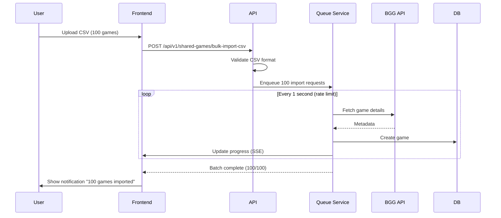

# Variant C Enhanced: Import Wizard + Bulk Import + Advanced Search

**Created**: 2026-02-04
**Mockup**: `docs/mockups/admin-shared-games-variant-c-enhanced.html`
**Epic**: #3532

---

## 🎯 User Requirements (Refined)

### **1. Import Game Workflow** (Wizard Multi-Step)

**Flow**:
```
Step 1: Search BGG
  → User enters game title or BGG ID
  → System searches BGG API
  → Shows results list with thumbnails
  → User selects game from results

Step 2: Confirm Details
  → Shows fetched metadata (title, year, players, etc.)
  → User can review before importing
  → Checkbox: "Auto-submit for approval"

Step 3: Upload PDF (Optional)
  → Game already created in database
  → User can upload rulebook PDF immediately
  → OR skip and add PDFs later
```

**Key Features**:
- ✅ **BGG Search** before import (not just ID entry)
- ✅ **Multi-step wizard** with progress indicator
- ✅ **Results selection** (handles multiple matches)
- ✅ **Immediate PDF upload** option (wizard step 3)
- ✅ **Skip-able** (can add PDFs later)

---

### **2. Bulk Import via CSV**

**CSV Format**:
```csv
bgg_id,game_name
13,Catan
68448,7 Wonders
266192,Wingspan
167791,Terraforming Mars
120677,Terra Mystica
```

**Requirements**:
- ✅ Upload CSV file (max 1000 games per batch)
- ✅ Parse CSV: `bgg_id` (int), `game_name` (string)
- ✅ Validate CSV format before processing
- ✅ **Global BGG rate limit queue** (1 req/sec)
- ✅ Background processing with progress tracking
- ✅ Notification when batch complete

**Rate Limit Queue**:
- **Global singleton queue** (not per-user)
- All BGG requests (single + bulk) go through queue
- Rate: 1 request/second (BGG API limit)
- Estimated time: 100 games = ~2 minutes
- UI shows: position in queue, ETA, progress %

---

### **3. Advanced Search (Improved)**

**Current Search** (Basic):
- Single input box
- Text search only

**Enhanced Search** (Required):
- **Multi-field search**: Title, BGG ID, Publisher, Designer
- **Active filters display** (chips showing applied filters)
- **Quick filter chips**: Has PDFs, No PDFs, Recent, Urgent
- **Status filters**: Pending, Draft, Published (toggle multiple)
- **Real-time search** (debounced 300ms)
- **Search suggestions** (autocomplete from existing games)
- **Clear filters** button

**Filter Chip System**:
```
Active Filters:
[All Games ▼] [Has PDFs] [Pending (23)] [Recent] [× Clear All]
```

---

## 🏗️ Technical Architecture Updates

### **Frontend Components (New)**

```typescript
// Wizard Components
components/admin/shared-games/
├── ImportWizard/
│   ├── ImportWizardModal.tsx         // Main wizard container
│   ├── Step1SearchBgg.tsx            // BGG search with results
│   ├── Step2ConfirmDetails.tsx       // Metadata review
│   ├── Step3UploadPdf.tsx            // Optional PDF upload
│   └── WizardProgress.tsx            // Step indicator

// Bulk Import
├── BulkImport/
│   ├── BulkImportModal.tsx           // CSV upload modal
│   ├── CsvPreview.tsx                // CSV validation preview
│   └── ImportQueueModal.tsx          // Queue status viewer

// Advanced Search
├── AdvancedSearch/
│   ├── SearchBar.tsx                 // Main search input
│   ├── FilterChips.tsx               // Active filters display
│   ├── SearchSuggestions.tsx         // Autocomplete dropdown
│   └── QuickFilters.tsx              // Preset filter buttons
```

### **Backend Services (New)**

```csharp
// BGG Queue Service
Infrastructure/Services/
├── BggImportQueueService.cs
    ├── EnqueueImportRequest()
    ├── ProcessQueue() // Background worker
    ├── GetQueueStatus()
    └── CancelImport()

// Application Layer
Application/Commands/
├── BulkImportGamesFromCsvCommand.cs
├── BulkImportGamesFromCsvCommandHandler.cs
├── SearchBggGamesCommand.cs          // NEW: Search BGG by title
├── SearchBggGamesCommandHandler.cs
```

### **Database Schema Updates**

```sql
-- New table: BGG Import Queue
CREATE TABLE BggImportQueue (
    Id UUID PRIMARY KEY,
    BggId INT NOT NULL,
    GameName VARCHAR(255),
    Status VARCHAR(50), -- Queued, Processing, Completed, Failed
    Position INT,
    RequestedBy UUID,
    RequestedAt TIMESTAMP,
    ProcessedAt TIMESTAMP,
    ErrorMessage TEXT,
    CreatedGameId UUID -- FK to SharedGameEntity
);

-- Index for queue ordering
CREATE INDEX idx_bgg_queue_status_position
ON BggImportQueue(Status, Position);
```

---

## 🔄 Import Workflow Detailed

### **Single Import Wizard**

```mermaid
sequenceDiagram
    participant U as User
    participant UI as Frontend
    participant API as API
    participant BGG as BGG API
    participant Q as Queue Service
    participant DB as Database

    U->>UI: Click "Import"
    UI->>U: Show Wizard Step 1

    U->>UI: Enter "Catan"
    UI->>API: POST /api/v1/bgg/search?query=Catan
    API->>BGG: Search games (via queue)
    BGG-->>API: Results [Catan, Catan Cities, Catan Seafarers]
    API-->>UI: Display results
    U->>UI: Select "Catan (BGG: 13)"

    UI->>U: Show Wizard Step 2 (Confirm)
    U->>UI: Click "Confirm"

    UI->>API: POST /api/v1/shared-games/import-from-bgg {bggId: 13}
    API->>Q: Enqueue import request
    Q->>BGG: Fetch game details (rate limited)
    BGG-->>Q: Game metadata
    Q->>DB: Create SharedGameEntity (status: Pending)
    DB-->>API: Created game {id}
    API-->>UI: Game created {id, status: "Pending"}

    UI->>U: Show Wizard Step 3 (Upload PDF)
    U->>UI: Upload PDF or Skip

    Note: If upload
    UI->>API: POST /api/v1/shared-games/{id}/documents
    API->>DB: Save document (status: Awaiting Approval)
```

### **Bulk Import CSV**



---

## 📊 BGG Rate Limit Queue Logic

### **Queue Requirements**

**Global Singleton**:
- Single queue instance across all users
- FIFO processing (first in, first out)
- Rate: 1 request/second (configurable)
- Automatic retry on failures (3 attempts)
- Persistent (survives server restart)

**Queue States**:
```
Queued → Processing → Completed
         ↓ (if error after 3 retries)
        Failed
```

**Queue Item Structure**:
```typescript
interface BggQueueItem {
  id: string;
  bggId: number;
  gameName?: string;
  status: 'Queued' | 'Processing' | 'Completed' | 'Failed';
  position: number;
  requestedBy: string;
  requestedAt: Date;
  processedAt?: Date;
  errorMessage?: string;
  createdGameId?: string;
}
```

**Queue Service API**:
```csharp
public interface IBggImportQueueService
{
    Task<Guid> EnqueueImport(int bggId, string? gameName, Guid userId);
    Task<List<BggQueueItem>> GetQueueStatus();
    Task<int> GetQueuePosition(Guid queueItemId);
    Task<TimeSpan> GetEstimatedWait(Guid queueItemId);
    Task CancelImport(Guid queueItemId);
}
```

---

## 🔍 Advanced Search Specification

### **Search Features**

**1. Multi-Field Search**:
```typescript
interface SearchQuery {
  query: string;           // Full-text search
  bggId?: number;          // Exact BGG ID match
  status?: string[];       // Multiple statuses
  hasPdfs?: boolean;       // Filter by PDF presence
  submittedBy?: string;    // Filter by user
  dateRange?: {            // Date range filter
    from: Date;
    to: Date;
  };
}
```

**2. Real-Time Search**:
- Debounced 300ms (prevents excessive API calls)
- Shows loading indicator during search
- Updates URL params (shareable search links)

**3. Filter Chips UI**:
```
Search: "wing" → Results: 47 games

Active Filters:
[Pending (23)] [Has PDFs] [Recent] × Clear

Quick Filters:
[ All ] [ Pending ] [ Draft ] [ Published ]
[ Has PDFs ] [ No PDFs ] [ Urgent (>7d) ]
```

**4. Search Suggestions**:
- Autocomplete from existing game titles
- Recent searches (localStorage)
- Popular games
- BGG ID suggestions (if numeric input)

---

## 🎨 UI/UX Enhancements

### **Import Dropdown Menu**
```
[Import ▼] Button shows:
├─ 🔍 Search & Import from BGG
├─ ─────────────────────────
├─ 📄 Bulk Import (CSV)
└─ ⏱️ View Import Queue (12) [badge]
```

### **Wizard Progress Indicator**
```
Step Circles:
● Search BGG (active: orange, completed: green)
○ Confirm Details
○ Upload PDF
```

### **Import Queue Viewer**
```
Overall Progress: 7/12 games imported [████████░░░░] 58%
ETA: ~5 seconds

Queue Items:
✅ 1. Catan - Completed 2 min ago
⏳ 2. Wingspan - Processing... (BGG: 266192)
   3. Terraforming Mars - Queued
   4. Terra Mystica - Queued
```

### **Advanced Search UI**
```
[🔍 Search by title, BGG ID, publisher...]

Active Filters:
[All Games ▼] [Has PDFs] [× Remove]

Quick Filters:
[●Pending (23)] [●Draft (142)] [●Published (2682)]
[Has PDFs] [No PDFs] [Recent] [Urgent >7d]
```

---

## 📋 Updated Implementation Checklist

### **Issue #3533 (Backend) - Additional Work**

**Add**:
- [ ] Create `BggImportQueueService` (singleton background worker)
- [ ] Create `SearchBggGamesCommand` (search by title, not just ID)
- [ ] Create `BulkImportGamesFromCsvCommand` (CSV parsing + queuing)
- [ ] Add `BggImportQueue` database table
- [ ] Implement rate limiting (1 req/sec globally)
- [ ] Add SSE endpoint for queue progress updates
- [ ] Write integration tests for queue service

### **Issue #3535 (Import Modal) - Split into Wizard**

**Rename to**: "[Frontend] Import Wizard - Multi-Step BGG Import"

**Components**:
- [ ] `ImportWizardModal.tsx` (3-step wizard container)
- [ ] `Step1SearchBgg.tsx` (search + results selection)
- [ ] `Step2ConfirmDetails.tsx` (metadata review)
- [ ] `Step3UploadPdf.tsx` (optional PDF upload)
- [ ] `WizardProgress.tsx` (step indicator)
- [ ] `BulkImportModal.tsx` (CSV upload)
- [ ] `ImportQueueModal.tsx` (queue status viewer)

### **Issue #3534 (Dashboard) - Enhanced Search**

**Add**:
- [ ] `AdvancedSearchBar.tsx` (multi-field search)
- [ ] `FilterChipsRow.tsx` (active filters display)
- [ ] `QuickFilterButtons.tsx` (preset filters)
- [ ] `SearchSuggestions.tsx` (autocomplete)
- [ ] Debounced search (300ms)
- [ ] URL param sync (shareable search)

---

## 🚀 New Features Summary

| Feature | Description | Complexity |
|---------|-------------|------------|
| **Import Wizard** | 3-step: Search → Confirm → Upload PDF | High |
| **BGG Search** | Search by title, not just ID | Medium |
| **Bulk Import CSV** | Upload CSV, queue processing | High |
| **Global Queue** | Singleton BGG rate limit manager | High |
| **Queue Viewer** | Real-time queue status UI | Medium |
| **Advanced Search** | Multi-field, filters, autocomplete | Medium |
| **Filter Chips** | Active filters display | Low |
| **SSE Progress** | Real-time queue updates | Medium |

---

## 📐 Layout Specifications (Variant C)

### **Screen Dimensions**

```
Layout:
┌─────────────────────────────────────────────────┐
│  Top Bar (72px height)                          │
│  [Logo] [Breadcrumbs] [Import ▼] [New]         │
├──────────────┬──────────────────────────────────┤
│  Master      │  Detail Pane                     │
│  Pane        │                                  │
│  420px width │  Flexible width                  │
│              │                                  │
│  [Search]    │  [Selected Game Details]         │
│  [Filters]   │  [Documents Section]             │
│              │  [Admin Actions]                 │
│  [Game List] │                                  │
│  (scrollable)│  (scrollable)                    │
└──────────────┴──────────────────────────────────┘
```

### **Component Sizes**

| Element | Dimensions | Notes |
|---------|-----------|-------|
| Top Bar | Full width × 72px | Sticky |
| Master Pane | 420px × 100vh | Fixed width, scrollable |
| Detail Pane | Flexible × 100vh | Max-width 900px content |
| List Thumbnail | 70×70px | Compact for list |
| Detail Image | 180×180px | Large for detail view |
| Search Input | 100% × 40px | Full width of master |
| Filter Chip | Auto × 32px | Inline, wrappable |

---

## 🎨 Design Rationale (Variant C Choice)

**Why Split-Pane for Admin Workflow**:

✅ **Focused Review**: Admin reviews one game at a time deeply
✅ **No Modal Interruptions**: Detail always visible (faster workflow)
✅ **Sequential Approval**: Natural prev/next navigation in list
✅ **PDF Management**: Large space for document operations
✅ **Keyboard Friendly**: Arrow keys navigate list, Tab through actions
✅ **Context Preservation**: Selected game stays visible while scrolling list

**Trade-offs Accepted**:
- ⚠️ Master list limited to 420px (fewer games visible at once)
- ⚠️ Not ideal for comparing multiple games side-by-side
- ⚠️ Mobile requires single-pane mode (complexity)

**Mitigations**:
- Advanced search compensates for smaller list
- Filter chips make navigation efficient
- Detail pane scroll-to-top on selection

---

## 📊 Import Queue Implementation

### **Background Worker (C#)**

```csharp
public class BggImportQueueBackgroundService : BackgroundService
{
    private readonly Channel<BggImportRequest> _channel;
    private readonly IBggApiService _bggApi;
    private readonly ISharedGameRepository _gameRepo;

    protected override async Task ExecuteAsync(CancellationToken ct)
    {
        await foreach (var request in _channel.Reader.ReadAllAsync(ct))
        {
            try
            {
                // Fetch from BGG
                var details = await _bggApi.GetGameDetailsAsync(request.BggId, ct);

                // Create game
                var game = MapToSharedGame(details, request.UserId);
                await _gameRepo.AddAsync(game, ct);

                // Update queue status
                await UpdateQueueStatus(request.Id, "Completed", game.Id);

                // Wait 1 second (rate limit)
                await Task.Delay(1000, ct);
            }
            catch (Exception ex)
            {
                await UpdateQueueStatus(request.Id, "Failed", errorMessage: ex.Message);
            }
        }
    }
}
```

### **Queue Endpoints**

```csharp
// Get queue status
GET /api/v1/admin/bgg-import-queue
Response: {
  totalQueued: 12,
  currentPosition: 2,
  itemsProcessed: 7,
  estimatedWaitSeconds: 5,
  items: [...]
}

// Enqueue import (used by wizard and bulk)
POST /api/v1/admin/bgg-import-queue
Body: { bggId, gameName?, userId }
Response: { queueItemId, position, eta }

// SSE endpoint for real-time updates
GET /api/v1/admin/bgg-import-queue/stream
```

---

## 🧪 Testing Scenarios

### **Import Wizard Tests**

```typescript
test('Import wizard - full flow', async ({ page }) => {
  // Step 1: Search
  await page.click('[data-testid="import-btn"]');
  await page.fill('[data-testid="bgg-search"]', 'Catan');
  await page.waitForSelector('.bgg-result-item');
  await page.click('.bgg-result-item:first-child');
  await page.click('button:has-text("Next")');

  // Step 2: Confirm
  await expect(page.locator('h3:has-text("Catan")')).toBeVisible();
  await page.click('button:has-text("Confirm")');

  // Step 3: Upload PDF
  await page.setInputFiles('[data-testid="pdf-upload"]', 'test.pdf');
  await expect(page.locator('[data-testid="upload-success"]')).toBeVisible();
});
```

### **Bulk Import Tests**

```typescript
test('Bulk import CSV with queue', async ({ page }) => {
  await page.click('[data-testid="bulk-import-btn"]');
  await page.setInputFiles('[data-testid="csv-upload"]', 'games.csv');
  await page.click('button:has-text("Start Bulk Import")');

  // Verify queue modal opens
  await expect(page.locator('text=BGG Import Queue')).toBeVisible();

  // Verify progress updates (SSE)
  await expect(page.locator('text=7 / 100')).toBeVisible({ timeout: 10000 });
});
```

### **Advanced Search Tests**

```typescript
test('Advanced search with filters', async ({ page }) => {
  await page.goto('/admin/shared-games');

  // Search
  await page.fill('[data-testid="search-input"]', 'wing');
  await page.waitForTimeout(350); // Debounce

  // Apply filters
  await page.click('button:has-text("Pending")');
  await page.click('button:has-text("Has PDFs")');

  // Verify URL params
  expect(page.url()).toContain('?search=wing&status=pending&hasPdfs=true');

  // Verify results
  await expect(page.locator('.list-item')).toHaveCount(2);
});
```

---

## 🎯 Acceptance Criteria (Updated)

### **Epic #3532 - Additional Criteria**

- [ ] Import wizard supports 3-step flow (search → confirm → upload)
- [ ] BGG search returns multiple results for selection
- [ ] Bulk CSV import queues games automatically
- [ ] Global BGG rate limit enforced (1 req/sec)
- [ ] Import queue shows real-time progress (SSE)
- [ ] Advanced search supports multi-field queries
- [ ] Filter chips display active filters
- [ ] Search suggestions show autocomplete
- [ ] Queue persists across server restarts
- [ ] Failed imports show retry option

---

## 📁 Files Updated

**Mockups**:
- ✅ `docs/mockups/admin-shared-games-variant-c-enhanced.html` (NEW - Primary)
- ✅ `docs/mockups/admin-shared-games-variant-b-table.html` (Alternative)
- ✅ `docs/mockups/admin-shared-games-meepleai.html` (Original Variant A)

**Documentation**:
- ✅ `docs/claudedocs/variant-c-enhanced-specification.md` (This file)
- ✅ `docs/mockups/design-variants-comparison.md` (Comparison guide)

**Epic Updated**:
- Issue #3532 will be updated with new requirements

---

## 🚀 Next Actions

1. **Review mockup**: Open `admin-shared-games-variant-c-enhanced.html`
2. **Update Epic #3532**: Add wizard + bulk import + queue requirements
3. **Update Issue #3533**: Add queue service, search endpoint
4. **Update Issue #3535**: Split into wizard components
5. **Update Issue #3534**: Add advanced search specification
6. **Create new issue**: BGG Rate Limit Queue Service (backend)

---

**Status**: ✅ Mockup complete, ready for issue updates
