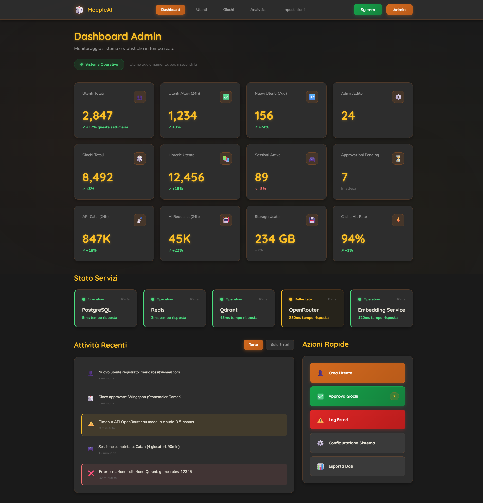
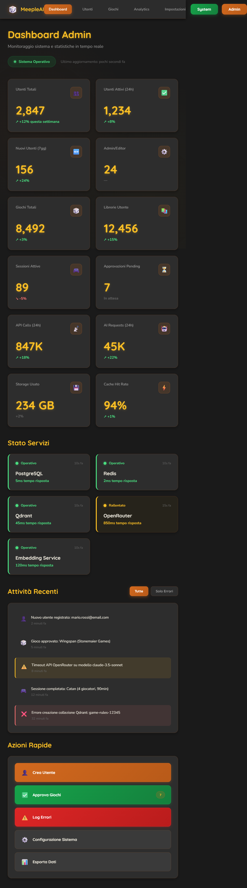
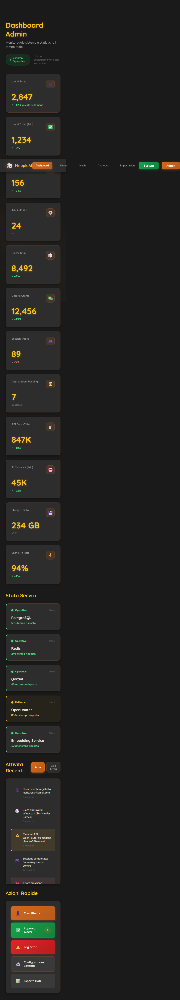

# 📸 MeepleAI Design Screenshots - Issue #2965

Screenshot di validazione per il nuovo design system MeepleAI Dark Mode Professional.

**Data generazione**: 2026-01-24
**Issue**: #2965 - Screenshot per conferma applicazione nuovo stile
**Design variant**: Dark Mode Professional

---

## 🎨 Design Mockup: Admin Dashboard Dark

### Desktop (1920x1080)


**Caratteristiche visuali**:
- ✅ Dark theme (#1a1a1a background)
- ✅ Orange primary (#d2691e) su top bar e active nav
- ✅ Yellow (#fbbf24) per titoli e metric values
- ✅ Green success (#4ade80) per status positivi
- ✅ Metric cards con hover effects e shadows
- ✅ Service status con border left colored (green/yellow/red)
- ✅ Activity feed con warning/error highlighting
- ✅ Quick actions panel con gradient buttons

### Tablet (768x1024)


**Responsive behavior**:
- ✅ Metrics grid: 2 columns (era 4 su desktop)
- ✅ Service grid: 2 columns (era 5 su desktop)
- ✅ Two-col layout: mantiene 2 colonne (Activity + Quick Actions)
- ✅ Top bar navigation compatta ma visibile
- ✅ Spacing ridotto appropriatamente

### Mobile (375x812)


**Mobile optimizations**:
- ✅ Metrics grid: 1 colonna
- ✅ Service grid: 1 colonna
- ✅ Two-col layout: stack verticale (Activity sopra Quick Actions)
- ✅ Top bar: logo + hamburger menu (simulato con overflow)
- ✅ Touch-friendly button sizing
- ✅ Vertical scroll ottimizzato

---

## 🔍 Analisi Stilistica

### Color Palette (Dark Mode Professional)

| Elemento | Colore | Hex | Uso |
|----------|--------|-----|-----|
| Background | Dark Gray | `#1a1a1a` | Page background |
| Cards | Dark Gray | `#2d2d2d` | Card background |
| Primary Orange | Chocolate | `#d2691e` | Active states, CTA |
| Primary Yellow | Amber | `#fbbf24` | Titles, highlights |
| Success Green | Emerald | `#4ade80` | Positive metrics, healthy status |
| Warning Yellow | Amber | `#fbbf24` | Degraded services, warnings |
| Danger Red | Red | `#f87171` | Errors, down services |
| Text Primary | Cream | `#e8e4d8` | Main text |
| Text Secondary | Gray | `#999` | Labels, metadata |

### Typography

- **Titles**: Quicksand (700 weight) - rounded, friendly
- **Body**: Nunito (400/600 weight) - humanist, readable
- **Sizes**:
  - Page title: 2.5rem (40px)
  - Section title: 1.75rem (28px)
  - Metric value: 3rem (48px)
  - Body: 0.9375rem (15px)

### Component Patterns

**Metric Cards**:
```css
- Background: #2d2d2d
- Border: 1px solid rgba(210, 105, 30, 0.2)
- Border-radius: 1rem
- Padding: 2rem
- Hover: translateY(-3px) + shadow intensify
- Shadow: 0 4px 12px rgba(0, 0, 0, 0.3)
```

**Service Cards**:
```css
- Border-left: 4px solid {status-color}
- Background: status-specific tint (5% opacity)
- Dot animation: pulse for "down" status
- Status colors: green (#4ade80), yellow (#fbbf24), red (#f87171)
```

**Buttons**:
```css
- Primary: linear-gradient(135deg, #d2691e, #b85a19)
- Success: linear-gradient(135deg, #16a34a, #15803d)
- Danger: linear-gradient(135deg, #dc2626, #b91c1c)
- Border-radius: 0.75rem (12px)
- Font: Quicksand 700 weight
- Hover: translateY(-2px) + shadow enhance
```

**Activity Items**:
```css
- Default: #2d2d2d background
- Warning: rgba(251, 191, 36, 0.1) + border-left 3px #fbbf24
- Error: rgba(248, 113, 113, 0.1) + border-left 3px #f87171
- Hover: background lighten + border accent
```

---

## 📊 Confronto con Implementazione Attuale

### Status: ❌ Design NON ancora applicato

L'attuale Admin Dashboard (`apps/web/src/app/admin/page.tsx`) utilizza:
- ✅ **Componenti custom**: AdminLayout, DashboardHeader, KPICardsGrid, MetricsGrid, etc.
- ✅ **Real data integration**: React Query polling, dynamic metrics, real events
- ❌ **Styling**: Non applica il Dark Mode Professional design
- ❌ **Color scheme**: Utilizza default Tailwind/shadcn, non i colori MeepleAI brand
- ❌ **Typography**: Non usa Quicksand/Nunito fonts
- ❌ **Visual effects**: Manca glassmorphism, shadows, gradients del mockup

### Gap Analysis

| Feature | Mockup Design | App Corrente | Status |
|---------|---------------|--------------|--------|
| **Theme** | Dark (#1a1a1a) | Light default | ❌ Missing |
| **Primary color** | Orange #d2691e | Default blue | ❌ Missing |
| **Typography** | Quicksand + Nunito | System fonts | ❌ Missing |
| **Metric cards** | Gradient hover, shadows | Basic cards | ❌ Partial |
| **Service status** | Border-left colored | Standard | ❌ Missing |
| **Activity feed** | Warning/error highlighting | Basic list | ❌ Partial |
| **Quick actions** | Gradient buttons | Default buttons | ❌ Missing |
| **Responsive** | 3 breakpoints optimized | Basic responsive | ✅ Presente |
| **Real data** | Mock data | Live API data | ✅ Migliore |

---

## 🎯 Raccomandazioni per Applicazione Design

### Fase 1: Setup Design System (Priority: 🔴 CRITICAL)

1. **Creare Tailwind theme config** con colori MeepleAI:
   ```typescript
   // apps/web/tailwind.config.ts
   theme: {
     extend: {
       colors: {
         'meeple-orange': { DEFAULT: '#d2691e', dark: '#b85a19' },
         'meeple-yellow': '#fbbf24',
         'meeple-dark': '#1a1a1a',
         'meeple-card': '#2d2d2d',
       },
       fontFamily: {
         'quicksand': ['Quicksand', 'sans-serif'],
         'nunito': ['Nunito', 'sans-serif'],
       }
     }
   }
   ```

2. **Importare Google Fonts** in `apps/web/src/app/layout.tsx`:
   ```typescript
   import { Quicksand, Nunito } from 'next/font/google';
   ```

### Fase 2: Component Redesign (Priority: 🟡 IMPORTANT)

Applicare stile dark mode ai componenti esistenti:

1. **DashboardHeader**: Applicare dark background + yellow title
2. **KPICardsGrid**: Aggiungere gradient hover effects, dark card background
3. **SystemStatus**: Implementare border-left colored per service cards
4. **ActivityTimeline**: Aggiungere warning/error background highlighting
5. **QuickActionsPanel**: Convertire a gradient buttons (orange/green/red)

### Fase 3: Visual Polish (Priority: 🟢 RECOMMENDED)

1. Box shadows con dark mode appropriate colors
2. Hover animations (translateY, shadow intensify)
3. Status dots con glow effect (`box-shadow: 0 0 8px`)
4. Gradient backgrounds per buttons e active states

---

## 📋 Next Steps

### Per Completare Issue #2965:

- [x] **Screenshot mockup generati** (Desktop, Tablet, Mobile)
- [ ] **Screenshot app reale** (richiede dev server running + admin login)
- [ ] **Confronto visivo side-by-side** (quando app screenshots disponibili)
- [ ] **Report gap analysis completo** (questo documento)
- [ ] **Aggiornamento issue GitHub** con link a screenshot

### Per Applicare Design (Epic separata):

Creare Epic "Apply MeepleAI Dark Mode Design to Admin Dashboard" con issues:
1. Setup Tailwind theme + fonts (1-2h)
2. Redesign DashboardHeader component (2-3h)
3. Redesign KPICardsGrid component (3-4h)
4. Redesign MetricsGrid component (2-3h)
5. Redesign SystemStatus component (2-3h)
6. Redesign ActivityTimeline component (2-3h)
7. Redesign QuickActionsPanel component (2-3h)
8. Visual regression testing (2-3h)
9. Accessibility audit (WCAG AA compliance) (1-2h)
10. Performance validation (<1s load, <2s TTI) (1-2h)

**Stima totale**: ~20-25 ore di sviluppo

---

## 🔗 References

- **Mockup source**: `docs/design-proposals/meepleai-style/admin-dashboard-dark.html`
- **App source**: `apps/web/src/app/admin/page.tsx` + `dashboard-client.tsx`
- **Design system**: `docs/design-proposals/meepleai-style/README.md`
- **Issue**: [#2965](https://github.com/meepleai/repo/issues/2965)

---

**Generato da**: Claude Code - Issue Implementation Workflow
**Data**: 2026-01-24
