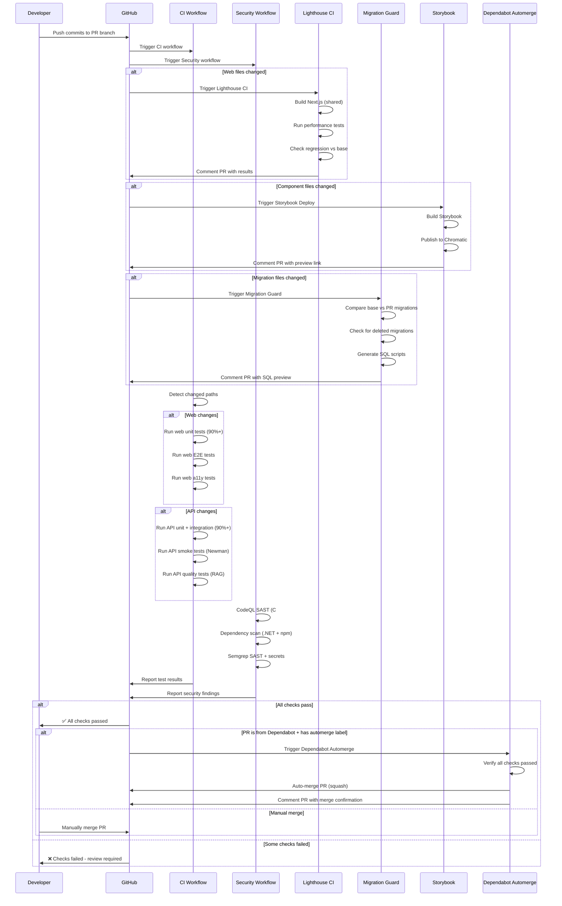
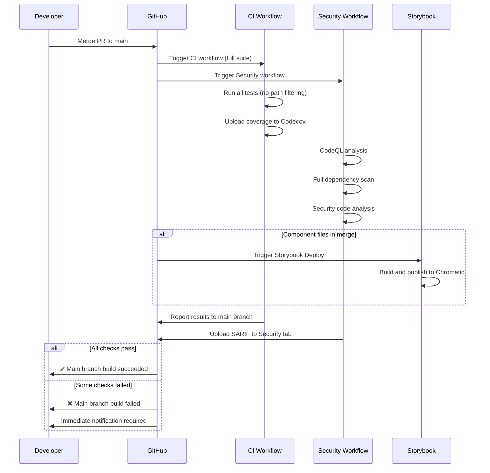
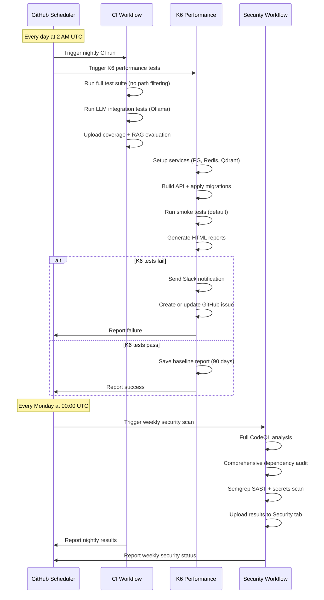

# GitHub Actions Flow Diagram

Questo diagramma rappresenta la sequenza completa di GitHub Actions attivate da vari eventi nel repository MeepleAI.

## Diagramma di Flusso Completo

```mermaid
flowchart TB
    %% ============================================
    %% TRIGGER EVENTS
    %% ============================================
    subgraph TRIGGERS["🎯 TRIGGER EVENTS"]
        PR[Pull Request]
        PUSH[Push to Main]
        MERGE[Merge to Main]
        SCHEDULE[Scheduled<br/>Nightly 2 AM UTC<br/>Weekly Monday]
        MANUAL[Manual Trigger<br/>workflow_dispatch]
        COMMIT[New Commit<br/>on PR/Branch]
    end

    %% ============================================
    %% PATH FILTERS
    %% ============================================
    subgraph FILTERS["🔍 PATH DETECTION"]
        PATH_DETECT{Path<br/>Changed?}
        WEB_CHANGED[Web Files<br/>apps/web/**]
        API_CHANGED[API Files<br/>apps/api/**]
        INFRA_CHANGED[Infra Files<br/>infra/**]
        SCHEMA_CHANGED[Schema Files<br/>schemas/**]
        MIGRATION_CHANGED[Migration Files<br/>Migrations/**]
        COMPONENT_CHANGED[Component Files<br/>components/**<br/>.storybook/**]
    end

    %% ============================================
    %% MAIN CI WORKFLOW
    %% ============================================
    subgraph CI_WORKFLOW["⚙️ CI WORKFLOW (ci.yml)"]
        direction TB
        CI_START([CI Start])

        subgraph CI_DETECT["Detection Phase"]
            CI_CHANGES[Detect Changes<br/>dorny/paths-filter]
        end

        subgraph CI_VALIDATE["Validation Phase"]
            VALIDATE_SCHEMAS[Validate RuleSpec<br/>Schemas]
            VALIDATE_CODEGEN[Validate API<br/>Code Generation]
            VALIDATE_OBSERVABILITY[Validate Prometheus<br/>& Alertmanager]
        end

        subgraph CI_WEB["Web Testing (90%+ Coverage)"]
            WEB_UNIT[Web Unit Tests<br/>Jest + Coverage<br/>Lint + Typecheck<br/>Build Storybook<br/>A11y Unit Tests]
            WEB_E2E[Web E2E Tests<br/>Playwright<br/>Sequential Groups]
            WEB_A11Y[Web A11y E2E<br/>Playwright]
        end

        subgraph CI_API["API Testing (90%+ Coverage)"]
            API_SMOKE[API Smoke Tests<br/>Newman + Postman<br/>11+ Collections]
            API_UNIT[API Unit + Integration<br/>xUnit + Testcontainers<br/>Coverage 90%<br/>Random Order Test]
            API_QUALITY[API Quality Tests<br/>RAG Evaluation<br/>5-Metric Framework]
            API_LLM[API LLM Integration<br/>Ollama Tests<br/>Nightly Only]
        end

        CI_START --> CI_CHANGES
        CI_CHANGES --> VALIDATE_SCHEMAS
        CI_CHANGES --> VALIDATE_CODEGEN
        CI_CHANGES --> VALIDATE_OBSERVABILITY
        CI_CHANGES --> WEB_UNIT
        CI_CHANGES --> WEB_E2E
        CI_CHANGES --> WEB_A11Y
        CI_CHANGES --> API_SMOKE
        CI_CHANGES --> API_UNIT
        CI_CHANGES --> API_QUALITY
        CI_CHANGES -.-> API_LLM

        API_LLM -.->|Only Schedule<br/>or Manual| CI_END

        VALIDATE_SCHEMAS --> CI_END([CI Complete])
        VALIDATE_CODEGEN --> CI_END
        VALIDATE_OBSERVABILITY --> CI_END
        WEB_UNIT --> CI_END
        WEB_E2E --> CI_END
        WEB_A11Y --> CI_END
        API_SMOKE --> CI_END
        API_UNIT --> CI_END
        API_QUALITY --> CI_END
    end

    %% ============================================
    %% SECURITY SCAN WORKFLOW
    %% ============================================
    subgraph SECURITY_WORKFLOW["🔒 SECURITY SCAN (security-scan.yml)"]
        direction TB
        SEC_START([Security Start])

        subgraph SEC_SAST["SAST Analysis"]
            CODEQL_CS[CodeQL C#<br/>security-extended]
            CODEQL_JS[CodeQL JavaScript<br/>security-and-quality]
        end

        subgraph SEC_DEPS["Dependency Scanning"]
            DEP_DOTNET[.NET Dependencies<br/>dotnet list package<br/>--vulnerable]
            DEP_NPM[NPM Dependencies<br/>pnpm audit<br/>--audit-level=high]
        end

        subgraph SEC_CODE["Code Security"]
            DOTNET_SEC[.NET Security Scan<br/>NetAnalyzers<br/>SonarAnalyzer<br/>Meziantou]
            SEMGREP[Semgrep SAST<br/>security-audit<br/>secrets<br/>owasp-top-10]
        end

        SEC_SUMMARY[Security Summary<br/>Job Status Report]

        SEC_START --> CODEQL_CS
        SEC_START --> CODEQL_JS
        SEC_START --> DEP_DOTNET
        SEC_START --> DEP_NPM
        SEC_START --> DOTNET_SEC
        SEC_START --> SEMGREP

        CODEQL_CS --> SEC_SUMMARY
        CODEQL_JS --> SEC_SUMMARY
        DEP_DOTNET --> SEC_SUMMARY
        DEP_NPM --> SEC_SUMMARY
        DOTNET_SEC --> SEC_SUMMARY
        SEMGREP --> SEC_SUMMARY

        SEC_SUMMARY --> SEC_END([Security Complete])
    end

    %% ============================================
    %% K6 PERFORMANCE WORKFLOW
    %% ============================================
    subgraph K6_WORKFLOW["📊 K6 PERFORMANCE (k6-performance.yml)"]
        direction TB
        K6_START([K6 Start])

        K6_SETUP[Setup Services<br/>PostgreSQL + Redis + Qdrant<br/>Build API<br/>Apply Migrations<br/>Seed Test Data]

        K6_TEST[Run K6 Tests<br/>Smoke Test: Scheduled<br/>Load Test: Manual<br/>Stress/Spike: Manual]

        K6_REPORT[Generate HTML Report<br/>Upload Artifacts]

        K6_FAIL{Tests<br/>Failed?}

        K6_NOTIFY[Notify Failure<br/>Slack + GitHub Issue<br/>Scheduled Only]

        K6_START --> K6_SETUP
        K6_SETUP --> K6_TEST
        K6_TEST --> K6_REPORT
        K6_REPORT --> K6_FAIL
        K6_FAIL -->|Yes + Scheduled| K6_NOTIFY
        K6_FAIL -->|No| K6_END
        K6_NOTIFY --> K6_END([K6 Complete])
    end

    %% ============================================
    %% LIGHTHOUSE CI WORKFLOW
    %% ============================================
    subgraph LIGHTHOUSE_WORKFLOW["💡 LIGHTHOUSE CI (lighthouse-ci.yml)"]
        direction TB
        LH_START([Lighthouse Start])

        LH_DETECT[Detect Web Changes]

        LH_BUILD[Build Next.js<br/>Shared Build<br/>Cache Optimization]

        subgraph LH_TESTS["Performance Testing"]
            LH_PERF[Lighthouse Performance<br/>Playwright<br/>Core Web Vitals]
            LH_CLI[Lighthouse CLI<br/>Performance Scores<br/>A11y + Best Practices]
        end

        LH_REGRESSION{Performance<br/>Regression?}

        LH_COMPARE[Compare with Base<br/>LCP, FCP, TBT, CLS<br/>Threshold: >10%]

        LH_COMMENT[PR Comment<br/>Performance Results]

        LH_FAIL[Fail Build<br/>Regression Detected]

        LH_START --> LH_DETECT
        LH_DETECT --> LH_BUILD
        LH_BUILD --> LH_PERF
        LH_BUILD --> LH_CLI
        LH_PERF --> LH_COMPARE
        LH_CLI --> LH_COMPARE
        LH_COMPARE --> LH_REGRESSION
        LH_REGRESSION -->|Yes| LH_FAIL
        LH_REGRESSION -->|No| LH_COMMENT
        LH_FAIL --> LH_END
        LH_COMMENT --> LH_END([Lighthouse Complete])
    end

    %% ============================================
    %% STORYBOOK DEPLOY WORKFLOW
    %% ============================================
    subgraph STORYBOOK_WORKFLOW["📚 STORYBOOK DEPLOY (storybook-deploy.yml)"]
        direction TB
        SB_START([Storybook Start])

        SB_BUILD[Build Storybook<br/>pnpm build-storybook]

        SB_CHROMATIC[Publish to Chromatic<br/>Visual Testing<br/>onlyChanged: true]

        SB_COMMENT[PR Comment<br/>Preview Links]

        SB_START --> SB_BUILD
        SB_BUILD --> SB_CHROMATIC
        SB_CHROMATIC --> SB_COMMENT
        SB_COMMENT --> SB_END([Storybook Complete])
    end

    %% ============================================
    %% DEPENDABOT AUTOMERGE WORKFLOW
    %% ============================================
    subgraph DEPENDABOT_WORKFLOW["🤖 DEPENDABOT AUTOMERGE (dependabot-automerge.yml)"]
        direction TB
        DB_START([Dependabot PR])

        DB_CHECK{Dependabot<br/>+ automerge<br/>label?}

        DB_STATUS[Check PR Status<br/>CI Passing?<br/>All Checks Complete?]

        DB_PENDING{Checks<br/>Pending?}

        DB_WAIT[Wait for CI<br/>Re-run on completion]

        DB_SHOULD{Should<br/>Merge?}

        DB_MERGE[Auto-merge PR<br/>Squash Strategy<br/>Add Comment]

        DB_SKIP[Skip Auto-merge<br/>Manual Review Required]

        DB_START --> DB_CHECK
        DB_CHECK -->|No| DB_SKIP
        DB_CHECK -->|Yes| DB_STATUS
        DB_STATUS --> DB_PENDING
        DB_PENDING -->|Yes| DB_WAIT
        DB_PENDING -->|No| DB_SHOULD
        DB_SHOULD -->|Yes| DB_MERGE
        DB_SHOULD -->|No| DB_SKIP
        DB_WAIT --> DB_END
        DB_MERGE --> DB_END([Automerge Complete])
        DB_SKIP --> DB_END
    end

    %% ============================================
    %% MIGRATION GUARD WORKFLOW
    %% ============================================
    subgraph MIGRATION_WORKFLOW["🗄️ MIGRATION GUARD (migration-guard.yml)"]
        direction TB
        MIG_START([Migration PR])

        MIG_COMPARE[Compare Migrations<br/>Base vs PR Branch]

        MIG_DELETED{Migrations<br/>Deleted?}

        MIG_FAIL[FAIL BUILD<br/>Migrations cannot be deleted<br/>Breaking change]

        MIG_NAMING[Check Naming Convention<br/>YYYYMMDDHHMMSS_Name.cs]

        MIG_SQL[Generate SQL Scripts<br/>migration-preview.sql<br/>migration-pending.sql]

        MIG_COMMENT[PR Comment<br/>SQL Preview + Validation]

        MIG_START --> MIG_COMPARE
        MIG_COMPARE --> MIG_DELETED
        MIG_DELETED -->|Yes| MIG_FAIL
        MIG_DELETED -->|No| MIG_NAMING
        MIG_NAMING --> MIG_SQL
        MIG_SQL --> MIG_COMMENT
        MIG_FAIL --> MIG_END
        MIG_COMMENT --> MIG_END([Migration Check Complete])
    end

    %% ============================================
    %% EVENT TO WORKFLOW ROUTING
    %% ============================================
    PR --> PATH_DETECT
    COMMIT --> PATH_DETECT
    PUSH --> PATH_DETECT
    MERGE --> PATH_DETECT

    PATH_DETECT --> WEB_CHANGED
    PATH_DETECT --> API_CHANGED
    PATH_DETECT --> INFRA_CHANGED
    PATH_DETECT --> SCHEMA_CHANGED
    PATH_DETECT --> MIGRATION_CHANGED
    PATH_DETECT --> COMPONENT_CHANGED

    %% CI Workflow triggers
    WEB_CHANGED --> CI_WORKFLOW
    API_CHANGED --> CI_WORKFLOW
    INFRA_CHANGED --> CI_WORKFLOW
    SCHEMA_CHANGED --> CI_WORKFLOW

    %% Security Workflow triggers
    PR --> SECURITY_WORKFLOW
    PUSH --> SECURITY_WORKFLOW
    SCHEDULE -.->|Weekly Monday| SECURITY_WORKFLOW
    MANUAL --> SECURITY_WORKFLOW

    %% K6 Performance triggers
    SCHEDULE -.->|Nightly 2 AM| K6_WORKFLOW
    MANUAL --> K6_WORKFLOW

    %% Lighthouse CI triggers
    WEB_CHANGED --> LIGHTHOUSE_WORKFLOW

    %% Storybook Deploy triggers
    COMPONENT_CHANGED --> STORYBOOK_WORKFLOW

    %% Dependabot triggers
    PR -.->|Dependabot PRs| DEPENDABOT_WORKFLOW

    %% Migration Guard triggers
    MIGRATION_CHANGED --> MIGRATION_WORKFLOW

    %% Schedule triggers CI
    SCHEDULE -.->|Nightly 2 AM| CI_WORKFLOW
    MANUAL --> CI_WORKFLOW

    %% ============================================
    %% STYLING
    %% ============================================
    classDef triggerStyle fill:#e1f5ff,stroke:#0366d6,stroke-width:3px,color:#000
    classDef workflowStyle fill:#fff5b1,stroke:#ffd700,stroke-width:2px,color:#000
    classDef testStyle fill:#d1f7d1,stroke:#28a745,stroke-width:2px,color:#000
    classDef securityStyle fill:#ffd7d7,stroke:#d73a49,stroke-width:2px,color:#000
    classDef performanceStyle fill:#e1d5ff,stroke:#6f42c1,stroke-width:2px,color:#000
    classDef failStyle fill:#ff6b6b,stroke:#d73a49,stroke-width:3px,color:#fff
    classDef successStyle fill:#51cf66,stroke:#28a745,stroke-width:2px,color:#000

    class PR,PUSH,MERGE,SCHEDULE,MANUAL,COMMIT triggerStyle
    class CI_WORKFLOW,SECURITY_WORKFLOW,K6_WORKFLOW,LIGHTHOUSE_WORKFLOW,STORYBOOK_WORKFLOW,DEPENDABOT_WORKFLOW,MIGRATION_WORKFLOW workflowStyle
    class WEB_UNIT,WEB_E2E,WEB_A11Y,API_UNIT,API_SMOKE,API_QUALITY,API_LLM testStyle
    class CODEQL_CS,CODEQL_JS,DEP_DOTNET,DEP_NPM,DOTNET_SEC,SEMGREP securityStyle
    class K6_TEST,LH_PERF,LH_CLI performanceStyle
    class MIG_FAIL,LH_FAIL,K6_NOTIFY failStyle
    class CI_END,SEC_END,K6_END,LH_END,SB_END,DB_END,MIG_END successStyle
```



## Legenda

### 🎯 Eventi Trigger

| Evento | Descrizione | Frequenza |
|--------|-------------|-----------|
| **Pull Request** | Apertura, sincronizzazione o riapertura di una PR | On-demand |
| **Push to Main** | Push diretto al branch main | On-demand |
| **Merge to Main** | Merge di una PR nel branch main | On-demand |
| **Scheduled** | Esecuzione programmata (cron) | Nightly 2 AM UTC + Weekly Monday |
| **Manual Trigger** | Esecuzione manuale via `workflow_dispatch` | On-demand |
| **New Commit** | Nuovo commit su PR o branch | On-demand |

### ⚙️ Workflow Principali

| Workflow | File | Scopo | Durata Media |
|----------|------|-------|--------------|
| **CI** | `ci.yml` | Test completi (unit, integration, E2E) | ~14 min |
| **Security Scan** | `security-scan.yml` | SAST, dependency scan, CodeQL | ~8 min |
| **K6 Performance** | `k6-performance.yml` | Load testing, stress testing | ~15-30 min |
| **Lighthouse CI** | `lighthouse-ci.yml` | Performance web, Core Web Vitals | ~10 min |
| **Storybook Deploy** | `storybook-deploy.yml` | Visual testing, Chromatic | ~5 min |
| **Dependabot Automerge** | `dependabot-automerge.yml` | Auto-merge security patches | <1 min |
| **Migration Guard** | `migration-guard.yml` | Validazione migrazioni EF Core | ~3 min |

### 🔍 Path Filters & Ottimizzazioni

Il workflow CI utilizza `dorny/paths-filter` per eseguire solo i job necessari in base ai file modificati:

- **Web Changes** (`apps/web/**`): Trigger web tests, E2E, a11y, Lighthouse
- **API Changes** (`apps/api/**`): Trigger API tests, smoke tests, quality tests
- **Infra Changes** (`infra/**`): Trigger observability validation
- **Schema Changes** (`schemas/**`): Trigger schema validation
- **Migration Changes** (`Migrations/**`): Trigger migration guard
- **Component Changes** (`components/**`, `.storybook/**`): Trigger Storybook build

### 📊 Test Coverage & Quality Gates

| Area | Target | Strumento | Enforcement |
|------|--------|-----------|-------------|
| **Frontend Unit** | ≥90% | Jest + RTL | Enforced (fail build) |
| **Backend Unit + Integration** | ≥90% | xUnit + Coverlet | Enforced (fail build) |
| **E2E** | Critical paths | Playwright | Regression prevention |
| **A11y** | WCAG 2.1 AA | jest-axe + Playwright | Warning |
| **Performance** | Core Web Vitals | Lighthouse | Regression >10% = fail |
| **Security** | No HIGH/CRITICAL vulns | CodeQL + Semgrep | Enforced (fail build) |
| **RAG Quality** | 5-metric framework | Custom evaluator | Thresholds enforced |

### 🎨 Colori del Diagramma

- **Blu**: Eventi trigger (PR, push, schedule, etc.)
- **Giallo**: Workflow e fasi principali
- **Verde**: Job di testing e validazione
- **Rosso**: Job di sicurezza (SAST, dependency scan)
- **Viola**: Performance testing (K6, Lighthouse)
- **Rosso scuro**: Fallimenti e blocchi (fail build)
- **Verde scuro**: Completamenti con successo

## Sequenza Tipica per PR



## Sequenza per Push/Merge to Main



## Sequenza per Scheduled Runs (Nightly)



## Note Importanti

### Concurrency Control

Tutti i workflow principali utilizzano `concurrency.cancel-in-progress: true` per evitare l'accumulo di esecuzioni:

```yaml
concurrency:
  group: ci-${{ github.workflow }}-${{ github.event.pull_request.number || github.ref }}
  cancel-in-progress: true
```

### Permission Model (Least Privilege)

Ogni workflow dichiara esplicitamente le permission minime necessarie (Issue #1455):

```yaml
permissions:
  contents: read        # Checkout code
  pull-requests: write  # Comment on PRs
  checks: write         # Report test results
  actions: write        # Upload artifacts
```

### Artifact Retention

| Tipo Artifact | Retention | Motivo |
|---------------|-----------|---------|
| Coverage reports | 7 days | Debug failures |
| Security reports | 30 days | Audit trail |
| Newman reports | 14 days | API validation |
| K6 baseline | 90 days | Performance trending |
| Migration SQL | 30 days | Database audit |
| Playwright reports | 7 days | E2E debugging |

### Notifiche e Alerting

- **K6 Failures (Scheduled)**: Slack + GitHub Issue
- **Security HIGH/CRITICAL**: Build fails, requires fix
- **Performance Regression >10%**: Build fails, requires optimization
- **Migration Deleted**: Build fails, breaking change
- **Dependabot**: Auto-merge if all checks pass

---

**Versione**: 1.0
**Ultimo Aggiornamento**: 2025-11-22
**Autore**: Claude (via GitHub Actions Flow Analysis)
