# Mappa del sito — MeepleAI Web (Next.js App Router)

> **Scopo**: mappare in modo esaustivo la webapp `apps/web` — **come si naviga** da una pagina all'altra, **quando un componente è mostrato / nascosto / abilitato**, e la **corrispondenza classi/componenti/file** per ogni pagina.
>
> **Come leggere questo documento**
> 1. Parti dall'**Architettura** (§1–§7): la spina dorsale (route-group, shell, provider, guardie, regole di visibilità della navbar) che vale trasversalmente su *tutte* le pagine.
> 2. Poi la **Mappa per cluster** (§8): 22 cluster funzionali che coprono ~180 route, ciascuno con tabella route, edge di navigazione, superfici condizionali `show/hide/enable` e componenti→file.
> 3. L'**Indice componenti→file** (§9) è la vista inversa: da componente ai punti d'uso.
> 4. Il **sitemap visuale navigabile** è pubblicato come Artifact web (link fornito in chat).
>
> _Generato via `/sc:spec-panel` con lente expert-panel (Cockburn = flussi/attori · Fowler = confini componenti · Nygard = stati/failure · Wiegers = completezza). Discovery esaustiva con verifica avversariale di completezza. Sorgente di verità = codice in `apps/web/src`._

> **Statistiche di copertura**: **224 route** mappate · **668 edge** di navigazione · **891 componenti** indicizzati · **5 route immersive** · **22/22 cluster** arricchiti dalla verifica avversariale di completezza.

---

## 1. Topologia dei route-group

La webapp è un **Next.js App Router** (`apps/web/src/app`). Le route sono partizionate in **route-group** (cartelle tra parentesi, che *non* compaiono nell'URL) più il ramo `admin` e poche route alla radice.

| Route-group | Prefisso URL | Shell / Layout | Protezione | # route |
|---|---|---|---|---|
| `(public)` | nessuno (root pubblici) | `PublicLayout` (UnifiedHeader + PublicFooter) | nessuna (accesso libero) | ~30 |
| `(auth)` | nessuno | `<main>` + `AuthLayout` per-pagina (card centrata) | anonima (flussi di login/registrazione) | 10 |
| `(authenticated)` | nessuno | `UserShellClient` → `DesktopShell` | client-side (auth richiesta) | ~90 |
| `(chat)` | `/chat` | `UserShellClient` → `DesktopShell` (sibling di authenticated) | client-side (auth richiesta) | 4 |
| `admin` → `(dashboard)` | `/admin` | `AdminShell` (tema scuro) | cookie view-mode + `RequireRole(['Admin'])` | ~90 |
| root | `/join/[token]`, `/offline` | proprio wrapper | variabile | 2 |

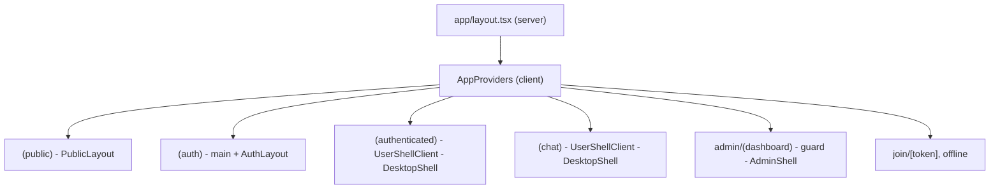

---

## 2. Catena shell / layout & albero dei provider

### 2.1 Provider globali (`app/providers.tsx`)

Ogni pagina, in **qualsiasi** gruppo, è avvolta da questo albero (dall'esterno all'interno):

```
IntlProvider (i18n)
└─ ThemeProvider (next-themes; default light, data-theme)
   └─ QueryProvider (TanStack Query)
      └─ AuthProvider (stato di autenticazione)
         └─ ErrorBoundary
            └─ RouteErrorBoundary
               └─ AddGameWizardProvider
                  └─ StatePreviewProvider (solo dev; dynamic ssr:false → tree-shaken in prod)
                     └─ AppContent
```

`AppContent` monta **globalmente** (sopra a ogni route), con questi elementi condizionali:

| Elemento | Sempre / condizionale | Condizione |
|---|---|---|
| `PWAProvider`, `AccessibleSkipLink` (→ `#main-content`), `Toaster` (sonner) | sempre | — |
| `CookieConsentBanner` | condizionale | consenso GDPR non ancora dato |
| `SessionWarningModal` | condizionale | **solo se** `isNearExpiry && remainingMinutes !== null` (AUTH-05) |
| `KeyboardShortcutsHelp` (modal) | condizionale | aperto da shortcut `?` / stato |
| `CommandPalette` | condizionale | aperto da `Cmd/Ctrl+K` **oppure** evento `meeple:command-palette:open` emesso dalla `SearchPill` di `AppTopBar` |

### 2.2 Shell autenticata — `DesktopShell` (`components/layout/UserShell/DesktopShell.tsx`)

Chrome condiviso da `(authenticated)` e `(chat)`. Composizione e regole di visibilità:

| Elemento chrome | Viewport / condizione di visibilità |
|---|---|
| `AppTopBar` | desktop/tablet — barra di navigazione primaria |
| `MobileTopBar` (☰ → `SideDrawer`) | mobile |
| `MiniNavSlot` | mostra le tab-strip contestuali **solo** se la pagina ha registrato una config via `useMiniNavConfig` (es. `/games`, `/library`, `/discover`); altrimenti no-op |
| `EmailVerificationBanner` | **solo se** `user.emailVerified === false` (nascosto se `true`, `undefined`, o query in caricamento) |
| `SessionBanner`, `StatusBanner` | condizionale (sessione live in corso / stato sistema) |
| `main#main-content` | sempre — `DashboardEngineProvider` avvolge i children; padding bottom-bar rimosso su route immersive |
| `ChatSlideOverPanel` | slide-over globale, aperto on-demand |
| `MobileBottomBar` (5 tab) | mobile — **nascosta su route immersive** |
| `SideDrawer` | destinazioni secondarie ("tutto il resto") su `<lg` |
| `BackToSessionFAB` | **solo se** esiste una sessione live a cui tornare (Suspense) |
| `ContextualHandBottomBar` | condizionale al contesto |

> **Nota storica (#1977 / #2158)**: la `MainSidebar` persistente desktop introdotta da Asse B è stata **rimossa** — su desktop l'`AppTopBar` è l'unica fonte di verità per la nav primaria. Non reintrodurre una sidebar desktop persistente.

### 2.3 Shell admin — `AdminShell` (`components/layout/AdminShell/AdminShell.tsx`)

`data-theme="dark"`. Composizione: `AppTopBar(adminMode)` + `MobileTopBar(adminMode)` + `AdminSidebar` (persistente `lg+`) + `AdminSideDrawer` (mobile/`md–lg`) + `main#main-content` (con `DashboardEngineProvider`).

---

## 3. Modello di protezione delle route (guard)

> ⚠️ **Fatto rilevante**: **non esiste `middleware.ts` di Next** in `apps/web`. La "Layer 1 middleware" citata nel docstring di `RequireRole` è **assente**. La protezione delle route è **interamente client-side**.

| Livello | Meccanismo | Comportamento |
|---|---|---|
| Gruppo `admin` | `admin/(dashboard)/layout.tsx` | (a) server: legge il cookie `meepleai_view_mode`; se `'user'` → `redirect('/')` (nessun flash); (b) client: `RequireRole allowedRoles={['Admin']}` |
| `RequireRole` (`components/auth/RequireRole.tsx`) | client | `getCurrentUser()` → se non-auth `router.replace('/login?from=<path>')`; se ruolo errato `router.replace('/')`; spinner **"Verifica autorizzazioni..."** durante il check |
| Pagine `(authenticated)` | `AuthProvider` / `useAuth` + redirect per-pagina | variabile per pagina (dettaglio nei cluster §8) |
| Navbar | `filterNavItemsByRole` | filtra le voci (vedi §4) — non protegge la route, solo la sua *visibilità* nel menu |

**Gerarchia ruoli**: `superadmin ⊇ admin ⊇ editor ⊇ user`. Il `SuperAdmin` eredita ogni permesso (Issue #372).

---

## 4. Navigazione primaria & regole di visibilità

Sorgente unica: `config/navigation.ts` → `UNIFIED_NAV_ITEMS`, consumata via hook `useNavigationItems`. Ogni voce ha una `visibility`:

- `anonOnly` — mostrata **solo** ai non-autenticati (es. `welcome` → `/`).
- `authOnly` — mostrata **solo** agli autenticati.
- `minRole: 'editor' | 'admin'` — richiede almeno quel ruolo (con gerarchia).

`filterNavItemsByRole(items, {isAuthenticated, isAuthLoading, userRole})`:
- **durante il loading auth** → mostra solo le voci senza restrizioni;
- nasconde `authOnly` agli anon, `anonOnly` agli auth;
- applica `minRole` (editor/admin, con superadmin/admin che ereditano).

### 4.1 Superfici della navbar (asimmetriche per design)

| Superficie | Voci (ordinate) | Sorgente |
|---|---|---|
| **Desktop top-bar** | `dashboard`, `library`, `hub`(→`/games`), `sessions`, `toolkit` | `TOP_BAR_NAV_IDS` |
| **Mobile bottom-bar** | `dashboard`(label "Home"), `library`, `hub`, `chat`, `profile` | `BOTTOM_TAB_NAV_IDS` |
| **User pill / bell** | `profile`, `notifications` | `USER_PILL_NAV_IDS` |
| **Overflow** | tutto il resto | dropdown "Altro" (desktop) / `SideDrawer` (mobile) |

> La voce con `id: 'hub'` rende **label "Games"** e punta a **`/games`** (hub multi-tab, default `tab=discover`). L'id resta `hub` per non rompere il wiring di `TOP_BAR_NAV_IDS`/`BOTTOM_TAB_NAV_IDS`.

### 4.2 Elenco completo voci `UNIFIED_NAV_ITEMS`

| id | label | href | priorità | visibilità | note |
|---|---|---|---|---|---|
| `welcome` | Welcome | `/` | 0 | `anonOnly` | landing |
| `dashboard` | Dashboard | `/dashboard` | 1 | `authOnly` | top-bar + bottom-bar ("Home") |
| `library` | Libreria | `/library` | 2 | `authOnly` | top-bar + bottom-bar |
| `chat` | Chat | `/chat` | 3 | `authOnly` | bottom-bar |
| `notifications` | Notifiche | `/notifications` | 4 | `authOnly` | `hideFromMainNav` (user pill) |
| `game-nights` | Serate | `/game-nights` | 5 | `authOnly` | overflow |
| `profile` | Profilo | `/profile` | 6 | `authOnly` | `hideFromMainNav` (user pill), bottom-bar |
| `agents` | Agenti | `/agents` | 7 | `authOnly` | gruppo `strumenti` |
| `sessions` | Sessioni | `/sessions` | 8 | `authOnly` | top-bar, gruppo `strumenti` |
| `play-records` | Sessioni recenti | `/play-records` | 9 | `authOnly` | gruppo `strumenti` |
| `players` | Giocatori | `/players` | 10 | `authOnly` | gruppo `strumenti` |
| `knowledge-base` | Knowledge Base | `/knowledge-base` | 11 | `authOnly` | gruppo `strumenti` |
| `admin` | Admin Hub | `/admin` | 12 | `authOnly` + `minRole: admin` | gruppo `admin` |
| `hub` | **Games** | `/games` | 13 | `authOnly` | top-bar + bottom-bar |
| `toolkit` | Toolkit | `/toolkit` | 14 | `authOnly` | top-bar, gruppo `strumenti` |
| `editor` | Editor Agenti | `/editor` | 15 | `authOnly` + `minRole: editor` | gruppo `strumenti` |

---

## 5. Route immersive

Su queste route il chrome globale della navbar è sostituito da un layout in-sessione: la `MobileBottomBar` **si nasconde** e `DesktopShell` rimuove il padding della bottom-bar (`isImmersiveRoute`, `components/layout/AppNav/immersive-routes.ts`):

- `^/sessions/[^/]+/live` — sessione di gioco live
- `^/library/[^/]+/play` — modalità libro-game / play campagna

---

## 6. Grafo di navigazione entity-driven (MeepleCard)

`config/entity-navigation.ts` → `ENTITY_NAVIGATION_GRAPH`. Il `CardNavigationFooter` delle `MeepleCard` rende link cross-entity; un link è **omesso** se l'id richiesto manca nei dati della card.

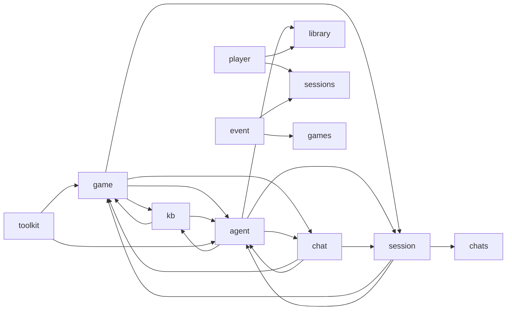

Destinazioni effettive (dopo il consolidamento route Epic #5033): `game → /library/[id]?tab=agent`, `kb/agent/session card → /library/[id]`, `chat → /chat`, `session list → /sessions`.

---

## 7. Modello di navigazione admin

`config/admin-dashboard-navigation.ts` → `DASHBOARD_SECTIONS`: **6 sezioni** top-nav, ognuna con un set di voci `AdminSidebar` contestuali. Molte "sotto-viste" admin sono **tab query-param** (`?tab=…`, `?action=…`) su una singola pagina, non route separate.

| Sezione | `baseRoute` | Voci sidebar (estratto) |
|---|---|---|
| **Overview** | `/admin/overview` | Dashboard, Activity Feed, System Health |
| **Content** | `/admin/shared-games` (+ `/admin/knowledge-base`, `/admin/games`, `/admin/content`) | All Games, Add Game, Categories, Import, KB Overview, Documents, Queue, Vectors, Upload, RAG Pipeline, Email Templates |
| **AI** | `/admin/agents` (+ `/admin/ai`) | Mission Control, Infrastructure, RAG Inspector, RAG Playground, Agent Definitions, Configuration, Usage & Costs, Analytics |
| **Users** | `/admin/users` | All Users, Invitations, Access Requests (badge), Roles, Activity Log |
| **System** | `/admin/monitor` (+ `/admin/config`, `/admin/notifications`, `/admin/ui-library`) | Alerts/Cache/Infra/Command/Testing/Export/Email (`?tab=`), Operations, Services, Grafana, Logs, Containers, Service Calls, Send Notification, General/Limits/Flags/Rate-limits Config, n8n, UI Library |
| **Analytics** | `/admin/analytics` | Overview, AI Usage, Audit Log, Reports, API Keys (`?tab=`) |

---

## 8. Mappa per cluster

> Ciascun cluster: tabella route (Shell · Guardie · Stati), edge di navigazione in uscita, superfici condizionali `show/hide/enable`, componenti→file, e diagramma Mermaid della navigazione interna.

## Area pubblica — `(public)`

Accesso libero (nessuna auth). Shell: `PublicLayout` (UnifiedHeader + PublicFooter). Include landing, pagine legali/marketing, inviti e contenuti condivisi via token.

### Landing & pagine marketing/legali pubbliche
_Route-group: `(public)` · 13 pagine_

#### Tabella route

| Route | Shell | Guardie | Stati principali |
|---|---|---|---|
| `/` | PublicLayout + redirect di ingresso (`export metadata` completo) | `getServerUser()`: se autenticato → `redirect('/library')` (nessun flash) | authenticated → redirect; anonymous → full SSR statico |
| `/about` | PublicLayout | — | static (Client Component, no fetch) |
| `/contact` | PublicLayout | — | idle · sending · success · error |
| `/faq` | PublicLayout + `<main>` annidato (doppio landmark) | — | loading* · error* · default/popular · populated · empty · Suspense fallback (*test-only, non-prod) |
| `/how-it-works` | PublicLayout + `<main>` annidato | — | static (solo i18n) |
| `/how-it-works/game-comprehension` | PublicLayout + `<main>` annidato | — | static + toggle `panelOpen` + tooltip transitorio |
| `/pricing` | PublicLayout | — | static (testi hardcoded IT) |
| `/terms` | PublicLayout > LegalPageLayout | — | static + toggle locale IT/EN + accordion single-collapsible |
| `/privacy` | PublicLayout > LegalPageLayout | — | static + toggle locale + accordion |
| `/cookies` | PublicLayout > LegalPageLayout | — | static + toggle locale + accordion |
| `/cookie-settings` | PublicLayout + `<main>` annidato | — | pre-hydration (controlli disabled) · hydrated · saved (toast + evento) |
| `/legal` | PublicLayout + `<main>` "Coming Soon" annidato | STUB non implementato: `useEffect setTimeout(2000)` → `router.replace('/terms')` | coming-soon → auto-redirect `/terms` |
| `/legal/takedown` | PublicLayout > LegalPageLayout (footerSlot = form) | Pubblica, NON login-gated (esplicito) | idle · validation-error · submitted (mailto) · copied |

#### Navigazione in uscita

- **`/`**
  - `/` -> `/register` (WelcomeHero primaryCta 'Inizia gratis', `<a href>` hard-nav via HeroGradient)
  - `/` -> `#come-funziona` (WelcomeHero secondaryCta 'Scopri come funziona ↓', anchor same-page → HowItWorksSteps)
  - `/` -> `/register` (RulesQuickDemo CTA `<Link>` 'Prova gratis — risposta in 10 secondi')
  - `/` -> `/register` (WelcomeCTA `<Link>` 'Inizia gratis', Button asChild)
  - `/` -> `/register` (WelcomeCTA `<Link>` 'Esplora il catalogo', variant=outline; entrambe le CTA → /register)
  - `/` -> `/library` (guardia SSR: `redirect` quando `getServerUser()` ritorna utente)
- **`/about`**
  - `/about` -> `/` (Button ghost `router.push('/')` '← Torna alla Home')
  - `/about` -> `/how-it-works` (Button outline `router.push('/how-it-works')` 'Come Funziona →')
- **`/contact`**
  - `/contact` -> `/` (Button ghost `router.push('/')`)
  - `/contact` -> `/faq` (Button outline `router.push('/faq')` 'Domande Frequenti →')
  - `/contact` -> `mailto:{emailValue}` (`<a href=mailto>` sidebar Contact Info)
  - `/contact` -> POST `/api/v1/contact` (form onSubmit → `api.contact.send()`; on-success reset, NON naviga)
- **`/faq`**
  - `/faq` -> `/faq` (errorState retry `<Link>`; condizione: `hasError`, test-only `?error=1` non-prod)
  - `/faq` -> `/contact` (emptyState contactCta `<Link>`; condizione: `showEmptyState`, query non vuota + 0 risultati)
  - `/faq` -> `/contact` (footer CTA `<Link>` 'contactCta')
  - `/faq` -> `/how-it-works` (footer CTA `<Link>` 'howItWorksCta')
  - `/faq` -> (in-page, no route) QuickAnswerCard onClick → `setQuery('')` + `setActiveCat(cat)` + `openIds={id}`
- **`/how-it-works`**
  - `/how-it-works` -> `/register` (HeroGradient primaryCta 'ctaRegister', `<a href>` hard-nav)
  - `/how-it-works` -> `/about` (Btn primary asChild `<Link>` 'aboutCta')
  - `/how-it-works` -> `/faq` (Btn ghost asChild `<Link>` 'faqCta')
- **`/how-it-works/game-comprehension`**
  - `.../game-comprehension` -> `/register` (CTA finale Btn primary asChild `<Link>` 'ctaPrimary')
  - `.../game-comprehension` -> `/how-it-works` (CTA finale Btn ghost asChild `<Link>` 'ctaSecondary')
- **`/pricing`**
  - `/pricing` -> `/register` (PricingCard Free 'Inizia gratis', href)
  - `/pricing` -> `/register?plan=pro` (PricingCard Pro 'Scegli Pro', href)
  - `/pricing` -> `/contact` (PricingCard Team 'Contattaci', href)
  - `/pricing` -> `/` (Button ghost `router.push('/')`)
  - `/pricing` -> `/faq` (Button outline `router.push('/faq')` 'Domande frequenti →')
- **`/terms`**
  - `/terms` -> `/privacy` (LegalPageLayout prevLink Button ghost asChild `<Link>`)
  - `/terms` -> `/cookies` (LegalPageLayout nextLink Button outline asChild `<Link>`)
  - `/terms` -> `#{sectionKey}` (TOC anchor per ciascuna delle 12 sezioni TERMS_SECTIONS)
- **`/privacy`**
  - `/privacy` -> `/terms` (LegalPageLayout nextLink Button outline asChild `<Link>`)
  - `/privacy` -> `/` (prevLink assente → fallback 'Torna alla Home' Button ghost asChild `<Link>`)
  - `/privacy` -> `#{sectionKey}` (TOC anchor per ciascuna delle 19 sezioni PRIVACY_SECTIONS)
- **`/cookies`**
  - `/cookies` -> `/terms` (LegalPageLayout prevLink Button ghost asChild `<Link>`)
  - `/cookies` -> `/cookie-settings` (footerSlot ManagePreferencesLink `<Link>`)
  - `/cookies` -> `#{sectionKey}` (TOC anchor per ciascuna delle 9 sezioni COOKIE_SECTIONS)
- **`/cookie-settings`**
  - `/cookie-settings` -> `/cookies` (`<Link>` policyLink in fondo pagina)
- **`/legal`**
  - `/legal` -> `/terms` (`useEffect setTimeout 2000ms` → `router.replace('/terms')`)
- **`/legal/takedown`**
  - `/legal/takedown` -> `/terms` (LegalPageLayout prevLink Button ghost asChild `<Link>`)
  - `/legal/takedown` -> `mailto:takedown@meepleai.app` (submit valido → `window.location.href`, subject+body pre-compilati; + link testuale in fondo)
  - `/legal/takedown` -> `#{sectionKey}` (TOC anchor per ciascuna delle 5 sezioni TAKEDOWN_SECTIONS)

#### Superfici condizionali (show / hide / enable)

##### `/`
- Intero body landing: bypassato quando `getServerUser()` ritorna un utente → `redirect('/library')`; reso (SSR) solo per anonimi — `apps/web/src/app/(public)/page.tsx`
- RulesQuickDemo — 4 bottoni domanda-esempio: sempre `disabled` + `cursor-default` (decorativi, solo aria-label 'Esempio di domanda: …') — `apps/web/src/components/landing/RulesQuickDemo.tsx`
- JSON-LD `<script type=application/ld+json>`: sempre iniettato (SoftwareApplication schema, contenuto statico costante) — `apps/web/src/app/(public)/page.tsx`

##### `/about`
- Label bottoni footer ('Torna alla Home' / 'Come Funziona'): testo cambia su `locale === 'it'` via `useTranslation().locale` — `apps/web/src/app/(public)/about/page.tsx`
- Values grid (4 card): map statico su `VALUE_KEYS=[accessibility,precision,community,innovation]` + `VALUE_ICONS` emoji; contenuto i18n `pages.about.values.*` — `apps/web/src/app/(public)/about/page.tsx`

##### `/contact`
- Submit Btn: `disabled` quando `status==='sending'`; label = `sending`/`submit` — `apps/web/src/app/(public)/contact/page.tsx`
- Messaggio success (verde): mostrato solo se `status==='success'` — `apps/web/src/app/(public)/contact/page.tsx`
- Messaggio error (rosso): mostrato solo se `status==='error'` — `apps/web/src/app/(public)/contact/page.tsx`
- Form fields (name/email/subject/message): tutti `required`; subject `<select>` con `SUBJECT_KEYS=[general,support,feedback,partnership,press,other]` + placeholder vuoto; reset a stringa vuota on-success — `apps/web/src/app/(public)/contact/page.tsx`
- Titolo card / label bottoni footer: testo cambia su `locale==='it'` — `apps/web/src/app/(public)/contact/page.tsx`
- Bottoni social Twitter / Discord (sidebar): placeholder statici `<Button ghost sm>` SENZA href né onClick (non navigano) — `apps/web/src/app/(public)/contact/page.tsx`

##### `/faq`
- Skeleton loading: solo se `IS_NON_PROD && searchParams.get('loading')==='1'` (test-only, ramo eliminato in prod via constant folding) — `apps/web/src/app/(public)/faq/page.tsx`
- Error state (role=alert): solo se `IS_NON_PROD && searchParams.get('error')==='1'` (test-only) — `apps/web/src/app/(public)/faq/page.tsx`
- PopularGrid (top 4 QuickAnswerCard): mostrato SOLO quando `trimmedQuery==='' AND activeCat==='all'` — `apps/web/src/app/(public)/faq/page.tsx`
- Empty state (contactCta): quando `trimmedQuery!=='' AND filteredFaqs.length===0` — `apps/web/src/app/(public)/faq/page.tsx`
- Search status banner (role=status ✓): quando `trimmedQuery!=='' AND filteredFaqs.length>0` — `apps/web/src/app/(public)/faq/page.tsx`
- CategoryTabs + tabpanels + faq-list: nascosti quando `showEmptyState` è true — `apps/web/src/app/(public)/faq/page.tsx`
- AccordionItem answer: `renderLong(long)` se `faq.id ∈ openIds` altrimenti `renderInline(short)`; question con `highlight(query)` — `apps/web/src/app/(public)/faq/page.tsx`
- 6 tabpanel (uno per FAQ_CATEGORIES): tutti montati (validità aria-controls); visibile solo `cat.id===activeCat` (tabIndex=0), gli altri hidden — `apps/web/src/app/(public)/faq/page.tsx`

##### `/how-it-works`
- Steps grid (3) + Features grid (4): map statico su `STEPS=[step1,step2,step3]` (01/02/03) e `FEATURES=[rag,multilingual,pdfUpload,gameLibrary]` con emoji fissi; testo i18n `pages.howItWorks.*` — `apps/web/src/app/(public)/how-it-works/page.tsx`

##### `/how-it-works/game-comprehension`
- Demo panel (`data-testid=game-comprehension-demo-panel`): mostrato SOLO quando `panelOpen===true`; aperto via MechanicCitationBadge `onOpen` (click/Enter/Space), chiuso da Btn ghost 'demoDismiss' — `apps/web/src/app/(public)/how-it-works/game-comprehension/page.tsx`
- MechanicCitationBadge — tooltip Radix (role=tooltip): su hover (~300ms) o focus; chiude ~100ms dopo mouse-leave o su blur; testo = quote troncata (o fallback '[Citazione regolamento p.N]') — `apps/web/src/components/features/mechanic-card/MechanicCitationBadge.tsx`
- MechanicCitationBadge — variante interattiva vs disabled: qui `pdfPage=7` (DEMO_PDF_PAGE, Catan hardcoded) → `<button>` interattivo; se `pdfPage` fosse null → `<span aria-disabled>` '[p.?]' (non applicabile qui) — `apps/web/src/components/features/mechanic-card/MechanicCitationBadge.tsx`
- Trust chain `<ol>` (4 stazioni pdf/read/review/card): map statico su `CHAIN_STEPS`, icone SVG decorative (aria-hidden) + thread decorativo lg+ — `apps/web/src/app/(public)/how-it-works/game-comprehension/page.tsx`

##### `/pricing`
- PricingCard tier Pro: `highlighted: true` → rendering evidenziato (unico tier con highlight) — `apps/web/src/app/(public)/pricing/page.tsx`
- Griglia 3 tier: map statico su `TIERS=[Free,Pro,Team]` (dati hardcoded, `features.included:true`, no fetch) — `apps/web/src/app/(public)/pricing/page.tsx`

##### `/terms`
- LegalLocaleToggle (IT/EN): radiogroup che cambia locale via LegalLocaleProvider (IntlProvider nidificato + localStorage), indipendente dal locale app; bottone attivo = variant default — `apps/web/src/components/legal/LegalLocaleToggle.tsx`
- Accordion sezioni (12): `type=single collapsible`; `defaultValue=defaultOpenSection='acceptance'` (fallback `sections[0]`) — `apps/web/src/components/legal/LegalPageLayout.tsx`
- Label footer prev/next + aria-label TOC: testo cambia su `locale==='it'`; nav aria-label 'Indice della pagina'/'Page index' — `apps/web/src/components/legal/LegalPageLayout.tsx`

##### `/privacy`
- LegalLocaleToggle (IT/EN): come `/terms`, locale legale via provider nidificato — `apps/web/src/components/legal/LegalLocaleToggle.tsx`
- Accordion sezioni (19): `defaultOpenSection='introduction'`; 13 base + 6 AI-specific GDPR Art.13/14 (aiProcessing/aiProviders/aiDataProtection/aiRetention/aiRights/aiLegalBasis) — `apps/web/src/app/(public)/privacy/page.tsx`
- Footer prevLink: assente → LegalPageLayout rende ramo fallback 'Torna alla Home' → `/` — `apps/web/src/components/legal/LegalPageLayout.tsx`

##### `/cookies`
- LegalLocaleToggle (IT/EN): come `/terms` — `apps/web/src/components/legal/LegalLocaleToggle.tsx`
- Accordion sezioni (9): `defaultOpenSection='whatAreCookies'` — `apps/web/src/app/(public)/cookies/page.tsx`
- footerSlot ManagePreferencesLink: isolato come client island (`'use client'`) per mantenere la pagina Server Component (`export metadata`); nessun nextLink — `apps/web/src/app/(public)/cookies/ManagePreferencesLink.tsx`

##### `/cookie-settings`
- ToggleSwitch Essential: `checked={true}` + `disabled` sempre (obbligatori; `onCheckedChange` no-op) — `apps/web/src/app/(public)/cookie-settings/page.tsx`
- ToggleSwitch Analytics / Functional: `disabled={!hydrated}` finché non idratato da `getStoredConsent()`; `checked` riflette lo stato salvato — `apps/web/src/app/(public)/cookie-settings/page.tsx`
- Btn Save / Accept All / Reject All: tutti `disabled={!hydrated}`; on-click → `setStoredConsent` + `toast.success` + `dispatchEvent('cookie-consent-updated')`; AcceptAll `{true,true}`, RejectAll `{false,false}`, Save valori correnti — `apps/web/src/app/(public)/cookie-settings/page.tsx`

##### `/legal`
- Messaggio 'Coming Soon' + 'Redirecting to /terms…': sempre reso finché il timer (2s) non scatta, poi `router.replace('/terms')` — `apps/web/src/app/(public)/legal/page.tsx`

##### `/legal/takedown`
- Error summary (role=alert, `data-testid=takedown-error-summary`): quando `submitted && Object.keys(errors).length>0` — `apps/web/src/components/legal/TakedownRequestForm.tsx`
- Messaggi errore per-campo (name/email/work/cardUrl/description/confirmed): per campo con errore (aria-invalid/aria-describedby); validazione incrementale solo DOPO primo submit (`submitted=true`); email via `EMAIL_RE`, `confirmed` obbligatoria — `apps/web/src/components/legal/TakedownRequestForm.tsx`
- Btn Copy (`data-testid=takedown-copy`): label `copied`/`copy`; on-click valida poi `navigator.clipboard.writeText` (no-op silenzioso in catch); `copied` reset a false ad ogni `setField` — `apps/web/src/components/legal/TakedownRequestForm.tsx`
- Submit (mailto): `handleSubmit` valida; se errori → return (NON apre mailto); altrimenti `window.location.href=mailto` — `apps/web/src/components/legal/TakedownRequestForm.tsx`
- LegalLocaleToggle (IT/EN) + prefisso 'Invia a:/Send to:': cambia su `useLegalLocale().locale`; toggle via LegalLocaleProvider — `apps/web/src/components/legal/TakedownRequestForm.tsx`
- Accordion sezioni (5): `defaultOpenSection='overview'` — `apps/web/src/app/(public)/legal/takedown/page.tsx`

#### Componenti → file

| Componente | File | Ruolo |
|---|---|---|
| WelcomeHero | `apps/web/src/components/landing/WelcomeHero.tsx` | Hero landing `min-h-[80vh]` via HeroGradient; primaryCta→/register, secondaryCta→#come-funziona |
| HowItWorksSteps | `apps/web/src/components/landing/HowItWorksSteps.tsx` | Sezione `id='come-funziona'` (target anchor); griglia 4 step statici |
| RulesQuickDemo | `apps/web/src/components/landing/RulesQuickDemo.tsx` | Demo 4 domande-regola (bottoni disabled) + CTA `<Link>`/register |
| SocialProofBar / WelcomeCTA | `apps/web/src/components/landing/{SocialProofBar,WelcomeCTA}.tsx` | Barra 3 statistiche statiche · sezione CTA finale (2 Button asChild → /register) |
| getServerUser | `apps/web/src/lib/auth/server.ts` | Guardia SSR: valida sessione server-side per il redirect di ingresso della landing |
| HeroGradient | `apps/web/src/components/ui/hero-gradient/hero-gradient.tsx` | Header gradiente condiviso (about/how-it-works/pricing/cookie-settings); su alcune pagine `renderCta` → `<a href>` hard-nav |
| LegalPageLayout | `apps/web/src/components/legal/LegalPageLayout.tsx` | Layout legale condiviso: header+toggle, TOC card, Accordion markdown, footer prev/next, JSON-LD (legalPageSchema + breadcrumbSchema) |
| LegalLocaleProvider / LegalLocaleToggle | `apps/web/src/components/legal/LegalLocaleToggle.tsx` | Provider locale legale indipendente (IT/EN) + toggle radiogroup |
| LegalMarkdown | `apps/web/src/components/legal/LegalMarkdown.tsx` | Rende contenuto markdown i18n delle sezioni (`legal.{terms,privacy,cookies}.sections.*`) |
| StructuredData | `apps/web/src/components/legal/StructuredData` | JSON-LD per SEO (legalPageSchema/breadcrumbSchema, learningResourceSchema su game-comprehension) |
| MechanicCitationBadge | `apps/web/src/components/features/mechanic-card/MechanicCitationBadge.tsx` | Badge inline [p.N] con tooltip Radix; su attivazione `onOpen` → apre demo panel |
| PricingCard | `apps/web/src/components/ui/pricing-card/pricing-card.tsx` | Card prezzo con features/cta; prop `highlighted` per il tier consigliato |
| TakedownRequestForm | `apps/web/src/components/legal/TakedownRequestForm.tsx` | Form client-side: valida e compone mailto/clipboard verso `takedown@meepleai.app` (nessun backend intake) |
| ManagePreferencesLink | `apps/web/src/app/(public)/cookies/ManagePreferencesLink.tsx` | Client island `<Link>` → /cookie-settings nel footerSlot |
| api.contact (ContactClient) | `apps/web/src/lib/api/clients/contactClient.ts` | Client HTTP pubblico: `send()` → POST /api/v1/contact |
| FAQ primitives + hook + data | `apps/web/src/components/ui/faq`, `hooks/useFaqHashQuery`, `lib/faq/{data,search}` | FAQSearchBar/CategoryTabs/AccordionItem/QuickAnswerCard + query hash-driven (`#q=`) + FAQS/POPULAR_FAQS/FAQ_CATEGORIES + filter/count/highlight |
| SettingsList / ToggleSwitch / cookie-consent | `apps/web/src/components/ui/{settings-list,settings-row,toggle-switch}`, `lib/cookie-consent` | Righe impostazioni consenso + toggle + `getStoredConsent`/`setStoredConsent` |
| Btn / Button / Card / Separator / Divider | `apps/web/src/components/ui/{btn,primitives/button,data-display/card,navigation/separator,divider}` | Primitive di navigazione (asChild Link / `router.push`), layout sezioni e separatori |

#### Diagramma navigazione interna al cluster

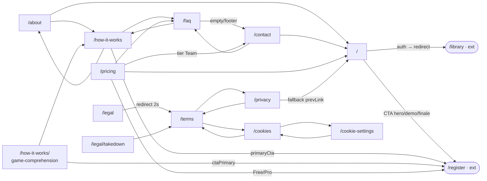

### Inviti, join, contenuti condivisi & entry pubblici
_Route-group: `(public)` · 14 pagine_

#### 1. Tabella route

| Route | Shell | Guardie | Stati principali |
|---|---|---|---|
| `/accept-invite` | PublicLayout (UnifiedHeader + PublicFooter) | Nessun auth guard. Token da `?token=`; on-mount `POST /api/v1/auth/validate-invitation`; `use client` + Suspense | loading · valid · submitting · success |
| `/invites/[token]` | PublicLayout; client grid 2-col (brand aside + auth-card) | Nessun auth (guest); `dynamic='force-dynamic'`, metadata noindex; SSR seed `getInvitation(no-store)` | loading · default · logged-in · accepted-success · declined · token-expired · token-invalid · already-accepted |
| `/join` | PublicLayout; grid 2-col (hero+features / form sticky) | Nessun auth. **Indicizzabile** (robots index/follow); server sottile + Suspense | default · submitting · success · error · already-on-list |
| `/join/event/[code]` | PublicLayout; `<main max-w-2xl>`, force-dynamic, Suspense | Nessun auth (anonima, optional-auth trasparente); metadata noindex; nessun fetch SSR; endpoint rate-limited (GET 60/min, POST 10/min IP) | loading · token-invalid · token-expired · token-cancelled · rate-limited · generic-error · rsvp |
| `/join/session/[code]` | PublicLayout; `<main>` gradiente amber, max-w-sm, Suspense | Nessun auth (QR); `GET .../live-sessions/code/{code}/public`; validazione zod | loading · loaded · error |
| `/game-nights/shared/[token]` | PublicLayout; page `use client` (useParams) | Nessun auth: il token autorizza la lettura (read-only) | loading · error · success |
| `/library/shared/[token]` | PublicLayout; page `use client` autonoma | Nessun auth: share token in URL; `useSharedLibrary` gestisce token non valido/scaduto/revocato | loading · error/not-found · empty · success |
| `/play-records/shared/[token]` | PublicLayout; page `use client` → `PlayRecordPublicView` | Nessun auth: share token; `currentUserId=null` forzato → spettatore (isCreator sempre false) | loading · not-found/error · success (spectator) |
| `/shared-games` | PublicLayout; `<main>` gradiente radiale max-w-1280, revalidate=60, Suspense | Nessun auth. **Indicizzabile**; SSR seed 3-way `Promise.allSettled` (resiliente a fallimenti parziali) | default · loading · error · empty-search · filtered-empty |
| `/shared-games/[id]` | PublicLayout; `<main>` gradiente radiale max-w-1024, revalidate=60, Suspense | Nessun auth; `generateMetadata` dinamica index; SSR seed 2-way allSettled; 404 → `notFound()`, 5xx/timeout → error boundary | default · loading · error · not-found · empty-tab |
| `/library-public` | PublicLayout; server component → `LibraryPublicHome` | Nessun auth (landing); dati = fixture mock inline (fetch reale non cablato, Stage 1) | static (nessun loading/empty/error runtime) |
| `/dev/meeple-card` | PublicLayout; page `use client`, force-dynamic, `<div>` proprio | Nessun auth (dev/demo) | static (nessun fetch) |
| `/join/[token]` | **Solo root `app/layout.tsx`** (no route-group, no PublicLayout/DesktopShell); `<main>` gradiente amber full-screen, Suspense | Nessun auth; `GET /api/v1/live-sessions/code/{token}`; auto-rejoin da token+nome cifrati + `POST .../guest/validate` | loading · name-entry · joined · error |
| `/offline` | **Solo root `app/layout.tsx`** (no PublicLayout); `<main>` con HeroGradient | Nessun auth; fallback PWA (service worker) quando offline | offline (statico) · auto-back quando online |

#### 2. Navigazione in uscita

- **`/accept-invite`**
  - `→ /invitation-expired` (router.push in useEffect validazione; token assente, oppure validate-invitation !ok, oppure isValid=false con errorReason ≠ `already_used`, oppure errore/catch di rete)
  - `→ /login` (router.push in useEffect; isValid=false && errorReason===`already_used`)
  - `→ /onboarding` (router.push in `setTimeout(1500ms)` dopo submit; accept-invitation ok → success)
- **`/invites/[token]`**
  - `→ /` (Link ctaHome TokenInvalidShell; state token-invalid)
  - `→ /` (Link ctaHome TokenExpiredShell; state token-expired)
  - `→ /` (returnHomeLabel DeclinedShell; state declined)
  - `→ (nessun cambio route)` (Accept/Decline/Undo = mutation `useRespondToInvitation` POST, refetch su 409; la surface cambia via FSM)
- **`/join`**
  - `→ /login` (Link loginHref in JoinForm, "Hai già un invito? Accedi"; sempre disponibile)
  - `→ (nessun cambio route)` (submit `useWaitlistSubmit`; success mostra surface inline posizione + estimatedWeeks)
- **`/join/event/[code]`**
  - `→ /register` (Link CTA "Crea account" aside; SOLO dopo una risposta: `currentResponse !== undefined`)
  - `→ /` (homeCta in InvalidTokenError / ExpiredOrCancelledError; surface token-invalid/expired/cancelled)
  - `→ (label senza route)` (requestNewInviteCta in ExpiredOrCancelledError; solo label, no href)
  - `→ (nessun cambio route)` (Accept/Decline = `respond.submit(action, displayName)`, refetch GET su success/409)
- **`/join/session/[code]`**
  - `→ (nessuna navigazione)` (bottone "Riprova" → `loadSession()`; viewState===error — ricarica dati, non cambia route)
- **`/library/shared/[token]`**
  - `→ /` (Link "Torna alla Home" nella card "Libreria Non Trovata"; error || !sharedLibrary)
  - `→ /login` (Link "Inizia Ora" footer CTA; sempre presente in success — nota: punta a `/login`, non `/register`/`/join`)
  - `→ (nessuna nav dalle card)` (MeepleCard senza href → card gioco non navigabili)
- **`/play-records/shared/[token]`**
  - `→ /` (Link "Torna alla Home" NotFoundState; error || !record)
  - `→ /play-records/new` (Rematch CTA; isCompleted && !isCooperative — **rotta protetta**)
  - `→ /play-records/{id}/edit` (PlayRecordHeroPodium onStart; solo se variant hero espone ctaStart — **rotta protetta**)
  - `→ /games/{gameId}` (ConnectionBar GameChip Link; SOLO se `record.gameId !== null`, altrimenti `<span>` senza ancora — **rotta protetta**)
- **`/shared-games`**
  - `→ /shared-games/{id}` (SharedGamesGrid card → `MeepleCardGame` `<Link prefetch>`; click card catalogo)
  - `→ commons.wikimedia.org` (esterno; link attribuzione cover Wikidata se `wikidataCoverSourceUrl` presente)
  - `→ (URL hash, stessa route)` (filtri q/chips/genre/sort via `useUrlHashState`; deep-link friendly)
- **`/shared-games/[id]`**
  - `→ /login` (StickyCta signInHref, mobile bar + desktop pill; solo se `!hideStickyCta` E guest confermato — null se autenticato/loading)
  - `→ (URL hash tab, stessa route)` (Tabs onChange → setActiveTab; overview/toolkits/agents/knowledge/community)
  - `→ back` (NotFoundState backLabel; surface not-found)
- **`/library-public`**
  - `→ /join` (HeroGradient primaryCta "Inizia gratis"; sempre)
  - `→ /how-it-works` (HeroGradient secondaryCta "Come funziona"; sempre)
  - `→ /shared-games/{gameId}` (FeaturedGamesCarousel, ogni card in `<Link>`; solo se featured.length>0)
  - `→ /join` (CTA footer Link "Crea account gratis"; sempre)
- **`/dev/meeple-card`**
  - `→ (nessuna navigazione)` (tutte le azioni/onClick usano `alert()` dimostrativi; nessun Link/router)
- **`/join/[token]`**
  - `→ (nessuna navigazione route)` (join/propose API-driven via fetch; "Riprova" → `loadSession()`; cambiano solo gli stati FSM)
- **`/offline`**
  - `→ /` (HeroGradient secondaryCta href=`/`; sempre)
  - `→ (reload, nessuna route)` (HeroGradient primaryCta onClick → `window.location.reload()`; retry)
  - `→ history.back()` (useEffect: se `isOnline` → `window.history.back()`; connessione ripristinata)
- **`/game-nights/shared/[token]`**: nessun edge — per design NON espone CTA share/archive/navigation (solo lettura autorizzata dal token).

#### 3. Superfici condizionali (show / hide / enable)

##### `/accept-invite`
- **LoadingCard** — mostrato quando `state==='loading'`. `apps/web/src/app/(public)/accept-invite/page.tsx`
- **SuccessCard** — mostrato quando `state==='success'`. `apps/web/src/app/(public)/accept-invite/page.tsx`
- **PasswordFormCard** — mostrato quando `state==='valid' || state==='submitting'`. `apps/web/src/app/(public)/accept-invite/page.tsx`
- **Strength bar + requirements checklist** — solo quando `password.length > 0`. `apps/web/src/app/(public)/accept-invite/page.tsx`
- **Messaggio "Passwords do not match"** — quando `confirmPassword.length>0 && password!==confirmPassword`. `apps/web/src/app/(public)/accept-invite/page.tsx`
- **Messaggio "Passwords match"** — quando `passwordsMatch`. `apps/web/src/app/(public)/accept-invite/page.tsx`
- **submitError banner** — quando `submitError` valorizzato (accept-invitation !ok o errore rete). `apps/web/src/app/(public)/accept-invite/page.tsx`
- **Submit button** — disabilitato quando `!canSubmit || isSubmitting`; label → spinner "Creating account..." se isSubmitting. `apps/web/src/app/(public)/accept-invite/page.tsx`
- **Input password/confirmPassword** — disabled quando isSubmitting; email input sempre readOnly (`bg-muted`). `apps/web/src/app/(public)/accept-invite/page.tsx`

##### `/invites/[token]`
_Tutte in `apps/web/src/app/(public)/invites/[token]/page-client.tsx`_
- **TokenInvalidShell** — `state==='token-invalid'`.
- **TokenExpiredShell** — `state==='token-expired'`; sub-text usa hostName se presente, altrimenti banner goneExpired generico.
- **AcceptedSuccessSurface** — `state==='accepted-success' && invitation`.
- **DeclinedSurface (con Undo)** — `state==='declined' && invitation`; Undo disabilitato mentre `respond.state==='submitting'`.
- **AlreadyRespondedSurface** — `state==='already-accepted' && invitation`; banner esito (accepted/declined) + rosterCount.
- **PendingSurface** — invitation presente e nessuno stato terminale (default/logged-in).
- **Empty loading fallback (…)** — `!invitation` e nessun errore strutturale (SSR vuoto pre-retry).
- **Brand aside desktop** — `hidden lg:flex`, visibile solo da `lg` (aria-hidden).
- **Game thumbnail 32px (inline)** — solo se `primaryGameImageUrl && primaryGameName`.
- **Pre-fill badge (loggedIn)** — solo se `hasSession` (useAuthUser → user truthy).
- **Accept CTA label** — `acceptCtaLoggedIn(displayName)` se `hasSession && userDisplayName>0`, altrimenti `acceptCta`; entrambi disabled quando isSubmitting; label → submittingAccept/submittingDecline.
- **conflictBanner (warning)** — `respond.state==='conflict' && result.kind==='conflict-state-switch'`.
- **errorBanner (error)** — `respond.state==='error'`.
- **`?state=` override FSM** — solo se `STATE_OVERRIDE_ENABLED` (non-prod || `NEXT_PUBLIC_VISUAL_TEST_FIXTURE_ENABLED==1`); dead-code in prod.

##### `/join`
- **JoinHero (mobile, compact=false)** — wrapper `lg:hidden` (una sola `<h1>` esposta per breakpoint). `apps/web/src/app/(public)/join/page-client.tsx`
- **JoinHero (desktop, compact)** — wrapper `hidden lg:block`. `apps/web/src/app/(public)/join/page-client.tsx`
- **JoinForm FSM** — stati default/submitting/success/error/already-on-list da `useWaitlistSubmit`; success sostituisce il form con schermata posizione. `apps/web/src/components/ui/join (JoinForm)`
- **Banner alreadyOnList / errorGeneric / errorEmailField / alreadyEmailField** — labels risolti a monte, resi in base a stato/result mutation. `apps/web/src/app/(public)/join/page-client.tsx`
- **`?state=` override** — solo `IS_NON_PROD`; forza `JoinFormState` via query param. `apps/web/src/app/(public)/join/page-client.tsx`

##### `/join/event/[code]`
- **PublicBanner (role=note)** — sempre in cima (cue route anonima). `apps/web/src/app/(public)/join/event/[code]/_components/PublicJoinEventView.tsx`
- **loading paragraph** — `surface==='loading'` (isLoading || !invitation). `.../PublicJoinEventView.tsx`
- **InvalidTokenError** — `surface==='token-invalid'` (InvitationNotFoundError su GET). `apps/web/src/components/features/game-night-detail`
- **ExpiredOrCancelledError** — `surface==='token-expired'||'token-cancelled'`; kind da respond gone.reason o invitation.status. `apps/web/src/components/features/game-night-detail`
- **RateLimitedError (countdown+retry)** — `surface==='rate-limited'` (429 GET/POST); retryAfterSeconds da result/error. `apps/web/src/components/features/game-night-detail`
- **GenericError (retry)** — `surface==='generic-error'` (5xx/network); isRetrying=invitationQuery.isFetching. `apps/web/src/components/features/game-night-detail`
- **RsvpSurface (GameNightDetailHero mode=public + PublicRsvpForm)** — `surface==='rsvp' && invitation`. `.../PublicJoinEventView.tsx`
- **errorBanner (role=alert) in RsvpSurface** — `respond.state==='error'` oppure `result.kind==='invalid-display-name'`. `.../PublicJoinEventView.tsx`
- **Create-account CTA aside (Link /register)** — SOLO se `currentResponse !== undefined` (dopo risposta salvata). `.../PublicJoinEventView.tsx`
- **PublicRsvpForm alreadyResponded panel** — conferma "già risposto" (named/anonymous, accepted/declined) quando currentResponse set; toggle changeResponse. `apps/web/src/components/features/game-night-detail (PublicRsvpForm)`
- **Precedenza FSM mutation** — gone/rate-limited derivati dal POST hanno precedenza sullo stato query cache. `.../PublicJoinEventView.tsx`

##### `/join/session/[code]`
_Tutte in `apps/web/src/app/(public)/join/session/[code]/guest-session-view.tsx`_
- **Loading main (spinner)** — `viewState==='loading'`.
- **Error main ("Sessione non trovata" + Riprova)** — `viewState==='error'` (fetch !ok o catch/parse).
- **Loaded main (header+scoreboard+players)** — `viewState==='loaded' && session` (se !session → return null).
- **LiveScoreboard vs empty** — `LiveScoreboard` (isRealTime) quando `scoreboardPlayers.length>0` (solo attivi), altrimenti "Nessun giocatore ancora".
- **Lista giocatori** — solo `session.players.filter(p=>p.isActive)`; count nel titolo.
- **statusLabel badge** — mappa status → label IT (Created/Setup→In preparazione, InProgress→In corso, Paused→In pausa, Completed→Completata; fallback status raw).

##### `/game-nights/shared/[token]`
- **Loading placeholder (shared-summary-loading)** — `query.isLoading`. `apps/web/src/components/features/game-nights/summary/SharedGameNightSummaryView.tsx`
- **Error placeholder (shared-summary-error)** — `query.isError || !query.data`. `.../summary/SharedGameNightSummaryView.tsx`
- **NightSummaryView** — reso quando `query.data`; riceve `archived=query.data.isArchived` (view-model via `toNightSummaryViewModel`). `apps/web/src/components/features/game-nights/summary/NightSummaryView.tsx`
- **GameNightPhotoGallery** — solo se `(photosQuery.data?.length ?? 0) > 0`. `apps/web/src/components/features/game-nights/photos/GameNightPhotoGallery.tsx`

##### `/library/shared/[token]`
_Tutte in `apps/web/src/app/(public)/library/shared/[token]/page.tsx`_
- **Skeleton grid** — `isLoading` (header + stats + 6 card skeleton).
- **Card "Libreria Non Trovata"** — `error || !sharedLibrary`.
- **Badge preferiti** — solo se `sharedLibrary.favoritesCount > 0`.
- **Alert "Libreria Non Elencata"** — solo se `sharedLibrary.privacyLevel === 'unlisted'`.
- **Games grid vs empty card** — grid MeepleCard quando `games.length>0`, altrimenti card "Libreria Vuota".
- **MeepleCard badge "Preferito"** — quando `game.isFavorite`; subtitle=publisher (opz.); metadata year solo se `game.yearPublished`.

##### `/play-records/shared/[token]`
- **LoadingSkeleton** — `isLoading`. `apps/web/src/components/play-records/PlayRecordPublicView.tsx`
- **NotFoundState** — `error || !record`. `apps/web/src/components/play-records/PlayRecordPublicView.tsx`
- **Barra azioni creator (Condividi/Storico/Aggiungi foto)** — nascosta: solo se `isCreator` (`currentUserId===record.createdByUserId`); qui currentUserId=null → sempre false. `apps/web/src/components/play-records/PlayRecordDetailBody.tsx`
- **Dialog SharePlayRecord / PhotoUpload / History** — montati solo se `isCreator` → mai in vista pubblica. `apps/web/src/components/play-records/PlayRecordDetailBody.tsx`
- **Classifica** — quando `clasificaRows.length>0`; spectator → nessun highlight. `apps/web/src/components/play-records/detail/Classifica.tsx`
- **ScoreBreakdown accordion** — quando `record.scoringConfig.enabledDimensions.length>1`. `apps/web/src/components/play-records/detail/ScoreBreakdown.tsx`
- **Sezione Note** — quando `record.notes` presente. `apps/web/src/components/play-records/PlayRecordDetailBody.tsx`
- **Rematch CTA** — solo quando `isCompleted && !isCooperative`. `apps/web/src/components/play-records/PlayRecordDetailBody.tsx`
- **ConnectionBar MVP chip** — solo se esattamente 1 winner (`winnerPlayerIds.length===1` → mvpName). `apps/web/src/components/play-records/detail/ConnectionBar.tsx`
- **ConnectionBar chat chip** — "Nessuna chat" (dashed) quando `chatCount===0` (hardcoded 0), altrimenti solid. `apps/web/src/components/play-records/detail/ConnectionBar.tsx`
- **PlayRecordHeroPodium variant** — variant da `perspective.kind` (spectator/won/tied/cooperative/pending→planned|inprogress); ctaStart in base al variant. `apps/web/src/components/play-records/primitives/PlayRecordHeroPodium.tsx`

##### `/shared-games`
- **SharedGamesGrid (5 stati)** — `gridState` = default/loading/error/empty-search/filtered-empty; computato da isError/isLoading/shown/debouncedQuery/hasActiveFilters. `apps/web/src/app/(public)/shared-games/page-client.tsx`
- **`?state=` override** — solo `IS_NON_PROD`; se ≠ 'default' azzera le card (empty/error/loading puliti). `apps/web/src/app/(public)/shared-games/page-client.tsx`
- **ContributorsSidebar** — wrapper `hidden lg:block` (solo desktop). `apps/web/src/app/(public)/shared-games/page-client.tsx`
- **EmptyState kind** — 'empty-search' vs 'filtered-empty' in base a gridState; onReset=handleResetFilters. `apps/web/src/components/ui/shared-games (EmptyState)`
- **ErrorState (retry)** — `gridState==='error'` → onRetry=refetch. `apps/web/src/components/ui/shared-games (ErrorState)`
- **SharedGamesFilters** — chips toggle, genre/sort select, search (debounce 300ms); contatore shown/total. `apps/web/src/components/ui/shared-games (SharedGamesFilters)`

##### `/shared-games/[id]`
- **Surface loading/error/not-found** — `effectiveStatus = stateOverride ?? status(hook)`; montano `<main>` dedicati con early return. `apps/web/src/app/(public)/shared-games/[id]/page-client.tsx`
- **`?state=` override (5 valori)** — se `STATE_OVERRIDE_ENABLED` (non-prod || visual-test); default/loading/error/not-found/empty-tab. `.../shared-games/[id]/page-client.tsx`
- **5 tabpanel (overview/toolkits/agents/knowledge/community)** — resi tutti staticamente, nascosti via `hidden={activeTab!==key}`. `.../shared-games/[id]/page-client.tsx`
- **Lista vs EmptyState per tab** — toolkits/agents/kbs: lista quando items>0, altrimenti EmptyState; override 'empty-tab' azzera i tre array. `.../shared-games/[id]/page-client.tsx`
- **CTA item DISABILITATI (Anteprima/Prova/Apri)** — list-item montati senza previewHref/tryHref/openHref → `<span aria-disabled>` inerte; i CTA NON navigano. `.../shared-games/[id]/page-client.tsx`
- **Overview description** — `game.description` se presente, altrimenti noDescription (italic). `.../shared-games/[id]/page-client.tsx`
- **StickyCta** — solo se `!hideStickyCta` AND guest confermato: guard interno `useCurrentUser` (Issue #2081) → null se autenticato o isLoading. `apps/web/src/components/ui/detail-layout/sticky-cta.tsx`
- **ContributorsStrip + ContributorsSection (legacy)** — nel tab community; ContributorsSection riusa 1:1 il componente legacy (gameId). `apps/web/src/components/shared-games/ContributorsSection.tsx`

##### `/library-public`
- **FeaturedGamesCarousel cards vs empty** — `<Link>`+MeepleCard quando `games.length>0`, altrimenti "Nessun gioco in evidenza al momento.". `apps/web/src/components/features/library-public/FeaturedGamesCarousel.tsx`
- **CommunityStatsRow (4-col)** — griglia statistiche sempre resa (stats mock). `apps/web/src/components/features/library-public/CommunityStatsRow.tsx`
- **WhatYouCanDo 3 bullets + CTA strip** — contenuto statico. `apps/web/src/components/features/library-public/LibraryPublicHome.tsx`

##### `/dev/meeple-card`
_Route dev-fixture (nessuna business logic, solo `alert()`)_
- **Quick Actions (hover)** — solo con `showQuickActions={true}` AND `actions.length>0`; azione `disabled:true` non cliccabile. `apps/web/src/app/(public)/dev/meeple-card/page.tsx`
- **Connection chips disabled** — chip a 45% opacity + not-allowed quando `.disabled`; tooltip con la ragione. `apps/web/src/app/(public)/dev/meeple-card/page.tsx`
- **Carousel3D** — `hidden md:flex` (solo desktop md+). `apps/web/src/components/ui/data-display/meeple-card (Carousel3D)`
- **MeepleCardSkeleton** — sezione stato caricamento (dimostrativa). `apps/web/src/components/ui/data-display/meeple-card`
- **EntityTable sortable** — header Titolo/Tipo/Rating cliccabili (demo); onRowClick → alert. `apps/web/src/components/ui/data-display/meeple-card (EntityTable)`

##### `/join/[token]`
_Tutte in `apps/web/src/app/join/[token]/GuestJoinView.tsx`_
- **Loading main** — `joinState==='loading'`.
- **Error main ("Sessione non trovata" + Riprova)** — `joinState==='error'` (fetch !ok o catch).
- **Name-entry form** — `joinState==='name-entry' && sessionInfo`; submit disabilitato se `isJoining || !inputName.trim()`; input maxLength=40 disabled se isJoining; nameError inline (vuoto / <2 char / server).
- **Joined view (ScoreBoard + GuestScoreProposal)** — `joinState==='joined' && sessionInfo`.
- **Auto-rejoin** — se `getSavedToken()+getSavedName()` presenti e validate POST ok → salta a 'joined'; altrimenti pulisce localStorage → 'name-entry'.

##### `/offline`
_Tutte in `apps/web/src/app/offline/page.tsx`_
- **Sezione storageStats (Divider + 3 Stat)** — solo se `storageStats` presente (usePWA); mostra sessions/cachedGames/pendingActions.
- **Status sr-only (aria-live)** — testo online vs offline in base a `isOnline` (screen reader).

#### 4. Componenti → file

| Componente | File | Ruolo |
|---|---|---|
| AcceptInviteContent | `apps/web/src/app/(public)/accept-invite/page.tsx` | FSM 4-stati accetta-invito + 2 fetch diretti `/api/v1/auth/*` (crea account) |
| InvitesTokenPageClient | `apps/web/src/app/(public)/invites/[token]/page-client.tsx` | FSM 7-stati RSVP legacy (deriveState) + mutation accept/decline inline |
| JoinPageClient / JoinForm | `apps/web/src/app/(public)/join/page-client.tsx` · `apps/web/src/components/ui/join/*` | Waitlist Alpha (FSM position/estimatedWeeks) |
| PublicJoinEventView | `apps/web/src/app/(public)/join/event/[code]/_components/PublicJoinEventView.tsx` | Orchestratore FSM 7-surface RSVP anonimo + submit displayName |
| GuestSessionView | `apps/web/src/app/(public)/join/session/[code]/guest-session-view.tsx` | Fetch pubblico + FSM 3-stati read-only (QR spettatore) |
| GuestJoinView | `apps/web/src/app/join/[token]/GuestJoinView.tsx` | FSM 4-stati **interattivo**: join per nome + proposta punteggio |
| SharedGameNightSummaryView | `apps/web/src/components/features/game-nights/summary/SharedGameNightSummaryView.tsx` | Fetch summary+photos + guard loading/error (read-only) |
| SharedLibraryPage | `apps/web/src/app/(public)/library/shared/[token]/page.tsx` | Fetch + render collezione condivisa (card non linkate) |
| PlayRecordPublicView / PlayRecordDetailBody | `apps/web/src/components/play-records/PlayRecordPublicView.tsx` · `.../PlayRecordDetailBody.tsx` | Spettatore read-only (`currentUserId=null` spegne le azioni creator) |
| SharedGamesPageClient | `apps/web/src/app/(public)/shared-games/page-client.tsx` | URL-hash state + debounce + FSM 5-stati grid catalogo |
| SharedGameDetailPageClient | `apps/web/src/app/(public)/shared-games/[id]/page-client.tsx` | FSM 5-override + tab URL-hash + 5 tabpanel + StickyCta gating (riusato da hub autenticato con `hideStickyCta=true`) |
| LibraryPublicHome | `apps/web/src/components/features/library-public/LibraryPublicHome.tsx` | Composizione landing (hero/stats/featured/features/CTA), fixture mock |
| MeepleCardDevPage | `apps/web/src/app/(public)/dev/meeple-card/page.tsx` | Vetrina varianti/entity/feature MeepleCard (solo `alert()`) |
| OfflinePage | `apps/web/src/app/offline/page.tsx` | Fallback PWA + auto-return quando online |
| MeepleCard / MeepleCardGame | `apps/web/src/components/ui/data-display/meeple-card` · `.../ui/shared-games/meeple-card-game.tsx` | Card gioco (grid); MeepleCardGame `<Link>` → `/shared-games/{id}` |
| GameNightDetailHero / PublicRsvpForm / InvalidTokenError / ExpiredOrCancelledError / RateLimitedError / GenericError | `apps/web/src/components/features/game-night-detail/*` | Hero pubblico + form RSVP + surface errore (`/join/event/[code]`) |
| StickyCta | `apps/web/src/components/ui/detail-layout/sticky-cta.tsx` | CTA sign-in → `/login` con guard `useCurrentUser` (solo guest) |
| LiveScoreboard | `apps/web/src/components/game-night/LiveScoreboard.tsx` | Classifica read-only real-time (QR session) |
| HeroGradient | `apps/web/src/components/ui/hero-gradient` | Hero CTA (offline retry, landing library-public) |
| useGameNightInvitation / useRespondToInvitation | `apps/web/src/hooks/*` | Query GET (SSR-seeded o rate-limit aware) + mutation POST RSVP |
| useSharedLibrary / useSharedPlayRecord / useSharedGameNightSummary | `apps/web/src/hooks/queries` | Query risorse condivise via share token |
| useSharedGames / useSharedGameDetail / useUrlHashState / useDebounce | `apps/web/src/hooks/*` | Query catalogo + dettaglio SSR-seeded + stato URL-hash + debounce |
| useWaitlistSubmit | `apps/web/src/hooks/useWaitlistSubmit.ts` | Mutation FSM waitlist (position/estimatedWeeks) |
| useLiveSessionStore / secureStorage | `apps/web/src/lib/stores/live-session-store` · `.../lib/api/core/secureStorage` | Store sessione live + persistenza token cifrata (`/join/[token]`) |

#### 5. Navigazione interna al cluster

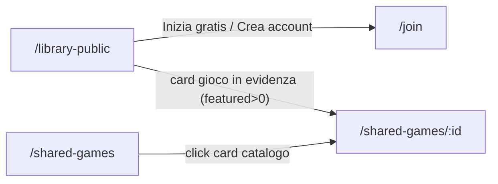

_Nota: gli altri edge del cluster puntano fuori dal route-group `(public)` (`/login`, `/register`, `/onboarding`, `/invitation-expired`, `/`, `/how-it-works`, `/games/{id}`, `/play-records/*`) e non compaiono nel diagramma interno._


## Autenticazione — `(auth)`

Flussi di autenticazione/onboarding-entry. Shell: `<main>` + `AuthLayout` per-pagina (card centrata). Nessuna protezione (pagine per anonimi).

### Autenticazione & Onboarding entry
_Route-group: `(auth)` · 10 pagine_

#### 1. Tabella route

| Route | Shell | Guardie | Stati principali |
|---|---|---|---|
| `/login` | `(auth)` layout → AuthCard (no DesktopShell) | Nessuna (pubblica; non redirige utenti già autenticati; nessun getMe al mount) | loading · field-validation-error · error · 2fa-challenge · 2fa-field-error/2fa-error · session-expired · success→redirect |
| `/register` | `(auth)` layout → AuthCard (public/invite-only) o `<div>` loading | Nessuna auth; gating funzionale via RegistrationMode (fail-closed a invite-only) | loading · public · invite-only · invite-only success · authenticating · field-validation-error · error · success→/verification-pending |
| `/oauth-callback` | Nessuna UI: Server Component che chiama `redirect()` server-side | Nessuna (passthrough; preserva l'intera querystring) | nessun rendering (redirect immediato) |
| `/reset-password` | `(auth)` layout → AuthCard (una card per stato) | `getMe` al mount → se autenticato push `/chat`; robots noindex/nofollow | auth-check · already-authenticated→/chat · request-form · request-success · reset-verifying · reset-invalid-token · reset-form · reset-success→/chat\|/ |
| `/setup-account` | `(auth)` layout → AuthLayout (main annidato → doppio landmark) | Nessuna auth; gating token invito (POST validate-invitation, token nel body, mai in URL) | validating · token-missing · invalid-invitation · already-used-invitation · form · submitting · activation-success→/onboarding\|/library · error |
| `/verify-email` | `(auth)` layout → AuthCard (una card per stato) | Nessuna auth; verifica token al mount (guard `hasAttempted`); robots noindex/nofollow | no-token · verifying · verified · error (per errorType) · default-loading |
| `/verification-pending` | `(auth)` layout → AuthCard | Nessuna auth; email da `?email` o fallback sessionStorage | no-email · pending · resending · cooldown · error |
| `/verification-success` | `(auth)` layout → `<Suspense>` → AuthLayout (main annidato) | Nessuna (pagina fallback/alternativa) | suspense-loading · success (countdown) · success (post-redirect) |
| `/welcome` | `(auth)` layout → `<main>` full-screen custom (no AuthCard/AuthLayout) | Nessuna (auto-redirect 2s) | not-mounted · mounted (progressbar) · redirect |
| `/invitation-expired` | `(auth)` layout → AuthLayout (main annidato) | Nessuna (statica, nessuna logica async) | static |

#### 2. Navigazione in uscita

- **`/login`**
  - `/login -> /library` (redirectAfterAuth post-login: delay 100ms → router.refresh → push; target = `assertSafeRelativeOrFallback(?from, '/library')`, admin/superadmin inclusi — #893)
  - `/login -> /library` (redirectAfterAuth post-verifica 2FA; = `?from` validato o `/library`)
  - `/login -> /register` (link footerAction `noAccount`)
  - `/login -> /reset-password` (link `forgotPassword`)
  - `/login -> backend {NEXT_PUBLIC_API_BASE}/api/v1/auth/oauth/{google|discord|github}/login` (OAuthButton → `window.location.assign`; 3 provider sempre visibili, nessun gating)
- **`/register`**
  - `/register -> /verification-pending?email=<email>` (post-register public + trackSignUp + delay 100ms; honeypot compilato → submit ignorato)
  - `/register -> /login` (link footerAction `hasAccount`; solo public)
  - `/register -> backend /api/v1/auth/oauth/{google|discord|github}/login` (OAuthButton; solo se `oauthEnabled===true`, public)
  - `/register -> /terms` (nuova scheda; checkbox termini, public)
  - `/register -> /privacy` (nuova scheda; checkbox termini, public)
- **`/oauth-callback`**
  - `/oauth-callback -> /login[?qs]` (redirect server-side; ri-serializza la querystring con append per valori array, altrimenti redirect nudo)
- **`/reset-password`**
  - `/reset-password -> /chat` (checkAuth d'ingresso; se già autenticato al mount)
  - `/reset-password -> /chat` (setTimeout 2s post-reset; auto-login ok && `!requiresTwoFactor`)
  - `/reset-password -> /` (setTimeout 2s; auto-login fallito o richiede 2FA)
  - `/reset-password -> /reset-password` (btn `invalidLinkCta`; `tokenValid===false`, richiedi nuovo)
  - `/reset-password -> /` (link footerAction `backToLogin`, href="/"; in request-form/success, invalid-token, reset-form token valido)
- **`/setup-account`**
  - `/setup-account -> /onboarding` (setTimeout 1.5s post-activate; `requiresOnboarding===true`)
  - `/setup-account -> /library` (setTimeout 1.5s; `requiresOnboarding===false`)
  - `/setup-account -> /login` (link Vai al Login/footer; token mancante, already_used, footer form valido)
  - `/setup-account -> /` (link Torna alla Home; ramo invito NON valido — invalid/scaduto o already_used)
- **`/verify-email`**
  - `/verify-email -> /library` (VerificationSuccess onRedirect: auto 3s o bottone continue; `isVerified`)
  - `/verify-email -> /login` (VerificationError onGoToLogin; `errorType==='already_verified'`)
  - `/verify-email -> /verification-pending?email=<email>` (onRetry; email disponibile)
  - `/verify-email -> /register` (onRetry con email assente, oppure resend senza email)
- **`/verification-pending`**
  - `/verification-pending -> /register` (button `goToRegister`; solo stato no-email)
- **`/verification-success`**
  - `/verification-success -> /library` (VerificationSuccess onRedirect: auto 3s o continue; sempre, `redirectUrl=/library`)
- **`/welcome`**
  - `/welcome -> /library` (setTimeout 2s → handleRedirect; target = `assertSafeRelativeOrFallback(?redirectTo, '/library')`)
  - `/welcome -> /library` (btn `welcome-go-dashboard`; = `?redirectTo` validato o `/library`, immediato)
- **`/invitation-expired`**
  - `/invitation-expired -> /register` (btn Request Access; incondizionato)
  - `/invitation-expired -> /login` (btn ghost Back to Login; incondizionato)

#### 3. Superfici condizionali (show / hide / enable)

#### /login
- session-expired-banner (alert giallo): mostrato SOLO se `reason==='session_expired'` (da `?reason`) · `apps/web/src/app/(auth)/login/_content.tsx`
- TwoFactorVerification (in AuthCard 2FA): sostituisce TUTTO il form quando `show2FA===true` (login ritorna `requiresTwoFactor && tempSessionToken`) · `apps/web/src/app/(auth)/login/_content.tsx`
- LoginForm error alert (role=alert): mostrato quando prop `error` non vuoto · `apps/web/src/components/auth/LoginForm.tsx`
- LoginForm validazione inline (email/password): per-campo su zodResolver — email obbligatoria/non valida; password min 12 / max 128 · `apps/web/src/components/auth/LoginForm.tsx`
- LoginForm campi + submit: disabled/loading quando `isLoading` (loading || RHF isSubmitting) · `apps/web/src/components/auth/LoginForm.tsx`
- 2FA header inline: NASCOSTO (`showInlineHeader = title||subtitle`; `_content` passa title/subtitle all'AuthCard, non al componente → evita doppio heading) · `apps/web/src/components/auth/TwoFactorVerification.tsx`
- 2FA checkbox remember-device: mostrato (`showRememberDevice===true`) · `apps/web/src/components/auth/TwoFactorVerification.tsx`
- 2FA link backup code: nascosto (`onUseBackupCode` non passato) · `apps/web/src/components/auth/TwoFactorVerification.tsx`
- 2FA bottone cancel: mostrato (`onCancel` → torna al form login) · `apps/web/src/components/auth/TwoFactorVerification.tsx`
- 2FA submit + auto-submit: submit disabled se `codeValue.length<6`; auto-submit a 6 cifre (`^\d{6}$`), guard anti-doppio via `autoSubmittedCodeRef`; input fino a 8 char (backup) · `apps/web/src/components/auth/TwoFactorVerification.tsx`
- 2fa-code-error inline (role=alert): mostrato quando `errors.code` (zod min6/max8 + regex) · `apps/web/src/components/auth/TwoFactorVerification.tsx`
- 2fa-error alert (role=alert): mostrato quando `twoFactorError` non vuoto; dismiss via `onErrorDismiss` · `apps/web/src/components/auth/TwoFactorVerification.tsx`

#### /register
- register-loading (`<div>` full-screen pulse, motion-reduce): mostrato quando `registrationMode==='loading'` · `apps/web/src/app/(auth)/register/_content.tsx`
- RequestAccessForm (AuthCard invite-only): mostrato quando `registrationMode==='invite-only'` (publicRegistrationEnabled=false o fetch fallita) · `apps/web/src/app/(auth)/register/_content.tsx`
- invite-oauth-disabled-alert (ambra): mostrato quando `oauthDisabled` (`?oauth_disabled=true`) E modo invite-only · `apps/web/src/app/(auth)/register/_content.tsx`
- RegisterForm (AuthCard public): mostrato quando `registrationMode==='public'` · `apps/web/src/app/(auth)/register/_content.tsx`
- Blocco OAuth (Divider + 3 OAuthButton): mostrato SOLO se `oauthEnabled===true`, modo public · `apps/web/src/app/(auth)/register/_content.tsx`
- RegisterForm error alert (role=alert): mostrato quando prop `error` non vuoto · `apps/web/src/components/auth/RegisterForm.tsx`
- RegisterForm validazione inline (email/password): email obbligatoria/non valida; password min 12 / max 128 · `apps/web/src/components/auth/RegisterForm.tsx`
- RegisterForm errore termsAccepted (p role=alert): mostrato quando checkbox termini non spuntato al submit (zod refine `v===true`) · `apps/web/src/components/auth/RegisterForm.tsx`
- RegisterForm honeypot: sempre presente ma nascosto (`absolute left-[-9999px]`, aria-hidden, tabIndex -1); submit droppato a monte se compilato · `apps/web/src/components/auth/RegisterForm.tsx`
- RegisterForm strength meter + disabled: `showStrength` attivo; tutti i campi disabled quando `isLoading` · `apps/web/src/components/auth/RegisterForm.tsx`
- RequestAccessForm success: sostituisce il form quando `submitted===true` (API sempre 202, enumeration-safe); nessuna navigazione · `apps/web/src/components/auth/RequestAccessForm.tsx`
- RequestAccessForm errore email + submit: `AccessibleFormInput` mostra `errors.email` (zod); submit disabled/loading quando `isSubmitting` · `apps/web/src/components/auth/RequestAccessForm.tsx`

#### /oauth-callback
- querystring suffix: redirect a `/login?${qs}` quando `qs.toString()` non vuoto; a `/login` quando nessun parametro · `apps/web/src/app/(auth)/oauth-callback/page.tsx`

#### /reset-password
- reset-password-auth-check (card loading): mostrato quando `isCheckingAuth===true` · `apps/web/src/app/(auth)/reset-password/_content.tsx`
- render null (redirect a /chat): quando `authUser` presente && `!resetSuccess` · `apps/web/src/app/(auth)/reset-password/_content.tsx`
- SuccessCard 'sent' (✉️ + CTA tryAgain): modo request (no `?token`) && `requestSuccess===true` · `apps/web/src/app/(auth)/reset-password/_content.tsx`
- Form richiesta email: modo request && `!requestSuccess`; submit disabled se `!email.trim()`; loading su `isLoading` · `apps/web/src/app/(auth)/reset-password/_content.tsx`
- reset-password-verifying (card): modo reset (`?token`) && `tokenValid===null` · `apps/web/src/app/(auth)/reset-password/_content.tsx`
- reset-password-invalid-token (+ p role=alert): modo reset && `tokenValid===false`; messaggio inline solo se `errorMessage` non vuoto · `apps/web/src/app/(auth)/reset-password/_content.tsx`
- reset-password-success (✅, role=status): modo reset && `resetSuccess===true` · `apps/web/src/app/(auth)/reset-password/_content.tsx`
- Form nuova password (2x PwdInput + strength): modo reset && `tokenValid===true`; submit disabled se `!passwordValidation.isValid` (min12/maiusc/minusc/num) || `newPassword!==confirmPassword` || `!confirmPassword.trim()` · `apps/web/src/app/(auth)/reset-password/_content.tsx`
- PwdInput conferma mismatch: mostrato quando `confirmPassword` valorizzato && `newPassword!==confirmPassword` · `apps/web/src/app/(auth)/reset-password/_content.tsx`
- reset-password-error alert (role=alert): mostrato quando `errorMessage` non vuoto (form request e reset) · `apps/web/src/app/(auth)/reset-password/_content.tsx`

#### /setup-account
- 'Verifica in corso' (spinner ⏳): mostrato quando `isValidating===true` · `apps/web/src/app/(auth)/setup-account/_content.tsx`
- 'Token mancante': mostrato quando `!token`; CTA singola → `/login` · `apps/web/src/app/(auth)/setup-account/_content.tsx`
- 'Invito non valido'/'già utilizzato': `validationResult && !isValid`; titolo/subtitle differiscono se `errorReason==='already_used'`; bottone extra 'Vai al Login' SOLO se already_used; 'Torna alla Home' sempre in questo ramo · `apps/web/src/app/(auth)/setup-account/_content.tsx`
- 'Account attivato!' (redirect ✅): mostrato quando `activationSuccess===true` · `apps/web/src/app/(auth)/setup-account/_content.tsx`
- Form password (email/displayName readonly): token valido && `isValid`; displayName reso SOLO se `validationResult.displayName` presente; email/displayName disabled · `apps/web/src/app/(auth)/setup-account/_content.tsx`
- Checklist requisiti password (4 voci): mostrata SOLO quando password non vuota; verde se soddisfatta. NB label dice 'Almeno 8 caratteri' ma `validatePassword` esige ≥12 (copy drift) · `apps/web/src/app/(auth)/setup-account/_content.tsx`
- PwdInput conferma mismatch: mostrato quando `confirmPassword` valorizzato && `password!==confirmPassword` · `apps/web/src/app/(auth)/setup-account/_content.tsx`
- Submit 'Configura Account': disabled quando `!passwordValidation.isValid` || `password!==confirmPassword` || `!confirmPassword.trim()`; loading su `isSubmitting` · `apps/web/src/app/(auth)/setup-account/_content.tsx`
- errorMessage alert (role=alert): mostrato quando `errorMessage` non vuoto · `apps/web/src/app/(auth)/setup-account/_content.tsx`

#### /verify-email
- VerificationError (no token): mostrato quando `!token`; `errorType='invalid'`, messaggio noToken, azione onRetry (onGoToLogin NON passato) · `apps/web/src/app/(auth)/verify-email/_content.tsx`
- renderLoading (verifying, role=status aria-live): mostrato quando `isLoading===true` · `apps/web/src/app/(auth)/verify-email/_content.tsx`
- VerificationSuccess: mostrato quando `isVerified===true`; auto-redirect `/library` 3s · `apps/web/src/app/(auth)/verify-email/_content.tsx`
- VerificationError (con errorType): mostrato quando `error && errorType`; `onResend` passato SOLO se email presente; onGoToLogin + onRetry sempre passati · `apps/web/src/app/(auth)/verify-email/_content.tsx`
- renderLoading default (senza status role): finestra breve tra mount e set `isLoading` · `apps/web/src/app/(auth)/verify-email/_content.tsx`
- VerificationError bottone Resend: SOLO se `errorType∈{expired,unknown} && onResend`; disabled se `cooldownSeconds>0` o `isResending`; label cooldown · `apps/web/src/components/auth/VerificationError.tsx`
- VerificationError bottone Go-to-Login: SOLO se `errorType==='already_verified' && onGoToLogin` · `apps/web/src/components/auth/VerificationError.tsx`
- VerificationError bottone Retry: SOLO se `errorType∈{invalid,not_found,unknown} && onRetry` · `apps/web/src/components/auth/VerificationError.tsx`
- VerificationError messaggio cooldown rate-limited: se `errorType==='rate_limited' && cooldownSeconds>0` (nessun bottone azione) · `apps/web/src/components/auth/VerificationError.tsx`
- VerificationError icona/colore: variano per errorType (expired=Clock/ambra, already_verified=CheckCircle2/verde, invalid|not_found=XCircle/destructive, rate_limited=ShieldAlert/arancio, default=AlertCircle/destructive) · `apps/web/src/components/auth/VerificationError.tsx`

#### /verification-pending
- verification-pending-no-email: mostrato quando `email===null`; CTA button → `/register` · `apps/web/src/app/(auth)/verification-pending/_content.tsx`
- verification-pending-page (email mascherata, role=status): mostrato quando email presente; offuscata via `maskEmail` · `apps/web/src/app/(auth)/verification-pending/_content.tsx`
- error alert (role=alert aria-live assertive): mostrato quando `error` non vuoto (resend fallito) · `apps/web/src/app/(auth)/verification-pending/_content.tsx`
- Bottone Resend: loading su `isResending`; disabled quando `!canResend` (cooldownSeconds>0 || isResending); label resending/cooldown/resendButton; leftIcon RefreshCw solo se `!isResending` · `apps/web/src/app/(auth)/verification-pending/_content.tsx`
- Messaggio cooldown (aria-live polite): mostrato quando `cooldownSeconds>0` · `apps/web/src/app/(auth)/verification-pending/_content.tsx`

#### /verification-success
- Suspense fallback (Loading...): mostrato durante l'idratazione client · `apps/web/src/app/(auth)/verification-success/page.tsx`
- VerificationSuccess countdown: mostrato quando `countdown>0 && autoRedirectSeconds>0` · `apps/web/src/components/auth/VerificationSuccess.tsx`
- VerificationSuccess email display: mostrato SOLO se prop `email` presente (qui NON passata → nascosto) · `apps/web/src/components/auth/VerificationSuccess.tsx`

#### /welcome
- WelcomeFallback (spinner PartyPopper): mostrato quando `!mounted` · `apps/web/src/app/(auth)/welcome/_content.tsx`
- Progress bar (role=progressbar, aria-valuenow): avanza 0→100 in 2s (increment ogni 50ms), a 100 clearInterval; transizione soppressa con motion-reduce · `apps/web/src/app/(auth)/welcome/_content.tsx`
- Features preview chips (3 badge): statici (Regole/Assistente AI/Libreria) · `apps/web/src/app/(auth)/welcome/_content.tsx`

#### /invitation-expired
- Contenuto statico (Clock + messaggio scadenza + 2 CTA): nessuna condizione, rendering fisso (inviti validi 7 giorni) · `apps/web/src/app/(auth)/invitation-expired/page.tsx`

#### 4. Componenti → file

| Componente | File | Ruolo |
|---|---|---|
| LoginPageContent | `apps/web/src/app/(auth)/login/_content.tsx` | Orchestratore login/2FA/redirect (+router.refresh) + open-redirect guard su `?from` |
| RegisterPageContent | `apps/web/src/app/(auth)/register/_content.tsx` | Fetch registrationMode, dispatch public/invite-only, register, OAuth, trackSignUp |
| ResetPasswordPageContent | `apps/web/src/app/(auth)/reset-password/_content.tsx` | Macchina a stati a 8 rami + auth guard + verifica token + auto-login best-effort |
| SetupAccountContent | `apps/web/src/app/(auth)/setup-account/_content.tsx` | validate-invitation → form → activate-account (fetch diretti a `NEXT_PUBLIC_API_BASE_URL`) |
| VerifyEmailContent | `apps/web/src/app/(auth)/verify-email/_content.tsx` | Verifica token (guard hasAttempted), dispatch success/error, resend/retry/go-to-login |
| VerificationPendingContent | `apps/web/src/app/(auth)/verification-pending/_content.tsx` | Attesa verifica + resend con cooldown + mascheramento email |
| WelcomeContent | `apps/web/src/app/(auth)/welcome/_content.tsx` | Celebrazione + progressbar + auto/manual redirect + open-redirect guard |
| LoginForm | `apps/web/src/components/auth/LoginForm.tsx` | Form email/password (RHF Controller + zod, min 12 max 128) |
| RegisterForm | `apps/web/src/components/auth/RegisterForm.tsx` | Form registrazione + termini GDPR (termsAcceptedAt) + honeypot + strength meter |
| RequestAccessForm | `apps/web/src/components/auth/RequestAccessForm.tsx` | Richiesta accesso invite-only → requestAccess, 202 enumeration-safe |
| TwoFactorVerification | `apps/web/src/components/auth/TwoFactorVerification.tsx` | Input TOTP/backup 6-8 char, auto-submit a 6 cifre, remember-device |
| VerificationSuccess | `apps/web/src/components/auth/VerificationSuccess.tsx` | Successo + countdown auto-redirect + open-redirect guard (14 vettori) |
| VerificationError | `apps/web/src/components/auth/VerificationError.tsx` | Errore polimorfico per 6 errorType con azioni condizionali |
| AuthCard | `apps/web/src/components/ui/auth-card/auth-card.tsx` | Shell card brand mark + titolo/sottotitolo + footerAction |
| AuthLayout | `apps/web/src/components/layouts/AuthLayout.tsx` | Shell header/footer/card centrata (con `<main>` annidato) |
| SuccessCard | `apps/web/src/components/ui/success-card` | Card conferma email inviata (emoji + CTA tryAgain) |
| OAuthButton | `apps/web/src/components/ui/oauth-buttons` | Pulsante SSO per provider |
| buildOAuthUrl | `apps/web/src/components/auth/oauth-url.ts` | Costruisce URL backend OAuth |
| assertSafeRelativeOrFallback | `apps/web/src/lib/url-safety` | Guard open-redirect su `?from`/`?redirectTo` (fallback `/library`) |
| useEmailVerification | `apps/web/src/hooks/useEmailVerification` | verifyEmail/resend; isLoading/isVerified/error/errorType/cooldownSeconds (60s) |
| useAuth | `apps/web/src/hooks/useAuth` | Espone `register()` |
| useApiClient | `apps/web/src/lib/api/context` | `accessRequests.getRegistrationMode` / `requestAccess` |
| trackSignUp | `apps/web/src/lib/analytics/flywheel-events` | Analytics evento sign-up (method:email) |
| PwdInput | `apps/web/src/components/ui/pwd-input` | Campo password con strength meter |
| InputField | `apps/web/src/components/ui/input-field` | Campo email / testo generico |
| Btn / Divider | `apps/web/src/components/ui/btn` · `apps/web/src/components/ui/divider` | Submit/CTA (asChild → Link) · separatore 'oppure' sopra OAuth |

#### 5. Navigazione interna al cluster

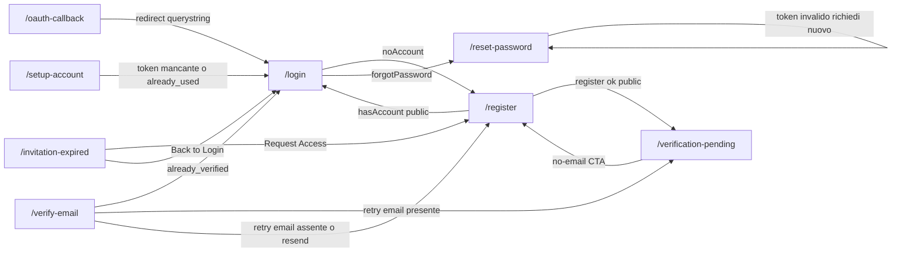

_Nota: `/verification-success` e `/welcome` instradano solo verso `/library` (esterno al gruppo); `/setup-account` verso `/onboarding`/`/library` e `/reset-password` verso `/chat`/`/` sono anch'essi esterni al route-group e quindi non rappresentati nel diagramma interno._


## Area autenticata — `(authenticated)`

Prodotto post-login. Shell: `UserShellClient → DesktopShell` (AppTopBar / MobileBottomBar / SideDrawer). Protezione client-side via `AuthProvider`/redirect per-pagina.

### Dashboard, discover, onboarding, profilo & notifiche
_Route-group: `(authenticated)` · 9 pagine_

#### Tabella route

| Route | Shell | Guardie | Stati principali |
|---|---|---|---|
| `/dashboard` | DesktopShell (`(authenticated)` → UserShellClient → DesktopShell); `DashboardClient` (`<main>` + Hero + HubPageContainer + CascadeDrawerHost) | `RequireRole ['User','Editor','Admin']` (superadmin bypassa); `dynamic='force-dynamic'` | loading · error · empty · default |
| `/discover` | DesktopShell; page rende `<Suspense fallback={null}><DiscoverHub/></Suspense>` (HubLayout `showSearch=false`) | Nessuna esplicita (delega a `(authenticated)`); `Suspense` per `useSearchParams()` | skeleton · loading/error/empty per riga · disabled · default |
| `/onboarding` | DesktopShell; modal a schermo `WizardModal` (Radix Dialog centrato) | Nessun RequireRole; gate `useAuth` (redirect `/library` se `onboardingCompleted`) | loading · null/redirect · wizard aperto |
| `/setup` | DesktopShell; `<main min-h-dvh>` proprio con header sticky (no PageContainer condiviso) | Self-guard `api.auth.getMe()` → schermata "Accesso richiesto" (no redirect auto) | unauthorized · loading · empty · success · error |
| `/versions` | DesktopShell + HubPageContainer; `Suspense` attorno a `VersionHistoryContent` | Self-guard `getMe()` + `?gameId=` obbligatorio; ripristino gated a `admin/superadmin/editor` | unauthorized · missing-gameId · loading · success · error |
| `/notifications` | DesktopShell + SettingsPageContainer (`py-8`); legge `useNotificationStore` | Nessuna esplicita (delega a `(authenticated)`) | loading · error · empty · default |
| `/notifications/preferences` | DesktopShell + SettingsPageContainer (`py-8`) | Nessuna esplicita; `dynamic='force-dynamic'` | loading · error · default |
| `/profile` | DesktopShell; `Suspense` attorno a `ProfilePageContent`; container `max-w-3xl` + TabBar 4 tab | Nessun RequireRole; `useAuth` senza redirect nel componente (delega gruppo); `Suspense` per `useSearchParams()` | loading · empty · error · default |
| `/profile/achievements` | DesktopShell; container `mx-auto py-8` + AchievementsGrid | Nessuna esplicita (delega a `(authenticated)`) | loading · error · empty · default |

#### Navigazione in uscita

- **`/dashboard`**
  - `/dashboard -> /game-nights/new` (Link "+ Nuova" ProssimiSection + CTA empty "+ Crea la tua prima Game Night"; "+ Nuova" solo default, CTA solo empty)
  - `/dashboard -> /game-nights` (viewAll "Vedi tutte" ProssimiSection; solo default)
  - `/dashboard -> /game-nights?status=completed` (footer "Vedi tutti i completati" RecentiSection; solo default)
  - `/dashboard -> drawer:gameNightEvent` (onClick card Prossimi/Recenti → `openDrawer('gameNightEvent', id)`; apre ExtraMeepleCardDrawer, NON cambia route)
  - `/dashboard -> /library/[id]` (card SuggestedSection "Potresti giocare"; solo default)
  - `/dashboard -> /library?hasKb=true` (Link "Vedi tutti ->" header Block C; solo se `agentiProntiEntries.length>0`)
  - `/dashboard -> /library/[gameId]` (MeepleCard in Block C; `agentiProntiEntries.length>0`)
  - `/dashboard -> drawer:player` (onClick avatar FriendsActivitySection → `openDrawer('player', friendUserId)`; NON cambia route)
  - `/dashboard -> /games/[id]` (ref attività amico `gameOrEventType==='game'`; default con attività)
  - `/dashboard -> /game-nights/[id]` (ref attività amico `gameOrEventType!=='game'`; default con attività)
- **`/discover`**
  - `/discover -> /games/[id]` (card "trending" Row1 / "games" Row2 → `resolveCardHref` → `router.push`; solo se `item.id`; telemetry `discover_card_clicked`)
  - `/discover -> /agents/[id]` (card "agents" Row3; solo se `item.id`)
  - `/discover -> /toolkits/[id]` (card "toolkits" Row4; solo se `item.id`)
  - `/discover -> /knowledge-base/[id]` (card "kbs" Row5; solo se `item.id`)
  - `/discover -> /players/[id]` (card "people" Row6; solo se `item.id`)
  - `/discover -> /game-nights/[id]` (card "events" Row7; riga disabilitata, edge teorico)
  - `/discover -> /library` (FooterCTA primaria; sempre in fondo alle righe below-fold)
  - `/discover -> /players` (FooterCTA secondaria; sempre in fondo alle righe below-fold)
  - `/discover -> ?entity=` (EntityFilterPillBar onChange → `router.replace` scroll:false; sempre, "all" rimuove il param; telemetry `discover_filter_pill_clicked`)
  - `/discover -> ?q=` (DiscoverSearchBox onCommit; non attivabile: `SEARCH_ENDPOINT_AVAILABLE=false` → searchbox disabled)
- **`/onboarding`**
  - `/onboarding -> /library` (`router.replace` on onComplete → `api.auth.completeOnboarding(false)` + refreshUser + toast; al termine del wizard)
  - `/onboarding -> /library` (`router.replace` on onCancel dopo conferma "Cancel Wizard"; utente conferma)
  - `/onboarding -> /library` (`router.replace` useEffect page; se `!loading && user.onboardingCompleted`)
- **`/setup`**
  - `/setup -> /` (Link "<- Back to Home" / "Vai al Login" schermata accesso richiesto; solo se `!authUser`)
  - `/setup -> /` (Link "Home" header sticky; sempre, utente autenticato)
  - `/setup -> modal:CitationModal` (bottone "View N Reference(s)" su step; solo se `step.references.length>0`, NON cambia route)
- **`/versions`**
  - `/versions -> /editor?gameId={gameId}` (Link "Editor" header; solo vista principale, `authUser && gameId`)
  - `/versions -> /` (Link "Home" + "Torna alla home"; varie schermate di errore)
  - `/versions -> viewMode='list'` (VersionTimeline onVersionClick → `setSelectedToVersion` + switch a list; in viewMode timeline, no route)
- **`/notifications`**
  - `/notifications -> /notifications/preferences` (Link "Configura preferenze" empty state; solo `filtered.length===0`)
  - `/notifications -> drawer:NotificationDetail` (onClick NotificationCard → openDetail; marca come letta se non letta, NON cambia route)
  - `/notifications -> detail.link` (bottone "Apri" nel Drawer → `window.location.assign`; solo se `detail.link` presente E `isSafeRelativeLink(detail.link)`, altrimenti warn)
- **`/profile`**
  - `/profile -> /profile/achievements` (QuickActionLink "Achievements"; tab overview)
  - `/profile -> /library` (QuickActionLink "My Library"; tab overview)
  - `/profile -> /play-records` (QuickActionLink "Storia di gioco" + "Tutte" header "Ultime partite"; tab overview)
  - `/profile -> /sessions` (Link "Inizia una sessione" empty state; tab overview, `sessions.length===0`)
  - `/profile -> ?tab=` (TabBar onChange → `setQuery` → `router.replace` scroll:false; sempre; `settings` imposta anche `section=profile`)
  - `/profile -> ?tab=settings&section=` (SettingsSubNav onSelect via `SettingsTab.onChangeSection`; tab settings)
  - `/profile -> sheet:EditProfile` (EditProfileSheet trigger nel header; apre sheet modifica display name, NON cambia route)
- **`/notifications/preferences`** e **`/profile/achievements`**: nessun edge in uscita (solo azioni/filtri locali, nessuna navigazione di route).

#### Superfici condizionali (show / hide / enable)

##### `/dashboard`
- **RequireRole gate**: contenuto montato solo se `getCurrentUser()` ha successo e ruolo in `['User','Editor','Admin']` (superadmin incluso per gerarchia); altrimenti redirect `/login?from=/dashboard` (non-auth/errore) o `/` (ruolo non consentito); durante il check spinner "Verifica autorizzazioni…" — `apps/web/src/components/auth/RequireRole.tsx`
- **ProssimiSection**: loading→2 SectionSkeleton; error→ErrorBanner + `onRetry(upcomingGNQuery.refetch)`; empty→EmptySection con CTA "+ Crea la tua prima Game Night"; default→grid card ASC per data. Filtro DashboardClient: solo `gn.status==='Published'` (slice 0-3) — `apps/web/src/app/(authenticated)/dashboard/_components/sections/ProssimiSection.tsx`
- **Badge "IN CORSO" (card Prossimi)**: solo se `gn.status==='InProgress'` (danger-tinted); in pratica mai reso (DashboardClient mappa sempre a `Published` finché il BE non emette `InProgress`) — `apps/web/src/app/(authenticated)/dashboard/_components/sections/ProssimiSection.tsx`
- **RecentiSection**: empty→`return null` (sezione nascosta, spec MAJ-6); loading→2 SectionSkeleton; error→ErrorBanner + `retry(completedGNQuery.refetch)`; default→card DESC per data + footer link — `apps/web/src/app/(authenticated)/dashboard/_components/sections/RecentiSection.tsx`
- **Badge MVP + thumbnails (card Recenti)**: badge MVP solo se `gn.mvpDisplayName` presente; thumbnails solo se `gamePreviewThumbnails.length>0` (max 3); in pratica DashboardClient passa sempre mvp assente e thumbnails `[]` — `apps/web/src/app/(authenticated)/dashboard/_components/sections/RecentiSection.tsx`
- **SuggestedSection ("Potresti giocare")**: empty OR error→`return null` (fallback silente MAJ-6); loading→skeleton; default con `items.length===0`→`return null` (difensivo). Sorgente: UserLibrary currentState in `(Owned|Nuovo)`, slice 0-6 (#2176, NON SharedGames) — `apps/web/src/app/(authenticated)/dashboard/_components/sections/SuggestedSection.tsx`
- **Block C "Giochi con agente pronto" (inline)**: reso solo se `agentiProntiEntries.length>0` (library entries `hasKb===true`, slice 0-6); grid di MeepleCard `entity=game variant=compact` con badge KB — `apps/web/src/app/(authenticated)/dashboard/DashboardClient.tsx`
- **FriendsActivitySection**: error→`return null` (silente); empty→EmptySection "Nessuna attività recente"; loading→3 SectionSkeleton; default con `items.length===0`→`return null`; altrimenti lista attività — `apps/web/src/app/(authenticated)/dashboard/_components/sections/FriendsActivitySection.tsx`
- **DashboardHero KPI grid**: `kpiHours`/`kpiWinRate` sempre "—" (non esposti dal backend → `formatKpi '—'`); `kpiSessions` "—" se `sessionsQuery.data.total` undefined; `kpiGames` da `useLibraryStats.totalGames (?? 0)` — `apps/web/src/app/(authenticated)/dashboard/_components/DashboardHero.tsx`
- **console.warn cross-endpoint drift (#2176)**: emesso solo se `NODE_ENV!=='production'` e `statsQuery.data.totalGames>0` ma `suggestedCards.length===0` (e library non loading/error) — `apps/web/src/app/(authenticated)/dashboard/DashboardClient.tsx`
- **count pill / viewAll (DashboardSection)**: count pill solo se `count!==undefined && count>0`; link viewAll solo se `viewAllHref && viewAllLabel` entrambi presenti; `headerExtra` opzionale tra titolo e spacer — `apps/web/src/app/(authenticated)/dashboard/_components/sections/DashboardSection.tsx`

##### `/discover`
- **DiscoverSearchBox**: disabled quando `SEARCH_ENDPOINT_AVAILABLE===false` (hardcoded, endpoint `/catalog/search` non implementato #728): shell disabilitato + tooltip; focus emette telemetry `discover_search_attempted_unavailable` — `apps/web/src/components/features/discover/DiscoverHub.tsx`
- **HorizontalRow "trending" (Row 1, eager)**: visible solo se `entity==='all' || entity==='games'` (trendingVisible); adapter passa `hasKnowledgeBase` per badge KB — `apps/web/src/components/features/discover/DiscoverHub.tsx`
- **HorizontalRow stati (tutte le righe)**: isLoading→skeleton row; isError→retry (`onRetry=hook.refetch`); empty→emptyLabel; visibilità per riga da `rowVisible(entity)` — `apps/web/src/components/features/discover/DiscoverHub.tsx`
- **DiscoverBelowFoldRows (Rows 2-7 + FooterCTA)**: caricato lazy via `next/dynamic ssr:false`; durante il load mostra BelowFoldSkeleton (~6 righe placeholder anti-CLS) — `apps/web/src/components/features/discover/DiscoverHub.tsx`
- **HorizontalRow "events" (Row 7)**: unica riga in disabled-shell hardcoded (`EVENTS_ENDPOINT_AVAILABLE=false`, pending #728) → `state='disabled'`, `items=[]`, disabledTooltip; `onVisible=onDisabledRowVisible` emette telemetry `discover_disabled_row_visible` all'ingresso in viewport — `apps/web/src/app/(authenticated)/discover/_DiscoverBelowFoldRows.tsx`
- **FooterCTA**: sempre reso in coda alle righe below-fold: primaria → `/library`, secondaria → `/players` — `apps/web/src/app/(authenticated)/discover/_DiscoverBelowFoldRows.tsx`

##### `/onboarding`
- **Page gate (useAuth)**: loading→spinner Loader2 full-screen; `!user || user.onboardingCompleted`→`return null`; altrimenti monta OnboardingGenericWizard; `refreshUser()` chiamato on mount — `apps/web/src/app/(authenticated)/onboarding/page.tsx`
- **Step 1 InterestsStep**: validate gate = `interestsCompleted` (da onComplete/onSkip); `optional=true` → Skip disponibile — `apps/web/src/app/(authenticated)/onboarding/OnboardingGenericWizard.tsx`
- **Step 2 FirstGameStep**: validate gate = `firstGameCompleted` (onComplete/onSkip/onGameAdded); `optional=true`; usa catalogo interno `api.games.getAll` (NON BoardGameGeek, ToS #1903) — `apps/web/src/app/(authenticated)/onboarding/OnboardingGenericWizard.tsx`
- **Step 3 InviteFriendComingSoonStep**: placeholder skip-only, `optional=true` (nessun validate); testo coming-soon — `apps/web/src/app/(authenticated)/onboarding/InviteFriendComingSoonStep.tsx`
- **WizardModal controlli**: indicatore "Step X of N"; Back nascosto sul primo step (`isFirst`→`<span/>`); Skip solo se `currentStep.optional && !isLast`; Next label "Complete" sull'ultimo step (disabled durante `isValidating`); lista errori `role='alert'` se `errors.length>0`; Cancel apre dialog conferma annidato (overlay `z-[70]`/content `z-[71]`) — `apps/web/src/components/ui/wizard-modal/wizard-modal.tsx`
- **Titolo Step 1**: "Ciao {userName}, scegli i tuoi interessi" se `userName` presente (`user.displayName` trimmed), altrimenti "Scegli i tuoi interessi" — `apps/web/src/app/(authenticated)/onboarding/OnboardingGenericWizard.tsx`

##### `/setup`
- **Schermata "Accesso richiesto"**: mostrata se `!authUser` (`api.auth.getMe()` fallito/null); sostituisce l'intera UI con 2 link a `/` — `apps/web/src/app/(authenticated)/setup/page.tsx`
- **select gioco**: disabled se `isLoadingGames || isLoadingGuide`; auto-seleziona il primo gioco se disponibile e nessuno selezionato — `apps/web/src/app/(authenticated)/setup/page.tsx`
- **bottone "Generate Setup Guide"**: disabled se `!selectedGameId || isLoadingGuide`; label "Generating…" durante `isLoadingGuide` — `apps/web/src/app/(authenticated)/setup/page.tsx`
- **Banner errore**: solo se `errorMessage` non vuoto — `apps/web/src/app/(authenticated)/setup/page.tsx`
- **Card loading guida**: solo se `isLoadingGuide` — `apps/web/src/app/(authenticated)/setup/page.tsx`
- **Contenuto guida (progress + steps)**: solo se `setupGuide && !isLoadingGuide` — `apps/web/src/app/(authenticated)/setup/page.tsx`
- **Empty state "🎲 No Setup Guide Yet"**: se `!setupGuide && !isLoadingGuide && !errorMessage` — `apps/web/src/app/(authenticated)/setup/page.tsx`
- **Bottone "Reset Progress"**: disabled se `completedSteps.size===0`; su click `confirm()` — `apps/web/src/app/(authenticated)/setup/page.tsx`
- **Messaggio "🎉 Setup Complete"**: solo se `progressPercentage===100` (`role=status` aria-live) — `apps/web/src/app/(authenticated)/setup/page.tsx`
- **AI Confidence**: solo se `setupGuide.confidence !== null` — `apps/web/src/app/(authenticated)/setup/page.tsx`
- **Bottone references (SetupStepCard)**: solo se `step.references.length>0`; label pluralizzata (Reference/References) — `apps/web/src/app/(authenticated)/setup/page.tsx`
- **Badge OPTIONAL**: solo se `step.isOptional` — `apps/web/src/app/(authenticated)/setup/page.tsx`
- **CitationModal**: montato solo se `selectedStepReferences !== null`; overlay `z-[1000]`, chiude su backdrop o bottone x — `apps/web/src/app/(authenticated)/setup/page.tsx`

##### `/versions`
- **Schermata login-required**: se `!authUser` (`getMe()` null): h1 + "Devi effettuare l'accesso" + link `/` — `apps/web/src/app/(authenticated)/versions/page.tsx`
- **Schermata gameId-mancante**: se `authUser` ma `!gameId`: prompt "Specifica un gameId nella query string `?gameId=…`" — `apps/web/src/app/(authenticated)/versions/page.tsx`
- **Banner statusMessage / errorMessage**: solo se le rispettive stringhe non vuote — `apps/web/src/app/(authenticated)/versions/page.tsx`
- **Toggle viewMode List/Timeline**: `viewMode==='timeline'`→VersionTimelineFilters + VersionTimeline; else grid list + diff; bottone attivo evidenziato (`bg-blue-600` + bold) — `apps/web/src/app/(authenticated)/versions/page.tsx`
- **Bottone "Ripristina"**: reso solo se `authUser.role.toLowerCase()` in `{admin, superadmin, editor}`; disabled se `isRestoring || index===0` (versione corrente); label "Ripristino…" durante `isRestoring`; su click `confirm()` — `apps/web/src/app/(authenticated)/versions/page.tsx`
- **Label "(corrente)"**: su `version index===0` (verde) — `apps/web/src/app/(authenticated)/versions/page.tsx`
- **Checkbox "Mostra solo modifiche" (showOnlyChanges)**: default true; pilota `showOnlyChanges` di DiffViewerEnhanced (filtra righe invariate) — `apps/web/src/app/(authenticated)/versions/page.tsx`
- **Area diff**: `isLoadingDiff`→"Caricamento diff…"; diff presente→DiffViewerEnhanced (defaultViewMode side-by-side); altrimenti prompt "Seleziona due versioni" — `apps/web/src/app/(authenticated)/versions/page.tsx`
- **CommentThread**: montato solo se `selectedToVersion && authUser` (passa `currentUserId` + `currentUserRole`) — `apps/web/src/app/(authenticated)/versions/page.tsx`
- **Auto-selezione versioni**: se `history.versions.length>=2` auto-seleziona le 2 più recenti (`from=[1]`, `to=[0]`) per il diff — `apps/web/src/app/(authenticated)/versions/page.tsx`

##### `/notifications`
- **Toggle contatore non lette**: disabled se `unreadCount===0` (cursor-default); stile attivo (`border-event/text-event`) se `unreadOnly`; label "{n} non lette" oppure "Nessuna notifica non letta"; `aria-pressed` — `apps/web/src/app/(authenticated)/notifications/page.tsx`
- **Bottone "Segna tutte come lette"**: disabled se `!hasUnread` — `apps/web/src/app/(authenticated)/notifications/page.tsx`
- **Barra filtri (all/sessions/agents/events/system)**: pill attivo `variant='primary'` se `filter===key` altrimenti `'outline'`; badge count (non-lette per categoria) solo se `count>0` — `apps/web/src/app/(authenticated)/notifications/page.tsx`
- **Spinner loading**: se `isFetching && notifications.length===0` — `apps/web/src/app/(authenticated)/notifications/page.tsx`
- **Banner errore**: se `error` presente nello store — `apps/web/src/app/(authenticated)/notifications/page.tsx`
- **Empty state**: se `!isFetching && !error && filtered.length===0`; icona BellOff se `(unreadOnly || notifications.length>0)`, altrimenti Bell; messaggio varia per `unreadOnly` / `filter!=='all'` / default — `apps/web/src/app/(authenticated)/notifications/page.tsx`
- **Gruppi giornalieri (Oggi/Ieri/Questa settimana/Precedenti)**: renderizzati solo se `grouped.length>0` e ogni sezione solo se contiene item — `apps/web/src/app/(authenticated)/notifications/page.tsx`
- **Paginazione (CatalogPagination)**: solo se `filtered.length > ITEMS_PER_PAGE (20)` — `apps/web/src/app/(authenticated)/notifications/page.tsx`
- **Drawer dettaglio**: open se `detail!==null`; bottone "Apri" solo se `detail.link` presente; entity-tint via `mapTypeToEntity(detail.type)` — `apps/web/src/app/(authenticated)/notifications/page.tsx`

##### `/notifications/preferences`
- **Stato loading**: spinner Loader2 mentre `isLoading` (fetch iniziale preferenze) — `apps/web/src/components/notifications/NotificationPreferences.tsx`
- **Stato errore**: se `error && !prefs`: icona Bell + messaggio destructive + bottone "Riprova" (rifetch `api.notifications.getPreferences`) — `apps/web/src/components/notifications/NotificationPreferences.tsx`
- **Guardia null**: se `!prefs` (dopo loading, senza errore) `return null` — `apps/web/src/components/notifications/NotificationPreferences.tsx`
- **Bottone "Salva preferenze"**: disabled se `isSaving`; label/spinner "Salvataggio…" durante `isSaving` — `apps/web/src/components/notifications/NotificationPreferences.tsx`
- **Categoria "Scheda meccanica soppressa (admin)"**: opt-in email admin-only (#535/#2832); categoria sempre renderizzata ma semanticamente admin; persistita via endpoint dedicato `updateCardSuppressionEmailPreference` — `apps/web/src/components/notifications/NotificationPreferences.tsx`
- **Switch per riga preferenza**: `checked = value` se boolean, altrimenti default true (`typeof value==='boolean' ? value : true`) — `apps/web/src/components/notifications/NotificationPreferences.tsx`

##### `/profile`
- **Contenuto tab**: `activeTab` da `?tab=` (fallback "overview" se non in `VALID_TABS`): overview→OverviewTab, achievements→AchievementsTab, activity→ActivityTab, settings→SettingsTab — `apps/web/src/app/(authenticated)/profile/_components/ProfilePageContent.tsx`
- **Library Stats (OverviewTab)**: isLoading→6 Skeleton; error→Alert; altrimenti 6 StatTile (fallback `?? 0` per ownedCount/wishlistCount/privatePdfs/inPrestitoCount) — `apps/web/src/app/(authenticated)/profile/_components/ProfilePageContent.tsx`
- **Ultime partite (OverviewTab)**: sessionsLoading→3 Skeleton; `sessions.length===0`→messaggio "Nessuna partita ancora" + link `/sessions`; altrimenti lista (max 3) — `apps/web/src/app/(authenticated)/profile/_components/ProfilePageContent.tsx`
- **Header profilo**: email solo se `user.email`; badge ruolo solo se `user.role`; displayName da `profile.displayName ?? user.displayName ?? user.email ?? 'Player'` — `apps/web/src/app/(authenticated)/profile/_components/ProfilePageContent.tsx`
- **SettingsTab dispatch sezione**: `def.placeholder` (solo notifications, services)→SectionPlaceholder; altrimenti SecuritySection/ProfileSection/PreferencesSection/ApiKeysSection/AiConsentSection per `activeSection`; fallback a `DEFAULT_SECTION (profile)` via useEffect se `?section=` invalido — `apps/web/src/components/features/settings/SettingsTab.tsx`
- **SettingsSubNav indicatore 2FA**: `twoFactorEnabled = api.auth.getTwoFactorStatus().isEnabled ?? false`, passato a SettingsSubNav per evidenziare stato sicurezza — `apps/web/src/components/features/settings/SettingsTab.tsx`
- **AchievementsTab**: rimosso link self-referencing a `/profile/achievements` (#2202); mostra sottotitolo + AchievementsGrid direttamente — `apps/web/src/app/(authenticated)/profile/_components/ProfilePageContent.tsx`

##### `/profile/achievements`
- **Barra filtri**: `filter` in all/earned/in-progress/locked; bottone attivo `variant='default'` altrimenti `'outline'`; filtra via `getStatus()` (isUnlocked→earned, progress>0→in-progress, else locked) — `apps/web/src/components/profile/AchievementsGrid.tsx`
- **Stato loading**: spinner Loader2 se `isLoading` (useAchievements) — `apps/web/src/components/profile/AchievementsGrid.tsx`
- **Stato errore**: messaggio "Impossibile caricare gli achievements" se `error` — `apps/web/src/components/profile/AchievementsGrid.tsx`
- **Empty state**: se `!isLoading && !error && filtered.length===0`; messaggio varia per `filter==='all'` vs specifico — `apps/web/src/components/profile/AchievementsGrid.tsx`
- **Card achievement (styling per stato)**: earned→`border-primary/50` + Trophy; locked→`opacity-60` + Lock; in-progress→`border-amber-500/50` + TrendingUp — `apps/web/src/components/profile/AchievementsGrid.tsx`
- **Barra progresso**: solo se `status==='in-progress' && progress!==null && threshold>0` — `apps/web/src/components/profile/AchievementsGrid.tsx`
- **Data sblocco**: solo se `status==='earned' && unlockedAt` presente — `apps/web/src/components/profile/AchievementsGrid.tsx`
- **Badge rarità**: colore per rarity common/rare/epic/legendary (`toLowerCase`) — `apps/web/src/components/profile/AchievementsGrid.tsx`

#### Componenti → file

| Componente | File | Ruolo |
|---|---|---|
| RequireRole | `apps/web/src/components/auth/RequireRole.tsx` | Guardia client-side ruoli (spinner + redirect; gerarchia superadmin) |
| DashboardClient | `apps/web/src/app/(authenticated)/dashboard/DashboardClient.tsx` | Orchestratore Asse C priority-driven: hero + 4 slot ordine fisso + Block C inline + CascadeDrawerHost |
| DashboardHero | `apps/web/src/app/(authenticated)/dashboard/_components/DashboardHero.tsx` | Hero saluto time-of-day + grid 4 KPI |
| ProssimiSection | `apps/web/src/app/(authenticated)/dashboard/_components/sections/ProssimiSection.tsx` | Slot #1 GameNight in arrivo; card→drawer gameNightEvent |
| RecentiSection | `apps/web/src/app/(authenticated)/dashboard/_components/sections/RecentiSection.tsx` | Slot #2 GameNight completate; footer "Vedi tutti i completati" |
| SuggestedSection | `apps/web/src/app/(authenticated)/dashboard/_components/sections/SuggestedSection.tsx` | Slot #3 suggerimenti giochi (UserLibrary); card→`/library/[id]` |
| FriendsActivitySection | `apps/web/src/app/(authenticated)/dashboard/_components/sections/FriendsActivitySection.tsx` | Slot #4 feed attività amici; avatar→drawer player |
| DashboardSection | `apps/web/src/app/(authenticated)/dashboard/_components/sections/DashboardSection.tsx` | Wrapper sezione (header entity-tinted + count pill + viewAll + headerExtra) |
| CascadeDrawerHost | `apps/web/src/components/dashboard/CascadeDrawerHost.tsx` | Monta ExtraMeepleCardDrawer via cascade-navigation-store |
| DiscoverHub | `apps/web/src/components/features/discover/DiscoverHub.tsx` | Surface render-only Discover: URL state (q+entity) SSOT, HubLayout + hero + Row1 eager + below-fold lazy |
| DiscoverHero | `apps/web/src/components/features/discover/DiscoverHero.tsx` | Hero con searchSlot + filterSlot + pathLabel |
| DiscoverSearchBox | `apps/web/src/components/features/discover/DiscoverSearchBox.tsx` | Casella ricerca (disabled finché `SEARCH_ENDPOINT_AVAILABLE=false`) |
| EntityFilterPillBar | `apps/web/src/components/features/discover/EntityFilterPillBar.tsx` | Pill filtro entità → `?entity=` |
| HorizontalRow | `apps/web/src/components/features/discover/HorizontalRow.tsx` | Riga orizzontale card con stati loading/error/empty/disabled |
| DiscoverBelowFoldRows | `apps/web/src/app/(authenticated)/discover/_DiscoverBelowFoldRows.tsx` | Chunk lazy Rows 2-7 (Row7 events disabled) + FooterCTA |
| FooterCTA | `apps/web/src/components/features/discover/FooterCTA.tsx` | Blocco CTA finale: primaria `/library`, secondaria `/players` |
| resolveCardHref | `apps/web/src/components/features/discover/resolveCardHref.ts` | Mappa rowId+item → href detail entity-specifico (file `.ts`) |
| OnboardingGenericWizard | `apps/web/src/app/(authenticated)/onboarding/OnboardingGenericWizard.tsx` | Orchestratore 3-step su WizardModal; redirect `/library` on complete/cancel |
| WizardModal | `apps/web/src/components/ui/wizard-modal/wizard-modal.tsx` | Primitiva modal multi-step (Radix Dialog) con Skip/Back/Next/Cancel |
| InterestsStep | `apps/web/src/components/onboarding/InterestsStep.tsx` | Step 1: selezione categorie board game |
| FirstGameStep | `apps/web/src/components/onboarding/FirstGameStep.tsx` | Step 2: aggiunta primo gioco dal catalogo interno |
| InviteFriendComingSoonStep | `apps/web/src/app/(authenticated)/onboarding/InviteFriendComingSoonStep.tsx` | Step 3 placeholder coming-soon skip-only |
| SetupPage | `apps/web/src/app/(authenticated)/setup/page.tsx` | Pagina inline: auth self-check, selezione gioco, generazione guida, tracking step locale |
| SetupStepCard | `apps/web/src/app/(authenticated)/setup/page.tsx` | Card step con checkbox + badge OPTIONAL + references |
| CitationModal | `apps/web/src/app/(authenticated)/setup/page.tsx` | Modal snippet/citazioni rulebook (overlay `z-[1000]`) |
| VersionHistoryContent | `apps/web/src/app/(authenticated)/versions/page.tsx` | Inner: auth self-check, load history/diff/timeline, restore versione |
| VersionTimeline | `apps/web/src/components/versioning/VersionTimeline.tsx` | Vista timeline versioni con onVersionClick |
| DiffViewerEnhanced | `apps/web/src/components/diff/DiffViewerEnhanced.tsx` | Viewer diff side-by-side tra due versioni |
| CommentThread | `apps/web/src/components/comments/CommentThread.tsx` | Thread commenti sulla versione "to" selezionata |
| NotificationsPage | `apps/web/src/app/(authenticated)/notifications/page.tsx` | Lista notifiche: toggle non-lette, filtri, raggruppamento, paginazione, drawer |
| NotificationCard | `apps/web/src/components/ui/notification-card/index.tsx` | Card notifica entity-colored con stato unread |
| useNotificationStore | `apps/web/src/stores/notification/store.ts` | Store Zustand: fetch, markAsRead, markAllAsRead |
| NotificationPreferences | `apps/web/src/components/notifications/NotificationPreferences.tsx` | Form toggle 6 categorie evento × canali Email/Push/In-App |
| CatalogPagination | `apps/web/src/components/catalog/CatalogPagination.tsx` | Controlli paginazione (20/pagina) |
| Drawer | `apps/web/src/components/ui/drawer/index.tsx` | Slide-over dettaglio (notifiche/detail) |
| ProfilePageContent | `apps/web/src/app/(authenticated)/profile/_components/ProfilePageContent.tsx` | Orchestratore profilo: TabBar 4 tab, header avatar/edit, dispatch tab, sync `?tab/?section` |
| SettingsTab | `apps/web/src/components/features/settings/SettingsTab.tsx` | Sub-router impostazioni: SettingsSubNav + 5 sezioni reali + 2 placeholder |
| SettingsSubNav | `apps/web/src/components/features/settings/SettingsSubNav.tsx` | Nav laterale 7 sezioni impostazioni (`?section=`) |
| AvatarUpload | `apps/web/src/components/profile/AvatarUpload.tsx` | Upload avatar con optimistic update (blob URL) |
| EditProfileSheet | `apps/web/src/components/profile/EditProfileSheet.tsx` | Sheet modifica display name |
| AchievementsGrid | `apps/web/src/components/profile/AchievementsGrid.tsx` | Griglia achievement (filtro stato, progresso, rarità); riusata da tab e route dedicata |
| ActivityFeed | `apps/web/src/components/profile/ActivityFeed.tsx` | Feed attività (tab activity) |
| MeepleCard | `apps/web/src/components/ui/data-display/meeple-card/MeepleCard.tsx` | Card gioco (`entity=game variant=compact`) in Block C |
| HubPageContainer / SettingsPageContainer | `apps/web/src/components/layout/PageContainer.tsx` | Container di pagina (hub / impostazioni) |

#### Navigazione interna al cluster

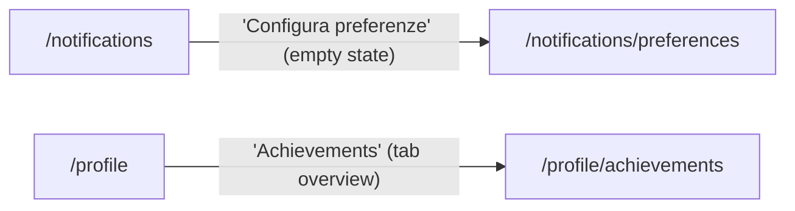

> Gli altri edge di `/dashboard`, `/discover`, `/onboarding`, `/setup`, `/versions` puntano tutti **fuori** dal cluster (`/library`, `/game-nights`, `/games`, `/players`, `/sessions`, `/editor`, `/`) o aprono drawer/modal/sheet senza cambio di route.

### Libreria personale, giochi privati, wishlist, play & toolbox
_Route-group: `(authenticated)` · 16 pagine_

#### 1. Tabella route

| Route | Shell | Guardie | Stati principali |
|---|---|---|---|
| `/library` | DesktopShell (via `(authenticated)/layout.tsx` → UserShellClient; NO `library/layout.tsx`, MiniNavSlot non registrato #2158) | `RequireRole ['User','Editor','Admin']` client-side (redirect `/login?from=/library` o `/`; superadmin bypassa) + Suspense `LibraryLoadingSkeleton` | loading · empty · filtered-empty · error · default · (tab games) loading/empty/filtered-empty/error/default · (rail) loading/empty/populated/error |
| `/library/[gameId]` | DesktopShell + `LibraryGameDetailLayout` (solo `document.title` 3-stato, NO MiniNav) | Nessun `RequireRole` a livello pagina — protezione `(authenticated)` shell/AuthProvider (no middleware). Page `use client` | loading · error · not-found · default-libro · default-legacy (mobile/desktop; hero own vs community) |
| `/library/[gameId]/agent` | N/A (server component: `redirect()` pre-render dentro DesktopShell) | — | — (redirect 307) |
| `/library/[gameId]/kb` | DesktopShell + `LibraryGameDetailLayout` (server → `KbHubContent` client) | Nessun `RequireRole` — protezione `(authenticated)` shell | loading · error · empty · default · indexing-pending |
| `/library/[gameId]/play` | DesktopShell + `[gameId]` layout — **IMMERSIVE** (`/library/[^/]+/play`: MobileBottomBar nascosta, padding bottom-bar droppato; AppTopBar resta desktop) | Nessun `RequireRole` — protezione `(authenticated)` shell (server passa gameId a `ResumePageContent`) | loading · error · first-time · single-resume · multi-campaign · stale-warning |
| `/library/[gameId]/play/[campaignId]` | DesktopShell + `[gameId]` layout — **IMMERSIVE** (`main h-[calc(100vh - topbar)] flex-col`) | Nessun `RequireRole` — protezione `(authenticated)` shell | loading · error-fallback · campagna aperta · campagna chiusa · serata-attached vs standalone |
| `/library/[gameId]/play/[campaignId]/encounter` | DesktopShell + `[gameId]` layout — **IMMERSIVE** (`main min-h-[calc(100vh - topbar)]`) | Nessun `RequireRole` — protezione `(authenticated)` shell (server risolve params/searchParams → props tipizzate) | entry · loading · options/result · error |
| `/library/[gameId]/play/[campaignId]/translate` | DesktopShell + `[gameId]` layout — **IMMERSIVE** | Nessun `RequireRole` — protezione `(authenticated)` shell | translate (viewer) · manual (`?mode=manual`) |
| `/library/[gameId]/toolbox` | N/A (server component: `redirect()` pre-render dentro DesktopShell) | — | — (redirect 307) |
| `/library/[gameId]/toolkit` | DesktopShell + `[gameId]` layout (`min-h-screen` gradient; **NON** immersive) | Nessun `RequireRole` — protezione `(authenticated)` shell. Page `use client`; throw se `!gameId` | loading · loaded (preview+form) · recent-sessions placeholder (sempre vuoto) |
| `/library/[gameId]/toolkit/[sessionId]` | DesktopShell + `[gameId]` layout (`min-h-screen bg-muted` + ScoreInput fixed; **NON** immersive) | Nessun `RequireRole` — protezione `(authenticated)` shell. Page `use client`; throw se `!gameId\|\|!sessionId` | loading · error · active session (SSE connected/idle) |
| `/library/private` | DesktopShell (`dynamic='force-dynamic'` — evita DOMMatrix SSR react-pdf #4133) | `RequireRole ['User','Editor','Admin']` client-side (redirect `/login?from` o `/`) + `dynamic='force-dynamic'` | loading · error · empty · no-search-results · populated (grid+pagination) |
| `/library/private/[id]` | DesktopShell | Nessun `RequireRole` — protezione `(authenticated)` shell (server aliasa `id`→`privateGameId`) | loading · not-found · hub (checklist + paused sessions) |
| `/library/private/[id]/toolkit/configure` | DesktopShell (`container max-w-4xl`) | Nessun `RequireRole` a livello pagina + **guardia OWNERSHIP** (`usePrivateToolkitEditor.isAccessDenied` → `AccessDeniedPanel`) | loading · access-denied · no-toolkit (create) · configured (main) |
| `/library/private/add` | DesktopShell (standalone: header + `min-h-screen` gradient) | `RequireRole ['User','Editor','Admin']` client-side (redirect `/login?from` o `/`) | step game · step pdf (upload/processing) · step agent · complete (redirect) |
| `/library/wishlist` | DesktopShell (`HubPageContainer` interno) | Nessun `RequireRole` — protezione `(authenticated)` shell/AuthProvider. Page `use client` | loading · error · empty · populated (grid) |

#### 2. Navigazione in uscita

- **`/library`**
  - `/library` → `/library?action=add` (modal `AddGameDrawer` via controller) — `LibraryHeroDesktop` CTA "+ Aggiungi gioco" → `handleAddGame`
  - `/library` → `/library?action=add` — `EmptyLibrary`/`GamesEmptyState` CTA `onAddGame`; condizione: stato empty/filtered-empty
  - `/library` → `item.href` (`/library/{gameId}` per giochi, oppure href cross-entity `/sessions/…`/chat/agent/kb) — `LibraryHybridGrid onCardClick`; condizione: `selectionMode==='browse'`
  - `/library` → `/games/{gameId}` **(ESCE dal cluster)** — `GamesResultsGrid` entry click (`<Link>` sul wrapper); condizione: `tab==='games' && gamesEffectiveKind==='default'`
  - `/library` → `/library/{gameId}` — `AddGameDrawer→manual` `UserWizardClient(compactMode).handleGameCreated`; condizione: gioco creato (compactMode)
  - `/library` → `/library/{gameId}` — `AddGameDrawer→catalog` `CatalogSearchStep onSelect`/`onNavigateToGame`; condizione: gioco aggiunto o già in libreria
  - `/library` → `/library` (rimuove `?action`) — `AddGameDrawerController handleClose`; condizione: chiusura drawer/ESC
- **`/library/[gameId]`**
  - `/library/[gameId]` → `/library` — error/not-found "Torna alla Libreria" → `router.push`; condizione: stato error o not-found
  - `/library/[gameId]` → `router.refresh()` — error-state "Riprova"; condizione: stato error
  - `/library/[gameId]` → `/library/{gameId}?tab={tabId}` — `GameTabsPanel onTabChange` → `router.replace(scroll:false)`; condizione: cambio tab legacy (non-libro, desktop)
  - `/library/[gameId]` → `/library` — `LibroGameDetailView` back (←); condizione: `renderLibroView`
  - `/library/[gameId]` → `/library/{gameId}/toolbox` (poi redirect 307 → `?tab=toolbox`) — `LibroGameDetailView` tab Toolbox `<Link>`; condizione: `renderLibroView && tab==='toolbox'`
  - `/library/[gameId]` → `/library/{gameId}/toolkit` — `LibroGameDetailView` tab Toolkit `<Link>`; condizione: `renderLibroView && tab==='toolkit'`
  - `/library/[gameId]` → slide-over globale `ChatSlideOverPanel` — `ChatTabPanel onOpen` → `openChat(...)`; condizione: `renderLibroView && tab==='chat'`
  - `/library/[gameId]` → href create-entity (agent/kb/chat/session) via `getEntityCreateHref` — ConnectionBar pip VUOTO → `useConnectionBarNav.handlePipClick`; condizione: `pip.isEmpty` (path non-libro)
  - `/library/[gameId]` → cascade `DeckStack` overlay/drawer (NON cambia route) — ConnectionBar pip NON-VUOTO → `openDeckStack`; condizione: `pip count>=1` (path non-libro)
  - `/library/[gameId]` → `/library/{gameId}?tab=houseRules` — `GameInfoTab` Card "House Rules" → `router.replace(scroll:false)`; condizione: tab attivo=info (non-libro)
  - `/library/[gameId]` → modal `CustomCoverDialog` — `EditCoverOverlay onEditClick`; condizione: game presente (non reso se `isNotInLibrary`)
  - `/library/[gameId]` → drawer `CampaignSetupDrawer` (libro) / null — `NanolithCampaignCTA` "Avvia libro game"; condizione: `isLibroGame===true` (non-libro → null)
- **`/library/[gameId]/agent`**
  - `/library/[gameId]/agent` → `/library/{gameId}?tab=aiChat` — `redirect()` server-side (307); condizione: incondizionato
- **`/library/[gameId]/kb`**
  - `/library/[gameId]/kb` → link upgrade Pro (`RaptorPanel upgradeLink`) — `upgradeCta/upgradeLink`; condizione: `tier='free'` (href interno al presentational)
  - `/library/[gameId]/kb` → no-op (`handleUpload` placeholder MVP) — Upload CTA `onUpload`; condizione: wireup deferito
- **`/library/[gameId]/play`**
  - `/library/[gameId]/play` → drawer `CampaignSetupDrawer` — "+ nuova" (`EmptyFirstTime`/`MultiCampaignList`/`StaleWarningCard`) → `setDrawerOpen(true)`
  - `/library/[gameId]/play` → `/library/{gameId}/play/{campaignId}` — `ResumeHero` "riprendi"; condizione: `data.length===1 && !isStale`
  - `/library/[gameId]/play` → archivia campagna (`onArchive`) — `StaleWarningCard`; condizione: `length===1 && isStale && onArchive`
  - `/library/[gameId]/play` → rename/delete campagna (no nav) — `MultiCampaignList onRename/onDelete` → mutation + `invalidateQueries`; condizione: `data.length>=2`
- **`/library/[gameId]/play/[campaignId]`**
  - `/library/[gameId]/play/[campaignId]` → `/library` — `CampaignCloseSelector onClosed`; condizione: chiusura terminale (Completa/Abbandona)
  - `/library/[gameId]/play/[campaignId]` → `router.refresh()` — `CampaignCloseSelector onArchive`; condizione: archivia (resta resumable)
  - `/library/[gameId]/play/[campaignId]` → inline `CampaignCloseSelector` — button `campaign-close-open` → `setShowClose(true)`; condizione: `campaign.outcome==null`
  - `/library/[gameId]/play/[campaignId]` → resume serata (`SerataResumeButton` → gameNightId); condizione: `spine!=null && isSerataResumable(spine, user.id)`
  - `/library/[gameId]/play/[campaignId]` → `router.refresh()` (placeholder) — `ResumeBooksList onResume(bookId)` (bookId no-op)
- **`/library/[gameId]/play/[campaignId]/encounter`**
  - `/library/[gameId]/play/[campaignId]/encounter` → `/library/{gameId}/play/{campaignId}` — `EncounterCheatsheetView onResolve`; condizione: risoluzione encounter (State D fuori scope)
  - `/library/[gameId]/play/[campaignId]/encounter` → modal `GlossaryLookupModal` — `onOpenGlossary`
  - `/library/[gameId]/play/[campaignId]/encounter` → reset parse (no nav) — `onCancel` → `parse.reset()`
  - `/library/[gameId]/play/[campaignId]/encounter` → avvia parse (no nav) — `onParse` → `parse.mutate(...)`
- **`/library/[gameId]/play/[campaignId]/translate`**
  - _Nessuna nav out esplicita_ — `TranslateViewer`/`ManualInputView` gestiscono internamente
- **`/library/[gameId]/toolbox`**
  - `/library/[gameId]/toolbox` → `/library/{gameId}?tab=toolbox` — `redirect()` server-side (307); condizione: incondizionato
- **`/library/[gameId]/toolkit`**
  - `/library/[gameId]/toolkit` → `/library/{gameId}/toolkit/{sessionId}` — "Start Session" → `handleStartSession` (createSession+addPlayer loop+startSession); condizione: `validParticipants` OK min/max
  - `/library/[gameId]/toolkit` → `/library` — fetch game fallito (catch) → toast; condizione: gioco non trovato
- **`/library/[gameId]/toolkit/[sessionId]`**
  - `/library/[gameId]/toolkit/[sessionId]` → `/library/{gameId}` — `loadSession` fallito (catch) → toast; condizione: errore caricamento
  - `/library/[gameId]/toolkit/[sessionId]` → `/library/{gameId}` — `onFinalized` (SSE) → `setTimeout 2s`; condizione: sessione finalizzata via SSE
- **`/library/private`**
  - `/library/private` → `/library/private/{game.id}` — `PrivateGameCard onClick`
  - `/library/private` → drawer `AddGameDrawer` (istanza LOCALE, close resta su `/library/private` + ricarica pag.1) — Add button → `setAddDrawerOpen(true)`
  - `/library/private` → modal `EditGameDialog` — `PrivateGameCard` Edit → `openEdit`
  - `/library/private` → modal `DeleteConfirm` (AlertDialog) — `PrivateGameCard` Delete → `openDelete`
  - `/library/private` → modal `ProposeGameModal` (crea ShareRequest) — `PrivateGameCard` Propose → `handlePropose`
- **`/library/private/[id]`**
  - `/library/private/[id]` → `/sessions/{sessionId}/live` **(ESCE dal cluster)** — `PlayerSetupDialog onStart` → `handlePlayerSetupComplete`; condizione: avvio partita ok
  - `/library/private/[id]` → `/sessions/{sessionId}/live` **(ESCE dal cluster)** — `MeeplePausedSessionCard onResume` → `resumeSession`; condizione: riprendi partita in pausa
  - `/library/private/[id]` → rimozione sessione (no nav) — `MeeplePausedSessionCard onAbandon` (confirm → completeSession)
  - `/library/private/[id]` → modal `PlayerSetupDialog` — `ActivationChecklist onStartGame`
  - `/library/private/[id]` → modal `CopyrightDisclaimerModal` → file picker nascosto — `onUploadPdf` → `onAccept` → `fileInputRef.click()`
  - `/library/private/[id]` → creazione agente (no nav) — `ActivationChecklist onCreateAgent` → `api.agents.createUserAgent`
- **`/library/private/[id]/toolkit/configure`**
  - `/library/private/[id]/toolkit/configure` → `/library/private` — header ← "I miei giochi" / `AccessDeniedPanel` back → `router.push`
  - `/library/private/[id]/toolkit/configure` → `router.refresh()` — `handleAiApply` success (`applyAiSuggestion`)
- **`/library/private/add`**
  - `/library/private/add` → `/library/private` — Cancel wizard / `GameCreationStep onBack` (default); condizione: annulla (onCancel assente → default)
  - `/library/private/add` → `/library/private` — `handleSkipPdf`/`handleContinueToAgent(non-catalog)`/`handleSkipPdfStep`/`handleAgentConfigured`/`handleSkipAgent`; condizione: completamento/skip su route standalone
  - `/library/private/add` → `/library/{gameId}` — `handleGameCreated compactMode` → `onComplete()`; condizione: SOLO embed in `AddGameDrawer` (compactMode), NON standalone
- **`/library/wishlist`**
  - `/library/wishlist` → modal `AddToWishlistDialog` — "Add to Wishlist" (header o empty state)
  - `/library/wishlist` → rimozione item (no nav) — `MeepleWishlistCard onRemove` → `removeItem`

#### 3. Superfici condizionali (show / hide / enable)

##### `/library`
- **LibraryHub FSM (`effectiveKind`)** — `default | loading (hub.isLoading) | empty (somma hub.totalCounts===0) | filtered-empty (merged.length===0) | error (hub.allFailed = TUTTE le source ready falliscono; fallimento parziale degrada a default)` — `apps/web/src/app/(authenticated)/library/_components/LibraryHub.tsx`
- **State-override hatch `?state=loading|empty|filtered-empty|error`** — `parseStateOverride` attivo SOLO se `NODE_ENV!=='production' || IS_VISUAL_TEST_BUILD`; altrimenti null → vince `realKind`. Applicato a `effectiveKind` e `gamesEffectiveKind` — `apps/web/src/app/(authenticated)/library/_components/LibraryHub.tsx`
- **Ramo tab 'games' vs altri** — `tab==='games'` → `GamesFiltersInline` + (`GamesResultsGrid`|`GamesEmptyState`) con FSM `gamesEffectiveKind` (da `libraryQuery`); altrimenti `CrossEntityFilters` + (`LibraryHybridGrid`|`EmptyLibrary`) con `effectiveKind` — `apps/web/src/app/(authenticated)/library/_components/LibraryHub.tsx`
- **BulkSelectionBar** — montata solo se `tab==='games' && selectionMode==='select'`; disabled se `selected.size===0 || removeMutation.isPending` — `apps/web/src/app/(authenticated)/library/_components/LibraryHub.tsx`
- **selectionMode (browse/select)** — game-scoped: `useEffect` forza `'browse'`+clear quando `tab!=='games'`; `handleEnterSelectMode` ritorna subito se `tab!=='games'` — `apps/web/src/app/(authenticated)/library/_components/LibraryHub.tsx`
- **AdvancedFiltersDrawer** — aperto via `drawerOpen` (`onMoreFilters`); `activeFiltersCount = countActiveFilters(activeFilters)`, cross-entity persistente ai cambi tab — `apps/web/src/app/(authenticated)/library/_components/LibraryHub.tsx`
- **CTA import BGG** — MAI renderizzato (`onImportBgg` omesso — ban user-side BGG #2123); label `ctaImportBgg` resta solo per il tipo `LibraryHeroDesktopLabels` — `apps/web/src/app/(authenticated)/library/_components/LibraryHub.tsx`
- **Hero stats / tab counts** — `games/agents/docs/chats` da `hub.totalCounts` (pre-filtro); tab agents+kb stub `[]` fino a BE-2 #1589 / BE-1 #1588 — `apps/web/src/app/(authenticated)/library/_components/LibraryHub.tsx`
- **CrossEntityFilters STATO chip (`gameStateFilter`)** — `states[]`+`withKb` applicati alla source 'games' pre-merge: `item.state ∈ states && (!withKb || item.hasKb===true)`; assorbe ex-tab loaned/kb — `apps/web/src/app/(authenticated)/library/_components/LibraryHub.tsx`
- **RecentActivityRail (aside 280px, hidden `<lg`)** — FSM: `error→testo destructive(role=alert)`; `isLoading→3 skeleton`; `items.length===0→empty "Activity feed prossimamente"`; else timeline (max 6). `items=useActivityFeed(20)`. Item NON cliccabili; bottone collapse statico no-op; box shortcuts sempre reso — `apps/web/src/components/features/library/RecentActivityRail.tsx`
- **SORT chip** — stub non-interattivo: `SORT_KEY_STUB='recent'`; wiring rinviato (#1585-followup) — `apps/web/src/app/(authenticated)/library/_components/LibraryHub.tsx`

##### `/library/[gameId]`
- **useStateOverride `?state=default|loading|error|not-found`** — attivo solo in build visual-test; in produzione null → fetch reale (`useLibraryGameDetail`) — `apps/web/src/app/(authenticated)/library/[gameId]/page.tsx`
- **GameTableSkeleton** — reso se `stateOverride==='loading' || (null && isLoading)` — `apps/web/src/app/(authenticated)/library/[gameId]/page.tsx`
- **error-state (Alert destructive + Riprova + Torna alla Libreria)** — reso se `stateOverride==='error' || (null && error)` — `apps/web/src/app/(authenticated)/library/[gameId]/page.tsx`
- **not-found-state (Alert neutro + Torna alla Libreria)** — reso se `stateOverride==='not-found' || (null && !effectiveDetail)` — `apps/web/src/app/(authenticated)/library/[gameId]/page.tsx`
- **LibroGameDetailView vs layout legacy** — `renderLibroView = isLibroGame(effectiveDetail.gameTitle)` → `LibroGameDetailView` (forza `data-theme='light'`); altrimenti wrapper con `NanolithCampaignCTA` + `GameDetailMobile` (`lg:hidden`) + `GameDetailDesktop` (`hidden lg:block`) — `apps/web/src/app/(authenticated)/library/[gameId]/page.tsx`
- **GameDetailDesktop hero variant** — `isNotInLibrary = !game` → `GameHero variant='community'` ("Gioco non in libreria"); altrimenti `variant='own'` + `EditCoverOverlay` (`hasCustomCover` da `customCoverR2Key`) — `apps/web/src/components/game-detail/GameDetailDesktop.tsx`
- **GameDetailDesktop heroMetadata** — ogni entry (designer[0]/anno/durata/players/complessità/rating★) aggiunta solo se campo BE presente; complexity assente per giochi privati; rating per ultimo — `apps/web/src/components/game-detail/GameDetailDesktop.tsx`
- **ConnectionBar (`buildGameConnectionPips`)** — pip agent/kb/chat/session da `agentCount`/`hasCustomPdf||hasRagAccess`/`chatThreadCount`/`timesPlayed`; `onPipClick=handlePipClick` (empty→create push, count>=1→openDeckStack cascade) — `apps/web/src/components/game-detail/GameDetailDesktop.tsx`
- **SessionContributorsStrip** — non renderizza nulla se `contributors` vuoto (`useGameSessionContributors`, endpoint pubblico, enabled su gameId) — `apps/web/src/components/game-detail/GameDetailDesktop.tsx`
- **GameTabsPanel 5 tab (info/aiChat/toolbox/houseRules/partite)** — solo tab attivo montato; `isPrivateGame`+`isNotInLibrary` passati ai tab; underline animato (offsetLeft/Width + ResizeObserver); keyboard ArrowLeft/Right/Home/End; sync `activeTab` su `initialTab` (URL) — `apps/web/src/components/game-detail/GameTabsPanel.tsx`
- **GameInfoTab** — `isNotInLibrary→empty "aggiungi"`; `isLoading→"Caricamento"`; `isError||!game→destructive`; else Card1 Descrizione (se description) + Card2 Informazioni (dl, righe condizionali per-campo) + Card3 House Rules CTA (sempre) — `apps/web/src/components/game-detail/tabs/GameInfoTab.tsx`
- **GameAiChatTab** — `isNotInLibrary→empty`; `indexedCount===0 && processingCount===0→empty "carica PDF"`; altrimenti `GameChatTab` inline — `apps/web/src/components/game-detail/tabs/GameAiChatTab.tsx`
- **LibroGameDetailView pip bar + nano-mark** — ogni Pip vuoto (`count===0`) tratteggiato/opaco; nano-mark "In collezione" + " · BGG #id" solo se `bggId!=null`; publisher solo se presente; KB badge title/subtitle da `kbStatus`/`hasRagAccess` — `apps/web/src/components/features/gamebook/LibroGameDetailView.tsx`

##### `/library/[gameId]/kb`
- **Skeleton kb-hub** — reso se `statusQuery.isLoading || pdfsQuery.isLoading` — `apps/web/src/app/(authenticated)/library/[gameId]/kb/_content.tsx`
- **Alert kb-hub-error** — reso se `statusQuery.isError || pdfsQuery.isError` — `apps/web/src/app/(authenticated)/library/[gameId]/kb/_content.tsx`
- **EmptyState vs HubDefault+RaptorPanel** — `isEmpty = pdfs.length===0` → `EmptyState`; altrimenti `HubDefault + RaptorPanel` — `apps/web/src/app/(authenticated)/library/[gameId]/kb/_content.tsx`
- **Badge "Indicizzazione in corso" (indexingPending)** — `pdfs.length>0 && status.isIndexed===false` → passato a `HubDefault` — `apps/web/src/app/(authenticated)/library/[gameId]/kb/_content.tsx`
- **RaptorPanel** — `tier='free'` fisso → `lockedBadge` + `upgradeCta` (gate Pro applicato dal backend) — `apps/web/src/app/(authenticated)/library/[gameId]/kb/_content.tsx`
- **ReindexModal** — `open=reindexOpen`; phase `confirm→running→done`; su errore toast + chiude + reset — `apps/web/src/app/(authenticated)/library/[gameId]/kb/_content.tsx`
- **DeleteDialog** — `open=!!deletePdfTarget`; su success chiude, su errore resta aperto (toast) per retry — `apps/web/src/app/(authenticated)/library/[gameId]/kb/_content.tsx`
- **ActionsMenu PDF** — montato quando `actionsMenuPdf!=null`; solo azione `delete` cablata (open/reindex/cost/move deferite) — `apps/web/src/app/(authenticated)/library/[gameId]/kb/_content.tsx`
- **PdfRow status badge (`mapProcessingStateToPdfStatus`)** — `Ready→ready`, `Failed→failed`, resto/unknown→`indexing` — `apps/web/src/app/(authenticated)/library/[gameId]/kb/_content.tsx`
- **gameTitle risoluzione** — `gameDetailQuery.gameTitle ?? status.gameId(UUID) ?? gameId` (fallback difensivo) — `apps/web/src/app/(authenticated)/library/[gameId]/kb/_content.tsx`

##### `/library/[gameId]/play`
- **GamebookResumeShell FSM 4-stati** — `isLoading→skeleton`; `isError||!data→error alert(role=alert)`; `data.length===0→EmptyFirstTime(state-01)`; `===1 && !isStale→ResumeHero(state-02)`; `===1 && isStale→StaleWarningCard(state-04)`; `>=2→MultiCampaignList(state-03)` — `apps/web/src/app/(authenticated)/library/[gameId]/play/_components/GamebookResumeShell.tsx`
- **CampaignSetupDrawer** — aperto via `drawerOpen` (lift a livello pagina in `ResumePageContent`, tutti gli entrypoint "+ nuova" aprono lo stesso wizard) — `apps/web/src/app/(authenticated)/library/[gameId]/play/_content.tsx`

##### `/library/[gameId]/play/[campaignId]`
- **SerataSpineStrip + SerataResumeButton** — `spine!=null` (GameNight-attached; 204 standalone→nascosto) → strip; `SerataResumeButton` solo se `isSerataResumable(spine, currentUser?.id)` — `apps/web/src/app/(authenticated)/library/[gameId]/play/[campaignId]/_content.tsx`
- **Campaign close (button vs CampaignCloseSelector)** — blocco reso solo se `campaign && campaign.outcome==null`; `showClose` toggla button/selector — `apps/web/src/app/(authenticated)/library/[gameId]/play/[campaignId]/_content.tsx`
- **gameRef discriminator** — da `campaign.gameRefKind` (`1=Private`, else Shared) + `campaign.gameRefId`; fallback `{gameId, Shared}` mentre carica; su `isError` `console.warn(dev)`+fallback (no crash) — `apps/web/src/app/(authenticated)/library/[gameId]/play/[campaignId]/_content.tsx`

##### `/library/[gameId]/play/[campaignId]/encounter`
- **EncounterCheatsheetView FSM** — `status = deriveEncounterStatus(parse.status)` (entry/loading/options/error); `errorKind = mapEncounterError(parse.error)` se presente — `apps/web/src/app/(authenticated)/library/[gameId]/play/[campaignId]/encounter/_content.tsx`
- **storyContext card** — reso solo se `fromLabel` presente (§ normalizzato); `paragraphMarker "§N"` solo se `paragraphNumber>0` — `apps/web/src/app/(authenticated)/library/[gameId]/play/[campaignId]/encounter/_content.tsx`
- **GlossaryLookupModal** — open via `glossaryOpen` (read-only, campaignId) — `apps/web/src/app/(authenticated)/library/[gameId]/play/[campaignId]/encounter/_content.tsx`

##### `/library/[gameId]/play/[campaignId]/translate`
- **ManualInputView vs TranslateViewer** — `searchParams.mode==='manual'` → `ManualInputView`; altrimenti `TranslateViewer` (DEC-FE-M-2, #1560) — `apps/web/src/app/(authenticated)/library/[gameId]/play/[campaignId]/translate/_content.tsx`
- **gameRef discriminator** — da `campaign.gameRefKind` (`1=Private` else Shared) + `gameRefId`; fallback `{gameId, Shared}` mentre carica; `isError→console.warn(dev)`+fallback — `apps/web/src/app/(authenticated)/library/[gameId]/play/[campaignId]/translate/_content.tsx`

##### `/library/[gameId]/toolkit`
- **Loader spinner** — reso se `loadingGame || !game` — `apps/web/src/app/(authenticated)/library/[gameId]/toolkit/page.tsx`
- **Template Preview card** — reso solo se `template!=null` (`getGameTemplateByName(game.name)`); mostra categorie/rounds(se >0)/scoringRules/players — `apps/web/src/app/(authenticated)/library/[gameId]/toolkit/page.tsx`
- **Rimuovi partecipante (× button)** — reso solo se `participants.length>1`; disabled se `isLoading` — `apps/web/src/app/(authenticated)/library/[gameId]/toolkit/page.tsx`
- **Start Session button** — disabled se `isLoading`; label "Starting..." vs "Start {name} Session"; validazione toast min/max giocatori (>=1 non vuoto) — `apps/web/src/app/(authenticated)/library/[gameId]/toolkit/page.tsx`
- **Nota auto-populate template** — reso solo se `template!=null` — `apps/web/src/app/(authenticated)/library/[gameId]/toolkit/page.tsx`

##### `/library/[gameId]/toolkit/[sessionId]`
- **Loader spinner** — reso se `isLoading || !activeSession` — `apps/web/src/app/(authenticated)/library/[gameId]/toolkit/[sessionId]/page.tsx`
- **Error box rosso** — reso se `error || sseError` — `apps/web/src/app/(authenticated)/library/[gameId]/toolkit/[sessionId]/page.tsx`
- **SessionHeader onPause** — `onPause` passato solo se `activeSession.status==='InProgress'`; `onFinalize` sempre — `apps/web/src/app/(authenticated)/library/[gameId]/toolkit/[sessionId]/page.tsx`
- **Template Info card (Scoring Rules)** — reso solo se `template!=null` (`getGameTemplateByName` da gameName fetchato) — `apps/web/src/app/(authenticated)/library/[gameId]/toolkit/[sessionId]/page.tsx`
- **Scoreboard isRealTime + ScoreInput** — `Scoreboard isRealTime={isConnected}` (SSE); `ScoreInput` rounds/categories da template `?? derivati da scores`; disabled implicito via `syncStatus` — `apps/web/src/app/(authenticated)/library/[gameId]/toolkit/[sessionId]/page.tsx`

##### `/library/private`
- **FSM contenuto** — `loading→Loader`; `error→Card error+refresh`; `games.length===0` → (`search ? Card "no results" : LibraryEmptyState onboarding`); altrimenti games-grid + pagination — `apps/web/src/app/(authenticated)/library/private/PrivateGamesClient.tsx`
- **Pagination** — reso solo se `totalPages>1`; prev disabled `!hasPreviousPage`; next disabled `!hasNextPage` — `apps/web/src/app/(authenticated)/library/private/PrivateGamesClient.tsx`
- **JourneyProgress banner** — `gameId` = gioco creato più di recente (sort createdAt desc, indip. dal sort UI); `agentDefinitionId` passato (anche null) per evitare la call `/games/{id}/agents` che 404 su UUID privati — `apps/web/src/app/(authenticated)/library/private/PrivateGamesClient.tsx`
- **KbStatusBadge** — overlay in fondo a ogni card (per `game.id`) — `apps/web/src/app/(authenticated)/library/private/PrivateGamesClient.tsx`
- **Edit/Delete dialog** — `EditPrivateGameForm` reso solo se `selectedGame`; input disabled durante `isSubmitting`; confirm-delete disabled durante `isDeleting` (label "Deleting…"/spinner) — `apps/web/src/app/(authenticated)/library/private/PrivateGamesClient.tsx`
- **PrivateGameCard actions** — Edit/Propose/Delete inclusi solo se il rispettivo handler è presente (Delete `variant='danger'`) — `apps/web/src/app/(authenticated)/library/private/PrivateGamesClient.tsx`

##### `/library/private/[id]`
- **Skeleton vs not-found** — `isLoading→skeletons`; `!game→"Gioco non trovato."` — `apps/web/src/components/library/private-game-detail/PrivateGameHub.tsx`
- **Sezione "Partite in pausa"** — renderizzata solo se `pausedSessions.length>0` (da `api.liveSessions.getActive` filtrata `status==='Paused' && gameId===privateGameId`, sort `sessionDate` desc) — `apps/web/src/components/library/private-game-detail/PrivateGameHub.tsx`
- **ActivationChecklist stati PDF/agent** — `pdfStatus∈none/uploading/processing/ready/failed`; `agentStatus∈none/creating/ready`; auto-create agent quando `pdfStatus==='ready' && agentStatus==='none'` (una volta, `autoCreateAttempted` ref); esposti `onUploadPdf`/`onCreateAgent`/`onStartGame` — `apps/web/src/components/library/private-game-detail/PrivateGameHub.tsx`
- **Progress bar / ProgressCard+PdfProcessingProgressBar** — `pdfStatus==='uploading'→barra uploadProgress%`; `==='processing' && activePdfId→ProgressCard + PdfProcessingProgressBar` (onComplete→ready, onError→failed, onCancel→none) — `apps/web/src/components/library/private-game-detail/PrivateGameHub.tsx`
- **PlayerSetupDialog** — montato solo se `showPlayerSetup` (reset ad ogni apertura); min/maxPlayers da game (fallback 1/10); `isLoading=isStarting` — `apps/web/src/components/library/private-game-detail/PrivateGameHub.tsx`
- **Header thumbnail/anno** — `Image` solo se `game.thumbnailUrl`; anno solo se `game.yearPublished` — `apps/web/src/components/library/private-game-detail/PrivateGameHub.tsx`
- **CopyrightDisclaimerModal** — `open=showDisclaimer`; `onAccept→click file input nascosto`; `onCancel→chiude` — `apps/web/src/components/library/private-game-detail/PrivateGameHub.tsx`

##### `/library/private/[id]/toolkit/configure`
- **FSM configurator** — `isLoading→spinner`; `isAccessDenied→AccessDeniedPanel`; `!toolkit→CreateToolkitPanel`; altrimenti configurator completo (2-col + preview) — `apps/web/src/app/(authenticated)/library/private/[id]/toolkit/configure/client.tsx`
- **Error banner** — reso se `error!=null` (role=alert) — `apps/web/src/app/(authenticated)/library/private/[id]/toolkit/configure/client.tsx`
- **Indicatore "Salvataggio…"** — reso se `isSaving`; disabilita toggle e submit dei form — `apps/web/src/app/(authenticated)/library/private/[id]/toolkit/configure/client.tsx`
- **AiToolkitGenerator** — reso solo se `showAiGenerator` (dismissable); `onGenerate=generateToolkitFromKb`, `onApply=applyAiSuggestion+refresh` — `apps/web/src/app/(authenticated)/library/private/[id]/toolkit/configure/client.tsx`
- **OverrideToggle base tools** — turn-order/scoreboard/dice toggle (`updateOverrides`); Lavagna NON disattivabile (nota fissa) — `apps/web/src/app/(authenticated)/library/private/[id]/toolkit/configure/client.tsx`
- **Add*ToolForm (dice/card/timer/counter)** — ciascun form montato solo se `show{Dice|Card|Timer|Counter}Form`; validazione nome duplicato case-insensitive (`nameError`); submit disabled se `isSaving || !name.trim()` — `apps/web/src/app/(authenticated)/library/private/[id]/toolkit/configure/client.tsx`
- **Publish button** — ASSENTE (toolkit privato auto-save, a differenza del configurator admin); badge versione `v{version}` se toolkit presente — `apps/web/src/app/(authenticated)/library/private/[id]/toolkit/configure/client.tsx`
- **ToolListItem remove** — ogni tool custom ha bottone `Trash2` → `handleRemove*`; disabled se `isSaving` — `apps/web/src/app/(authenticated)/library/private/[id]/toolkit/configure/client.tsx`

##### `/library/private/add`
- **Wizard step (game→pdf→agent→complete)** — `currentStep` iniziale = `(startAtPdf && gameId) ? 'pdf' : 'game'`; su route standalone `startAtPdf=false` → parte da 'game' — `apps/web/src/app/(authenticated)/library/private/add/client.tsx`
- **visibleSteps (step indicator)** — `compactMode→solo 'game'`; normale→nasconde 'agent' se `!pdfId && currentStep!=='agent'` — `apps/web/src/app/(authenticated)/library/private/add/client.tsx`
- **Contenuto step pdf** — `step 'pdf' && gameId && !showProcessing → PdfUploadStep` (gameId per catalog / privateGameId per game creato); `showProcessing && pdfFileName → PdfProcessingStatus` (onContinue→handleContinueToAgent) — `apps/web/src/app/(authenticated)/library/private/add/client.tsx`
- **Contenuto step agent** — reso solo se `currentStep==='agent' && gameId && pdfId → PdfProcessingStatus + ConfigAgentStep`; raggiungibile solo per `isCatalogGame`; i privati manuali saltano a completamento (evita 404 agent endpoint) — `apps/web/src/app/(authenticated)/library/private/add/client.tsx`
- **Header standalone + Cancel** — reso solo se `!onCancel` (standalone); embedded in drawer (onCancel presente) → nascosto; step indicator `px-2` in drawer — `apps/web/src/app/(authenticated)/library/private/add/client.tsx`
- **Progress Summary** — reso se `state.gameId && (gameName || pdfFileName)` — `apps/web/src/app/(authenticated)/library/private/add/client.tsx`

##### `/library/wishlist`
- **FSM wishlist** — `isLoading→WishlistSkeleton`; `isError→testo destructive`; `items.length===0→WishlistEmpty` (con add button); altrimenti grid `MeepleWishlistCard` — `apps/web/src/app/(authenticated)/library/wishlist/page.tsx`
- **Add button header + count subtitle** — resi solo se `!isLoading && !isError && items && items.length>0` (l'empty state ha il proprio add button) — `apps/web/src/app/(authenticated)/library/wishlist/page.tsx`
- **gameName lookup** — `gameNameMap` da `useLibrary().items` (gameId→gameTitle); passata a ogni card come `gameName` — `apps/web/src/app/(authenticated)/library/wishlist/page.tsx`

#### 4. Componenti → file

| Componente | File | Ruolo |
|---|---|---|
| LibraryContent + LibraryLoadingSkeleton | `apps/web/src/app/(authenticated)/library/_content.tsx` | Orchestratore client: monta LibraryHub + AddGameDrawerController; push su useRecentsStore |
| LibraryHub | `apps/web/src/app/(authenticated)/library/_components/LibraryHub.tsx` | Hub multi-entity 6 tab (all/games/agents/kb/sessions/chat) + FSM + filtri + selezione bulk |
| AddGameDrawer + AddGameDrawerController | `apps/web/src/app/(authenticated)/library/AddGameDrawer.tsx` | Sheet destro `?action=add`: choice → manual (UserWizardClient compactMode) \| catalog (CatalogSearchStep) |
| CatalogSearchStep | `apps/web/src/app/(authenticated)/library/CatalogSearchStep.tsx` | Ricerca catalogo interno (useSharedGames), 1-click add-to-library, blocked-alert→onNavigateToGame |
| RecentActivityRail | `apps/web/src/components/features/library/RecentActivityRail.tsx` | Rail attività (useActivityFeed 20), item non cliccabili |
| GamesResultsGrid / GamesFiltersInline / GamesEmptyState | `apps/web/src/components/features/games` | Sotto-vista tab games (GamesResultsGrid linka a `/games/{id}`, ESCE dal cluster) |
| LibraryGameDetailPage | `apps/web/src/app/(authenticated)/library/[gameId]/page.tsx` | Dispatcher stato + libro vs legacy + mobile/desktop; parse `?tab` via isGameTabId; fetch GameBooks (SI-6) |
| LibraryGameDetailLayout / LibraryGameHeader | `apps/web/src/app/(authenticated)/library/[gameId]/layout.tsx` | Risolve `document.title` 3-stato via useLibraryGameDetail; nessun chrome MiniNav |
| GameDetailDesktop | `apps/web/src/components/game-detail/GameDetailDesktop.tsx` | Hero full-width + ConnectionBar + SessionContributorsStrip + GameTabsPanel + CustomCoverDialog |
| GameTabsPanel + tabs (Info/AiChat/Toolbox/HouseRules/Partite) | `apps/web/src/components/game-detail/tabs/` | 5 tab con FSM/empty/loading proprie |
| LibroGameDetailView | `apps/web/src/components/features/gamebook/LibroGameDetailView.tsx` | Vista libro-game (hero warm + 4 tab info/chat/toolbox/toolkit) |
| GameDetailMobile | `apps/web/src/app/(authenticated)/library/[gameId]/game-detail-mobile.tsx` | Layout mobile (`<lg`) |
| useConnectionBarNav | `apps/web/src/hooks/useConnectionBarNav.ts` | pip empty→create; pip count>=1→openDeckStack cascade |
| AgentLegacyRedirect | `apps/web/src/app/(authenticated)/library/[gameId]/agent/page.tsx` | Redirect 307 → tab AI Chat (S4) |
| ToolboxLegacyRedirect | `apps/web/src/app/(authenticated)/library/[gameId]/toolbox/page.tsx` | Redirect 307 → tab Toolbox (S4) |
| KbHubContent | `apps/web/src/app/(authenticated)/library/[gameId]/kb/_content.tsx` | Orchestratore KB user-side (status/pdfs/reindex/raptor/delete) |
| HubDefault / EmptyState / RaptorPanel / ReindexModal / DeleteDialog / ActionsMenu | `apps/web/src/components/features/kb-hub` | Presentational KB hub |
| ResumePageContent + GamebookResumeShell | `apps/web/src/app/(authenticated)/library/[gameId]/play/_content.tsx` + `_components/GamebookResumeShell.tsx` | Resume picker 4-stati + rename/delete campagne |
| EmptyFirstTime / ResumeHero / MultiCampaignList / StaleWarningCard | `apps/web/src/app/(authenticated)/library/[gameId]/play/_components/` | Viste per-stato resume |
| CampaignSetupDrawer | `apps/web/src/components/features/gamebook/CampaignSetupDrawer.tsx` | Wizard creazione campagna |
| Content (campaign) + GamebookPlayShell | `apps/web/src/app/(authenticated)/library/[gameId]/play/[campaignId]/_content.tsx` + `components/features/gamebook` | Shell campagna in-game: serata + close + ResumeBooksList + play shell |
| CampaignCloseSelector / SerataSpineStrip / SerataResumeButton / ResumeBooksList | `apps/web/src/components/features/gamebook/` | Chiusura 3-way, serata spine, resume serata, lista libri |
| Content (encounter) + EncounterCheatsheetView + GlossaryLookupModal | `apps/web/src/app/(authenticated)/library/[gameId]/play/[campaignId]/encounter/_content.tsx` + `components/features/gamebook` | Parse foto cheatsheet FSM + glossario read-only |
| Content (translate) + TranslateViewer / ManualInputView | `apps/web/src/app/(authenticated)/library/[gameId]/play/[campaignId]/translate/_content.tsx` + `components/features/gamebook` | Switch mode manual/viewer + gameRef |
| GameToolkitLandingPage | `apps/web/src/app/(authenticated)/library/[gameId]/toolkit/page.tsx` | Preview template + form partecipanti + start session |
| GameSpecificSessionPage | `apps/web/src/app/(authenticated)/library/[gameId]/toolkit/[sessionId]/page.tsx` | Sessione attiva: header + partecipanti + scoreboard + input |
| SessionHeader / MeepleParticipantCard / ScoreInput / Scoreboard | `apps/web/src/components/session` | Componenti session tracking |
| useSessionSync (SSE) / useSessionStore / game-templates | `apps/web/src/lib/domain-hooks/useSessionSync.ts` · `lib/stores/session-store.ts` · `lib/config/game-templates.ts` | Sync realtime + stato sessione + template scoring |
| PrivateGamesClient (+ PrivateGameCard/EditPrivateGameForm) | `apps/web/src/app/(authenticated)/library/private/PrivateGamesClient.tsx` | CRUD list/add/edit/delete/search/sort/paginazione (fetch imperativo) |
| JourneyProgress / KbStatusBadge / LibraryEmptyState / ProposeGameModal | `apps/web/src/components/library` | Onboarding/stato/proposta ShareRequest |
| PrivateGameHub + ActivationChecklist | `apps/web/src/components/library/private-game-detail/` | Hub attivazione (upload PDF→agent→start) + partite in pausa |
| MeeplePausedSessionCard / PlayerSetupDialog / CopyrightDisclaimerModal / PdfProcessingProgressBar / ProgressCard | `apps/web/src/components/library\|game-night\|pdf` | Card sessione, setup player, disclaimer, progress |
| UserToolkitConfiguratorClient + usePrivateToolkitEditor | `apps/web/src/app/(authenticated)/library/private/[id]/toolkit/configure/client.tsx` + `lib/domain-hooks/usePrivateToolkitEditor.ts` | Editor toolkit (override + tool extra + preview) + ownership guard |
| AiToolkitGenerator / ToolkitPreview | `apps/web/src/components/toolkit/AiToolkitGenerator` + `configure/client.tsx` | Generazione AI da KB / anteprima tool rail (resolveSessionTools) |
| UserWizardClient | `apps/web/src/app/(authenticated)/library/private/add/client.tsx` | Wizard 3-step (game/pdf/agent); riusato embedded in AddGameDrawer (compactMode/startAtPdf) |
| GameCreationStep / PdfUploadStep / ConfigAgentStep / PdfProcessingStatus | `apps/web/src/app/(authenticated)/admin/wizard/steps/` · `library/private/add/steps/` · `components/library/` | Step creazione gioco + upload PDF + config agente + stato indicizzazione |
| WishlistPage (+ WishlistSkeleton/WishlistEmpty) | `apps/web/src/app/(authenticated)/library/wishlist/page.tsx` | Griglia wishlist + add/remove |
| AddToWishlistDialog / MeepleWishlistCard / useWishlist / useRemoveFromWishlist / useLibrary | `apps/web/src/components/wishlist/` · `hooks/queries/` | Dialog aggiunta / card item / data layer + lookup titoli |

#### 5. Navigazione interna al cluster

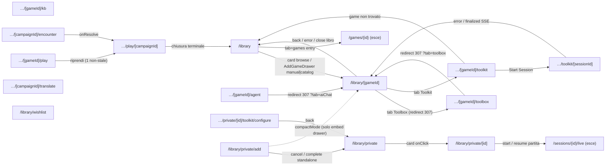

_Nota: `KB`, `TRANS`, `WISH` non hanno edge di navigazione route-to-route interni al cluster (solo modal/drawer o azioni no-nav). `/games/{id}` e `/sessions/{id}/live` sono destinazioni fuori dal cluster mostrate come riferimento._

### Catalogo /games (hub multi-tab), dettaglio gioco & /hub legacy
_Route-group: `(authenticated)` · 11 pagine_

#### 1. Tabella route

| Route | Shell | Guardie | Stati principali |
|---|---|---|---|
| `/games` | DesktopShell + MiniNavSlot (registrato qui) | `proxy.ts` edge auth (`/games` ∈ `PROTECTED_ROUTES` → `/login`); nessun role guard; Suspense(fallback=null) per `useSearchParams()` | suspense-fallback · discover · catalogo · trending · community |
| `/games/[id]` | DesktopShell | `proxy.ts` edge auth; boundary `gameId` → `string\|null`; FSM `deriveGameDetailUiState`; `?state=` override solo non-prod/visual-test | loading · error · not-found · default/success · per-tab lazy (agents/stats/documents) |
| `/games/[id]/card` | DesktopShell + `<main data-slot='mechanic-card'>` annidato (2 `<main>`) | `proxy.ts` edge auth; `gameId` → `string\|null`; `notFound()` quando data===null | loading · error · not-found (404) · success · empty-sections |
| `/games/[id]/faqs` | DesktopShell + `DetailPageContainer` (NO MiniNavSlot, header inline #2158) | `proxy.ts` edge auth; `useEffect` bail se `!gameId` | loading · error · empty · content (paginato) |
| `/games/[id]/rules` | DesktopShell + `DetailPageContainer` (NO MiniNavSlot) | `proxy.ts` edge auth; `useEffect` bail se `!gameId` | loading · error · empty · content (versioni) |
| `/games/[id]/sessions` | DesktopShell + `DetailPageContainer` (NO MiniNavSlot) | `proxy.ts` edge auth; `useEffect` bail se `!gameId` | loading · error · empty · content (righe sessione) |
| `/hub` | Gruppo `(authenticated)`, `redirect()` a render → nessun chrome visibile | `proxy.ts` edge auth (`/hub` PROTECTED); `redirect()` incondizionato | redirect (no render) |
| `/hub/agents` | Gruppo `(authenticated)`, `redirect()` a render | `proxy.ts` edge auth; `redirect()` incondizionato | redirect (no render) |
| `/hub/games/[id]` | Gruppo `(authenticated)`, async `redirect()` a render | `proxy.ts` edge auth; async server component await params poi `redirect()` | redirect (no render) |
| `/hub/toolkits` | Gruppo `(authenticated)`, `redirect()` a render | `proxy.ts` edge auth; `redirect()` incondizionato | redirect (no render) |
| `/private-games/[id]` | DesktopShell + container `max-w-2xl` proprio | `proxy.ts` edge auth (`/private-games` PROTECTED); async await params; `usePrivateGame` not-found | loading · not-found/error · detail · pdf sub-states (no-pdf/processing/completed) |

#### 2. Navigazione in uscita

- **`/games`**
  - `/games -> /games?tab=discover` (MiniNav tab click + `ComingSoonTab` fallback Link)
  - `/games -> /games?tab=catalogo` (MiniNav tab click)
  - `/games -> /games?tab=trending` (MiniNav tab click)
  - `/games -> /games?tab=community` (MiniNav tab click)
  - `/games -> /library` (`ComingSoonTab` fallback Link 'Vai alla tua libreria'; solo tab catalogo/community — #2192 dead-end fix)
  - `/games -> /games/{id}` (`DiscoverHub` card Row1 trending / Row2 new-games → `resolveCardHref('trending'|'games')` → `router.push`; discover tab, `item.id` presente)
  - `/games -> /agents/{id}` (`DiscoverHub` Row3 popular-agents → `resolveCardHref('agents')`; discover tab, entity ∈ {all,agents})
  - `/games -> /toolkits/{id}` (`DiscoverHub` Row4 recommended-toolkits; discover tab, entity ∈ {all,toolkits})
  - `/games -> /knowledge-base/{id}` (`DiscoverHub` Row5 recent-kb; discover tab, entity ∈ {all,kbs})
  - `/games -> /players/{id}` (`DiscoverHub` Row6 top-contributors; discover tab, entity ∈ {all,people})
  - `/games -> /game-nights/{id}` (`resolveCardHref('events')`; events row è disabled-shell `EVENTS_ENDPOINT_AVAILABLE=false` → `items=[]` → in pratica nessuna card cliccabile)
  - `/games -> /library` (`DiscoverBelowFoldRows` FooterCTA primaryCta; discover below-the-fold)
  - `/games -> /players` (`DiscoverBelowFoldRows` FooterCTA secondaryCta; discover below-the-fold)
  - `/games -> /games` URL replace (`DiscoverSearchBox` onCommit / `EntityFilterPillBar` onChange → `router.replace('/games'?q&entity, {scroll:false})`; NON un route change — scrive solo query state; search commit irraggiungibile finché la search shell è disabled)
- **`/games/[id]`**
  - `/games/[id] -> /games` (Hero Back button → `router.push('/games')`; onBack sempre presente)
  - `/games/[id] -> /games` (`NotFoundShell` CTA `<Link>`; effectiveKind==='not-found')
  - `/games/[id] -> /sessions/new?gameId={id}` (Hero Play CTA onPlay; heroVariant==='own')
  - `/games/[id] -> /sessions/new?gameId={id}` (`SessionsRail` onNewSession; sessions tab, own)
  - `/games/[id] -> /library/{id}` (`handleAddToLibrary` mutation onSuccess → `router.push`; community → AddToLibrary CTA o `CommunityGate` onAdd)
  - `/games/[id] -> /games/{id}/faqs` (`GameDetailFaqList` viewAllHref; info tab inline + faqs tab)
  - `/games/[id] -> /games/{id}/rules` (`GameDetailRulesAccordion` viewAllHref; rules tab)
  - `/games/[id] -> /games/{id}/sessions` (`GameDetailSessionsRail` viewAllHref; sessions tab, own)
  - `/games/[id] -> /agents/new` (`AgentsList` empty-state ctaCreate; agents tab, query vuota)
  - `/games/[id] -> /library/{id}/agent` (`GameDetailChatTab` openHref; agents tab; CTA disabled se `kbStatus!=='ready'`)
  - `/games/[id] -> /knowledge-base/{kbId}` (`GameDetailKbDocList` doc href; documents tab, per KB in `sharedGameDetail.kbs`)
  - `/games/[id] -> modal:navigator.share` (Hero Share CTA → `navigator.share`; solo se disponibile — non route change)
- **`/games/[id]/card`**
  - `/games/[id]/card -> /how-it-works/game-comprehension` (badge AI-generated `<Link>`; forward ref, landing non ancora costruita)
  - `/games/[id]/card -> /legal/takedown` (Footer `<Link>` 'Report a copyright concern'; card-only, `print:hidden`)
  - `/games/[id]/card -> modal:MechanicCitationPanel` (`MechanicCitationBadge` onOpen; `claim.citations.length>0`)
  - `/games/[id]/card -> modal:ReportErrorDialog` (`ClaimFeedbackControls` thumbDown)
  - `/games/[id]/card -> next:not-found` (`notFound()`; data===null / card non pubblicata o rimossa)
- **`/games/[id]/faqs`**
  - `/games/[id]/faqs -> /library/{gameId}` (Header back `<Link>` '← Gioco')
- **`/games/[id]/rules`**
  - `/games/[id]/rules -> /library/{gameId}` (Header back `<Link>` '← Gioco')
- **`/games/[id]/sessions`**
  - `/games/[id]/sessions -> /library/{gameId}` (Back Button asChild `<Link>` '← Back to Game')
  - `/games/[id]/sessions -> /sessions/{session.id}` (SessionRow 'View' Button asChild `<Link>`; per riga)
- **`/hub`**
  - `/hub -> /games?tab=discover` (`redirect()` incondizionato, server; sempre)
- **`/hub/agents`**
  - `/hub/agents -> /agents` (`redirect()` incondizionato, server; sempre)
- **`/hub/games/[id]`**
  - `/hub/games/[id] -> /games/{id}` (`redirect()` dopo await params, server; sempre, id inoltrato)
- **`/hub/toolkits`**
  - `/hub/toolkits -> /toolkits` (`redirect()` incondizionato, server; sempre)
- **`/private-games/[id]`**
  - `/private-games/[id] -> /chat?gameId={privateGameId}` ('Chatta con l'agente' Button asChild `<Link>`; solo se `kbStatus.status==='Completed'`, altrimenti button disabled — no nav)

#### 3. Superfici condizionali (show / hide / enable)

##### `/games`
- **activeTab (GamesTab)**: `parseTab(searchParams.get('tab'))`: valido ∈ {discover,catalogo,trending,community}; assente OR invalido → `'discover'` (default); `data-active-tab` lo riflette — `apps/web/src/app/(authenticated)/games/page.tsx`
- **DiscoverHub**: montato solo quando `activeTab==='discover'`; riceve `pathnameOverride='/games'` così i `router.replace` restano su `/games` (no leak `?tab`) — `apps/web/src/app/(authenticated)/games/page.tsx`
- **ComingSoonTab (Catalogo)**: renderizzato solo quando `activeTab==='catalogo'` — placeholder 'Funzionalità in arrivo' + fallback CTA — `apps/web/src/app/(authenticated)/games/page.tsx`
- **TrendingTabContent**: renderizzato solo quando `activeTab==='trending'`; wired a `useCatalogTrending(20)` via `HorizontalRow variant='grid'` (#2191), NON placeholder — `apps/web/src/app/(authenticated)/games/page.tsx`
- **ComingSoonTab (Community)**: renderizzato solo quando `activeTab==='community'` — placeholder + fallback CTA — `apps/web/src/app/(authenticated)/games/page.tsx`
- **ComingSoon fallback CTA block**: mostrato in ogni `ComingSoonTab` (catalogo/community) per evitare dead-end (#2192): `Link→/games?tab=discover` + `Link→/library` — `apps/web/src/app/(authenticated)/games/page.tsx`
- **MiniNavSlot tab strip**: registrato via `useMiniNavConfig({breadcrumb:'Games', tabs:[discover,catalogo,trending,community], activeTabId:activeTab})` — strip tab contestuale in DesktopShell — `apps/web/src/app/(authenticated)/games/page.tsx`
- **DiscoverSearchBox**: disabled shell — `SEARCH_ENDPOINT_AVAILABLE=false` → input disabled + tooltip + telemetry `discover_search_attempted_unavailable` su focus (endpoint pending #728) — `apps/web/src/components/features/discover/DiscoverHub.tsx`
- **EntityFilterPillBar**: 7 pills (all/games/agents/toolkits/kbs/people/events); onChange → `entity` state → `updateUrl(router.replace)` + telemetry `discover_filter_pill_clicked`; `entity` guida `rowVisible()` su TUTTE le row (all→ogni row; games→games+trending; altro→match esatto) — `apps/web/src/components/features/discover/DiscoverHub.tsx`
- **HorizontalRow Row1 'trending' (featured, eager)**: visibile solo quando entity ∈ {all,games}; loading/error/empty interni; badge KB su card se `item.hasKnowledgeBase` (#2290) — `apps/web/src/components/features/discover/DiscoverHub.tsx`
- **DiscoverBelowFoldRows (Rows 2-7 + FooterCTA)**: lazy `dynamic import ssr:false` con `BelowFoldSkeleton` fallback (client-only TanStack, bundle budget); ogni row visibile per `rowVisible(entity)`; varianti: Row2 games=featured, Row3 agents=compact, Row4 toolkits=grid, Row5 kbs=list-row, Row6 people=list-row, Row7 events=list-row — `apps/web/src/components/features/discover/DiscoverHub.tsx`
- **HorizontalRow Row7 'events' (below-fold)**: `state='disabled'` quando `EVENTS_ENDPOINT_AVAILABLE=false` → disabled shell (skeleton) + tooltip + telemetry `discover_disabled_row_visible` (pending #728); `items=[]` — `apps/web/src/app/(authenticated)/discover/_DiscoverBelowFoldRows.tsx`
- **TrendingTabContent card click**: `handleCardClick` emette SOLO telemetry `games_trending_tab_card_clicked` — NON naviga (no `router.push`), a differenza di DiscoverHub → card dead-end sul trending tab — `apps/web/src/components/features/games/TrendingTabContent.tsx`
- **HorizontalRow 'viewAll' button**: renderizzato solo quando `viewAllLabel && !isDisabled && hasItems`; ma è `<button type=button>` SENZA onClick → decorativo/no-op (nessuna nav wired) — `apps/web/src/components/features/discover/HorizontalRow.tsx`

##### `/games/[id]`
- **FSM render (LoadingShell/ErrorShell/NotFoundShell/default)**: `effectiveKind` = stateOverride (dev) altrimenti realKind da `deriveGameDetailUiState(gameId,isLoading,isError,hasData)`: loading→LoadingShell; error→ErrorShell(onRetry=refetch); not-found→NotFoundShell; default→full view; fixture short-circuit a 'default' quando `IS_VISUAL_TEST_BUILD` — `apps/web/src/app/(authenticated)/games/[id]/_components/GameDetailView.tsx`
- **heroVariant ('own' vs 'community')**: `safeDetail.libraryEntryId` truthy → 'own'; falsy/'' → 'community'; guida CTA bar + tab locks — `.../GameDetailView.tsx`
- **GameDetailHero Play CTA**: renderizzato solo quando `variant==='own' && onPlay` (onPlay passato solo se own) → community lo nasconde — `apps/web/src/components/features/game-detail/GameDetailHero.tsx`
- **GameDetailHero Edit CTA**: `onEdit=undefined` SEMPRE su questa route (edit admin-only → `/admin/shared-games/{id}`) → mai renderizzato — `.../GameDetailView.tsx`
- **GameDetailHero AddToLibrary CTA**: renderizzato solo quando `variant==='community' && onAddToLibrary` → own lo nasconde; guardia interna mentre `addToLibrary.isPending` — `.../GameDetailView.tsx`
- **GameDetailHero Similar CTA**: `onSimilar` mai passato da GameDetailView → button non renderizzato (community bar = solo AddToLibrary + Share) — `apps/web/src/components/features/game-detail/GameDetailHero.tsx`
- **GameDetailHero Back + Share + favorite star + badge**: Back se onBack (sempre); Share se onShare (sempre); badge = ownedBadge/communityBadge; favorite star solo se `isFavorite` (display-only, `role=img`, NO toggle) — `apps/web/src/components/features/game-detail/GameDetailHero.tsx`
- **Tabs config (info/rules/faqs/sessions/stats/agents/documents)**: `buildTabsConfig(t,variant)`: sessions & stats con `locked:true` quando `variant==='community'` — `.../GameDetailView.tsx`
- **Info/FAQs/Rules inline tab bodies**: info & faqs → `GameDetailFaqList faqs={[]}`; rules → `GameDetailRulesAccordion sections={[]}` — SEMPRE vuoti inline (preview shell con solo viewAll CTA; liste popolate solo a `/games/{id}/faqs|rules`); info mostra anche `GameDetailKpiCards` + `GameDetailSpecsCard` — `.../GameDetailView.tsx`
- **Sessions tab body**: community → `GameDetailCommunityGate` (onAdd=handleAddToLibrary); altrimenti `GameDetailSessionsRail` con `safeDetail.recentSessions` (dati reali) + viewAllHref + onNewSession — `.../GameDetailView.tsx`
- **Stats tab body**: community → CommunityGate; altrimenti statsKpiCards (winRate/timesPlayed/lastPlayed) + leaderboard (loading→pulse, error→error card, else `GameDetailLeaderboard`) — `.../GameDetailView.tsx`
- **House rules list (info tab)**: `GameDetailHouseRulesList` solo quando `!isCommunityVariant` (own); dati da memoryQuery (gated own+info+libraryEntryId); CRUD via add/update/removeHouseRule (no nav) — `.../GameDetailView.tsx`
- **useGameAgents (agents tab)**: lazy, `enabled: !!gameId && detailQuery.isSuccess && data!=null && tab==='agents'` (Cell 4 guard evita fetch `/api/v1/agents/undefined`); AgentsState loading/error(retry)/empty(ctaCreate)/success — `.../GameDetailView.tsx`
- **GameDetailChatTab (agents tab)**: `messages={[]}` (preview, non thread live); disabled se `safeDetail.kbStatus!=='ready'` → disabledTitle 'Disponibile dopo l'indicizzazione del primo PDF'; openHref `/library/{id}/agent` — `.../GameDetailView.tsx`
- **useSharedGameDetail (documents tab)**: lazy, `enabled: !!gameId && tab==='documents'` (SWR 60s); mappa kbs→doc list (status='indexed', sizeFormatted='—', pages=0 placeholder fino a #2311); empty quando `kbStatus==='ready'` ma lista vuota → telemetry `documents_tab_empty_when_kb_ready` — `.../GameDetailView.tsx`
- **useGameLeaderboard (stats tab)**: lazy, `enabled: !!gameId && isSuccess && data!=null && !!libraryEntryId && tab==='stats'` (own only) — `.../GameDetailView.tsx`
- **?state= URL override**: `parseStateOverride` attivo solo se `STATE_OVERRIDE_ENABLED` (non-prod o visual-test); mappa loading/error/not-found/empty(→not-found) — `.../GameDetailView.tsx`

##### `/games/[id]/card`
- **LoadingShell / ErrorShell / notFound()**: isLoading→LoadingShell; isError→ErrorShell(onRetry=refetch); data==null→`notFound()`; else card — `apps/web/src/components/features/mechanic-card/MechanicCardView.tsx`
- **Sections list vs empty**: `card.sections.length===0` → 'This card doesn't have any content yet'; else SectionBlocks ordinati (Summary→FAQ) con numerali capitolo a 2 cifre — `.../MechanicCardView.tsx`
- **Claim citation badges**: renderizzati solo quando `claim.citations.length>0` (key pdfId-pdfPage); aprono l'unico `MechanicCitationPanel` a pdfPage/quote citati — `.../MechanicCardView.tsx`
- **ClaimFeedbackControls**: vote state per claimId; riga disabled quando `pendingClaimId===claimId` (single in-flight); thumbUp submit immediato (isPositive:true); thumbDown apre `ReportErrorDialog` — `.../MechanicCardView.tsx`
- **ReportErrorDialog (modal)**: open quando `reportClaimId!==null`; isSubmitting quando `pendingClaimId===reportClaimId`; resta aperto su errore (retry), chiude+marca vote su success — `.../MechanicCardView.tsx`
- **Feedback error toast**: RateLimitError→'reached today's report limit'; NotFoundError→'card no longer available'; else generic; vote NON registrato su failure — `.../MechanicCardView.tsx`
- **Header publisher/version/date**: publisher appeso solo se presente; publishedDate appeso solo se `formatPublishedDate` non-null (NaN → null) — `.../MechanicCardView.tsx`
- **print: utilities**: media print rimuove chrome (badge→border, takedown link `print:hidden`) per stampa al tavolo — `.../MechanicCardView.tsx`

##### `/games/[id]/faqs`
- **Loading skeletons**: `isLoading` → 5 Skeleton rows — `apps/web/src/app/(authenticated)/games/[id]/faqs/page.tsx`
- **Error Alert**: `error!=null` → destructive Alert 'Failed to load FAQs' — `.../faqs/page.tsx`
- **Empty vs content card**: `!isLoading&&!error`: `faqs.length===0` → 'No FAQs available'; else Card '{totalCount} Question(s)' — `.../faqs/page.tsx`
- **FAQItem accordion**: open state locale per item; answer solo quando open; ChevronDown/Right toggle; `aria-expanded` — `.../faqs/page.tsx`
- **Pagination controls**: mostrati solo quando `totalPages>1`; Previous disabled se `page===0`; Next disabled se `page>=totalPages-1` — `.../faqs/page.tsx`

##### `/games/[id]/rules`
- **Loading skeletons**: `isLoading` → 3 Skeleton rows — `apps/web/src/app/(authenticated)/games/[id]/rules/page.tsx`
- **Error Alert**: `error!=null` → destructive Alert 'Failed to load rules' — `.../rules/page.tsx`
- **Empty vs content**: `!isLoading&&!error&&rules!==null`: `rules.length===0` → 'No rules published'; else lista `RuleVersionCard` — `.../rules/page.tsx`
- **RuleVersionCard expand**: expanded state locale; atoms solo quando expanded; se `atoms.length===0` → 'No rules in this version' — `.../rules/page.tsx`
- **Atom section/page meta**: header `atom.section` solo se presente; ' · p.N' appeso solo quando `atom.page!==null` — `.../rules/page.tsx`

##### `/games/[id]/sessions`
- **Loading skeletons**: `isLoading` → 5 Skeleton rows — `apps/web/src/app/(authenticated)/games/[id]/sessions/page.tsx`
- **Error Alert**: `error!=null` → destructive Alert 'Failed to load sessions' — `.../sessions/page.tsx`
- **Empty vs content**: `!isLoading&&!error&&sessions!==null`: `sessions.length===0` → 'No sessions recorded'; else Card '{n} Session(s)' — `.../sessions/page.tsx`
- **SessionRow status badge**: `variant='default'` quando `status==='Completed'` else `'secondary'` — `.../sessions/page.tsx`
- **SessionRow duration/winner**: duration chip solo quando `durationMinutes>0`; winner chip (amber Trophy) solo quando `winnerName` presente — `.../sessions/page.tsx`

##### `/private-games/[id]`
- **Loading skeleton**: `usePrivateGame isLoading` → skeleton (`data-testid private-game-loading`) — `apps/web/src/components/private-game/PrivateGameDetailClient.tsx`
- **Not-found alert**: `isError || !game` → 'Gioco non trovato' (`role=alert`, `data-testid private-game-not-found`) — `.../PrivateGameDetailClient.tsx`
- **Game header fields**: thumbnailUrl→Image; yearPublished→year line; `minPlayers!=null&&maxPlayers!=null`→players line; description→line-clamp-3 — ognuno solo se presente — `.../PrivateGameDetailClient.tsx`
- **hasPdf derivation**: `hasPdf = !!game.agentDefinitionId` → prop a `PrivateGamePdfSection` (internamente `initialHasPdf`) — `.../PrivateGameDetailClient.tsx`
- **PrivateGamePdfSection form vs status**: `showStatus = initialHasPdf || pdfUploaded`; false → `PdfUploadForm`; true → `PdfProcessingStatus` — `apps/web/src/components/private-game/PrivateGamePdfSection.tsx`
- **KB status polling**: `usePrivateGameKbStatus` polla solo quando `showStatus` (id null altrimenti → no poll) — `.../PrivateGamePdfSection.tsx`
- **Chat button enabled/disabled**: `isCompleted = kbStatus?.status==='Completed'` → Link enabled `/chat?gameId` (`data-testid chat-button-enabled`); else `<Button disabled>` (`data-testid chat-button-disabled`) — `.../PrivateGamePdfSection.tsx`

#### 4. Componenti → file

| Componente | File | Ruolo |
|---|---|---|
| GamesHubPage / GamesHubContent | `apps/web/src/app/(authenticated)/games/page.tsx` | Client page: Suspense + tab router (`parseTab`) + registrazione MiniNav + dispatch tab |
| DiscoverHub | `apps/web/src/components/features/discover/DiscoverHub.tsx` | Superficie tab 'discover' default: HubLayout(showSearch=false) + Hero + SearchBox + PillBar + Row1 eager + below-fold lazy; SSOT URL (q,entity) via `router.replace` |
| DiscoverHero | `apps/web/src/components/features/discover/DiscoverHero.tsx` | Titolo/sottotitolo + searchSlot + filterSlot host |
| DiscoverSearchBox | `apps/web/src/components/features/discover/DiscoverSearchBox.tsx` | Input ricerca (disabled shell fino a #728) |
| EntityFilterPillBar | `apps/web/src/components/features/discover/EntityFilterPillBar.tsx` | 7-entity pills che guidano la visibilità row |
| TrendingTabContent | `apps/web/src/components/features/games/TrendingTabContent.tsx` | Tab 'trending': HorizontalRow grid da `useCatalogTrending` (live) |
| DiscoverBelowFoldRows | `apps/web/src/app/(authenticated)/discover/_DiscoverBelowFoldRows.tsx` | Rows 2-7 lazy (games/agents/toolkits/kb/contributors/events) + FooterCTA |
| HorizontalRow | `apps/web/src/components/features/discover/HorizontalRow.tsx` | Row Netflix-style (4 varianti) con stati loading/error/empty/disabled; hook onCardClick telemetry+nav |
| HubLayout | `apps/web/src/components/layout/HubLayout/HubLayout.tsx` | Chrome wrapper hub (search opt-out via showSearch=false) |
| resolveCardHref | `apps/web/src/components/features/discover/resolveCardHref.ts` | Mappa rowId+item → href dettaglio; null per id ignoto/vuoto |
| GameDetailPage | `apps/web/src/app/(authenticated)/games/[id]/page.tsx` | Shell client sottile: normalizza `params.id` → `string\|null` |
| GameDetailView | `apps/web/src/app/(authenticated)/games/[id]/_components/GameDetailView.tsx` | Orchestrator: FSM, variant, dispatch 7-tab, sub-hook lazy, label i18n |
| GameDetailHero | `apps/web/src/components/features/game-detail/GameDetailHero.tsx` | Cover + CTA bar per variant (Play/Edit vs AddToLibrary/Similar + Back + Share + favorite/badge) |
| GameDetailTabsAnimated | `apps/web/src/components/features/game-detail/GameDetailTabsAnimated.tsx` | Tablist (`role=tablist`) che guida lo stato tab |
| GameDetailCommunityGate | `apps/web/src/components/features/game-detail/GameDetailCommunityGate.tsx` | Gate tab locked (sessions/stats) in variant community |
| GameDetailAgentsList / GameDetailChatTab | `apps/web/src/components/features/game-detail/GameDetailAgentsList.tsx` | Lista agents (AgentsState FSM) + CTA chat preview inline |
| GameDetailHouseRulesList | `apps/web/src/components/features/game-detail/GameDetailHouseRulesList.tsx` | CRUD house-rules (own, info tab) |
| GameDetailLeaderboard / GameDetailKbDocList | `apps/web/src/components/features/game-detail/GameDetailLeaderboard.tsx` | Leaderboard stats + lista doc KB |
| MechanicCardPage | `apps/web/src/app/(authenticated)/games/[id]/card/page.tsx` | Shell sottile: normalizza sharedGameId → MechanicCardView |
| MechanicCardView | `apps/web/src/components/features/mechanic-card/MechanicCardView.tsx` | Card pubblicata: sezioni/claim/citazioni + feedback per-claim + footer |
| MechanicCitationBadge / MechanicCitationPanel | `apps/web/src/components/features/mechanic-card/MechanicCitationPanel.tsx` | Badge inline [p.N] → panel citazione singolo (PdfQuoteHighlighter) |
| ClaimFeedbackControls | `apps/web/src/components/features/mechanic-card/ClaimFeedbackControls.tsx` | Thumbs up/down per-claim (ME-M3.1 #533) |
| ReportErrorDialog | `apps/web/src/components/features/mechanic-card/ReportErrorDialog.tsx` | Modal feedback negativo (errorType/description/suggestedCitation) |
| GameFaqsPage / FAQItem | `apps/web/src/app/(authenticated)/games/[id]/faqs/page.tsx` | Self-contained: `api.games.getFAQs`, paginazione + accordion |
| GameRulesPage / RuleVersionCard | `apps/web/src/app/(authenticated)/games/[id]/rules/page.tsx` | Self-contained: `api.games.getRules`, versioni + atoms |
| GameSessionsPage / SessionRow | `apps/web/src/app/(authenticated)/games/[id]/sessions/page.tsx` | Self-contained: `api.games.getSessions`, righe + View link |
| DetailPageContainer | `apps/web/src/components/layout/PageContainer.tsx` | Container width-constrained per subroute |
| HubIndexPage | `apps/web/src/app/(authenticated)/hub/page.tsx` | `redirect('/games?tab=discover')` — retirement /hub (#2190) |
| HubAgentsLegacyRedirect | `apps/web/src/app/(authenticated)/hub/agents/page.tsx` | `redirect('/agents')` |
| HubGameDetailLegacyRedirect | `apps/web/src/app/(authenticated)/hub/games/[id]/page.tsx` | async `redirect` → `/games/{id}` |
| HubToolkitsLegacyRedirect | `apps/web/src/app/(authenticated)/hub/toolkits/page.tsx` | `redirect('/toolkits')` |
| PrivateGameDetailClient | `apps/web/src/components/private-game/PrivateGameDetailClient.tsx` | Fetch `usePrivateGame`, header + sezione PDF |
| PrivateGamePdfSection | `apps/web/src/components/private-game/PrivateGamePdfSection.tsx` | State machine upload→processing→chat ('Manuale di gioco') |

#### 5. Navigazione interna al cluster

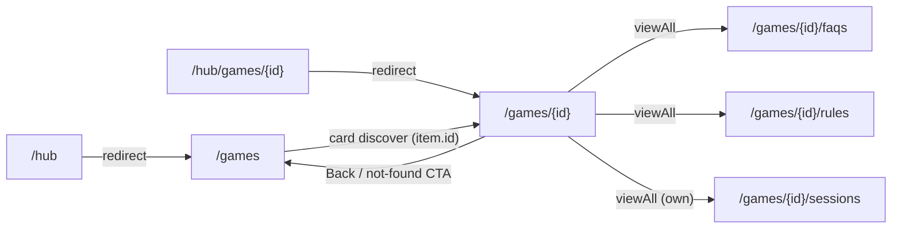

_Nodi senza archi interni al cluster (solo edge esterni): `/games/{id}/card` (how-it-works, legal/takedown, modali, not-found), `/hub/agents` (→ /agents), `/hub/toolkits` (→ /toolkits), `/private-games/{id}` (→ /chat). Le back-link di `faqs`/`rules`/`sessions` puntano a `/library/{id}` (fuori cluster), quindi non generano archi di ritorno interni. I tab di `/games` (`?tab=…`) restano sulla stessa route (query state, non route change)._

### Serate di gioco (GameNight): lista, creazione, live, riepilogo
_Route-group: `(authenticated)` · 5 pagine_

#### Tabella route

| Route | Shell | Guardie | Stati principali |
|---|---|---|---|
| `/game-nights` | DesktopShell (`(authenticated)/layout.tsx` → UserShellClient → DesktopShell); nessuna guardia a livello shell | **RequireRole** `['User','Editor','Admin']` (unica route del cluster con guard di ruolo client: redirect `/login?from=/game-nights` se non-auth, `/` se ruolo escluso) + Suspense `fallback=GameNightsLoadingSkeleton` (bailout `?view/?filter/?tab`) | loading skeleton · success-calendar (default) · success-list · true-empty · filtered-empty · error client-branch · error boundary di segmento |
| `/game-nights/new` | DesktopShell + `HubPageContainer`; nessuna guardia shell | Nessun RequireRole (accesso non-auth non bloccato; la mutation di submit fallirebbe 401) + Suspense `fallback=null` (bailout `?step`) | wizard step 1-4 · checking-conflict · searching-players · submitting+retry `[0,1s,2s,4s]` · draft-saving · submit-error · success · error boundary |
| `/game-nights/[id]` | DesktopShell + `[id]/layout.tsx` (registra GameNightContextBar, placeholder statico) + `FormPageContainer`; nessuna guardia shell/layout | Nessun RequireRole; hook API 401/403/404 → notFound; **GameNightEditDrawer IDOR-guard** host-only (`null` se `viewer.id!==organizerId`) | loading · error/notFound · Draft · Cancelled · Published (isLive) · Completed · edit-drawer (`?action=edit`) · error boundary |
| `/game-nights/[id]/live` | DesktopShell (**NON immersive**: chrome/topbar/bottombar visibili) + `[id]/layout` GameNightContextBar; nessuna guardia shell | Nessun RequireRole; read participant-guarded BE (401/403/404 → schermate LD-10); **LD-14**: redirect a `summary` se `nightStatus==='Completed'` | loading skeleton · error taxonomy LD-10 · terminal LD-14 (Completed/Cancelled/Draft) · Published happy path · vm null → render null · error boundary |
| `/game-nights/[id]/summary` | DesktopShell + `[id]/layout` GameNightContextBar (flex-col, nessun PageContainer); nessuna guardia shell | Nessun RequireRole; `useGameNightSummary`; `canDeletePhoto` = organizer o foto propria (`photo.uploadedByUserId===currentUser.id`) | summary-loading · summary-error · success (archived/active + share-success inline) · error boundary |

> `[id]/layout.tsx` è il segmento padre condiviso da `[id]`, `live` e `summary` (monta GameNightContextBar: matita `aria-label 'Modifica evento'` **senza onClick**, decorativa). `error.tsx` è un **boundary di segmento** che cattura i throw di index + new + `[id]` + live + summary.

#### Navigazione in uscita

- **`/game-nights`**
  - `/game-nights` → `/game-nights/new` (GameNightsHeader `onCreate` → `router.push`; click CTA 'Nuova')
  - `/game-nights` → `/game-nights/new` (EmptyState CTA `onClick` → `router.push`; stato true-empty)
  - `/game-nights` → `/game-nights/new` (DayDetailDrawer `onAddOnDay` → `router.push`; dentro il drawer giorno)
  - `/game-nights` → `/game-nights?view=calendar|list` (GameNightsHeader `onViewChange` → `router.replace(scroll:false)`; toggle vista)
  - `/game-nights` → `/game-nights?filter=all|organizing|invited|completed` (FilterPillBar `onFilterChange` → `router.replace(scroll:false)`; cambio filtro)
  - `/game-nights` → `drawer:DayDetailDrawer` (CalendarMonthGrid `onDayClick` → `setDrawerTarget`; view calendar, click cella giorno)
  - `/game-nights` → `/game-nights` (error.tsx Button asChild → Link; solo se scatta l'error boundary)
  - `/game-nights` → *(no-op — nessuna nav a detail)* (GameNightListCard CardCta → `onAction?.()`; `onAction` omesso dall'orchestratore → le card index non navigano al detail)
- **`/game-nights/new`**
  - `/game-nights/new` → `/game-nights/{id}` (handleSubmit success → `router.push`; create riuscito dopo eventuali retry → toast success + `draftPersist.clear()`)
  - `/game-nights/new` → `/game-nights/new?step=N` (effect reducer→URL → `router.replace(scroll:false)`; ogni cambio `state.step`: Back, Next/Submit-advance, chip stepper)
- **`/game-nights/[id]`**
  - `/game-nights/[id]` → `/game-nights` (Button asChild → Link; stato notFound/error)
  - `/game-nights/[id]` → `/game-nights/{id}?action=edit` (Link 'Modifica' + Edit icon; `isHost && isDraft` → apre GameNightEditDrawer)
  - `/game-nights/[id]` → `/game-nights/{id}` (GameNightEditDrawer `handleClose` → `router.replace`; chiusura drawer o save success → strippa `?action`)
  - `/game-nights/[id]` → `/game-nights/{id}` (Link tab 'Dettagli', `aria-current=page`; isLive)
  - `/game-nights/[id]` → `/game-nights/{id}?tab=voting` (Link tab 'Votazione'; isLive)
  - `/game-nights/[id]` → `/game-nights/new` (GameNightCancelledBanner `onCreateNew` → `router.push`; event Cancelled)
  - `/game-nights/[id]` → `/sessions/{sessionId}` (GameNightActions 'Aggiungi partita' → GamePickerDialog `handleSelect` → `startSession` → `router.push`; `(isLive||isCompleted) && details tab`, disabled se `hasActiveSession`, nav solo se `currentSession.sessionId`)
  - `/game-nights/[id]` → `/sessions/{session.id}` (GameNightSessionsList → Link per sessione; `(isLive||isCompleted) && details tab`)
  - `/game-nights/[id]` → *(mutation, no nav)* publish (`handlePublish` → `usePublishGameNight`; `isHost && isDraft`) · cancel (`handleCancel` → `useCancelGameNight`; `isHost && !isDraft && !isCancelled && !isCompleted`) · complete-night (GameNightActions 'Concludi serata' → ConfirmationDialog → `useCompleteGameNight`; disabled se `sessionCount===0 || hasActiveSession`) · RSVP (GameNightRsvpActionBar `onSelect` → `detail.submitRsvp`; `isGuest && isLive && details tab`) · voto/tie (VotingPanel cast/retract/resolve; `votingTabActive`)
- **`/game-nights/[id]/live`**
  - `/game-nights/[id]/live` → `/game-nights/{id}` (`handleBack` → `router.push`; NightLiveHub `onBack` + Notice/Error '← Torna alla serata', sempre disponibile)
  - `/game-nights/[id]/live` → `/sessions/{sessionId}` (`handleJumpToSession` → `router.push`; `onJumpToLive` presente solo se `liveSessionId = vm.currentGame?.sessionId != null`)
  - `/game-nights/[id]/live` → `/login` (`handleLogin` primaryAction 'Accedi di nuovo'; `error instanceof UnauthorizedError` 401)
  - `/game-nights/[id]/live` → `/game-nights/{id}/summary` (effect LD-14 → `router.replace`; `isCompleted`)
  - `/game-nights/[id]/live` → `modal:BlockedLiveSessionModal` (`handleStartNext` → `startNextGame.mutate` onError; `isMaxLiveBlockedError` 409 max-1-live)
  - `/game-nights/[id]/live` → `modal:WinnerPickerModal` (CTA '🏁 Completa partita'; `showCompleteCta`)
  - `/game-nights/[id]/live` → *(mutation, no nav)* start next game (CTA '▶ Avvia' → `startNextGame.mutate`; `showStartCta`) · finalize (CTA '🏁 Concludi serata' → `finalizeNight.mutate`; `showFinalizeCta` → refetch → LD-14 → summary)
- **`/game-nights/[id]/summary`**
  - `/game-nights/[id]/summary` → `/game-nights` (NightSummaryView `onGoToList` → `router.push`; CTA torna alla lista)
  - `/game-nights/[id]/summary` → `/sessions/{sessionId}` (NightSummaryView `onJumpToSession` → `router.push`; click su una partita)
  - `/game-nights/[id]/summary` → `clipboard: {origin}/game-nights/shared/{shareToken}` (route pubblica) (`handleShare` → `useGenerateGameNightShareToken` onSuccess → `navigator.clipboard.writeText`; NON naviga, mostra shareSuccess inline)
  - `/game-nights/[id]/summary` → `dialog:GameNightPhotoUploadDialog` (GameNightPhotoGallery `onAddPhoto` → `setUploadOpen(true)`)
  - `/game-nights/[id]/summary` → *(mutation, no nav)* archive/unarchive (`useSetGameNightArchived`) · delete foto (`useDeleteGameNightPhoto`; `canDeletePhoto(photo)` true)

#### Superfici condizionali (show / hide / enable)

##### `/game-nights`
- **CalendarMonthGrid vs ListView**: CalendarMonthGrid se `view==='calendar'` (default: qualsiasi valore ≠ `'list'` → calendar); altrimenti ListView. Legacy compat: `?tab=mine` mappa `filter→'organizing'` SOLO se `?filter` assente (nessun mapping per `?tab=upcoming`) — `apps/web/src/app/(authenticated)/game-nights/_content.tsx`
- **FilterPillBar**: filtra il set (calendario+lista) su `all|organizing|invited|completed` via `?filter`; `isFilterKey` fallback ad `'all'`
- **Error screen (game-nights-error)**: mostrato SOLO se `(upcoming.error||mine.error) && allVms.length===0`. Con cache (`allVms>0`) i fallimenti di refetch in background lasciano la vista corrente (stale-over-error)
- **GameNightsLoadingSkeleton**: mostrato se `upcoming.isLoading && mine.isLoading && allVms.length===0` (solo primo caricamento)
- **EmptyState**: mostrato se `allVms.length===0` (dopo caricamento); header reso comunque con conteggi azzerati
- **ListView empty (game-nights-list-empty)**: mostrato quando `groupByMonth(filtered)` ritorna 0 gruppi (filtro senza risultati)
- **DayDetailDrawer**: montato solo se `drawerTarget!=null && drawerLabels!=null`; porta con sé lo snapshot `(gridYear, gridMonth)` del giorno
- **GameNightsHeader countLine**: `totalThisMonth/confirmedThisMonth` calcolati sul set NON filtrato del mese corrente (`statusKey==='confirmed'`)
- **GameNightListCard CardCta**: per statusKey: completed→`'viewSummary'`; cancelled→`'reschedule'`; `(confirmed|planned) & role==='organizer'`→`'edit'`; else (invitato)→`'accept'+'maybe'`. Tutte chiamano `onAction?.()` — con onAction omesso sono no-op — `apps/web/src/components/features/game-nights/GameNightListCard.tsx`
- **GameNightListCard organizingBadge**: mostrato se `vm.role==='organizer'`
- **GameNightListCard PlayerAvatars + gameTitle chip**: `_content` OMETTE `players/gameTitle` → `playerList=[]` (avatar stack vuoto) e chip gameTitle nascosto (backend gap #1170); `participantCount` fa fallback a `vm.playerIds.length`
- **GameNightListCard bordo/opacità/titolo**: `cancelled` → `border-l-destructive` + opacity 0.78 + line-through; altrimenti `border-l-entity-event`
- **toGameNightVM(dto, viewer?.id)**: role organizer/invited derivato confrontando `organizerId` con `useCurrentUser().id` (ownership dipende dall'utente corrente)
- **error.tsx (segment boundary)**: cattura throw non gestiti di QUESTA e di ogni route figlia; dettagli errore solo in `NODE_ENV=development` — `apps/web/src/app/(authenticated)/game-nights/error.tsx`

##### `/game-nights/new`
- **GameNightCreateWizard step attivo**: step corrente = `parseStep(?step)` (1..4); step1=data(GameNightDateTimePicker), step2=luogo/tipo(GameNightLocationToggle), step3=invitati(PlayerInviteAutocomplete), step4=giochi(GameCandidatesPicker) + RSVPCardLivePreview
- **Wizard nav — Back**: `data-slot game-night-create-nav-back`; disabled quando `state.step===1` — `apps/web/src/components/features/game-night-create/GameNightCreateWizard.tsx`
- **Wizard nav — Next/Submit**: `data-slot game-night-create-nav-next`; `disabled={!canAdvance || isSubmitting}` con `canAdvance=isStepComplete(state, step)`; step<4 → `goToStep(step+1)`; step===4 → `onSubmit()` — `apps/web/src/components/features/game-night-create/GameNightCreateWizard.tsx`
- **Wizard stepper (chip 1..4)**: ogni chip (`data-slot game-night-create-stepper-stepN`) dispatcha `goToStep(step)` → salto diretto a QUALSIASI step (non gated dalla completezza) — `apps/web/src/components/features/game-night-create/GameNightCreateWizard.tsx`
- **Input 'title' separato**: input locale (`data-slot game-night-create-title-input`, maxLength 200) con `useState('')` sopra il wizard; passato al wizard e a `buildSubmitPayload`
- **Draft restore**: `dispatch restoreFromDraft` se `draftPersist.initialDraft!=null` (una sola volta via `draftRestoredRef`). Autosave DISABILITATO se `fixtureState!=null`
- **Draft saving status**: banner `role=status aria-live` reso solo se `draftPersist.isPending`
- **Conflict check (step1)**: `useGameNightConflictCheck` abilitato solo se `state.date.iso!=null`; `recordConflict` all'arrivo del risultato (guardato da `lastDispatchedIsoRef`); `onContinueAnyway` azzera il warning
- **Regulars (step3)**: `useRegularsForUser` enabled SOLO se `state.step===3`
- **Player search (step3)**: `usePlayerSearch(playerSearchQuery)`; `isSearchingPlayers=isFetching`
- **Library (step4)**: `useLibrary(pageSize:50)` enabled SOLO se `state.step===4`
- **Submit / isSubmitting**: `isSubmitting = isSubmittingWithRetry || createMutation.isPending`; `handleSubmit` early-return se già in retry
- **Retry loop**: delays `[0,1s,2s,4s]`; unmount guard `isMountedRef`; esaurimento → toast destructive + `console.error` breadcrumb
- **Payload guard**: `buildSubmitPayload(state,{title})` `!ok` → toast errore e nessun submit; stripping null→undefined
- **Visual-test fixture**: `IS_VISUAL_TEST_BUILD && ?fixture=<id>` → stato FSM deterministico via `getWizardFixture` (dead code costant-folded a false in prod)

##### `/game-nights/[id]`
- **Branch per status**: `event.status`: Draft→GameNightPlanningLayout; Cancelled→GameNightCancelledBanner; Published/Completed→hero+sezioni
- **Host action row**: mostrata solo se `isHost && (isDraft || (!isCancelled && !isCompleted))`. Draft→'Modifica'(Link `?action=edit`)+'Pubblica'(disabled se `publishMutation.isPending`); non-Draft & non-terminale→'Annulla'(destructive, disabled se `cancelMutation.isPending`)
- **Tab strip Dettagli|Votazione**: reso SOLO se isLive. `votingTabActive = isLive && searchParams.get('tab')==='voting'`; `showDetailsContent = !votingTabActive` (ADR-061, deep-link `?tab=voting`)
- **GameNightRsvpActionBar**: montato SOLO se `isGuest && isLive && showDetailsContent`. I 3 bottoni disabilitati quando `pendingResponse!==null` o `disabled=true`; mode default `'authenticated'` (Maybe visibile) — `apps/web/src/components/features/game-night-detail/GameNightRsvpActionBar.tsx`
- **VotingPanel**: montato SOLO se `votingTabActive`; `isOrganizer=isHost`. Stati loading/empty/error/default; VotingTiedResolver visibile solo se `isOrganizer && isTie && isVotingClosed && !winnerGameId`. Nessuna navigazione — `apps/web/src/components/features/game-night-detail/voting/VotingPanel.tsx`
- **Sezioni session-flow (GameNightActions+SessionsList+DiaryPanel)**: mostrate se `(isLive || isCompleted) && showDetailsContent`
- **GameNightActions**: ritorna null se `isCompleted`. 'Aggiungi partita' disabled se `hasActiveSession`; 'Concludi serata' disabled se `sessionCount===0 || hasActiveSession || completeMutation.isPending`. `hasActiveSession`/`sessionCount` derivano dallo store planning, non dal detail DTO — `apps/web/src/components/game-night/GameNightActions.tsx`
- **GamePickerDialog (dentro GameNightActions)**: `open=showGamePicker`; sorgente = LIBRERIA utente (`useLibrary pageSize:200`, fetch solo se open) con ricerca titolo + gating KB-readiness per gioco; `handleSelect` → `startSession(gameId, [], gameNightEventId)` → `router.push /sessions/{id}` — `apps/web/src/components/session/GamePickerDialog.tsx`
- **GameNightSessionsList**: empty-state interno se `sessions.length===0`; altrimenti una Link-card per sessione → `/sessions/{session.id}` con badge stato — `apps/web/src/components/game-night/GameNightSessionsList.tsx`
- **Roster (GameNightRsvpRow list)**: mostrato se `sortedRsvps.length>0 && showDetailsContent`. Ordine: organizer→viewer→resto. `isMe=userId===viewer.id`; `isHost=userId===organizerId`
- **rsvpStatusLabel tagged vs pending**: su Draft uno status Pending è reso come 'tagged' (giocatore taggato, nessun invito — invariante #16); dopo Publish diventa 'pending'
- **GameNightDetailHero locationLine / metaLine**: `locationLine` solo se `event.location`; `metaLine` = capacity (accepted/max) se `event.maxPlayers`, altrimenti capacityUncapped
- **useSharedGames(catalog)**: abilitato solo se `needsCatalog = isDraft || Published`; alimenta planning (Draft) e i titoli candidati del VotingPanel
- **Planning store sync effect**: `reset()` + `addPlayer` (RSVP Accepted) + `addGame` (event.gameIds via catalog) SOLO se `isDraft && event`
- **GameNightEditDrawer**: ritorna null se `!isOrganizer` (`viewer.id!==organizerId`); `open = searchParams.get('action')==='edit'`; su `onError 409/ConflictError` → toast concurrentEdit, altrimenti generico; `onSuccess` → savedToast + `handleClose` — `apps/web/src/app/(authenticated)/game-nights/[id]/_components/GameNightEditDrawer.tsx`
- **handleRsvp esiti**: toast da callback mutation; `outcome.kind==='rejected'` → status 410 cancelledGone / else directConflict

##### `/game-nights/[id]/live`
- **NightLiveSkeleton**: mostrato se `isLoading` (`role=status aria-live`)
- **NightLiveError (LD-10)**: `UnauthorizedError`(401)→'Sessione scaduta'+CTA login; `ForbiddenError`(403)→'Accesso riservato'; `NotFoundError`(404)→'Serata non trovata'; name `NetworkError|CircuitBreakerError`→'Connessione persa'; else generico
- **NightLiveNotice terminale (LD-14)**: Completed→'Serata conclusa' (+replace summary); Cancelled→'Serata annullata'; Draft→'Serata non ancora avviata'. Published prosegue all'hub
- **NightLiveHub**: readOnly (Slice B): drive controls nascosti (LD-13); mostra header, planned line-up, currentGame, diary; riceve solo `onBack + onJumpToSession`
- **showStartCta ('▶ Avvia')**: `vm.isViewerOrganizer && nextGame!==null && vm.status!=='live'` (409 modal come backstop per le race). Disabled se `startNextGame.isPending`
- **showCompleteCta ('🏁 Completa partita')**: `vm.isViewerOrganizer && vm.status==='live'` (mutuamente esclusiva con start). Disabled se `completeGame.isPending`
- **showFinalizeCta ('🏁 Concludi serata')**: `vm.isViewerOrganizer && vm.status!=='live' && nextGame===null && vm.nightStatus==='InProgress' && vm.plannedGames.length>0`. Disabled se `finalizeNight.isPending`
- **completeErrorMessage (in WinnerPickerModal)**: ForbiddenError→'Solo l'organizzatore può completare'; ConflictError→'nessuna partita live/vincitore non valido'; else generico. Reso solo se `winnerPickerOpen`
- **finalizeErrorMessage (role=alert sopra CTA)**: ForbiddenError/ConflictError/else, reso se `finalizeNight.isError`
- **WinnerPickerModal**: `open=winnerPickerOpen`; `candidates=vm.winnerCandidates`; `onConfirm=handleCompleteConfirm(winnerId?)` → `completeGame.mutate`; su success `setWinnerPickerOpen(false)`
- **BlockedLiveSessionModal**: `open=blockedModalOpen` (dal 409 max-live); `onJumpToLive` fornito solo se `liveSessionId!=null`
- **Diary (useNightLiveDiary)**: read separato participant-guarded; loading/errore NON fatale → diary vuoto (`mapDiary` fallback `[]`), l'hub degrada senza bloccare

##### `/game-nights/[id]/summary`
- **summary-loading**: mostrato se `summaryQuery.isLoading`
- **summary-error**: mostrato se `summaryQuery.isError || !summaryQuery.data`
- **NightSummaryView archived**: `archived=summaryQuery.data.isArchived` → azione archivia vs disarchivia (`onArchive/onUnarchive`)
- **shareSuccess banner**: visibile (con subline `gameNightDetail.summary.shareCopied`) dopo copia link riuscita; stato locale `shareSuccess.visible`
- **GameNightPhotoGallery delete per foto**: `canDeletePhoto(photo) = isViewerOrganizer || photo.uploadedByUserId===currentUser.id`
- **GameNightPhotoUploadDialog**: `open=uploadOpen` (da `onAddPhoto`), `onClose=setUploadOpen(false)`

#### Componenti → file

| Componente | File | Ruolo |
|---|---|---|
| GameNightsContent | `apps/web/src/app/(authenticated)/game-nights/_content.tsx` | Orchestratore v2 index; URL SSOT `?view/?filter`; merge upcoming+mine+currentUser; branch loading/error/empty/calendar/list |
| GameNightsHeader | `apps/web/src/components/features/game-nights/GameNightsHeader.tsx` | Kicker/title/countLine + toggle vista + FilterPillBar + CTA 'Nuova' |
| CalendarMonthGrid | `apps/web/src/components/features/game-nights/CalendarMonthGrid.tsx` | Griglia mese; `onDayClick` apre DayDetailDrawer |
| DayDetailDrawer | `apps/web/src/components/features/game-nights/DayDetailDrawer.tsx` | Drawer eventi di un giorno; `onAddOnDay` → `/game-nights/new` |
| GameNightListCard | `apps/web/src/components/features/game-nights/GameNightListCard.tsx` | Card evento (list view); CTA condizionali; con onAction/players/gameTitle omessi → CTA no-op, avatar vuoti, chip nascosto |
| FilterPillBar | `apps/web/src/components/features/game-nights/FilterPillBar.tsx` | Pill filtro all/organizing/invited/completed |
| GameNightsError | `apps/web/src/app/(authenticated)/game-nights/error.tsx` | Error boundary di segmento condiviso da tutto il cluster: Riprova(reset)/Indietro(Link) |
| RequireRole | `apps/web/src/components/auth/RequireRole.tsx` | Guard client-side di ruolo/redirect (solo index) |
| NewGameNightContent | `apps/web/src/app/(authenticated)/game-nights/new/_content.tsx` | Orchestratore wizard: sync `?step`, autosave draft, submit+retry, input title locale |
| GameNightCreateWizard | `apps/web/src/components/features/game-night-create/GameNightCreateWizard.tsx` | Wizard 4 step + RSVPCardLivePreview; footer con SOLO Back e Next/Submit + stepper con salto diretto (nessun Cancel renderizzato) |
| wizardReducer / buildSubmitPayload / isStepComplete | `apps/web/src/lib/game-nights/wizard-reducer.ts` | Stato FSM wizard + gate completezza (canAdvance) + payload submit |
| useCreateGameNight | `apps/web/src/hooks/queries/useGameNights.ts` | Mutation POST creazione serata |
| GameNightDetailView | `apps/web/src/app/(authenticated)/game-nights/[id]/_components/GameNightDetailView.tsx` | Page-client v2: branch status, gating host/guest, RSVP, voting, sessioni, roster, edit-drawer |
| GameNightDetailHero | `apps/web/src/components/features/game-night-detail/index.ts` | Hero titolo/stato/data/organizzatore/capacità |
| GameNightCancelledBanner | `apps/web/src/components/features/game-night-detail/index.ts` | Banner evento annullato + CTA nuova serata (`onCreateNew` → `/game-nights/new`) |
| GameNightRsvpActionBar | `apps/web/src/components/features/game-night-detail/GameNightRsvpActionBar.tsx` | Barra RSVP accept/maybe/decline (guest, Published); disabilita durante pending; `mode` public nasconde Maybe |
| GameNightRsvpRow | `apps/web/src/components/features/game-night-detail/index.ts` | Riga roster partecipante (host/me/status) |
| VotingPanel | `apps/web/src/components/features/game-night-detail/voting/VotingPanel.tsx` | Votazione candidati (approval), tie-resolver organizer; nessuna navigazione |
| GameNightPlanningLayout | `apps/web/src/components/game-night/planning/GameNightPlanningLayout.tsx` | Layout planning legacy (Draft, host-flow); store-driven, InlineGamePicker interno; nessun edge di nav |
| GameNightActions | `apps/web/src/components/game-night/GameNightActions.tsx` | 'Aggiungi partita' (GamePickerDialog) + 'Concludi serata' (ConfirmationDialog→useCompleteGameNight); null se isCompleted |
| GameNightSessionsList | `apps/web/src/components/game-night/GameNightSessionsList.tsx` | Lista sessioni (dallo store) + Link → `/sessions/{id}`; empty-state interno |
| GameNightDiaryPanel | `apps/web/src/components/game-night/GameNightDiaryPanel.tsx` | Diario eventi serata |
| GameNightEditDrawer | `apps/web/src/app/(authenticated)/game-nights/[id]/_components/GameNightEditDrawer.tsx` | Drawer di modifica (ADR-079), IDOR host-only, `?action=edit`, gestione 409 concurrentEdit |
| GameNightForm | `apps/web/src/app/(authenticated)/game-nights/_components/GameNightForm.tsx` | Form condiviso create/edit |
| GamePickerDialog | `apps/web/src/components/session/GamePickerDialog.tsx` | Selezione gioco dalla libreria utente (gating KB-readiness) → crea sessione e naviga a `/sessions/{id}` |
| GameNightContextBar | `apps/web/src/components/game-night/GameNightContextBar.tsx` | Context bar montata da `[id]/layout.tsx` senza props → placeholder statico; matita senza onClick (decorativa) |
| NightLiveClientView | `apps/web/src/app/(authenticated)/game-nights/[id]/live/_components/NightLiveClientView.tsx` | Orchestratore live: loading/error/terminal/published; CTA organizer start/complete/finalize; modali |
| NightLiveHub | `apps/web/src/components/features/game-nights/live/index.ts` | Hub read-only (Screen K): header, line-up, currentGame, diary; `onBack + onJumpToSession` |
| WinnerPickerModal | `apps/web/src/components/features/game-nights/live/index.ts` | Selezione vincitore alla chiusura partita |
| BlockedLiveSessionModal | `apps/web/src/components/features/game-nights/live/index.ts` | Modal 409 max-1-live con jump alla live in corso |
| useGameNightLive | `apps/web/src/lib/game-nights/hooks/useGameNightLive.ts` | Read model live (`GET /game-nights/{id}/live`) |
| useStartNextGame / useCompleteGameNightSession / useCompleteGameNight | `apps/web/src/lib/game-nights/hooks/useStartNextGame.ts` | Mutation start prossima partita / completa partita / concludi serata (finalize da useSessionFlow) |
| NightSummaryClientView | `apps/web/src/app/(authenticated)/game-nights/[id]/summary/_components/NightSummaryClientView.tsx` | Orchestratore summary: view model, share (clipboard)/archive, gallery+upload |
| NightSummaryView | `apps/web/src/components/features/game-nights/summary/index.ts` | Riepilogo (Screen M): MVP, giochi, eventi, share/archive, `onGoToList`, `onJumpToSession` |
| toNightSummaryViewModel | `apps/web/src/components/features/game-nights/summary/night-summary-adapter.ts` | Adapter DTO→view model (locale/t) |
| GameNightPhotoGallery | `apps/web/src/components/features/game-nights/photos/GameNightPhotoGallery.tsx` | Galleria foto + add/delete condizionale |
| GameNightPhotoUploadDialog | `apps/web/src/components/features/game-nights/photos/GameNightPhotoUploadDialog.tsx` | Dialog upload foto |
| useGameNightSummary / useGameNightPhotos / useGenerateGameNightShareToken / useSetGameNightArchived / useDeleteGameNightPhoto | `apps/web/src/hooks/queries/useGameNights.ts` | Query/mutation summary, foto, share token, archivio |

#### Navigazione interna al cluster

> Nota strutturale: le card della lista NON navigano al detail (`onAction` omesso → no-op), quindi non esiste un edge `/game-nights → /game-nights/[id]`; il detail si raggiunge dall'interno del cluster solo tramite la creazione riuscita.

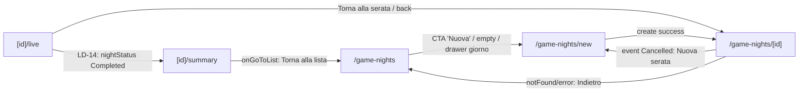

### Sessioni di gioco: lista, nuova, join, live (immersiva), note, scoreboard
_Route-group: `(authenticated)` · 8 pagine_

#### Tabella route

| Route | Shell | Guardie | Stati principali |
|---|---|---|---|
| `/sessions` | `DesktopShell` (`(authenticated)/layout.tsx`→`UserShellClient`) + `sessions/layout.tsx` (MiniNav "Sessioni" tabs Attive/Storico); pagina thin `<Suspense>` → `SessionsLibraryView` (CSR bailout via `useSearchParams`) | Nessuna guardia esplicita: auth ereditata da `AuthProvider` shell; `SessionsNav` legge `?tab`, nessun redirect | default (grid/lista) · loading (skeleton) · empty · filtered-empty · error · fixture short-circuit (`IS_VISUAL_TEST_BUILD`) |
| `/sessions/new` | `DesktopShell` + `sessions/layout.tsx` (activeTab='active'); `use client` `<Suspense fallback=null>`; render viewport-condizionale (`useMediaQuery`, NON dual-render) | Auth shell; `useMediaQuery('(min-width:1024px)')` decide desktop/mobile (SSR isDesktop=false → mobile) | desktop entry "Serata di Gioco" · GameNightWizard · SessionWizardMobile (loading/empty/creating/error) · SessionCreationWizard step 0-3 |
| `/sessions/join` | `DesktopShell` + `sessions/layout.tsx`; `use client`, card centrata `max-w-sm` | Auth shell; nessuna guardia esplicita | idle (input codice) · joining · error (<4 char o "Sessione non trovata") |
| `/sessions/[id]` | `DesktopShell` + `sessions/layout.tsx` + `[id]/layout.tsx` (header inline back + "Aggiungi Punteggio"→`LiveScoreSheet`; MiniNav Punteggi/Strumenti/Chat/Note; `loadSession` su mount); pagina async server → `<Suspense>` → `SessionSummaryView` | Auth shell; **fork** (`useEffect`): `not-completed` && status ∈ {InProgress,Paused,Setup} → `router.replace('/sessions/{id}/live')` | loading · error · not-found · not-completed · default · partial |
| `/sessions/[id]/join` | `DesktopShell` + `sessions/layout.tsx` + `[id]/layout.tsx` (header + MiniNav sopra la card; tenta `loadSession(id)`); `use client`, `use(params)` + `?token` | Auth shell (flusso ospite via link); `?token` mancante → early return card "Invalid invite link" | missing-token · form idle · joining · error |
| `/sessions/[id]/live` | **ROUTE IMMERSIVA**: `MobileBottomBar` auto-nascosta (`isImmersiveRoute`); `[id]/layout.tsx` SOPPRIME MiniNav (`isLiveRoute`→tabs:[]) ma tiene header inline + `LiveScoreSheet`; `SessionLiveView` full-screen (`h-screen`, `data-theme='dark'`) con propria `LiveTopBar` | Auth shell; `sessionId` validato (`resolveSessionId`); `viewerRole` da `useCurrentUser.id` vs players (Host/Spectator/Player; BE Moderator→Player) | loading · error · not-found · default (2-col 60/40 desktop; bottom-sheet mobile) · race-guard · connection sub-states (reconnecting/degraded-polling/failed) · dialog (pause/endgame/endgame-confirm/add-player) |
| `/sessions/[id]/notes` | `DesktopShell` + `sessions/layout.tsx` + `[id]/layout.tsx` (MiniNav tab "Note" attivo); `use client`, `max-w-3xl` | Auth shell; `id` da `useParams`; `api.sessions.getById` su mount | loading (Skeleton x3) · error (`!session` → "Session not found") · loaded |
| `/sessions/[id]/scoreboard` | `DesktopShell` + `sessions/layout.tsx` + `[id]/layout.tsx` (pathname non matcha tab → default 'scores'); SOPRA `ScoreboardPage` (`min-h-screen`, action bar fissa in basso); pagina thin `use(params)` | Auth shell; `useQuery getById` `refetchInterval` 10s (false su error), `retry:false` | loading · error (`!session`) · loaded · empty (`rankedPlayers.length===0`) |

#### Navigazione in uscita

- **`/sessions`**
  - → `/sessions/new` (SessionsHero CTA "Nuova" → `handleNewSession`)
  - → `/sessions/new` (EmptySessions `onPrimaryAction`; `effectiveKind==='empty'`)
  - → `/sessions/{item.id}` (SessionCardGrid/List onClick; `kind='default'`)
  - → `/sessions` clear `?status`&`?search` (EmptySessions `handleClearFilters`; `filtered-empty`, preserva `?view`&`?state`, `router.replace`)
  - → `/sessions?status=…|?view=…|?search=…` (SessionsFilters; URL state SSOT, `router.replace scroll:false`)
  - → `/sessions` refetch (EmptySessions `handleRetry`; `error`, nessuna nav)
  - → `/sessions` (MiniNav tab "Attive", Link)
  - → `/sessions?tab=history` (MiniNav tab "Storico"; **NB: view filtra su `?status` non `?tab` → param inerte**)
- **`/sessions/new`**
  - in-page apre GameNightWizard ("Inizia Serata di Gioco" → `setShowWizard(true)`; desktop, showWizard=false)
  - in-page chiude GameNightWizard ("Chiudi" → `setShowWizard(false)`; desktop, showWizard=true)
  - → `/sessions/{sessionId}/live` (GameNightWizard `onComplete` → `handleWizardComplete`)
  - → `/sessions/{sessionId}` (SessionCreationWizard `handleCreate` success; step 3)
  - `router.back()` (SessionCreationWizard "Annulla"; step===0)
  - in-page `setStep(step-1)` ("Indietro" desktop/mobile; step>0, transizione non route)
  - → `/sessions/{sessionId}/live` (SessionWizardMobile `handleStart` success; mobile step 5)
  - → `/sessions/{sessionId}/live` (SessionWizardMobile fallback su errore `addPlayer` a metà flusso)
- **`/sessions/join`**
  - → `/sessions/{session.id}` (`api.liveSessions.getByCode` success; primo tentativo)
  - → `/sessions/{session.id}` (catch → `sessionTracking.joinByCode`+`getByCode`; fallback)
  - → `/sessions` (Button "Torna alle sessioni")
- **`/sessions/[id]`**
  - → `/sessions/{id}/live` (`useEffect` redirect `router.replace`; `not-completed` && status ∈ {InProgress,Paused,Setup})
  - → `/sessions/{id}/live` (NotCompletedShell `onGoLive`; cell not-completed)
  - → `/sessions` (NotFoundShell `onBack` → `handleBack`; unica edge di `handleBack`)
  - → `/sessions/new` (NotFoundShell `onNewSession`; CTA #2088)
  - → `/sessions/{id}?diary=…|?theme=…` (SessionDiaryTimeline/SessionShareCard; URL SSOT `router.replace scroll:false`)
  - clipboard / `window.open` esterno (SessionShareCard `onShare`: copy/instagram→clipboard; twitter→`twitter.com/intent`; whatsapp→`wa.me` `_blank`)
  - → `/sessions/{id}/tools|/chat|/notes` (MiniNav tabs, Link)
  - → `/sessions` (MiniNav "Punteggi" href=`/sessions/{id}` = route corrente / header back link)
  - modal `LiveScoreSheet` (header "Aggiungi Punteggio" → `setScoreSheetOpen(true)`)
- **`/sessions/[id]/join`**
  - → `/sessions/{targetSessionId}` (form `handleSubmit` → `sessionInvites.joinSession` success → encrypt+`sessionStorage`; `targetSessionId = result.sessionId || sessionId`)
- **`/sessions/[id]/live`**
  - → `/sessions/{id}` (o `/sessions` se sessionId null) (LiveTopBar `onExit` → `handleExit`)
  - → `/sessions` (NotFoundShell `onBack`; **ErrorShell NON naviga: `onRetry` refetch**)
  - → playRecordDetail(recordId) (`useEffect` saveIntent; `resolveStatus==='resolved'` && `resolvedPlayRecordId`)
  - → playRecords lista (`useEffect` saveIntent; `resolveStatus==='timeout'`, fallback Opzione C)
  - → `?tab=|?mtab=|?msheet=|?dialog=|?chat|?mchat` (handler vari; URL SSOT `router.replace scroll:false`)
  - modal `PauseOverlay|EndgameDialog|EndgameConfirm|AddPlayerDialog` (`?dialog=pause|endgame`; `setEndgameConfirmOpen`/`setAddPlayerOpen`)
- **`/sessions/[id]/notes`**
  - → `/sessions` (header back link / MiniNav "Punteggi" href=`/sessions/{id}`)
  - → `/sessions/{id}/tools|/chat` (MiniNav Strumenti/Chat)
  - modal `LiveScoreSheet` (header "Aggiungi Punteggio")
- **`/sessions/[id]/scoreboard`**
  - → `/sessions/{sessionId}` (back-link header, `data-testid=back-link`)
  - → `/sessions` (error state Link "Torna alle sessioni"; `isError||!session`)
  - refetch (SessionStateRenderer `onRetry`; error, nessuna nav)
  - modal `ScoreSheet` bottom locale ("Registra Punteggio" → `setScoreSheetOpen(true)`)
  - chiude sheet senza persist ("Salva Punteggi"; input NON cablati a backend, UI-only)
  - → `/sessions` (+ tab) + modal `LiveScoreSheet` (chrome `[id]/layout.tsx` sopra la pagina)

#### Superfici condizionali (show / hide / enable)

##### `/sessions`
- Griglia `SessionCardGrid` vs lista `SessionCardList`: `effectiveKind==='default'` && `view==='grid'` → griglia auto-fill `minmax(280px,1fr)`; altrimenti lista `flex-col` — `apps/web/src/app/(authenticated)/sessions/_components/SessionsLibraryView.tsx`
- `EmptySessions`: renderizzato quando `effectiveKind !== 'default'` (loading/empty/filtered-empty/error); `onPrimaryAction` solo per empty(→`handleNewSession`), filtered-empty(→`handleClearFilters`), error(→`handleRetry`); loading senza azione — `apps/web/src/app/(authenticated)/sessions/_components/SessionsLibraryView.tsx`
- Fixture sessioni (`VISUAL_TEST_FIXTURE_SESSIONS`/`_EMPTY`): solo se `IS_VISUAL_TEST_BUILD`; `?fixture=empty` o `stateOverride==='empty'` → lista vuota; con fixture attiva `realKind` forzato a `'default'` — `apps/web/src/lib/sessions/sessions-visual-test-fixture.ts`
- State override FSM (`?state=`): applicato solo se `STATE_OVERRIDE_ENABLED` (dev/visual); `effectiveKind = stateOverride ?? realKind` — `apps/web/src/lib/sessions/sessions-visual-test-fixture.ts`
- `SessionsFilters` (pill conteggi + toggle vista + ricerca): counts calcolati (all totale; active=inprogress|paused; completed; abandoned); `statusFilter`/`view`/`search` da URL — `apps/web/src/app/(authenticated)/sessions/_components/SessionsLibraryView.tsx`
- MiniNav tab attivo: `activeTabId='history'` se `?tab==='history'` altrimenti `'active'` — `apps/web/src/app/(authenticated)/sessions/layout.tsx`

##### `/sessions/new`
- `DesktopWizardSection` vs `MobileWizardSection`: `isDesktop` (`useMediaQuery` ≥1024px) → desktop; altrimenti mobile (legge `?gameId`/`?gameName` per prefill) — `apps/web/src/app/(authenticated)/sessions/new/page.tsx`
- Card "Serata di Gioco" entry vs GameNightWizard: desktop `!showWizard` → card entry (`data-testid=game-night-entry`) + `SessionCreationWizard`; `showWizard` → GameNightWizard (SessionCreationWizard NON renderizzato) — `apps/web/src/app/(authenticated)/sessions/new/page.tsx`
- `SessionCreationWizard` bottone Avanti/Crea: `canProceed()` (step0 gameName non vuoto, step1 dimensions>0, step2 players≥1, step3 true); step<3 "Avanti" (disabled `!canProceed`), step===3 "Crea Sessione" (disabled `!canProceed||isCreating`, spinner) — `apps/web/src/components/session/SessionCreationWizard.tsx`
- `SessionCreationWizard` "Annulla" vs "Indietro": step===0 → "Annulla" `router.back()`; step>0 → "Indietro" `setStep(s-1)`; disabled se `isCreating` — `apps/web/src/components/session/SessionCreationWizard.tsx`
- `SessionCreationWizard` rimozione dimensione (Trash2): mostrato solo se `dimensions.length>1` — `apps/web/src/components/session/SessionCreationWizard.tsx`
- `SessionCreationWizard` color selector: mostra solo colori `=== player.color` o non usati, `slice(0,5)`; anello indigo su selezionato — `apps/web/src/components/session/SessionCreationWizard.tsx`
- `SessionCreationWizard` banner errore: mostrato quando `error != null` — `apps/web/src/components/session/SessionCreationWizard.tsx`
- `GameNightWizard` step: search→SearchGameStep (`onGameFound`→upload); upload→UploadRulesStep (`onComplete|onSkip`→session); session→CreateSessionStep (`onSessionCreated`→`onComplete`) — `apps/web/src/components/game-night/GameNightWizard.tsx`
- `SessionWizardMobile` step iniziale + dot nav: step iniziale `prefilledGameId ? 2 : 1`; dot cliccabile solo per step completati (`s<step`); step 1 disabled+opacity-50 se `prefilledGameId`; icona Check su step done — `apps/web/src/app/(authenticated)/sessions/new/session-wizard-mobile.tsx`
- `SessionWizardMobile` step 1 griglia giochi: `isLoadingLibrary`→"Caricamento libreria"; `filteredGames` vuoto→"Nessun gioco trovato"/"La tua libreria è vuota"; card selezionata ring amber; "Avanti" disabled se `!canProceedStep1` (=`!selectedGameName`) — `apps/web/src/app/(authenticated)/sessions/new/session-wizard-mobile.tsx`
- `SessionWizardMobile` step 2 pill gioco pre-selezionato + color: pill solo se `prefilledGameId && selectedGameName`; color selector `slice(0,4)`; "Avanti" disabled se `!canProceedStep2` (=`players.length===0`) — `apps/web/src/app/(authenticated)/sessions/new/session-wizard-mobile.tsx`
- `SessionWizardMobile` step 3 ordine turni + frecce: frecce su/giù disabled per `isFirst`/`isLast`; nota "ordine non applicabile" se `players.length===1` — `apps/web/src/app/(authenticated)/sessions/new/session-wizard-mobile.tsx`
- `SessionWizardMobile` step 4 KbSelectionStep + fasi: KbSelectionStep solo se `showKbStep` (`useKbGameDocuments.length>=2`) && `selectedGameId`; `isLoadingPhases`→"Caricamento fasi"; phases vuote→placeholder dashed; CTA "Avanti" se ≥1 fase valida altrimenti "Salta" — `apps/web/src/app/(authenticated)/sessions/new/session-wizard-mobile.tsx`
- `SessionWizardMobile` step 5 riepilogo + error: riepilogo turni solo se `players.length>1`; blocco fasi solo se ≥1 fase valida; alert `role=alert` se error; "Inizia a Giocare" loading/disabled=`isCreating` — `apps/web/src/app/(authenticated)/sessions/new/session-wizard-mobile.tsx`

##### `/sessions/join`
- Input codice: elimina non-alfanumerici, auto-uppercase, `slice(0,8)`; `maxLength=8`; azzera error a ogni change — `apps/web/src/app/(authenticated)/sessions/join/page.tsx`
- Button "Unisciti": disabled se `code.length<4 || isJoining`; `isJoining`→Loader2+"Connessione…" altrimenti "Unisciti" — `apps/web/src/app/(authenticated)/sessions/join/page.tsx`
- Testo errore: mostrato quando `error != null` ("almeno 4 caratteri" / "Sessione non trovata. Controlla il codice e riprova.") — `apps/web/src/app/(authenticated)/sessions/join/page.tsx`
- Enter key: `onKeyDown` Enter sull'input → `handleJoin()` — `apps/web/src/app/(authenticated)/sessions/join/page.tsx`

##### `/sessions/[id]`
- FSM 6-cell (loading/error/not-found/not-completed/default/partial): `deriveSessionSummaryState` su session+diary+snapshots+achievements(stub); `sessionId null`→not-found; con fixture mai loading/error — `apps/web/src/lib/sessions-summary/fsm.ts`
- Fixture override (`?fixture=default|tied|abandoned|solo|empty-achievements|empty-photos`): solo se `STATE_OVERRIDE_ENABLED`; con fixture attiva session/diary/snapshots disabilitati — `apps/web/src/lib/sessions-summary/visual-test-fixture.ts`
- `useSessionDiaryQuery`/`useSessionVisionSnapshots`: enabled SOLO dopo `sessionQuery.isSuccess && data!=null` (oltre a `fixture===null && sessionId!==null`) — `apps/web/src/app/(authenticated)/sessions/[id]/_components/SessionSummaryView.tsx`
- `AchievementsCarousel` (stub): sempre da `sessionSummaryFixtures.default` (nessun endpoint v1); empty solo con `?fixture=empty-achievements` — `apps/web/src/app/(authenticated)/sessions/[id]/_components/SessionSummaryView.tsx`
- `ChatHighlights`: `highlights` hardcoded a `[]` → sempre empty — `apps/web/src/app/(authenticated)/sessions/[id]/_components/SessionSummaryView.tsx`
- `SessionSummaryHero` tiedBanner + confetti: tiedBanner solo se ≥2 partecipanti a rank 1; `showConfetti` solo primo-load (`shouldShowConfetti`) && `status==='Completed'` — `apps/web/src/app/(authenticated)/sessions/[id]/_components/SessionSummaryView.tsx`
- KPI "duration": sempre `'—'` (v1 carryover: adapter non espone `durationMinutes`) — `apps/web/src/app/(authenticated)/sessions/[id]/_components/SessionSummaryView.tsx`
- `SessionDiaryTimeline` expand/collapse: primo turno espanso di default (`Set([diaryGroups[0].turn])`); stato locale NON in URL — `apps/web/src/app/(authenticated)/sessions/[id]/_components/SessionSummaryView.tsx`
- `PlayAgainCta` (SEMPRE DISABILITATO): montato SENZA `onPlayAgain` → `disabled=true`, `aria-disabled`, nessuna nav/mutation (banner informativo) — `apps/web/src/components/features/session-summary/PlayAgainCta.tsx`
- `ConnectionBar` (pip strip): `role=status`; pip SENZA `href` → `<span>` non interattivi; count 0 → ghost dashed opacity 0.6 — `apps/web/src/components/features/session-summary/ConnectionBar.tsx`
- `[id]/layout` MiniNav tab attivo: `deriveActiveTab` da pathname (`/tools`→tools, `/chat`→chat, `/notes`→notes, altrimenti `'scores'`) — `apps/web/src/app/(authenticated)/sessions/[id]/layout.tsx`

##### `/sessions/[id]/join`
- Card "Invalid invite link": early return quando `!token` — `apps/web/src/app/(authenticated)/sessions/[id]/join/page.tsx`
- Input display-name: required, `maxLength=50`, autoFocus, disabled se `isJoining` — `apps/web/src/app/(authenticated)/sessions/[id]/join/page.tsx`
- Button "Join Session" (`type=submit`): disabled se `!displayName.trim() || isJoining`; Loader2+"Joining…" se `isJoining` — `apps/web/src/app/(authenticated)/sessions/[id]/join/page.tsx`
- Alert errore: mostrato (`role=alert`, `data-testid=join-error`) quando `error != null` — `apps/web/src/app/(authenticated)/sessions/[id]/join/page.tsx`
- sessionStorage token cifrato: su success salva `encrypt(result.connectionToken)` come `session-token-{targetSessionId}` — `apps/web/src/app/(authenticated)/sessions/[id]/join/page.tsx`

##### `/sessions/[id]/live`
- FSM 4-state: `deriveSessionLiveUiState` → loading/error/not-found/default; `default` ma `activeSession null` → fallback LoadingShell (race guard) — `apps/web/src/lib/session-live/session-live-state.ts`
- Fixture (`VISUAL_TEST_FIXTURE_SESSION[_AS_HOST|_AS_SPECTATOR|_PAUSED]`): solo `IS_VISUAL_TEST_BUILD`; `?fixture=host|spectator|paused|default`; disabilita `useLiveSession`+SSE+diary+agentLaunch+SignalR — `apps/web/src/lib/session-live/session-live-visual-test-fixture.ts`
- `useSessionLiveStream` (SSE) + `useLiveSessionDiary`: enabled solo se `!IS_VISUAL_TEST_BUILD && sessionId!=null && sessionQuery.isSuccess && data!=null` — `apps/web/src/app/(authenticated)/sessions/[id]/live/_components/SessionLiveView.tsx`
- `ConnectionLostBanner`: mostrato solo se `!IS_VISUAL_TEST_BUILD && connectionState ∈ {reconnecting,degraded-polling,failed}`; `onManualRetry` solo se `connectionState!=='reconnecting'` — `apps/web/src/app/(authenticated)/sessions/[id]/live/_components/SessionLiveView.tsx`
- `ScoreTabContent`: `viewerRole==='Host' && scoringType!==null` → `PolymorphicScoreEditor` mutabile (`useUpdateSessionScores`, debounce 500ms, optimistic, matrice 5-errori 403/429+countdown30s/400/5xx/network, disabled se `isRateLimited||isPending`); altrimenti `scoringPanelData!=null` → `ScoringPanelRenderer` read-only; altrimenti placeholder `aria-live` — `apps/web/src/app/(authenticated)/sessions/[id]/live/_components/ScoreTabContent.tsx`
- `LiveTopBar` onEndgame ("Termina"): passato solo se `hasRequiredRole(viewerRole,'Host')`; altrimenti CTA assente — `apps/web/src/app/(authenticated)/sessions/[id]/live/_components/SessionLiveView.tsx`
- `PlayerRosterLive` onAddPlayer: passato solo se Host; altrimenti roster read-only — `apps/web/src/app/(authenticated)/sessions/[id]/live/_components/SessionLiveView.tsx`
- Desktop `DesktopBody` (2-col 60/40) vs Mobile `MobileBody` (bottom-sheet): desktop LEFT 60% ChatAgentPanel+ActionLogTimeline, RIGHT 40% RightColumnTabs (da `?tab`); mobile mainContent + `MobileBottomSheetDrawer` (`?msheet`, contenuto `?mtab`) — `apps/web/src/app/(authenticated)/sessions/[id]/live/_components/SessionLiveView.tsx`
- Tab content polimorfico (6 tab): score→ScoreTabContent; turn→TurnIndicatorRenderer+PlayerRosterLive; widget→ToolkitRenderer; notes→LiveSessionNotes; photos→PhotosTabContent; agent→AgentDisputeTabContent (identico desktop/mobile) — `apps/web/src/app/(authenticated)/sessions/[id]/live/_components/SessionLiveView.tsx`
- `ChatAgentPanel` accordion collapse: desktop `?chat=collapsed`, mobile `?mchat=collapsed`; default espanso — `apps/web/src/app/(authenticated)/sessions/[id]/live/_components/SessionLiveView.tsx`
- `PauseOverlay` (lazy): montato se `dialogState==='pause'`; `onResume` solo se Host (POST `/resume`) — `apps/web/src/app/(authenticated)/sessions/[id]/live/_components/SessionLiveView.tsx`
- `EndgameDialog` (lazy): montato se `dialogState==='endgame'`; finalScores polimorfici se `endgameScoringType+endgameScoreData!=null` altrimenti fallback legacy; `onSave` solo se Host; `saving=saveIntent && resolveStatus==='resolving'` — `apps/web/src/app/(authenticated)/sessions/[id]/live/_components/SessionLiveView.tsx`
- Endgame confirm (alertdialog): mostrato se `endgameConfirmOpen` (Host cliccato "Termina"); conferma→`handleConfirmEndgame` (baseline getHistory→completeLiveSession→POST `/complete`); disabled se `isPending`; 409/ConflictError→toast alreadyCompleted (no endgame dialog né polling) — `apps/web/src/app/(authenticated)/sessions/[id]/live/_components/SessionLiveView.tsx`
- `AddPlayerDialog` (lazy): montato se `addPlayerOpen && sessionId!=null`; usa `sessionQuery.data.players` per slot colore; trigger Host-only — `apps/web/src/app/(authenticated)/sessions/[id]/live/_components/SessionLiveView.tsx`
- Agent chat status message: prepende system message se `agentLaunch.status ∈ {launching,no-agent,error}`; `'idle'` nessun messaggio; `'ready'`→`ask()` abilitato (text→RAG, images→`/ask-agent` multipart) — `apps/web/src/app/(authenticated)/sessions/[id]/live/_components/SessionLiveView.tsx`
- State override `?state=`: `parseStateOverride` (loading|not-found) solo se `STATE_OVERRIDE_ENABLED`; `effectiveUiState = stateOverride ?? realUiState` — `apps/web/src/lib/session-live/session-live-state.ts`
- `[id]/layout` MiniNav soppresso + header persistente: `isLiveRoute`→`tabs:[]`; header inline (back + "Aggiungi Punteggio") e `LiveScoreSheet` restano montati SOPRA `SessionLiveView` (coesiste con LiveTopBar) — `apps/web/src/app/(authenticated)/sessions/[id]/layout.tsx`

##### `/sessions/[id]/notes`
- Skeleton loading: mostrato quando `loading===true` — `apps/web/src/app/(authenticated)/sessions/[id]/notes/page.tsx`
- Messaggio errore: mostrato quando `error || !session` (testo `error ?? 'Session not found'`) — `apps/web/src/app/(authenticated)/sessions/[id]/notes/page.tsx`
- Card "Session Summary" note ufficiali: `session.notes ? whitespace-pre-wrap : italic 'No official notes recorded…'` — `apps/web/src/app/(authenticated)/sessions/[id]/notes/page.tsx`
- Textarea "My Notes" + Save: `personalNote` in localStorage `meepleai_session_notes_{id}`; button `variant='secondary'`/"Saved!" per 2s dopo save, altrimenti `variant='default'`/"Save Notes"; onChange azzera saved — `apps/web/src/app/(authenticated)/sessions/[id]/notes/page.tsx`

##### `/sessions/[id]/scoreboard`
- `SessionStateRenderer` loading/error: `isPending`→`kind='loading'` (aria "Caricamento classifica in corso"); `isError||!session`→`kind='error'` + Button/Link `/sessions` — `apps/web/src/components/session/ScoreboardPage.tsx`
- Winner banner: mostrato solo se `session.winnerName` — `apps/web/src/components/session/ScoreboardPage.tsx`
- Status badge: `STATUS_LABELS`/`STATUS_COLORS` mappano `session.status` (Active/Paused/Finalized/Completed), fallback muted + raw — `apps/web/src/components/session/ScoreboardPage.tsx`
- Riga giocatore: ordinati per `playerOrder` asc; medal 🥇🥈🥉 rank 1-3 altrimenti `#rank`; avatar iniziali con `player.color` o `FALLBACK_COLORS`; highlight ambra se `isWinner` (match case-insensitive) + "Vincitore" — `apps/web/src/components/session/ScoreboardPage.tsx`
- Empty state: "Nessun giocatore in questa sessione" se `rankedPlayers.length===0` — `apps/web/src/components/session/ScoreboardPage.tsx`
- Score Sheet (bottom, locale): aperto via `scoreSheetOpen`; input number per giocatore (`aria-label 'Punteggio per {nome}'`); NON persistiti ("Salva Punteggi" chiude soltanto) — `apps/web/src/components/session/ScoreboardPage.tsx`
- refetchInterval: polling 10s salvo stato error (`query.state.status==='error'`→false) — `apps/web/src/components/session/ScoreboardPage.tsx`

#### Componenti → file

| Componente | File | Ruolo |
|---|---|---|
| `SessionsLibraryView` | `apps/web/src/app/(authenticated)/sessions/_components/SessionsLibraryView.tsx` | Orchestrator Tier S: URL-state SSOT (`?status/?view/?search/?state`), FSM 5 stati (`deriveSessionsUiState`), `useActiveSessions(50)` |
| `SessionsLayout` / `SessionsNav` | `apps/web/src/app/(authenticated)/sessions/layout.tsx` | Registra `MiniNavSlot` tabs Attive/Storico via `useMiniNavConfig` |
| `NewSessionPage` | `apps/web/src/app/(authenticated)/sessions/new/page.tsx` | Router viewport `DesktopWizardSection|MobileWizardSection` (`useMediaQuery`) |
| `SessionCreationWizard` | `apps/web/src/components/session/SessionCreationWizard.tsx` | Wizard desktop 4-step → `liveSessions.createSession/addPlayer/startSession` → `/sessions/{id}` |
| `GameNightWizard` (+ SearchGame/UploadRules/CreateSessionStep) | `apps/web/src/components/game-night/GameNightWizard.tsx` | Quick-start "Serata di Gioco" 3-step → `onComplete(sessionId)` |
| `SessionWizardMobile` (+ KbSelectionStep) | `apps/web/src/app/(authenticated)/sessions/new/session-wizard-mobile.tsx` | Wizard mobile 5-step → `createSession/addPlayer/updateTurnOrder/configurePhases` → `/sessions/{id}/live` |
| `JoinSessionPage` (codice) | `apps/web/src/app/(authenticated)/sessions/join/page.tsx` | Form codice; doppio tentativo `liveSessions.getByCode` → `sessionTracking.joinByCode+getByCode` |
| `SessionSummaryView` | `apps/web/src/app/(authenticated)/sessions/[id]/_components/SessionSummaryView.tsx` | Orchestrator Tier M-L: 4 hook + adapter `GameSessionDto→SessionDetailsDto` + FSM 6-cell + fork redirect + share |
| `SessionDetailLayout` (+ `LiveScoreSheet`) | `apps/web/src/app/(authenticated)/sessions/[id]/layout.tsx` | Header inline + MiniNav tabs + `loadSession` (useSessionStore) su mount + LiveScoreSheet |
| `JoinSessionPage` (token) | `apps/web/src/app/(authenticated)/sessions/[id]/join/page.tsx` | Form nome ospite + join via token invito → `sessionInvites.joinSession` |
| `SessionLiveView` | `apps/web/src/app/(authenticated)/sessions/[id]/live/_components/SessionLiveView.tsx` | Orchestrator live: SSE + interazioni + layout 2-col 60/40 / bottom-sheet, ruoli, dialoghi, endgame, RAG chat |
| `ScoreTabContent` | `apps/web/src/app/(authenticated)/sessions/[id]/live/_components/ScoreTabContent.tsx` | Swap Host (`PolymorphicScoreEditor` mutabile) vs Player/Spectator (`ScoringPanelRenderer` read-only); debounce + error matrix + rate-limit |
| `features/session-live` (LiveTopBar, ChatAgentPanel, ActionLogTimeline, RightColumnTabs, DesktopBody, MobileBody, PlayerRosterLive, ConnectionLostBanner, PauseOverlay, EndgameDialog, AddPlayerDialog, …) | `apps/web/src/components/features/session-live` | Componenti UI live + dialoghi (lazy) |
| `SessionNotesPage` | `apps/web/src/app/(authenticated)/sessions/[id]/notes/page.tsx` | Note ufficiali (`GameSessionDto.notes`) + note personali (localStorage, nessun POST) |
| `ScoreboardPage` | `apps/web/src/components/session/ScoreboardPage.tsx` | Classifica full-page (`min-h-screen`) + Score Sheet locale + polling 10s |
| `SessionStateRenderer` | `apps/web/src/components/features/session-live` | Renderer stati loading/error condivisi (pilot G7 #2356) |
| `useActiveSessions` / `useSessionDetail` (+ diary/snapshots lazy) | `apps/web/src/hooks/queries` | Query lista + hook dati riepilogo enabled-gated |
| `useLiveSession` / `useSessionLiveStream` / `useSignalRSession` / `useCompleteLiveSession` / `useResolvePlayRecord` | `apps/web/src/hooks/queries` | Data + SSE/SignalR + mutation endgame + resolve play-record |
| `live-session-store` | `apps/web/src/lib/stores/live-session-store.ts` | Stato Zustand scoring polimorfico (`scoringType/scoreData/rateLimitedUntil`) + widget toolkit + disputes |
| `encrypt` (secureStorage) | `apps/web/src/lib/api/core/secureStorage.ts` | Cifra `connectionToken` in sessionStorage (join token) |

#### Diagramma navigazione (interno al cluster)

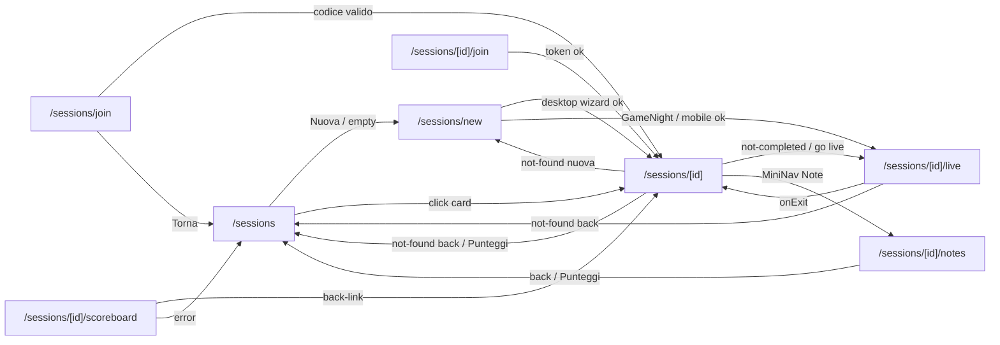

### Play records (partite registrate) & giocatori
_Route-group: `(authenticated)` · 11 pagine_

#### Tabella route

| Route | Shell | Guardie | Stati principali |
|---|---|---|---|
| `/play-records` | DesktopShell + `DashboardEngineProvider` | Nessun page-guard (solo global `AuthProvider`); Suspense per `useSearchParams('tab')`; `PlayHistory` via `next/dynamic ssr:false` (Zustand persist localStorage) | branch `tab=stats` vs lista · loading skeleton · error+Riprova · empty first-run · filtered-empty · success list/grid (+Carica altro) |
| `/play-records/new` | DesktopShell · `FormPageContainer` | Solo global `AuthProvider`; Suspense per `useSearchParams('gameNightId')`; #2348 prefill se `?gameNightId` | prefill loading · form create · submitting · error (toast, dati mantenuti) |
| `/play-records/stats` | DesktopShell | `next.config.js` redirect PERMANENTE → `/play-records?tab=stats` (route normalmente non raggiunta); solo global `AuthProvider` | loading · error (StatsHero se stale) · success |
| `/play-records/[id]` | DesktopShell | `recordId` da `useParams`; solo global `AuthProvider`; `currentUser` via `useCurrentUser`; 404 → redirect `/play-records` (AC-2.12) | loading · error/not-found · success (perspective won/tied/cooperative/inprogress/planned) · ownership creator vs spectator · foto vuota vs grid+lightbox |
| `/play-records/[id]/edit` | DesktopShell | `recordId` da `useParams`; solo global `AuthProvider`; optimistic concurrency via `xmin` → 409 dialog | loading · error · archived read-only · edit-form (K5 gate) · delete-confirm · conflict |
| `/players` | DesktopShell · `HubPageContainer` | Solo global `AuthProvider`; Suspense per `useSearchParams('state')`; `?state` override solo dev/visual-test | loading · default grid · empty · filtered-empty · error+retry |
| `/players/[id]` | DesktopShell · `DetailPageLayout` | `playerId` normalizzato (`null` → not-found); solo global `AuthProvider`; Suspense per `useSearchParams('state','tab')`; `?state` override dev/visual | loading · error+retry · not-found · default (hero+overview+connections+tabs) |
| `/players/[id]/achievements` | DesktopShell · `DetailPageContainer` | `playerId` da `useParams` (solo name/back); solo global `AuthProvider` | loading · error · empty · success grid |
| `/players/[id]/games` | DesktopShell · `DetailPageContainer` | `playerId` da `useParams` (solo name/back); solo global `AuthProvider` | loading · error · empty · success lista ranked |
| `/players/[id]/sessions` | DesktopShell · `DetailPageContainer` | `playerId` da `useParams`; `playerName` da slug per il match; solo global `AuthProvider`; early-return se `!playerId` | loading · error · empty · success lista |
| `/players/[id]/stats` | DesktopShell · `DetailPageContainer` | `playerId` da `useParams` (solo name/back); solo global `AuthProvider` | loading · error · no-data · success (StatCards + 2 breakdown) |

#### Navigazione in uscita

- **`/play-records`**
  - `/play-records -> history back (MobileHeader onBack → router.back())`
  - `/play-records -> /play-records?tab=stats (button BarChart3 rightActions → router.push)`
  - `/play-records -> modal:NewPlayRecordSheet (GradientButton sticky 'new-play-record-btn' → setSheetOpen(true))`
  - `/play-records -> /play-records/new (RecordsHero CTA Link sempre visibile + first-run empty-state Link)`
  - `/play-records -> /play-records/{record.id} (RecordCardList/RecordCardGrid onClick → router.push; card=<button>, anche nested Riprendi/Lancia bubbling)`
  - `/play-records -> /play-records/{recordId} (NewPlayRecordSheet handleSave success → router.push, dopo create+addPlayer+recordScore+updateRecord)`
  - `/play-records -> ?status=<value> (self, shareable) (PlayHistory store→URL sync router.replace scroll:false; condizione: filters.status !== 'all', altrimenti param rimosso)`
- **`/play-records/new`**
  - `/play-records/new -> /play-records (back button ArrowLeft → handleCancel → router.push)`
  - `/play-records/new -> /play-records (SessionCreateForm onCancel → handleCancel → router.push)`
  - `/play-records/new -> /play-records/{recordId} (handleSubmit success → router.push, dopo create+addPlayer[]+getRecord+recordScore[]+updateRecord location)`
- **`/play-records/stats`**
  - `/play-records/stats -> /play-records (MobileHeader onBack → router.push)`
- **`/play-records/[id]`**
  - `/play-records/[id] -> /play-records (ErrorState Link 'Torna alle partite')`
  - `/play-records/[id] -> /play-records (router.push su 404; condizione: error 404 AC-2.12)`
  - `/play-records/[id] -> /play-records/{record.id}/edit (HeroPodium CTA 'Avvia partita' onStart; condizione: SOLO heroVariant==='planned')`
  - `/play-records/[id] -> /games/{gameId} (ConnectionBar GameChip Link; condizione: record.gameId !== null, altrimenti span plain EC-2)`
  - `/play-records/[id] -> /play-records/new (Rematch CTA 'Registra rivincita'; condizione: isCompleted && !isCooperative)`
  - `/play-records/[id] -> modal:SharePlayRecordDialog (button Condividi; condizione: isCreator)`
  - `/play-records/[id] -> modal:PlayRecordHistoryDialog (button Storico; condizione: isCreator)`
  - `/play-records/[id] -> modal:PlayRecordPhotoUploadDialog (button Aggiungi foto; condizione: isCreator)`
  - `/play-records/[id] -> modal:lightbox gallery (thumbnail onClick → setOpenIndex, no route; condizione: photos.length>0; prev/next se >1)`
- **`/play-records/[id]/edit`**
  - `/play-records/[id]/edit -> /play-records (error-state back Button → router.push)`
  - `/play-records/[id]/edit -> /play-records/{recordId} (archived-state back → handleCancel → router.push)`
  - `/play-records/[id]/edit -> /play-records/{recordId} (SessionCreateForm onCancel → handleCancel → router.push)`
  - `/play-records/[id]/edit -> /play-records/{recordId} (submitUpdate success → router.push, anche via conflict overwrite success)`
  - `/play-records/[id]/edit -> /play-records (handleDelete success → router.push, dopo DELETE+invalidate)`
  - `/play-records/[id]/edit -> modal:delete-confirm (EditGateBanner onDelete → setShowDeleteConfirm(true))`
  - `/play-records/[id]/edit -> modal:PlayRecordConflictDialog (handleSubmit → 409 → setConflictForm(data))`
- **`/players`**
  - `/players -> /players/{item.id} (PlayersResultsGrid onItemClick → router.push)`
  - `/players -> pathname (self, drop ?state) (handleClearFilters → router.push(pathname); condizione: solo se stateOverride!=null)`
- **`/players/[id]`**
  - `/players/[id] -> /players (PlayerHero onBack → router.push)`
  - `/players/[id] -> /players (NotFoundShell Link CTA)`
  - `/players/[id] -> /agents (FavoriteAgentCard onClick; condizione: safeProfile.favoriteAgentName != null, doppio gate; di fatto sempre null)`
  - `/players/[id] -> /players/{id}?tab=<key> (PlayerTabs onChange → router.replace scroll:false; condizione: tab=sessions default → param rimosso)`
  - `/players/[id] -> /players/{id}/games (GamesTabPanel 'viewAll' Link; condizione: tab games && ranked.length>0)`
  - `/players/[id] -> /players/{id}/sessions (SessionsTabPanel 'viewAll' Link; condizione: tab sessions && totalSessions>0)`
  - `/players/[id] -> /players/{id}/achievements (AchievementBadgeGrid viewAllHref; condizione: tab achievements)`
  - `/players/[id] -> no-op (PlayerConnectionBar onPipClick → no-op, BE non espone conteggi)`
- **`/players/[id]/achievements`**
  - `/players/[id]/achievements -> /players/{playerId} (Back Button asChild Link 'Back to {playerName}')`
- **`/players/[id]/games`**
  - `/players/[id]/games -> /players/{playerId} (Back Button asChild Link 'Back to {playerName}')`
- **`/players/[id]/sessions`**
  - `/players/[id]/sessions -> /players/{playerId} (Back Button asChild Link 'Back to {playerName}')`
  - `/players/[id]/sessions -> /sessions/{session.id} (ogni sessione avvolta in Link, Card cliccabile)`
- **`/players/[id]/stats`**
  - `/players/[id]/stats -> /players/{playerId} (Back Button asChild Link 'Back to {playerName}')`

#### Superfici condizionali (show / hide / enable)

#### `/play-records`
- StatisticsView vs RecordsListView: `searchParams.get('tab')==='stats'` → StatisticsView, altrimenti RecordsListView — `apps/web/src/app/(authenticated)/play-records/page.tsx`
- `PlayHistory` (dynamic `ssr:false`): montato solo client-side (Zustand persist localStorage) — `apps/web/src/app/(authenticated)/play-records/page.tsx`
- RecordFilters status chips: espone solo `all/InProgress/Completed/Planned`; `?status=Archived` (valido nell'enum) → fallback silente `'all'` via `parseStatusParam` — `apps/web/src/components/play-records/PlayHistory.tsx`
- RecordFilters 4 dropdown stub (GIOCO/DATA/ESITO/SORT): placeholder statici (`DROPDOWN_OPTIONS`) senza `onClick`, non funzionali; funzionanti solo search/status chips/view-toggle — `apps/web/src/components/play-records/index/RecordFilters.tsx`
- Loading skeleton: mostrato quando `isLoading` (`usePlayHistory`) — `apps/web/src/components/play-records/PlayHistory.tsx`
- Error banner + Riprova (`window.location.reload`): `!isLoading && error` — `apps/web/src/components/play-records/PlayHistory.tsx`
- First-run empty state: `!isLoading && !error && allRecords.length===0 && !hasActiveFilters` — `apps/web/src/components/play-records/PlayHistory.tsx`
- Filter empty state + Reset filtri: `!isLoading && !error && records.length===0 && (hasActiveFilters || search)` — `apps/web/src/components/play-records/PlayHistory.tsx`
- List view vs Grid view: `view==='list'` → RecordCardList; `view==='grid'` → RecordCardGrid (toggle locale) — `apps/web/src/components/play-records/PlayHistory.tsx`
- Load more button: `hasMore (currentPage < data.totalPages)` — `apps/web/src/components/play-records/PlayHistory.tsx`
- RecordCard 'Riprendi': solo `record.status==='InProgress'` — `apps/web/src/components/play-records/index/RecordCardList.tsx`
- RecordCard 'Lancia' + opacity-82: `record.status==='Planned'` — `apps/web/src/components/play-records/index/RecordCardList.tsx`
- RecordsHero KPI: `isLoading` → 4 skeleton box; altrimenti 4 KPI (partite/vittorie/giochi/ore) da `usePlayerStatistics` interno (deferred, non blocca hero) — `apps/web/src/components/play-records/index/RecordsHero.tsx`
- NewPlayRecordSheet: `null` se `!open`; StepIndicator 0..2; back solo `step>0`; CTA 'Continua' (`step<2`) vs 'Salva' (`step==2`); next disabled se `step0 && !gameName.trim()`; input nome-libero solo se `!gameId`; winner banner solo se `winnerPlayer`; errorMsg solo su save fail — `apps/web/src/components/play-records/NewPlayRecordSheet.tsx`

#### `/play-records/new`
- Prefill skeleton: solo `gameNightId` presente && `useGameNightPrefill.isLoading` (no-op se `gameNightId` assente) — `apps/web/src/app/(authenticated)/play-records/new/page.tsx`
- SessionCreateForm `initialValues/initialPlayers`: da `prefill?.initialValues/initialPlayers` solo se `gameNightId` presente; `undefined` altrimenti — `apps/web/src/app/(authenticated)/play-records/new/page.tsx`
- SessionCreateForm `isSubmitting`: disabilita il wizard quando `createRecord.isPending || isSaving` (`isSaving` copre l'intera sequenza post-create) — `apps/web/src/app/(authenticated)/play-records/new/page.tsx`
- Layout mobile vs desktop: `useMediaQuery(max-width:768px)` → single-column; altrimenti split 8fr form + 4fr LivePreview (aside sticky classifica bozza) — `apps/web/src/components/play-records/SessionCreateForm.tsx`
- DraftAutosaveIndicator + restore draft: attivo solo `mode==='create'`; ripristina draft localStorage al mount se nessun `initialValues` (prefill ha precedenza); clamp step 0..STEP_COUNT-1 — `apps/web/src/components/play-records/SessionCreateForm.tsx`
- Step1 gameType radio (catalog/freeform): `catalog` → GameCombobox; `freeform` → Input testo libero; hint se `catalog && !watch('gameId')` — `apps/web/src/components/play-records/SessionCreateForm.tsx`
- Action bar Avanti vs Salva: `currentStep < STEP_COUNT-1` → Button `type=button` 'Avanti' (valida STEP_FIELDS + gameName step0); altrimenti Button `type=submit` 'Salva'; Cancel solo step 0 && onCancel; Back solo `step>0` — `apps/web/src/components/play-records/SessionCreateForm.tsx`
- Premature-submit guard: `handleFormSubmit` fa `nextStep()` invece di creare se `currentStep < STEP_COUNT-1` (evita record vuoto 'Planned' su re-render async) — `apps/web/src/components/play-records/SessionCreateForm.tsx`
- Step3 winner badge inline: 🏆 sul player con punteggio massimo (`winnerIdx`, solo se `p.score !== ''`) — `apps/web/src/components/play-records/SessionCreateForm.tsx`

#### `/play-records/stats`
- Range preset filter (all/30d/90d/12m): `aria-pressed` sul preset attivo; `onClick setPreset → rangeForPreset` restringe `usePlayerStatistics` (startDate) — `apps/web/src/components/play-records/StatisticsView.tsx`
- Loading skeleton: `isLoading` — `apps/web/src/components/play-records/StatisticsView.tsx`
- Error state: `!isLoading && error`; StatsHero dentro l'error solo se `stats` non-null (stale) — `apps/web/src/components/play-records/StatisticsView.tsx`
- Content (StatsHero/MostPlayedBar/WinByGameBar/TrendChart): `!isLoading && !error && stats` — `apps/web/src/components/play-records/StatisticsView.tsx`

#### `/play-records/[id]`
- LoadingSkeleton: `usePlayRecord.isLoading` — `apps/web/src/components/play-records/PlayRecordDetailView.tsx`
- ErrorState: `error || !record`; su 404 anche redirect `/play-records` — `apps/web/src/components/play-records/PlayRecordDetailView.tsx`
- isCreator toolbar (share/history/photo) + dialoghi: `currentUserId!==null && currentUserId===record.createdByUserId` — `apps/web/src/components/play-records/PlayRecordDetailBody.tsx`
- PlayRecordHeroPodium variant: won/tied/cooperative/inprogress/planned da `derivePerspective(kind)→perspectiveToHeroVariant` + override pending → planned/inprogress — `apps/web/src/components/play-records/PlayRecordDetailBody.tsx`
- HeroPodium podium vs CTA: `showPodium = variant !== 'planned'`; `showCta = variant === 'planned'` (bottone 'Avvia partita' → onStart) — `apps/web/src/components/play-records/primitives/PlayRecordHeroPodium.tsx`
- PlayRecordPhotoGallery (sempre resa, NON ownership-gated): `photos.length===0` → empty-state card dashed; altrimenti grid thumbnail + Dialog lightbox; frecce prev/next solo se `photos.length>1`; blocco OCR solo se `photo.ocrText` — `apps/web/src/components/play-records/photos/PlayRecordPhotoGallery.tsx`
- Classifica: solo se `clasificaRows.length>0`; `isCooperative` cambia layout; highlight `currentUserPlayerId` — `apps/web/src/components/play-records/PlayRecordDetailBody.tsx`
- ScoreBreakdown accordion: solo se `dimensions.length>1` (`record.scoringConfig.enabledDimensions`) — `apps/web/src/components/play-records/PlayRecordDetailBody.tsx`
- Notes section: solo se `record.notes` non vuoto — `apps/web/src/components/play-records/PlayRecordDetailBody.tsx`
- Rematch CTA section: solo `isCompleted (status==='Completed') && !isCooperative` — `apps/web/src/components/play-records/PlayRecordDetailBody.tsx`
- ConnectionBar GameChip: anchor Link `/games/{id}` solo se `gameId!==null`; altrimenti span plain (freeform, EC-2) — `apps/web/src/components/play-records/detail/ConnectionBar.tsx`
- ConnectionBar chat chip: stile 'empty' (dashed) quando `chatCount===0` (hardcoded 0 in body) — `apps/web/src/components/play-records/detail/ConnectionBar.tsx`
- ConnectionBar MVP chip: solo quando `winnerPlayerIds.length===1` — `apps/web/src/components/play-records/PlayRecordDetailBody.tsx`

#### `/play-records/[id]/edit`
- Loading skeleton: `usePlayRecord.isLoading` — `apps/web/src/app/(authenticated)/play-records/[id]/edit/page.tsx`
- Error Alert + back: `error || !record` — `apps/web/src/app/(authenticated)/play-records/[id]/edit/page.tsx`
- Archived read-only Alert: `record.status==='Archived'` (blocca l'intero form) — `apps/web/src/app/(authenticated)/play-records/[id]/edit/page.tsx`
- K5 gate readonly (`SessionCreateForm mode=edit`): Step1 gioco e Step3 giocatori/punteggi `disabled/readOnly/aria-readonly`; SOLO Step2 sessionDate/location/notes editabile; submit invia solo sessionDate/notes/location — `apps/web/src/components/play-records/SessionCreateForm.tsx`
- EditGateBanner: sempre sopra il form editabile; spiegazione K5 + CTA 'Cancella partita' (disabled se `deleteMutation.isPending`) — `apps/web/src/components/play-records/EditGateBanner.tsx`
- Delete confirmation modal: `showDeleteConfirm`; conferma disabled durante `deleteMutation.isPending` — `apps/web/src/app/(authenticated)/play-records/[id]/edit/page.tsx`
- PlayRecordConflictDialog: open quando `conflictForm!==null` (409); reload (invalidate) o overwrite (re-fetch xmin + retry) — `apps/web/src/app/(authenticated)/play-records/[id]/edit/page.tsx`
- `initialValues.gameType`: `'catalog'` se `record.gameId` presente, altrimenti `'freeform'` — `apps/web/src/app/(authenticated)/play-records/[id]/edit/page.tsx`

#### `/players`
- `?state` override hatch: `parseStateOverride` abilitato solo dev/visual-test; `VALID_OVERRIDES=loading|error|empty|filtered-empty`; `effectiveKind = stateOverride ?? realKind` — `apps/web/src/app/(authenticated)/players/_components/PlayersLibraryView.tsx`
- FSM render (loading/default/empty/filtered-empty/error): `derivePlayersUiState` su `{isLoading,isError,hasData,hasFilters,filteredCount}` — `apps/web/src/app/(authenticated)/players/_components/PlayersLibraryView.tsx`
- Visual-test fixture short-circuit: se `IS_VISUAL_TEST_BUILD`: `stateOverride==='empty'` → items `[]`; altrimenti `tryLoadVisualTestFixture('default')` (DCE in prod) — `apps/web/src/app/(authenticated)/players/_components/PlayersLibraryView.tsx`
- PlayersFiltersInline clear button: `hasPlayersFilters({search})` (search non vuoto) — `apps/web/src/app/(authenticated)/players/_components/PlayersLibraryView.tsx`
- EmptyPlayers CTA per kind: `empty` → CTA INERTE (`onCtaClick undefined`); `filtered-empty` → `onClearFilters`; `error` → `onRetry` (`statsQuery.refetch`, nessuna route) — `apps/web/src/components/features/players/EmptyPlayers.tsx`
- cardSubtitle/cardOpenAriaLabel: letti da `intl.messages` raw (bypass parse ICU `{count}`/`{gameName}`) — sostituiti via `String.replace` nella grid — `apps/web/src/app/(authenticated)/players/_components/PlayersLibraryView.tsx`

#### `/players/[id]`
- FSM (loading/error/not-found/default): `derivePlayerDetailUiState` su `{playerId,isLoading,isError,hasData}`; `playerId===null` → not-found; `effectiveKind = stateOverride ?? realKind` — `apps/web/src/app/(authenticated)/players/[id]/_components/PlayerDetailView.tsx`
- Visual-test fixture short-circuit: `IS_VISUAL_TEST_BUILD && override!=='not-found'` → `tryLoadVisualTestFixture('default')` (fixture ha priorità; DCE in prod) — `apps/web/src/app/(authenticated)/players/[id]/_components/PlayerDetailView.tsx`
- Tab attivo (sessions/games/toolkits/achievements): `parseTabFromUrl('tab')` default `'sessions'`; switch monta il panel corrispondente (role=tabpanel) — `apps/web/src/app/(authenticated)/players/[id]/_components/PlayerDetailView.tsx`
- PlayerTabs count badge: solo se `counts[key]>0` (toolkits sempre 0) — `apps/web/src/app/(authenticated)/players/[id]/_components/PlayerTabs.tsx`
- GamesTabPanel empty vs list: `ranked.length===0` → empty; altrimenti lista + Link viewAll — `apps/web/src/app/(authenticated)/players/[id]/_components/GamesTabPanel.tsx`
- SessionsTabPanel empty vs count: `totalSessions===0` → empty; altrimenti conteggio + Link viewAll — `apps/web/src/app/(authenticated)/players/[id]/_components/SessionsTabPanel.tsx`
- ToolkitsTabPanel: sempre placeholder 'coming soon' (BE non espone toolkit per-player) — `apps/web/src/app/(authenticated)/players/[id]/_components/ToolkitsTabPanel.tsx`
- FavoriteAgentCard onClick: wired solo se `favoriteAgentName != null` (gate in PlayerDetailView E ri-gate in PlayerOverviewRegion) — `apps/web/src/app/(authenticated)/players/[id]/_components/PlayerOverviewRegion.tsx`
- PlayerConnectionBar pips (6, game/session/event/agent/toolkit/chat): pip 1 game (`gameCount===0` isEmpty) e pip 2 session (`totalSessions===0` isEmpty) con count reale; pip 3-6 sempre `isEmpty=true` (BE non espone conteggi) — `apps/web/src/app/(authenticated)/players/[id]/_components/PlayerConnectionBar.tsx`
- achievementCount: `useAchievements().data.filter(isUnlocked).length`; graceful 0 se loading/error — `apps/web/src/app/(authenticated)/players/[id]/_components/PlayerDetailView.tsx`

#### `/players/[id]/achievements`
- Loading skeleton: `loading` (`useEffect api.badges.getMyBadges`) — `apps/web/src/app/(authenticated)/players/[id]/achievements/page.tsx`
- Error Alert: `error && !loading` — `apps/web/src/app/(authenticated)/players/[id]/achievements/page.tsx`
- Badge count Badge (header): `!loading && badges.length>0` — `apps/web/src/app/(authenticated)/players/[id]/achievements/page.tsx`
- Empty vs grid: `!loading && !error`: `badges.length===0` → Card empty; altrimenti grid — `apps/web/src/app/(authenticated)/players/[id]/achievements/page.tsx`
- Badge icon: `badge.iconUrl` → ``; altrimenti fallback Star icon — `apps/web/src/app/(authenticated)/players/[id]/achievements/page.tsx`
- Tier color class: `TIER_COLORS[badge.tier]` (Bronze/Silver/Gold/Platinum/Diamond) — `apps/web/src/app/(authenticated)/players/[id]/achievements/page.tsx`

#### `/players/[id]/games`
- Loading skeleton: `usePlayerStatistics.isLoading` — `apps/web/src/app/(authenticated)/players/[id]/games/page.tsx`
- Error Alert: `error` — `apps/web/src/app/(authenticated)/players/[id]/games/page.tsx`
- Empty vs lista: `!isLoading && !error`: `games.length===0` → Card empty; altrimenti Card con lista — `apps/web/src/app/(authenticated)/players/[id]/games/page.tsx`
- avgScore suffix: per riga solo se `game.avgScore !== null` (da `averageScoresByGame`) — `apps/web/src/app/(authenticated)/players/[id]/games/page.tsx`

#### `/players/[id]/sessions`
- Loading skeleton: `loading` (`api.sessions.getHistory limit 50`) — `apps/web/src/app/(authenticated)/players/[id]/sessions/page.tsx`
- Error Card: `error && !loading` — `apps/web/src/app/(authenticated)/players/[id]/sessions/page.tsx`
- Session count Badge (header): `!loading && sessions.length>0` — `apps/web/src/app/(authenticated)/players/[id]/sessions/page.tsx`
- Empty vs lista: `!loading && !error`: `sessions.length===0` → Card empty; altrimenti lista — `apps/web/src/app/(authenticated)/players/[id]/sessions/page.tsx`
- Filtro sessioni per player: `s.players.some(p.playerName match case-insensitive)` con `playerName` da slug — `apps/web/src/app/(authenticated)/players/[id]/sessions/page.tsx`
- isWinner Trophy icon: `session.winnerName` match `playerName` (case-insensitive) — `apps/web/src/app/(authenticated)/players/[id]/sessions/page.tsx`
- Status Badge color: `STATUS_COLORS[session.status]` (Completed/InProgress/Paused/Abandoned/Setup) — `apps/web/src/app/(authenticated)/players/[id]/sessions/page.tsx`
- Winner CardContent: solo se `session.winnerName || playerEntry?.color`; testo winner solo se `winnerName` — `apps/web/src/app/(authenticated)/players/[id]/sessions/page.tsx`

#### `/players/[id]/stats`
- Loading skeleton: `usePlayerStatistics.isLoading` — `apps/web/src/app/(authenticated)/players/[id]/stats/page.tsx`
- Error Alert: `error` — `apps/web/src/app/(authenticated)/players/[id]/stats/page.tsx`
- Stats content (StatCards + breakdown): `!isLoading && !error && stats` — `apps/web/src/app/(authenticated)/players/[id]/stats/page.tsx`
- No-data Card: `!isLoading && !error && !stats` — `apps/web/src/app/(authenticated)/players/[id]/stats/page.tsx`
- Sessions-by-game list vs Alert: `gamePlayCounts` non vuoto → lista; altrimenti Alert 'No sessions recorded' — `apps/web/src/app/(authenticated)/players/[id]/stats/page.tsx`
- Average-scores list vs Alert: `averageScoresByGame` non vuoto → lista; altrimenti Alert 'No score data recorded' — `apps/web/src/app/(authenticated)/players/[id]/stats/page.tsx`
- winRate calc: `totalSessions>0` → `round(totalWins/totalSessions*100)`; altrimenti 0 — `apps/web/src/app/(authenticated)/players/[id]/stats/page.tsx`

#### Componenti → file

| Componente | File | Ruolo |
|---|---|---|
| PlayHistory | `apps/web/src/components/play-records/PlayHistory.tsx` | Lista partite: FSM loading/error/empty/filtered/list-grid + URL↔store sync status + load-more |
| RecordsHero | `apps/web/src/components/play-records/index/RecordsHero.tsx` | Hero 4 KPI + CTA Link `/play-records/new` |
| RecordFilters | `apps/web/src/components/play-records/index/RecordFilters.tsx` | Barra filtri sticky (search/status chips/4 dropdown stub/view toggle) |
| RecordCardList / RecordCardGrid | `apps/web/src/components/play-records/index/RecordCardList.tsx` · `.../RecordCardGrid.tsx` | Card (button → detail), OutcomeBadge, resume/launch condizionali |
| NewPlayRecordSheet | `apps/web/src/components/play-records/NewPlayRecordSheet.tsx` | Bottom-sheet 3-step create (gioco/giocatori/riepilogo) → detail |
| SessionCreateForm | `apps/web/src/components/play-records/SessionCreateForm.tsx` | Wizard 3-step responsive create/edit + draft autosave + K5 gate + LivePreview |
| GameCombobox | `apps/web/src/components/play-records/GameCombobox.tsx` | Picker gioco da libreria/catalogo |
| DraftAutosaveIndicator | `apps/web/src/components/play-records/DraftAutosaveIndicator.tsx` | Indicatore salvataggio bozza (solo create) |
| StatisticsView | `apps/web/src/components/play-records/StatisticsView.tsx` | Corpo stats condiviso (inline `?tab=stats` + route standalone) |
| StatsHero / MostPlayedBar / WinByGameBar / TrendChart | `apps/web/src/components/play-records/stats/*` | KPI 4-col · top 5 giochi · win-rate per gioco · trend (recharts) |
| PlayRecordDetailView | `apps/web/src/components/play-records/PlayRecordDetailView.tsx` | Wrapper hooks + loading/error/404-redirect + currentUser |
| PlayRecordDetailBody | `apps/web/src/components/play-records/PlayRecordDetailBody.tsx` | Composizione prop-driven riusabile (share-token public) |
| PlayRecordHeroPodium | `apps/web/src/components/play-records/primitives/PlayRecordHeroPodium.tsx` | Hero podium 5-varianti; CTA start→edit solo variante planned |
| ConnectionBar (detail) | `apps/web/src/components/play-records/detail/ConnectionBar.tsx` | Chip entity-tinted game/player/chat/date/MVP (game anchor condizionale) |
| Classifica / KpiGrid / ScoreBreakdown | `apps/web/src/components/play-records/detail/*` | Classifica giocatori · KPI · accordion breakdown multi-dim |
| PlayRecordPhotoGallery | `apps/web/src/components/play-records/photos/PlayRecordPhotoGallery.tsx` | Gallery foto sempre resa (empty + grid + lightbox Dialog) |
| SharePlayRecordDialog / PlayRecordHistoryDialog / PlayRecordPhotoUploadDialog | `apps/web/src/components/play-records/*` · `.../photos/*` | Modali creator-only: condivisione · storico · upload foto |
| EditGateBanner | `apps/web/src/components/play-records/EditGateBanner.tsx` | Banner K5 + CTA delete |
| PlayRecordConflictDialog | `apps/web/src/components/play-records/PlayRecordConflictDialog.tsx` | Dialog conflitto ottimistico (reload/overwrite) |
| usePlayRecords (create/update/delete/get) | `apps/web/src/lib/domain-hooks/usePlayRecords.ts` | Mutation/query record + invalidazione cache |
| useGameNightPrefill | `apps/web/src/lib/domain-hooks/useGameNightPrefill.ts` | Prefill form da GameNight completata (`?gameNightId`) |
| PlayersLibraryView | `apps/web/src/app/(authenticated)/players/_components/PlayersLibraryView.tsx` | Orchestrator Tier S: single hook + FSM 5-state + search locale |
| PlayersHero / PlayersFiltersInline / PlayersResultsGrid / EmptyPlayers | `apps/web/src/components/features/players/*` | Hero · search inline · griglia (click→detail) · stati terminali |
| PlayerDetailView | `apps/web/src/app/(authenticated)/players/[id]/_components/PlayerDetailView.tsx` | Orchestrator Tier M: FSM 4-state + mapStatsToProfile + tab URL state |
| DetailPageLayout | `apps/web/src/components/ui/detail-layout/index.ts` | Layout primitivo hero/connections/tabs/children |
| PlayerHero / PlayerOverviewRegion / PlayerConnectionBar / PlayerTabs | `apps/web/src/app/(authenticated)/players/[id]/_components/*` · `features/player-detail/*` | Hero+KPI · overview stats · 6-pip bar · tablist WAI-ARIA |
| SessionsTabPanel / GamesTabPanel / ToolkitsTabPanel / AchievementBadgeGrid | `apps/web/src/app/(authenticated)/players/[id]/_components/*` · `features/player-detail/*` | Tab → viewAll subroute (toolkits placeholder) |
| usePlayerStatistics / useAchievements | `apps/web/src/hooks/queries/usePlayersFromRecords.ts` | Unico hook dati player (plays-as-players v1, current user) + count achievement |
| MobileHeader | `apps/web/src/components/ui/navigation/MobileHeader.tsx` | Header mobile con back + rightActions |

#### Diagramma navigazione interna

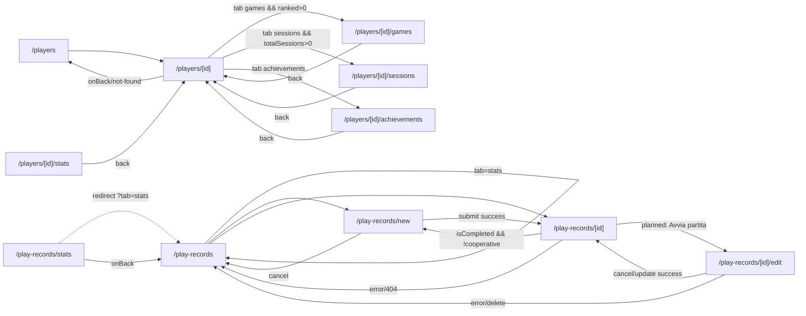

### Agenti AI (user) & Editor proposte agente (minRole editor)
_Route-group: `(authenticated)` · 7 pagine_

#### Tabella route

| Route | Shell | Guardie | Stati principali |
|---|---|---|---|
| `/agents` | `DesktopShell` → `UserShellClient`; `AgentsLibraryView` bare `<div flex flex-col gap-6 pb-24>` (no PageContainer) + `AgentCreationSheet` Sheet globale | Nessuna guardia esplicita: authOnly demandato allo shell (voce nav `agents` authOnly ma la pagina non verifica il ruolo → ogni utente autenticato). Side-effect `recentsStore.push(section-agents)` on mount | loading · empty · filtered-empty · error · default (grid) · (dev/visual) override `?state=` |
| `/agents/[id]` | `DesktopShell` → `UserShellClient`; `AgentDetailView` hero+tabs, tab-panel in `<DetailPageContainer>`; segment error boundary `error.tsx` | Thin shell, nessuna guardia di ruolo; `agentId` normalizzato string\|null (mai `'undefined'`); `useAgent` gated da `!!agentId`; agentId null → FSM `not-found` | loading · error · not-found · default · knowledge (standalone/loading/error/empty/success) · history · performance · settings (editable/read-only) · segment error boundary |
| `/editor` | `DesktopShell` → `UserShellClient`; `RequireRole(['Admin','Editor'])`+Suspense, `EditorClient` lazy in `<HubPageContainer p-6>`; fallback → `<main>` nudo | `RequireRole` client-side (redirect `/login?from=` o `/`, bypass superadmin) **+** `canUseEditor` early-returns ridondanti (`!user`/`!permessi`/`!gameId`); lock esclusivo #2055 (init/release + sendBeacon) | auth-check loading · dynamic loading · redirect · fallback !user/!permessi/!gameId · rulespec loading · editor (rich/json) · saving · error · conflict (modal) |
| `/editor/agent-proposals` | `DesktopShell` → `UserShellClient`; server component (metadata) → `ProposalsClient` in `<HubPageContainer p-6>` | `EditorAuthGuard` inline (`useAuth`+`canUseEditor`): pannello **Access Denied in-place, NO redirect**; concede superadmin/admin/editor, nega user/creator | auth loading · unauthorized (Access Denied) · list loading · error · empty · default · filtered-empty (incl. Pending/Rejected no-op) |
| `/editor/agent-proposals/create` | `DesktopShell` → `UserShellClient`; `<FormPageContainer p-6>` | **Nessuna guardia** (stub statico "Feature Removed"; raggiungibile anche da non-editor) | static (feature removed) |
| `/editor/agent-proposals/[id]/edit` | `DesktopShell` → `UserShellClient`; `<FormPageContainer p-6>` | **Nessuna guardia** (stub statico; param `[id]` non letto) | static (feature removed) |
| `/editor/agent-proposals/[id]/test` | `DesktopShell` → `UserShellClient`; `<HubPageContainer p-6>` | `EditorAuthGuard` inline (`canUseEditor`), ma ⚠️ avvolge SOLO il ramo success: `loading` e `not-found` resi **PRIMA** del guard → visibili anche senza autorizzazione | loading (pre-guard) · not-found (pre-guard) · unauthorized · empty chat · default (sandbox) · testing · submitting |

#### Navigazione in uscita

- **`/agents`**
  - `-> /agents/{id}` (Link su ogni MeepleCard agent in `AgentsResultsGrid`; solo se `effectiveKind==='default'`)
  - `-> drawer:AgentCreationSheet` (CTA hero "Crea Agente" `AgentsHero.onCreateAgent`; nessun cambio route)
  - `-> drawer:AgentCreationSheet` (CTA empty-state `EmptyAgents.onCtaClick`; SOLO kind `empty` — `filtered-empty`→clearFilters, `error`→retry)
  - `-> /chat/{threadId}` (submit success `AgentCreationSheet` → `useCreateAgentFlow.onSuccess`; creazione agente riuscita)
- **`/agents/[id]`**
  - `-> /agents` (CTA back `AgentHero.ctaBack`; anche `NotFoundShell` e `error.tsx` linkano `/agents`)
  - `-> /chat/new?agentId={agentId}` (CTA hero "Play"; solo `variant==='active'`, #2199)
  - `-> /library/{gameId}/play/setup-wizard` (CTA hero "Setup" banner draft; solo `variant==='draft'` && `gameId` presente)
  - `-> /agents/{agentId}/unarchive` (CTA hero "Unarchive" banner archived; solo `variant==='archived'`) ⚠️ **ROUTE ORFANA → 404**
  - `-> /agents/{agentId}/archive` (`AgentDangerZone` Archive; solo `variant==='active'` + tab settings) ⚠️ **ROUTE ORFANA → 404**
  - `-> navigator.share` (CTA hero "Share"; bottone sempre reso, `navigator.share` solo se disponibile, altrimenti no-op)
- **`/editor`**
  - `-> /versions?gameId={gameId}` (Link "Storico Versioni"; editor caricato)
  - `-> /` (Link "Home" header + "Torna alla home" negli early-return)
  - `-> modal:ConflictResolutionModal` (`open={showConflictModal}`; conflitto ottimistico al save; nessun cambio route)
- **`/editor/agent-proposals`**
  - `-> /editor/agent-proposals/create` (CTA "Create Proposal" `handleCreate`)
  - `-> /admin/agent-definitions/{id}` ("View" su riga `ProposalsTable.handleView`; per ogni proposta — cross-nav verso superficie **ADMIN**)
- **`/editor/agent-proposals/create`**
  - `-> /editor/agent-proposals` (CTA "Back to Proposals")
- **`/editor/agent-proposals/[id]/edit`**
  - `-> /editor/agent-proposals` (CTA "Back to Proposals")
- **`/editor/agent-proposals/[id]/test`**
  - `-> /editor/agent-proposals` (CTA "Back" `handleBack`; anche submit success → toast + push)
  - `-> /editor/agent-proposals/{id}/edit` (CTA "Edit Proposal" `handleEdit`; destinazione ora stub "Feature Removed")

#### Superfici condizionali (show / hide / enable)

##### `/agents`
- `AgentsResultsGrid` vs `EmptyAgents` (FSM 5 stati): `effectiveKind==='default'` → `AgentsResultsGrid`; altrimenti `EmptyAgents`. `realKind`: `loading` se `agentsQuery.isLoading && fixtureAgents==null`; `error` se `isError`; `empty` se `agents.length===0`; `filtered-empty` se `filtered.length===0`; else `default`. `effectiveKind = stateOverride ?? realKind` — `apps/web/src/app/(authenticated)/agents/_components/AgentsLibraryView.tsx`
- `EmptyAgents` (4 kind): `loading` → 6 skeleton desktop / 3 mobile (aria-busy); `empty` → 🤖 + CTA create (role=status); `filtered-empty` → 🔎 + CTA clearFilters (role=status); `error` → ⚠️ + CTA retry (role=alert); mai `default` — `apps/web/src/components/features/agents/EmptyAgents.tsx`
- `?state=` URL override: attivo SOLO se `STATE_OVERRIDE_ENABLED` (`NODE_ENV!=='production'` || `IS_VISUAL_TEST_BUILD`); valori `loading|empty|filtered-empty|error` sovrascrivono `realKind`; in produzione disabilitato — `apps/web/src/app/(authenticated)/agents/_components/AgentsLibraryView.tsx`
- `fixtureAgents` (visual-test short-circuit): caricati SOLO se `IS_VISUAL_TEST_BUILD===true` (bypassano la query reale); `agents = fixtureAgents ?? agentsQuery.data ?? []` — `apps/web/src/app/(authenticated)/agents/_components/AgentsLibraryView.tsx`
- `handleClearFilters`: resetta `query=''` e `status='all'` (sort preservato); se `stateOverride!=null` fa `router.push(pathname)` per rimuovere `?state=` — `apps/web/src/app/(authenticated)/agents/_components/AgentsLibraryView.tsx`
- `AgentFilters`: search `<input type=search>` debounce trailing 300ms (clear × immediato, bypassa debounce); status `role=tablist` 4 tab (all/attivo/in-setup/archiviato) roving tabindex; sort `<select>` (recent/alpha/used); resultCount live — `apps/web/src/components/features/agents/AgentFilters.tsx`
- `AgentCreationSheet` (Sheet side=right, 480px desktop / bottom-sheet mobile): montato sempre, open solo se `creationSheetOpen===true`. Su `/agents` montato bare (`isOpen/onClose`) → `skipGameSelection/skipKBUpload=false`, nessun `initialGameId/initialDocumentIds`: i rami read-only sono **codice morto** qui — `apps/web/src/components/agent/config/AgentCreationSheet.tsx`
- `AgentCreationSheet` › 4 sezioni collassabili (Gioco/Knowledge Base/Configura Agente/Costi & Slot): toggle expand/collapse (`expandedSections`, tutte true default; Chevron + aria-expanded) — `apps/web/src/components/agent/config/AgentCreationSheet.tsx`
- `AgentCreationSheet` › sezione Gioco: `skipGameSelection===true` → badge blu read-only; altrimenti `<GameSelector>` (se selezionato && !in collezione → banner amber "verrà aggiunto"; se in collezione → banner verde). Su `/agents` sempre ramo GameSelector — `apps/web/src/components/agent/config/AgentCreationSheet.tsx`
- `AgentCreationSheet` › sezione Knowledge Base: `skipKBUpload && initialDocumentIds.length>0` → riepilogo KB read-only verde; altrimenti drop-zone PDF (opacity-50 + pointer-events-none se `!selectedGameId` + hint). Su `/agents` sempre drop-zone — `apps/web/src/components/agent/config/AgentCreationSheet.tsx`
- `AgentCreationSheet` › sezione Configura Agente: input Nome (maxLength 100, placeholder "Esperto di {gameTitle}") + TypologySelector + StrategySelector + ModelSelector; tutti disabled durante `isCreating` — `apps/web/src/components/agent/config/AgentCreationSheet.tsx`
- `AgentCreationSheet` › sezione Costi & Slot: reso solo se `slotsData` presente. Barra: `available===0` rossa / `===1` amber / else verde; `available===0` banner rosso "Nessuno slot disponibile", `===1` "Ultimo slot disponibile!"; + `<CostPreview>` — `apps/web/src/components/agent/config/AgentCreationSheet.tsx`
- `AgentCreationSheet` › footer: "Crea e Inizia Chat" disabled a meno che `canCreate = selectedGameId!=null && hasAvailableSlots && !isCreating` (durante `isCreating` spinner "Creazione..."); "Annulla" e X disabled durante `isCreating` (`handleClose` blocca se creating e resetta il form) — `apps/web/src/components/agent/config/AgentCreationSheet.tsx`
- `AgentCreationSheet` › file upload item: stato per-file uploading (barra %)/processing (spinner "Elaborazione...")/completed (check verde)/error (AlertCircle rosso); solo PDF; bottone Rimuovi (Trash2) — `apps/web/src/components/agent/config/AgentCreationSheet.tsx`

##### `/agents/[id]`
- FSM shell (`deriveAgentDetailUiState`): `loading` → LoadingShell (aria-busy); `error` → ErrorShell (`onRetry=refetch`); `not-found` → NotFoundShell (agentId null O data assente); `default` → hero+tabs. `realKind` bypassato a `default` quando `fixture!=null`; `effectiveKind = stateOverride ?? realKind` — `apps/web/src/app/(authenticated)/agents/[id]/_components/AgentDetailView.tsx`
- `?state=` URL override: attivo solo se `NODE_ENV!=='production'` || `IS_VISUAL_TEST_BUILD`; valori `loading|error|not-found` sovrascrivono `realKind` — `apps/web/src/app/(authenticated)/agents/[id]/_components/AgentDetailView.tsx`
- visual fixture short-circuit: caricata solo se `IS_VISUAL_TEST_BUILD && stateOverride==null`; `?fixture=standalone` → fixture `standalone`, altrimenti `default`; `agentData = fixture ?? agentQuery.data ?? null` — `apps/web/src/app/(authenticated)/agents/[id]/_components/AgentDetailView.tsx`
- `AgentHero` CTA matrix (`deriveAgentVariant`): Play solo se `variant==='active' && ctaPlay`; Setup solo banner draft && `gameId`; Unarchive solo banner archived; Share SEMPRE reso; Back se `ctaBack`. CTA assenti → bottone NON reso (no placeholder disabled) — `apps/web/src/components/features/agent-detail/AgentHero.tsx`
- `AgentTabs` — tab bloccati: `performance` e `history` `locked=true` se `variant==='draft'`. Tab locked = `<button disabled>` (opacity-55 + 🔒) escluso dalla keyboard nav (`orderedKeys` filtra `!locked`); onClick no-op — `apps/web/src/components/features/agent-detail/AgentTabs.tsx`
- Body pannello performance/history (fallback lock): `isDraft` → `LockedTabPanel` (🔒); non raggiungibile in draft perché il tab è disabled — fallback difensivo — `apps/web/src/app/(authenticated)/agents/[id]/_components/AgentDetailView.tsx`
- Sub-hook Knowledge (`useAgentKbDocs` + `KbDocList`): `kbEnabled = !!agentId && isSuccess && data!=null && data.gameId!=null && tab==='knowledge'`; se `gameId==null` → `{kind:'standalone'}` senza query; altrimenti loading/error/empty/success — `apps/web/src/app/(authenticated)/agents/[id]/_components/AgentDetailView.tsx`
- Sub-hook History (`useAgentThreads` + `ChatHistoryTimeline`): `threadsEnabled = !!agentId && isSuccess && data!=null && tab==='history'` → loading/error/empty/success; in draft il tab è locked (timeline non montata) — `apps/web/src/app/(authenticated)/agents/[id]/_components/AgentDetailView.tsx`
- Sub-hook Settings (`useAgentConfig` + `AgentSettingsForm`): `configEnabled = ... && tab==='settings'`; `isArchived` → read-only (`archived`); `!gameId` → read-only (`standalone`); else editable. `onSave`: no-op se pending; se `!gameId` → `toast.error`; altrimenti `updateConfig.mutate` (form attualmente display-only, edit follow-up #2727) — `apps/web/src/app/(authenticated)/agents/[id]/_components/AgentDetailView.tsx`
- `AgentDangerZone`: HARD-GUARD, ritorna `null` per ogni `variant!=='active'` (`AgentDangerZone.tsx:51`); reso solo active + tab settings; `onArchive` → `/agents/{id}/archive` [orfana] — `apps/web/src/components/features/agent-detail/AgentDangerZone.tsx`
- Body pannello performance (non-draft): `invocationCount>0` → "{n} invocazioni totali", altrimenti label empty — `apps/web/src/app/(authenticated)/agents/[id]/_components/AgentDetailView.tsx`

##### `/editor`
- `RequireRole` gate: loading → spinner "Verifica autorizzazioni..."; unauth → `replace('/login?from='+pathname)`; ruolo insufficiente → `replace('/')`; solo se autorizzato renderizza i children — `apps/web/src/components/auth/RequireRole.tsx`
- `EditorClient` early-returns (container `<main>` nudo): ordine 1) `!user` → schermata accesso; 2) `user && !canUseEditor(role)` → schermata permessi; 3) `!gameId` → "Specifica un gameId"; ognuna con link "Torna alla home" — `apps/web/src/app/(authenticated)/editor/editor-client.tsx`
- `isLoading` (dentro `HubPageContainer`, NON early-return): con user+ruolo+gameId validi si entra nel container (header "Game: <id>" + link Storico/Home già visibili); body `<p>Caricamento...</p>` poi editor+preview — `apps/web/src/app/(authenticated)/editor/editor-client.tsx`
- ViewMode toggle rich/json: `rich` → `RichTextEditor` + preview `dangerouslySetInnerHTML(sanitizeHtml)`; `json` → `<textarea>` + `RuleSpecPreview`; Undo/Redo SOLO in `json` — `apps/web/src/app/(authenticated)/editor/editor-client.tsx`
- Bottone Salva: disabled a meno che `isValid && !isSaving && hasUnsavedChanges`; label "Salvataggio..."/"Salva Ora"/"Salvato"; `handleSave` rifiuta se `!isValid`, `!gameId`, o `!hasLock` — `apps/web/src/app/(authenticated)/editor/editor-client.tsx`
- Undo / Redo: Undo disabled se `!canUndo` (`historyIndex<=0`); Redo disabled se `!canRedo` (`historyIndex>=history.length-1`); solo viewMode json — `apps/web/src/app/(authenticated)/editor/editor-client.tsx`
- Autosave (debounce 2s): `useDebounce(content,2000)` → scatta se `hasUnsavedChanges && isValid && debouncedContent`; successo → statusMessage auto-clear dopo 3s; fallimento auto-save **silenzioso** (nessun banner) — `apps/web/src/app/(authenticated)/editor/editor-client.tsx`
- `PresenceIndicator`: riflette `lockStatus/acquisitionStatus/lockError` da `RuleSpecLockStore` — `apps/web/src/components/editor/`
- Banner status/error + indicatore modifiche: `statusMessage` → banner verde (auto-clear 3s SOLO su auto-save); `errorMessage` → banner rosso; `hasUnsavedChanges` → "• Modifiche non salvate" arancione; banner validazione verde/rosso su `isValid` — `apps/web/src/app/(authenticated)/editor/editor-client.tsx`
- Preview panel: `isValid` && contenuto → rich HTML sanitizzato / json `RuleSpecPreview`; altrimenti "Correggi gli errori per visualizzare l'anteprima" — `apps/web/src/app/(authenticated)/editor/editor-client.tsx`
- `ConflictResolutionModal`: open solo se `showConflictModal`; `onResolve('local'|'remote'|'merge')` → aggiorna stato locale; se `choice!=='remote'` salva via `updateRuleSpecWithETag`; se `remote` aggiorna solo l'ETag — `apps/web/src/components/editor/`

##### `/editor/agent-proposals`
- `EditorAuthGuard`: `authLoading` → "Loading..."; `!user || !canUseEditor(role)` → pannello "Access Denied" (in-place, no redirect); else header + CTA + `ProposalsList` — `apps/web/src/app/(authenticated)/editor/agent-proposals/client.tsx`
- `ProposalsList` (query stato): `isLoading` → skeleton (pulse h-12 + h-64); `error` → box rosso "Failed to load proposals"; `proposals.length===0` → empty "No proposals yet"; else `ProposalsFilters` + `ProposalsTable` — `apps/web/src/app/(authenticated)/editor/agent-proposals/_components/ProposalsList.tsx`
- `ProposalsFilters` + logica filtro: 5 bottoni status (all/Draft/PendingReview label "Pending"/Approved/Rejected) + search, MA `matchesStatus` mappa SOLO `all`, `Approved↔isActive`, `Draft↔!isActive`: selezionare **Pending o Rejected non matcha nulla → tabella vuota**; search filtra name/description (case-insensitive) — `apps/web/src/app/(authenticated)/editor/agent-proposals/_components/ProposalsFilters.tsx`
- `ProposalsTable`: post-filtro vuoto → "No definitions match your filters"; `StatusBadge = isActive ? 'Approved' : 'Draft'`; ogni riga name/description/strategy/created/updated + sola azione "View" → `/admin/agent-definitions/{id}` — `apps/web/src/app/(authenticated)/editor/agent-proposals/_components/ProposalsTable.tsx`

##### `/editor/agent-proposals/create`
- Contenuto statico: nessuna superficie condizionale; rende sempre "Feature Removed" (typology proposals sostituite da Agent Definitions gestite dagli admin) + bottone ritorno — `apps/web/src/app/(authenticated)/editor/agent-proposals/create/page.tsx`

##### `/editor/agent-proposals/[id]/edit`
- Contenuto statico: nessuna superficie condizionale; rende sempre "Feature Removed" + bottone ritorno (il fratello `/test` linka comunque qui con "Edit Proposal", ma è uno stub) — `apps/web/src/app/(authenticated)/editor/agent-proposals/[id]/edit/page.tsx`

##### `/editor/agent-proposals/[id]/test`
- Stato loading (pre-guard): `authLoading || isLoading` → "Loading..." reso PRIMA di `EditorAuthGuard` — `apps/web/src/app/(authenticated)/editor/agent-proposals/[id]/test/page.tsx`
- Stato not-found/error (pre-guard): `error || !typology` → "Proposal Not Found" reso PRIMA di `EditorAuthGuard` (messaggio = `error.message` se disponibile) — `apps/web/src/app/(authenticated)/editor/agent-proposals/[id]/test/page.tsx`
- `EditorAuthGuard`: loading → "Loading..."; `!user || !canUseEditor(role)` → "Access Denied"; else contenuto sandbox — `apps/web/src/app/(authenticated)/editor/agent-proposals/[id]/test/page.tsx`
- Area messaggi chat: `messages.length===0` → "No messages yet / Send a test question to start"; else bubble (user destra / assistant sinistra); `testMutation.isPending` → bubble spinner; `confidenceScore` mostrato solo se `!==undefined` — `apps/web/src/app/(authenticated)/editor/agent-proposals/[id]/test/page.tsx`
- Input Send + sample questions: Send disabled se `!inputValue.trim() || testMutation.isPending`; input disabled durante pending; 4 bottoni sample-question disabled durante pending (onClick riempie l'input) — `apps/web/src/app/(authenticated)/editor/agent-proposals/[id]/test/page.tsx`
- Bottone "Submit for Approval": disabled se `submitMutation.isPending`; onClick apre `confirm()` NATIVO → `submitForApproval` (Draft→PendingReview) → invalida query + `toast.success` + redirect; onError → `toast.error` — `apps/web/src/app/(authenticated)/editor/agent-proposals/[id]/test/page.tsx`

#### Componenti → file

| Componente | File | Ruolo |
|---|---|---|
| `AgentsPage` (thin shell) | `apps/web/src/app/(authenticated)/agents/page.tsx` | Wrapper client: monta `AgentsLibraryView` + `AgentCreationSheet`; side-effect recents on mount |
| `AgentsLibraryView` | `apps/web/src/app/(authenticated)/agents/_components/AgentsLibraryView.tsx` | Orchestratore: `useAgents({})` + pipeline filter/match/sort/stats + FSM 5 stati + `?state=` override + fixture visual-test + clearFilters |
| `AgentsHero` | `apps/web/src/components/features/agents/AgentsHero.tsx` | Hero puro (eyebrow+title+subtitle+4 stat) con CTA "Crea Agente" |
| `AgentFilters` | `apps/web/src/components/features/agents/AgentFilters.tsx` | Search debounced 300ms + status tablist + sort select + result count |
| `AgentsResultsGrid` | `apps/web/src/components/features/agents/AgentsResultsGrid.tsx` | Grid CSS auto-fit di `MeepleCard(entity='agent',variant='grid')` in `<Link href=/agents/{id}>`; nessun prop `connections` |
| `EmptyAgents` | `apps/web/src/components/features/agents/EmptyAgents.tsx` | Superfici loading/empty/filtered-empty/error con CTA differenziate (create/clear/retry) |
| `AgentCreationSheet` | `apps/web/src/components/agent/config/AgentCreationSheet.tsx` | Wizard single-page 4 sezioni collassabili (Gioco→KB→Config→Costi) in Sheet; `useCreateAgentFlow` → redirect `/chat/{threadId}` |
| `AgentPage` (thin shell) | `apps/web/src/app/(authenticated)/agents/[id]/page.tsx` | Normalizza `agentId` string\|null da `useParams` e delega ad `AgentDetailView` |
| `AgentDetailView` | `apps/web/src/app/(authenticated)/agents/[id]/_components/AgentDetailView.tsx` | Orchestratore: FSM 5 stati, variant matrix, 4 sub-hook tab-gated, mapper discriminated union, wiring hero/tabs/panels/danger-zone |
| `AgentHero` (detail) | `apps/web/src/components/features/agent-detail/AgentHero.tsx` | Hero con badge variant + banner draft/archived + CTA back/play/setup/unarchive/share |
| `AgentTabs` | `apps/web/src/components/features/agent-detail/AgentTabs.tsx` | Tablist 5 tab (identity/knowledge/performance/history/settings); tab locked = disabled + esclusi da keyboard nav |
| `AgentDangerZone` | `apps/web/src/components/features/agent-detail/AgentDangerZone.tsx` | Sezione archive; ritorna `null` se `variant!=='active'` |
| `AgentDetailError` | `apps/web/src/app/(authenticated)/agents/[id]/error.tsx` | Segment error boundary: card "Errore dettaglio agente" + Riprova (reset) + link `/agents` |
| `EditorPage` (guard shell) | `apps/web/src/app/(authenticated)/editor/page.tsx` | `RequireRole(['Admin','Editor'])` + Suspense + dynamic import `EditorClient` (#2245) |
| `EditorClient` | `apps/web/src/app/(authenticated)/editor/editor-client.tsx` | Editor RuleSpec: rich/json, autosave debounce 2s, undo/redo, lock ottimistico ETag, conflitti, validazione, preview |
| `RequireRole` | `apps/web/src/components/auth/RequireRole.tsx` | Gate ruolo client-side (`getCurrentUser`) con redirect `/login?from` + `/` e bypass superadmin |
| `RuleSpecLockStore` | `apps/web/src/stores/RuleSpecLockStore.ts` | Zustand store lock/conflitto/ETag (#2055) |
| `EditorProposalsPage` | `apps/web/src/app/(authenticated)/editor/agent-proposals/page.tsx` | Server component: metadata + delega a `ProposalsClient` |
| `ProposalsClient` | `apps/web/src/app/(authenticated)/editor/agent-proposals/client.tsx` | `EditorAuthGuard` (`useAuth`) + header + CTA Create + `ProposalsList` |
| `ProposalsList` | `apps/web/src/app/(authenticated)/editor/agent-proposals/_components/ProposalsList.tsx` | Query `getMyProposals` + stati loading/error/empty + filtro client-side |
| `ProposalsTable` | `apps/web/src/app/(authenticated)/editor/agent-proposals/_components/ProposalsTable.tsx` | Righe `AgentDefinitionDto` con `StatusBadge` + azione View → `/admin/agent-definitions/{id}` |
| `ProposalsFilters` / `StatusBadge` | `apps/web/src/app/(authenticated)/editor/agent-proposals/_components/` | Filtri status/search + badge stato (Approved/Draft) |
| `CreateProposalPage` | `apps/web/src/app/(authenticated)/editor/agent-proposals/create/page.tsx` | Stub statico "Feature Removed" + "Back to Proposals" |
| `EditProposalPage` | `apps/web/src/app/(authenticated)/editor/agent-proposals/[id]/edit/page.tsx` | Stub statico "Feature Removed" + "Back to Proposals" |
| `TestSandboxPage` / `EditorAuthGuard` (inline) | `apps/web/src/app/(authenticated)/editor/agent-proposals/[id]/test/page.tsx` | Sandbox chat per testare tipologia Draft (test + submit for approval); guard inline `canUseEditor` |
| `agentTypologiesApi` | `apps/web/src/lib/api/agent-typologies.api.ts` | Client API: `getById` / `test` / `submitForApproval` / `getMyProposals` |

#### Navigazione interna al cluster

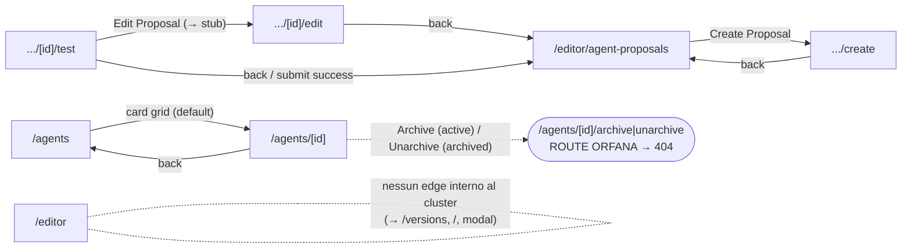

### Toolkit di gioco (sessioni tool, storico, template, stats)
_Route-group: `(authenticated)` · 8 pagine_

#### Tabella route

| Route | Shell | Guardie | Stati principali |
|---|---|---|---|
| `/toolkit` | DesktopShell (chrome AppTopBar/MobileTopBar + MiniNavSlot + MobileBottomBar; `HubLayout`) | Nessuna guardia di pagina né di layout (`'use client'` senza `useAuth`/redirect); nessun `middleware.ts`; protezione demandata alle API (401) | static-placeholder (nessun fetch, empty-state "🛠️ Toolkit in arrivo") |
| `/toolkit/history` | DesktopShell + `HubPageContainer` (wrapper full-height gradient) | Server wrapper `export const dynamic = 'force-dynamic'`; nessuna guardia auth di pagina | loading (spinner) · empty ("No sessions found") · populated (griglia card) |
| `/toolkit/play` | DesktopShell | Nessuna guardia auth; client autonomo, nessun fetch | single interactive state (nessun loading/empty/error) |
| `/toolkit/stats` | DesktopShell | Server wrapper `export const dynamic = 'force-dynamic'`; nessuna guardia auth di pagina | loading (spinner) · empty/no-data · success (KPI + grafici) |
| `/toolkit/templates` | DesktopShell | Nessuna guardia auth; client | loading · empty ("No approved templates found.") · populated (griglia) |
| `/toolkit/[sessionId]` | DesktopShell (esterno) + `SessionToolLayout` (full-height: header sticky + ToolRail/bottom-nav + main `aria-live`) | `<Suspense>` (per `useSearchParams`); `Error('Session ID is required')` se manca `sessionId`; nessuna guardia auth esplicita; `loadSession` fail → `toast.error` + redirect `/toolkit` | loading (spinner full-screen) · error (box rosso) · default (ToolRail + tool attivo) |
| `/toolkits` | DesktopShell + `<Suspense fallback={null}>` | Suspense (`useSearchParams` indiretto); nessuna guardia auth; route canonica SP4 (legacy `/hub/toolkits` redirige qui) | loading (12 SkeletonCard) · error (Retry) · default-populated (griglia) · empty-filtered |
| `/toolkits/[id]` | DesktopShell + `DetailPageLayout` (primitive #1112) | Async server + `<Suspense fallback={null}>` (SSR opt-out); nessuna guardia auth; variant own/public da `viewerContext.isOwner` | loading (skeleton) · error (Retry) · not-found (🔍) · default (hero + connections + tabs + footer) |

#### Navigazione in uscita

- **`/toolkit/history`**
  - `/toolkit/history -> /toolkit` (Button "Start Your First Session" → `router.push('/toolkit')`; solo empty-state `sessions.length===0`)
  - `/toolkit/history -> modal:SessionDetailModal` (Button "View Details" → `setSelectedSession` + `setIsModalOpen(true)`, overlay Dialog; non cambia route; per ogni card)
- **`/toolkit/[sessionId]`**
  - `/toolkit/[sessionId] -> /toolkit` (`router.push('/toolkit')` nel catch di `loadSession`; quando il caricamento sessione fallisce, `toast.error` + push)
  - `/toolkit/[sessionId] -> ?tool=<toolId>` (stessa route; `handleToolSelect` → `setActiveTool` + `router.replace('?tool=<id>', {scroll:false})`; al click di un tab della ToolRail)
  - `/toolkit/[sessionId] -> completeSession()` (SessionHeader `onFinalize` → `handleFinalize` → `completeSession()`; nessun cambio route in questo file; al finalize)
- **`/toolkits`**
  - `/toolkits -> trackEvent('hub_card_clicked')` (click/Enter/Space su card → `handleCardClick`; **solo analytics, NON naviga a `/toolkits/[id]`**, nessun Link/`router.push`)
  - `/toolkits -> trackEvent('hub_install_clicked')` (bottone "Installa" hover, `stopPropagation` → `handleInstall`; solo analytics, nessuna installazione/navigazione)
  - `/toolkits -> query.refetch()` (Retry in ErrorState → `handleRetry`; in stato error)
- **`/toolkits/[id]`**
  - `/toolkits/[id] -> ?tab=<key>` (stessa route; `ToolkitTabs onChange` → `handleTabChange` → `setActiveTab` + `router.replace('?tab=')`, rimuove `?tab` se overview; su tab abilitato overview/tools)
  - `/toolkits/[id] -> pathname` (rimozione `?tab`; `useEffect` di normalizzazione → `router.replace(pathname)`; quando `?tab` è invalido/disabilitato → forzato a overview)
  - `/toolkits/[id] -> clipboard.writeText(window.location.href)` (bottone "Share" + trackEvent; solo variant `public`, copia URL, no navigazione)
  - `/toolkits/[id] -> query.refetch()` (Retry; in stato error)

> Le route `/toolkit`, `/toolkit/play`, `/toolkit/stats`, `/toolkit/templates` non hanno edge di navigazione in uscita.

#### Superfici condizionali (show / hide / enable)

##### `/toolkit`
- **MiniNavSlot (tab strip contestuale)**: NON registrato su questa route — convenzione #2158 (MiniNavSlot solo per navigazione multi-tab reale ≥2 alternative; un singolo tab "Toolkit" duplicherebbe la voce AppTopBar) → `apps/web/src/components/layout/UserShell/MiniNavSlot.tsx`
- **HubLayout search input ("Cerca tool...")**: reso perché `showSearch` default=true, ma INERTE — la pagina non passa `onSearchChange`/`searchValue`, digitare non filtra → `apps/web/src/components/layout/HubLayout/HubLayout.tsx`
- **HubLayout view-mode toggle (griglia/lista/carosello)**: reso perché `showViewToggle=true`, ma INERTE — `onViewModeChange` non passato, i 3 bottoni cambiano solo `aria-pressed` senza effetto sul contenuto → `apps/web/src/components/layout/HubLayout/HubLayout.tsx`
- **HubLayout filter chips**: nessun chip — `filterChips` non passato, blocco non renderizzato → `apps/web/src/components/layout/HubLayout/HubLayout.tsx`

##### `/toolkit/history`
- **Card "Loading sessions..." (Loader2)**: solo se `isLoading` (useQuery `['session-history', gameFilter, startDate, endDate]` → `api.sessions.getHistory({gameId,startDate,endDate,limit:20})`) → `apps/web/src/app/(authenticated)/toolkit/history/client.tsx`
- **Empty-state Card + "Start Your First Session"**: solo se `!isLoading && sessions.length===0` → `apps/web/src/app/(authenticated)/toolkit/history/client.tsx`
- **Griglia Card sessione**: solo se `sessions.length>0` → `apps/web/src/app/(authenticated)/toolkit/history/client.tsx`
- **`session.gameIcon` / `session.gameName`**: gameIcon reso solo se presente; gameName fallback "Generic Session". Dal mapping né gameIcon né gameName sono valorizzati → gameIcon sempre nascosto, titolo sempre "Generic Session" → `apps/web/src/app/(authenticated)/toolkit/history/client.tsx`
- **Badge stato sessione**: `variant='default'` se `status==='Finalized'`, altrimenti `variant='secondary'` (mapping API 'Completed'→'Finalized') → `apps/web/src/app/(authenticated)/toolkit/history/client.tsx`
- **SessionDetailModal**: montato solo se `selectedSession !== null`, apertura via `isModalOpen`. Call-site passa SOLO `session` (no scoreboard/participants) → `displayScoreboard` = mock vuoto e sezione "Participants" MAI mostrata → `apps/web/src/components/session/SessionDetailModal.tsx`
- **Select filtro Game**: solo opzione hardcoded "All games" (`value='all'`); selezionandola `gameId='all'` letterale (filtro spurio, non "tutti"); nessuna opzione per singolo gioco → `apps/web/src/app/(authenticated)/toolkit/history/client.tsx`
- **Filtri Start/End date + Reset**: input `type=date` alimentano la queryKey; Reset azzera i 3 filtri → `apps/web/src/app/(authenticated)/toolkit/history/client.tsx`

##### `/toolkit/play`
- **Sezione Timer**: solo se `DEFAULT_TOOLKIT.timers.length > 0` → `apps/web/src/app/(authenticated)/toolkit/play/page.tsx`
- **Sezione Cronologia/Log**: solo se `log.length > 0` (ultime 50 voci via `prev.slice(-49)`, ordine inverso) → `apps/web/src/app/(authenticated)/toolkit/play/page.tsx`
- **`entry.actorLabel` nel log**: mostrato per una voce solo se `actorLabel` presente (input "Chi gioca?", maxLength 30) → `apps/web/src/app/(authenticated)/toolkit/play/page.tsx`

> Nota: Dadi/Contatori/Randomizzatore sono sempre renderizzati; solo Timer e Log sono condizionali.

##### `/toolkit/stats`
- **Spinner loading**: solo se `isLoading` (useQuery `['session-statistics']` → `api.sessionStatistics.getStatistics(12)`) → `apps/web/src/app/(authenticated)/toolkit/stats/client.tsx`
- **Empty-state analytics**: solo se `!data` (query risolta senza dati) → `apps/web/src/app/(authenticated)/toolkit/stats/client.tsx`
- **Sezione "Most Played Games"**: solo se `data.mostPlayedGames.length > 0` → `apps/web/src/app/(authenticated)/toolkit/stats/client.tsx`
- **Grafico "Monthly Activity" (barre)**: solo se `data.monthlyActivity.length > 0` (altezza normalizzata su `maxMonthly=max(sessionCount,1)`) → `apps/web/src/app/(authenticated)/toolkit/stats/client.tsx`
- **Sezione "Recent Scores"**: solo se `data.recentScoreTrends.length > 0` (primi 10) → `apps/web/src/app/(authenticated)/toolkit/stats/client.tsx`

##### `/toolkit/templates`
- **"Loading templates..."**: solo se `isLoading` (useQuery `['toolkit-templates', category]` → `api.gameToolkit.getApprovedTemplates(category==='All'?undefined:category)`) → `apps/web/src/app/(authenticated)/toolkit/templates/page.tsx`
- **"No approved templates found."**: solo se `!isLoading && templates?.length===0` → `apps/web/src/app/(authenticated)/toolkit/templates/page.tsx`
- **Badge categoria (TemplateCard)**: solo se `template.stateTemplate?.category` presente → `apps/web/src/app/(authenticated)/toolkit/templates/page.tsx`
- **Descrizione template (TemplateCard)**: solo se `template.stateTemplate?.description` presente (`line-clamp-2`) → `apps/web/src/app/(authenticated)/toolkit/templates/page.tsx`
- **Badge conteggio tool (dice/cards/timers/counters)**: ogni badge solo se il rispettivo array > 0; se `toolCount===0` mostra "No tools configured" → `apps/web/src/app/(authenticated)/toolkit/templates/page.tsx`
- **Bottone "Use This Template"**: sempre DISABLED (`disabled` + `title='Coming soon'`); `handleClone` no-op (clone modal non implementato) → onClick non scatta → `apps/web/src/app/(authenticated)/toolkit/templates/page.tsx`
- **Select filtro categoria**: opzioni fisse All/Strategy/Party/CardGames/Cooperative; `onValueChange(setCategory)` rifà la query → `apps/web/src/app/(authenticated)/toolkit/templates/page.tsx`

##### `/toolkit/[sessionId]`
- **`onPause` su SessionHeader**: passato solo se `activeSession.status==='InProgress'`, altrimenti `undefined` (bottone pausa nascosto) → `apps/web/src/app/(authenticated)/toolkit/[sessionId]/_content.tsx`
- **ToolRail base-tool visibility (tutti e 5 SEMPRE)**: il rail mostra SEMPRE i 5 base tool (scoreboard/turn-order/dice/whiteboard/camera); `SessionToolLayout` passa `BASE_TOOLS` intero, `visibleBaseToolIds` NON è passato al rail → gli override-flag del GameToolkit non nascondono voci dal rail → `apps/web/src/components/session/SessionToolLayout.tsx`
- **Gating render CONTENUTO tool (`visibleBaseToolIds`)**: `visibleBaseToolIds` (da `resolveSessionTools(useGameToolkit(gameId))`) gate SOLO il ramo switch del contenuto; `overridesScoreboard/TurnOrder/DiceSet` rimuovono dal set (whiteboard mai). Edge: se scoreboard è overridden e attivo, il FALLBACK finale rende comunque `<Scoreboard>` → override scoreboard = no-op visivo → `apps/web/src/app/(authenticated)/toolkit/[sessionId]/_content.tsx`
- **Tool "scoreboard"**: se `activeTool==='scoreboard' && visibleBaseToolIds.has('scoreboard')`; `isRealTime={isConnected}` (SSE) → `apps/web/src/app/(authenticated)/toolkit/[sessionId]/_content.tsx`
- **Tool "turn-order"**: se `activeTool==='turn-order' && visibleBaseToolIds.has('turn-order')`; `isHost={isCurrentUserOwner}` → solo l'host può advance/reset → `apps/web/src/app/(authenticated)/toolkit/[sessionId]/_content.tsx`
- **Tool "dice"**: se `activeTool==='dice' && visibleBaseToolIds.has('dice')`; `disabled={diceRoller.isRolling}` → `apps/web/src/app/(authenticated)/toolkit/[sessionId]/_content.tsx`
- **Tool "whiteboard"**: se `activeTool==='whiteboard'`; NON overridabile (nessun check su `visibleBaseToolIds`) → `apps/web/src/app/(authenticated)/toolkit/[sessionId]/_content.tsx`
- **TurnIndicatorBar "End Turn"**: abilitato solo con `canEndTurn={!!turnOrder && !isAdvancing}`; `onEndTurn` → `handleAdvanceTurn` → `advanceTurn()` + toast → `apps/web/src/app/(authenticated)/toolkit/[sessionId]/_content.tsx`
- **Custom tool: CounterToolContent**: se `activeTool` inizia con `custom-counter-<idx>` e `toolkit.counterTools[idx]` esiste → `apps/web/src/app/(authenticated)/toolkit/[sessionId]/_content.tsx`
- **Custom tool: ToolkitDiceRoller**: se `activeTool` inizia con `custom-dice-<idx>` e `toolkit.diceTools[idx]` esiste (customFaces o sides da diceType) → `apps/web/src/app/(authenticated)/toolkit/[sessionId]/_content.tsx`
- **Custom tool: ToolkitTimer**: se `activeTool` inizia con `custom-timer-<idx>` e `toolkit.timerTools[idx]` esiste (countup/turn/countdown) → `apps/web/src/app/(authenticated)/toolkit/[sessionId]/_content.tsx`
- **Custom tool: CardDeckTool**: se `activeTool` inizia con `custom-card-<idx>` e `toolkit.cardTools[idx]` esiste (cards da cardCount, `reshuffleOnEmpty=allowReturnToDeck`) → `apps/web/src/app/(authenticated)/toolkit/[sessionId]/_content.tsx`
- **CustomToolPlaceholder ("Custom tool — coming soon")**: per custom tool riconosciuto ma di tipo non implementato → `apps/web/src/app/(authenticated)/toolkit/[sessionId]/_content.tsx`
- **Fallback Scoreboard**: quando nessun ramo dello switch matcha `activeTool` (include il caso "camera" e i base tool overridden) → `apps/web/src/app/(authenticated)/toolkit/[sessionId]/_content.tsx`
- **Sezione "Custom" nella ToolRail**: solo se `customTools.length > 0` (separatore + tablist custom; solo side-rail desktop) → `apps/web/src/components/session/ToolRail.tsx`
- **ToolRail desktop side-rail vs mobile bottom-nav**: aside side-rail `md+` (`hidden md:flex`, collassabile `w-14/w-48`); bottom-nav solo `<md` (`md:hidden`) mostra `tools.slice(0,5)` = i 5 base tool (mai i custom) → `apps/web/src/components/session/ToolRail.tsx`
- **Toast SSE (score +N, paused, resumed, finalized, connection error)**: emessi da `useSessionSync` sugli eventi SSE; `toast.success` su score-update solo se il participant è in `participants` → `apps/web/src/app/(authenticated)/toolkit/[sessionId]/_content.tsx`

##### `/toolkits`
- **HubFilters (ricerca + status tabs + sort)**: nascosto quando `state==='error'` (guard `!isError`) → `apps/web/src/components/features/toolkits-index/HubToolkitsBody.tsx`
- **Griglia SkeletonCard (12 desktop / 6 compact)**: quando `!isError && isLoading` → `apps/web/src/components/features/toolkits-index/HubToolkitsBody.tsx`
- **HubEmptyFiltered**: quando `!isError && !isLoading && toolkits.length===0` (reset → `query=''`, `status='all'`, `sort='popular'`) → `apps/web/src/components/features/toolkits-index/HubEmptyFiltered.tsx`
- **Griglia HubToolkitCardGrid**: quando `!isError && !isLoading && toolkits.length>0` → `apps/web/src/components/features/toolkits-index/HubToolkitsBody.tsx`
- **ErrorState**: quando `state==='error'` → `apps/web/src/components/features/toolkits-index/ErrorState.tsx`
- **Filtro status featured/top/new**: `featured = ratingAverage>=4`; `top = ratingAverage>=4.5 && ratingCount>=5`; `'new'` ritorna TUTTI (P83 deferred: RecommendedToolkit v1 senza `createdAt`); `'all'` = tutti → `apps/web/src/app/(authenticated)/toolkits/page.tsx`
- **Card cover img vs emoji**: `` se presente, altrimenti emoji fallback (`coverEmoji ?? '🧰'`) → `apps/web/src/components/features/toolkits-index/HubToolkitCardGrid.tsx`
- **Card badge overlay / rating / version / gameName / toolCount·useCount**: badge overlay se `toolkit.badge`; rating solo se `ratingAverage!==null` (`v{version}.0` solo se version definito); chip gioco se `gameName` altrimenti fallback italico; blocco toolCount/useCount solo se almeno uno definito (P83: attualmente sempre undefined → nascosti); badge "Toolkit" + install-count pill sempre presenti → `apps/web/src/components/features/toolkits-index/HubToolkitCardGrid.tsx`
- **Bottone install hover sulla card**: visibile su `group-hover/focus` (opacity 0→100, translate-y); `onClick` `stopPropagation` (non triggera il card click) → `apps/web/src/components/features/toolkits-index/HubToolkitCardGrid.tsx`

##### `/toolkits/[id]`
- **Skeleton loading shell**: quando `query.isLoading` (`role=status`) → `apps/web/src/app/(authenticated)/toolkits/[id]/_components/ToolkitDetailView.tsx`
- **Error shell + Retry**: quando `query.isError` (`role=alert`) → `apps/web/src/app/(authenticated)/toolkits/[id]/_components/ToolkitDetailView.tsx`
- **Not-found shell**: quando `!payload` → `apps/web/src/app/(authenticated)/toolkits/[id]/_components/ToolkitDetailView.tsx`
- **Footer azioni — variant "own"**: se `viewerContext.isOwner`: "Edit" e "Publish", entrambi DISABLED (`title=disabledTooltip`); `onClick=trackEvent` non scatta (button disabled) → `apps/web/src/app/(authenticated)/toolkits/[id]/_components/ToolkitDetailView.tsx`
- **Footer azioni — variant "public"**: se `!isOwner`: "Install" (DISABLED, onClick trackEvent non scatta) + "Share" (ABILITATO, copia URL + trackEvent) → `apps/web/src/app/(authenticated)/toolkits/[id]/_components/ToolkitDetailView.tsx`
- **Tab abilitati vs disabilitati**: `overview` + `tools` sempre abilitati; `agent/kb/versions/ratings` disabled-shell (`aria-disabled`, badge "P5", `tabIndex -1`); click su disabilitato → `onDisabledAttempt` (trackEvent) senza cambiare `activeTab`; keyboard nav itera solo il subset enabled → `apps/web/src/app/(authenticated)/toolkits/[id]/_components/ToolkitTabs.tsx`
- **Count pill sui tab**: solo se `counts?.[key]!==undefined && >0` (tools=toolsCount, kb=kbDocsCount) → `apps/web/src/app/(authenticated)/toolkits/[id]/_components/ToolkitTabs.tsx`
- **OverviewTabPanel**: `hidden` a meno che `activeTab==='overview'` → `apps/web/src/app/(authenticated)/toolkits/[id]/_components/OverviewTabPanel.tsx`
- **ToolsTabPanel**: `hidden` a meno che `activeTab==='tools'`; riceve `toolsCount` → `apps/web/src/app/(authenticated)/toolkits/[id]/_components/ToolsTabPanel.tsx`
- **DisabledTabPanel (agent/kb/versions/ratings)**: reso per ogni DISABLED_TAB, `hidden` a meno che `activeTab===key` → `apps/web/src/app/(authenticated)/toolkits/[id]/_components/DisabledTabPanel.tsx`
- **ToolkitConnectionBar pips**: pip "tools" (`count=toolsCount`) e "game" (`count=gameName`) cablati; agent/kb/author/sessions placeholder senza count (Phase-5), NON navigano → `apps/web/src/app/(authenticated)/toolkits/[id]/_components/ToolkitConnectionBar.tsx`
- **Tab initial state**: `activeTab` iniziale = `parseTab(?tab)`; se tra i DISABLED → forzato a `DEFAULT_TAB` (overview) → `apps/web/src/app/(authenticated)/toolkits/[id]/_components/ToolkitDetailView.tsx`

#### Componenti → file

| Componente | File | Ruolo |
|---|---|---|
| HubLayout | `apps/web/src/components/layout/HubLayout/HubLayout.tsx` | Wrapper hub (ricerca + toggle vista + chips + children); su `/toolkit` solo contenitore dell'empty-state |
| ToolkitHistoryPage (client) | `apps/web/src/app/(authenticated)/toolkit/history/client.tsx` | Orchestratore storico: fetch, filtri (game/startDate/endDate), griglia card, apertura modal |
| SessionDetailModal | `apps/web/src/components/session/SessionDetailModal.tsx` | Dialog metadata sessione + scoreboard finale (mock vuoto qui) + lista partecipanti (solo se passati) |
| HubPageContainer | `apps/web/src/components/layout/PageContainer` | Container larghezza hub per header + filtri + lista |
| DiceRoller / Timer / CounterTool / Randomizer | `apps/web/src/components/toolkit/{DiceRoller,Timer,CounterTool,Randomizer}.tsx` | Strumenti offline play → `addLog(...)` (nessuna API) |
| SessionStatsPage (client) | `apps/web/src/app/(authenticated)/toolkit/stats/client.tsx` | KPI cards + Most Played + Monthly bar chart + Recent Scores (read-only, 12 mesi) |
| ToolkitTemplatesPage / TemplateCard | `apps/web/src/app/(authenticated)/toolkit/templates/page.tsx` | Catalogo template approvati: filtro categoria + griglia; card con CTA "Use This Template" congelata |
| ActiveSessionPageContent | `apps/web/src/app/(authenticated)/toolkit/[sessionId]/_content.tsx` | Orchestratore sessione live: store, SSE, turn-order, dice, whiteboard, toolkit custom, sync URL↔store |
| SessionToolLayout | `apps/web/src/components/session/SessionToolLayout.tsx` | Layout full-height: header sticky + ToolRail(`[...BASE_TOOLS,...customTools]`) + main tool attivo |
| ToolRail | `apps/web/src/components/session/ToolRail.tsx` | Navigazione strumenti (5 base + custom); tablist WCAG, side-rail desktop collassabile / bottom-nav mobile (primi 5) |
| SessionHeader / TurnIndicatorBar | `apps/web/src/components/session` | Header sessione (pause condizionale/finalize) + barra turno (End Turn condizionale → advance) |
| HubToolkitsContent | `apps/web/src/app/(authenticated)/toolkits/page.tsx` | Fetch `useDiscoverRecommendedToolkits(limit 50)`, filtro/sort/KPI FE-side, mapping card, FSM |
| HubToolkitsBody | `apps/web/src/components/features/toolkits-index/HubToolkitsBody.tsx` | Compositore: Hero + Filters + (Grid \| Skeleton \| EmptyFiltered \| ErrorState) |
| HubToolkitCardGrid | `apps/web/src/components/features/toolkits-index/HubToolkitCardGrid.tsx` | Card singolo toolkit (cover, badge, rating, gameName, install button hover) |
| ToolkitDetailView | `apps/web/src/app/(authenticated)/toolkits/[id]/_components/ToolkitDetailView.tsx` | Orchestratore Tier S: `useToolkitDetail`, tab SSOT su URL, FSM 4-stati, variant own/public, footer azioni |
| DetailPageLayout | `apps/web/src/components/ui/detail-layout` | Primitive layout dettaglio (hero + connections + tabs + footer + children) |
| ToolkitTabs | `apps/web/src/app/(authenticated)/toolkits/[id]/_components/ToolkitTabs.tsx` | Tablist 6 tab con disabled-shell (Phase-5); keyboard nav solo su enabled subset |
| ToolkitConnectionBar | `apps/web/src/app/(authenticated)/toolkits/[id]/_components/ToolkitConnectionBar.tsx` | Barra pip connessioni cross-entity (2 cablati + 4 placeholder Phase-5) |

#### Diagramma navigazione interna

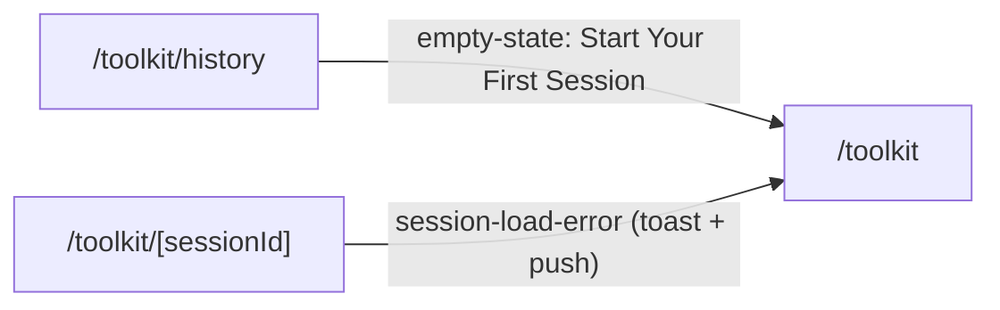

> Note: `/toolkits` NON linka a `/toolkits/[id]` (card/install = solo `trackEvent`, edge di dettaglio non cablato). Edge intra-route omessi dal diagramma: `/toolkit/[sessionId] → ?tool=<id>`, `/toolkits/[id] → ?tab=<key>` (query param, stessa route); `/toolkit/history → SessionDetailModal` è un overlay Dialog, non un cambio route.

### Knowledge Base utente, gamebook, upload, n8n, pipeline-builder
_Route-group: `(authenticated)` · 10 pagine_

#### Tabella route

| Route | Shell | Guardie | Stati principali |
|---|---|---|---|
| `/kb/[id]` | `(authenticated)` → UserShell → DesktopShell (mai renderizzato: redirect server-side) | Nessuna guardia di ruolo; `dynamic='force-static'`; async server component che chiama `redirect()` dopo `await params` | redirect-only |
| `/knowledge-base` | idem (mai renderizzato: server redirect) | Nessuna; server component (non-async) → `redirect('/library')` incondizionato | redirect-only |
| `/knowledge-base/[id]` | `(authenticated)` → UserShell → DesktopShell + split-view proprio `min-h-screen` (aside sticky sx + main dx) | Nessuna guardia di ruolo (client component); accesso protetto solo dal gruppo `(authenticated)`; doc non-accessibile = stato error (non redirect) | loading · error/not-found · ready (split-view) · chunks loading/error/empty/list · preview empty/loading/error/ready · search-active |
| `/knowledge-base/[id]/pdf` | `(authenticated)` → UserShell → DesktopShell | Nessuna; client component placeholder (TODO stub) | placeholder 'Coming Soon' → auto-redirect ~2s |
| `/knowledge-base/global` | `(authenticated)` → UserShell → DesktopShell; thin Suspense (fallback null) → KbGlobaleView (URL SSOT) | Nessuna; Suspense richiesto perché KbGlobaleView usa `useSearchParams()` | home (loading/empty-no-CTA/error/list) · results (loading/empty/error/list/loadingMore) · viewer overlay (ready-only) · ask drawer (idle/streaming/completed/empty/error) · editor overlay (owned-only) |
| `/gamebook` | `(authenticated)` → UserShell → DesktopShell; thin Suspense (fallback PageFallback) → GamebookIndexView; HubPageContainer | Nessuna; metadata title 'I tuoi manuali \| MeepleAI' | loading · error · empty · default · quota-soft · quota-hard · fixture-override (dev/E2E) |
| `/gamebook/upload` | `(authenticated)` → UserShell → DesktopShell; thin Suspense (fallback null) → GamebookUploadView; DetailPageContainer | Nessuna guardia di pagina; `showBggIntegration = isAdminOrAbove && !isAdminLoading` (BGG admin-only) | 14-cell FSM: step1-default/searching/no-results/bgg-loading · step2-ready/capturing/low-light/failed/denied · step3-progress/partial/complete/offline/cancel-modal · wizard-cancelled · fixture-mode |
| `/upload` | `(authenticated)` → UserShell → DesktopShell; page client wrapper RequireRole → UploadClient (lazy `next/dynamic`); DetailPageContainer | RequireRole `['Admin','Editor']` (+superadmin inherit) client-side; `!auth`→`/login?from=`, ruolo insufficiente→`/`; NON esiste `middleware.ts` (difesa = RequireRole + backend 403) | auth-check · unauthorized→redirect · dynamic-loading · authLoading · step upload/parse/review/publish · error (upload/wizard) |
| `/n8n` | `(authenticated)` → UserShell → DesktopShell; HubPageContainer | NESSUNA guardia client-side (no RequireRole) benché chiami endpoint admin `/admin/n8n`; autorizzazione delegata al backend (403→stato error) | loading · error · empty · list (config cards) · form (create/edit) |
| `/pipeline-builder` | `(authenticated)` → UserShell → DesktopShell; server component Suspense (fallback PipelineBuilderSkeleton) → PipelineBuilder; `h-[calc(100vh-4rem)]` | Nessuna; metadata title 'Pipeline Builder \| MeepleAI' | skeleton · default-pipeline-created · node-selected (config) · edge-selected (config) · nessuna-selezione (placeholder) · test-tab · pannelli collassati/espansi |

#### Navigazione in uscita

- **`/kb/[id]`**
  - `/kb/[id]` -> `/knowledge-base/[id]` (redirect() server-side; sempre, id via `encodeURIComponent(id)`)
- **`/knowledge-base`**
  - `/knowledge-base` -> `/library` (redirect() server-side; sempre)
- **`/knowledge-base/[id]`**
  - `/knowledge-base/[id]` -> `/library` (Link ghost 'Torna alla Libreria' top-bar; stato ready)
  - `/knowledge-base/[id]` -> `/library` (Link 'Torna alla Libreria' stato error; `isError || !data`)
- **`/knowledge-base/[id]/pdf`**
  - `/knowledge-base/[id]/pdf` -> `/knowledge-base/[id]` (`router.replace` in `setTimeout 2000ms`; auto-redirect incondizionato ~2s dopo mount)
- **`/knowledge-base/global`**
  - `/knowledge-base/global` -> `/knowledge-base/global?q=<query>[&mode=]` (HeroSearch onSubmit → pushUrl; submit ricerca, 'Semantic' default omesso)
  - `/knowledge-base/global` -> `/knowledge-base/global` (HeroSearch onClear → clearUrl; clear ricerca)
  - `/knowledge-base/global` -> `/knowledge-base/global?docId=&page=[&chunkId=]` (onResultClick / onCitationClick → openViewer; apre PDF viewer overlay)
  - `/knowledge-base/global` -> `/knowledge-base/global?docId=&edit=1` (KbHomeDesktop onEditClick; branch home, Modifica su doc owned)
  - `/knowledge-base/global` -> overlay KbDocViewerDesktopLazy (presenza `?docId=` + `status==='ready'`; 'locked' NON monta)
  - `/knowledge-base/global` -> drawer DrawerShellLazy 'Ask the Meeple' (presenza `?ask=1`)
  - `/knowledge-base/global` -> overlay KbEditorDesktopLazy (presenza `?edit=1` + doc owned, `editTargetDto != null`)
  - `/knowledge-base/global` -> `/library` (DrawerShell onEmptyCta; SOLO dal drawer Ask quando libreria vuota — la home NON naviga)
- **`/gamebook`**
  - `/gamebook` -> `/gamebook/upload` (GamebookHero CTA / EmptyGamebooks onAddManualClick; loading/error/empty/default, NON isHardLimit)
  - `/gamebook` -> modal CheckoutModal (Hero CTA rebind / QuotaWidget onUpgradeClick / SoftWarningCredits onUpgrade; `isHardLimit` o upgrade — `initialStep=1` se hard, altrimenti 2)
  - `/gamebook` -> `/library/[gameId]/play` (GamebookCard onClick; solo `status==='ready'`, usa `gameId` — `/gamebook/[id]` mai implementato #865)
- **`/gamebook/upload`**
  - `/gamebook/upload` -> `?step=2&gameId=<id>` (handleGameSelect; selezione gioco Step 1)
  - `/gamebook/upload` -> `?step=3&batchId=<id>` (uploadMutation onSuccess, scroll:false; upload foto riuscito)
  - `/gamebook/upload` -> `?tab=bgg` (handleTabChange / handleSearchBgg, `router.replace`; cambio tab, BGG solo admin)
  - `/gamebook/upload` -> `?q=<query>` (handleQueryChange / handleCreateNew / handleAddPrivate, `router.replace`; ricerca o azioni NoResults)
  - `/gamebook/upload` -> `/gamebook` (handleCancelConfirm; annulla wizard, abort upload + CANCEL reducer + stop camera)
- **`/upload`**
  - `/upload` -> `/login?from=<path>` (RequireRole `router.replace`; non autenticato o eccezione in getCurrentUser())
  - `/upload` -> `/` (RequireRole `router.replace`; autenticato ma ruolo non Admin/Editor/superadmin)
  - `/upload` -> `/` (Link '← Back to Home'; sempre, header UploadClient)
  - `/upload` -> `/admin/knowledge-base/queue?flow=embedding&gameId=&gameName=&documentId=` (Link 'Vai alla Queue →', step publish; `isAdminOrAbove && confirmedGameId`)
  - `/upload` -> `/editor?gameId=<id>` (Link 'Edit in RuleSpec Editor', step publish; `gameId = ruleSpec.gameId ?? confirmedGameId ?? ''`)
  - `/upload` -> `window.open(pdf.logUrl, _blank)` (PdfTable onOpenLog; `pdf.logUrl` presente)
- **`/n8n`**
  - `/n8n` -> `/` (Link 'Back to Home'; sempre header, anche stato error)
- **`/pipeline-builder`**
  - _Nessun edge di route in uscita (verificato via grep su `components/pipeline-builder/**`: 0 occorrenze `router.push`/`router.replace`/`useRouter`/`href`; interazione tutta su canvas via store)._

#### Superfici condizionali (show / hide / enable)

##### `/kb/[id]`
- (intera pagina) — nessuna UI: thin redirect. #2311 DEC-D1: il mockup dichiara `/kb/[id]` ma la surface canonica è `/knowledge-base/[id]`; questo alias mockup-shorthand reindirizza senza forkare la route. `apps/web/src/app/(authenticated)/kb/[id]/page.tsx`

##### `/knowledge-base`
- (intera pagina) — nessuna UI: non esiste un listing standalone della KB; le KB sono per-gioco, accessibili dalla libreria → redirect a `/library`. `apps/web/src/app/(authenticated)/knowledge-base/page.tsx`

##### `/knowledge-base/[id]`
- Skeleton (`h-8` + `h-[400px]` in HubPageContainer) — quando `documentQuery.isLoading`. `apps/web/src/app/(authenticated)/knowledge-base/[id]/page.tsx`
- Alert destructive 'Documento non trovato o non accessibile.' + Button→`/library` — quando `documentQuery.isError || !documentQuery.data`. `apps/web/src/app/(authenticated)/knowledge-base/[id]/page.tsx`
- Split-view grid (aside + main) — solo in stato ready; 1-col mobile, 2-col `lg:grid-cols-[minmax(320px,28rem)_1fr]`; aside `lg:sticky lg:top-0` con `max-h calc(100vh-3.5rem)`. `apps/web/src/app/(authenticated)/knowledge-base/[id]/page.tsx`
- Colonna chunks — 'Caricamento chunk…' quando `chunksQuery.isLoading`; 'Errore caricamento chunk.' (`role=alert`) quando `chunksQuery.isError`. `apps/web/src/app/(authenticated)/knowledge-base/[id]/page.tsx`
- KbChunkListPanel emptyLabel — 'Nessun chunk corrisponde alla ricerca.' se `searchQuery.trim()>0` e `filteredChunks` vuoto; altrimenti 'Nessun chunk disponibile.'. `apps/web/src/components/features/knowledge-base/KbChunkListPanel.tsx`
- filteredChunks (lista filtrata) — quando `searchQuery.trim()>0` filtra agli id in `chunkSearchQuery.data.matches` (useSearchKbChunks); matches vuoto → lista vuota. `apps/web/src/app/(authenticated)/knowledge-base/[id]/page.tsx`
- activeChunkId (auto-selezione) — `useEffect` auto-seleziona `chunks[0]` quando `activeChunkId===null && chunks.length>0` (autopilot preview). `apps/web/src/app/(authenticated)/knowledge-base/[id]/page.tsx`
- KbChunkPreview FSM (`previewState`) — empty se `activeChunkId===null`; loading se `chunkPreviewQuery.isLoading`; error ('Errore caricamento chunk. Riprova…') se isError; ready con chunk se `chunkPreviewQuery.data`. `apps/web/src/components/features/knowledge-base/KbChunkPreview.tsx`
- KbChunkPreview — toggle sub-tab Markdown/Raw (AnimatedUnderlineTabs): markdown → MarkdownRenderBlock, raw → `<pre whitespace-pre-wrap font-mono>`; default 'markdown'. `apps/web/src/components/features/knowledge-base/KbChunkPreview.tsx`
- KbChunkListPanel — pill 'N× chat' renderizzata per chunk solo se `chunk.usedInChats > 0` (BE-1), `aria-label 'Usato in N chat'`. `apps/web/src/components/features/knowledge-base/KbChunkListPanel.tsx:58`
- KbHeader campi condizionali — Gioco solo se `document.gameName`; Pagine solo se `document.pageCount!==null`; Indexer solo se `document.indexerVersion`. `apps/web/src/components/features/knowledge-base/KbHeader.tsx`
- useRecentsStore.push (side-effect) — `useEffect` push del doc nei recenti (`entity:'kb'`, href `/knowledge-base/{id}`) quando `documentQuery.data` arriva. `apps/web/src/stores/use-recents.ts`

##### `/knowledge-base/[id]/pdf`
- Placeholder 'Coming Soon' + 'This page is not yet implemented. Redirecting to /knowledge-base/{id}...' — sempre mostrato per ~2s, poi auto-redirect al parent detail. Il vero PDF viewer inline vive lazy in KbDocViewerDesktop su `/knowledge-base/global`, non qui. `apps/web/src/app/(authenticated)/knowledge-base/[id]/pdf/page.tsx`

##### `/knowledge-base/global`
- HeroSearch — sempre visibile in cima a prescindere dal branch. `apps/web/src/components/features/kb-globale/HeroSearch.tsx`
- Branch Home vs Results — `isHomeBranch = q.trim().length===0` → KbHomeDesktop (recent docs da useUserKbDocs); altrimenti FilterAccordion + KbSearchResultsDesktop (useGlobalKbSearch, `enabled: !isHomeBranch`). `apps/web/src/app/(authenticated)/knowledge-base/global/_components/KbGlobaleView.tsx`
- KbHomeDesktop DocCard — reso come `<div>` NON-cliccabile perché `onDocClick` non passato in home; navigazione doc-detail non wired (solo il bottone Modifica via `onEditClick`). `apps/web/src/components/features/kb-globale/KbHomeDesktop.tsx`
- KbHomeDesktop empty CTA — bottone 'Vai alla libreria' NON renderizzato in home: `onEmptyCtaClick` non passato e KbEmptyState richiede sia `labels.cta` SIA `onCtaClick`. Stati home: loading (12 skeleton)/error (ErrorBanner+retry)/empty (KbEmptyState senza CTA)/list. `apps/web/src/components/features/kb-globale/KbEmptyState.tsx`
- KbSearchResultsDesktop — filtri server-side (`docType/gameId/language` da `?docType,?game,?lang`); stati loading/empty/error/list + `isFetchingNextPage`; `onResultClick→openViewer(page = r.pageNumber ?? 1)`. `apps/web/src/components/features/kb-globale/KbSearchResultsDesktop.tsx`
- FilterAccordion — solo nel branch results; `availableGames` derivate da useUserKbDocs (solo giochi con documenti dell'utente, DEC-1). `apps/web/src/components/features/kb-globale/FilterAccordion.tsx`
- KbEditorDesktopLazy — montato SOLO se `editTargetDto != null`: `?edit=1` AND docId presente in `recent.data.rawItems` (BE-filtered owned). Anti-info-leak DEC-3: docId non-owned → undefined → no mount. `dynamic ssr:false`. `apps/web/src/components/features/kb-globale/KbEditorDesktop.tsx`
- KbDocViewerDesktopLazy — montato SOLO se `viewerDoc != null` (`docDetail.data.status==='ready'`); 'locked' → NON montato. `fileUrl = /api/v1/pdfs/{doc.id}/download`; `pageCount ?? 1`. `dynamic ssr:false` (react-pdf). `apps/web/src/components/features/kb-globale/KbDocViewerDesktop.tsx`
- DrawerShellLazy (Ask the Meeple) — montato SOLO se `askParam` (`?ask=1`). FSM 5-stati via useKbAskStream (idle/streaming/completed/empty/error). `dynamic ssr:false`. `apps/web/src/components/features/kb-globale/DrawerShell.tsx`
- resolvedPage (deep-link citazione) — usa `chunkQuery.data.pageNumber` quando chunkId risolve (`enabled` solo se docId && chunkId); fallback `pageParam`. Su `chunkQuery.isError` → `console.warn` + fallback scroll page-level. `apps/web/src/app/(authenticated)/knowledge-base/global/_components/KbGlobaleView.tsx`
- viewerCitations — derivate da `askStream.state.citations` (numerate `n+1`, `refText p.{page}`) passate al viewer. `apps/web/src/app/(authenticated)/knowledge-base/global/_components/KbGlobaleView.tsx`

##### `/gamebook`
- FSM 6-cell (loading/error/empty/default/quota-soft/quota-hard) — derivata via `deriveGamebookIndexState` da useGamebooks + useQuotaInfo (v1 STUB fixture, backend non esposto). `apps/web/src/app/(authenticated)/gamebook/_components/GamebookIndexView.tsx`
- Cell loading — GamebookHero (KPI 0) + griglia GamebookCardSkeleton (`SKELETON_COUNT=6`, `role=status aria-live`). `apps/web/src/app/(authenticated)/gamebook/_components/GamebookIndexView.tsx`
- Cell error — GamebookHero (KPI 0) + blocco `role=alert` + bottone Riprova (`handleRetry` → refetch entrambe le query). `apps/web/src/app/(authenticated)/gamebook/_components/GamebookIndexView.tsx`
- Cell empty — GamebookHero (KPI 0) + QuotaWidget(default) + EmptyGamebooks (cta → upload). `apps/web/src/app/(authenticated)/gamebook/_components/GamebookIndexView.tsx`
- Cells default/quota-soft/quota-hard — GamebookHero (KPI reali da `kpiCounts`) + QuotaWidget(hard/soft/default) + griglia GamebookCard. `apps/web/src/app/(authenticated)/gamebook/_components/GamebookIndexView.tsx`
- GamebookHero CTA add-manual — `onAddManualClick = handleUpgradeClick` quando `isHardLimit` (quota-hard); altrimenti `handleAddManualClick` (→ `/gamebook/upload`). `apps/web/src/components/features/gamebook/`
- QuotaWidget variant — 'hard' se quota-hard, 'soft' se quota-soft, altrimenti 'default'. `apps/web/src/components/features/gamebook/`
- SoftWarningCredits — mostrato solo se `showSoftWarning` (useSoftWarningDismissal su used/total); `sm:hidden` toast-mobile / `hidden sm:block` modal-desktop. `apps/web/src/components/features/gamebook/`
- CheckoutModal — open quando `checkoutOpen`; `initialStep=1` se hard (`fsmQuota.used>=total`) altrimenti 2. Visual-only, no Stripe reale (`onPurchaseSuccess` no-op). `apps/web/src/components/features/gamebook/`
- GamebookCard click — `handleGamebookClick` naviga solo se `status==='ready'`; card indexing/error non naviga. `apps/web/src/components/features/gamebook/`
- fixture override (`?fixture=`) — gated da `STATE_OVERRIDE_ENABLED` (dev/E2E): loading/error/empty/default/quota-soft/quota-hard forzano la cell; loading/error short-circuit upstream. `apps/web/src/app/(authenticated)/gamebook/_components/GamebookIndexView.tsx`

##### `/gamebook/upload`
- showBggIntegration (tab BGG + ActionCard BGG) — `= isAdminOrAbove && !isAdminLoading`; GameSearchBar `showBggTab` e NoResultsPanel `showBggCard` nascosti ai non-admin (hide di default durante loading, evita flash-of-bgg). `apps/web/src/hooks/useAdminRole.ts`
- Fixture mode (`?fixture`, STATE_OVERRIDE_ENABLED) — short-circuita gli hook reali; Step2 usa Step2Placeholder invece di CameraViewfinder live; cancel-modal placeholder inline nella cell step3-cancel-modal. `apps/web/src/app/(authenticated)/gamebook/upload/_components/GamebookUploadView.tsx`
- StepIndicator — sempre montato; `currentStep` derivato da `cell.kind` (wizard-cancelled→1, step1-*→1, step2-*→2, resto→3). `apps/web/src/components/features/gamebook/`
- Step 1 cells — step1-default→CatalogGrid; step1-searching→CatalogGrid (bgg o catalog per `activeTab`); step1-no-results→NoResultsPanel (`showBggCard=showBggIntegration`); step1-bgg-loading→spinner 🌐. `apps/web/src/app/(authenticated)/gamebook/upload/_components/GamebookUploadView.tsx`
- CatalogGrid empty — se `cards.length===0` → placeholder 📚 'Nessun gioco da mostrare.' (`role=status`). `apps/web/src/app/(authenticated)/gamebook/upload/_components/GamebookUploadView.tsx`
- Step 2 cells — step2-ready/capturing/low-light/failed→CameraViewfinder live (o Step2Placeholder se fixture); step2-denied→Step2Placeholder con `permissionState` denied/unsupported. `apps/web/src/components/features/gamebook/`
- Camera stream lifecycle — `detectCameraPermissionState` su entrata step2; `requestCameraStream` se granted/prompt; denied/unsupported → nessuno stream; stream stoppato su uscita step2/cancel/unmount, object URL revocati su unmount. `apps/web/src/app/(authenticated)/gamebook/upload/_components/GamebookUploadView.tsx`
- Step 3 cells — step3-progress/partial/complete/offline/cancel-modal → Step3Body; griglia PageThumb montata solo se `!isFixtureMode && totalPages>0`; OfflineBanner solo in step3-offline && !fixture. `apps/web/src/components/features/gamebook/`
- CancelModal (root) — montato a root per focus-trap (`isOpen=cancelOpen`); visibile quando `cancelOpen===true`. `apps/web/src/components/features/gamebook/`
- useBggSearch — `enabled` solo se `!isFixtureMode && tabParam==='bgg'`; endpoint `/api/v1/bgg/search` gated RequireAuthenticatedUser + rate-limit 60/h; adapter `title=name`, `publisher=null` in v1. `apps/web/src/hooks/queries/`

##### `/upload`
- Spinner 'Verifica autorizzazioni...' — mostrato mentre `loading===true` nel check RequireRole (getCurrentUser in corso). `apps/web/src/components/auth/RequireRole.tsx`
- Fallback 'Caricamento upload...' — mostrato dopo che RequireRole passa e prima che il chunk lazy di UploadClient idrati (`loading` callback di `next/dynamic`). `apps/web/src/app/(authenticated)/upload/page.tsx`
- Spinner 'Loading...' — quando `authLoading` (useAuthUser) dentro UploadClient, dopo idratazione del chunk. `apps/web/src/app/(authenticated)/upload/upload-client.tsx`
- WizardSteps indicator — sempre visibile; steps upload/parse/review/publish; `currentStep = wizardState.currentStep`. `apps/web/src/components/wizard/WizardSteps.tsx`
- ErrorDisplay (uploadError) — mostrato se `uploadError != null`; `onRetry` solo se `uploadError.canRetry`. `apps/web/src/app/(authenticated)/upload/upload-client.tsx`
- Card errore `wizardState.error` — mostrato se `wizardState.error && !uploadError`. `apps/web/src/app/(authenticated)/upload/upload-client.tsx`
- Step 1 Upload — 'Confirm Game Selection' solo se `selectedGameId && !confirmedGameId`; area upload solo se `confirmedGameId && confirmedGame` trovato. `apps/web/src/app/(authenticated)/upload/upload-client.tsx`
- Upload Mode toggle — `single`→PdfUploadForm + MultiFileUpload + PdfTable; `collection`→MultiDocumentCollectionUpload (onSuccess ritorna a single). `apps/web/src/app/(authenticated)/upload/upload-client.tsx`
- Step 2 Parse — ProcessingProgress mostrato solo se `showProcessingProgress && wizardState.documentId` (gated `NEXT_PUBLIC_ENABLE_PROGRESS_UI`); Parse disabilitato finché `parsing || processingStatus!=='completed'`, auto-advance su completamento; 'Start Over'→resetWizard (no route nav). `apps/web/src/app/(authenticated)/upload/upload-client.tsx`
- Step 3 Review — solo se `currentStep==='review' && ruleSpec`; atoms editabili (text/section/page/line) + Add Rule/Delete; '← Back'→SET_STEP parse, 'Cancel'→resetWizard (transizioni wizard, no route nav). `apps/web/src/app/(authenticated)/upload/upload-client.tsx`
- Step 4 Publish — UploadProgressTracker solo se `enableProcessingProgress && documentId`; 'Vai alla Queue →' solo se `isAdminOrAbove && confirmedGameId` (admin-only); 'Import Another PDF'→resetWizard (no route nav), 'Edit in RuleSpec Editor'→Link `/editor?gameId` (route nav). `apps/web/src/app/(authenticated)/upload/upload-client.tsx`
- PdfTable — stati loading/error (`pdfsError`) + `retryingPdfId` per riga; `onOpenLog` apre `pdf.logUrl` in nuova tab. `apps/web/src/components/upload/`

##### `/n8n`
- h1 'Loading...' — quando `loading` (fetchConfigs in corso). `apps/web/src/app/(authenticated)/n8n/page.tsx`
- Blocco Error (h1 'Error' + `text-red-600`) + Link Back to Home — quando `error != null` (include 403 per non-admin, manca il guard client). `apps/web/src/app/(authenticated)/n8n/page.tsx`
- Bottone Add/Cancel Configuration — toggle `showForm`; 'Cancel' + `bg-muted-foreground` quando showForm, altrimenti 'Add Configuration' + bg-green. `apps/web/src/app/(authenticated)/n8n/page.tsx`
- Form config (showForm) — titolo 'Edit Configuration' se `editingConfig` altrimenti 'New Configuration'; API Key required solo in create (in edit '(leave empty to keep current)', payload omette campi invariati). `apps/web/src/app/(authenticated)/n8n/page.tsx`
- Stato empty — 'No n8n configurations found. Click Add Configuration to create one.' quando `configs.length===0`. `apps/web/src/app/(authenticated)/n8n/page.tsx`
- Config card — pill Active/Inactive per `config.isActive`; riga Webhook solo se `config.webhookUrl`; blocco `lastTested` solo se `config.lastTestedAt` (`text-green-600` se `lastTestResult` include 'successful'). `apps/web/src/app/(authenticated)/n8n/page.tsx`
- Bottone Test — disabilitato + 'Testing...' quando `testing===config.id`; su success `alert(result.message)` + refetch. `apps/web/src/app/(authenticated)/n8n/page.tsx`
- Bottone Activate/Deactivate — 'Deactivate' se isActive altrimenti 'Activate' → `handleToggleActive` (PUT isActive negato). `apps/web/src/app/(authenticated)/n8n/page.tsx`
- Bottone Delete — `window.confirm()` prima di DELETE; su errore `alert()`. `apps/web/src/app/(authenticated)/n8n/page.tsx`

##### `/pipeline-builder`
- PipelineBuilderSkeleton — fallback Suspense durante il caricamento del componente client. `apps/web/src/app/(authenticated)/pipeline-builder/page.tsx`
- Default pipeline — `createPipeline('New Pipeline','A new RAG pipeline')` auto-chiamato in `useEffect` se `!pipeline` nello store. `apps/web/src/stores/pipelineBuilderStore.ts`
- Pannello sinistro (PluginPalette) — collassabile; contenuto (motion.div + header 'Plugins') montato solo se `!leftPanelCollapsed`; bottone espandi solo quando `leftPanelCollapsed`. `apps/web/src/components/pipeline-builder/PipelineBuilder.tsx`
- Pannello destro (Config/Test) — collassabile; contenuto montato solo se `!rightPanelCollapsed`; bottone espandi solo quando `rightPanelCollapsed`. `apps/web/src/components/pipeline-builder/PipelineBuilder.tsx`
- Auto-switch tab Config — `useEffect`: quando `selectedNodeId || selectedEdgeId` → `setRightPanelTab('config')` + espande pannello destro se collassato. `apps/web/src/components/pipeline-builder/PipelineBuilder.tsx`
- Right tab Config — `selectedNodeId`→NodeConfigPanel; else `selectedEdgeId`→EdgeConfigPanel; else placeholder 'Select a node or edge to configure'. `apps/web/src/components/pipeline-builder/PipelineBuilder.tsx`
- Right tab Test — `rightPanelTab==='test'` → PipelinePreview. `apps/web/src/components/pipeline-builder/PipelinePreview.tsx`

#### Componenti → file

| Componente | File | Ruolo |
|---|---|---|
| KbHeader | `apps/web/src/components/features/knowledge-base/KbHeader.tsx` | Card metadati documento KB (campi opzionali gated: gioco/pagine/indexer) |
| KbChunkListPanel | `apps/web/src/components/features/knowledge-base/KbChunkListPanel.tsx` | Lista chunk selezionabili (crumb+snippet+pill `usedInChats>0`), empty in-place, `<ul>` non virtualizzato (DEC-D3) |
| KbChunkPreview | `apps/web/src/components/features/knowledge-base/KbChunkPreview.tsx` | Pane preview dx, FSM empty/loading/error/ready + tabs Markdown/Raw |
| MarkdownRenderBlock | `apps/web/src/components/features/knowledge-base/MarkdownRenderBlock.tsx` | Render markdown chunk (ReactMarkdown + remark-gfm) |
| ChunkSearchBox | `apps/web/src/components/features/knowledge-base/ChunkSearchBox.tsx` | Input ricerca chunk debounced → setSearchQuery |
| useKbDocument / useKbChunks / useKbChunk / useSearchKbChunks | `apps/web/src/hooks/queries/use-kb-detail.ts` | Query documento, lista chunk (limit 200), chunk singolo, ricerca chunk |
| useRecentsStore | `apps/web/src/stores/use-recents.ts` | Store zustand recenti; push doc `kb` |
| KbGlobaleView | `apps/web/src/app/(authenticated)/knowledge-base/global/_components/KbGlobaleView.tsx` | Orchestrator client global: URL SSOT (q/mode/docId/page/chunkId/ask/docType/game/lang/edit), branch + lazy mounts, no-double-fetch via `enabled` |
| HeroSearch | `apps/web/src/components/features/kb-globale/HeroSearch.tsx` | Barra ricerca hero (submit/clear/mode) |
| KbHomeDesktop | `apps/web/src/components/features/kb-globale/KbHomeDesktop.tsx` | Branch home: griglia recenti (loading 12-skeleton/empty/error+retry/list, onEditClick owner-only) |
| KbEmptyState | `apps/web/src/components/features/kb-globale/KbEmptyState.tsx` | Empty state no-query/no-results; CTA solo se `labels.cta && onCtaClick` |
| KbSearchResultsDesktop | `apps/web/src/components/features/kb-globale/KbSearchResultsDesktop.tsx` | Branch results: lista + load more + onResultClick→viewer |
| FilterAccordion | `apps/web/src/components/features/kb-globale/FilterAccordion.tsx` | Faccette filtro (docType/gioco/lingua) |
| KbDocViewerDesktop | `apps/web/src/components/features/kb-globale/KbDocViewerDesktop.tsx` | PDF viewer inline (lazy `ssr:false`, ready-only) |
| DrawerShell | `apps/web/src/components/features/kb-globale/DrawerShell.tsx` | Drawer 'Ask the Meeple' RAG streaming + citazioni + onEmptyCta→`/library` |
| KbEditorDesktop | `apps/web/src/components/features/kb-globale/KbEditorDesktop.tsx` | Editor metadati doc (lazy, owned-only) |
| useKbAskStream | `apps/web/src/hooks/useKbAskStream.ts` | FSM 5-stati streaming Ask con citazioni |
| useUserKbDocs / useGlobalKbSearch / useKbDocDetail / useKbChunkDetail | `apps/web/src/hooks/queries/` | Docs owned / ricerca globale / envelope doc detail (ready\|locked) / risoluzione chunk→pagina |
| GamebookIndexView | `apps/web/src/app/(authenticated)/gamebook/_components/GamebookIndexView.tsx` | Orchestrator index: FSM 6-cell, `?fixture` SSOT, i18n ICU, checkout/soft-warning, kpiCounts |
| GamebookHero / GamebookCard / QuotaWidget / EmptyGamebooks / SoftWarningCredits / CheckoutModal | `apps/web/src/components/features/gamebook/` | Hero KPI+CTA / card manuale (status/progress/chip) / widget quota / empty / avviso soft / modal checkout visual-only |
| useGamebooks / useQuotaInfo | `apps/web/src/hooks/queries/useGamebooks.ts` | Query gamebook+quota (v1 STUB fixture — backend non esposto) |
| useSoftWarningDismissal | `apps/web/src/lib/gamebook/hooks/useSoftWarningDismissal.ts` | Dismissal soft-warning quota |
| GamebookUploadView | `apps/web/src/app/(authenticated)/gamebook/upload/_components/GamebookUploadView.tsx` | Orchestrator wizard upload: 14-cell FSM, URL SSOT (step/gameId/batchId/tab/q/fixture), camera+upload+polling+offline-budget+cancel |
| StepIndicator / GameSearchBar / CameraViewfinder / PageThumb / NoResultsPanel / OfflineBanner / CancelModal | `apps/web/src/components/features/gamebook/` | Indicatore 3-step / ricerca giochi / mirino camera / thumbnail pagina / no-results+ActionCard / banner offline / modal annulla |
| useBggSearch / usePhotoBatchUpload / usePhotoBatchStatus | `apps/web/src/hooks/queries/` + `apps/web/src/lib/gamebook/hooks/` | Ricerca BGG (admin) / mutation upload batch / polling stato batch |
| useAdminRole | `apps/web/src/hooks/useAdminRole.ts` | Gate BGG integration + gate 'Vai alla Queue' (isAdminOrAbove/isLoading) |
| RequireRole | `apps/web/src/components/auth/RequireRole.tsx` | Guardia client-side ruolo (Admin/Editor +superadmin), redirect `/login?from` o `/` |
| UploadClient | `apps/web/src/app/(authenticated)/upload/upload-client.tsx` | Wizard 4-step lazy (upload/parse/review/publish); handlePublish `PUT /api/v1/games/{id}/rulespec` |
| GamePicker | `apps/web/src/components/game/GamePicker.tsx` | Selettore/creazione gioco |
| PdfUploadForm / MultiFileUpload / PdfTable / MultiDocumentCollectionUpload | `apps/web/src/components/pdf/` · `apps/web/src/components/upload/` · `apps/web/src/components/documents/` | Upload singolo/multiplo + tabella PDF (retry/log) + modalità collezione |
| WizardSteps | `apps/web/src/components/wizard/WizardSteps.tsx` | Indicatore step wizard upload |
| N8nWorkflowManagement | `apps/web/src/app/(authenticated)/n8n/page.tsx` | Pagina intera CRUD config n8n via fetch diretto a `/admin/n8n` (no client mediator) |
| PipelineBuilder | `apps/web/src/components/pipeline-builder/PipelineBuilder.tsx` | Layout 3-pannelli resizable (palette/canvas/config-test) |
| PluginPalette / PipelineCanvas / NodeConfigPanel / EdgeConfigPanel / PipelinePreview / PipelineToolbar | `apps/web/src/components/pipeline-builder/` | Palette plugin / canvas drag-drop / config nodo / config edge / anteprima-test / toolbar (no route nav) |
| usePipelineBuilderStore | `apps/web/src/stores/pipelineBuilderStore.ts` | Store zustand: pipeline, selectedNodeId/EdgeId, createPipeline |

#### Diagramma navigazione interna al cluster

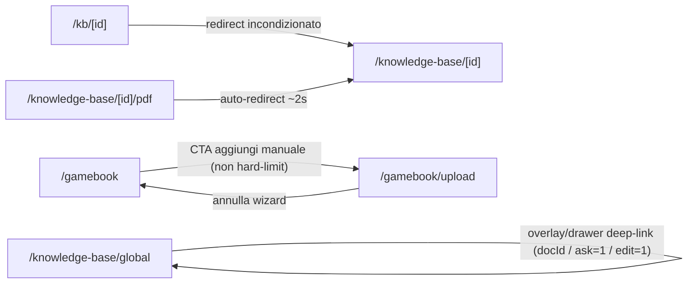

_Le route `/knowledge-base`, `/upload`, `/n8n`, `/pipeline-builder` non hanno edge di navigazione interni al cluster: reindirizzano o linkano solo a surface esterne (`/library`, `/login`, `/`, `/editor`, `/admin/...`, `/library/[gameId]/play`) oppure operano interamente intra-pagina (pipeline-builder)._


## Chat — `(chat)`

Esperienza chat RAG. Sibling di `(authenticated)`, stessa shell `DesktopShell`.

### Chat RAG: lista thread, thread, nuovo, crea agente
_Route-group: `(chat)` · 4 pagine_

#### Tabella route

| Route | Shell | Guardie | Stati principali |
|---|---|---|---|
| `/chat` | `(chat)/layout.tsx` → UserShellClient → DesktopShell (chrome autenticato completo; MobileBottomBar tab `chat` attivo; route non immersiva) | Nessuna guardia esplicita (nessun redirect in layout/shell, nessun `middleware.ts`); dati via React Query `enabled: !!userId` → senza utente empty-state, non redirect | loading (skeleton) · empty · error · success (griglia raggruppata in sidebar) |
| `/chat/[threadId]` | `(chat)/layout.tsx` → UserShellClient → DesktopShell; vista `h-dvh` + `ChatNavigationContext` sticky | Nessun redirect; thread via `api.chat.getThreadById` → se null stato "Thread non trovato"; `ChatThreadView` è `dynamic(ssr:false)`, `ChatMobile` import client statico | loading · error/not-found · empty conversazione (mobile) · success (split desktop / full-screen mobile) · title-editing · sending/streaming · connection status |
| `/chat/new` | `(chat)/layout.tsx` → UserShellClient → DesktopShell; `ChatEntryOrchestrator` (`min-h-dvh`) nel main | Nessun redirect; `NewChatView` è `dynamicImport(ssr:false)` in `<Suspense>`; legge `useSearchParams` (`?game/?gameId`, `?agent`, `?kbIds`) | loading · preparazione/auto-start · creazione · error · success (redirect a `/chat/{threadId}`) |
| `/chat/agents/create` | `(chat)/layout.tsx` → UserShellClient → DesktopShell; wizard full-screen (`min-h-dvh`, gradient amber) nel main | Nessun redirect; `AgentCreationWizard` è `dynamic(ssr:false)` in `<Suspense>`; usa `useSearchParams` (`?gameId`, `?step`) | loading · wizard step 1–4 · submitting · submit error |

#### Navigazione in uscita

- **`/chat`**
  - `/chat -> /chat/new` (Button "Nuova chat" → `router.push('/chat/new')`; solo desktop, sidebar lg+)
  - `/chat -> /chat/{session.id}` (`MeepleChatCard` onClick → `onSessionClick`; desktop, click sul corpo della card sessione nella sidebar aside)
  - `/chat -> /chat/{session.id}` (GridCard → `ConnectionChipStrip` chip "Messaggi" → `buildChatConnections.onMessagesClick`; desktop variant `grid`, sempre abilitato)
  - `/chat -> /agents/{session.agentId}` (GridCard → chip "Agente" → `onAgentLinkClick`; desktop, SOLO se `session.agentId` presente)
  - `/chat -> /chat/{session.id}` (`SessionRow` `<Link>` in `ChatListMobile`; mobile <lg)
- **`/chat/[threadId]`**
  - `/chat/[threadId] -> /chat/new` (`ChatThreadHeader` back `<Link>` ArrowLeft; desktop)
  - `/chat/[threadId] -> /chat/new` (`handleDelete` → `api.chat.deleteThread` → push; click "Elimina", desktop)
  - `/chat/[threadId] -> /chat/new` (stato errore desktop: `<Link>` "Torna alla selezione")
  - `/chat/[threadId] -> /chat` (`ChatMobile` `MobileHeader` `onBack` → `router.push('/chat')`; mobile <lg, in loading/load-error/vista principale, + button in load-error)
  - `/chat/[threadId] -> /library/{thread.gameId}` (`ChatNavigationContext` `getNavigationLinks`; SOLO se `thread.gameId` presente — unico link risolvibile, target agent/session omessi)
  - `/chat/[threadId] -> drawer:AgentSettings` (`ChatThreadHeader` settings → `setSettingsOpen(true)`; SOLO se `thread.agentId != null`)
  - `/chat/[threadId] -> modal:AgentSwitchDialog` (`AgentSelector` onChange → `setShowAgentConfirm(true)`; conferma → `api.chat.switchThreadAgent`; solo se newAgent ≠ corrente)
  - `/chat/[threadId] -> slide-over:PageViewerPanel` (`viewerState` → panel; solo `onClose` cablato, nessun trigger di apertura nel file)
- **`/chat/new`**
  - `/chat/new -> /chat/{threadId}` (`handleStartChat` / `QuickStartSuggestions` onSelect → `createThreadWithContext` → push; click "Inizia Chat" o pill Quick Start)
  - `/chat/new -> /chat/{threadId}` (auto-start direct-game-mode → `createThreadWithContext(agent[0])` → push; `isDirectGameMode && customAgents.length===1`)
  - `/chat/new -> /chat/agents/create?gameId={id}` (`AgentSelector` → `CustomAgentGridSection` `<Link>` "Crea nuovo agent"; SOLO se `gameId!=''` E `customAgents.length>0`)
- **`/chat/agents/create`**
  - `/chat/agents/create -> /chat/new` (Cancel/Indietro allo step 1 → push; `step===1`)
  - `/chat/agents/create -> /chat/new?game={gameId}` (`handleSubmit` → `api.agents.createUserAgent` → push; submit riuscito allo step 4)

#### Superfici condizionali (show / hide / enable)

##### `/chat`
- **ChatListMobile (vista mobile)**: mostrato solo su <lg (`lg:hidden`); fa una propria fetch `useRecentChatSessions(100)` — `apps/web/src/components/chat-unified/ChatListMobile.tsx`
- **Layout split desktop (aside 280px + main)**: solo lg+ (`hidden lg:flex`); le griglie sessioni (`AgentGroupSection→MeepleChatCard`) stanno nella sidebar aside; il main contiene solo header + banner tier + empty-state — `apps/web/src/app/(chat)/chat/page.tsx`
- **Banner uso tier (Alert amber + Progress)**: solo quando `limitData!=null && limitData.limit>0 && used/limit>=0.8` (≥80%); `limit=0` = illimitato → nascosto; solo nell'area main desktop — `apps/web/src/app/(chat)/chat/page.tsx`
- **Empty state (MessageCircle + "Nessuna chat trovata")**: desktop main quando `!isLoading && groups.length===0`; mobile `ChatEmptyState` ("Nessuna chat") quando `!isLoading && !error && groups.length===0` — `apps/web/src/app/(chat)/chat/page.tsx`
- **Skeleton loading**: quando `isLoading` → 6 righe pulse nella sidebar desktop / 4 `SessionSkeleton` nella lista mobile — `apps/web/src/app/(chat)/chat/page.tsx`
- **Alert errore ("Errore nel caricamento delle sessioni chat")**: quando `error` → Alert destructive nel main desktop / testo rosso mobile; in errore il branch <lg mostra comunque `ChatListMobile` (che rende il proprio error) — `apps/web/src/app/(chat)/chat/page.tsx`
- **AgentGroupSection (gruppo collassabile, sidebar desktop)**: griglia mostrata quando `expanded===true` (default true, toggle per gruppo via chevron); desktop raggruppa per agentId/agentType/none, mobile per gameTitle — `apps/web/src/app/(chat)/chat/page.tsx`
- **Etichetta gruppo agente (desktop)**: `agentName` se agentId (fallback "Agente personalizzato"); `SYSTEM_AGENT_LABELS[agentType]` (auto/tutor/arbitro/stratega/narratore) se agentType; "Chat generali" altrimenti — `apps/web/src/app/(chat)/chat/page.tsx`
- **ConnectionChipStrip su MeepleChatCard (desktop grid)**: 4 slot — "Messaggi"(abilitato), "Sources"(disabilitato, non implementato), "Agente"(abilitato solo se agentId), "Archivia"(disabilitato, nessun `onArchive`) — `apps/web/src/components/ui/data-display/meeple-card/nav-items/buildChatConnections.ts`

##### `/chat/[threadId]`
- **ChatThreadView (desktop) vs ChatMobile (mobile)**: `ChatMobile` su <lg (`lg:hidden`, import statico); `ChatThreadView` (`dynamic ssr:false`) su lg+ (`hidden lg:block`) — `apps/web/src/app/(chat)/chat/[threadId]/page.tsx`
- **ChatNavigationContext (barra entity-nav sticky)**: fa una PROPRIA `api.chat.getThreadById`; `return null` se `links.length===0`; rende al massimo il solo link Game → `/library/{gameId}` e solo con gameId presente — `apps/web/src/components/chat-unified/ChatNavigationContext.tsx`
- **Header actions (settings/history/export/share/delete)**: passati SOLO `onTitleChange`, `onDelete`, `onSettings`(solo se agentId); History/Export/Share senza handler → bottoni non renderizzati; `AgentSettingsDrawer` montato solo se agentId; `userTier = user ? 'premium' : 'free'` — `apps/web/src/components/chat-unified/ChatThreadView.tsx`
- **Titolo editabile inline (ChatThreadHeader)**: click sul titolo → input con Salva(Check)/Annulla(X); Enter salva, Escape annulla; salva solo se `trimmed!=title`; icona Pencil su hover se editableTitle — `apps/web/src/components/chat-unified/ChatThreadHeader.tsx`
- **Badge stato connessione (Wifi/WifiOff)**: mostrato quando `streamState.connectionStatus !== 'idle'` (connected/connecting/reconnecting/disconnected/error) — `apps/web/src/components/chat-unified/ChatThreadView.tsx`
- **AgentSwitchDialog (conferma cambio agente)**: mostrato quando `showAgentConfirm && pendingAgent` — `apps/web/src/components/chat-unified/AgentSwitchDialog.tsx`
- **Tab Chat / Debug + pannello Debug (desktop)**: messaggi solo se `activeTab==='chat'`; pannello Debug solo se `activeTab==='debug'`; badge conteggio se `streamState.debugSteps.length>0`; empty-hint se 0 step — `apps/web/src/components/chat-unified/ChatThreadView.tsx`
- **DebugStepCard showSystemPrompt (gate ruolo)**: system prompt mostrato SOLO agli admin (`showSystemPrompt={isAdmin}`, `isAdminOrAbove(user)`) — `apps/web/src/components/chat-unified/ChatThreadView.tsx`
- **ChatMessageList (flag editor/admin + TTS)**: riceve `isEditor` (`isEditorOrAbove`) e `isAdmin` per gate di affordance; controlli TTS solo se `isTtsSupported && voicePrefs.ttsEnabled` — `apps/web/src/components/chat-unified/ChatMessageList.tsx`
- **ChatInfoPanel (sidebar destra, desktop only)**: `hidden lg:flex`; blocco agent solo se prop `agent` presente; blocco game solo se `game!=null`; blocco citazioni solo se `citations.length>0` (max 20); suggerimenti solo se `suggestedQuestions.length>0` — `apps/web/src/components/chat-unified/ChatInfoPanel.tsx`
- **VoiceTranscriptOverlay (desktop)**: mostrato quando `voiceState !== 'idle'` — `apps/web/src/components/chat-unified/ChatThreadView.tsx`
- **Banner errore inline (desktop)**: mostrato quando `error` settato e thread esiste (`role='alert'`) — `apps/web/src/components/chat-unified/ChatThreadView.tsx`
- **AgentSelector (header desktop)**: `disabled` quando `isSending || streamState.isStreaming` — `apps/web/src/components/agent/AgentSelector.tsx`
- **Percorso invio messaggio DESKTOP**: priorità `thread.gameId` → `qaStream` RAG (`POST /agents/qa/stream`) PRIMA; poi `thread.agentId && !gameId` → `sendViaSSE`; altrimenti REST `api.chat.addMessage`; welcome message iniettato se thread vuoto + agentId + gameName (solo desktop) — `apps/web/src/components/chat-unified/ChatThreadView.tsx`
- **Percorso invio messaggio MOBILE**: priorità DIVERSA — `agentId` → `sendViaSSE` PRIMA; poi `thread.gameId` → `qaStream` RAG; altrimenti REST; nessun welcome-message; input disabled durante streaming — `apps/web/src/components/chat-unified/ChatMobile.tsx`
- **Empty / stream-error mobile**: empty ("Inizia la conversazione…") se `messages.length===0 && !isStreaming`; banner stream-error se `streamState.error` settato — `apps/web/src/components/chat-unified/ChatMobile.tsx`
- **QuickPromptChips (mobile)**: mostrato quando `!streamState.isStreaming && activeFollowUps.length>0` — `apps/web/src/components/chat-unified/ChatMobile.tsx`
- **MessageBubble stato (mobile)**: styling user vs assistant; errore se `message.isError`; `InlineCitationText` se inlineCitations; `CitationBlock` se snippets; `ContinueButton` se continuationToken — `apps/web/src/components/chat-unified/ChatMobile.tsx`
- **Streaming UI (mobile)**: `StreamingBubble` se `isStreaming && currentAnswer`; `StreamingLoadingDots` se `isStreaming && !currentAnswer && statusMessage`; send-button con spinner se `isStreaming` — `apps/web/src/components/chat-unified/ChatMobile.tsx`

##### `/chat/new`
- **Direct game mode vs Full mode**: `isDirectGameMode` = presente `?game`/`?gameId`; Direct → titolo "Seleziona un agente", `GameSelector` NASCOSTO, `selectedAgentType` iniziale null; Full → `GameSelector` mostrato, default `'auto'` — `apps/web/src/components/chat/entry/ChatEntryOrchestrator.tsx`
- **Auto-start / spinner ("Preparazione…" / "Avvio chat in corso…")**: branch spinner quando `isDirectGameMode && (isLoadingCustomAgents || isCreating || (customAgents.length===1 && !error))`; 0 custom → mostra system agents, 1 → auto-crea+redirect, 2+ → picker; durante lo spinner monta `AgentSelector` sr-only (fix #923) — `apps/web/src/components/chat/entry/ChatEntryOrchestrator.tsx`
- **GameSelector (sezione gioco)**: nascosto in direct game mode (`!isDirectGameMode`); tab "I miei giochi"(private, load al mount) / "Libreria condivisa"(shared, lazy-load al primo switch, filtro `hasKb` se `showOnlyWithKb`); bottone "Continua senza gioco"; ricerca client; skeleton se isLoading; empty "Nessun gioco trovato"; alert su errore fetch — `apps/web/src/components/chat/entry/GameSelector.tsx`
- **AgentSelector(entry) — CustomAgentGridSection**: sezione "I tuoi agent" + link "Crea nuovo agent" solo se `gameId && gameId!==''` E `customAgents.length>0`; skeleton (2 placeholder) se isLoadingCustom; `return null` se 0 custom; selezione via `aria-pressed`; `SystemAgentGrid` (5 agenti) sempre mostrato — `apps/web/src/components/chat/entry/AgentSelector.tsx`
- **QuickStartSuggestions**: game-specific se gameName presente, altrimenti generici (`getQuickStartSuggestions`); pill disabled quando isCreating — `apps/web/src/components/chat/entry/QuickStartSuggestions.tsx`
- **Bottone "Inizia Chat"**: disabled se `!canStart || isCreating`; `canStart = hasAgentAvailable && (selectedAgentType!=null || selectedCustomAgentId!=null)`; `hasAgentAvailable = DEFAULT_AGENTS.length>0 || customAgents.length>0`; spinner "Creazione in corso…" se isCreating — `apps/web/src/components/chat/entry/ChatEntryOrchestrator.tsx`
- **Alert errore ("Errore nella creazione della conversazione")**: `role='alert'` quando `error` settato (sia nel branch spinner sia nella vista principale) — `apps/web/src/components/chat/entry/ChatEntryOrchestrator.tsx`
- **Pre-selezione da query**: `?game/?gameId` → `selectedGameId` + direct mode; `?agent` → `selectedAgentType` (via useEffect); `?kbIds` (csv) → `selectedKbIds` passati a `createThreadWithContext` — `apps/web/src/components/chat/entry/ChatEntryOrchestrator.tsx`

##### `/chat/agents/create`
- **Contenuto step (switch 1..4)**: step1 `GameCollectionPicker`; step2 `AgentTypePicker`; step3 `AgentNameAndKbStep` (SOLO se `state.selectedGame!=null`); step4 `AgentCreationReview` — `apps/web/src/components/chat-unified/AgentCreationWizard.tsx`
- **Gating avanzamento (canGoNext) + bottone Next**: step1 richiede `selectedGame!=null`; step2 `agentType!=null`; step3 `agentName.trim().length>0`; step4 sempre true; Next disabled se `!canGoNext`; `handleNext` avanza solo se `canGoNext && step<4` — `apps/web/src/components/chat-unified/AgentCreationWizard.tsx`
- **Barra navigazione step**: step 1–3 → bottone sinistro Cancel(step1)/Back(2–3) + Next; step 4 → solo Back ("Modifica"), il submit è dentro `AgentCreationReview` — `apps/web/src/components/chat-unified/AgentCreationWizard.tsx`
- **Pre-selezione gioco da `?gameId` (+ `?step`)**: se `?gameId` matcha un gioco in libreria (`api.library.getLibrary`) → preseleziona e salta a step 2, o a `?step` se ≥2 (cap 4); guardia one-shot `didPreselect` (ref) — `apps/web/src/components/chat-unified/AgentCreationWizard.tsx`
- **GameCollectionPicker (step1)**: skeleton (`LibraryLoading`) se isLoading; empty (`LibraryEmpty`) "Nessun gioco trovato" (con ricerca) / "Nessun gioco nella libreria" (senza); border/ring sul gioco scelto; filtro ricerca client — `apps/web/src/components/chat-unified/AgentCreationWizard.tsx`
- **AgentTypePicker (step2)**: 4 tipi (Tutor/Arbitro/Stratega/Narratore); card selezionata con ring colorato + badge "Selezionato" (CheckCircle2) — `apps/web/src/components/chat-unified/AgentCreationWizard.tsx`
- **AgentNameAndKbStep (step3)**: input nome obbligatorio (maxLength 100 + contatore); PDF via `api.library.getGamePdfs` (skeleton/empty `PdfsEmpty`); badge fonte "Caricato da te" se `source==='Custom'` altrimenti "Catalogo"; checkbox toggle; contatore "N PDF selezionat*" se >0 — `apps/web/src/components/chat-unified/AgentCreationWizard.tsx`
- **Bottone submit (review, step4)**: disabled + spinner Loader2 se isSubmitting; guardia `WIZARD_TYPE_TO_BACKEND` (tipo non supportato → submitError "Tipo di agent non supportato"); alert AlertCircle se submitError — `apps/web/src/components/chat-unified/AgentCreationWizard.tsx`
- **StepIndicator**: per step completed (CheckCircle2 ambra) / active (ring-4 ambra) / pending (muted); connettori colorati fino allo step corrente — `apps/web/src/components/chat-unified/AgentCreationWizard.tsx`

#### Componenti → file

| Componente | File | Ruolo |
|---|---|---|
| ChatListPage | `apps/web/src/app/(chat)/chat/page.tsx` | Page lista: raggruppamento per agente (desktop), banner tier, dispatch mobile/desktop |
| ChatListMobile | `apps/web/src/components/chat-unified/ChatListMobile.tsx` | Lista mobile raggruppata per gioco (fetch propria, limit 100) |
| MeepleChatCard | `apps/web/src/components/chat-unified/MeepleChatCard.tsx` | Adapter MeepleCard `entity='chat' variant='grid'`; cabla ConnectionChipStrip |
| buildChatConnections | `apps/web/src/components/ui/data-display/meeple-card/nav-items/buildChatConnections.ts` | Costruisce i 4 chip di connessione della card chat |
| ChatThreadPage | `apps/web/src/app/(chat)/chat/[threadId]/page.tsx` | Page: `use(params)` + ChatNavigationContext + dispatch mobile/desktop |
| ChatThreadView | `apps/web/src/components/chat-unified/ChatThreadView.tsx` | Vista split desktop (`dynamic ssr:false`): messaggi + Debug + info panel + streaming + voice |
| ChatMobile | `apps/web/src/components/chat-unified/ChatMobile.tsx` | Vista chat mobile full-screen (import statico), priorità agentId-first |
| ChatNavigationContext | `apps/web/src/components/chat-unified/ChatNavigationContext.tsx` | Barra entity-nav sticky; solo link Game → `/library/{gameId}` |
| ChatThreadHeader | `apps/web/src/components/chat-unified/ChatThreadHeader.tsx` | Header: back → `/chat/new`, titolo editabile inline, azioni (settings/delete) |
| ChatInfoPanel | `apps/web/src/components/chat-unified/ChatInfoPanel.tsx` | Sidebar destra desktop: agent/game/citazioni/domande suggerite |
| AgentSelector (header) | `apps/web/src/components/agent/AgentSelector.tsx` | Selettore tipologia agente (auto/tutor/arbitro/stratega/narratore) |
| AgentSettingsDrawer | `apps/web/src/components/agent/settings/index.ts` | Drawer impostazioni agente (solo se agentId) |
| AgentSwitchDialog | `apps/web/src/components/chat-unified/AgentSwitchDialog.tsx` | Modal conferma cambio agente |
| PageViewerPanel | `apps/web/src/components/chat/viewer/PageViewerPanel.tsx` | Slide-over viewer pagina PDF citazione (solo `onClose` cablato) |
| NewChatPage → NewChatView | `apps/web/src/app/(chat)/chat/new/page.tsx` · `.../chat-unified/NewChatView.tsx` | Page Suspense + `dynamicImport(ssr:false)` → orchestratore |
| ChatEntryOrchestrator | `apps/web/src/components/chat/entry/ChatEntryOrchestrator.tsx` | Flusso nuova chat (full vs direct game mode; auto-start; creazione thread + redirect) |
| GameSelector (entry) | `apps/web/src/components/chat/entry/GameSelector.tsx` | Picker gioco 2 tab (private / shared) + skip + ricerca |
| AgentSelector (entry) | `apps/web/src/components/chat/entry/AgentSelector.tsx` | Picker agenti custom + system + link "Crea nuovo agent" |
| QuickStartSuggestions | `apps/web/src/components/chat/entry/QuickStartSuggestions.tsx` | Pill di prompt rapidi context-aware |
| createThreadWithContext | `apps/web/src/components/chat/entry/ThreadCreator.ts` | Utility creazione thread (risolve agentId → `api.chat.createThread`) |
| CreateAgentPage | `apps/web/src/app/(chat)/chat/agents/create/page.tsx` | Page Suspense + `AgentCreationWizard` `dynamic(ssr:false)` |
| AgentCreationWizard | `apps/web/src/components/chat-unified/AgentCreationWizard.tsx` | Wizard 4 step creazione agente user-owned (sotto-step inline) |
| useRecentChatSessions / useChatSessionLimit | `apps/web/src/hooks/queries/useChatSessions.ts` | Data hooks React Query (sessioni + limite tier), `enabled: !!userId` |
| useAgentChatStream / qaStream | `apps/web/src/hooks/useAgentChatStream.ts` · `apps/web/src/lib/api/clients/chatClient.ts` | Streaming SSE per-agente (`sendViaSSE`) e client QA/RAG (`POST /agents/qa/stream`) |

#### Diagramma navigazione interna

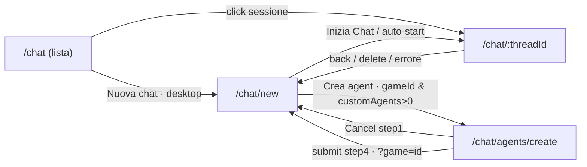


## Amministrazione — `admin`

Pannello di amministrazione. Shell: `AdminShell` (tema scuro, AdminSidebar contestuale). Guardia: cookie `meepleai_view_mode` + `RequireRole(['Admin'])`.

### Admin: entry, overview, analytics, business, AI hub, RAG quality, staging, DB sync
_Route-group: `admin` · 10 pagine_

#### Tabella route

| Route | Shell | Guardie | Stati principali |
|---|---|---|---|
| `/admin` | Nessuna (solo root `app/layout.tsx`; non esiste `admin/layout.tsx`) | Nessuna — `redirect('/admin/overview')` incondizionato | Redirect server immediato (nessun render) |
| `/admin/overview` | AdminShell (dark) via `(dashboard)/layout.tsx` | Server: cookie `meepleai_view_mode`==='user' → `redirect('/')` · Client: RequireRole `['Admin']` (superadmin bypass) · PdfProcessingNotifier (SSE, livello layout) | loading (in-component + `loading.tsx` skeleton) · error (banner amber + Riprova, dati parziali) · success |
| `/admin/overview/activity` | AdminShell | come dashboard | static (PLACEHOLDER, no backend) · filtered-empty |
| `/admin/overview/system` | AdminShell | come dashboard | loading · empty ('No services found') · success · error (solo log, nessuna UI esplicita) |
| `/admin/analytics` | AdminShell (async server component) | come dashboard | Suspense per-tab (TabSkeleton); ogni tab ha loading/empty/error |
| `/admin/business` | AdminShell (client) | come dashboard | BudgetKpiStrip loading/empty(budget mai configurato)/loaded; widget con loading proprio |
| `/admin/ai` | AdminShell + `ai/layout.tsx` (AiTopBand sticky), async server | come dashboard | Suspense per-tab; ogni tab loading/empty(AdminHubEmptyState)/error |
| `/admin/rag-quality` | AdminShell (thin wrapper) | come dashboard | loading (skeleton) · error (card) · empty · success |
| `/admin/staging-access` | AdminShell | come dashboard + **superadmin enforced SERVER-side** (voce sidebar `minRole:'superadmin'`; Admin via URL diretto → UI renderizzata ma API 403) | loading · error · empty · success |
| `/admin/database-sync` | **NESSUNA admin chrome** (fuori da `(dashboard)`, solo root `app/layout.tsx`) | **NESSUNA guardia client** (no RequireRole/view-mode/PdfProcessingNotifier); gate solo lato API backend | per-tab gate su tunnel Open (Schema/Data); HistoryTab loading/error/empty/success |

#### Navigazione in uscita

- **`/admin`**
  - `-> /admin/overview` (`redirect()` server component; incondizionato)
- **`/admin/overview`**
  - `-> /admin/shared-games/new` (QuickActionsGrid 'Crea Gioco')
  - `-> modal:InviteUserDialog` (QuickActionsGrid 'Invita Utente'; stato `inviteOpen`)
  - `-> /admin/shared-games/all` (QuickActionsGrid 'Gestisci Giochi' + LibrarySummaryCard 'Gestisci catalogo →')
  - `-> /admin/users` (QuickActionsGrid 'Gestisci Utenti' + UsersSummaryCard link + TechActionsBar 'Export Users')
  - `-> /admin/knowledge-base/upload` (QuickActionsGrid 'Upload PDF')
  - `-> /admin/knowledge-base/queue` (QuickActionsGrid 'Vedi Coda' + ProcessingQueueWidget; link widget solo se `hasActivity`)
  - `-> /admin/config` (TechActionsBar 'Clear Cache')
  - `-> /admin/knowledge-base/vectors` (TechActionsBar 'Reindex All')
  - `-> /admin/monitor` (TechActionsBar 'System Health')
  - `-> /admin/users/access-requests` (PendingRequestsBanner 'Vedi tutte →'; solo se `totalCount > 5`)
  - `-> /admin/shared-games/{id}` (LibrarySummaryCard recent-game; per riga)
  - `-> /admin/shared-games/{sharedGameId}` (PdfProcessingNotifier toast 'Vai al gioco', livello layout; solo se l'evento SSE porta `sharedGameId`)
- **`/admin/overview/activity`** — nessun edge nel body (raggiunta/lasciata via AdminSidebar, group A 'Activity Feed')
- **`/admin/overview/system`** — nessun edge nel body (via AdminSidebar, group A 'System Health')
- **`/admin/analytics`**
  - `-> /admin/analytics?tab=overview|ai-usage|audit|reports|api-keys` (AdminHubTabBar Link)
  - `-> /admin/analytics?tab=<saved>` (AdminTabPersistence `router.replace` da localStorage `admin-tab-analytics`; solo se no `?tab` && saved≠default 'overview')
- **`/admin/business`**
  - `-> /admin/business?range=7d|30d|90d|1y` (range `<select>` onChange → `router.replace`)
  - `-> modal:SetBudgetDialog` ('Imposta budget')
  - `-> /api/v1/admin/business/usage?period=30` (`<a href>` 'Usage'; endpoint API legacy, non route client)
- **`/admin/ai`**
  - `-> /admin/ai?tab=<agents|typologies|definitions|lab|prompts|models|requests|rag|config>` (AdminHubTabBar, 9 tab)
  - `-> /admin/ai?tab=<saved>` (AdminTabPersistence da localStorage `admin-tab-ai`; solo se no `?tab` && saved≠default 'agents')
  - `-> /admin/agents` (AgentsTab 'Full Catalog' + empty 'Open Catalog')
  - `-> /admin/agents/definitions/{agent.id}` (AgentsTab card; se lista non vuota)
  - `-> /admin/agents/definitions` (DefinitionsTab 'Full Manager' + 'All Definitions')
  - `-> /admin/agents/definitions/create` (DefinitionsTab 'Create New')
  - `-> /admin/agents/builder` (DefinitionsTab 'Agent Builder')
  - `-> /admin/agents/definitions/playground` (AiLabTab 'Agent Playground')
  - `-> /admin/agents/debug-chat` (AiLabTab + RagTab 'Debug Chat')
  - `-> /admin/agents/debug` (AiLabTab + RagTab 'Debug Console')
  - `-> /admin/agents/pipeline` (AiLabTab + RagTab 'Pipeline Explorer')
  - `-> /admin/agents/strategy` (RagTab 'Strategy Config')
  - `-> /admin/knowledge-base` (RagTab 'Knowledge Base')
  - `-> /admin/knowledge-base/vectors` (RagTab 'Vector Collections')
  - `-> /admin/agents/models` (PromptsTab 'New Prompt', header + empty-state)
  - `-> /admin/ai?tab=requests&range=Live|1h|24h|7d` (RequestsTab AiTrendChart onRangeChange → `router.replace`, scroll:false; forza tab=requests se assente)
  - `-> /admin/ai?tab=requests&queryId=<id>` (RequestsTab click riga → `openDrill`; `closeDrill` rimuove `queryId`)
- **`/admin/rag-quality`** — nessun edge (solo refetch); via AdminSidebar (group D 'RAG Quality')
- **`/admin/staging-access`** — nessun edge (CRUD only); via AdminSidebar (group C, superadmin-only)
- **`/admin/database-sync`**
  - `-> modal:SqlPreviewModal` (SchemaComparisonTab 'Preview SQL' → `previewSql.mutate()`; solo se schema `hasDifferences`)
  - `-> modal:ConfirmationDialog(APPLY MIGRATIONS)` (SchemaComparisonTab 'Apply Migrations'; solo se `hasDifferences`; richiede digitare 'APPLY MIGRATIONS'; direction StagingToLocal)
  - `-> modal:ConfirmationDialog(SYNC DATA)` (DataComparisonTab 'Sync Table'; richiede digitare 'SYNC DATA'; disabled se modified+localOnly+stagingOnly tutti vuoti; direction StagingToLocal)

#### Superfici condizionali (show / hide / enable)

##### `/admin/overview`
- **Header 'Refresh'**: sempre mostrato; onClick `refetch()`; '· ultimo refresh HH:MM' aggiunto al sottotitolo solo quando `data?.stats` presente — `apps/web/src/app/admin/(dashboard)/overview/page.tsx`
- **Banner error amber**: solo quando `useQuery ['admin','overview']` è `isError` — `apps/web/src/app/admin/(dashboard)/overview/page.tsx`
- **PendingRequestsBanner**: `null` se `requests.length===0`; mostra prime 5 righe; footer 'Vedi tutte →' solo se `totalCount>5`; bottoni Approva (emerald)/Rifiuta (red) disabled + `Loader2` inline mentre l'id è nel Set ottimistico; esito via sonner + `invalidateQueries(['admin','overview'])` — `apps/web/src/app/admin/(dashboard)/overview/PendingRequestsBanner.tsx`
- **ProcessingQueueWidget**: skeleton `h-14` mentre `isLoading`; `null` se `!hasActivity`; ogni chip (in attesa/in elaborazione/falliti) solo se count>0; `staleTime 30s` + `refetchInterval 60s` — `apps/web/src/app/admin/(dashboard)/overview/ProcessingQueueWidget.tsx`
- **KPIStatsRow (4 card)**: Giochi/Documenti/Utenti/Pendenti sempre renderizzate (Documenti & queueDepth = gap backend → fallback 0); badge '+N recenti' solo se `recentSubmissions>0`; 'N in coda' solo se `queueDepth>0`; 'N attivi' + trend (activeRatio) solo se `activeUsers` definito && `totalUsers>0` — `apps/web/src/app/admin/(dashboard)/overview/KPIStatsRow.tsx`
- **UsersSummaryCard**: riga 'N attivi 30gg' sempre; chip amber 'N inviti pendenti' solo se `pendingInvitations>0`; recentUsers vuoto → 'Nessun utente recente' (displayName ?? email) — `apps/web/src/app/admin/(dashboard)/overview/UsersSummaryCard.tsx`
- **LibrarySummaryCard**: recentGames vuoto → 'Nessun gioco recente'; altrimenti Link per riga a `/admin/shared-games/{id}` — `apps/web/src/app/admin/(dashboard)/overview/LibrarySummaryCard.tsx`
- **QuickActionsGrid**: qui `variant='sidebar'` (lista verticale compatta, 6 azioni); InviteUserDialog via stato `inviteOpen` (action id 'invite-user') — `apps/web/src/app/admin/(dashboard)/overview/QuickActionsGrid.tsx`
- **PdfProcessingNotifier (livello layout)**: JobCompleted → toast success (8s) con azione 'Vai al gioco' (navigazione solo se `sharedGameId`); JobFailed → toast error con 'Riprova' → `api.admin.retryJob(jobId)` (mutation, non navigazione) — `apps/web/src/components/admin/layout/PdfProcessingNotifier.tsx`

##### `/admin/overview/activity`
- **Banner info amber**: sempre — 'Showing placeholder data. Activity log will display real events once the audit API is connected.' — `apps/web/src/app/admin/(dashboard)/overview/activity/page.tsx`
- **Select typeFilter**: all|users|games|agents|documents|system — filtra `PLACEHOLDER_ENTRIES` client-side per categoria; dot icona colorato via `CATEGORY_COLORS` — `apps/web/src/app/admin/(dashboard)/overview/activity/page.tsx`
- **Select dateRange**: 24h|7d|30d — puramente cosmetico, non altera la lista statica — `apps/web/src/app/admin/(dashboard)/overview/activity/page.tsx`
- **Timeline / empty**: renderizza entries filtrate; se `filtered.length===0` → 'No activities match the selected filter.' — `apps/web/src/app/admin/(dashboard)/overview/activity/page.tsx`

##### `/admin/overview/system`
- **Overall status block**: solo se `infraData.overall` presente; badge+dot per stato (Healthy=green/Degraded=amber/else red); '· N degraded' solo se `degradedServices>0`; '· N unhealthy' solo se `unhealthyServices>0`; mostra healthyServices/totalServices — `apps/web/src/app/admin/(dashboard)/overview/system/page.tsx`
- **Service grid**: 'Loading...' mentre loading; 'No services found' se services vuoto; badge/dot per `service.state`; Latency `Math.round(responseTimeMs)ms`; riga errorMessage solo se presente — `apps/web/src/app/admin/(dashboard)/overview/system/page.tsx`
- **API Metrics (24h)**: solo se `infraData.prometheusMetrics` presente; 4 card (Requests/Avg Latency/Error Rate/LLM Cost); Error Rate red se >0.05, amber se >0.01, else green — `apps/web/src/app/admin/(dashboard)/overview/system/page.tsx`

##### `/admin/analytics`
- **Active tab**: `tab = (await searchParams).tab ?? 'overview'`; switch → overview | ai-usage | audit | reports | api-keys (default null) — `apps/web/src/app/admin/(dashboard)/analytics/page.tsx`
- **OverviewTab**: isError → banner amber 'Errore nel caricamento delle statistiche.' + Riprova; quickStats grid 2/4-col solo se `!isLoading && stats`; loading → 4 pulse; ChartsSection sempre — `apps/web/src/app/admin/(dashboard)/analytics/OverviewTab.tsx`
- **AiUsageTab**: toggle periodo 7/30/90 (attivo `variant='default'`) + refresh; `animate-pulse` full-page mentre loading; banner error solo se tutte e tre le fetch (pdf/chat/model) tornano null; 3 MetricCard con fallback `?? 0` — `apps/web/src/app/admin/(dashboard)/analytics/AiUsageTab.tsx`
- **AuditLogTab**: bare re-export di `../monitor/operations/AuditTab` (filtri + date range + paginazione + export JSON/CSV) — `apps/web/src/app/admin/(dashboard)/analytics/AuditLogTab.tsx`
- **ReportsTab**: sempre `EmptyFeatureState('Generazione Report', #920)` — `apps/web/src/app/admin/(dashboard)/analytics/ReportsTab.tsx`
- **ApiKeysTab**: loading pulse; header '{n} key(s) registered'; tabella con riga vuota 'No API keys found' (colSpan 5); 'Export CSV' disabled se `keys.length===0` → download Blob `api-keys-<date>.csv` — `apps/web/src/app/admin/(dashboard)/analytics/ApiKeysTab.tsx`
- **AdminTabPersistence**: render null; con `?tab` → `localStorage.setItem('admin-tab-analytics', tab)`; senza `?tab` && saved && saved≠'overview' → `router.replace('/admin/analytics?tab=<saved>')` — `apps/web/src/components/admin/layout/AdminTabPersistence.tsx`

##### `/admin/business`
- **range**: da `?range` via `costBreakdownRangeSchema.safeParse`; invalido/assente → default '30d'; passato a CostStackedArea + FeatureCostTable — `apps/web/src/app/admin/(dashboard)/business/page.tsx`
- **BudgetKpiStrip**: `aria-busy` skeleton mentre isLoading; `budget===null` → 4 placeholder tratteggiati ('—' + tooltip 'Clicca + Imposta budget'); loaded → 4 KPI (Spesa oggi[entity-agent, sparkline solo se ≥2 punti] / Spesa mese[entity-event, progress bar monthPct] / Budget residuo[entity-toolkit] / Proiezione fine mese[entity-chat, emerald se ≤limit else rose]) — `apps/web/src/components/admin/business/BudgetKpiStrip.tsx`
- **SetBudgetDialog**: controllato da `setBudgetOpen`; pre-popolato da budget esistente (edit) else default (amount ''/alert 80/critical 95); titolo/CTA 'Modifica…/Aggiorna' se budget esiste else 'Imposta…/Imposta'; submit disabled se `!isValid` (amount>0, alert 1-99, critical>alert && ≤100) o `isUpserting`; hint rose se `!isValid && amount`; invia `xmin (budget?.xmin ?? null)` → 409 ConflictException → toast error 'Salvataggio budget fallito' — `apps/web/src/components/admin/business/SetBudgetDialog.tsx`

##### `/admin/ai`
- **Active tab**: `tab = (await searchParams).tab ?? 'agents'`; switch 9-way (agents/typologies/definitions/lab/prompts/models/requests/rag/config→LlmConfigTab; default null) — `apps/web/src/app/admin/(dashboard)/ai/page.tsx`
- **AgentsTab**: loading 4-tile pulse; lista (`getStats().agents`) vs AdminHubEmptyState 'No agents found' + 'Open Catalog'; 'Full Catalog' sempre in header — `apps/web/src/app/admin/(dashboard)/ai/AgentsTab.tsx`
- **TypologiesTab**: loading 3-tile; lista vs empty 'No typologies found'; badge Approved(success)/Pending(warning); 'Approve' solo se `!isApproved` (refetch); 'Delete' sempre — `apps/web/src/app/admin/(dashboard)/ai/TypologiesTab.tsx`
- **ModelsTab**: loading 4-tile; lista vs empty 'No AI models configured'; badge 'Primary' solo se isPrimary; 'Set Primary' solo se `!isPrimary`; dot green se `status==='active'`; 'Configure' no-op — `apps/web/src/app/admin/(dashboard)/ai/ModelsTab.tsx`
- **PromptsTab**: loading 3-tile; lista vs empty 'No prompt templates found' + 'New Prompt'→`/admin/agents/models`; dot active/inactive; Edit (no-op) + Delete (`api.admin.deletePrompt`) — `apps/web/src/app/admin/(dashboard)/ai/PromptsTab.tsx`
- **RequestsTab**: AiTrendChart range da `?range` (default '7d', opzioni Live/1h/24h/7d); range Live poll ogni 10s (con guard cancel); card list (<md) vs tabella (md+); riga selezionata highlight (`aria-pressed`); grid 58/42 quando `hasDrill`; QueryDrillPanel solo su lg+ con `selectedQuery≠null`; Prev disabled `page<=1`, Next disabled se `requests.length<20`; empty → 'No AI requests found' — `apps/web/src/app/admin/(dashboard)/ai/RequestsTab.tsx`
- **LlmConfigTab**: loading 4-tile; config/form null → empty 'Configuration unavailable'; 'Discard' solo se `isDirty`; 'Save Changes' disabled se `!isDirty || saving`; banner error/success (success auto-clear 3s); validazione `dailyBudget≤monthlyBudget` + `fallbackChainJson` deve fare JSON.parse in array; dot source green se `source==='database'` else amber; Layer1 Database editabile, Layers 2-4 read-only — `apps/web/src/app/admin/(dashboard)/ai/LlmConfigTab.tsx`
- **DefinitionsTab / AiLabTab / RagTab**: griglie statiche di AdminHubQuickLink (no fetch, no conditional) — `apps/web/src/app/admin/(dashboard)/ai/RagTab.tsx`
- **AiCrumbs / AiTopActions**: AiCrumbs legge `?tab` → 'Admin · AI · <label>' (fallback 'Agents'); AiTopActions ritorna null (slot right-actions intenzionalmente vuoto, #1722) — `apps/web/src/components/admin/ai/AiCrumbs.tsx`

##### `/admin/rag-quality`
- **Error card**: solo se `useQuery ['ragQualityReport']` error (in aggiunta a dati parziali) — `apps/web/src/components/admin/rag-quality-dashboard.tsx`
- **4 Summary card**: Skeleton mentre isLoading; `formatNumber` else '—' se undefined (Total Indexed Documents / Embedded Chunks / RAPTOR Summaries / Entity Relations) — `apps/web/src/components/admin/rag-quality-dashboard.tsx`
- **Top Games by Chunk Count**: 3 skeleton rows mentre loading; tabella se non vuoto; else 'No game data available' — `apps/web/src/components/admin/rag-quality-dashboard.tsx`
- **Enhancement Feature Flags**: 3 skeleton rows; tabella se non vuoto; else 'No enhancement data available'; EnabledIcon (CheckCircle2 emerald / XCircle) per tier Free/Normal/Premium — `apps/web/src/components/admin/rag-quality-dashboard.tsx`
- **Refresh (icon)**: sempre; onClick `refetch()` — `apps/web/src/components/admin/rag-quality-dashboard.tsx`

##### `/admin/staging-access`
- **Add form**: Email `required` (type=email) + Note opzionale (maxLength 500); input + Add disabled mentre `addMutation.isPending`; Add anche disabled se email trimmed vuota; submit bloccato con toast 'Email is required' se vuoto; label 'Adding…' mentre pending — `apps/web/src/app/admin/(dashboard)/staging-access/page.tsx`
- **Allowlist table**: Skeleton mentre `listQuery.isLoading`; messaggio destructive se isError; 'No entries yet…' se vuoto; altrimenti tabella (note fallback '—') — `apps/web/src/app/admin/(dashboard)/staging-access/page.tsx`
- **Remove per-riga**: `window.confirm('Remove <email>…')` prima di `removeMutation`; disabled mentre pending — `apps/web/src/app/admin/(dashboard)/staging-access/page.tsx`
- **Refresh**: onClick `listQuery.refetch()`; disabled + icona spin mentre `isFetching` — `apps/web/src/app/admin/(dashboard)/staging-access/page.tsx`
- **sonner toasts**: add success 'Added <email>…'; add error → se message contiene 'conflict'/'409' → '<email> is already in the allowlist' else raw; remove success/error — `apps/web/src/app/admin/(dashboard)/staging-access/page.tsx`

##### `/admin/database-sync`
- **Tabs (shadcn)**: Schema | Data | History — `defaultValue='schema'`; switch via stato LOCAL (TabsTrigger), NON query param/route — `apps/web/src/app/admin/database-sync/page.tsx`
- **TunnelStatusBanner**: stato da `useTunnelStatus` (Open/Opening/Error/Closed, default Closed) → colore+icona+label; 'Disconnect' se Open else 'Connect' ('Connecting...' in transizione); disabled mentre `isTransitioning`; uptime solo se `Open && uptimeSeconds>0`; riga message + 'Failed to fetch tunnel status' (error && !status); Loader2 iniziale se `isLoading && !status` — `apps/web/src/app/admin/database-sync/components/TunnelStatusBanner.tsx`
- **SchemaComparisonTab**: se `status!=='Open'` → gate 'Connect the SSH tunnel to compare schemas.'; se connesso: Refresh sempre (disabled+spinner mentre loading), 'Preview SQL' + 'Apply Migrations' solo se `hasDifferences`; banner compare/apply error+success; 'Schemas are in sync' se no diff; 3 MigrationTables (Common/Local Only/Staging Only) — `apps/web/src/app/admin/database-sync/components/SchemaComparisonTab.tsx`
- **DataComparisonTab**: se `status!=='Open'` → gate; lista tabelle per boundedContext con dot amber se `localRowCount≠stagingRowCount`; pannello dx 'Select a table…' fino a selezione; diffLoading/diffError; stats (Local/Staging/Identical/Modified); 'Sync Table' disabled se modified+localOnly+stagingOnly tutti vuoti; righe modified (prime 100); banner 'Table data is identical…' + sync success/error — `apps/web/src/app/admin/database-sync/components/DataComparisonTab.tsx`
- **HistoryTab**: loading spinner; error banner red; empty 'No sync operations recorded yet.'; else tabella con badge Success(emerald)/failure(red) + details troncati — `apps/web/src/app/admin/database-sync/components/HistoryTab.tsx`

#### Componenti → file

| Componente | File | Ruolo |
|---|---|---|
| AdminShell | `apps/web/src/components/layout/AdminShell/AdminShell.tsx` | Chrome admin dark (topbar+sidebar+drawer+DashboardEngineProvider) condivisa da tutte le `(dashboard)` |
| AdminSidebar | `apps/web/src/components/layout/AdminSidebar/AdminSidebar.tsx` | Sidebar persistente lg+ (`ADMIN_NAV_GROUPS` via `filterNavByRole`); nav cross-cluster shell-level |
| PdfProcessingNotifier | `apps/web/src/components/admin/layout/PdfProcessingNotifier.tsx` | SSE queue → toast (JobCompleted/JobFailed), montato dal `(dashboard)` layout |
| AdminHubTabBar | `apps/web/src/components/admin/layout/AdminHubTabBar.tsx` | Tab bar orizzontale Link-based via `?tab` |
| AdminTabPersistence | `apps/web/src/components/admin/layout/AdminTabPersistence.tsx` | Memoria tab localStorage + redirect (render null) |
| AdminRootPage | `apps/web/src/app/admin/page.tsx` | Server component: `redirect('/admin/overview')` |
| OverviewPage | `apps/web/src/app/admin/(dashboard)/overview/page.tsx` | Client page; `useQuery ['admin','overview']` aggrega stats + access-requests + recent games/users + inviti (ogni source `.catch` → empty/0) |
| KPIStatsRow | `apps/web/src/app/admin/(dashboard)/overview/KPIStatsRow.tsx` | 4 KPI (Giochi/Documenti/Utenti/Pendenti) |
| PendingRequestsBanner | `apps/web/src/app/admin/(dashboard)/overview/PendingRequestsBanner.tsx` | Approva/Rifiuta access-request (Set ottimistico) |
| ProcessingQueueWidget | `apps/web/src/app/admin/(dashboard)/overview/ProcessingQueueWidget.tsx` | Conteggi coda PDF; link a queue se attiva |
| QuickActionsGrid | `apps/web/src/app/admin/(dashboard)/overview/QuickActionsGrid.tsx` | Azioni rapide (navigate + invite dialog); variant grid\|sidebar |
| TechActionsBar | `apps/web/src/app/admin/(dashboard)/overview/TechActionsBar.tsx` | 4 link tech (Clear Cache/Reindex All/System Health/Export Users) |
| InviteUserDialog | `apps/web/src/components/admin/invitations/InviteUserDialog.tsx` | Modal 'Invita Utente' |
| ActivityLogPage | `apps/web/src/app/admin/(dashboard)/overview/activity/page.tsx` | Timeline placeholder (no backend); filtri typeFilter/dateRange locali |
| SystemHealthPage | `apps/web/src/app/admin/(dashboard)/overview/system/page.tsx` | Infra reale via `adminClient.getInfrastructureDetails()` (#4629) |
| AdminAnalyticsPage | `apps/web/src/app/admin/(dashboard)/analytics/page.tsx` | Hub server async, dispatcher 5-tab (default 'overview') |
| OverviewTab | `apps/web/src/app/admin/(dashboard)/analytics/OverviewTab.tsx` | Quick stats + ChartsSection |
| AiUsageTab | `apps/web/src/app/admin/(dashboard)/analytics/AiUsageTab.tsx` | Metriche PDF/chat/model, toggle 7/30/90 |
| AuditLogTab | `apps/web/src/app/admin/(dashboard)/analytics/AuditLogTab.tsx` | Re-export di Operations AuditTab |
| ApiKeysTab | `apps/web/src/app/admin/(dashboard)/analytics/ApiKeysTab.tsx` | Tabella API keys + export CSV |
| ChartsSection | `apps/web/src/components/admin/charts/ChartsSection.tsx` | Grafici usage (in OverviewTab) |
| BudgetPage | `apps/web/src/app/admin/(dashboard)/business/page.tsx` | Hero (range + Imposta budget + Usage) + widget; range in URL |
| BudgetKpiStrip | `apps/web/src/components/admin/business/BudgetKpiStrip.tsx` | 4 KPI (`useBudget` + `useCostBreakdown('30d')`) |
| SetBudgetDialog | `apps/web/src/components/admin/business/SetBudgetDialog.tsx` | Upsert AppBudget (xmin optimistic concurrency) |
| CostStackedArea / BudgetGauge / CostSimulator / FeatureCostTable | `apps/web/src/components/admin/business/*` | Widget costo (chart / gauge / simulator / drill per feature) |
| AdminAiPage | `apps/web/src/app/admin/(dashboard)/ai/page.tsx` | Hub server async, dispatcher 9-tab (default 'agents') |
| AdminAiLayout / AiTopBand | `apps/web/src/app/admin/(dashboard)/ai/layout.tsx` · `apps/web/src/components/admin/ai/AiTopBand.tsx` | Wrapper px-6 + header sticky (h1 + AiCrumbs + AiTopActions null #1722) |
| RequestsTab | `apps/web/src/app/admin/(dashboard)/ai/RequestsTab.tsx` | Log richieste + AiTrendChart + drill (query-param `range`+`queryId`) |
| LlmConfigTab | `apps/web/src/app/admin/(dashboard)/ai/LlmConfigTab.tsx` | Config LLM 4-layer (Layer1 editabile via `updateLlmSystemConfig`) |
| TypologiesTab / ModelsTab / PromptsTab | `apps/web/src/app/admin/(dashboard)/ai/*.tsx` | CRUD tipologie / modelli / prompt |
| QueryDrillPanel / AiTrendChart | `apps/web/src/components/admin/ai/*` | Pannello drill richiesta (lg+) / trend p50-p95-error |
| RagQualityDashboard | `apps/web/src/components/admin/rag-quality-dashboard.tsx` | Metriche health pipeline RAG (`fetchRagQualityReport`, staleTime 60s) |
| StagingAccessPage | `apps/web/src/app/admin/(dashboard)/staging-access/page.tsx` | CRUD allowlist staging (`api.stagingAllowlist`, invalidate `['admin','staging-allowlist']`) |
| DatabaseSyncPage | `apps/web/src/app/admin/database-sync/page.tsx` | Pagina tabbed bare (no shell): h1 + TunnelStatusBanner + Tabs |
| TunnelStatusBanner | `apps/web/src/app/admin/database-sync/components/TunnelStatusBanner.tsx` | Stato tunnel SSH + connect/disconnect |
| SchemaComparisonTab / DataComparisonTab / HistoryTab | `apps/web/src/app/admin/database-sync/components/*` | Diff migrazioni / diff dati / storico sync (gate su tunnel Open) |
| ConfirmationDialog / SqlPreviewModal | `apps/web/src/app/admin/database-sync/components/*` | Modal type-to-confirm ('APPLY MIGRATIONS'/'SYNC DATA') / preview SQL |

#### Navigazione interna al cluster

Gli edge di navigazione nel `body` restano quasi tutti verso altri cluster (`/admin/shared-games/*`, `/admin/users/*`, `/admin/knowledge-base/*`, `/admin/agents/*`, `/admin/monitor`, `/admin/config`) o self-loop di stato tab/range/query. L'unico edge cross-route interno è `/admin → /admin/overview`. La navigazione tra le pagine del cluster è fornita a livello shell dall'**AdminSidebar** (`ADMIN_NAV_GROUPS`), tranne `/admin/database-sync` che non è in sidebar.

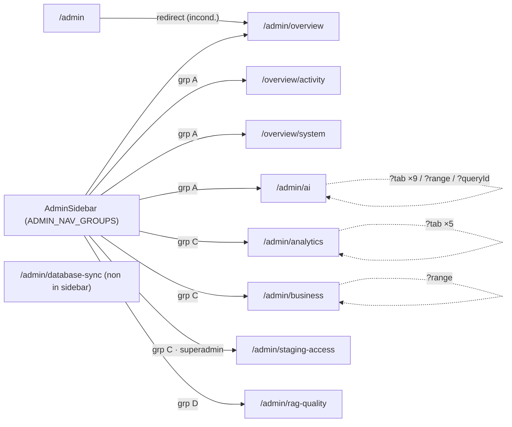

### Admin AI: mission control, config, modelli, strategy, playground, inspector, infra
_Route-group: `admin` · 12 pagine_

#### Tabella route

| Route | Shell | Guardie | Stati principali |
|---|---|---|---|
| `/admin/agents` | AdminShell (`data-theme="dark"`: AppTopBar+MobileTopBar adminMode, AdminSidebar persistente `lg+` / AdminSideDrawer mobile, `main#main-content` in DashboardEngineProvider) via `(dashboard)/layout.tsx` | Server: cookie `meepleai_view_mode==='user'` → `redirect('/')`. Client: `RequireRole(['Admin'])` (redirect `/login?from=` se non-auth, `/` se non admin; superadmin eredita). `PdfProcessingNotifier` montato dal layout | loading · success · empty (`executions.length===0`) · service-health per servizio (healthy/degraded/unreachable/unknown) |
| `/admin/agents/config` | AdminShell (dark) via `(dashboard)/layout.tsx` | Eredita layout (cookie view_mode + `RequireRole(['Admin'])`) | success (tabbed) · loading · unavailable/404 · error · empty · dirty (unsaved changes) |
| `/admin/agents/models` | AdminShell (dark) — Server Component `redirect()`, nessun chrome | Server: `redirect()` in render (precede RequireRole). Eredita comunque layout guard, ma il `redirect()` domina | redirect |
| `/admin/agents/strategy` | AdminShell (dark) — Server Component `redirect()` | Server: `redirect()` immediato. Layout guard ereditato ma dominato | redirect |
| `/admin/agents/templates` | AdminShell (dark) via `(dashboard)/layout.tsx` | Eredita layout (cookie view_mode + `RequireRole(['Admin'])`) | loading (Skeleton grid 3) · unavailable/404 · empty · success (review-grid) · acting (approve/reject) |
| `/admin/agents/usage` | AdminShell (dark) via `(dashboard)/layout.tsx` | Eredita layout (cookie view_mode + `RequireRole(['Admin'])`) | success (tabbed) · loading · unavailable/404 · error (non-404) · empty (token-balance) |
| `/admin/agents/analytics` | AdminShell (dark) via `(dashboard)/layout.tsx` | Eredita layout (cookie view_mode + `RequireRole(['Admin'])`) | success (tabbed) · loading · unavailable/404 · error (Riprova) · empty · trends-placeholder |
| `/admin/agents/infrastructure` | AdminShell (dark) via `(dashboard)/layout.tsx` | Eredita layout (cookie view_mode + `RequireRole(['Admin'])`) + fine-grained `useAdminRole()` → `isSuperAdmin` per gating azioni | success · loading · error (API unreachable + Retry) · detail-open · restart-modal-open · superadmin-gated |
| `/admin/agents/inspector` | AdminShell (dark) via `(dashboard)/layout.tsx` | Eredita layout (cookie view_mode + `RequireRole(['Admin'])`) | loading (10 Skeleton rows) · empty · success · detail-loading · no-trace · auto-refresh ON/OFF |
| `/admin/agents/pipeline` | AdminShell (dark) — Server Component `redirect()` | Server: `redirect()` immediato. Layout guard ereditato ma dominato | redirect |
| `/admin/agents/playground` | AdminShell (dark) via `(dashboard)/layout.tsx` | Eredita layout (cookie view_mode + `RequireRole(['Admin'])`); docstring: "Protected by admin layout (RequireRole([Admin]))" | empty · streaming · error (`playground-error`) · success · debug-visible/hidden |
| `/admin/agents/sandbox` | AdminShell (dark) — Server Component `redirect()` | Server: `redirect()` immediato. Layout guard ereditato ma dominato | redirect |

#### Navigazione in uscita

- **`/admin/agents`**
  - `/admin/agents` -> `/admin/agents/playground` (Quick Action 'Testa Query RAG', `router.push`; posizione 1 quando `errorRate<0.1`)
  - `/admin/agents` -> `/admin/agents/inspector` (Quick Action 'Ispeziona Esecuzioni', `router.push`; promossa a posizione 1 quando `errorRate>=0.1`)
  - `/admin/agents` -> `/admin/agents/inspector` (Link 'Vedi tutte' header Ultime Esecuzioni RAG)
  - `/admin/agents` -> `/admin/agents/usage` (Quick Action 'Report Costi', `router.push`)
  - `/admin/agents` -> `/admin/agents/infrastructure` (Link 'Manage' dentro InfraStatusBar)
  - `/admin/agents` -> `/admin/agents/definitions/create` (Quick Action 'Nuovo Agente', `router.push`; **route fuori cluster**)
- **`/admin/agents/models`**
  - `/admin/agents/models` -> `/admin/agents/config?tab=models` (`redirect()` server, incondizionato)
- **`/admin/agents/strategy`**
  - `/admin/agents/strategy` -> `/admin/agents/config` (`redirect()` server, incondizionato; apre defaultTab 'strategy')
- **`/admin/agents/pipeline`**
  - `/admin/agents/pipeline` -> `/admin/agents/inspector?tab=pipeline` (`redirect()` server, incondizionato)
- **`/admin/agents/sandbox`**
  - `/admin/agents/sandbox` -> `/admin/agents/playground` (`redirect()` server, incondizionato)
- **`/admin/agents/infrastructure`** (edge intra-pagina, non route)
  - `/admin/agents/infrastructure` -> `panel:ServiceDetailPanel` (onClick/keydown Enter|Space su ServiceCard `role=button`, `onSelect`; condizione `selectedService !== null`)
  - `/admin/agents/infrastructure` -> `modal:RestartModal` (onClick azione Restart su ServiceCard; condizione `restartTarget !== null`, bottone abilitato solo se `isSuperAdmin && !cooldown`)
- **`/admin/agents/inspector`** (edge intra-pagina via stato condiviso, non route)
  - `/admin/agents/inspector` -> `state:selectedExecutionId` (onClick riga tabella Esecuzioni → `handleRowClick`; condizione `executions.length>0`)
  - `/admin/agents/inspector` -> `state:selectedExecutionId` (onChange `<select>` Execution Selector tab Pipeline; ricarica Pipeline+Waterfall, non cambia route)

#### Superfici condizionali (show / hide / enable)

##### `/admin/agents`
- Quick Actions (ordine): quando `errorRate>=0.1` `baseActions` riordinato `[inspector, playground, usage, definitions]` (Ispeziona Esecuzioni primo); altrimenti ordine base playground→inspector→usage→definitions — `admin/(dashboard)/agents/page.tsx`
- KPI cards (5: Esecuzioni/Latenza/Error Rate/Token/Costo): `metricsLoading===true` → `<Skeleton>`; altrimenti valori (fallback su metrics undefined: Latenza '—', Token '0', Costo '$0.00'); ogni card mostra `<DeltaBadge>` vs giorno precedente — `admin/(dashboard)/agents/page.tsx`
- DeltaBadge: delta null (`prev===0`) → non renderizzato; `abs<0.5` → '→ stabile'; altrimenti verde/rosso via `isGood` (invert=true su latenza/error/costo ⇒ delta positivo = male) — `admin/(dashboard)/agents/page.tsx`
- Error Rate KPI icon: colore rosso quando `errorRate>=0.05`, altrimenti emerald — `admin/(dashboard)/agents/page.tsx`
- Service Health badge (Embedding): `embeddingError` → 'Irraggiungibile'; `!embeddingInfo` → 'Non Configurato'; `status==='healthy'` → 'Attivo' else 'Degradato' — `admin/(dashboard)/agents/page.tsx`
- Service Health badge (OpenRouter): `!openRouterStatus` → unknown; `isThrottled` → 'Degradato' else 'Attivo' — `admin/(dashboard)/agents/page.tsx`
- Service Health badge (Reranker, Vector DB): sempre 'Non Configurato' (getServiceHealth ritorna unknown) + Info tooltip 'Endpoint di health non ancora disponibile — monitoraggio in arrivo' — `admin/(dashboard)/agents/page.tsx`
- Tooltip Info icon accanto al servizio: renderizzato solo se `svc.tooltip !== null` (Reranker + Vector DB; Embedding e OpenRouter hanno tooltip null) — `admin/(dashboard)/agents/page.tsx`
- Tabella Ultime Esecuzioni RAG: `ragLoading` → 3 Skeleton rows; `executions.length===0` → 'Nessuna esecuzione recente'; altrimenti tabella (Status badge variant 'default' se `status==='ok'` else 'destructive') — `admin/(dashboard)/agents/page.tsx`
- InfraStatusBar (pallini): `isLoading` → LoadingSkeleton 8 pallini pulse + '...'; altrimenti uno StatusDot per servizio (colore per status) + '{healthy}/{total} Healthy' — `apps/web/src/components/admin/infrastructure/InfraStatusBar.tsx`

##### `/admin/agents/config`
- Tabs default: `defaultTab` da `?tab=` (strategy|models|limits) validato via `isValidTab`; valore non valido → 'strategy'. Tab in stato interno (`defaultValue`), NON scrivono URL — `admin/(dashboard)/agents/config/page.tsx`
- AgentStrategyTabContent — EmptyFeatureState (404): mostrato quando `isNotFoundError(matrixError)`, NON esclusivo (renderizzato in aggiunta a overview/config/matrix/mappings) — `admin/(dashboard)/agents/config/AgentStrategyTabContent.tsx`
- AgentStrategyTabContent — Tier Access Matrix: `matrixLoading` → Skeleton; matrix presente → tabella checkbox (`matrix.tiers` × `matrix.strategies`); else 'No data available' — `admin/(dashboard)/agents/config/AgentStrategyTabContent.tsx`
- AgentStrategyTabContent — Reranker model Select: disabled quando `retrievalConfig.rerankerEnabled===false` — `admin/(dashboard)/agents/config/AgentStrategyTabContent.tsx`
- AgentStrategyTabContent — Model Select options: derivate da `PROVIDER_MODELS[provider]` (useAdminConfig 'models' o FALLBACK_PROVIDER_MODELS); `handleProviderChange` resetta model al primo del nuovo provider — `admin/(dashboard)/agents/config/AgentStrategyTabContent.tsx`
- AgentStrategyTabContent — Strategy-Model Mappings: `mappingsLoading` → Skeleton; `modelMappings.length>0` → tabella con bottone 'Edit' (INERTE, nessun onClick); else 'No mappings found' — `admin/(dashboard)/agents/config/AgentStrategyTabContent.tsx`
- AgentStrategyTabContent — Unsaved Changes banner (fixed bottom): mostrato quando `hasUnsavedChanges` (`changedFields>0 || tierAccessChanges.size>0`); 'Save All' persiste solo i `tierAccessChanges` (updateTierStrategyAccess) / 'Discard' (reset + refetch) — `admin/(dashboard)/agents/config/AgentStrategyTabContent.tsx`
- AgentModelsTabContent — Check Now button: disabled quando `checkNow.isPending`; label 'Checking...' con RefreshCw `animate-spin` — `admin/(dashboard)/agents/config/AgentModelsTabContent.tsx`
- AgentModelsTabContent — 404 fallback: EmptyFeatureState quando `isNotFoundError(healthError)` — `admin/(dashboard)/agents/config/AgentModelsTabContent.tsx`
- AgentModelsTabContent — Status Summary (3 card): mostrato solo quando `!healthLoading && !healthError && models.length>0` (Available/Deprecated/Unavailable) — `admin/(dashboard)/agents/config/AgentModelsTabContent.tsx`
- AgentModelsTabContent — feedback banners: `showCheckSuccess` (true su `data.triggered`, cleared dopo 5s con invalidate) → banner verde; `checkNow.isError` → banner rosso 'Failed to trigger availability check' — `admin/(dashboard)/agents/config/AgentModelsTabContent.tsx`
- AgentModelsTabContent — Tabella 'Tracked Models': `healthLoading` → `animate-pulse`; `healthError` → inline 'Failed to load model health data'; `models.length===0` → 'No models tracked yet...'; else ModelHealthTable (refetchInterval 60s) — `admin/(dashboard)/agents/config/AgentModelsTabContent.tsx`
- AgentModelsTabContent — Tabella 'Change History': `historyLoading` → `animate-pulse`; `historyError` → inline 'Failed to load change history'; `changes.length===0` → 'No model changes recorded yet'; else ChangeHistoryTable (refetchInterval 60s, limit 50) — `admin/(dashboard)/agents/config/AgentModelsTabContent.tsx`
- AgentLimitsTabContent — Refresh button: icona RefreshCw (loadLimits) disabled quando loading; icona spin durante loading — `admin/(dashboard)/agents/config/AgentLimitsTabContent.tsx`
- AgentLimitsTabContent — Save button: disabled quando `!isDirty || submitting`; label 'Salvataggio...' con spin — `admin/(dashboard)/agents/config/AgentLimitsTabContent.tsx`
- AgentLimitsTabContent — Alert error/success + validazione: `error!==null` → Alert destructive; `successMsg!==null` → Alert verde; loading → 3 Skeleton; validazione zod inline (`normalTierLimit>=freeTierLimit`, `premiumTierLimit>=normalTierLimit`, min 1); label 'Aggiornato il ...' solo se `limits!==null` — `admin/(dashboard)/agents/config/AgentLimitsTabContent.tsx`

##### `/admin/agents/templates`
- EmptyFeatureState: mostrato quando `isNotFoundError(error)` (endpoint template review non implementato) — `admin/(dashboard)/agents/templates/page.tsx`
- Skeleton grid (3): mostrato quando `isLoading` — `admin/(dashboard)/agents/templates/page.tsx`
- Card 'No templates pending review': `!isLoading && templates?.length===0` (icona Check verde) — `admin/(dashboard)/agents/templates/page.tsx`
- ReviewCard — bottone Approve: disabled quando `isActing` — `admin/(dashboard)/agents/templates/page.tsx`
- ReviewCard — bottone Reject: disabled quando `isActing || notes.trim().length===0` (note obbligatorie) — `admin/(dashboard)/agents/templates/page.tsx`
- ReviewCard — badge tool-type: ogni badge (dice/cards/timers/counters) mostrato solo se count>0; se `toolCount===0` → badge 'No tools configured' — `admin/(dashboard)/agents/templates/page.tsx`
- ReviewCard — descrizione: `template.stateTemplate?.description` renderizzato solo se presente — `admin/(dashboard)/agents/templates/page.tsx`
- React Query retry: disabilitato su `isNotFoundError`, altrimenti fino a 3 — `admin/(dashboard)/agents/templates/page.tsx`

##### `/admin/agents/usage`
- Tabs default: `defaultTab` da `?tab=` (openrouter|token-balance|chat-log); default 'openrouter'. **NON validato**: `?tab` invalido apre tab body vuoto. Stato interno, non scrive URL — `admin/(dashboard)/agents/usage/page.tsx`
- Label 'Aggiornato ...': mostrato solo quando `dataUpdatedAt>0` (formatDistanceToNow, locale it) — `admin/(dashboard)/agents/usage/page.tsx`
- Refresh button: disabled quando `statusLoading`; icona spin quando `statusLoading` — `admin/(dashboard)/agents/usage/page.tsx`
- EmptyFeatureState (OpenRouter tab): mostrato quando `isNotFoundError(error)` — `admin/(dashboard)/agents/usage/page.tsx`
- Error banner `role=alert`: mostrato quando `isError && !isNotFoundError(error)` — `admin/(dashboard)/agents/usage/page.tsx`
- CostBreakdownPanel + RequestTimelineChart: dynamic import `ssr:false` con placeholder `animate-pulse` (h-48); period toggle interno (timeline 24h/7d/30d default 24h, cost 1d/7d/30d default 7d) — `admin/(dashboard)/agents/usage/page.tsx`
- KpiCards / RateLimitGauge / FreeQuotaIndicator / RecentRequestsTable: ricevono `isLoading` dalle query (refetchInterval 30-60s); RecentRequestsTable filtrata da `requestFilters` (source/model/successOnly/page/pageSize) — `admin/(dashboard)/agents/usage/page.tsx`
- TokenBalanceTab (tab token-balance): balance/tier/consumers loading → pulse; dati vuoti → 'No ... data available'; `projectedDaysUntilDepletion` mostrato solo se `!==null`; polling 60s — `admin/(dashboard)/agents/usage/token-balance-tab.tsx`
- ChatHistoryFilters + ChatHistoryTable (tab chat-log): avvolti in Suspense con fallback `animate-pulse` (h-28 / h-600px) — `admin/(dashboard)/agents/usage/page.tsx`
- React Query retry (status): disabilitato su `isNotFoundError`, altrimenti fino a 3 — `admin/(dashboard)/agents/usage/page.tsx`

##### `/admin/agents/analytics`
- Tabs default: `defaultTab` da `?tab=` (overview|top-agents|trends); default 'overview'. **NON validato**: `?tab` invalido apre tab body vuoto — `admin/(dashboard)/agents/analytics/page.tsx`
- Date-range toggle (7d/30d/90d): styling attivo quando `dateRange===range`; ricalcola startDate/endDate via useMemo (subDays) — `admin/(dashboard)/agents/analytics/page.tsx`
- Refresh button: icona RefreshCw → `handleRefresh` (refetchMetrics + refetchTopAgents) — `admin/(dashboard)/agents/analytics/page.tsx`
- EmptyFeatureState (404): mostrato quando `is404(metricsError)`; sibling sopra i Tabs (grafici mostrano 'Nessun dato' con metrics undefined) — `admin/(dashboard)/agents/analytics/page.tsx`
- Error card + Riprova: mostrato quando `!is404(metricsError) && (metricsError || topAgentsError)` — `admin/(dashboard)/agents/analytics/page.tsx`
- Overview tab — UsageChart / CostBreakdownChart: `metricsLoading` → Skeleton; `metrics.usageOverTime` presente → UsageChart else 'Nessun dato disponibile'; `metrics.costBreakdown` presente → CostBreakdownChart else placeholder — `admin/(dashboard)/agents/analytics/page.tsx`
- Top Agents tab — TopAgentsTable + Select sortBy: `topAgentsLoading` → Skeleton; `topAgents.length>0` → TopAgentsTable else 'Nessun agente trovato'; Select sortBy (invocations/cost/confidence) rifetcha — `admin/(dashboard)/agents/analytics/page.tsx`
- Top Queries card: mostrato solo quando `metrics.topQueries?.length>0` — `admin/(dashboard)/agents/analytics/page.tsx`
- Trends tab: sempre EmptyFeatureState 'Trends in arrivo' (placeholder) — `admin/(dashboard)/agents/analytics/page.tsx`
- MetricsKpiCards: renderizzato sempre nell'Overview con `isLoading` (non gated dal 404) — `admin/(dashboard)/agents/analytics/page.tsx`
- React Query retry: disabilitato su status 404 per metrics e topAgents (altrimenti fino a 3) — `admin/(dashboard)/agents/analytics/page.tsx`

##### `/admin/agents/infrastructure`
- InfrastructureDashboard — error state: `error` → banner 'Infrastructure API unreachable' + bottone Retry (refetch) — `apps/web/src/components/admin/infrastructure/InfrastructureDashboard.tsx`
- InfrastructureDashboard — loading: `isLoading` → griglia Skeleton (4 card + barra) — `apps/web/src/components/admin/infrastructure/InfrastructureDashboard.tsx`
- ServiceCard — bottone Health check: disabled quando `!isSuperAdmin || isCheckPending`; tooltip 'Requires SuperAdmin' se `!isSuperAdmin` else 'Run health check'; toast sonner su success/error — `apps/web/src/components/admin/infrastructure/ServiceCard.tsx`
- ServiceCard — bottone Restart: disabled quando `!isSuperAdmin || cooldownActive` (`service.cooldownRemainingSeconds>0`); tooltip 'Requires SuperAdmin' / 'Cooldown: Ns remaining' / 'Restart service' — `apps/web/src/components/admin/infrastructure/ServiceCard.tsx`
- ServiceCard — bottone Configure: disabled quando `!isSuperAdmin`; tooltip 'Requires SuperAdmin' else 'Configure service' → `onConfig` apre ServiceDetailPanel — `apps/web/src/components/admin/infrastructure/ServiceCard.tsx`
- ServiceCard — card cliccabile: intera card `role=button` (onClick + onKeyDown Enter/Space) → `onSelect` apre ServiceDetailPanel; le 3 azioni interne fanno `stopPropagation` — `apps/web/src/components/admin/infrastructure/ServiceCard.tsx`
- ServiceDetailPanel: montato solo quando `selectedService !== null` (inline, chiusura via X); tab Dependencies (`depsLoading` → Loader2 / `deps.length===0` → 'No dependencies found.' / lista DependencyRow) + tab Config — `apps/web/src/components/admin/infrastructure/ServiceDetailPanel.tsx`
- ServiceConfigForm (tab Config): riceve `isSuperAdmin` per gating editing — `apps/web/src/components/admin/infrastructure/ServiceDetailPanel.tsx`
- RestartModal: AlertDialog sempre montato; open quando `restartTarget !== null`; Cancel/Restart disabled quando `isPending`; `onConfirm` → `restart.mutate` (toast, chiude su success) — `apps/web/src/components/admin/infrastructure/RestartModal.tsx`
- PipelineTest: sempre renderizzato sotto la griglia (stato interno) — `apps/web/src/components/admin/infrastructure/PipelineTest.tsx`

##### `/admin/agents/inspector`
- Tabs (activeTab controllato): `defaultTab` da `?tab=` (pipeline|waterfall else 'esecuzioni'); `activeTab` è stato controllato (value/onValueChange), non scrive URL; `selectedExecutionId` condiviso tra i 3 tab — `admin/(dashboard)/agents/inspector/page.tsx`
- Stats Bar (5 KPI): sempre in cima (Esecuzioni/Latenza Media/Errori/Cache Hit/Costo) da `stats` (getRagExecutionStats sul range); ricalcolata su Apply Filters — `admin/(dashboard)/agents/inspector/page.tsx`
- Live header — pallino AUTO: pallino verde pulsante + 'AUTO' mostrati solo quando `autoRefresh===true` — `admin/(dashboard)/agents/inspector/page.tsx`
- Refresh interval select + ON/OFF toggle: select disabled quando `!autoRefresh`; styling verde(ON)/grigio(OFF); polling setInterval (5/10/30s) attivo solo se `autoRefresh` — `admin/(dashboard)/agents/inspector/page.tsx`
- Tabella Esecuzioni: `isLoading` → 10 Skeleton rows; `executions.length===0` → 'No executions found' (+ hint filtri); riga evidenziata quando `selectedExecutionId===execution.id`; ConfidenceBadge solo se `confidence!==null`; auto-seleziona prima esecuzione se nessuna selezionata — `admin/(dashboard)/agents/inspector/page.tsx`
- Bottone Load More: mostrato quando `!isLoading && executions.length < totalCount`; disabled quando `isLoadingMore`; label 'Load More (N remaining)' — `admin/(dashboard)/agents/inspector/page.tsx`
- Filtri (strategy checkbox / status radio / confidence+latency slider / date range) + Apply: Apply resetta `skip=0`/`executions=[]` e rifetcha; strategy applicato solo se `0<len<4`; status inviato solo se `!=='all'`; minConfidence solo se `>0`; maxLatencyMs solo se `<5000` — `admin/(dashboard)/agents/inspector/page.tsx`
- Pipeline tab — Execution Selector `<select>`: dropdown con tutte le executions (label ✓/✗ per `status==='success'`, query, latenza, '(cache)' se cacheHit); onChange reassegna `selectedExecutionId` condiviso — `admin/(dashboard)/agents/inspector/page.tsx`
- Pipeline tab — metadata esecuzione: blocco Agent/Strategy/Total(colore per latenza)/Confidence mostrato solo quando `selectedExecution` definito; confidence se `!==null` — `admin/(dashboard)/agents/inspector/page.tsx`
- Pipeline tab — PipelineDiagram + Timeline: `isLoadingDetail` → Skeleton; `pipelineSteps.length>0` → PipelineDiagram (onNodeClick apre step + scroll) else 'No execution trace available'; `traceSteps>0` → lista TimelineStep (accordion) else 'No step details available' — `admin/(dashboard)/agents/inspector/page.tsx`
- Waterfall tab — WaterfallChart: `isLoadingDetail` → Skeleton; `waterfallCalls.length>0` → WaterfallChart; else `selectedExecutionId? 'No trace data available for this execution' : 'Select an execution from the Esecuzioni tab...'` — `admin/(dashboard)/agents/inspector/page.tsx`

##### `/admin/agents/playground`
- StrategySelectorBar — Game select: opzioni via `fetch .../api/v1/admin/shared-games?page=1&pageSize=100` (credentials include); placeholder 'Loading...'/'Select game'; fail silenzioso — `apps/web/src/components/admin/debug-chat/StrategySelectorBar.tsx`
- StrategySelectorBar — Strategy select: sempre abilitato; opzioni da `RAG_STRATEGIES`; placeholder 'Default'; valore `'__default__'` → strategy undefined — `apps/web/src/components/admin/debug-chat/StrategySelectorBar.tsx`
- StrategySelectorBar — Model select: disabled quando `modelsLoading`; opzione `'__default__'` + modelli da `adminClient.getAiModels({status:'active'})` — `apps/web/src/components/admin/debug-chat/StrategySelectorBar.tsx`
- StrategySelectorBar — Temperature / Top-K inputs: sempre abilitati (temp 0-2 step 0.1, topK 1-20); alimentano `configOverride` quando `temperature!==0.7 || topK!==5` — `apps/web/src/components/admin/debug-chat/StrategySelectorBar.tsx`
- StrategySelectorBar — Re-execute button: disabled quando `isStreaming || !hasLastQuery`; animate-pulse + spin durante streaming — `apps/web/src/components/admin/debug-chat/StrategySelectorBar.tsx`
- StrategySelectorBar — Debug toggle: `aria-pressed=showDebug`; icona PanelRightClose/PanelRight; tooltip 'Nascondi/Mostra pipeline debug' — `apps/web/src/components/admin/debug-chat/StrategySelectorBar.tsx`
- Chat input textarea: disabled quando `!selectedGameId || state.isStreaming`; placeholder 'Fai una domanda...' se gioco selezionato else 'Seleziona prima un gioco'; Enter (no Shift) invia — `admin/(dashboard)/agents/playground/page.tsx`
- Bottone Send vs Stop: Stop (`playground-stop-btn`) quando `state.isStreaming` (stopStreaming); altrimenti Send (`playground-send-btn`) disabled quando `!inputValue.trim() || !selectedGameId` — `admin/(dashboard)/agents/playground/page.tsx`
- Split view chat/debug: `showDebug` (localStorage `playground-debug-panel-visible`, default true) → grid lg 55%/45%; altrimenti singola colonna — `admin/(dashboard)/agents/playground/page.tsx`
- DebugTimeline panel: renderizzato solo quando `showDebug` (desktop `hidden lg:flex` side panel + mobile `lg:hidden` bottom panel max-h-40vh) — `admin/(dashboard)/agents/playground/page.tsx`
- Empty chat prompt: `displayMessages.length===0` → 'Seleziona un gioco e fai una domanda per iniziare...' — `admin/(dashboard)/agents/playground/page.tsx`
- Typing indicator: 3 dot animate-pulse quando content vuoto && `state.isStreaming` (ultimo messaggio assistant) — `admin/(dashboard)/agents/playground/page.tsx`
- statusMessage / error bar: `state.statusMessage` → barra grigia (`bg-muted/30`); `state.error` → barra destructive (`playground-error`) — `admin/(dashboard)/agents/playground/page.tsx`
- configOverride: inviato solo quando `(selectedModel && selectedModel!=='__default__') || temperature!==0.7 || topK!==5`; strategy `'__default__'` → undefined — `admin/(dashboard)/agents/playground/page.tsx`

#### Componenti → file

| Componente | File | Ruolo |
|---|---|---|
| InfraStatusBar | `apps/web/src/components/admin/infrastructure/InfraStatusBar.tsx` | Barra pallini stato servizi + conteggio Healthy + Link 'Manage' a `/admin/agents/infrastructure` |
| DeltaBadge (locale) | `apps/web/src/app/admin/(dashboard)/agents/page.tsx` | Badge ±% delta metriche giorno-su-giorno (invert per latenza/error/costo) |
| KpiCards inline (5) | `apps/web/src/app/admin/(dashboard)/agents/page.tsx` | Esecuzioni/Latenza/Error Rate/Token/Costo con delta vs giorno precedente |
| AgentStrategyTabContent | `apps/web/src/app/admin/(dashboard)/agents/config/AgentStrategyTabContent.tsx` | Config retrieval/generation, tier-access matrix, strategy-model mappings, banner unsaved changes |
| AgentModelsTabContent | `apps/web/src/app/admin/(dashboard)/agents/config/AgentModelsTabContent.tsx` | Model health table + change history + Check Now (polling 60s) |
| AgentLimitsTabContent | `apps/web/src/app/admin/(dashboard)/agents/config/AgentLimitsTabContent.tsx` | Form limiti chat-history per tier (free/normal/premium) con Refresh + Save |
| EmptyFeatureState | `apps/web/src/components/admin/EmptyFeatureState.tsx` | Placeholder 'Funzionalità non disponibile' per endpoint backend 404 (config/templates/usage/analytics) |
| StrategyBadge | `apps/web/src/components/admin/rag/StrategyBadge.tsx` | Badge strategia (mappings + inspector) |
| ReviewCard (locale) | `apps/web/src/app/admin/(dashboard)/agents/templates/page.tsx` | Card review GameToolkitTemplateDto con textarea note + Approve/Reject |
| KpiCards | `apps/web/src/components/admin/usage/KpiCards.tsx` | KPI overview OpenRouter |
| RateLimitGauge | `apps/web/src/components/admin/usage/RateLimitGauge.tsx` | Gauge rate-limit rpm |
| FreeQuotaIndicator | `apps/web/src/components/admin/usage/FreeQuotaIndicator.tsx` | Indicatore quota gratuita |
| RecentRequestsTable | `apps/web/src/components/admin/usage/RecentRequestsTable.tsx` | Tabella richieste recenti con filtri |
| CostBreakdownPanel | `apps/web/src/components/admin/usage/CostBreakdownPanel.tsx` | Breakdown costi (dynamic ssr:false) |
| RequestTimelineChart | `apps/web/src/components/admin/usage/RequestTimelineChart.tsx` | Timeline richieste (dynamic ssr:false) |
| TokenBalanceTab | `apps/web/src/app/admin/(dashboard)/agents/usage/token-balance-tab.tsx` | Saldo token, uso per tier, top consumatori (polling 60s) |
| ChatHistoryFilters / ChatHistoryTable | `apps/web/src/components/admin/agents/chat-history-{filters,table}.tsx` | Filtri + tabella log chat (Suspense) |
| MetricsKpiCards | `apps/web/src/components/admin/agents/MetricsKpiCards.tsx` | KPI metriche agenti (analytics) |
| UsageChart / CostBreakdownChart | `apps/web/src/components/admin/agents/{UsageChart,CostBreakdownChart}.tsx` | Utilizzo nel tempo / costi per modello |
| TopAgentsTable | `apps/web/src/components/admin/agents/TopAgentsTable.tsx` | Tabella top agenti ordinabile |
| InfrastructureDashboard | `apps/web/src/components/admin/infrastructure/InfrastructureDashboard.tsx` | Orchestratore: ServiceGrid + PipelineTest + ServiceDetailPanel + RestartModal |
| ServiceGrid / ServiceCard | `apps/web/src/components/admin/infrastructure/{ServiceGrid,ServiceCard}.tsx` | Griglia + card servizio (uptime/latency/err24h) con azioni gated superadmin |
| ServiceDetailPanel | `apps/web/src/components/admin/infrastructure/ServiceDetailPanel.tsx` | Pannello dettaglio inline: tab dipendenze + tab config form |
| RestartModal | `apps/web/src/components/admin/infrastructure/RestartModal.tsx` | AlertDialog conferma restart servizio |
| PipelineTest | `apps/web/src/components/admin/infrastructure/PipelineTest.tsx` | Test connettività pipeline |
| useAdminRole | `apps/web/src/hooks/useAdminRole.ts` | Fornisce `isSuperAdmin` (useCurrentUser) per gating UI |
| ConfidenceBadge | `apps/web/src/components/admin/rag/ConfidenceBadge.tsx` | Badge confidence score (inspector) |
| WaterfallChart | `apps/web/src/components/admin/rag/WaterfallChart.tsx` | Grafico waterfall chiamate trace |
| PipelineDiagram | `apps/web/src/components/admin/rag/PipelineDiagram.tsx` | Diagramma pipeline interattivo (onNodeClick → apre step + scroll) |
| TimelineStep | `apps/web/src/components/admin/rag/TimelineStep.tsx` | Step accordion timeline con dettagli parsati |
| StrategySelectorBar | `apps/web/src/components/admin/debug-chat/StrategySelectorBar.tsx` | Barra selezione gioco/strategy/model/temp/topK + re-execute + toggle debug |
| DebugTimeline | `apps/web/src/components/admin/debug-chat/DebugTimeline.tsx` | Timeline eventi pipeline debug durante streaming |
| ChatDebugTab (locale) | `apps/web/src/app/admin/(dashboard)/agents/playground/page.tsx` | Chat split-view streaming SSE con re-execute e override parametri |
| useDebugChatStream | `apps/web/src/hooks/useDebugChatStream.ts` | Hook streaming SSE debug-chat (sendMessage/stopStreaming/reset) |

#### Diagramma navigazione interna

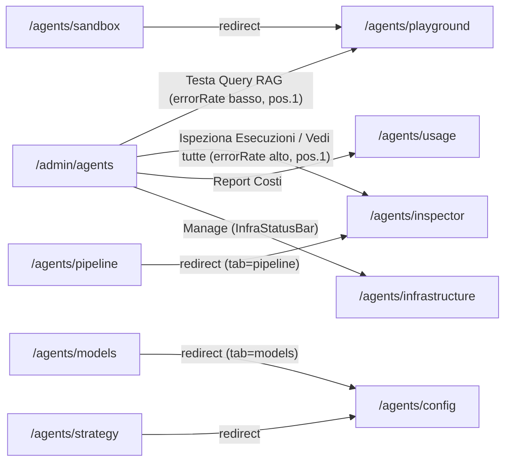

_Nota: `/admin/agents/definitions/create` (Quick Action 'Nuovo Agente') è fuori cluster ed è omesso dal diagramma; `/admin/agents/templates` e `/admin/agents/analytics` non hanno edge di navigazione intra-cluster (raggiungibili solo via sidebar). Gli edge di `infrastructure` e `inspector` verso `panel:`/`modal:`/`state:` sono intra-pagina, non route._

### Admin AI: debug, chat, A/B testing, builder, definizioni agente
_Route-group: `admin` · 13 pagine_

Il cluster è per metà **stub di redirect** server-side (route legacy che collassano su superfici canoniche) e per metà pagine reali attorno alle **agent definitions** (lista, create, edit, detail, playground). Tutte vivono sotto `admin/(dashboard)/layout.tsx` = **AdminShell** (`data-theme=dark`, `AppTopBar` adminMode + `AdminSidebar` `lg+` / `AdminSideDrawer` mobile, `main#main-content`, `DashboardEngineProvider`).

#### Tabella route

| Route | Shell | Guardie | Stati principali |
|---|---|---|---|
| `/admin/agents/debug` | AdminShell (mai renderizzato: SSR `redirect()`) | Layout server: cookie `meepleai_view_mode==='user'` → `redirect('/')`. Client `RequireRole['Admin']` bypassato dallo short-circuit del redirect SSR | redirect immediato server-side (nessun rendering) |
| `/admin/agents/debug-chat` | AdminShell (SSR redirect) | come sopra | redirect immediato server-side |
| `/admin/agents/chat-history` | AdminShell (SSR redirect) | come sopra | redirect immediato server-side |
| `/admin/agents/chat-limits` | AdminShell (SSR redirect) | come sopra | redirect immediato server-side |
| `/admin/agents/ab-testing/[id]` | AdminShell (SSR redirect) | come sopra | redirect immediato server-side ([id] ignorato) |
| `/admin/agents/ab-testing/new` | AdminShell (SSR redirect) | come sopra | redirect immediato server-side |
| `/admin/agents/ab-testing/results` | AdminShell (SSR redirect) | come sopra | redirect immediato server-side |
| `/admin/agents/builder` | AdminShell (SSR redirect) | come sopra | redirect immediato server-side |
| `/admin/agents/definitions` | AdminShell | Layout server view-mode → `/`; Client `RequireRole['Admin']` (superadmin incluso) | loading (`Loading...`) · success (BuilderTable) · empty (nessuna riga) · mutation lifecycle via toast |
| `/admin/agents/definitions/create` | AdminShell | come sopra | idle (form vuoto) · submitting (`Saving...`) · success (toast + push) · error (toast) |
| `/admin/agents/definitions/playground` | AdminShell | come sopra | streaming · loading agenti/giochi · empty (msg/citazioni/scenari/giochi) · guard (no agente → toast) · error |
| `/admin/agents/definitions/[id]` | AdminShell | come sopra | loading (Skeleton) · not-found (`Agent not found`) · success (2 col) · mutation lifecycle |
| `/admin/agents/definitions/[id]/edit` | AdminShell | come sopra | loading (`Loading...`) · not-found · editing/submitting (`Saving...`) · success (toast + push) · error |

#### Navigazione in uscita

- **`/admin/agents/debug`**
  - `→ /admin/agents/inspector` (`redirect()` server-side; incondizionato — legacy → canonica, fuori cluster)
- **`/admin/agents/debug-chat`**
  - `→ /admin/agents/playground?tab=chat` (`redirect()` server-side; incondizionato — playground canonico, ≠ `definitions/playground`)
- **`/admin/agents/chat-history`**
  - `→ /admin/agents/usage?tab=chat-log` (`redirect()` server-side; incondizionato, fuori cluster)
- **`/admin/agents/chat-limits`**
  - `→ /admin/agents/config?tab=limits` (`redirect()` server-side; incondizionato, fuori cluster)
- **`/admin/agents/ab-testing/[id]`**
  - `→ /admin/agents/playground?tab=compare` (`redirect()` server-side; incondizionato — `[id]` NON letto)
- **`/admin/agents/ab-testing/new`**
  - `→ /admin/agents/playground?tab=compare` (`redirect()` server-side; incondizionato)
- **`/admin/agents/ab-testing/results`**
  - `→ /admin/agents/playground?tab=compare` (`redirect()` server-side; incondizionato)
- **`/admin/agents/builder`**
  - `→ /admin/agents/definitions` (`redirect()` server-side; incondizionato — builder consolidato in Definitions, Issue #5110)
- **`/admin/agents/definitions`**
  - `→ /admin/agents/definitions/create` (Button asChild `<Link>` CTA "Create Agent"; incondizionato)
  - `→ /admin/agents/definitions/{id}/edit` (BuilderTable riga → DropdownMenuItem `<Link>` "Modifica"; per ogni riga)
  - `→ Sheet "Strategy Builder"` (modale) (Button outline "Strategy Builder" → `setBuilderOpen(true)`; toggle apertura)
- **`/admin/agents/definitions/create`**
  - `→ /admin/agents/definitions` (`createMutation` onSuccess → `router.push`; dopo creazione riuscita + toast success)
- **`/admin/agents/definitions/playground`**
  - `→ Dialog "New/Edit Scenario"` (modale) (New/Edit2 → `setIsDialogOpen(true)`; solo tab Scenarios con `agentDefinitionId` selezionato)
- **`/admin/agents/definitions/[id]`**
  - `→ /admin/agents/definitions/{id}/edit` (Button asChild `<Link>` "Edit"; incondizionato)
  - `→ /chat/new` (Button asChild `<Link>` "Open Unified Chat"; incondizionato, fuori cluster)
- **`/admin/agents/definitions/[id]/edit`**
  - `→ /admin/agents/definitions` (`updateMutation` onSuccess → `router.push` dopo invalidate; aggiornamento riuscito + toast)

#### Superfici condizionali (show / hide / enable)

##### `/admin/agents/definitions`
- Lista agenti vs testo: `isLoading` (useQuery `agentDefinitionsApi.getAll(filters)`, key `['admin','agent-definitions',filters]`) ? `Loading...` centrato : monta `BuilderTable` (default `agents=[]`) — `apps/web/src/app/admin/(dashboard)/agents/definitions/page.tsx`
- Badge Attivo/Inattivo: mostrato SOLO se `status===2` (Pubblicato); `variant='default'` se `agent.isActive` ("Attivo") altrimenti `outline` ("Inattivo") — `apps/web/src/components/admin/agent-definitions/BuilderTable.tsx`
- Badge stato lifecycle: `0=Bozza`(secondary) / `1=In Test`(outline border-amber-500) / `2=Pubblicato`(default bg-green-600); fallback "Bozza" fuori range — `apps/web/src/components/admin/agent-definitions/BuilderTable.tsx`
- DropdownMenuItem "Avvia Test": se `status===0 && onStartTesting` → `onStartTesting(id)` (`startTestingMutation`) — `apps/web/src/components/admin/agent-definitions/BuilderTable.tsx`
- DropdownMenuItem "Pubblica": se `status===1 && onPublish` → `onPublish(id)` (`publishMutation`) — `apps/web/src/components/admin/agent-definitions/BuilderTable.tsx`
- DropdownMenuItem "Ritira": se `status===2 && onUnpublish` → `onUnpublish(id)` (`unpublishMutation`) — `apps/web/src/components/admin/agent-definitions/BuilderTable.tsx`
- DropdownMenuItem "Modifica"/"Elimina": "Modifica" sempre presente (`<Link>` a `/edit`); "Elimina" sempre presente dopo `DropdownMenuSeparator` (`text-destructive`) → `onDelete(id)` (`deleteMutation` + toast) — `apps/web/src/components/admin/agent-definitions/BuilderTable.tsx`
- BuilderFilters: applica `{activeOnly, search}` solo su click "Apply Filters" o Enter nel campo search; `activeOnly=(activeOnly==='active')`, `search=trim()` — `apps/web/src/components/admin/agent-definitions/BuilderFilters.tsx`
- Sheet "Strategy Builder" → StrategyBuilder: `SheetContent` (side=right, w-800, overflow-y-auto) renderizzato quando `builderOpen===true`; montato via `BuilderClient` con `userTier='Admin'`, `showValidation`, `showConfig`; `SheetTitle` sr-only — `apps/web/src/components/rag-dashboard/builder/StrategyBuilder.tsx`

##### `/admin/agents/definitions/create`
- Button submit: `disabled` se `isLoading` (`createMutation.isPending`) || `disabled`; label "Saving..." se loading altrimenti "Save Agent" — `apps/web/src/components/admin/agent-definitions/AgentBuilderForm.tsx`
- Lista Prompt Templates (field array): empty-state `No prompts added. Click "Add Prompt" to create one.` se `promptFields.length===0`; altrimenti card per prompt (Select role system/user/assistant/function + Textarea content) con Trash; "Add Prompt" appende `{role:'system',content:''}` — `apps/web/src/components/admin/agent-definitions/AgentBuilderForm.tsx`
- Lista Tool Configuration (field array): empty-state `No tools configured. Click "Add Tool" to add one.` se `toolFields.length===0`; "Add Tool" appende `{name:'',settings:{}}` — `apps/web/src/components/admin/agent-definitions/AgentBuilderForm.tsx`
- Validazione zod: `zodResolver(createAgentDefinitionSchema)`, `FormMessage` per campo; bound UI: name 3-100, description max 1000, `maxTokens` slider 100-32000 (step 100), `temperature` slider 0-2 (step 0.1, `toFixed(2)`); `chatLanguage` 13 opzioni (auto+12 lingue), `model` 5 opzioni (gpt-4/gpt-4-turbo/claude-3-opus/claude-3-sonnet/deepseek-chat) — `apps/web/src/components/admin/agent-definitions/AgentBuilderForm.tsx`

##### `/admin/agents/definitions/playground`
- `handleSendMessage` guard agente: se `!selectedAgentId` → `toast.error('Please select an agent first')` e return (nessun POST) — `apps/web/src/app/admin/(dashboard)/agents/definitions/playground/page.tsx`
- Select "Select Agent": hint `(description)` accanto alla label se `selectedAgentId` settato; opzioni mostrano `name + (config.model)` — `apps/web/src/app/admin/(dashboard)/agents/definitions/playground/page.tsx`
- Select "Game Context (RAG)": badge `Active: <title>` se `currentGameId`; item `__none__` sempre presente ("No game, pure LLM"); empty-state `No games available. Upload rulebooks...` se `games.length===0`; ogni gioco marca badge "No RAG" HARDCODED (TODO hasDocuments) — `apps/web/src/app/admin/(dashboard)/agents/definitions/playground/page.tsx`
- Strategy RadioGroup + model config: `STRATEGY_OPTIONS` da `useAdminConfig('strategies')` via `parseConfigValue('strategy_options')`, fallback `FALLBACK_STRATEGY_OPTIONS`; `PROVIDER_MODELS` da `useAdminConfig('models')` via `parseConfigValue('provider_models')`, fallback `FALLBACK_PROVIDER_MODELS` (config API assente/irraggiungibile) — `apps/web/src/app/admin/(dashboard)/agents/definitions/playground/page.tsx`
- Advanced Options (override provider/model): collassabile via `showAdvanced` (ChevronDown ruota); badge "Override active" se `modelOverride||providerOverride`; Select Provider (`__none__`/OpenRouter/Ollama/Anthropic); Select Model Override `disabled` se `!providerOverride`, opzioni da `PROVIDER_MODELS[provider]`; cambio provider azzera `modelOverride` se non valido; Button Reset `disabled` se `!modelOverride && !providerOverride` — `apps/web/src/app/admin/(dashboard)/agents/definitions/playground/page.tsx`
- Textarea "System Message (optional)": sempre visibile; valore da store `systemMessage`, override del system prompt per la sessione — `apps/web/src/app/admin/(dashboard)/agents/definitions/playground/page.tsx`
- ChatInterface empty/streaming/input: `No messages yet. Start a conversation!` se `messages.length===0`; durante `isStreaming` mostra step pipeline + typing indicator; Textarea `disabled` SOLO se `isStreaming`; Button Send `disabled` se `isStreaming || !input.trim()`; Enter (no Shift) invia — `apps/web/src/components/playground/ChatInterface.tsx`
- ChatInterface feedback ThumbsUp/Down: riga metadata+feedback SOLO su `role==='assistant' && message.content`; toggle up/down via `setMessageFeedback` (null se già attivo) — `apps/web/src/components/playground/ChatInterface.tsx`
- ChatInterface follow-up questions: chip SOLO se `followUpQuestions.length>0 && !isStreaming`; `handleFollowUp` return se `isStreaming` — `apps/web/src/components/playground/ChatInterface.tsx`
- Tab RAG → RagContextViewer: empty-state `No RAG context yet` se `citations.length===0`; altrimenti header "N citation(s) retrieved" + badge score-color (`>=0.9` verde / `>=0.7` giallo / else rosso) — `apps/web/src/components/playground/RagContextViewer.tsx`
- Tab Compare → ComparisonView: `toast.error` se `!agentId` o `!question.trim()`; Button Compare `disabled` se `isRunning||!agentId||!question.trim()`; 3 card strategia (RetrievalOnly/SingleModel/MultiModelConsensus) idle/loading/done/error; `bestTokens/bestCost/bestLatency` evidenziati verde (confidence NON evidenziata); Export + Summary table solo se `allDone && doneResults.length>0` — `apps/web/src/components/playground/ComparisonView.tsx`
- Tab Scenarios → ScenarioManager: se `!agentDefinitionId` → `Select an agent to manage test scenarios`; `Loading scenarios...` se loading; empty `No scenarios yet. Create one to get started.`; card con Run/Edit/Delete; Dialog create/edit (title via `editingId`); Button save `disabled` se `isSaving`; `handleSave` valida name+userMessage — `apps/web/src/components/playground/ScenarioManager.tsx`
- Tab Debug → DebugPanel: sempre montato (default tab); 7 sotto-pannelli (Metrics/Cost/Cache/AgentConfig/DataFlow/Network/Console) alimentati da `usePlaygroundStore` (popolati dopo una risposta) — `apps/web/src/components/playground/DebugPanel.tsx`

##### `/admin/agents/definitions/[id]`
- Skeleton di caricamento: `isLoading` (useQuery `getById(agentId)`, enabled `!!agentId`) → Skeleton header (h-12 w-64) + 2 blocchi h-400 — `apps/web/src/app/admin/(dashboard)/agents/definitions/[id]/page.tsx`
- Card "Agent not found": mostrato se `!agent` dopo load — `apps/web/src/app/admin/(dashboard)/agents/definitions/[id]/page.tsx`
- Badge stato + Active/Inactive: `getStatusBadge`: 0 Draft(secondary)/1 Testing(outline ambra)/2 Published(default verde), fallback "Draft"; Active(default)/Inactive(secondary) da `agent.isActive` — `apps/web/src/app/admin/(dashboard)/agents/definitions/[id]/page.tsx`
- Bottone "Start Testing": se `status===0` → `startTestingMutation.mutate(agentId)`; `disabled` se `isLifecycleLoading` — `apps/web/src/app/admin/(dashboard)/agents/definitions/[id]/page.tsx`
- Bottone "Publish": se `status===1` (`publishMutation`); `disabled` se `isLifecycleLoading` — `apps/web/src/app/admin/(dashboard)/agents/definitions/[id]/page.tsx`
- Bottone "Unpublish": se `status===2` (`unpublishMutation`); `disabled` se `isLifecycleLoading` — `apps/web/src/app/admin/(dashboard)/agents/definitions/[id]/page.tsx`
- Configuration → campo Strategy: valore statico HARDCODED "POC Strategy" (non deriva dai dati); Model/Temperature/Max Tokens da `agent.config` — `apps/web/src/app/admin/(dashboard)/agents/definitions/[id]/page.tsx`
- Sezione System Prompts: mostrata solo se `agent.prompts?.length>0`; render dei primi 2 (`slice(0,2)`) — `apps/web/src/app/admin/(dashboard)/agents/definitions/[id]/page.tsx`
- Channel Configuration (WebSocket): toggle Enable/Disable su `channelEnabled` (stato locale, default false); se enabled mostra `ws://localhost:8080/channel/{agentId}` + Auth Key + Badge "Connected"; se disabled `Enable channel to use WebSocket features` — `apps/web/src/app/admin/(dashboard)/agents/definitions/[id]/page.tsx`
- Card "Agent Chat" (migrato): contenuto statico `Agent chat has been migrated to the unified chat system.` + Button link a `/chat/new` (nessuna chat inline) — `apps/web/src/app/admin/(dashboard)/agents/definitions/[id]/page.tsx`

##### `/admin/agents/definitions/[id]/edit`
- "Loading..." fetch agente: `isLoading` (useQuery `getById(params.id)`, key `['admin','agent-definitions',params.id]`) → "Loading..." centrato — `apps/web/src/app/admin/(dashboard)/agents/definitions/[id]/edit/page.tsx`
- "Agent not found": mostrato se `!agent` dopo load — `apps/web/src/app/admin/(dashboard)/agents/definitions/[id]/edit/page.tsx`
- AgentBuilderForm precompilato: `defaultValues` mappati da agent (name/description/model=`config.model`/maxTokens/temperature/prompts/tools); submit → `updateMutation`; Button "Saving..." se `updateMutation.isPending` — `apps/web/src/components/admin/agent-definitions/AgentBuilderForm.tsx`

#### Componenti → file

| Componente | File | Ruolo |
|---|---|---|
| BuilderFilters | `apps/web/src/components/admin/agent-definitions/BuilderFilters.tsx` | Barra filtri search + stato (all/active/inactive) con "Apply Filters" |
| BuilderTable | `apps/web/src/components/admin/agent-definitions/BuilderTable.tsx` | DataTable (TanStack) delle definitions con badge stato/active e dropdown azioni lifecycle |
| AgentBuilderForm | `apps/web/src/components/admin/agent-definitions/AgentBuilderForm.tsx` | Form react-hook-form (name/description/chatLanguage/model/maxTokens+temperature slider, field array prompts/tools); condiviso create+edit |
| BuilderClient | `apps/web/src/app/admin/(dashboard)/agents/builder/BuilderClient.tsx` | Wrapper che monta StrategyBuilder `userTier='Admin'`; riusato dallo Sheet di Definitions (non dalla route stub) |
| StrategyBuilder | `apps/web/src/components/rag-dashboard/builder/StrategyBuilder.tsx` | Canvas pipeline RAG (palette/canvas/config/validation/test) |
| Sheet / SheetContent / SheetTitle | `apps/web/src/components/ui/navigation/sheet.tsx` | Slide-over destro (w-800) che ospita il builder |
| ChatInterface | `apps/web/src/components/playground/ChatInterface.tsx` | Colonna chat (col-span-2) streaming SSE via ReactMarkdown, feedback thumbs, follow-up, typing indicator |
| DebugPanel | `apps/web/src/components/playground/DebugPanel.tsx` | Tab Debug: aggrega 7 sotto-pannelli (metrics/cost/cache/agent-config/dataflow/network/console) |
| RagContextViewer | `apps/web/src/components/playground/RagContextViewer.tsx` | Tab RAG: citazioni recuperate con score-color e snippet |
| ComparisonView | `apps/web/src/components/playground/ComparisonView.tsx` | Tab Compare: 3 strategie in parallelo (`Promise.allSettled`), confronta metriche — assorbe l'A/B testing |
| ScenarioManager | `apps/web/src/components/playground/ScenarioManager.tsx` | Tab Scenarios: CRUD scenari di test (useQuery + mutation) + Run |
| usePlaygroundStore | `apps/web/src/stores/playground-store.ts` | Zustand store condiviso (messages, systemMessage, currentGameId, strategy, override, citations, follow-up, metadata debug) |
| playground-sse-parser | `apps/web/src/lib/agent/playground-sse-parser.ts` | Parser chunk SSE (onToken/onStateUpdate/onCitations/onFollowUpQuestions/onComplete/onError/onHeartbeat) |
| useAdminConfig / parseConfigValue | `apps/web/src/hooks/useAdminConfig.ts` | Config dinamica strategies/models con fallback a costanti locali |
| Card / Badge / Skeleton / Separator / Button | `apps/web/src/components/ui/{data-display/card,data-display/badge,feedback/skeleton,navigation/separator,primitives/button}.tsx` | Primitive UI per detail (sezioni, stato lifecycle, loading, azioni) |

#### Diagramma navigazione interna

I 7 stub di redirect escono dal cluster (verso `inspector`, `playground` canonico, `usage`, `config`) tranne `builder → definitions`. Il sottografo reale è quello delle definitions.

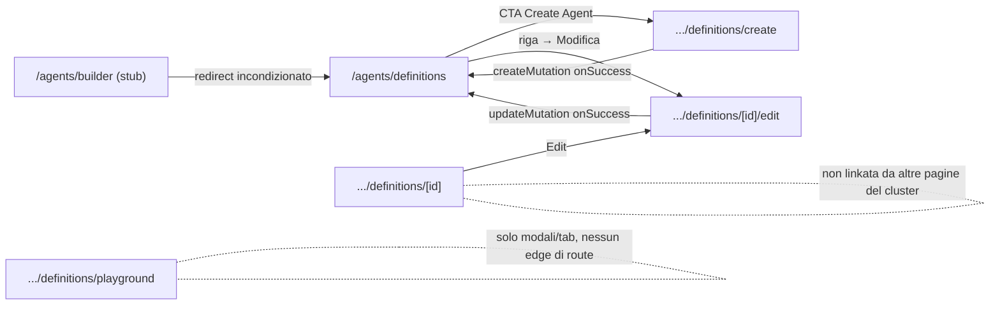

### Admin Knowledge Base: documenti, embedding, queue, vettori, RAG pipeline, snapshot
_Route-group: `admin` · 13 pagine_

Tutte le pagine condividono la stessa **shell** e le stesse **guardie** (salvo dettagli extra sulla Explorer, riportati nella tabella):
- **Shell**: `AdminShell` (`components/layout/AdminShell/AdminShell.tsx`) via `admin/(dashboard)/layout.tsx` — `div[data-admin-shell][data-theme=dark]`, `AppTopBar`+`MobileTopBar` (adminMode) · `AdminSidebar` (lg+) · `main#main-content` in `DashboardEngineProvider` · `AdminSideDrawer` (hamburger mobile). `PdfProcessingNotifier` è montato dal **layout** (fratello di `AdminShell`, dentro `RequireRole`), non da `AdminShell`.
- **Guardie**: Server (`layout.tsx`) `readViewModeCookieServer()` → cookie `meepleai_view_mode==='user'` → `redirect('/')` prima del render (no flash). Client `RequireRole` `allowedRoles=['Admin']` → `getCurrentUser()`; !success → `router.replace('/login?from=…')`; authz = `isSuperAdmin || allowedRoles.some(lowercase===userRole)` (NO gerarchia: editor/user falliscono) altrimenti `router.replace('/')`. Nessun `middleware.ts`.

#### Tabella route

| Route | Shell | Guardie | Stati principali |
|---|---|---|---|
| `/admin/knowledge-base` (KB Explorer master-detail) | AdminShell (dark) | Server cookie-gate + Client `RequireRole ['Admin']` (no hierarchy; superadmin passa; nessun middleware) | loading · error · detail-empty · detail-loading · detail-locked (423) · detail-ready (200) |
| `/admin/knowledge-base/documents` (Documents Library) | AdminShell (dark) | Server cookie-gate + `RequireRole ['Admin']` | loading (skeleton rows) · empty (filtered/vuoto) · error · success |
| `/admin/knowledge-base/embedding` (Embedding Service) | AdminShell (dark) | Server cookie-gate + `RequireRole ['Admin']` | loading · success ('—' se dati mancanti) |
| `/admin/knowledge-base/feedback` (Feedback KB Utenti) | AdminShell (dark) | Server cookie-gate + `RequireRole ['Admin']` | initial (no UUID→niente pannello) · loading · empty · list |
| `/admin/knowledge-base/games` (KB per Gioco) | AdminShell (dark) | Server cookie-gate + `RequireRole ['Admin']` | loading · error · empty · list · tab-none (GamesWithoutKbSection) |
| `/admin/knowledge-base/pipeline` (RAG Pipeline overview) | AdminShell (dark) | Server cookie-gate + `RequireRole ['Admin']` | loading · empty (no pipeline/metrics) · success |
| `/admin/knowledge-base/processing` (Pipeline Status) | AdminShell (dark) | Server cookie-gate + `RequireRole ['Admin']` | loading · error · success · no-data |
| `/admin/knowledge-base/queue` (Processing Queue) | AdminShell (dark) | Server cookie-gate + `RequireRole ['Admin']` | loading (list/detail skeleton) · empty (no jobs/nessun job selezionato) · success |
| `/admin/knowledge-base/rag-pipeline` (RAG Pipeline unified, tabs) | AdminShell (dark) | Server cookie-gate + `RequireRole ['Admin']` | per-tab: loading / empty / success |
| `/admin/knowledge-base/settings` (KB Settings + RAG Enhancements + Danger Zone) | AdminShell (dark) | Server cookie-gate + `RequireRole ['Admin']` | loading · unavailable (!settings) · success |
| `/admin/knowledge-base/snapshots` (KB Snapshots) | AdminShell (dark) | Server cookie-gate + `RequireRole ['Admin']` | loading · error · empty · list |
| `/admin/knowledge-base/upload` (Upload & Process) | AdminShell (dark) | Server cookie-gate + `RequireRole ['Admin']` | loading (Suspense) · idempotency-warning · upload progress · queue empty/error/list |
| `/admin/knowledge-base/vectors` (Vector Store pgvector) | AdminShell (dark) | Server cookie-gate + `RequireRole ['Admin']` | loading · error · empty (no vectors) · search-empty · success |

#### Navigazione in uscita

- **`/admin/knowledge-base`** (Explorer)
  - `/admin/knowledge-base` → `?doc=<id>` (`router.replace`; click treeitem doc in `KbTree`)
  - `/admin/knowledge-base` → `?doc=<id>&tab=overview|ingestion|used-by|preview|quality` (Link tab in `KbDocDetailTabs`; doc selezionato)
  - `/admin/knowledge-base` → `?doc=<id>&tab=used-by` (Link '🔗 Agent' in `KbDocActions`; doc selezionato)
  - → download PDF `api.pdf.getPdfDownloadUrl(docId)` (`<a download> ⤓ Download` in `KbDocActions`; ungated qualsiasi status)
  - → modal `DocumentEmbeddingsDrawer` (Sheet right w-720) ('📋 View embeddings'; `processingStatus==='ready'`)
  - → download JSON chunks (`downloadAsFile <fileName>-chunks.json`; '↧ Export chunks'; `ready && !exportPending`)
  - → download JSON (`getDocumentChunksExportUrl(docId)`; '⤓ Export chunks JSON' footer drawer; `meta.status==='success'`)
  - → modal `AdminConfirmationDialog` (Level2 typed-confirm phrase=fileName) → delete (`useDeleteKbDoc`) ('🗑 Elimina')
  - → reindex POST (toast, no nav; `KbReindexDropdown` ⟳ Re-index / item versione; non processing/queued)
- **`/admin/knowledge-base/documents`**
  - → modal `AlertDialog` 'Purge Stale' (`purgeStaleDocuments`: mark stuck>24h as failed)
  - → modal `AlertDialog` 'Cleanup Orphans' (`cleanupOrphans`: delete orphan chunks, irreversibile)
  - → modal `AlertDialog` bulk delete N (`bulkDeletePdfs`; `selectedIds.length>0`)
  - → modal `AlertDialog` delete singolo (`bulkDeletePdfs [id]`; row trash)
  - → reindex POST (`reindexPdf`, no nav; row RotateCcw; non mentre pending)
- **`/admin/knowledge-base/embedding`**
  - → nessuna nav in uscita — solo Refresh (`refetchInfo+refetchMetrics`)
- **`/admin/knowledge-base/games`**
  - `/admin/knowledge-base/games` → `/admin/knowledge-base/games/<gameId>` (Link 'Documenti' per riga; *route dinamica fuori cluster*)
  - `/admin/knowledge-base/games` → `/admin/knowledge-base/snapshots?gameId=<gameId>` (Link 'Snapshot'; `kbStatus!=='none'`)
  - `/admin/knowledge-base/games` → `/admin/knowledge-base/upload?gameId=<gameId>` (Link 'Carica PDF'; `kbStatus==='none'`)
  - → modal/slide-over `UploadForGameDrawer` (CTA 'Aggiungi PDF' su card; `filter==='none'`)
  - `/admin/knowledge-base/games` → `/admin/knowledge-base/upload?gameId=<gameId>` (`<a href>` 'Apri flusso di upload' dentro drawer; game selezionato)
- **`/admin/knowledge-base/queue`**
  - `/admin/knowledge-base/queue` → `/admin/shared-games/<gameId>` (back-arrow toolbar; `?gameId` presente; *fuori cluster*)
  - `/admin/knowledge-base/queue` → `/admin/knowledge-base/upload` (o `?gameId=`) (Link 'Add PDF')
  - `/admin/knowledge-base/queue` → `/admin/games/<flowGameId>/agent/test?flow=embedding&gameName=<gameName>` (Link 'Testa Agent →' in `JobDetailPanel`; `job.status==='Completed' && ?gameId`; *fuori cluster*)
  - → reindex/cancel/retry/remove (no nav, toast; `JobDetailPanel`/`BulkActionsBar`; gating per stato)
- **`/admin/knowledge-base/rag-pipeline`**
  - → tab locale `upload-queue|history|embedding|config` (`TabsTrigger`; stato Tabs, non route, nessun `?tab=`)
  - `/admin/knowledge-base/rag-pipeline` → `/admin/knowledge-base/documents?highlight=<documentId>` (`router.push` da `UploadZone.handleEnqueueError`, toast + setTimeout 2s; enqueue fallito)
- **`/admin/knowledge-base/settings`**
  - → inline-confirm 'Rebuild Vector Index' (in realtà rifetcha `getVectorStats` — placeholder; 'Rebuild Index')
  - → inline-confirm 'Clear KB Cache' (`clearKBCache`; 'Clear Cache')
  - → toggle RAG enhancement (POST `/rag-enhancements/{flag}/toggle` + `/{flag}/tier/{tier}/toggle`, no nav; Switch global/per-tier)
- **`/admin/knowledge-base/snapshots`**
  - → modal `AlertDialog` 'Ripristina snapshot' (`importKbSnapshot rag-exports/<id>`; button 'Ripristina' su `SnapshotCard`)
  - → modal `AlertDialog` 'Elimina snapshot' (`deleteKbSnapshot`; button trash; `!isLatest`)
  - → crea nuovo snapshot (`exportKbSnapshot` poi refetch; 'Nuovo snapshot')
- **`/admin/knowledge-base/upload`**
  - `/admin/knowledge-base/upload` → `/admin/knowledge-base/documents?highlight=<documentId>` (`router.push` da `UploadZone.handleEnqueueError` setTimeout 2s; enqueue fallito)
  - `/admin/knowledge-base/upload` → `/admin/knowledge-base/snapshots` (Link 'Ripristina da snapshot' in `KbIdempotencyGuard`; `gameStatus.hasAutoBackup`)
  - `/admin/knowledge-base/upload` → `/admin/knowledge-base/queue` (`<a href>` 'Vedi tutti i N job →' in `ProcessingQueue` mini; `data.total>10`)

_Route senza edge di uscita: `feedback`, `pipeline`, `processing`, `vectors`._

#### Superfici condizionali (show / hide / enable)

#### `/admin/knowledge-base` (Explorer)
- `KbTree` doc per gioco: lazy-fetch SOLO all'espansione (`expandedGameIds.has(gameId)`); durante fetch 'Caricamento documenti…' — `components/admin/knowledge-base/explorer/KbTree.tsx`
- `KbTree` filter: filtra game per `gameName`; dentro game espanso filtra doc per `title` (empty filtrato → 'Nessun documento corrispondente'; empty non filtrato → 'Nessun documento') — `components/admin/knowledge-base/explorer/KbTree.tsx`
- `KbDocDetailPanel` 4 stati: `docId===null` → placeholder 'Seleziona un documento'; `isLoading` → skeleton; `status==='locked'` (HTTP 423) → banner 'Documento in elaborazione' + action-bar; `status==='ready'` → hero+chunks; altrimenti (404/unknown) → null — `components/admin/knowledge-base/explorer/KbDocDetailPanel.tsx`
- `KbDocDetailPanel` locked (423) overrides: tab 'used-by' rende `UsedByPanel` (indipendente da readiness); tab 'preview' rende `KbDocPreviewPanel` (download non gated); overview/ingestion → slim hero + `KbDocActions` reachable (critico per doc failed) + processing notice — `components/admin/knowledge-base/explorer/KbDocDetailPanel.tsx`
- `activeTab` derivato da `?tab=` (overview default | ingestion | used-by | preview | quality) — `components/admin/knowledge-base/explorer/KbDocDetailPanel.tsx`
- `QualityTabPanel` gating: `hasOverrideCostCapPermission = isAdminOrAbove(currentUser.data)` — toggle override cost-cap solo admin/superadmin — `components/admin/knowledge-base/explorer/KbDocDetailPanel.tsx`
- `KbDocActions` '📋 View embeddings': disabled a meno che `processingStatus==='ready'` — `components/admin/knowledge-base/explorer/actions/KbDocActions.tsx`
- `KbDocActions` '↧ Export chunks': disabled a meno che `processingStatus==='ready' && !exportPending` — `components/admin/knowledge-base/explorer/actions/KbDocActions.tsx`
- `KbReindexDropdown` (split-button): body+caret disabled se `processingStatus==='processing'||'queued'` o `reindex.isPending`; caret ANCHE disabled mentre `versionsQuery.isLoading` — `components/admin/knowledge-base/explorer/actions/KbReindexDropdown.tsx`
- Delete dialog warning (lazy agent count): `useKbDocConsumingAgents` fetch solo quando `deleteOpen`; 'Caricamento…' → 'Referenziato da N agent — verranno scollegati' / 'Nessun agent…' — `components/admin/knowledge-base/explorer/actions/KbDocActions.tsx`
- hero meta (overview): `indexerVersion` badge nascosto se null; last-reindex footer sempre (fallback '📤 upload only'); Size '—' se `fileSize` undefined; 'Carica altri' solo se `chunksQuery.hasNextPage` — `components/admin/knowledge-base/explorer/KbDocDetailPanel.tsx`
- `DocumentEmbeddingsDrawer` (Sheet): returns null se `!docId||!docFileName`; metaState loading/not-indexed(404)/error/success; `EmbeddingsSearchPanel` montato solo su success; footer Export disabled unless success — `components/admin/knowledge-base/document-embeddings-drawer/document-embeddings-drawer.tsx`

#### `/admin/knowledge-base/documents`
- Bulk delete + select-all: bulk-delete solo se `selectedIds.length>0`; header checkbox checked se `selectedIds.length===filteredItems.length` — `admin/(dashboard)/knowledge-base/documents/page.tsx`
- Storage Health bar: renderizzata solo se `storageHealth` caricato; badge `overallHealth` 'Healthy'→verde altrimenti destructive; Vectors 'Unavailable' se `!vectorStore.isAvailable` — `admin/(dashboard)/knowledge-base/documents/page.tsx`
- Error banner + Retry: se query error (`error.message` + Retry→refetch) — `admin/(dashboard)/knowledge-base/documents/page.tsx`
- Table body: `isLoading` → 5 skeleton rows; `filteredItems.length===0` → 'No documents match your filters' se search/filter attivi altrimenti 'No documents uploaded yet'; else rows — `admin/(dashboard)/knowledge-base/documents/page.tsx`
- Row error detail: blocco (`errorCategory`+`processingError`+`retryCount`) solo se `processingState==='Failed' && processingError` — `admin/(dashboard)/knowledge-base/documents/page.tsx`
- Status filter + client search: Select (all/Pending/Processing/Completed/Failed) → refetch server (state param); search filtra client su `fileName`/`gameTitle`; entrambi resettano `page=1` — `admin/(dashboard)/knowledge-base/documents/page.tsx`
- Pagination: solo se `totalPages>1`; prev disabled `page<=1`, next disabled `page>=totalPages` — `admin/(dashboard)/knowledge-base/documents/page.tsx`
- Reindex per-row: disabled mentre `reindexMutation.isPending` — `admin/(dashboard)/knowledge-base/documents/page.tsx`
- Analytics cards: Total/Completed/Processing (somma Processing+Extracting+Chunking+Embedding)/Storage; fallback '—' se distribution/storageHealth mancanti — `admin/(dashboard)/knowledge-base/documents/page.tsx`

#### `/admin/knowledge-base/embedding`
- `StatusBadge`: `status` 'healthy'/'ok' → 'Healthy' (entity-toolkit); 'unavailable'/'unhealthy' → 'Unavailable' (entity-event); altro → amber con testo status — `admin/(dashboard)/knowledge-base/embedding/page.tsx`
- Service Status panel: `infoLoading` → skeleton h-32; altrimenti Model/Device/Dimensions/Languages + Max Input/Max Batch/Auto-refresh (fallback '—') — `admin/(dashboard)/knowledge-base/embedding/page.tsx`
- Throughput Metrics grid: `metricsLoading` → 6 KpiSkeleton; Failure Rate colorata entity-event se `failureRate>5` altrimenti entity-toolkit; qui `failureRate` reso come `${x}%` RAW (diverge dall'`EmbeddingTab` in `/rag-pipeline` che moltiplica *100) — `admin/(dashboard)/knowledge-base/embedding/page.tsx`
- Auto-refresh: `refetchInterval` 30s su info+metrics — `admin/(dashboard)/knowledge-base/embedding/page.tsx`

#### `/admin/knowledge-base/feedback`
- `KbFeedbackPanel` gate: montato SOLO se `gameId` matcha `/^[0-9a-f-]{36}$/i` (UUID); altrimenti nessun pannello — `admin/(dashboard)/knowledge-base/feedback/page.tsx`
- Outcome filter (Tutti/Utili/Non utili): filtra query (undefined|helpful|not_helpful); reset `page=1` al cambio filtro e al cambio `gameId` prop (#1665 useEffect) — `components/admin/knowledge-base/kb-feedback-panel.tsx`
- Feedback item styling: `helpful` → ThumbsUp + border/badge entity-toolkit; else ThumbsDown + entity-event; commento solo se `item.comment` — `components/admin/knowledge-base/kb-feedback-panel.tsx`
- Loading/Empty/Pagination: `isLoading` → skeleton h-48; vuoto+!loading → 'Nessun feedback trovato'; pagination solo se `total>20` (prev disabled `page===1`, next disabled `page*20>=total`) — `components/admin/knowledge-base/kb-feedback-panel.tsx`

#### `/admin/knowledge-base/games`
- Filter tabs (all/complete/partial/none): 4 button-stat impostano `filter`; tab attivo evidenziato (border-blue); conteggi live da items — `admin/(dashboard)/knowledge-base/games/page.tsx`
- Body switch su filter: `filter==='none'` → `GamesWithoutKbSection` (grid MeepleCard) al posto della lista; altrimenti isLoading→6 skeleton, error→'Errore nel caricamento dei dati', filtered vuoto→'Nessun gioco trovato', else lista `GameKbRow` — `admin/(dashboard)/knowledge-base/games/page.tsx`
- `GameKbRow`: riga doc-count/chunks nascosta se `kbStatus==='none'`; last-indexed solo md+; badge '✓ Backup' solo lg+ e se `hasAutoBackup`; Link 'Snapshot' solo se `kbStatus!=='none'`; Link 'Carica PDF' solo se `kbStatus==='none'` — `admin/(dashboard)/knowledge-base/games/page.tsx`
- `KbStatusBadge`: complete→emerald 'Completa'; partial→amber 'Parziale'; none→muted 'Nessuna KB' — `admin/(dashboard)/knowledge-base/games/page.tsx`
- `UploadForGameDrawer` (Sheet right): open quando `uploadTarget!==null`; ritorna null se game null; MeepleCard preview + CTA hand-off — `components/admin/knowledge-base/upload-for-game-drawer.tsx`
- `GamesWithoutKbSection` cards: isLoading → 10 MeepleCardSkeleton; vuoto → 'Tutti i giochi hanno una KB attiva'; per-card `failedPdfCount>0` → status='failed' + badge 'N fallito/falliti' + AlertCircle; paginazione se `totalPages>1`; search reset `page=1` — `components/admin/knowledge-base/games-without-kb-section.tsx`

#### `/admin/knowledge-base/pipeline`
- `RAGPipelineFlow`: isLoading → skeleton; ogni stage cliccabile → drill-down (`expandedStage`) con metriche o 'No detailed metrics available'; dot/border color per status (healthy/warning/error); Distribution Stats solo se `distribution` presente; Recent Activity vuota → 'No recent processing activity'; auto-refresh 30s — `components/admin/knowledge-base/rag-pipeline-flow.tsx`
- `ProcessingMetrics`: isLoading → skeleton; `!metrics` → 'Nessuna metrica di elaborazione disponibile'; bottleneck step (max p95) evidenziato in card+tabella; `durationColor` amber≥30s / red≥120s; auto-refresh 60s — `components/admin/knowledge-base/processing-metrics.tsx`

#### `/admin/knowledge-base/processing`
- `ProcessingPipelineClient` stati: isLoading → skeleton grid; error → Alert destructive; health presente → 3 SummaryCard + Stage Health (empty→'No stage data available.') + Document Distribution; Recent Activity solo se `health.recentActivity.length>0`; tabella step durations solo se `metrics && Object.keys(averages).length>0`; nessun dato (`!health && !metrics`) → 'No pipeline data available.' — `admin/(dashboard)/knowledge-base/processing/components/processing-pipeline-client.tsx`
- `StageCard` status: statusIcon/statusBadge per healthy(verde)/warning(amber)/error(rosso) — `admin/(dashboard)/knowledge-base/processing/components/processing-pipeline-client.tsx`
- `lastRefreshed`: timestamp mostrato solo dopo primo fetch; refresh manuale (nessun `refetchInterval`) — `admin/(dashboard)/knowledge-base/processing/components/processing-pipeline-client.tsx`

#### `/admin/knowledge-base/queue`
- `selectedJobId` seeding: `?jobId` (highlightJobId) → `setSelectedJobId` on mount; se manca jobId ma c'è `?documentId` → `filters.search=documentId` per far affiorare il job dell'upload — `admin/(dashboard)/knowledge-base/queue/components/queue-dashboard-client.tsx`
- Toolbar back-link: back-arrow + 'Processing jobs for selected game' solo se `gameId` presente — `admin/(dashboard)/knowledge-base/queue/components/queue-dashboard-client.tsx`
- SSE vs polling: `useQueueSSE`/`useJobSSE`; se connesso polling react-query ridotto; `SSEConnectionIndicator` con reconnect — `admin/(dashboard)/knowledge-base/queue/components/queue-dashboard-client.tsx`
- `QueueControlBar`: Pause/Resume toggle ('Pause Queue'/'Resume Queue'); badge 'Paused' se `config.isPaused`; worker Slider 1-10 (`onValueCommit`); badge 'Backpressure' se `status.isUnderPressure`; depth/threshold; ETA solo se `estimatedWaitMinutes>0` — `admin/(dashboard)/knowledge-base/queue/components/queue-control-bar.tsx`
- `JobDetailPanel`: job null & !loading → 'Select a job to view details'; loading → skeleton; azioni gated: Cancel se Queued/Processing, Retry se Failed && canRetry, Remove(AlertDialog) se Failed||Cancelled, 'Testa Agent' se Completed && `?gameId`; ChunkPreviewTab se `job.pdfDocumentId && hasPassedChunking`; errorMessage box se presente — `admin/(dashboard)/knowledge-base/queue/components/job-detail-panel.tsx`
- `BulkActionsBar`: 'Reindex All Failed' → AlertDialog (`bulkReindexFailed`, Low priority); button disabled/label 'Reindexing...' mentre pending — `admin/(dashboard)/knowledge-base/queue/components/bulk-actions-bar.tsx`
- `QueueFiltersBar`: barra filtri (status/search/page) sempre montata sopra la grid; `onFiltersChange` resetta selezione lista — `admin/(dashboard)/knowledge-base/queue/components/queue-filters.tsx`
- `QueueAlertsBanner`/`QueueCapacityIndicator`/`QueueStatsBar`/`MetricsDashboard`: banner alert proattivi (#5460), capacità, stats aggregate, metriche — sempre montati — `admin/(dashboard)/knowledge-base/queue/components/queue-dashboard-client.tsx`

#### `/admin/knowledge-base/rag-pipeline`
- Tabs: `activeTab` locale default 'upload-queue'; 4 tab (Upload & Coda / Storico & Analytics / Embedding Service / Configurazione); nessun `?tab=` in URL — `admin/(dashboard)/knowledge-base/rag-pipeline/components/rag-pipeline-client.tsx`
- `UploadAndQueueTab`: stats bar (queued/processing/completed24h/failed/ETA drain); `UploadZone` (game selector obbligatorio, no `initialGameId`); `QueueFiltersBar`+`BulkActionsBar`+`SSEConnectionIndicator`; `QueueETASidebar` in `<aside class='hidden lg:block'>` (solo lg+); `QueueList` — `admin/(dashboard)/knowledge-base/rag-pipeline/components/upload-and-queue-tab.tsx`
- `ConfigTab`: isLoading → spinner; Queue Status Active/Paused (accent amber se paused); campo 'Updated By' solo se `config.updatedBy` presente — `admin/(dashboard)/knowledge-base/rag-pipeline/components/config-tab.tsx`
- `HistoryTab`: distribution loading → spinner; distribution vuota → 'No distribution data available'; completed jobs vuoti → 'No completed jobs yet'; paginazione se `totalPages>1` — `admin/(dashboard)/knowledge-base/rag-pipeline/components/history-tab.tsx`
- `EmbeddingTab`: isLoading (info||metrics||vector) → spinner; `info.maxTokens` cell solo se `!=null`; vector stats games vuoti → 'No vector data available'; `failureRate` reso come `(x*100).toFixed(1)%` (diverge dalla `/embedding` page); `refetchInterval` 30s — `admin/(dashboard)/knowledge-base/rag-pipeline/components/embedding-tab.tsx`

#### `/admin/knowledge-base/settings`
- `KBSettings` load: isLoading → 4 skeleton; `!settings` → 'Unable to load KB settings'; altrimenti griglia cards read-only — `components/admin/knowledge-base/kb-settings.tsx`
- Vector DB/Reranker/Storage rows: riga gRPC Port solo se `vectorDatabase.grpcPort`; riga URL reranker solo se `reranker.url`; nota 'Reranker not configured' se `!configured`; nota storage varia se `provider==='local'` vs s3 — `components/admin/knowledge-base/kb-settings.tsx`
- Danger Zone — Rebuild Index: `!showRebuildConfirm` → button; altrimenti box conferma inline (Yes,Rebuild/Cancel); success→'Rebuild triggered successfully'; error→messaggio; disabled while pending — `components/admin/knowledge-base/kb-settings.tsx`
- Danger Zone — Clear Cache: `!showClearConfirm` → button; altrimenti box conferma inline; success→`mutation.data`; error→messaggio — `components/admin/knowledge-base/kb-settings.tsx`
- `RagEnhancementsTab` global toggle: per-enhancement Switch (`isGloballyEnabled`) con optimistic update; loading → EnhancementSkeleton; empty → 'No RAG enhancements configured'; card evidenziata se enabled; badge 'N/M active' — `components/admin/knowledge-base/RagEnhancementsTab.tsx`
- `RagEnhancementsTab` per-tier (Free/Basic/Pro): Switch per tier DISABILITATO quando `!enhancement.isGloballyEnabled || tierToggleMutation.isPending`; tooltip Enabled/Disabled; credits FAST/BALANCED + impact badge — `components/admin/knowledge-base/RagEnhancementsTab.tsx`

#### `/admin/knowledge-base/snapshots`
- `exportError` banner: mostrato se export fallisce ('Errore durante la creazione dello snapshot') — `admin/(dashboard)/knowledge-base/snapshots/page.tsx`
- `RestoreResultBanner`: mostrato dopo restore; errori (entity-event) vs successo (entity-toolkit); lista errori se `result.errors.length>0`; riga reEmbedded se `>0` — `admin/(dashboard)/knowledge-base/snapshots/page.tsx`
- Snapshots list: isLoading → 4 skeleton; error → 'Errore nel caricamento degli snapshot'; vuoti → 'Nessuno snapshot disponibile'; altrimenti lista — `admin/(dashboard)/knowledge-base/snapshots/page.tsx`
- `SnapshotCard`: `isLatest` (`id==='latest'`) → badge 'auto' + entity-chat; Delete NASCOSTO se isLatest; restore/delete disabled durante pending; totalDocuments/totalChunks solo se `!==null` — `admin/(dashboard)/knowledge-base/snapshots/page.tsx`
- Restore/Delete dialogs: restore open se `restoreTarget!==null && !restoreMutation.isPending`; delete open se `deleteTarget!==null` — `admin/(dashboard)/knowledge-base/snapshots/page.tsx`
- 'Nuovo snapshot' button: disabled while `exportLoading` (label 'Creazione...') — `admin/(dashboard)/knowledge-base/snapshots/page.tsx`

#### `/admin/knowledge-base/upload`
- `KbIdempotencyGuard`: renderizzato solo se `gameId`; return null se `!data` o gameStatus mancante o `kbStatus==='none'`; amber se complete, blue se partial; link 'Ripristina da snapshot' solo se `hasAutoBackup` — `components/admin/knowledge-base/kb-idempotency-guard.tsx`
- `UploadZone` game selector: 'Seleziona Gioco *' obbligatorio; dropdown solo se `showGameDropdown && gameQuery.length>=2 && !selectedGame`; badge 'Selezionato' se selectedGame; pre-seleziona da `initialGameId` (`?gameId`) via fetch `/shared-games/<id>` — `components/admin/knowledge-base/upload-zone.tsx`
- `UploadZone` drop zone: disabled/opacity-60/cursor-not-allowed + 'Seleziona un gioco…' finché `!selectedGame`; click/drag/keyboard abilitati solo con selectedGame; isDragOver styling — `components/admin/knowledge-base/upload-zone.tsx`
- `UploadZone` priority+chunked+concurrency: toggle Urgente/Normale (PRIORITY_URGENT 30 vs NORMAL 10); file >10MB → `uploadChunkedFile` automatico; max 3 concurrent; progress list per file (pending/uploading/processing/completed/error); invalida cache admin (#2246) al completamento — `components/admin/knowledge-base/upload-zone.tsx`
- `ProcessingQueue` (mini, top 10): SSE indicator Live/Polling; isLoading → 'Caricamento coda...'; error → messaggio; vuoto → 'Nessun job in coda'; azioni per-job gated (Annulla se Processing, Riprova se Failed && canRetry, Rimuovi se Queued); link 'Vedi tutti i N job →' se `total>10` — `components/admin/knowledge-base/processing-queue.tsx`
- `UploadSettings`: pannello informativo read-only (embedding model, chunking, lingue, pipeline steps, limiti) — nessuna interazione — `components/admin/knowledge-base/upload-settings.tsx`
- Suspense fallbacks: `UploadZone`/`UploadSettings`/`ProcessingQueue` avvolti in Suspense con CardSkeleton — `admin/(dashboard)/knowledge-base/upload/page.tsx`

#### `/admin/knowledge-base/vectors`
- Error banner + Retry: se `getVectorStats` error (message + Retry→refetch) — `admin/(dashboard)/knowledge-base/vectors/page.tsx`
- KPI strip: isLoading → 4 StatSkeleton; Avg Health color ≥90 entity-toolkit / ≥70 entity-agent / else entity-event; Dimensions '—' se 0; Avg Health '—' se `!data` — `admin/(dashboard)/knowledge-base/vectors/page.tsx`
- Semantic Search panel: game filter (all + gameBreakdown), limit 5/10/20/50; Search disabled se `searchLoading` o query vuota; Enter attiva; searchError banner (`result.errorMessage` o throw); results table se `searchResults!==null`; empty → 'No results found for this query.'; riga espandibile (`expandedResult`) mostra full text; colonna Score sempre '—' (non esposta dall'API) — `admin/(dashboard)/knowledge-base/vectors/page.tsx`
- Game Breakdown panel: loading → skeleton variant; mostrato solo se `!isLoading && gameBreakdown.length>0`; grid di `VectorGameCard` — `admin/(dashboard)/knowledge-base/vectors/page.tsx`
- Empty state: `!isLoading && !error && gameBreakdown.length===0` → 'No vectors indexed yet' — `admin/(dashboard)/knowledge-base/vectors/page.tsx`
- `VectorGameCard`: badge healthLabel (≥90 Healthy / ≥70 Degraded / else Error); metadata 'N failed' solo se `failedCount>0` — `components/admin/knowledge-base/vector-game-card.tsx`

#### Componenti → file

| Componente | File | Ruolo |
|---|---|---|
| `KbExplorer` | `apps/web/src/components/admin/knowledge-base/explorer/KbExplorer.tsx` | Orchestratore master-detail; `useQuery getGameKbStatuses().items`; sync doc con `?doc=` (`router.replace`) |
| `KbTree` | `apps/web/src/components/admin/knowledge-base/explorer/KbTree.tsx` | Alberatura gioco→documenti controlled, lazy per-game (`KbTreeGameDocs`) |
| `KbDocDetailPanel` | `apps/web/src/components/admin/knowledge-base/explorer/KbDocDetailPanel.tsx` | Pannello destro 4-stati con tab + hero + chunk list infinite-cursor |
| `KbDocDetailTabs` | `apps/web/src/components/admin/knowledge-base/explorer/KbDocDetailTabs.tsx` | Tab nav `<Link>` a `?doc=&tab=` (overview/ingestion/used-by/preview/quality) |
| `KbDocActions` + `KbReindexDropdown` | `apps/web/src/components/admin/knowledge-base/explorer/actions/KbDocActions.tsx` | Action-bar: reindex(split-button)/view-embeddings/download/delete(Level2)/export/used-by |
| `UsedByPanel`/`KbDocPreviewPanel`/`IngestionPanel`/`QualityTabPanel`/`KbChunkSearch` | `apps/web/src/components/admin/knowledge-base/explorer/` | Contenuti per-tab (used-by, preview, ingestion, quality, chunk similarity) |
| `DocumentEmbeddingsDrawer` | `apps/web/src/components/admin/knowledge-base/document-embeddings-drawer/document-embeddings-drawer.tsx` | Drawer embeddings per-doc (#1674): meta strip + semantic search scoped + export footer |
| `DocumentsLibraryPage` (inline) | `apps/web/src/app/admin/(dashboard)/knowledge-base/documents/page.tsx` | Tabella documenti + analytics cards + storage health + bulk/maintenance |
| `EmbeddingServicePage` (inline) | `apps/web/src/app/admin/(dashboard)/knowledge-base/embedding/page.tsx` | Health servizio embedding + throughput KPI |
| `KbFeedbackPanel` | `apps/web/src/components/admin/knowledge-base/kb-feedback-panel.tsx` | Lista feedback thumbs up/down + filtro outcome + paginazione |
| `KbGamesPage` (inline) | `apps/web/src/app/admin/(dashboard)/knowledge-base/games/page.tsx` | Overview KB per gioco + filtri stat + search |
| `GamesWithoutKbSection` | `apps/web/src/components/admin/knowledge-base/games-without-kb-section.tsx` | Grid giochi senza KB con CTA 'Aggiungi PDF' (tab 'none') |
| `UploadForGameDrawer` | `apps/web/src/components/admin/knowledge-base/upload-for-game-drawer.tsx` | Slide-over preview gioco → hand-off `<a href>` a `/upload?gameId=` |
| `RAGPipelineFlow` | `apps/web/src/components/admin/knowledge-base/rag-pipeline-flow.tsx` | Stage pipeline + drill-down + distribuzione + recent activity |
| `ProcessingMetrics` | `apps/web/src/components/admin/knowledge-base/processing-metrics.tsx` | Metriche durata per step con bottleneck |
| `ProcessingPipelineClient` | `apps/web/src/app/admin/(dashboard)/knowledge-base/processing/components/processing-pipeline-client.tsx` | Dashboard salute pipeline (`useState`/`useEffect`, `Promise.all`) |
| `QueueDashboardClient` | `apps/web/src/app/admin/(dashboard)/knowledge-base/queue/components/queue-dashboard-client.tsx` | Dashboard coda: list 40% + detail 60% + SSE + toolbar |
| `JobDetailPanel` | `apps/web/src/app/admin/(dashboard)/knowledge-base/queue/components/job-detail-panel.tsx` | Dettaglio job: timeline, log, chunk preview, azioni gated |
| `QueueControlBar` / `BulkActionsBar` / `QueueFiltersBar` | `apps/web/src/app/admin/(dashboard)/knowledge-base/queue/components/` | Pause/resume+worker slider · reindex all failed · filtri status/search/page |
| `useQueueSSE` / `useJobSSE` | `apps/web/src/app/admin/(dashboard)/knowledge-base/queue/hooks/` | Streaming SSE coda+job |
| `RagPipelineClient` (+ Upload/History/Embedding/Config Tab) | `apps/web/src/app/admin/(dashboard)/knowledge-base/rag-pipeline/components/` | Orchestratore 4-tab (Tabs state locale), riusa `UploadZone` + queue components |
| `KBSettings` | `apps/web/src/components/admin/knowledge-base/kb-settings.tsx` | Config read-only (embedding/vector/chunking/cache/reranker/storage) + Danger Zone inline |
| `RagEnhancementsTab` | `apps/web/src/components/admin/knowledge-base/RagEnhancementsTab.tsx` | Toggle RAG enhancements (globale + matrice per-tier con disable gating) |
| `KbSnapshotsPage` + `SnapshotCard`/`RestoreResultBanner` (inline) | `apps/web/src/app/admin/(dashboard)/knowledge-base/snapshots/page.tsx` | Lista snapshot + restore/delete/create |
| `KbIdempotencyGuard` | `apps/web/src/components/admin/knowledge-base/kb-idempotency-guard.tsx` | Warning se gioco ha già KB completa/parziale |
| `UploadZone` | `apps/web/src/components/admin/knowledge-base/upload-zone.tsx` | Selezione gioco + upload PDF (single/chunked) + auto-enqueue + cache invalidation (condiviso `/upload` + `/rag-pipeline`) |
| `ProcessingQueue` (mini) / `UploadSettings` | `apps/web/src/components/admin/knowledge-base/processing-queue.tsx`, `upload-settings.tsx` | Coda job compatta (SSE, top 10) · config processing read-only |
| `VectorStorePage` (inline) + `VectorGameCard` | `apps/web/src/app/admin/(dashboard)/knowledge-base/vectors/page.tsx`, `components/admin/knowledge-base/vector-game-card.tsx` | Stats pgvector + semantic search + game breakdown (MeepleCard entity=kb) |
| `adminClient` | `apps/web/src/lib/api/clients/adminClient.ts` | API admin condivisa (PDF, embedding, vector, snapshot, KB settings, pipeline, queue) |

#### Navigazione interna al cluster

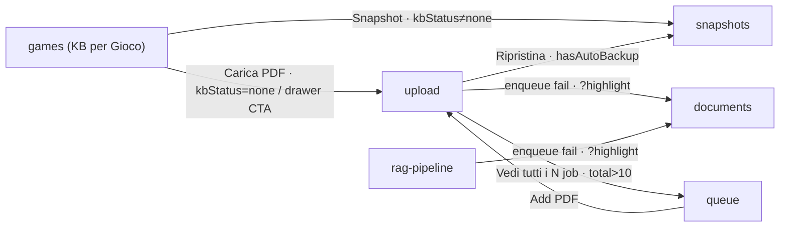

_Nota: `/admin/knowledge-base` (Explorer) è auto-referente (`?doc=&tab=`, download, modali) senza edge verso altre route del cluster; `feedback`, `pipeline`, `processing`, `vectors`, `embedding`, `settings` non hanno edge di navigazione route in uscita. Edge verso `games/<gameId>`, `/admin/shared-games/<gameId>` e `/admin/games/<id>/agent/test` puntano fuori dal cluster._

### Admin KB: Mechanic Extractor (analisi, dashboard, golden, metriche, review)
_Route-group: `admin` · 7 pagine_

> Prefisso base comune: **`/admin/knowledge-base/mechanic-extractor`** (abbreviato **`…`** sotto).
> **Shell condivisa** (tutte le route): `AdminShell` in route-group `admin/(dashboard)` → `data-theme="dark"`, `AppTopBar(adminMode)` + `MobileTopBar(adminMode)` + `AdminSidebar(lg+)` + `AdminSideDrawer(mobile)` + `main#main-content` dentro `DashboardEngineProvider`; `PdfProcessingNotifier` montato dal layout. `AdminSidebar` = `ADMIN_NAV_GROUPS` gruppo D.

#### Tabella route

| Route | Shell | Guardie | Stati principali |
|---|---|---|---|
| **`…`** (editor legacy Variant C) | AdminShell (dark) | layout server: cookie `meepleai_view_mode==='user'` → `redirect('/')` · `RequireRole ['Admin']` · **nav-entry gate** (NON route gate): voce menu "Mechanic Extractor (legacy)" inclusa solo se `isLegacyMechanicExtractorEnabled()`; route sempre risolvibile via URL/bookmark con banner deprecazione #536; nessun `notFound()` | loading giochi/PDF Ready · empty (nessun gioco con PDF) · editor nascosto finché game+PDF non scelti · draft loading (skeleton) · AI assist pending · activated (terminale) |
| **`…/analyses`** (pipeline AI async M1.2) | AdminShell (dark) | layout redirect · `RequireRole ['Admin']` · **nessun flag** — superficie PRIMARIA (voce "Mechanic Analyses", gruppo D) | lista loading/empty/error · form generate · status loading · pipeline running (polling 2s, <9 section runs) · terminale (InReview/Published/Rejected/PartiallyExtracted) · suppressed · lifecycle error |
| **`…/dashboard`** (AI Comprehension Validation) | AdminShell (dark) | layout redirect · `RequireRole ['Admin']` · **flag route-level**: `!isMechanicValidationEnabled()` → `notFound()` (404); NON in sidebar, solo URL diretto/link interni | 404 (flag off) · loading (skeleton) · error · empty · success · thresholds loading/error/loaded · recalc job attivo (polling + terminale con toast) |
| **`…/golden`** (Golden Set — game picker) | AdminShell (dark) | layout redirect · `RequireRole ['Admin']` · **flag route-level** → `notFound()`; NON in sidebar | 404 (flag off) · loading (skeleton) · error · empty · success (lista) |
| **`…/golden/[gameId]`** (Golden Set — CRUD claim) | AdminShell (dark) | layout redirect · `RequireRole ['Admin']` · **flag route-level** → `notFound()`; raggiunta dal picker | 404 (flag off) · loading (gioco/golden) · error · empty (nessun golden claim) · success |
| **`…/metrics`** (Metriche) | AdminShell (dark) | layout redirect · `RequireRole ['Admin']` · **nessun flag** — voce "Mechanic Metrics" (gruppo D) sempre visibile | loading (summary/cost/recent/options) · empty (nessuna analisi / nessun rifiuto) · success · export in corso |
| **`…/review`** (Anteprima / Preview & Export) | AdminShell (dark) · contenuto `max-w-900` centrato · supporta stampa (`print:*`) | layout redirect · `RequireRole ['Admin']` · `<Suspense>` (usa `useSearchParams`) · richiede `?sharedGameId=&pdfDocumentId=` (query draft enabled solo se ENTRAMBI) · **nessun flag route** (solo `ValidationSection` gated); nessun `notFound()` | Suspense fallback · loading draft · empty (draft non trovato) · success · validation: flag-off (null)/loading/metrics/no-metrics · print mode |

---

#### Navigazione in uscita

- **`…` (editor legacy)**
  - `…` → `…/analyses` (Link banner deprecazione "Vai ad AI Analysis")
  - `…` → `…/analyses` (Button header "Async pipeline (M1.2) →")
  - `…` → `…/review?sharedGameId=<selectedGameId>&pdfDocumentId=<selectedPdfId>` (Button "Preview & Export"; **cond**: `canFinalize` = existingDraft && summaryDraft && mechanicsDraft && status!=='Activated')

- **`…/analyses`**
  - `…/analyses` → stessa route `?analysisId=<id>` (`router.replace` URL-sync, scroll:false; quando `analysisId` differisce dal query param — deep-link/refresh ripristina da `searchParams`)
  - `…/analyses` → in-page: seleziona analisi (`setAnalysisId`) via click riga in `MechanicAnalysesListCard` **oppure** Button "Load" su UUID incollato (disabled se `!loadIdInput.trim()`)
  - `…/analyses` → modal:**Suppress** (AlertDialog T5) (Button "Suppress (T5)"; **cond** `canSuppress`: status && !isSuppressed)
  - `…/analyses` → modal:**Prompt viewer** (AlertDialog read-only) (Button "Vedi prompt"; `promptQuery` enabled solo a modal aperto)
  - `…/analyses` → modal:**Approve claim** (`ApproveClaimDialog` via ClaimsSection) (ClaimRow "Approve"; **cond** claim Pending|Rejected && `isClaimsActionable`)
  - `…/analyses` → modal:**Reject claim** (`RejectClaimDialog`) (ClaimRow "Reject"; **cond** claim Pending && `isClaimsActionable`)
  - `…/analyses` → modal:**Bulk action** (`BulkActionDialog`) (Select "Bulk action…": approve-pending | reject-all-failing-T2; **cond** `isClaimsActionable`, opzione disabled se count===0)
  - `…/analyses` → modal:**PdfQuoteHighlighter** (click citazione claim; **cond** `status.pdfDocumentId` presente, altrimenti citazione read-only)

- **`…/dashboard`**
  - `…/dashboard` → `…/review?sharedGameId=<row.sharedGameId>` (Link "View" per riga `DashboardTable`; solo sharedGameId, senza pdfDocumentId)
  - `…/dashboard` → in-page inline drawer: `RecalcProgressDrawer` (`RecalcAllButton onJobStarted` → `setActiveJobId`; dopo enqueue 202)

- **`…/golden`**
  - `…/golden` → `…/golden/<game.id>` (Link riga elenco shared game con ChevronRight; per ogni gioco in `data.items`)

- **`…/golden/[gameId]`**
  - `…/golden/[gameId]` → `…/golden` (Link "Back to game picker", ArrowLeft)
  - `…/golden/[gameId]` → modal:**New golden claim** (Dialog `GoldenClaimForm` mode=create) (DialogTrigger Button "New claim")
  - `…/golden/[gameId]` → modal:**Import BGG tags** (`BggImporterPasteDialog`) (Button "Import BGG tags")
  - `…/golden/[gameId]` → modal:**Edit golden claim** (Dialog `GoldenClaimForm` mode=edit) (icona Edit/Pencil riga → `setEditingClaim`)
  - `…/golden/[gameId]` → modal:**Deactivate claim** (AlertDialog conferma) (icona Trash riga → `setDeactivatingId`)

- **`…/metrics`**
  - `…/metrics` → download file CSV (blob, **non route**) (Button "Export CSV" → `adminClient.exportMechanicAnalysesCsv` → anchor `mechanic-analyses.csv`; toast.error "Esportazione CSV fallita. Riprova." on error)

- **`…/review`**
  - `…/review` → `…` (Button "Torna all'editor", ArrowLeft)
  - `…/review` → `window.print()` (dialog stampa/PDF, **non route**) (Button "Esporta PDF")
  - `…/review` → modal:**Override certification** (`OverrideCertificationDialog`) (Button "Override certification" in ValidationSection; **cond** flag validation ON via `FeatureFlagGate` && `analysisId` presente)

---

#### Superfici condizionali (show / hide / enable)

##### `…` (editor legacy Variant C)
_Superfici inline in `admin/(dashboard)/knowledge-base/mechanic-extractor/page.tsx` salvo file indicato._
- **Alert banner deprecazione (Variant C, #536)**: sempre in cima; contiene la CTA "Vai ad AI Analysis".
- **Badge header** "Variant C: AI reads notes only, never the PDF": sempre sotto il titolo.
- **Blocco editor split-panel** (PDF viewer + editor meccaniche): reso SOLO quando `selectedGameId && selectedPdfId` entrambi valorizzati.
- **Select "Select Game"**: disabled quando `isGameSelectLoading` (isGamesLoading || isReadyPdfsLoading); placeholder "Loading…" in load, "No games with PDF available" se `gamesWithPdf.length===0`, altrimenti "Choose a game..."; elenco filtrato ai soli giochi con ≥1 PDF Ready (`gameIdsWithPdf`).
- **Select "Select PDF"**: disabled quando `!selectedGameId`; placeholder "Select a game first" se nessun gioco, altrimenti "Choose a PDF...".
- **Button "Save"**: disabled quando `!selectedGameId || !selectedPdfId || saveMutation.isPending`; spinner Loader2 durante pending.
- **Badge stato draft** (`existingDraft.status`): mostrato solo se existingDraft caricato.
- **iframe PDF viewer**: dato che lo split-panel esiste solo con game+PDF, `pdfUrl` è sempre truthy → iframe sempre reso; il ramo placeholder "Select a PDF to view" è **dead branch** (irraggiungibile).
- **Skeleton editor destro**: mostrato quando `isDraftLoading`; altrimenti tabs+editor.
- **Section tabs** (Summary/Mechanics/Victory/Resources/Phases/FAQ): tab attivo amber; CheckIcon verde se `hasDraft`; pallino amber se `hasNotes && !hasDraft`; onClick azzera `aiResult`.
- **Contatore caratteri note + hint** "(min 10 for AI assist)": hint mostrato quando `notes[activeSection].length < 10`.
- **Button "AI Assist"**: disabled quando `!canRequestAi` (richiede `existingDraft && notes[activeSection].length>=10`) o `aiAssistMutation.isPending`; spinner durante pending.
- **Hint "Save draft first to enable AI assist"**: mostrato quando `!existingDraft`.
- **Riga token/cost usati**: mostrata se `existingDraft && totalTokensUsed>0`; costo ($) solo se `estimatedCostUsd>0`.
- **AI Result Preview (Accept/Reject)**: mostrato quando `aiResult && aiResult.section===activeSection`; Accept → `acceptMutation` (disabled durante pending), Reject → `setAiResult(null)`.
- **Accepted Draft display**: mostrato quando `currentDraft` (existingDraft[<activeSection>Draft]) truthy.
- **Blocco Finalize** (Preview & Export + "Activate in Knowledge Base"): mostrato quando `canFinalize`; Activate disabled durante `finalizeMutation.isPending`.
- **Banner "This analysis has been activated"**: mostrato quando `existingDraft?.status==='Activated'`.

##### `…/analyses`
_Superfici inline in `admin/(dashboard)/knowledge-base/mechanic-extractor/analyses/page.tsx` salvo file indicato._
- **MechanicAnalysesListCard** (`.../analyses/MechanicAnalysesListCard.tsx`): loading "Loading analyses…"; error banner rosso; empty "No mechanic analyses yet — start one from the form below"; righe suppressed con badge rosso "Suppressed"; riga `selectedId` evidenziata amber; header "page X of Y (N total)".
- **List: Button "Refresh"** (`.../MechanicAnalysesListCard.tsx`): `query.refetch()`; disabled durante `isFetching` (spinner).
- **List: paginazione Previous/Next** (`.../MechanicAnalysesListCard.tsx`): mostrata SOLO se `totalCount>PAGE_SIZE(20)`; Previous disabled se `!canPrev` o isFetching; Next disabled se `!canNext` o isFetching.
- **Card "Load existing analysis"**: sempre presente; input UUID + Button "Load" disabled quando `!loadIdInput.trim()`.
- **Select "Shared Game" (form generate)**: disabled quando `isReadyPdfsLoading`; placeholder "Loading…"/"No games with Ready PDFs" (se vuoto)/"Choose a game…"; opzioni dedup dai PDF Ready (gameId+gameTitle), sort per titolo.
- **Select "PDF"**: disabled quando `!selectedGameId`; placeholder "Pick a game first"/"Choose a PDF…".
- **Select "Modello LLM" (MODEL_OPTIONS) + checkbox force-regen**: `forceRegen` ignora l'idempotenza (nuova analisi); provider derivato dal modello (sentinel 'default' → nessun override).
- **Blocco override cost-cap** (input cap + textarea reason): mostrato solo quando `overrideEnabled`; contatore "N / 20+ characters".
- **Button "Generate"**: disabled quando `!canGenerate` (selectedGameId && selectedPdfId && costCapUsd!=='' && [se override: isOverrideCapValid(>0) && reason.length>=20] && !generateMutation.isPending); spinner durante pending.
- **generateError banner**: mostrato quando `generateMutation` onError setta `generateError`.
- **Button "Clear current analysis"**: mostrato quando `analysisId` settato → `setAnalysisId(null)` + reset lifecycleError.
- **Card "Analysis status" + telemetria**: montata solo quando `analysisId` presente.
- **Badge stato + Suppressed + Running**: badge stato sempre se status; "Suppressed" se `isSuppressed`; "Running" (spinner) se `isPipelineRunning` = status===Draft && sectionRuns.length<9.
- **Polling status**: poll ogni 2s finché `isPipelineRunning`; stop su terminale (InReview/Published/Rejected/PartiallyExtracted).
- **Riga "Loading status…"**: quando `statusQuery.isLoading && !status`.
- **Griglia telemetria** (promptVersion/model/tokens/cost-cap/claims/created): quando status; tile "Reviewed" solo se `reviewedAt`; "Suppressed" solo se `suppressedAt`; "(override)" su cost/cap se `costCapOverrideApplied`.
- **Banner rejectionReason / suppressionReason**: mostrati se i rispettivi campi presenti.
- **Tabella Section runs**: quando `sectionRuns.length>0`; badge per-run (Succeeded/Failed/SkippedDueToCostCap/RetainedWithGuardrailFlags) con tooltip (`SECTION_RUN_STATUS_DESC`); icona ⚠ (title=errorMessage) se `run.errorMessage`.
- **ClaimsSection** (`.../claims/ClaimsSection.tsx`): montata quando `analysisId && status && claimsCount>0`; `isClaimsActionable` = (status===InReview && !isSuppressed). Sub-stati: loading "Loading claims…"/error/empty "No claims to display"; Bulk-action Select solo se actionable; `ValidationLegend` sempre; AC-10 warning se `stats.rejected>0`.
- **lifecycleError banner**: quando una mutation lifecycle (submit/approve/suppress/regenerate) setta `lifecycleError`.
- **Barra azioni lifecycle** (Submit for review / Approve / Suppress): quando status. Submit disabled salvo `canSubmitReview` (!suppressed && (Draft|Rejected) && claimsCount>0 && !running); Approve disabled salvo `canApprove` (InReview && !suppressed); Suppress disabled salvo `canSuppress`.
- **Barra rigenerazione** (Select "Motore rigenerazione" + "Rigenera" + "Vedi prompt"): quando status; "Rigenera" = generate con `forceRegenerate=true`, disabled durante `regenerateMutation.isPending`.
- **AlertDialog Suppress**: textarea reason (contatore 20–500) + Select "Request source" (`SUPPRESSION_REQUEST_SOURCE_LABELS`, default Email); Action "Suppress" disabled se reason<20 || reason>500 || pending; reset on close.
- **AlertDialog Prompt viewer**: `promptQuery` enabled solo se `promptOpen`; sub-stati loading "Caricamento…"/error "Impossibile caricare il prompt."/data (system prompt + prompt per-sezione).

##### `…/dashboard`
_Superfici inline in `admin/(dashboard)/knowledge-base/mechanic-extractor/dashboard/page.tsx` salvo file indicato._
- **Intera pagina**: `notFound()` (404) quando `isMechanicValidationEnabled()===false`.
- **RecalcAllButton "Recalculate all"** (`.../validation/RecalcAllButton.tsx`): disabled durante `mutation.isPending`; label "Enqueueing…" (+spinner) mentre pending.
- **RecalcProgressDrawer** (`.../validation/RecalcProgressDrawer.tsx`): pannello inline (non portal/sheet) in slot dedicato; montato solo quando `activeJobId!==null`; sub-stati loading "Loading job status…"/error; poll 2s; progress processed/total + counter (failed/skipped/consecutiveFailures/ETA) + last error; Cancel mentre NON-terminale (→ "Cancelling…" disabled se `cancellationRequested`); X di chiusura solo su terminale; toast una-tantum per transizione (Completed/Failed/Cancelled).
- **Skeleton dashboard** (summary + tabella): quando `useValidationDashboard().isLoading` (`data-testid dashboard-loading`, role=status).
- **Banner errore dashboard**: quando `error && !isLoading` (`data-testid dashboard-error`).
- **Contenuto dashboard** (`DashboardSummaryCards` + `DashboardTable`): quando `!isLoading && !error && data`.
- **DashboardSummaryCards** (`.../validation/DashboardSummaryCards.tsx`): 3 tile conteggio Certified/NotCertified/NotEvaluated (single pass).
- **DashboardTable empty state** (`.../validation/DashboardTable.tsx`): "No games yet. Games will appear here once metrics have been computed." quando 0 righe; altrimenti righe ordinate per `overallScore` desc (score invalidi/NaN in fondo).
- **Card "Certification Thresholds"**: skeleton se `isThresholdsLoading`; banner errore se `thresholdsError`; `ThresholdsConfigForm` quando caricati.
- **ThresholdsConfigForm** (`.../validation/ThresholdsConfigForm.tsx`): 4 campi (minCoveragePct 0–100, maxPageTolerance intero≥0, minBggMatchPct 0–100, minOverallScore 0–100); Reset e Save disabled quando `!isDirty || isSubmitting`; validazione zod client (mirror FluentValidation server).

##### `…/golden`
_Superfici inline in `admin/(dashboard)/knowledge-base/mechanic-extractor/golden/page.tsx`._
- **Intera pagina**: `notFound()` quando `isMechanicValidationEnabled()===false`.
- **Skeletons (3 righe)**: quando `isLoading` (query shared-games golden-picker, page 1 pageSize 200).
- **Testo errore**: quando `error` (`text-destructive`).
- **Empty "No shared games available."**: quando `!isLoading && !error && items.length===0`.
- **Lista giochi** (ul con Link + ChevronRight): quando `!isLoading && !error && items.length>0`.

##### `…/golden/[gameId]`
_Superfici inline in `admin/(dashboard)/knowledge-base/mechanic-extractor/golden/[gameId]/page.tsx` salvo file indicato._
- **Intera pagina**: `notFound()` quando `isMechanicValidationEnabled()===false`.
- **H1 titolo gioco**: "Loading…" quando `gameQuery.isLoading`, altrimenti `gameTitle` (fallback "Unknown game").
- **GoldenVersionHashBadge** (`.../validation/GoldenVersionHashBadge.tsx`): mostrato solo quando `goldenQuery.isSuccess`; primi 8 char dell'hash + Button copy-to-clipboard (toast success/error) con Tooltip full-hash.
- **Card lista claim**: skeleton quando `goldenQuery.isLoading`; testo errore (`text-destructive`) quando `goldenQuery.error`; `GoldenClaimsList` quando success.
- **GoldenClaimsList** (`.../validation/GoldenClaimsList.tsx`): empty "No golden claims yet. Use the \"New claim\" button…" quando `claims.length===0`; altrimenti tabelle raggruppate per sezione (Summary/Mechanics/Victory/Resources/Phases/FAQ), claim ordinati per `expectedPage`, statement troncato con Tooltip full-text; azioni Edit/Deactivate per riga.
- **AlertDialog Deactivate**: Action disabled durante `deactivateMutation.isPending` (label "Deactivating…"); soft-delete che cambia il version hash del golden set.
- **GoldenClaimForm (New/Edit)** (`.../validation/GoldenClaimForm.tsx`): Select "Section" disabled quando `mode==='edit'` (immutabile, hint "Section is immutable after creation."); create resetta il form on success (mantiene section, azzera statement/quote, page=1), edit chiama `onClose`; submit disabled durante pending; validazione zod (statement 10–1000, sourceQuote 10–2000, expectedPage intero≥1); contatori caratteri.
- **BggImporterPasteDialog** (`.../validation/BggImporterPasteDialog.tsx`): preview live per keystroke: lista errori rossa per riga malformata (`parseBggTsv`) + tabella righe (max-h scroll); submit disabled finché `rows.length===0 || mutation.isPending`; label "Insert N tag(s)"/"Importing…"; chiude on success, resta aperto on error; reset textarea on close; blocca chiusura (outside/Esc) durante pending.

##### `…/metrics`
_Superfici inline in `admin/(dashboard)/knowledge-base/mechanic-extractor/metrics/page.tsx` salvo file indicato._
- **Toggle periodo 7g/30g/90g**: periodo attivo `variant='default'`, gli altri 'outline'; ricalcola `startDate` (UTC now − period gg) e resetta le query dipendenti.
- **Button "Export CSV"**: disabled durante `isExporting` (label "Esporto…").
- **Filtri Select (Gioco / Reviewer / Status)**: opzioni gioco/reviewer da `optionsQuery` (DISTINCT su TUTTE le analisi, #2837 no recency cap); Status da `STATUS_LABELS` 0..4; valore `ALL='all'` → undefined; ogni cambio filtro resetta `offset` a 0.
- **KPI StatCard ×4** (costo medio/tempo review/approval rate/analisi totali): loading=`summaryQuery.isLoading`; valore "—" quando summary assente; tempo review "—" se `averageReviewTimeHours` null.
- **MechanicCostChart** (`.../metrics/MechanicCostChart.tsx`): recharts via dynamic import (ssr:false; sync via require sotto NODE_ENV=test); data da `costQuery` (fallback []); Suspense fallback "Caricamento grafico…".
- **Card "Motivi di rifiuto"**: lista `rejectionBreakdown` quando `summary && length>0`; altrimenti "Nessun rifiuto nel periodo.".
- **Tabella "Analisi recenti"**: righe da `recent.items`; riga "Nessuna analisi." (colSpan 5) quando vuoto; `reviewerName` "—" se assente.
- **Paginazione tabella (Precedente/Successiva)**: Precedente disabled quando `offset===0`; Successiva disabled quando `!recent || offset+25(RECENT_PAGE_SIZE)>=totalCount`; label "{totalCount} totali".

##### `…/review`
_Superfici inline in `admin/(dashboard)/knowledge-base/mechanic-extractor/review/page.tsx` salvo file indicato._
- **Suspense fallback**: Skeleton `h-96` mentre `ReviewContent` (useSearchParams) sospende.
- **ReviewContent loading**: Skeletons multipli quando query draft `isLoading`.
- **Empty "Draft non trovato. Seleziona un gioco e un PDF dall'editor."**: quando `!draft` (include il caso `sharedGameId` senza `pdfDocumentId` → query disabled).
- **Badge "N/6 sezioni completate"**: verde se `completedSections===6`, altrimenti amber.
- **Stats bar (4 StatCard locali)**: sezioni completate / meccaniche / risorse / token; valori da parse JSON dei draft (`safeParseJson`, fallback []); token = `totalTokensUsed ?? 0`.
- **ReviewCard Sommario**: solo se `draft.summaryDraft` presente.
- **ReviewCard Meccaniche**: solo se `mechanics.length>0` (badge conteggio).
- **ReviewCard Condizioni di Vittoria**: solo se `victory.primary` presente; blocco "Fonti di Punti" solo se `victory.alternatives.length>0`.
- **ReviewCard Risorse**: solo se `resources.length>0` (tabella Risorsa/Tipo/Utilizzo/Limitata).
- **ReviewCard Fasi**: solo se `phases.length>0` (sort per order).
- **ReviewCard FAQ**: solo se `questions.length>0`.
- **MechanicAnalysisFooterAttribution** (`.../MechanicAnalysisFooterAttribution.tsx`): footer copyright sempre reso; riga "N tokens, $cost" solo se `(totalTokensUsed ?? 0)>0`.
- **FeatureFlagGate → ValidationSection** (`.../validation/FeatureFlagGate.tsx`): sotto-albero AI Comprehension Validation reso solo se `NEXT_PUBLIC_MECHANIC_VALIDATION_ENABLED==='true'` (altrimenti fallback null; **nessun 404**, a differenza di dashboard/golden).
- **ValidationSection**: `return null` se `!sharedGameId`; skeleton se `latestMetricsQuery.isLoading`; `MetricsCard` se metrics presenti, altrimenti nota "No prior metrics for this game. Run an evaluation…".
- **EvaluateButton** (`.../validation/EvaluateButton.tsx`): montato solo quando `analysisId` presente; label "Evaluate metrics"/"Evaluating…"; disabled durante pending.
- **Button "Override certification"**: disabled quando `!analysisId`; wrappato in Tooltip "Run Evaluate first" quando `!analysisId`.
- **OverrideCertificationDialog** (`.../validation/OverrideCertificationDialog.tsx`): montato quando `analysisId`; submit disabled se form non valido (reason 20–500, mode onChange) o pending; contatore reasonLength/500 (rosso fuori range); resta aperto on error, chiude on success; blocca chiusura durante pending.
- **MetricsCard drift warning** (`.../validation/MetricsCard.tsx`): Alert "Stale metrics" quando `currentGoldenVersionHash && metrics.goldenVersionHash` differiscono (mostra v-first8 di entrambi).
- **Action bar (Torna all'editor / Esporta PDF)**: `print:hidden`; anche la Card `ValidationSection` è `print:hidden`.

---

#### Componenti → file

| Componente | File | Ruolo |
|---|---|---|
| MechanicExtractorPage (client, inline) | `apps/web/src/app/admin/(dashboard)/knowledge-base/mechanic-extractor/page.tsx` | Editor manuale Variant C (deprecato #536): selezione game+PDF, note per-sezione con auto-save debounce 2s, AI Assist, accept/finalize |
| MechanicAnalysesPage (client) | `apps/web/src/app/admin/(dashboard)/knowledge-base/mechanic-extractor/analyses/page.tsx` | Orchestratore pipeline async: form generate, discovery list, status polling, lifecycle, regenerate, prompt viewer, deep-link `?analysisId` |
| MechanicAnalysesListCard | `apps/web/src/components/admin/mechanic-extractor/analyses/MechanicAnalysesListCard.tsx` | Tabella paginata (PAGE_SIZE 20) analisi recenti; `onSelect` → setAnalysisId; righe suppressed; Refresh |
| ClaimsSection (+ SectionGroup/ClaimRow/ValidationBadges/ValidationLegend) | `apps/web/src/components/admin/mechanic-extractor/claims/ClaimsSection.tsx` | Viewer claim per sezione: approve/reject singolo + bulk, badge guardrail T1–T4, apertura citazione in PdfQuoteHighlighter, AC-10 warning |
| ApproveClaimDialog / RejectClaimDialog / BulkActionDialog | `apps/web/src/components/admin/mechanic-extractor/claims/` | Dialog conferma azioni claim (singolo + bulk) |
| PdfQuoteHighlighter | `apps/web/src/components/pdf/PdfQuoteHighlighter.tsx` | Overlay che apre il PDF alla pagina/quote citata (solo se pdfDocumentId presente) |
| MechanicValidationDashboardPage (client) | `apps/web/src/app/admin/(dashboard)/knowledge-base/mechanic-extractor/dashboard/page.tsx` | Dashboard certificazione: tre tile + tabella per-gioco + config soglie + mass-recalc |
| DashboardSummaryCards | `apps/web/src/components/admin/mechanic-extractor/validation/DashboardSummaryCards.tsx` | 3 card conteggio Certified/NotCertified/NotEvaluated |
| DashboardTable | `apps/web/src/components/admin/mechanic-extractor/validation/DashboardTable.tsx` | Tabella per-gioco con Link "View" → review (solo sharedGameId); empty state; sort per score |
| RecalcAllButton | `apps/web/src/components/admin/mechanic-extractor/validation/RecalcAllButton.tsx` | Enqueue mass-recalc (202) → `onJobStarted(jobId)`; disabled durante pending |
| RecalcProgressDrawer | `apps/web/src/components/admin/mechanic-extractor/validation/RecalcProgressDrawer.tsx` | Drawer inline polled: progress/counter/ETA, Cancel cooperativo, toast terminali una-tantum |
| ThresholdsConfigForm | `apps/web/src/components/admin/mechanic-extractor/validation/ThresholdsConfigForm.tsx` | Form 4 soglie di certificazione (dirty-gated, zod) |
| GoldenSetGamePickerPage (client) | `apps/web/src/app/admin/(dashboard)/knowledge-base/mechanic-extractor/golden/page.tsx` | Picker: lista SharedGames → drill-in `golden/[gameId]` |
| GoldenForGamePage (client, params via `use()`) | `apps/web/src/app/admin/(dashboard)/knowledge-base/mechanic-extractor/golden/[gameId]/page.tsx` | CRUD golden claims per un SharedGame |
| GoldenClaimsList | `apps/web/src/components/admin/mechanic-extractor/validation/GoldenClaimsList.tsx` | Tabelle claim per sezione + edit dialog + deactivate confirm (soft-delete) |
| GoldenClaimForm | `apps/web/src/components/admin/mechanic-extractor/validation/GoldenClaimForm.tsx` | Form create/edit claim (section immutabile in edit) |
| BggImporterPasteDialog | `apps/web/src/components/admin/mechanic-extractor/validation/BggImporterPasteDialog.tsx` | Import bulk tag BGG (paste `Category<TAB>Name`) con preview/errori live |
| GoldenVersionHashBadge | `apps/web/src/components/admin/mechanic-extractor/validation/GoldenVersionHashBadge.tsx` | Badge version hash (first8) + copy-to-clipboard + Tooltip full-hash |
| MechanicMetricsPage (client) | `apps/web/src/app/admin/(dashboard)/knowledge-base/mechanic-extractor/metrics/page.tsx` | Cruscotto operativo: costi, tempi review, approval rate, export CSV, tabella recenti (25/pagina) |
| MechanicCostChart | `apps/web/src/components/admin/mechanic-extractor/metrics/MechanicCostChart.tsx` | Bar chart recharts costo/giorno (dynamic ssr:false; sync sotto test) |
| StatCard | `apps/web/src/components/ui/data-display/stat-card.tsx` | Tile KPI con stato loading |
| MechanicExtractorReviewPage / ReviewContent / ValidationSection (client) | `apps/web/src/app/admin/(dashboard)/knowledge-base/mechanic-extractor/review/page.tsx` | Anteprima read-only del draft finalizzato + export stampa + sezione validation feature-flagged (StatCard/ReviewCard locali inline) |
| MechanicAnalysisFooterAttribution | `apps/web/src/components/admin/mechanic-extractor/MechanicAnalysisFooterAttribution.tsx` | Footer attribuzione copyright (#526 AC-5); riga token/costo solo se totalTokensUsed>0 |
| FeatureFlagGate | `apps/web/src/components/admin/mechanic-extractor/validation/FeatureFlagGate.tsx` | Gate inline (render children/fallback=null) per il flag validation |
| MetricsCard | `apps/web/src/components/admin/mechanic-extractor/validation/MetricsCard.tsx` | Card metriche AI (coverage/page accuracy/BGG/overall + drift warning) |
| EvaluateButton | `apps/web/src/components/admin/mechanic-extractor/validation/EvaluateButton.tsx` | Trigger `useCalculateMetrics(analysisId)`; disabled durante pending |
| OverrideCertificationDialog | `apps/web/src/components/admin/mechanic-extractor/validation/OverrideCertificationDialog.tsx` | Dialog override certificazione con reason 20–500 (zod, mode onChange) |
| adminClient | `apps/web/src/lib/api/clients/adminClient.ts` | Client API admin: draft meccaniche, metriche, CSV, recent analyses, filter options |
| createSharedGamesClient.getAll / api.sharedGames.getAll | `apps/web/src/lib/api/clients/sharedGamesClient.ts` · `apps/web/src/lib/api/index.ts` | Elenco shared games (da filtrare per PDF disponibile / picker golden) |
| useValidationDashboard / useThresholds | `apps/web/src/hooks/admin/useValidationDashboard.ts` | Query dashboard rows + soglie |
| useGoldenForGame / useDeactivate·useCreate·useUpdateGoldenClaim / useImportBggTags | `apps/web/src/hooks/admin/useGoldenForGame.ts` | Hook query+mutation golden set |
| useLatestMetrics / useGoldenForGame | `apps/web/src/hooks/admin/useLatestMetrics.ts` | Metriche più recenti + golden set (drift/version hash) |

---

#### Navigazione interna al cluster

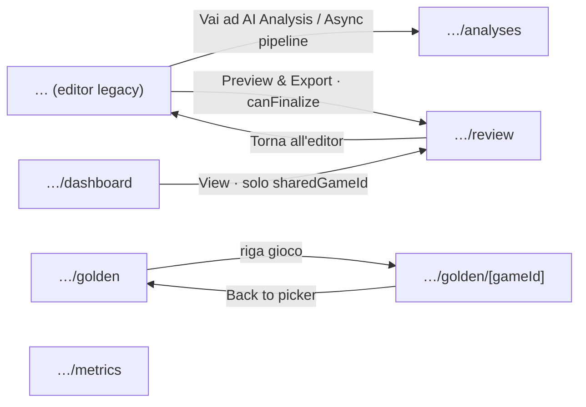

_Nota: `…/metrics` non ha edge di navigazione route-to-route interni al cluster (solo download CSV). Gli edge verso modali (Suppress, Approve/Reject/Bulk claim, Prompt viewer, PdfQuoteHighlighter, New/Edit/Deactivate golden claim, Import BGG, Override certification), il self-edge `…/analyses?analysisId=<id>`, il drawer inline `RecalcProgressDrawer`, `window.print()` e il download CSV sono in-page/non-route e omessi dal diagramma._

### Admin Content: shared games (catalogo community), import, seeding, RAG setup
_Route-group: `admin` · 12 pagine_

**Guardie standard** (comuni a tutte le route del cluster): Server `admin/(dashboard)/layout.tsx` → se cookie `meepleai_view_mode === 'user'` → `redirect('/')` pre-render (no flash); Client `RequireRole allowedRoles=['Admin']` (unauth → `/login?from=<path>`, ruolo errato → `/`, superadmin eredita, spinner "Verifica autorizzazioni…"); **nessun `middleware.ts` Next** (la "Layer 1 middleware" citata nel docstring di `RequireRole` è assente — protezione solo client + guard server nel layout).

#### Tabella route

| Route | Shell | Guardie | Stati principali |
|---|---|---|---|
| `/admin/shared-games` | AdminShell (dark) | Standard | redirect immediato (nessun render) |
| `/admin/shared-games/all` | AdminShell (dark) | Standard | loading · empty-filtered · empty-catalog · success · widget nascosto/collapsed · bulk-pending |
| `/admin/shared-games/categories` | AdminShell (dark) | Standard | loading · error (role=alert) · empty · success · mutation-error |
| `/admin/shared-games/import` | AdminShell (dark) | Standard + guard wizard `useAuthUser()` ridondante (spinner / pannello "Autenticazione richiesta") | loading(auth) · unauthorized · error(ErrorBoundary) · step1–5 |
| `/admin/shared-games/new` | AdminShell (dark) | Standard | form-idle · bgg-searching · bgg-linked · bgg-duplicate-warning · submitting · error |
| `/admin/shared-games/seeding` | AdminShell (dark) | Standard | loading · empty · error · success · queue-active(SSE) · enriching · downloading |
| `/admin/shared-games/wizard` | AdminShell (dark) | Standard | step1–5 · loading(search/upload) · error |
| `/admin/shared-games/[id]` | AdminShell (dark); page in `Suspense` | Standard | loading(skeleton) · error(Alert+back) · success(tabs Details/Documents/Agent) · kb-indexing(poll 5s) · queue attiva(poll 10s) |
| `/admin/shared-games/[id]/knowledge-base` | AdminShell (dark) | Standard | loading · empty · success · saving(settings) · mutation-error(toast) |
| `/admin/shared-games/[id]/rag-setup` | AdminShell (dark); page in `Suspense` | Standard | loading · no-documents · processing · failed · ready-for-agent · fully-operational |
| `/admin/catalog-ingestion` | AdminShell (dark) | Standard | loading(hero skeleton) · error(hero card) · success(chip idle/running/degraded) · drill-down(LogStream) |
| `/admin/catalog/seed-queue` | AdminShell (dark) | Standard + BE `RequireAdminSessionFilter` su ogni endpoint | per-componente loading/empty/error/success (React Query) · feature-disabled (flag `admin.catalog-seed.enabled=false` → 503) |

#### Navigazione in uscita

- **`/admin/shared-games`**
  - `→ /admin/shared-games/all` (`redirect()` server a module load; incondizionato — stub)

- **`/admin/shared-games/all`**
  - `→ /admin/shared-games/{id}` (MeepleCard onClick / azione "✏️ Modifica" `router.push`; click card/azione)
  - `→ /admin/shared-games/{sharedGameId}` (Link riga "Gioco" / action-cell "Vai al gioco" in RecentlyProcessedWidget; "Vai al gioco" solo se `doc.processingState==='Ready'`)
  - `→ /admin/knowledge-base/documents` (Link footer "Vedi tutti" / action-cell "Vai alla coda"; se `processingState !== Ready` e non `Failed+canRetry+jobId`)
  - `→ clipboard: ${origin}/games/{id}` (azione "🔗 Condividi" `navigator.clipboard.writeText`; copia URL pubblico, **non è route**)
  - `→ modal:AdminSharedGameCardContainer` (Sheet slide-over destro 640px via `sheetGameId`; **DORMANT** — `handleOpenExtraCard` passato ad AdminGameCard ma mai invocato: il prop è rinominato `_onOpenExtraCard`, nessun trigger UI)

- **`/admin/shared-games/categories`**
  - `→ modal:CategoryFormDialog (Aggiungi)` ("Add Category" → `setAdding(true)`; sempre)
  - `→ modal:CategoryFormDialog (Modifica)` (CategoryRow onEdit → `setEditing`; click edit)
  - `→ modal:DeleteCategoryConfirm` (CategoryRow onDelete → `setDeleting`; click delete)

- **`/admin/shared-games/import`**
  - `→ /login` (Link "Accedi" nel pannello "Autenticazione richiesta"; `!user` dopo authLoading)
  - `→ /admin/shared-games/new` (Link "crea il gioco manualmente"; header wizard)
  - `→ /admin/shared-games` (Link "Torna ai giochi"; solo se ErrorBoundary cattura errore)
  - `→ reset wizard (step 1)` (header "Ricomincia" / step5 "Importa un altro gioco" / ErrorBoundary "Ricomincia"; `useGameImportWizardStore.reset()`, **stato Zustand non route**)
  - `→ step 1→5 interni` (goNext/goBack + WizardSteps onStepClick, step cliccabili solo se `< currentStep`, `allowSkip=false`; **stato Zustand non route**)

- **`/admin/shared-games/new`**
  - `→ /admin/shared-games/all` ("Back to All Games" / "Cancel" `router.push`; sempre — Cancel disabled se isSubmitting)
  - `→ /admin/shared-games/import` (Link "Import from PDF", banner tratteggiato #255; sempre)
  - `→ /admin/shared-games/{gameId}` (onSubmit success → `api.sharedGames.create()` → `router.push`; solo se create ok, altrimenti `setError('root')`)
  - `→ https://boardgamegeek.com/boardgame/{bggId}` (`<a target=_blank>` "Vedi scheda esterna", stopPropagation; per ogni risultato BGG)

- **`/admin/shared-games/seeding`**
  - `→ /admin/shared-games/{game.id}` (Link ExternalLink "View game details"; sempre in colonna Actions)
  - `→ /admin/knowledge-base/upload?gameId={game.id}` (Link icona Upload per riga; solo se `!hasUploadedPdf && gameDataStatus===Complete`)
  - `→ /admin/knowledge-base/upload` (`<a>` "Upload & Process" banner next-steps; solo se `games.length>0` && ogni gioco `Complete`)

- **`/admin/shared-games/wizard`**
  - `→ /admin/shared-games/{id}` (handleFinish `router.push` — Step3 "View Game Details" / Step4 "Skip & Finish" / Step5 "Finish & View Game"; se `selectedGame` presente)
  - `→ /admin/shared-games/all` (handleFinish fallback; se `selectedGame` null)
  - `→ step 1→5 interni` (handleSelectGame/handleUpload/handleProceedToAgentSetup/"Test Chat"/handleAgentCreated/setStep back; **useState non route**)

- **`/admin/shared-games/[id]`**
  - `→ /admin/shared-games/all` (back ArrowLeft / bottone back stato errore; sempre/errore)
  - `→ /admin/shared-games/{id}/knowledge-base` (Link header "Knowledge Base"; sempre)
  - `→ /admin/shared-games/{id}/rag-setup` (Link header "RAG Setup" / tab Documents "RAG Setup Dashboard"; sempre/tab Documents)
  - `→ modal:EditGameDrawer` ("Edit Game" → `setEditDrawerOpen(true)`; reso solo se game presente)
  - `→ https://boardgamegeek.com/boardgame/{bggId}` (`<a target=_blank>` "ID #{bggId}" header; solo se `game.bggId`)
  - `→ /admin/agents/definitions/create` (Link "Create a new agent →"; tab Agent && `!linkedAgent && !linkedAgentLoading`)
  - `→ /admin/knowledge-base/queue?gameId={id}` (Link "View in Processing Queue →" sotto lista Documents; solo se `documents.length>0`)
  - `→ /admin/knowledge-base/queue?gameId={id}` (Link "Apri coda completa →" nel footer di GameProcessingQueue; solo se widget visibile `gameJobCount>0 || globalQueueDepth>0` — distinto dal precedente)
  - `→ modal:Dialog CoverPagePicker` (DocumentItem dropdown "Imposta cover" → `setCoverPickerDocument`; per documento)

- **`/admin/shared-games/[id]/rag-setup`**
  - `→ /admin/shared-games/{id}` (Link back ArrowLeft header; sempre)

- **`/admin/catalog-ingestion`**
  - `→ /api/v1/admin/catalog-ingestion/excel-export` (ExportCatalogButton `<a href>` "Export catalog"; download API, **non route SPA**)
  - `→ https://github.com/meepleAi-app/meepleai-monorepo/issues/1874` (`<a target=_blank>` "#1874" in FailedItemsPanel/QueuePendingPanel; pannelli "feature in arrivo")
  - `→ modal:CsvImportModal` (SyncStatusHero "Run sync now" → `setCsvOpen(true)`; `provider==='CsvImport'`)
  - `→ modal:ManualAssignModal` (SyncStatusHero "Run sync now" → `setManualOpen(true)`; `provider==='Manual'`)
  - `→ panel:LogStream (drill-down)` (SyncRunTimeline onDrillDown → `setDrillDownRunId`; reso solo se `drillDownRunId !== null`, **non route**)

- **`/admin/shared-games/[id]/knowledge-base`** — _nessun edge di navigazione in uscita (solo mutation con toast)._
- **`/admin/catalog/seed-queue`** — _nessun edge di navigazione route in uscita (solo form + SSE)._

#### Superfici condizionali (show / hide / enable)

##### `/admin/shared-games/all`
- **RecentlyProcessedWidget (intero)**: `return null` se `!isLoading && documents.length===0` (nascosto senza PDF recenti) — `apps/web/src/components/admin/shared-games/RecentlyProcessedWidget.tsx`
- **RecentlyProcessedWidget corpo tabella**: nascosto quando `collapsed===true`; stato in `localStorage 'admin:recentPdfs:collapsed'`; poll 15s (`refetchInterval 15000`) — `apps/web/src/components/admin/shared-games/RecentlyProcessedWidget.tsx`
- **DocumentRow action-cell (ActionCell)**: polimorfico per `processingState`: Ready→Link "Vai al gioco"; `Failed && canRetry && jobId`→bottone "Riprova" (`admin.retryJob`, disabled se isRetrying); altrimenti→Link "Vai alla coda" — `apps/web/src/components/admin/shared-games/RecentlyProcessedWidget.tsx`
- **RecentlyProcessedWidget badge stato**: Ready→"Indicizzato"(default); Failed→"Fallito"(destructive); altro→"Elaborazione"(secondary) + spinner Loader2 — `apps/web/src/components/admin/shared-games/RecentlyProcessedWidget.tsx`
- **GameCatalogGrid griglia**: isLoading→skeleton MeepleCard (10 grid/5 list); `games.length===0`→empty (messaggio diverso se isFiltered vs catalogo vuoto); altrimenti griglia/lista — `apps/web/src/components/admin/shared-games/game-catalog-grid.tsx`
- **MeepleCard variant + view toggle**: "grid" vs "list" secondo `viewMode` (toggle LayoutGrid/List, default "grid") — `apps/web/src/components/admin/shared-games/game-catalog-grid.tsx`
- **Checkbox selezione per card**: posizione diversa list vs grid; `bg-primary` quando `selectedIds.has(id)` — `apps/web/src/components/admin/shared-games/game-catalog-grid.tsx`
- **AdminGameCard azione #2**: "📦 Archivia" se `status==='Published'`, altrimenti "📤 Pubblica" — `apps/web/src/components/admin/shared-games/game-catalog-grid.tsx`
- **BulkActionBar + AlertDialog**: barra attiva secondo `selectedIds.size`; Pubblica immediato (`bulkPublishMutation`); Archivia/Elimina aprono AlertDialog (`executeConfirmedAction`); tutti disabled se `isBulkPending` — `apps/web/src/components/admin/shared-games/game-catalog-grid.tsx`
- **Stats Totale/Pubblicati/Bozze**: "—" durante isLoading; Totale da query lista; Pubblicati/Bozze da 2 query separate `status=Published/Draft` — `apps/web/src/components/admin/shared-games/game-catalog-grid.tsx`
- **Pagination**: mostrata solo se `totalPages > 1` (PAGE_SIZE=30, server-side); reset selezione al cambio pagina — `apps/web/src/components/admin/shared-games/game-catalog-grid.tsx`
- **Filtro Giocatori (players)**: client-side (1-2/3-4/5+) su `allGames`; search/status/category server-side; reset page+selezione al cambio filtri — `apps/web/src/components/admin/shared-games/game-catalog-grid.tsx`
- **GameFilters select Categoria**: opzioni da `useGameCategories()` — `apps/web/src/components/admin/shared-games/game-filters.tsx`

##### `/admin/shared-games/categories`
- **Suspense fallback CategoriesTable**: CardSkeleton (h-[600px]) durante Suspense — `apps/web/src/app/admin/(dashboard)/shared-games/categories/page.tsx`
- **Righe tabella**: isLoading→"Loading categories…"; isError→"Failed to load categories: <msg>" (role=alert); `!loading&&!error&&length===0`→"No categories yet"; altrimenti CategoryRow[] — `apps/web/src/components/admin/shared-games/categories-table.tsx`
- **Alert mutationError**: mostrato (role=alert) solo se `mutationError !== null` (fallimento create/update/delete via describeError) — `apps/web/src/components/admin/shared-games/categories-table.tsx`
- **CategoryFormDialog (add)**: open quando `adding===true` — `apps/web/src/components/admin/shared-games/categories-table.tsx`
- **CategoryFormDialog (edit)**: open quando `editing !== null`; prefill da editing (color/emoji/name); slug preservato (no re-slug su rename) — `apps/web/src/components/admin/shared-games/categories-table.tsx`
- **DeleteCategoryConfirm**: open quando `deleting !== null`; mostra categoryName + gameCount — `apps/web/src/components/admin/shared-games/categories-table.tsx`
- **Nota drag-to-reorder**: testo statico "…future update" — reorder non implementato — `apps/web/src/components/admin/shared-games/categories-table.tsx`

##### `/admin/shared-games/import`
- **Spinner caricamento**: quando `authLoading` (min-h-screen centered) — `apps/web/src/app/admin/(dashboard)/shared-games/import/client.tsx`
- **Pannello "Autenticazione richiesta"**: quando `!user` (dopo authLoading), con Link `/login` — `apps/web/src/app/admin/(dashboard)/shared-games/import/client.tsx`
- **Barra progresso + WizardSteps**: `progress=(currentStep-1)/(5-1)*100`; `allowSkip=false`; step cliccabili solo se `< currentStep` — `apps/web/src/app/admin/(dashboard)/shared-games/import/client.tsx`
- **Banner errore globale**: quando `error && !isStep4` (nascosto durante saga step4) — `apps/web/src/app/admin/(dashboard)/shared-games/import/client.tsx`
- **Contenuto step (Step1..Step5)**: reso condizionale su `currentStep === 1|2|3|4|5` — `apps/web/src/app/admin/(dashboard)/shared-games/import/client.tsx`
- **Bottoni Indietro/Avanti**: nascosti se `isStep4` (auto-advance) o `isStep5` (terminale); label "Crea gioco →" su step3 else "Avanti →"; "In corso…"+Spinner se isProcessing; disabled se `!canGoNext()/!canGoBack()` o isProcessing — `apps/web/src/app/admin/(dashboard)/shared-games/import/client.tsx`
- **Bottone reset step5**: "Importa un altro gioco" solo su `isStep5` — `apps/web/src/app/admin/(dashboard)/shared-games/import/client.tsx`
- **ErrorBoundary fallback**: solo se errore render catturato (`componentName='GameImportWizard'`); "Ricomincia" (resetBoundary) + Link "Torna ai giochi" — `apps/web/src/app/admin/(dashboard)/shared-games/import/client.tsx`

##### `/admin/shared-games/new`
- **Badge "Collegato a ID #{bggId}"**: solo quando `selectedBggId !== null` — `apps/web/src/app/admin/(dashboard)/shared-games/new/client.tsx`
- **Sezione Ratings (complexity/average)**: resa solo quando `selectedBggId` set (dati BGG caricati) — `apps/web/src/app/admin/(dashboard)/shared-games/new/client.tsx`
- **Evidenziazione campi (bg-orange-50/50)**: `bggFieldClass` highlight sui campi in `bggFilledFields` — `apps/web/src/app/admin/(dashboard)/shared-games/new/client.tsx`
- **Alert errore root**: quando `errors.root` presente (fallimento create) — `apps/web/src/app/admin/(dashboard)/shared-games/new/client.tsx`
- **Errori per-campo**: messaggi + border-destructive per campo con errore Zod (title/description/yearPublished/minPlayers/maxPlayers/playingTimeMinutes/imageUrl); refine "Max players >= min" — `apps/web/src/app/admin/(dashboard)/shared-games/new/client.tsx`
- **Bottone "Create Game"**: disabled + "Creating…" + spinner quando isSubmitting — `apps/web/src/app/admin/(dashboard)/shared-games/new/client.tsx`
- **MetadataTagInput suggestions**: autocomplete da `api.sharedGames.getDistinctMetadata()` (categories/mechanics/designers/publishers) — `apps/web/src/app/admin/(dashboard)/shared-games/new/client.tsx`
- **BggSearchPanel — Loader inline**: spinner quando `isSearching || isLoadingDetails` — `apps/web/src/components/admin/shared-games/BggSearchPanel.tsx`
- **BggSearchPanel — Throttle notice**: Alert "Risposta lenta" se `isThrottled` (ricerca >3s) — `apps/web/src/components/admin/shared-games/BggSearchPanel.tsx`
- **BggSearchPanel — Search error**: Alert destructive "Search Failed" quando `searchError` — `apps/web/src/components/admin/shared-games/BggSearchPanel.tsx`
- **BggSearchPanel — Duplicate warning**: Alert "Duplicate Detected" quando `duplicateWarning?.isDuplicate` (dopo selezione, checkBggDuplicate); mostra existingGameId se presente — `apps/web/src/components/admin/shared-games/BggSearchPanel.tsx`
- **BggSearchPanel — Lista risultati**: resa se `resultsWithScores.length>0`; match-badge per score (>=80 default, >=50 secondary, else destructive); card selezionata con ring — `apps/web/src/components/admin/shared-games/BggSearchPanel.tsx`
- **BggSearchPanel — Empty state**: quando `!isSearching && debouncedQuery.length>=2 && resultsWithScores.length===0 && !searchError` — `apps/web/src/components/admin/shared-games/BggSearchPanel.tsx`
- **BggSearchPanel — Sezione ID manuale**: resa se `showManualIdInput` (default true); Fetch disabled se `!manualId||manualLoading`; manual-error alert; manual-preview + "Use This Game" quando `manualPreview` set — `apps/web/src/components/admin/shared-games/BggSearchPanel.tsx`

##### `/admin/shared-games/seeding`
- **Corpo Card tabella**: error→messaggio destructive; `loading&&games.length===0`→"Loading…"; `filteredGames.length===0`→"No games match the selected filter"; altrimenti Table — `apps/web/src/app/admin/(dashboard)/shared-games/seeding/client.tsx`
- **Banner rate-limit**: quando `enrichableCount > 0` (stima ~enrichableCount secondi, 1 req/sec) — `…/seeding/client.tsx`
- **Messaggio enrichMessage**: quando `enrichMessage !== null` (feedback queue/errore) — `…/seeding/client.tsx`
- **QueueStatusPanel**: `return null` se `!status || (totalQueued===0 && totalProcessing===0)` (auto-hide); poll 3s; silent-fail su errore — `apps/web/src/app/admin/(dashboard)/shared-games/seeding/components/queue-status-panel.tsx`
- **Bottone "Enrich Selected"**: disabled se `enrichableCount===0 || enriching`; enrichable = selezionati con `bggId!==null` e status Skeleton(0)/Failed(6); label mostra conteggio; "Queuing…" se enriching — `…/seeding/client.tsx`
- **Bottone "Retry Failed"**: solo quando `failedSelectedCount > 0` (selezionati con bggId e status Failed); disabled se enriching — `…/seeding/client.tsx`
- **Bottone "Refresh"**: disabled quando loading; icona spin durante loading — `…/seeding/client.tsx`
- **Bottone "Download Excel"**: disabled quando downloading; "Downloading…" durante (`api.downloadTrackingExport`, no route) — `…/seeding/client.tsx`
- **Badge Data Status + errorMessage**: colore per `gameDataStatus` (Skeleton/EnrichmentQueued/Enriching/Enriched/Complete/Failed); tooltip errorMessage inline solo se `status===Failed && errorMessage` — `…/seeding/client.tsx`
- **Colonne Has PDF / RAG Ready**: "Yes" (emerald) vs "No" (muted) per `hasUploadedPdf` / `isRagReady` — `…/seeding/client.tsx`
- **Checkbox select-all**: checked/indeterminate/unchecked da `allFilteredSelected`/`someFilteredSelected` — `…/seeding/client.tsx`
- **Header colonne sortabili**: title/bggId/gameDataStatus/createdAt cliccabili; freccia ↑/↓ su colonna attiva; toggle asc/desc — `…/seeding/client.tsx`
- **Pagination**: solo se `totalPages > 1` (PAGE_SIZE=25, client-side su filteredGames) — `…/seeding/client.tsx`
- **Banner next-steps "All games enriched"**: quando `games.length>0` && ogni gioco `Complete` — `…/seeding/client.tsx`
- **Polling**: intervallo 15s se SSE connesso altrimenti 5s (`POLLING_INTERVAL_MS`); pausa se `document.hidden`; SSE (`useSseQueue`) solo se `queueActive`; onUpdate rifetcha throttlato (>3s) e disattiva queueActive a coda vuota — `…/seeding/client.tsx`

##### `/admin/shared-games/wizard`
- **Stepper**: cerchio arancione + CheckCircle2 per step completati; numero se corrente/futuro; connettore colorato per `step > s.number` — `…/wizard/CatalogWizard.tsx`
- **Alert errore**: quando `error !== null` — `…/wizard/CatalogWizard.tsx`
- **Step1 Search + risultati**: reso se `step===1`; Search disabled se `isLoading||!searchQuery.trim()` (spinner se loading); lista solo se `searchResults.length>0`; Enter triggera search — `…/wizard/CatalogWizard.tsx`
- **Step2 Upload**: reso se `step===2 && selectedGame`; warning "già N document(s)" se `existingDocs.totalCount>0`; lista file se `selectedFiles.length>0`; Upload disabled se `isLoading||selectedFiles.length===0` — `…/wizard/CatalogWizard.tsx`
- **Step3 Review**: reso se `step===3 && uploadResult`; griglia successCount/failedCount/totalRequested; "Setup Agent" disabled se isLoading — `…/wizard/CatalogWizard.tsx`
- **Step4 AgentSetupPanel + "Test Chat"**: reso se `step===4 && selectedGame`; "Test Chat" solo se `existingAgent` presente (→step 5); "Skip & Finish" sempre — `…/wizard/CatalogWizard.tsx`
- **Step5 InlineChatPanel**: reso se `step===5`; agentId/chatThreadId da handleAgentCreated o "Test Chat" (chatThreadId null) — `…/wizard/CatalogWizard.tsx`

##### `/admin/shared-games/[id]`
- **Root render**: isLoading→skeleton; `error||!game`→Alert destructive + back — `…/[id]/client.tsx`
- **Tab labels**: "Documents" mostra count se `documents.length>0`; "Agent" mostra " ✓" se `linkedAgent`; default "details" — `…/[id]/client.tsx`
- **Immagine gioco (Details)**: `<Image>` se `game.imageUrl` altrimenti placeholder FileText — `…/[id]/client.tsx`
- **Righe Game Information**: Rating/Complexity/Publisher/Designer resi solo se campo presente; riga Modified solo se `game.modifiedAt` — `…/[id]/client.tsx`
- **Tab Agent — Linked Agent card**: linkedAgentLoading→skeleton; linkedAgent→card con Unlink (disabled+"Unlinking…" se pending); altrimenti empty + Link create — `…/[id]/client.tsx`
- **Card "Link an Agent"**: SOLO quando `!linkedAgent && !linkedAgentLoading`; Select da `getAgentDefinitions(activeOnly:true)` (placeholder "Loading agents…"; "No active agents found." se vuota); Link disabled se `!selectedAgentId||pending` — `…/[id]/client.tsx`
- **Alert errori link/unlink**: su `linkAgentMutation.isError` / `unlinkAgentMutation.isError` — `…/[id]/client.tsx`
- **Card KB Status**: `kbTotalCount===0`→empty; altrimenti lista card badge indexingStatus (CheckCircle2 se "Completed"); badge header "N/M indexed"; chunkCount se >0; refetch 5s finché card non-completed/non-failed (case-insensitive) — `…/[id]/client.tsx`
- **GameProcessingQueue (tab Documents)**: `return null` se `gameJobCount===0 && globalQueueDepth===0` (auto-hide); poll 10s; righe job solo se `jobs.length>0` con priority-badge + progress/"In coda" — `apps/web/src/components/admin/shared-games/GameProcessingQueue.tsx`
- **Tab Documents — lista**: `documents.length>0`→lista DocumentItem + link "View in Processing Queue →"; altrimenti empty — `…/[id]/client.tsx`
- **DocumentItem badge**: DocTypeBadge (Rulebook/Errata/Homerule/Unknown); badge "Active" se `isActive`; version "v{n}" — `…/[id]/client.tsx`
- **DocumentItem dropdown**: Download (placeholder no-op) / Imposta cover / Delete (destructive); trigger disabled se isDeleting; PdfIndexingStatus inline compact — `…/[id]/client.tsx`
- **Dialog CoverPagePicker**: open quando `coverPickerDocument !== null` (usa `pdfDocumentId`; la proposta cover richiede approvazione admin) — `…/[id]/client.tsx`
- **EditGameDrawer**: open quando `editDrawerOpen` (reso solo se game presente) — `…/[id]/client.tsx`

##### `/admin/shared-games/[id]/knowledge-base`
- **GameKbDocuments**: isLoading→skeleton animate-pulse (h-32); `!data?.documents.length`→"Nessun documento indicizzato"; altrimenti conteggio + lista badge (indexingStatus==='completed'→default else secondary) + rimozione Trash2 (disabled se `removeMutation.isPending`; toast) — `apps/web/src/components/admin/knowledge-base/game-kb-documents.tsx`
- **GameKbSettings form**: campi override (maxChunks/chunkSize/cacheEnabled/language) prefill via useEffect solo per valori non-null; Switch cacheEnabled via watch; Salva disabled + "Salvataggio…" quando `saveMutation.isPending` (toast) — `apps/web/src/components/admin/knowledge-base/game-kb-settings.tsx`

##### `/admin/shared-games/[id]/rag-setup`
- **Root**: isLoading (`useGameRagReadiness`)→skeleton 2-col — `…/[id]/rag-setup/client.tsx`
- **RagReadinessIndicator**: reso solo se `readiness`; badge per `overallReadiness` (NO_DOCUMENTS/DOCUMENTS_PROCESSING/DOCUMENTS_FAILED/READY_FOR_AGENT/FULLY_OPERATIONAL); stepper active step; per-doc progress se `processingDocuments>0`; warning se `failedDocuments>0` — `apps/web/src/components/admin/shared-games/rag-setup/RagReadinessIndicator.tsx`
- **Card lista Documenti (col sx)**: resa solo se `readiness && documents.length>0`; header "N/M pronti" — `…/[id]/rag-setup/client.tsx`
- **AgentSetupPanel**: se `existingAgent`→card (badge Pronto/Non pronto); altrimenti form creazione; checkbox doc disabilitata se non Ready; Crea disabled se `creating||nessun doc selezionato||nessun readyDoc`; stima costi se `selectedDocIds>0` — `apps/web/src/components/admin/shared-games/rag-setup/AgentSetupPanel.tsx`
- **InlineChatPanel**: `activeAgentId = agentInfo.agentId ?? readiness.linkedAgent.agentId ?? null`; `activeChatThreadId` solo da nuova creazione — `…/[id]/rag-setup/client.tsx`
- **Toast completamento**: `toast.success` su notifica `type==='processing_job_completed'` con `metadata.gameId/sharedGameId === gameId` (dedup via `seenNotificationIds`; skip se metadata non JSON valido) — `…/[id]/rag-setup/client.tsx`

##### `/admin/catalog-ingestion`
- **SyncStatusHero**: isError→card "Impossibile caricare lo stato sync" (role=alert)+Riprova; `!data`→skeleton; altrimenti hero con chip (idle/running/degraded via `deriveChipState`) — `…/catalog-ingestion/components/SyncStatusHero.tsx`
- **SyncStatusHero — config BGG**: batch size/rate limit/auto-retry SOLO se `provider==='BggApi'` (showBggConfig) — `…/components/SyncStatusHero.tsx`
- **SyncStatusHero — badge errorCode**: se `chipState==='degraded' && data.lastRun.errorCode` — `…/components/SyncStatusHero.tsx`
- **SyncStatusHero — nextScheduled/activeProvider**: "Next scheduled" se `data.nextScheduled`; "Provider" se activeProvider presente — `…/components/SyncStatusHero.tsx`
- **Bottone "Run sync now"**: disabled se `isRunning||isTriggering`; per provider: BggApi→triggerCatalogSync+toast; CsvImport→apre CsvImportModal; Manual→apre ManualAssignModal; spinner se isTriggering — `…/components/SyncStatusHero.tsx`
- **LogStream**: reso solo se `drillDownRunId !== null`; onClose→`setDrillDownRunId(null)` — `…/catalog-ingestion/page.tsx`
- **QueuePendingPanel / FailedItemsPanel**: placeholder "feature in arrivo (BE #1874)" con link GitHub — nessun dato reale — `…/components/FailedItemsPanel.tsx`
- **CsvImportModal / ManualAssignModal**: controllati da `csvOpen`/`manualOpen` (useState nella page) — `…/catalog-ingestion/page.tsx`

##### `/admin/catalog/seed-queue`
- **Tutti i pannelli (BE calls)**: feature flag `admin.catalog-seed.enabled=false` → ogni chiamata BE 503 → error UI per-componente (React Query) — `…/catalog/seed-queue/page.tsx`
- **SeedQueueStatusHero**: stati loading/error/success propri via React Query — `…/seed-queue/components/SeedQueueStatusHero.tsx`
- **SeedQueueList**: lista coda seed, dati propri (loading/empty/error) — `…/seed-queue/components/SeedQueueList.tsx`
- **SeedLogStream**: log SSE live in fondo pagina — `…/seed-queue/components/SeedLogStream.tsx`
- **Form input (BulkPaste/SingleAdd/WikidataSearch)**: colonna sinistra, 3 form di aggiunta con proprio stato submit/errore — `…/seed-queue/components/BulkPasteForm.tsx`

#### Componenti → file

| Componente | File | Ruolo |
|---|---|---|
| AllGamesClient | `apps/web/src/app/admin/(dashboard)/shared-games/all/client.tsx` | Orchestratore filtri (search/category/status/players) → widget+grid |
| GameCatalogGrid | `apps/web/src/components/admin/shared-games/game-catalog-grid.tsx` | Griglia/lista MeepleCard paginata + bulk publish/archive/delete + Sheet ExtraCard (dormant) |
| RecentlyProcessedWidget | `apps/web/src/components/admin/shared-games/RecentlyProcessedWidget.tsx` | Card collapsible ultimi 10 PDF cross-game, poll 15s, retry job |
| GameFilters | `apps/web/src/components/admin/shared-games/game-filters.tsx` | Barra filtri (ricerca/categoria/stato/giocatori) |
| BulkActionBar | `apps/web/src/components/admin/BulkActionBar.tsx` | Barra azioni multiple su selezione |
| AdminSharedGameCardContainer | `apps/web/src/components/admin/shared-games/AdminSharedGameCardContainer.tsx` | Contenuto Sheet dettaglio (ExtraCard) — montato solo via `sheetGameId`, nessun trigger attivo |
| CategoriesTable | `apps/web/src/components/admin/shared-games/categories-table.tsx` | CRUD categorie via React Query; slugify client su create |
| CategoryFormDialog | `apps/web/src/components/admin/shared-games/category-form-dialog.tsx` | Dialog add/edit categoria |
| DeleteCategoryConfirm | `apps/web/src/components/admin/shared-games/delete-category-confirm.tsx` | Dialog conferma eliminazione categoria |
| AdminGameImportWizardClient | `apps/web/src/app/admin/(dashboard)/shared-games/import/client.tsx` | Wizard 5-step (Zustand) + ErrorBoundary + guard `useAuthUser` |
| Step1UploadPdf … Step5RagTest | `apps/web/src/app/admin/(dashboard)/shared-games/import/steps/*` | Upload PDF · review metadati LLM · anteprima · saga creazione · test RAG |
| useGameImportWizardStore | `apps/web/src/stores/useGameImportWizardStore.ts` | Store: currentStep, upload/review/import state, goNext/goBack/reset |
| NewGameClient | `apps/web/src/app/admin/(dashboard)/shared-games/new/client.tsx` | Form RHF+zod; crea gioco Draft → redirect detail |
| BggSearchPanel | `apps/web/src/components/admin/shared-games/BggSearchPanel.tsx` | Ricerca BGG (debounce 300ms) + duplicate check + ID manuale + link esterno |
| MetadataTagInput | `apps/web/src/components/admin/shared-games/MetadataTagInput.tsx` | Input tag con suggerimenti (categorie/meccaniche/designer/publisher) |
| SeedingPageClient | `apps/web/src/app/admin/(dashboard)/shared-games/seeding/client.tsx` | Tabella seeding: filtri/sort/paginazione, bulk enrich/retry, export Excel, SSE queue |
| QueueStatusPanel | `…/shared-games/seeding/components/queue-status-panel.tsx` | Pannello stato coda BGG (auto-hide, poll 3s) |
| useSseQueue | `…/shared-games/seeding/hooks/use-sse-queue.ts` | Hook SSE aggiornamenti coda enrichment |
| CatalogWizard | `apps/web/src/app/admin/(dashboard)/shared-games/wizard/CatalogWizard.tsx` | Wizard 5-step (Select→Upload→Review→Agent→RAG Test), useState |
| GameDetailClient | `apps/web/src/app/admin/(dashboard)/shared-games/[id]/client.tsx` | Dettaglio 3-tab (Details/Documents/Agent): link agente, upload PDF, KB status, cover picker |
| EditGameDrawer | `apps/web/src/components/admin/shared-games/EditGameDrawer.tsx` | Drawer modifica metadati gioco |
| PdfUploadSection | `apps/web/src/components/admin/shared-games/PdfUploadSection.tsx` | Upload PDF (tab Documents / col sx rag-setup) |
| GameProcessingQueue | `apps/web/src/components/admin/shared-games/GameProcessingQueue.tsx` | Mini-widget coda (auto-hide, poll 10s) + Link "Apri coda completa →" |
| PdfIndexingStatus | `apps/web/src/components/admin/shared-games/PdfIndexingStatus.tsx` | Stato indicizzazione RAG per documento |
| CoverPagePicker | `apps/web/src/components/shared-games/CoverPagePicker.tsx` | Picker pagina PDF come cover (proposta, richiede approvazione) |
| GameKbDocuments | `apps/web/src/components/admin/knowledge-base/game-kb-documents.tsx` | Lista documenti KB indicizzati + rimozione (toast) |
| GameKbSettings | `apps/web/src/components/admin/knowledge-base/game-kb-settings.tsx` | Form override KB per-gioco (maxChunks/chunkSize/cache/lingua) |
| RagSetupClient | `apps/web/src/app/admin/(dashboard)/shared-games/[id]/rag-setup/client.tsx` | Dashboard 2-col: upload+doc (sx), agent+chat (dx), readiness; consuma `useNotificationStore` |
| RagReadinessIndicator | `apps/web/src/components/admin/shared-games/rag-setup/RagReadinessIndicator.tsx` | Stepper readiness cross-BC (Documenti→Elaborazione→Agente→Chat) |
| AgentSetupPanel | `apps/web/src/components/admin/shared-games/rag-setup/AgentSetupPanel.tsx` | Creazione/visualizzazione agente RAG + stima costi |
| InlineChatPanel | `apps/web/src/components/admin/shared-games/rag-setup/InlineChatPanel.tsx` | Chat inline test RAG |
| useGameRagReadiness | `apps/web/src/hooks/queries/useGameRagReadiness.ts` | Query readiness RAG del gioco |
| CatalogIngestionPage | `apps/web/src/app/admin/(dashboard)/catalog-ingestion/page.tsx` | Dashboard BGG sync + stato modali/drill-down |
| SyncStatusHero | `…/catalog-ingestion/components/SyncStatusHero.tsx` | Hero stato sync + selezione provider (BggApi/CsvImport/Manual) + trigger |
| SyncRunTimeline | `…/catalog-ingestion/components/SyncRunTimeline.tsx` | Timeline run con drill-down (onDrillDown→runId) |
| LogStream | `…/catalog-ingestion/components/LogStream.tsx` | Stream log del run selezionato |
| CsvImportModal / ManualAssignModal | `…/catalog-ingestion/components/{CsvImportModal,ManualAssignModal}.tsx` | Modal import CSV / assegnazione manuale |
| ExportCatalogButton | `…/catalog-ingestion/components/ExportCatalogButton.tsx` | Download Excel catalogo (`<a href=/api/v1/admin/catalog-ingestion/excel-export>`) |
| QueuePendingPanel / FailedItemsPanel | `…/catalog-ingestion/components/{QueuePendingPanel,FailedItemsPanel}.tsx` | Placeholder coda/item falliti (feature #1874) |
| CatalogSeedQueuePage | `…/catalog/seed-queue/page.tsx` | Composizione thin 2-col (input sx / coda dx) + SSE log |
| SeedQueueStatusHero | `…/catalog/seed-queue/components/SeedQueueStatusHero.tsx` | Hero stato coda seed |
| BulkPasteForm / SingleAddForm / WikidataSearchForm | `…/catalog/seed-queue/components/*.tsx` | Aggiunta bulk / singola / ricerca Wikidata alla coda |
| SeedQueueList | `…/catalog/seed-queue/components/SeedQueueList.tsx` | Lista coda seed (colonna dx) |
| SeedLogStream | `…/catalog/seed-queue/components/SeedLogStream.tsx` | Log SSE pipeline seed |

#### Navigazione interna al cluster

```mermaid
flowchart LR
    SG["/shared-games (redirect)"] -->|redirect| ALL["/all"]
    ALL -->|click card / Modifica| ID["/[id]"]
    ALL -->|Vai al gioco · Ready| ID
    NEW["/new"] -->|Back / Cancel| ALL
    NEW -->|Import from PDF| IMP["/import"]
    NEW -->|create ok| ID
    IMP -->|crea manualmente| NEW
    IMP -->|ErrorBoundary| SG
    SEED["/seeding"] -->|View details| ID
    WIZ["/wizard"] -->|Finish · selectedGame| ID
    WIZ -->|Finish · fallback| ALL
    ID -->|back| ALL
    ID -->|Knowledge Base| KB["/[id]/knowledge-base"]
    ID -->|RAG Setup| RAG["/[id]/rag-setup"]
    RAG -->|back| ID
```

_Isolate (nessun edge interno al cluster): `/admin/catalog-ingestion` e `/admin/catalog/seed-queue` — navigano solo verso modali, download API, GitHub e SSE. Anche `/admin/shared-games/[id]/knowledge-base` non ha edge in uscita interni._

### Admin: gestione gioco (fasi, processing, agent test) & System Monitor
_Route-group: `admin` · 13 pagine_

Tutte le pagine montano **AdminShell** (`data-theme="dark"`: `AppTopBar(adminMode)` + `AdminSidebar` su `lg+` / `AdminSideDrawer` mobile + `main#main-content`) e condividono le due guardie: **(G-SSR)** `admin/(dashboard)/layout.tsx` legge il cookie `meepleai_view_mode`; se `=== 'user'` → `redirect('/')` prima del render; **(G-Role)** `RequireRole allowedRoles=['Admin']` lato client (`getCurrentUser()` → `router.replace('/login?from=<path>')` se unauth, `router.replace('/')` se ruolo errato, `superadmin` eredita; spinner "Verifica autorizzazioni..." durante il check).

#### 1. Tabella route

| Route | Shell (specifico) | Guardie | Stati principali |
|---|---|---|---|
| `/admin/games/new` | AdminShell + `MobileTopBar(adminMode)` + `main` in `DashboardEngineProvider`; `PdfProcessingNotifier` montato accanto | G-SSR + G-Role | wizard 4 step (bgg-search→game-details→pdf-upload→launch-processing); bgg hint/loading/error/results/no-results; mutation pending/success/error; pdf-upload form/success/error |
| `/admin/games/[gameId]/agent/test` | AdminShell; contenuto in `mx-auto max-w-4xl py-8` | G-SSR + G-Role | auto-test idle/pending/result; chat empty/messages/pending/error-bubble |
| `/admin/games/[gameId]/phases` | AdminShell; contenuto in `max-w-2xl mx-auto p-6` | G-SSR + G-Role | loading / empty / populated / suggesting / saving / error / success |
| `/admin/games/[gameId]/processing` | AdminShell; contenuto in `mx-auto max-w-2xl py-8` | G-SSR + G-Role | connecting / streaming-active / complete / failed / connection-error |
| `/admin/monitor` | AdminShell; server async: `AdminHubTabBar` + `AdminTabPersistence` + contenuto tab da query-param | G-SSR + G-Role | per-tab Suspense skeleton → content; tab default `alerts` (13 tab) |
| `/admin/monitor/containers` | AdminShell; `'use client'`, singola subscription `useLiveEvents` lifted condivisa | G-SSR + G-Role | loading / empty (no containers) / populated; SSE Live vs Polling only; restarting (progress rows) |
| `/admin/monitor/grafana` | AdminShell; server wrapper (header + `<GrafanaDashboard/>`) | G-SSR + G-Role | not-configured (env) / configured-empty / dashboard-selected (iframe) |
| `/admin/monitor/logs` | AdminShell; `'use client'`, 3 tab locali `useState` | G-SSR + G-Role | tab app / container / loki |
| `/admin/monitor/mau` | AdminShell; server wrapper → `<MauDashboard/>` | G-SSR + G-Role | loading / error / loaded (con/senza daily breakdown) |
| `/admin/monitor/operations` | AdminShell; server async: `AdminHubTabBar` + `AdminTabPersistence` + contenuto tab | G-SSR + G-Role | per-tab Suspense skeleton; emergency loading/empty/active |
| `/admin/monitor/service-calls` | AdminShell; `'use client'` → `ServiceSummaryCards` + `ServiceCallHistory` | G-SSR + G-Role | loading / empty / loaded / paginated / detail-modal open |
| `/admin/monitor/services` | AdminShell; server wrapper con 5 pannelli impilati | G-SSR + G-Role | dashboard loading/loaded/empty (compact vs expanded); restart idle/confirming(inline)/cooldown; secrets loading/error/loaded/dirty/restarting |
| `/admin/monitor/wikidata-dead-letters` | AdminShell; `'use client'` `<main>` con feed SSE live | G-SSR + G-Role | loading / empty (filtro no-match) / loaded-paginated; SSE open/connecting/closed; bulk-retry & acknowledge idle/running/done/error; drawer & acknowledge-modal open |

#### 2. Navigazione in uscita

- **`/admin/games/new`**
  - `-> /admin/shared-games/all` (Link freccia indietro nell'header `AdminGameWizard`)
  - `-> /admin/games/{gameId}/processing?title=<encoded title>` (`router.push` in `handleProcessingLaunched`; su success di `LaunchProcessingStep` / `useLaunchAdminPdfProcessing`; `title` appeso solo se `createdGame.title` presente)
- **`/admin/games/[gameId]/agent/test`**
  - `-> /admin/shared-games/all` (Link freccia indietro nell'header `AgentTestingPage`)
- **`/admin/games/[gameId]/phases`**
  - `-> router.back()` (Button outline "Indietro" nell'header; cronologia browser)
- **`/admin/games/[gameId]/processing`**
  - `-> /admin/shared-games/all` (Link freccia indietro header)
  - `-> /admin/games/{gameId}/agent/test?title=<encoded gameTitle>` (Link "Test Agent" CTA verde; solo quando `isComplete`)
  - `-> /admin/games/{gameId}/phases` (Link "Configura Fasi" CTA viola; solo quando `isComplete`)
- **`/admin/monitor`**
  - `-> /admin/monitor?tab=…` (`AdminHubTabBar` `<Link>` per tab; nav query-param, stessa route)
  - `-> /admin/monitor?tab=<saved>` (`AdminTabPersistence` `router.replace`; su ingresso bare senza `?tab` se localStorage `admin-tab-monitor` ≠ default `alerts`)
- **`/admin/monitor/containers`**
  - `-> /admin/monitor?tab=logs` (`ContainerCard` "View Logs" `<Link>` per container)
  - `-> modal: AdminConfirmationDialog` (Radix, Level2 typed-confirm "RESTART ALL"; da "Restart All Services" in `RestartAllPanel`; button solo se `!isRestarting`)
- **`/admin/monitor/grafana`**
  - `-> esterno: <NEXT_PUBLIC_GRAFANA_URL||localhost:3001>/d/{selectedId}?…&theme=dark` (`window.open` in `handleOpenFullscreen` / "Open"; barra controlli solo se `selectedId` impostato)
- **`/admin/monitor/logs`**
  - `-> esterno: <NEXT_PUBLIC_GRAFANA_URL>/explore?left=<Loki query JSON>` (`<a target=_blank>` "Open in Grafana"; solo se `NEXT_PUBLIC_GRAFANA_URL` impostata)
- **`/admin/monitor/operations`**
  - `-> /admin/monitor/operations?tab=…` (`AdminHubTabBar` `<Link>` per tab; nav query-param)
  - `-> /admin/operations?tab=<saved>` ⚠ (`AdminTabPersistence` `router.replace`; ingresso bare + tab salvato ≠ default `resources`; **path errato → route inesistente, bug latente**)
- **`/admin/monitor/service-calls`**
  - `-> modal: CallDetailDialog` (Radix Dialog; click su riga tabella → `setSelectedCall`)
- **`/admin/monitor/services`**
  - `-> inline: ConfirmationDialog` (per-service "Restart" → pannello espandibile **inline** nella `ServiceRow`, NON overlay; Restart mostrato solo se non in cooldown; Confirm abilitato solo digitando l'esatto `service.id`)
- **`/admin/monitor/wikidata-dead-letters`**
  - `-> drawer: AttemptTimelineDrawer` (click sul titolo gioco → `setDrawer`; slide-over `direction=right`)
  - `-> modal: AcknowledgeSelectedModal` ("Acknowledge selected (n)"; abilitato se `0 < selectedIds ≤ BULK_ACKNOWLEDGE_MAX_BATCH` && ack non in corso)

#### 3. Superfici condizionali (show / hide / enable)

##### `/admin/games/new`
- **Contenuto step wizard** — pilotato dallo state in-memory `currentStep`: `BggSearchStep` se `'bgg-search'`; `GameDetailsStep` se `'game-details' && selectedGame!=null`; `PdfUploadStep` se `'pdf-upload' && createdGame!=null`; `LaunchProcessingStep` se `'launch-processing' && createdGame && pdfDocumentId`. Nessuna persistenza URL (hard refresh → step 1). `apps/web/src/components/admin/games/wizard/AdminGameWizard.tsx`
- **Nodo stepper (4 step)** — `isActive` quando `step.id===currentStep` (fill amber-500, testo bianco); `isCompleted` quando `index<currentStepIndex` (check + connettore amber-500); altrimenti muted. Connettore reso solo per `index>0`. `apps/web/src/components/admin/games/wizard/AdminGameWizard.tsx`
- **Spinner fetch input BGG** — `LoaderCircleIcon` (`animate-spin`) al bordo destro dell'input ogni volta che `isFetching` (refetch background), indipendente dallo skeleton risultati. `apps/web/src/components/admin/games/wizard/steps/BggSearchStep.tsx`
- **Risultati/hint/error/count BGG** — hint "Digita almeno 2 caratteri per cercare" se `deferredQuery<2` (`!showResults`) && `!error`; blocco error ("Search failed" + message + "Retrying automatically...") se `error`; skeleton 4 card se `isLoading && showResults`; count "{data.total ?? results.length} results found" + griglia se `showResults && !isLoading && results.length>0`; "No games found for …" se lista vuota; thumbnail `next/Image` vs 🎲 fallback per `game.thumbnailUrl`; chip `yearPublished` solo se presente. `apps/web/src/components/admin/games/wizard/steps/BggSearchStep.tsx`
- **Bottoni Create + Back (GameDetailsStep)** — Create disabilitato quando `createGame.isPending || createGame.isSuccess`; label "Creating Game..."/"Game Created!"/"Create Game" per stato mutation. "Back to Search" ghost disabilitato quando `createGame.isPending`; cella `yearPublished` solo se presente; blocco error se `createGame.isError`. `apps/web/src/components/admin/games/wizard/steps/GameDetailsStep.tsx`
- **Card successo (PdfUploadStep)** — la card success (con Document ID) sostituisce il form quando `uploadedId` impostato; blocco `uploadError` sotto se impostato (`CategorizedError.message`). `apps/web/src/components/admin/games/wizard/steps/PdfUploadStep.tsx`
- **Bottoni Launch/Back (LaunchProcessingStep)** — Back disabilitato quando `launchProcessing.isPending`; Launch disabilitato quando `isPending||isSuccess`; label "Launching..."/"Processing Launched!"/"Launch Processing"; blocco error se `isError`; info card "Admin Priority" sempre mostrata. `apps/web/src/components/admin/games/wizard/steps/LaunchProcessingStep.tsx`

##### `/admin/games/[gameId]/agent/test`
- **Contenuto tab (AutoTestSuite vs InteractiveChat)** — pilotato da state locale `activeTab`: `AutoTestSuite` se `'auto-test'` (default), `InteractiveChat` se `'chat'`. Bottoni tab-bar togglano lo state (nessun cambio URL); pill white/zinc-700 sul tab attivo. `apps/web/src/components/admin/games/agent-test/AgentTestingPage.tsx`
- **Titolo header** — "Test Agent: {gameTitle ?? 'Game'}" — `gameTitle` da `?title` searchParam (via `use(searchParams)`). `apps/web/src/components/admin/games/agent-test/AgentTestingPage.tsx`
- **Run button + risultati (AutoTestSuite)** — Run disabilitato quando `isPending` (label "Running Tests..."); card amber ("This may take 30-60 seconds.") quando `isPending`; `QualityReportCard` + lista Test Cases solo con `result` presente; `GradeBadge` colore per `report.overallGrade` (A verde / B blu / C amber / F rosso, fallback F); per-riga icona pass/fail, confidence%/latency/chunks, opzionali `failureReason` + answer (`line-clamp-3`). `apps/web/src/components/admin/games/agent-test/AutoTestSuite.tsx`
- **Area messaggi (InteractiveChat)** — empty prompt (`BotIcon` + hint) quando `messages.length===0`; lista messaggi altrimenti; bolla typing-indicator (spinner) quando `isPending`; badge metadata assistant (confidence/latency/chunks) ciascuno solo se valore `!== undefined`; errore → bolla assistant error (non banner separato). Send disabilitato quando `isPending || !input.trim()`; input disabilitato quando `isPending`. `apps/web/src/components/admin/games/agent-test/InteractiveChat.tsx`

##### `/admin/games/[gameId]/phases`
- **Loading whole-page** — solo "Caricamento fasi..." centrato quando `isLoading` (getPhaseTemplates iniziale); UI reale dopo `finally`. `apps/web/src/app/admin/(dashboard)/games/[gameId]/phases/page.tsx`
- **Lista fasi vuota** — box tratteggiato "Nessuna fase configurata. Aggiungine una o usa AI." quando `rows.length===0`. `apps/web/src/app/admin/(dashboard)/games/[gameId]/phases/page.tsx`
- **Bottone AI Suggest** — disabilitato quando `isSuggesting`; label "Generazione..."/"Suggerisci"; icona `Wand2` ruota quando `isSuggesting`. Suggerimenti vuoti → error "Nessun suggerimento disponibile. Carica prima le regole del gioco."; throw → "Errore durante la generazione dei suggerimenti AI. Riprova." I suggerimenti **sostituiscono** l'intera lista (non merge). `apps/web/src/app/admin/(dashboard)/games/[gameId]/phases/page.tsx`
- **Bottoni riordino riga** — move-up disabilitato se `idx===0`; move-down disabilitato se `idx===rows.length-1` (entrambi `opacity-30`). `apps/web/src/app/admin/(dashboard)/games/[gameId]/phases/page.tsx`
- **Banner error / success** — `<p role=alert>` (rosso) quando `error`; `<p role=status>` "Fasi salvate con successo!" (verde) quando `saveSuccess` (auto-clear dopo 3s via `setTimeout`). `apps/web/src/app/admin/(dashboard)/games/[gameId]/phases/page.tsx`
- **Bottone Save** — `GradientButton` disabilitato quando `isSaving`; label "Salvataggio..."/"Salva fasi"; validazione client blocca il save se nessuna riga ha `phaseName` non vuoto trimmed ("Aggiungi almeno una fase con un nome."); throw → "Errore nel salvataggio. Riprova." `apps/web/src/app/admin/(dashboard)/games/[gameId]/phases/page.tsx`

##### `/admin/games/[gameId]/processing`
- **Stati step pipeline** — `buildPipelineSteps(pdfState,isFailed)`: `failed` (X, rosso) se `isFailed && index===currentIndex`; `completed` (check, verde) se `index<currentIndex` OR (`index===currentIndex && Ready`); `active` (spinner, amber) a `currentIndex` se non Ready; altrimenti `pending`. 7 stati Pending→Uploading→Extracting→Chunking→Embedding→Indexing→Ready; connettori verdi quando lo step precedente è completato. `apps/web/src/components/admin/games/processing/ProcessingMonitor.tsx`
- **Barra progresso** — rossa se `isFailed`; verde se `isComplete`; gradiente amber→orange altrimenti; larghezza = `progress.overallPercent ?? 0`. `apps/web/src/components/admin/games/processing/ProcessingMonitor.tsx`
- **Messaggio header** — `progress.message ?? 'Connecting to processing stream...'`; chip `DurationTimer` ticka localmente dal mount (mm ss). `apps/web/src/components/admin/games/processing/ProcessingMonitor.tsx`
- **Badge "Admin Priority"** — nel titolo della card pipeline solo quando `progress.priority==='Admin'`. `apps/web/src/components/admin/games/processing/ProcessingMonitor.tsx`
- **Card error** — quando `isFailed && progress.errorMessage` presente. `apps/web/src/components/admin/games/processing/ProcessingMonitor.tsx`
- **Card successo + CTA** — quando `isComplete`; contiene link Test Agent + Configura Fasi. `apps/web/src/components/admin/games/processing/ProcessingMonitor.tsx`
- **Connection error / Reconnect** — "Connection lost." + ghost button Reconnect quando `connectionState==='error'` (`useWizardProgressStream.reconnect`). `apps/web/src/components/admin/games/processing/ProcessingMonitor.tsx`

##### `/admin/monitor`
- **`renderTabContent(tab)` switch** — `tab` (default `alerts`) seleziona contenuto lazy Suspense: alerts→`AlertsTab`, cache→`CacheTab` (label "Metrics"), infra→`InfrastructureTab`, command→`CommandCenterTab`, testing→`TestingTab`, mau→`MauTab`, containers→`ContainersTab`, logs→`LogsTab`, grafana→`GrafanaTab`, export→`BulkExportTab`, email→`EmailManagementTab`, history→`AlertHistoryTab`, events→`LiveEventLog` (`height='70vh'`); unknown→null. `apps/web/src/app/admin/(dashboard)/monitor/page.tsx`
- **`TabSkeleton` (fallback Suspense)** — mostrato mentre il contenuto lazy del tab risolve. `apps/web/src/app/admin/(dashboard)/monitor/page.tsx`
- **Tab attivo (AdminHubTabBar)** — `aria-selected`/`data-active` + pill white/zinc-800 + icona primary-tinted quando `activeTab===t.id`; strip scrollabile con fade edge sx/dx; tab attivo scrollato in vista al mount. `apps/web/src/components/admin/layout/AdminHubTabBar.tsx`
- **AdminTabPersistence (headless)** — scrive `?tab` in localStorage ad ogni render con `?tab` presente; su ingresso bare redirect al tab salvato solo se `saved && saved!==defaultTab`; il param URL vince sempre. `apps/web/src/components/admin/layout/AdminTabPersistence.tsx`

##### `/admin/monitor/containers`
- **SSE lifted a livello pagina** — `useLiveEvents({aggregateTypes:['Container','Infrastructure'], initialLimit:50})`; `{events,isStreaming,isLoading}` forwardati a `ContainerDashboard` (come `liveEvents`/`sseConnected`) E a `LiveEventLog` — singolo EventSource. `apps/web/src/app/admin/(dashboard)/monitor/containers/page.tsx`
- **Badge SSE** — "Live" (emerald `RadioTower`) quando `sseConnected` altrimenti "Polling only" (muted). `apps/web/src/app/admin/(dashboard)/monitor/containers/ContainerDashboard.tsx`
- **Body ContainerDashboard** — spinner `Loader2` iniziale; empty "No containers found. Make sure Docker Socket Proxy is running." quando `containers.length===0`; `StatusSummary` (Total/Running/Stopped) + grid altrimenti; toggle auto-refresh Pause/Resume; countdown "Xs" solo se `autoRefresh`; polling fallback 60s→2m→5m con backoff esponenziale (`computePollingBackoff`, cap 5×/300s); fallimento primo load → toast destructive, fallimenti refresh silenziosi. `apps/web/src/app/admin/(dashboard)/monitor/containers/ContainerDashboard.tsx`
- **Badge/summary/uptime** — variante badge + colore dot per `container.state` (running→emerald, exited→rose, altro→amber); uptime formattato solo se running, altrimenti "—". `apps/web/src/app/admin/(dashboard)/monitor/containers/ContainerDashboard.tsx`
- **RestartAllPanel** — Badge "SuperAdmin" (decorativo — il componente renderizza per ogni Admin; authz enforced BE-side da `api.admin.restartService`); button Restart-All se `!isRestarting` altrimenti spinner inline "Restarting services in dependency order..."; lista `ServiceProgressRow` quando `progress.length>0` (pending/restarting/done/failed); Radix `AdminConfirmationDialog` Level2 richiede digitare "RESTART ALL"; ordine tier1 AI (embedding/reranker/unstructured/smoldocling) → tier2 API; toast al completamento (all-ok vs with-errors). `apps/web/src/app/admin/(dashboard)/monitor/containers/RestartAllPanel.tsx`

##### `/admin/monitor/grafana`
- **GrafanaNotConfigured (env gate)** — sostituisce l'intera dashboard quando `!process.env.NEXT_PUBLIC_GRAFANA_URL` (`isConfigured` false) — mostra istruzioni setup. `apps/web/src/app/admin/(dashboard)/monitor/grafana/GrafanaDashboard.tsx`
- **Barra controlli (time range / auto-refresh / fullscreen)** — mostrata solo quando `selectedId` impostato. `apps/web/src/app/admin/(dashboard)/monitor/grafana/GrafanaDashboard.tsx`
- **iframe vs placeholder** — iframe (src da `selectedId` + `timeRange` from + `refresh=30s`, kiosk, `theme=dark`) quando `selectedId`; altrimenti box "Select a dashboard above to view metrics." `apps/web/src/app/admin/(dashboard)/monitor/grafana/GrafanaDashboard.tsx`
- **Toggle auto-refresh** — aggiunge `refresh=30s` all'URL iframe quando on; label "Auto (30s)"/"Refresh"; `RefreshCw` ruota quando on. `apps/web/src/app/admin/(dashboard)/monitor/grafana/GrafanaDashboard.tsx`
- **Selezione DashboardCard** — `isSelected` → ring/bg primary per `selectedId`; 14 dashboard raggruppate in 4 `CategorySection` (Application / Infrastructure / AI Services / Security). `apps/web/src/app/admin/(dashboard)/monitor/grafana/GrafanaDashboard.tsx`
- **Badge categoria** — `selectedDashboard.category` mostrato solo con dashboard selezionata. `apps/web/src/app/admin/(dashboard)/monitor/grafana/GrafanaDashboard.tsx`

##### `/admin/monitor/logs`
- **Link "Open in Grafana"** — reso solo se `GRAFANA_URL` (`NEXT_PUBLIC_GRAFANA_URL`) impostata; costruisce stato Loki Explore URL-encoded (`{container_name=~"meepleai-.*"}`). `apps/web/src/app/admin/(dashboard)/monitor/logs/page.tsx`
- **Contenuto tab (app/container/loki)** — state locale `activeTab`: `AppLogViewer` ("Application Logs", default) se `'app'`; `LogViewer` ("Container Logs") se `'container'`; `LokiErrorViewer` ("Container Errors") se `'loki'`. Tab attivo con underline primary (`border-b-2`). `apps/web/src/app/admin/(dashboard)/monitor/logs/page.tsx`

##### `/admin/monitor/mau`
- **Card error + Retry** — sostituisce l'intera dashboard quando `error` (`api.admin.getActiveAiUsers` fallito); Retry rifetcha il periodo corrente. `apps/web/src/app/admin/(dashboard)/monitor/mau/MauDashboard.tsx`
- **Selettore periodo (7/30/90d)** — periodo attivo come Button variant `default`, altri `ghost`; cambio periodo rifetcha (effect su `[period]`). `apps/web/src/app/admin/(dashboard)/monitor/mau/MauDashboard.tsx`
- **KPI card (Total/AI Chat/PDF Upload/Agent Users)** — ciascuna skeleton `animate-pulse` quando `isLoading`, altrimenti `(value ?? 0).toLocaleString()`. `apps/web/src/app/admin/(dashboard)/monitor/mau/MauDashboard.tsx`
- **Tabella Daily Active Users Trend** — mostrata solo quando `data && data.dailyBreakdown.length>0`; slicing ultimi `period` giorni (`slice(-period)`). `apps/web/src/app/admin/(dashboard)/monitor/mau/MauDashboard.tsx`

##### `/admin/monitor/operations`
- **`renderTabContent(tab)` switch** — `tab` (default `resources`) seleziona lazy Suspense: resources→`ResourcesTab`, queue→`QueueTab`, emergency→`EmergencyTab`, audit→`AuditTab`; unknown→null. `apps/web/src/app/admin/(dashboard)/monitor/operations/page.tsx`
- **EmergencyTab override attivi** — spinner iniziale; empty (check verde, "No active emergency overrides") quando `overrides.length===0`; lista bordata rossa altrimenti; poll ogni 30s. `apps/web/src/app/admin/(dashboard)/monitor/operations/EmergencyTab.tsx`
- **EmergencyTab campo targetProvider** — mostrato solo quando `action==='reset-circuit-breaker'`. `apps/web/src/app/admin/(dashboard)/monitor/operations/EmergencyTab.tsx`
- **EmergencyTab Activate/Deactivate + conferme** — Activate disabilitato quando `!reason.trim() || activating`; apre `AdminConfirmationDialog` Level2 (azione prod critica, `isLoading=activating`); Deactivate di ogni override apre `AdminConfirmationDialog` Level1; toast su success/failure. `apps/web/src/app/admin/(dashboard)/monitor/operations/EmergencyTab.tsx`

##### `/admin/monitor/service-calls`
- **Body tabella** — spinner quando `isFetching && items.length===0`; "No service calls found." quando `items.length===0`; tabella altrimenti. Badge status green/red per `call.isSuccess` (`statusCode ?? OK/ERR`); badge method per `httpMethod`; colore latency per soglia (<500 green / <2000 amber / else red). `apps/web/src/app/admin/(dashboard)/monitor/service-calls/ServiceCallHistory.tsx`
- **Filtri (service / success Select / correlationId Input)** — chiave React-Query = `appliedFilters`; Apply committa i filtri e resetta a page 1; Enter in correlationId triggera Apply; Refresh disabilitato quando `isFetching` (icona ruota); "{totalCount} total" quando `totalCount>0`. `apps/web/src/app/admin/(dashboard)/monitor/service-calls/ServiceCallHistory.tsx`
- **Paginazione** — mostrata solo quando `totalPages>1`; Previous disabilitato a `page<=1 || isFetching`; Next disabilitato a `page>=totalPages || isFetching`. `apps/web/src/app/admin/(dashboard)/monitor/service-calls/ServiceCallHistory.tsx`
- **CallDetailDialog** — apre quando `selectedCall!=null` (Radix Dialog open); `DetailField` salta valori null/undefined; summary request/response + blocchi error solo se presenti; Success reso Yes/No. `apps/web/src/app/admin/(dashboard)/monitor/service-calls/ServiceCallHistory.tsx`

##### `/admin/monitor/services`
- **Body ServicesDashboard** — spinner iniziale; `OverallHealthBanner` + `MetricsKpiRow` (KPI Prometheus) con `data`; "No service health data available." quando `grouped.length===0`; auto-refresh Pause/Resume + "Xs" countdown quando `autoRefresh` (15/30/60s); toggle compact nasconde colonne "Last Incident" + "Error"; `CategoryGroup` collassabile (`defaultOpen`, badge conteggio unhealthy); `UptimeBadge` colore per percent (≥99 green / ≥95 yellow / else red); dot+badge per state (Healthy/Degraded/Unhealthy); trend up(rosso)/down(verde)/stable(—); fallimento primo load → toast, refresh silenzioso. `apps/web/src/app/admin/(dashboard)/monitor/services/ServicesDashboard.tsx`
- **RestartServicePanel** — Badge "SuperAdmin" (decorativo — renderizza per ogni Admin; BE enforce authz via `api.admin.restartService`); Restart per-service nascosto durante `isCoolingDown` (chip Timer "Cooldown: m:ss", 5min); Restart disabilitato mentre il suo confirm inline è aperto; `ConfirmationDialog` inline (div espandibile, NON overlay) richiede digitare esatto `service.id` (`isMatch`); blocco feedback verde quando `cooldown.result` (message + estimated downtime); toast su initiate/failure. `apps/web/src/app/admin/(dashboard)/monitor/services/RestartServicePanel.tsx`
- **SecretsPanel** — spinner "Loading secrets..."; error "Impossibile caricare i secret…" quando `error||!data`; banner amber restart ("Riavvia l'API per applicare" + "Riavvia ora") quando `showRestartBanner`; Save sticky ("{dirtyCount} campo/campi") solo quando `dirtyCount>0`; badge "Infra" per `file.isInfra`; al restart polla `/health/live` ogni 2s fino a 15× (poi toast "L'API non risponde"). `apps/web/src/components/admin/secrets/SecretsPanel.tsx`
- **DbStatsPanel / CircuitBreakerPanel** — pannelli ausiliari (DB stats #135; circuit breaker states #3.4) resi incondizionatamente sotto. `apps/web/src/app/admin/(dashboard)/monitor/services/DbStatsPanel.tsx`

##### `/admin/monitor/wikidata-dead-letters`
- **Indicatore liveness SSE** — colore dot per stato `useWikidataEnrichmentEvents`: open→emerald, connecting→amber pulse, else→destructive; nuovo attempt (`lastEvent.attemptId` change) triggera reload lista via effect. `apps/web/src/app/admin/(dashboard)/monitor/wikidata-dead-letters/page.tsx`
- **Body tabella** — "Loading…" quando `loading && items.length===0`; "No dead-letters match the current filter." quando `items.length===0`; tabella altrimenti. `apps/web/src/app/admin/(dashboard)/monitor/wikidata-dead-letters/page.tsx`
- **Checkbox select-all-on-page** — checked (`allOnPageSelected`) quando ogni riga visibile è in `selectedIds`; `togglePageSelection` seleziona/deseleziona tutte le righe di pagina, cap a `BULK_RETRY_MAX_BATCH`. `apps/web/src/app/admin/(dashboard)/monitor/wikidata-dead-letters/page.tsx`
- **Bottoni toolbar bulk** — "Retry selected" disabilitato con 0 selezionati || bulk running; "Acknowledge selected (n)" disabilitato con 0 || `>BULK_ACKNOWLEDGE_MAX_BATCH` || ack running; "Clear selection" disabilitato con 0 || bulk running; warning cap "(max BULK_RETRY_MAX_BATCH)" quando `selectionAtCap`; stringhe risultato bulk/ack condizionali. `apps/web/src/app/admin/(dashboard)/monitor/wikidata-dead-letters/page.tsx`
- **Checkbox riga / badge acked** — checkbox riga disabilitata quando `!checked && selectionAtCap` (cap = `BULK_RETRY_MAX_BATCH`); righe acked `opacity-60` + badge "Acked by … on …" quando `row.acknowledgedAt!=null && acknowledgedByFullName`. `apps/web/src/app/admin/(dashboard)/monitor/wikidata-dead-letters/page.tsx`
- **Retry per-riga** — label per `retryStatus[row.id].state`: "Retrying…"/"Retry → <outcome>"/"Retry failed"/"Retry"; disabilitato mentre running; usa `row.sharedGameId`. `apps/web/src/app/admin/(dashboard)/monitor/wikidata-dead-letters/page.tsx`
- **Toggle show-acknowledged + filtro reason** — switch `includeAcknowledged` (default false) resetta page a 0; `<select>` reason (7 opzioni, `circuit-open` deliberatamente omessa) resetta page a 0. `apps/web/src/app/admin/(dashboard)/monitor/wikidata-dead-letters/page.tsx`
- **Paginazione** — Previous disabilitato quando `page===0 || loading`; Next disabilitato quando `(page+1)*PAGE_SIZE>=totalCount || loading`. `apps/web/src/app/admin/(dashboard)/monitor/wikidata-dead-letters/page.tsx`
- **AttemptTimelineDrawer** — fetch `getAttemptTimeline(gameId,50)` all'apertura; stati loading/error(`role=alert`)/empty/timeline; tono left-border per outcome (Success emerald / Skipped muted / Failed amber / DeadLetter destructive); badge "admin" quando `node.triggeredByAdminUserId`; reason/details/next-retry/dead-lettered condizionali. `apps/web/src/app/admin/(dashboard)/monitor/wikidata-dead-letters/AttemptTimelineDrawer.tsx`

#### 4. Componenti → file

| Componente | File | Ruolo |
|---|---|---|
| AdminGameWizard | `apps/web/src/components/admin/games/wizard/AdminGameWizard.tsx` | Shell wizard 4 step (bgg-search→game-details→pdf-upload→launch-processing), state machine in-memory (`selectedGame`/`createdGame`/`pdfDocumentId`) |
| BggSearchStep | `apps/web/src/components/admin/games/wizard/steps/BggSearchStep.tsx` | Step 1: ricerca BGG deferred (`useSearchBggGames`, admin server-to-server per ADR-059) |
| GameDetailsStep | `apps/web/src/components/admin/games/wizard/steps/GameDetailsStep.tsx` | Step 2: preview BGG + create game (`useCreateGameFromWizard`) |
| PdfUploadStep | `apps/web/src/components/admin/games/wizard/steps/PdfUploadStep.tsx` | Step 3: wrappa `PdfUploadForm` per upload chunked; card success su documentId |
| LaunchProcessingStep | `apps/web/src/components/admin/games/wizard/steps/LaunchProcessingStep.tsx` | Step 4: launch PDF processing admin-priority (`useLaunchAdminPdfProcessing`) |
| PdfUploadForm | `apps/web/src/components/pdf/PdfUploadForm.tsx` | Form upload chunked riusato con validazione (`onUploadSuccess`/`onUploadError`) |
| AgentTestingPage | `apps/web/src/components/admin/games/agent-test/AgentTestingPage.tsx` | Shell 2 tab (Auto Test / Interactive Chat), state locale `activeTab` |
| AutoTestSuite | `apps/web/src/components/admin/games/agent-test/AutoTestSuite.tsx` | 8 domande standard (`useAgentAutoTest`), quality report + righe per-caso |
| InteractiveChat | `apps/web/src/components/admin/games/agent-test/InteractiveChat.tsx` | Q&A RAG free-form (`useAskAgentQuestion`), metadata confidence/latency/chunk |
| GamePhasesAdminPage | `apps/web/src/app/admin/(dashboard)/games/[gameId]/phases/page.tsx` | Editor CRUD template fasi: add/remove/reorder + AI-suggest + upsert (logica inline) |
| ProcessingMonitor | `apps/web/src/components/admin/games/processing/ProcessingMonitor.tsx` | Visualizzazione pipeline SSE 7 stati + barra + error/success/reconnect |
| useWizardProgressStream | `apps/web/src/hooks/useWizardProgressStream.ts` | Hook SSE: progress/connectionState/isComplete/isFailed/reconnect |
| AdminHubTabBar | `apps/web/src/components/admin/layout/AdminHubTabBar.tsx` | Strip tab Link condivisa (`role=tablist`, fade edge, auto-scroll attivo) |
| AdminTabPersistence | `apps/web/src/components/admin/layout/AdminTabPersistence.tsx` | Memoria tab localStorage + redirect-to-saved su ingresso bare (rende null) |
| ContainerDashboard | `apps/web/src/app/admin/(dashboard)/monitor/containers/ContainerDashboard.tsx` | Grid container + SSE-primary/polling-fallback (backoff esponenziale) + StatusSummary |
| RestartAllPanel | `apps/web/src/app/admin/(dashboard)/monitor/containers/RestartAllPanel.tsx` | Restart-all dependency-ordered, Radix Level2 typed-confirm, progress per-service |
| useLiveEvents | `apps/web/src/components/admin/monitor/use-live-events.ts` | Hook SSE condiviso (events/isStreaming/isLoading) |
| GrafanaDashboard | `apps/web/src/app/admin/(dashboard)/monitor/grafana/GrafanaDashboard.tsx` | Selettore 14 dashboard / 4 categorie + iframe viewer; env-gated |
| MauDashboard | `apps/web/src/app/admin/(dashboard)/monitor/mau/MauDashboard.tsx` | KPI MAU + tabella trend giornaliero (periodo 7/30/90d) |
| EmergencyTab | `apps/web/src/app/admin/(dashboard)/monitor/operations/EmergencyTab.tsx` | Override emergenza LLM (activate/deactivate + Level1/Level2 confirm, poll 30s) |
| ServiceCallHistory | `apps/web/src/app/admin/(dashboard)/monitor/service-calls/ServiceCallHistory.tsx` | Tabella call esterne filtrabile/paginata + Radix detail dialog |
| ServicesDashboard | `apps/web/src/app/admin/(dashboard)/monitor/services/ServicesDashboard.tsx` | Matrice health servizi, category group collassabili, KPI Prometheus |
| RestartServicePanel | `apps/web/src/app/admin/(dashboard)/monitor/services/RestartServicePanel.tsx` | Restart per-service (label SuperAdmin), confirm inline typed + cooldown 5min |
| SecretsPanel | `apps/web/src/components/admin/secrets/SecretsPanel.tsx` | Gestione secret (edit + save + restart API via poll `/health/live`) |
| WikidataDeadLettersPage | `apps/web/src/app/admin/(dashboard)/monitor/wikidata-dead-letters/page.tsx` | Tabella dead-letter + filtro reason + retry per-riga/bulk + bulk acknowledge + refresh SSE |
| AttemptTimelineDrawer | `apps/web/src/app/admin/(dashboard)/monitor/wikidata-dead-letters/AttemptTimelineDrawer.tsx` | Slide-over destra: timeline attempt enrichment per gioco (max 50 nodi) |
| LiveEventLog | `apps/web/src/app/admin/(dashboard)/monitor/containers/LiveEventLog.tsx` | Feed SSE Container/Infrastructure (props-driven, fade-out 30s) |

#### 5. Navigazione interna al cluster

```mermaid
flowchart LR
  new["/admin/games/new"]
  proc["/admin/games/[id]/processing"]
  test["/admin/games/[id]/agent/test"]
  phases["/admin/games/[id]/phases"]
  containers["/admin/monitor/containers"]
  monitor["/admin/monitor?tab=logs"]

  new -->|"LaunchProcessing success"| proc
  proc -->|"isComplete · Test Agent"| test
  proc -->|"isComplete · Configura Fasi"| phases
  containers -->|"View Logs (per container)"| monitor
```

> Note: gli hub `/admin/monitor` e `/admin/monitor/operations` navigano tramite `?tab=…` sulla **stessa route** (self-loop, non mostrati). Gli edge verso `/admin/shared-games/all`, Grafana/Loki esterni, `router.back()`, e i vari modal/drawer/pannelli inline non sono archi route-to-route interni al cluster. ⚠ `/admin/monitor/operations` ha inoltre un redirect latente verso `/admin/operations?tab=<saved>` (route inesistente, bug in `AdminTabPersistence`).

### Admin: utenti, ruoli, inviti, access-requests, config, tier, content, email
_Route-group: `admin` · 12 pagine_

Tutte le pagine sono avvolte da `admin/(dashboard)/layout.tsx` → **AdminShell** (`components/layout/AdminShell/AdminShell.tsx`, `data-theme=dark`: AppTopBar+MobileTopBar in `adminMode`, AdminSidebar su `lg+` / AdminSideDrawer da hamburger, `main#main-content` in DashboardEngineProvider) + `RequireRole['Admin']` + PdfProcessingNotifier. Guardia comune: **Server** `readViewModeCookieServer()` → se `meepleai_view_mode==='user'` `redirect('/')` prima del render (no flash); **Client** `RequireRole` (`getCurrentUser()`; se fallisce `router.replace('/login?from=…')`, se ruolo≠admin `router.replace('/')`; superadmin eredita ogni ruolo). Nota: **non esiste** `middleware.ts` di Next (la "Layer 1 middleware" del docstring di RequireRole è assente).

#### Tabella route

| Route | Shell | Guardie | Stati principali |
|---|---|---|---|
| `/admin/users` | AdminShell (dark) | srv+cli comune; nessun middleware.ts | loading · populated · empty (testo varia per search) · refetching · paginated |
| `/admin/users/[id]` | AdminShell | srv+cli comune; query `getUserDetail` enabled solo se `!!userId` | loading (skeleton) · error/not-found · loaded (3 tab) · role-change pending/ok/err · role-history load/empty/pop · audit-log load/empty/paginated/riga-espansa |
| `/admin/users/access-requests` | AdminShell | srv+cli comune | loading (skeleton+KPI skeleton) · empty · error · populated · selection/bulk-approve · paginated |
| `/admin/users/activity` | AdminShell | srv+cli comune | loading · empty · error · populated · exporting (CSV) · paginated |
| `/admin/users/invitations` | AdminShell | srv+cli comune | loading (skeleton+5 KPI) · empty · error · populated · client-filter (email) · paginated |
| `/admin/users/roles` | AdminShell (server component, metadata+Suspense) | srv+cli comune | suspense-skeleton (CardSkeleton h-600) · static-rendered (matrice hardcoded) |
| `/admin/config` | AdminShell (server async, `searchParams.tab`) | srv+cli comune; **LimitsTab→PdfLimitsConfig** guard nidificato `if(!user) return null` + redirect `/login` su 403 | per-tab Suspense · general · limits (loading/err/form-dirty) · flags (loading/empty/dirty-batch/tier-toggle) · rate-limits (API o fallback, read-only) · banner (loading/err/form) |
| `/admin/config/n8n` | AdminShell (Suspense wrapper) | srv+cli comune | suspense-skeleton · loading (null) · not-implemented (404→EmptyFeatureState) · empty · populated · form create/edit · testing |
| `/admin/config/tiers` | AdminShell (client) | srv+cli comune | loading · error · empty · populated (tabella limiti) · dialog create/edit/saving |
| `/admin/content` | AdminShell (server async, `searchParams.tab`) | srv+cli comune | per-tab Suspense · shared (catalogo+categorie) · kb (documents library) · loading/empty/error · selection/bulk · sheet-open (dead) · paginated |
| `/admin/content/email-templates` | AdminShell (Suspense wrapper) | srv+cli comune | suspense-skeleton · loading · empty · no-selection · editing · dialog preview/create/versions · saving/publishing/previewing |
| `/admin/notifications/compose` | AdminShell (client) | srv+cli comune | editing · valid/invalid · sending · success (reset `channels=['inapp']`, `recipients={all}`) |

#### Navigazione in uscita

- **`/admin/users`**
  - `/admin/users -> /admin` (Link breadcrumb 'Admin')
  - `/admin/users -> /admin/users/[id]` (Link su UserCell nome della riga)
  - `/admin/users -> /admin/users/[id]` (Button 'Dettagli' colonna Azioni)
  - `/admin/users -> modal:InviteUserDialog` (onClick 'Invita Utente' → `setInviteDialogOpen(true)`)
  - `/admin/users -> clipboard:/accept-invite?token=…` (`handleCopyLink` dopo `sendInvitation`; solo se `result.token` presente, cioè SMTP non configurato)
- **`/admin/users/[id]`**
  - `/admin/users/[id] -> /admin/users` (Link 'Back to Users'; in error-state e loaded)
  - `/admin/users/[id] -> /admin/agents/chat-history?userId=[id]` (Link 'Chat history' in LibraryStatsCard, OverviewTab)
  - `/admin/users/[id] -> tab:overview|role|activity` (TabsTrigger; `defaultValue='overview'`, nessun route change)
- **`/admin/users/access-requests`**
  - `/admin/users/access-requests -> modal:RejectDialog` (onClick 'Rifiuta' su riga Pending → `setRejectTarget(item)`)
- **`/admin/users/activity`**
  - `/admin/users/activity -> download:audit-log-<YYYY-MM-DD>.csv` (onClick 'Esporta CSV' → `exportAuditLogs` → Blob → `anchor.click()`; nessuna navigazione route; `toast.error` 'Esportazione fallita' su catch)
- **`/admin/users/invitations`**
  - `/admin/users/invitations -> modal:InviteUserDialog` (onClick 'Invita Utente')
  - `/admin/users/invitations -> modal:BulkInviteDialog` (onClick 'Invito Multiplo')
- **`/admin/config`**
  - `/admin/config -> /admin/config?tab=general|limits|flags|rate-limits|banner` (AdminHubTabBar Link tab)
  - `/admin/config -> /admin/config?tab=<saved>` (AdminTabPersistence: al mount senza `?tab`, `router.replace` verso tab in localStorage se `saved!==default('general')`)
  - `/admin/config -> /login` (`window.location.href` dopo 2s + toast 'Admin access required' da PdfLimitsConfig; **solo `tab=limits`** quando `getPdfUploadLimits` ritorna 403/Unauthorized)
- **`/admin/config/n8n`**
  - `/admin/config/n8n -> external:config.baseUrl` (anchor `target=_blank rel=noopener` per ogni config; nuova scheda)
- **`/admin/config/tiers`**
  - `/admin/config/tiers -> modal:TierDialog (create)` (onClick 'Nuovo Tier' → `handleCreate`, `editingTier=undefined`)
  - `/admin/config/tiers -> modal:TierDialog (edit)` (onClick 'Modifica' su riga → `handleEdit(tier)`)
- **`/admin/content`**
  - `/admin/content -> /admin/content?tab=shared|kb` (AdminHubTabBar Link tab)
  - `/admin/content -> /admin/content?tab=<saved>` (AdminTabPersistence da localStorage quando manca `?tab`; default 'shared')
  - `/admin/content -> /admin/shared-games/[id]` (`router.push` onClick dell'intera MeepleCard **e** azione '✏️ Modifica')
  - `/admin/content -> clipboard:{origin}/games/[id]` (azione '🔗 Condividi' → `navigator.clipboard.writeText`)
  - `/admin/content -> drawer:AdminSharedGameCardContainer` (Sheet side=right; **IRRAGGIUNGIBILE**: AdminGameCard riceve `onOpenExtraCard` come `_onOpenExtraCard` aliased e non lo invoca mai → `sheetGameId` resta null → Sheet è codice morto)
- **`/admin/content/email-templates`**
  - `/admin/content/email-templates -> modal:Preview Dialog` (onClick 'Anteprima' → `previewMutation` → `setPreviewOpen(true)`)
  - `/admin/content/email-templates -> modal:Create Dialog` (onClick 'Nuovo')
  - `/admin/content/email-templates -> modal:Version History Dialog` (onClick 'Cronologia')

_`/admin/users/roles` e `/admin/notifications/compose` non hanno edge di navigazione in uscita._

#### Superfici condizionali (show / hide / enable)

##### `/admin/users`
- Body tabella vs loader: spinner 'Caricamento utenti...' quando `isLoading` (`admin.getAllUsers`); altrimenti la tabella.
- Righe invito pending (amber): solo se `page===1 && !debouncedSearch && roleFilter==='all'`; sorgente `pendingInvitationsQuery(status='Pending', pageSize 20)`; in cima alla tabella con Badge ruolo + `InvitationStatusBadge('Pending')`.
- Filter chips ruolo (`data-testid=role-filter-chips`): visibili solo `md+` (`hidden md:flex`); Select fallback solo `<md` (`md:hidden`). `ROLE_OPTIONS=[all,user,editor,admin,superadmin]`; chip active `aria-pressed=true` + `bg-muted`.
- Riga empty-state (`colSpan 4`): quando `users.length===0 && pendingInvitations.length===0`; testo: 'Nessun utente trovato per "x"' se `debouncedSearch`, altrimenti 'Nessun utente trovato.'.
- Span conteggio header: quando `totalUsers>0 || pendingInvitations.length>0`; '{n} utenti' + (', {m} inviti in attesa' se pending>0).
- Badge Stato utente: 'Sospeso' (rosso, `title=u.suspendReason`) se `u.isSuspended`, altrimenti 'Attivo' (verde).
- `InlineRoleSelect` (colonna Ruolo): se `normalizeRole==='superadmin'` badge statico 'SuperAdmin'; altrimenti Select su `ASSIGNABLE_ROLES` + AlertDialog conferma (`changeUserRole` senza reason); disabled mentre `mutation.isPending`; conferma solo se `value!==currentRole` — `apps/web/src/components/admin/users/InlineRoleSelect.tsx`.
- Button Reinvia/Revoca (righe invito): disabled quando la rispettiva `mutation.isPending && mutation.variables===inv.id`.
- Button 'Aggiorna': disabled quando `isRefetching`; icona `RefreshCw` anima spin.
- Pagination: solo quando `totalPages>1`; frecce disabled ai bordi (`page<=1` / `page>=totalPages`).

##### `/admin/users/[id]`
- Skeleton di caricamento: quando `isLoading` (`getUserDetail`).
- Error card + Back link: quando `error || !user`; messaggio da `error.message` o 'User not found or access denied.'.
- UserHeader status badge: 'Suspended' (destructive) se `user.isSuspended`, altrimenti 'Active' (verde).
- Badge ruolo: colore via `getRoleBadgeClass(normalizeRole)` → admin/superadmin=rosso, editor/creator=viola, altrimenti blu.
- Tab content: `overview`→OverviewTab (Info Account + Utilizzo + LibraryStatsCard); `role`→ChangeRoleCard + RoleHistoryTable; `activity`→UserAuditLogTable.
- OverviewTab barra token: width `min(100,(tokenUsage??0)/(tokenLimit??10000)*100)%`; tier Badge default 'Free'; ultimo accesso 'Mai' se `!lastSeenAt`; 2FA Sì/No.
- LibraryStatsCard: `getUserLibraryStats`+`getUserBadges`; fallback `0` / `'—'` (avgSessionDuration).
- ChangeRoleCard Button 'Change Role': disabled a meno di `canSubmit` (`newRole && newRole!==currentRole` normalizzato) e non `changeRoleMutation.isPending`; opzione ruolo corrente disabilitata con '(current)'; apre AlertDialog (mostra reason se presente).
- ChangeRoleCard messaggi: errore rosso (AlertCircle) se `isError`; 'Role changed successfully.' verde se `isSuccess`.
- RoleHistoryTable: skeleton (3) se `isLoading`; 'No role changes recorded.' se vuoto; altrimenti Previous/New/ChangedBy/Date con badge ruolo colorati.
- UserAuditLogTable stato: skeleton (5) se `isLoading`; 'No audit log entries found.' se vuoto; result badge (Success verde / Failure|Error destructive / else outline).
- UserAuditLogTable riga espansa: click riga toggle `expandedId`; blocco `<pre>` solo quando `entry.details && expandedId===entry.id`; colonna Details rende Button Show/Hide solo se `entry.details`, altrimenti '--'.
- UserAuditLogTable pagination: solo se `totalPages>1` (pageSize 20 interno); frecce disabled ai bordi.

##### `/admin/users/access-requests`
- KPI stats (Totale/In attesa/Approvati/Rifiutati): ogni valore `<Skeleton>` finché `statsQuery.data` (`getAccessRequestStats`) non disponibile.
- Button 'Approva Selezionati': disabled quando `selectedCount===0 || selectedCount>BULK_APPROVE_MAX(25) || bulkApproveMutation.isPending`; mostra '({n})' se `selectedCount>0`; sottotitolo statico 'Max 25 per volta'.
- Warning max selezione: 'Seleziona al massimo 25 richieste…' solo quando `selectedCount>25`.
- Error banner: quando `error` (`getAccessRequests`) con Button 'Riprova'.
- Table rows: skeleton (5) se `isLoading`; empty-state `InboxIcon` (`colSpan 6`) se `items.length===0` (testo 'Nessuna richiesta corrisponde al filtro' se `statusFilter!=='all'`, altrimenti 'Nessuna richiesta di accesso'); altrimenti righe.
- Checkbox riga: disabled quando `item.status !== 'Pending'`.
- Checkbox select-all: checked se `allPageSelected && pageIds>0`; indeterminate se `somePageSelected && !allPageSelected` (via ref).
- Azioni riga (Approva/Rifiuta): solo quando `item.status==='Pending'`; Approva disabled se `approveMutation.isPending`; Rifiuta disabled se `rejectMutation.isPending`.
- Button 'Aggiorna': disabled quando `isRefetching`.
- Pagination: solo quando `totalPages>1`.
- Cambio `statusFilter` (Select): reset `page=1` + svuota selezione (`new Set()`).

##### `/admin/users/activity`
- Button 'Esporta CSV': label 'Esportazione...' + disabled quando `exporting`.
- Sottotitolo header: '{totalCount.toLocaleString(it-IT)} registrazioni trovate' se `totalCount>0`, altrimenti 'Monitora le azioni degli utenti e gli eventi di sistema'.
- ActivityFilters campo 'Search User': presente ma `onUserSearchChange` **non** passato dalla pagina → testo user-search scollegato dalla query; cambio action/data resetta `page=0` — `apps/web/src/components/admin/users/activity-filters.tsx`.
- ActivityFilters opzione data 'custom': selezionabile ma `getDateRange('custom')` cade nel default → `{}` (nessun range) — `apps/web/src/components/admin/users/activity-table.tsx`.
- ActivityTable stato: 'Caricamento log...' se `isLoading`; 'Impossibile caricare il log di attività.' se `isError`; 'Nessuna attività trovata.' (`colSpan 6`) se vuoto — `apps/web/src/components/admin/users/activity-table.tsx`.
- ActivityTable colonne: 6 (Timestamp it-IT · User · Action · Resource · IP · Result); cella User: avatar iniziali + nome + email(opz) se `entry.userName`, altrimenti 'Sistema'; Resource mostra '(resourceId)' se presente; IP `entry.ipAddress ?? '—'`.
- ActivityTable badge Action/Result: colore da `actionTypeColors`/`resultColors` (fallback neutro); Action via `formatAction` (rimuove `DomainEvent.`/`Event`, spazia CamelCase).
- ActivityTable pagination: Precedente/Successivo quando `totalPages>1`; disabled ai bordi (`page===0` / `page>=totalPages-1`).

##### `/admin/users/invitations`
- 5 KPI (Totale/In attesa/Accettati/Scaduti/Revocati): ogni valore `<Skeleton>` finché `stats` (`getInvitationStats`) non caricate; Revocati usa `(stats.revoked ?? 0)`.
- Filtro email (client-side): `invitations = allInvitations.filter(email.includes(emailSearch))` quando `emailSearch.trim()` presente (**non** resetta page).
- Error banner: quando `error` (`getInvitations`) con Button 'Riprova' (testo fisso 'Impossibile caricare gli inviti...').
- Table rows: skeleton (5) se `isLoading`; empty-state (`colSpan 6`) con messaggio variabile ('Nessun invito trovato per "x"' / 'Nessun invito corrisponde al filtro' / 'Nessun invito inviato finora'); altrimenti `InvitationRow[]`.
- Pagination: solo quando `totalPages>1 && !emailSearch.trim()` (nascosta durante filtro client-side).
- InvitationRow azioni: Resend/Revoke solo quando `status==='Pending'`; Revoke apre AlertDialog; Resend disabled se `isResending`, Revoke disabled se `isRevoking` (identificati per id) — `apps/web/src/components/admin/invitations/InvitationRow.tsx`.
- Button 'Aggiorna': disabled quando `isRefetching`.
- Cambio `statusFilter` (Select): reset `page=1` (emailSearch non tocca page).

##### `/admin/users/roles`
- Suspense fallback CardSkeleton: mentre `PermissionsMatrix` è sotto Suspense.
- `PermissionsMatrix`: **matrice statica hardcoded** — 7 permessi (Manage Users, Approve Games, Upload Documents, Configure AI Agents, Manage Categories, View Analytics, View Public Catalog) × 4 ruoli (Admin/Editor/User/Anonymous); `PermissionIcon` check verde / x grigia; conteggi header hardcoded (Admin 5, Editor 23, User 1.247, Anonymous 'Public') — nessuna fetch — `apps/web/src/components/admin/users/permissions-matrix.tsx`.

##### `/admin/config`
- `renderTabContent` switch: `tab=searchParams.tab ?? 'general'` → general | limits | flags(FeatureFlagsWrapper) | rate-limits | banner(StatusBannerAdmin); ognuno in `<Suspense fallback=TabSkeleton>`; default (tab ignoto) → null.
- GeneralTab: RegistrationModeToggle in Card 'Registration Mode' + EmptyFeatureState ('Impostazioni Generali') — `apps/web/src/app/admin/(dashboard)/config/GeneralTab.tsx`.
- RegistrationModeToggle: Switch `checked=publicRegistrationEnabled`; disabled se `isLoading||isSubmitting`; Dialog conferma (testo enable vs invite-only) prima di `setRegistrationMode`; label commuta — `apps/web/src/components/admin/settings/RegistrationModeToggle.tsx`.
- LimitsTab→PdfLimitsConfig: guard `if(!user) return null`; loading spinner; su errore non-auth ErrorDisplay+onRetry; su 403/Unauthorized redirect `/login`; form RHF+Zod **editabile** (file-size + Select MB/GB, maxPages, maxDocuments, MIME multi-select min 1, errori per-campo); 'Save Changes' disabled se `!isDirty||submitting`, 'Reset' idem; riga 'Last updated {date} by {userId[:8]}' se `limits` — `apps/web/src/components/admin/PdfLimitsConfig.tsx`.
- FeatureFlagsWrapper: pulse loading (h-400) finché `getConfigurations(...,true,1,100)`; on error `setConfigurations([])` → FeatureFlagsTab — `apps/web/src/app/admin/(dashboard)/config/FeatureFlagsWrapper.tsx`.
- FeatureFlagsTab empty: 'No feature flags found' se filtro (`category==='FeatureFlag'` o key `startsWith 'Features:'`) vuoto — `apps/web/src/components/admin/FeatureFlagsTab.tsx`.
- FeatureFlagsTab colonne tier + BulkActionBar + Select-all: solo se `hasTierSupport`.
- FeatureFlagsTab toggle globale (role-based): **staged** come `pendingChange` (persistito solo via DirtyStateBar 'Apply'); Switch disabled se `applying || !flag.isActive`; `beforeunload` warning se `pendingChanges.size>0`; riga isDirty (ring warning) / isEnabled (verde).
- FeatureFlagsTab toggle tier: applica **subito** (`enable/disableFeatureForTier`); disabled se `isTierToggling || !flag.isActive || !isEnabled`; Badge 'N/A' se `tierValue===undefined`.
- FeatureFlagsTab conferma critica: `window.confirm` su Apply quando si disabilita flag critico (key include `RagCaching`/`StreamingResponses`/`SetupGuide`).
- FeatureFlagsTab filtro categoria + dialogs: FlagCategoryTabs (URL hash, `hashchange`) filtra visibleFlags; empty 'No feature flags match this category.'; badge Modified/Restart/Inactive/version(v>1); 'Audit log'→ConfigAuditLogDialog; History per-flag→ConfigHistoryDialog; DirtyStateBar (Apply/Revert) quando `pendingChanges>0`, preserva failure dopo Apply parziale.
- RateLimitsTab: spinner se `isLoading` (`useAdminConfig('rate-limits')`); `parseAllConfigs(API)` se `Object.keys>0` altrimenti `FALLBACK_RATE_LIMIT_CATEGORIES` (3); read-only con nota 'Editable rate limit configuration will be available in a future update.' — `apps/web/src/app/admin/(dashboard)/config/RateLimitsTab.tsx`.
- StatusBannerAdmin (tab banner): loading / error (destructive) / form; 2 template button (investigating/resolved) prefill; textarea `maxLength 500` + counter + required (`messageInvalid` = trim vuoto o >500 → disabilita submit); Select severity Info/Warning/Critical; checkbox isActive; startsAt/endsAt datetime-local; hydrate una-tantum via effect — `apps/web/src/components/features/status-banner/StatusBannerAdmin.tsx`.

##### `/admin/config/n8n`
- Content root: `if isLoading return null`; `if isNotFoundError(error)` → EmptyFeatureState ('Funzionalità non disponibile' / 'Endpoint n8n non ancora implementato nel backend.'); la query non ritenta su NotFound.
- Button Aggiungi/Annulla: variant+label commutano su `showForm` (default 'Aggiungi Configurazione' / outline 'Annulla').
- Form config: mostrato quando `showForm`; titolo 'Modifica…' vs 'Nuova…' su `editingConfig`; Nome + Base URL required; API Key '*'+required solo se `!editingConfig`, in edit '(lascia vuoto per mantenere)' non required; Webhook opzionale; submit disabled se create/update pending; in edit invia solo campi modificati (diff).
- Lista config: empty-state `Zap` 'Nessuna configurazione n8n' se `configs.length===0`; altrimenti card.
- Card config: Badge Attivo/Inattivo; riga 'Webhook:' solo se `webhookUrl`; blocco 'Ultimo test' solo se `lastTestedAt` (CheckCircle2/XCircle da `lastTestResult.includes('success')`); Test disabled se `testMutation.isPending`; Button Attiva/Disattiva; Delete via `window.confirm`.

##### `/admin/config/tiers`
- Tabella vs loader/error: spinner se `isLoading`; 'Errore nel caricamento dei tier.' se `isError`; altrimenti tabella.
- Riga empty (`colSpan LIMIT_KEYS.length+5`): 'Nessun tier trovato.' quando `tiers.length===0`.
- Badge Default/Custom: 'Default' (verde) se `tier.isDefault`, altrimenti 'Custom' (muted).
- `formatLimit`: '∞' quando `value>=2147483647`, altrimenti il numero.
- TierDialog campo Nome: solo quando `!isEdit` (create); in edit il nome è la chiave, non editabile (titolo 'Modifica tier: {name}').
- TierDialog campi: Display Name + LLM Model Tier + 9 limiti (`LIMIT_KEYS`, input number min 0) + checkbox Session Save + checkbox Default; form reinizializzato via `buildFormState` ad ogni open.
- TierDialog Button salva: 'Crea tier'/'Salva modifiche'; disabled mentre `saveMutation.isPending`; `createTier` vs `updateTier(name)`.

##### `/admin/content`
- `renderTabContent` switch: `tab=searchParams.tab ?? 'shared'` → `shared`:SharedGamesTab(`showCategories=true`) | `kb`:KnowledgeBaseTab; Suspense TabSkeleton; default → null.
- SharedGamesTab CategoriesTable: solo se `showCategories` (true dalla pagina) — `apps/web/src/app/admin/(dashboard)/content/SharedGamesTab.tsx`.
- SharedGamesTab GameFilters: `<GameFilters />` e `<GameCatalogGrid />` montati **senza prop** → callback `onChange` non cablati alla griglia (filtri decorativi; griglia usa default) — `apps/web/src/app/admin/(dashboard)/content/SharedGamesTab.tsx`.
- GameCatalogGrid stats summary: 3 riquadri Totale/Pubblicati/Bozze (2 query count dedicate); valori '—' mentre `isLoading` — `apps/web/src/components/admin/shared-games/game-catalog-grid.tsx`.
- GameCatalogGrid stato lista: skeleton cards se `isLoading`; empty differenziato (`isFiltered`: 'Nessun gioco corrisponde ai filtri' vs 'Nessun gioco nel catalogo'); pagination se `totalPages>1` (PAGE_SIZE 30).
- GameCatalogGrid toggle vista + selezione: toggle grid/list (`viewMode`); checkbox overlay (`CheckSquare`) per selezione bulk; filtro players client-side.
- GameCatalogGrid BulkActionBar: Pubblica (immediata) / Archivia / Elimina (archive+delete via AlertDialog `executeConfirmedAction`); tutte disabled se `isBulkPending`.
- AdminGameCard azione stato: '📦 Archivia' se `status==='Published'`, altrimenti '📤 Pubblica'; badge `STATUS_LABELS` (Draft/PendingApproval/Published/Archived).
- CategoriesTable: righe loading/error/empty; Add via CategoryFormDialog; per-riga Edit/Delete (DeleteCategoryConfirm); alert `mutationError`; nota 'Drag-to-reorder … future update' (non implementato) — `apps/web/src/components/admin/shared-games/categories-table.tsx`.
- KnowledgeBaseTab→DocumentsLibraryPage: riusa `/admin/knowledge-base/documents` (analytics 4 card; Storage Health bar solo se `storageHealth`; dialog Purge Stale + Cleanup Orphans; filtri search client-side + status; bulk-delete bar solo se `selectedIds.length>0`; per-riga reindex+delete; errori Failed con errorCategory/retryCount; pagination se `totalPages>1`) — `apps/web/src/app/admin/(dashboard)/knowledge-base/documents/page.tsx`.

##### `/admin/content/email-templates`
- Lista template (sinistra): skeleton (5) se `isLoading`; 'Nessun template trovato.' se `filtered` vuoto; item selezionato evidenziato (border-primary bg-primary/5); badge Attivo/Bozza per `t.isActive`; flag locale + versione.
- Pannello editor (destra): prompt 'Seleziona un template dalla lista...' quando `!selected`; altrimenti header + oggetto + corpo HTML + placeholders + test data + azioni.
- Card Placeholder: solo quando `placeholders.length>0` (`getPlaceholdersForType`); click inserisce `{{p}}` alla posizione cursore.
- Card Test Data: un Input per ciascun placeholder (usato dall'anteprima).
- Button Salva bozza/Pubblica/Anteprima: disabled mentre la rispettiva mutation.isPending; label commuta (Salvataggio.../Pubblicazione.../Generazione...).
- Filtro locale + ricerca: `localeFilter`→queryParams (all=nessun filtro); search filtra client-side su name/subject.
- Preview Dialog: toggle desktop/mobile (`previewWidth`, 375px) su iframe `srcDoc=previewHtml` (sandbox allow-same-origin).
- Create Dialog Button 'Crea template': disabled se `createMutation.isPending || !newName || !newSubject || !newHtmlBody`; on success seleziona nuovo id.
- Version History Dialog: 'Nessuna versione precedente.' se vuoto; altrimenti card versione (v, stato, data, subject) con Button 'Carica' (`handleLoadVersion`).

##### `/admin/notifications/compose`
- Button 'Send Notification': disabled a meno di `isValid` (`title.trim>0 && message.trim>0 && channels.length>0`) e non `sendMutation.isPending`; label 'Sending...' se pending.
- `handleSend` guard: `toast.error` 'Please fill in all required fields' se title/message/channels vuoti (doppio guard oltre a disabled).
- ChannelSelector: toggle multi-select inapp/email (`role=switch`, `aria-checked`); stile attivo (border-primary) — `apps/web/src/components/admin/notifications/ChannelSelector.tsx`.
- RecipientSelector campo Role: solo quando `value.type==='role'` (Select admin/editor/user) — `apps/web/src/components/admin/notifications/RecipientSelector.tsx`.
- RecipientSelector campo User IDs: solo quando `value.type==='users'` (Input comma-separated → `userIds[]`).
- Message counters: Title `maxLength 200` + counter; Body `maxLength 2000` + counter.
- NotificationPreview: placeholder 'Start typing to see a preview' quando `!title && !message`; card In-App se channels include 'inapp'; card Email se include 'email' — `apps/web/src/components/admin/notifications/NotificationPreview.tsx`.
- Toast success: riporta `dispatched` (+'s'), `skipped` se >0, ' (capped at 100)' se `data.wasCapped`; poi reset form.

#### Componenti → file

| Componente | File | Ruolo |
|---|---|---|
| InviteUserDialog | `apps/web/src/components/admin/invitations/InviteUserDialog.tsx` | Modal invito singolo (email+ruolo→`sendInvitation`; link copiabile `/accept-invite?token=…` se `result.token`) |
| BulkInviteDialog | `apps/web/src/components/admin/invitations/BulkInviteDialog.tsx` | Invito multiplo via CSV incollato a 3 step (input→preview→results) |
| InvitationRow | `apps/web/src/components/admin/invitations/InvitationRow.tsx` | Riga invito con Resend + Revoke (AlertDialog), solo se status Pending |
| InvitationStatusBadge | `apps/web/src/components/admin/invitations/InvitationStatusBadge.tsx` | Badge stato invito (Pending/Accepted/Expired/Revoked) |
| InlineRoleSelect | `apps/web/src/components/admin/users/InlineRoleSelect.tsx` | Cambio ruolo inline con AlertDialog; blocca superadmin con badge statico |
| UserCell | `apps/web/src/components/admin/users/UserCell.tsx` | Cella utente: avatar gradiente + displayName + email (solo se displayName) |
| RejectDialog | `apps/web/src/components/admin/access-requests/RejectDialog.tsx` | Modal rifiuto con reason opzionale (max 500, counter x/500) |
| accessRequestsClient | `apps/web/src/lib/api/clients/accessRequestsClient.ts` | stats/list/approve/reject/bulkApprove access-requests |
| ActivityFilters | `apps/web/src/components/admin/users/activity-filters.tsx` | Filtri user-search/action-type/date-range (user-search non cablato) |
| ActivityTable | `apps/web/src/components/admin/users/activity-table.tsx` | Tabella audit log paginata (`getAuditLogs`); export `getDateRange` |
| PermissionsMatrix | `apps/web/src/components/admin/users/permissions-matrix.tsx` | Matrice permessi completamente statica (no query/mutazione) |
| AdminHubTabBar | `apps/web/src/components/admin/layout/AdminHubTabBar.tsx` | Tab bar orizzontale hub (Link per tab, scroll fade, active via aria-selected) |
| AdminTabPersistence | `apps/web/src/components/admin/layout/AdminTabPersistence.tsx` | Persiste `?tab` in localStorage + `router.replace` al ripristino |
| GeneralTab | `apps/web/src/app/admin/(dashboard)/config/GeneralTab.tsx` | Registration mode + placeholder EmptyFeatureState |
| RegistrationModeToggle | `apps/web/src/components/admin/settings/RegistrationModeToggle.tsx` | Switch registrazione pubblica/invite-only + Dialog conferma |
| PdfLimitsConfig | `apps/web/src/components/admin/PdfLimitsConfig.tsx` | Limiti upload PDF (form RHF+Zod editabile) + guard interno + redirect `/login` su 403 |
| FeatureFlagsWrapper → FeatureFlagsTab | `apps/web/src/components/admin/FeatureFlagsTab.tsx` | Feature flag role-based (dirty batch) + tier (immediato) + audit/history dialog |
| RateLimitsTab | `apps/web/src/app/admin/(dashboard)/config/RateLimitsTab.tsx` | Rate limits read-only con fallback statico |
| StatusBannerAdmin | `apps/web/src/components/features/status-banner/StatusBannerAdmin.tsx` | Editor banner di stato site-wide con templates |
| N8nConfigContent | `apps/web/src/app/admin/(dashboard)/config/n8n/_content.tsx` | CRUD config n8n + test connessione |
| EmptyFeatureState | `apps/web/src/components/admin/EmptyFeatureState.tsx` | Stato feature non disponibile (icona Construction, link issue opz) |
| TierDialog | `apps/web/src/app/admin/(dashboard)/config/tiers/page.tsx` | Dialog create/edit tier (displayName + llmModelTier + 9 limiti + toggle) — inline |
| SharedGamesTab | `apps/web/src/app/admin/(dashboard)/content/SharedGamesTab.tsx` | GameFilters (decorativo) + GameCatalogGrid + CategoriesTable (se showCategories) |
| GameCatalogGrid | `apps/web/src/components/admin/shared-games/game-catalog-grid.tsx` | Griglia MeepleCard con stats, bulk actions, view toggle, Sheet dettaglio (irraggiungibile) |
| CategoriesTable | `apps/web/src/components/admin/shared-games/categories-table.tsx` | CRUD categorie gioco (create/edit/delete, no reorder) |
| KnowledgeBaseTab → DocumentsLibraryPage | `apps/web/src/app/admin/(dashboard)/knowledge-base/documents/page.tsx` | Libreria documenti PDF admin (analytics, storage health, reindex, purge, cleanup, bulk delete) |
| EmailTemplatesContent | `apps/web/src/app/admin/(dashboard)/content/email-templates/_content.tsx` | Editor template email 2-pannelli (lista+editor) + 3 dialog (preview/create/versions) |
| ChannelSelector | `apps/web/src/components/admin/notifications/ChannelSelector.tsx` | Selezione canali In-App/Email (toggle multipli) |
| RecipientSelector | `apps/web/src/components/admin/notifications/RecipientSelector.tsx` | Destinatari all/role/users |
| NotificationPreview | `apps/web/src/components/admin/notifications/NotificationPreview.tsx` | Anteprima live per canale |
| useDebounce | `apps/web/src/hooks/useDebounce.ts` | Debounce 300ms sulla ricerca |

#### Diagramma navigazione interna al cluster

L'unica navigazione route→route tra pagine del cluster è la coppia lista/dettaglio utente; tutti gli altri edge sono modali, download, hub-tab query (`?tab=…`), redirect `/login`, anchor esterni o route fuori cluster (`/admin`, `/admin/agents/chat-history`, `/admin/shared-games/[id]`).

```mermaid
flowchart LR
  users["/admin/users"]
  userDetail["/admin/users/[id]"]

  users -->|"UserCell nome / Button Dettagli"| userDetail
  userDetail -->|"Back to Users (error + loaded)"| users
```

### Admin: provider AI & UI Library (design system playground)
_Route-group: `admin` · 6 pagine_

#### Tabella route

| Route | Shell | Guardie | Stati principali |
|---|---|---|---|
| `/admin/providers` | AdminShell (`data-theme="dark"`) + `DashboardEngineProvider`; server wrapper `div.space-y-5` che compone 5 sezioni client (nessun header extra) | view-mode cookie `user`→`redirect('/')`; RequireRole `Admin` (superadmin bypass); `PdfProcessingNotifier`; **nessun `middleware.ts`** (protezione solo client) | loading (per-query) · error (routing/circuit) · empty (routing/circuit) · success · unauthorized-partial (RotateKey disabled) |
| `/admin/providers/[name]` | AdminShell (dark); server async page valida `params` → client `ProviderDetail` (`div.space-y-6`) in main paddato | come cluster + `name` ∉ KNOWN_PROVIDERS → `notFound()`; `generateStaticParams()` pre-renderizza 1 route per provider | loading · error · notFound · empty/unsupported · unauthorized-partial (probe) · success |
| `/admin/ui-library` | AdminShell (dark); client page (`use client`) con header proprio + `div.space-y-6.p-6` | come cluster (view-mode + RequireRole `Admin` + `PdfProcessingNotifier`) | default (tutti i componenti, promo Compositions visibile) · filtered · empty |
| `/admin/ui-library/[id]` | AdminShell (dark); client page (`React.use(params)`) → `ComponentDetail` in `div.p-6` | come cluster + `getRegistryEntry(id)` undefined → `notFound()` | loading (Suspense Skeleton) · notFound · story-missing · success-interactive · success-static |
| `/admin/ui-library/compositions` | AdminShell (dark); client page, header (back + titolo) + grid card | come cluster | static (nessun branch loading/empty/error) |
| `/admin/ui-library/compositions/[id]` | AdminShell (dark); client page (`React.use(params)`), header + Scene + chip in `div.space-y-8.p-6` | come cluster + `getComposition(id)` undefined → `notFound()` | loading (Skeleton scene) · notFound · success |

#### Navigazione in uscita

- **`/admin/providers`**
  - `/admin/providers` -> `/admin/providers/[name]` (Link riga `ProviderRow`, click cella mark+nome; per riga su KNOWN_PROVIDERS, href `encodeURIComponent(name)`)
  - `/admin/providers` -> `/admin/providers/[name]` (Link "⚙ Config" in Azioni; per riga)
  - `/admin/providers` -> `modal:RotateKey` (click "🔒 Rotate"; sempre reso ma disabled se `!isSuperAdmin`, Dialog apre solo se `open && isSuper`)
  - `/admin/providers` -> `modal:StepUpTwoFactor` (auto da `RotateKeyModal.handleApiError` su `kind==='step_up_required'`; `onSuccess` auto-retry `submitRotation()`)
- **`/admin/providers/[name]`**
  - `/admin/providers/[name]` -> `/admin/providers` (Link "← Torna alla lista")
- **`/admin/ui-library`**
  - `/admin/ui-library` -> `/admin/ui-library/[id]` (Link `ComponentCard` in `LibraryGrid`; per entry filtrata)
  - `/admin/ui-library` -> `/admin/ui-library/compositions` (Link "View Compositions"; solo se `!hasActiveFilters`)
- **`/admin/ui-library/[id]`**
  - `/admin/ui-library/[id]` -> `/admin/ui-library` (Link back "UI Library", ArrowLeft)
  - `/admin/ui-library/[id]` -> `/admin/ui-library/compositions#[comp]` (Link in "Used in Compositions", ancora hash per comp id; solo se `entry.compositions?.length>0`)
- **`/admin/ui-library/compositions`**
  - `/admin/ui-library/compositions` -> `/admin/ui-library` (Link back "UI Library", ArrowLeft)
  - `/admin/ui-library/compositions` -> `/admin/ui-library/compositions/[id]` (Link composition card; per entry `COMPOSITIONS`)
- **`/admin/ui-library/compositions/[id]`**
  - `/admin/ui-library/compositions/[id]` -> `/admin/ui-library/compositions` (Link back "Compositions", ArrowLeft)
  - `/admin/ui-library/compositions/[id]` -> `/admin/ui-library/[componentId]` (Link chip in "Components in this Composition")

#### Superfici condizionali (show / hide / enable)

##### `/admin/providers`
- **ProvidersToolbar refresh button** — disabled mentre `refreshing===true` (label "Aggiornamento…", altrimenti "Refresh"); onClick invalida `providerKeys.circuitBreakers` + `llmConfig` + `all` in parallelo — `apps/web/src/components/admin/providers/ProvidersToolbar.tsx`
- **ProvidersHero KpiBox "Servizi monitorati"** — value "…" se `circuitBreakersQuery.isLoading`, altrimenti `String(total)`; trend "nessun circuit registrato" se `total===0 && !loading`, altrimenti "circuit breakers attivi" — `apps/web/src/components/admin/providers/ProvidersHero.tsx`
- **ProvidersHero KpiBox "Circuit health"** — value "…" (loading) / "—" (`total===0`) / altrimenti `closed/total`; trend "nessun servizio" (`total===0`) | "tutti closed" (`trippedCount===0`) | "X open · Y half-open" — `apps/web/src/components/admin/providers/ProvidersHero.tsx`
- **ProviderTable › ProviderRow token status chip** — "…" zinc (`quotaQuery.isLoading`) / "unknown" zinc (no data) / "no token" rose (`!q.tokenConfigured`) / "healthy" emerald altrimenti (`quotaSupported` true e false → entrambi healthy) — `apps/web/src/components/admin/providers/ProviderTable.tsx`
- **ProviderTable › ProviderRow circuit chip** — `deriveCircuitState`: match substring `breaker.serviceName.includes(name)`; closed (emerald) / open (rose) / half-open (amber) / unknown (zinc, se nessun breaker o nessun match) — `apps/web/src/components/admin/providers/ProviderTable.tsx`
- **ProviderTable › ProviderRow tag "primary"** — reso solo se `PROVIDER_DISPLAY[name].primary===true` (solo deepseek) — `apps/web/src/components/admin/providers/ProviderTable.tsx`
- **ProviderTable colonne P95 latenza / Req 24h / Errori** — rendono sempre "—" letterale (title "BE pending"), nessun endpoint aggregato BE — `apps/web/src/components/admin/providers/ProviderTable.tsx`
- **ProviderTable header note** — testo statico "🔒 Rotate key · richiede superadmin + step-up" (`ml-auto`) — `apps/web/src/components/admin/providers/ProviderTable.tsx`
- **RotateKeyModal trigger button** — disabled se `!isSuper` (`isSuperAdmin(useCurrentUser().data)`); title "Richiede ruolo superadmin" vs "Ruota la chiave del provider"; `data-be-available='true'` — `apps/web/src/components/admin/providers/RotateKeyModal.tsx`
- **RotateKeyModal submit button** — enabled solo se `confirmName.trim()===providerName` AND `newApiKey` len 10..512 AND `!rotate.isPending` AND `result===null`; label "Ruotando…" mentre pending altrimenti "Ruota chiave" — `apps/web/src/components/admin/providers/RotateKeyModal.tsx`
- **RotateKeyModal body** — success panel (fingerprint / `rotatedAt` it-IT / `previousKeyDisabledAt` it-IT) se `result!==null`; altrimenti il form; errore inline typed-confirm se `confirmName.length>0 && !typedConfirmMatches` — `apps/web/src/components/admin/providers/RotateKeyModal.tsx`
- **RotateKeyModal error toasts (sonner)** — kind-mapped: `step_up_required`→apre StepUp (no toast); `enroll_required` / `forbidden` / `rate_limit_exceeded` (già ruotata 24h) / `provider_probe_failed` (502) / `provider_name_mismatch` / `invalid_key_format` / `invalid_provider` / `bad_request|unknown`→generico — `apps/web/src/components/admin/providers/RotateKeyModal.tsx`
- **RotateKeyModal close/cancel guard** — `handleClose` no-op mentre `rotate.isPending` (Dialog non chiude mid-rotation); cancel disabled mentre pending — `apps/web/src/components/admin/providers/RotateKeyModal.tsx`
- **RoutingChainViz header hop-count label** — varia per `chain.length`: "1 hop" (`===1`) / "{length-1} fallback · {length} hops" (`>1`; prefisso "X fallback · " omesso se `length-1===0`) / "fallback" (chain vuota) — `apps/web/src/components/admin/providers/RoutingChainViz.tsx`
- **RoutingChainViz body** — loading "Caricamento configurazione…" (`configQuery.isLoading`); error msg (`isError`); empty "Nessuna catena…" + "(fallbackChainJson: invalid|empty)" se `!loading && chain.length===0`; altrimenti catena nodi orizzontale — `apps/web/src/components/admin/providers/RoutingChainViz.tsx`
- **RoutingChainViz source label** — "source: <source>" (`ml-auto`) solo se `configQuery.data` presente — `apps/web/src/components/admin/providers/RoutingChainViz.tsx`
- **RoutingChainViz ChainArrow** — reso solo tra nodi (`nextNode` esiste); nascosto sotto sm (`hidden sm:flex`); label `formatConditions(next.failoverConditions)` → "on X / Y" o "on any failure" se vuoto — `apps/web/src/components/admin/providers/RoutingChainViz.tsx`
- **CircuitBreakerGrid body** — error / loading "Caricamento…" / empty "Nessun circuit breaker registrato." / grid (1→2→3 col) di `CircuitCard` se `breakers.length>0` — `apps/web/src/components/admin/providers/CircuitBreakerGrid.tsx`
- **CircuitBreakerGrid header count + badge "X issue"** — count "caricamento…" vs "N servizi"; badge "N issue" rose solo se `issueCount>0` (breaker con `state.toLowerCase()!=='closed'`) — `apps/web/src/components/admin/providers/CircuitBreakerGrid.tsx`
- **CircuitBreakerGrid policy meta** — "policy: N fail → open · cooldown Ns" solo se `cooldownSec!=null && failureThreshold!=null` (da `useLlmSystemConfig`) — `apps/web/src/components/admin/providers/CircuitBreakerGrid.tsx`
- **CircuitCard StatItem tones** — Trips tone "warn" se `tripCount>0`; Soglia/Ultima apertura/Reset tone "muted" + "—" se value null — `apps/web/src/components/admin/providers/CircuitBreakerGrid.tsx`
- **CircuitCard CooldownBar** — reso solo se `isCooldownState(state)` (open/half-open/halfopen) && `lastTrippedAt!==null` && `cooldownSec!=null`; countdown live 1s (progressbar), interval si ferma a `remaining<=0` — `apps/web/src/components/admin/providers/CircuitBreakerGrid.tsx`
- **CircuitCard lastError line** — "err: <lastError>" solo se `breaker.lastError` presente — `apps/web/src/components/admin/providers/CircuitBreakerGrid.tsx`

##### `/admin/providers/[name]`
- **RunProbeButton (role gate)** — se `user?.role.toLowerCase()!=='superadmin'` → testo "Probe richiede privilegi SuperAdmin" (nessun button); altrimenti button "Run probe" — `apps/web/src/app/admin/(dashboard)/providers/[name]/RunProbeButton.tsx`
- **RunProbeButton (result/pending)** — button disabled mentre `mutation.isPending` (label "Probing…" altrimenti "Run probe"); result inline "tokenAuthenticated ? ✓ autenticato : ✗ fallita · {latencyMs}ms" + opzionale "({errorCode})" se `lastResult && !error`; altrimenti error text (destructive) se `error` — `apps/web/src/app/admin/(dashboard)/providers/[name]/RunProbeButton.tsx`
- **Quota Card content** — `isLoading`→"Caricamento…"; `isError`→"Errore caricamento" (destructive); `data && !quotaSupported`→`data.errorMessage ?? "Quota tracking non supportato dal provider"` (muted); `quotaSupported && !tokenConfigured`→Badge destructive "Token non configurato"; `quotaSupported && tokenConfigured`→dl grid — `apps/web/src/app/admin/(dashboard)/providers/[name]/ProviderDetail.tsx`
- **Quota dl fields (Utilizzato/Limite/Rimanente/Reset)** — ogni field reso solo se value non-null (`usedUsd/limitUsd/remainingUsd/resetAt`); footer mostra sempre `fetchedAt` (localeString) + `cacheTtlSeconds` quando la dl grid rende — `apps/web/src/app/admin/(dashboard)/providers/[name]/ProviderDetail.tsx`

##### `/admin/ui-library`
- **Compositions promo section** — resa solo se `!hasActiveFilters` (nessuno tra `filters.category/area/tier/search` truthy) — `apps/web/src/app/admin/(dashboard)/ui-library/page.tsx`
- **LibraryGrid** — se `entries.length===0` → empty state "No components found / Try adjusting your filters or search query."; altrimenti grid responsive (1→2→3→4 col) di `ComponentCard` su `filterRegistry(filters)` — `apps/web/src/components/admin/ui-library/LibraryGrid.tsx`
- **SearchFilter count Badge** — variant "default" + classi amber se `isFiltered` (`filteredCount<totalCount`) altrimenti "outline"; `aria-live` polite "Showing X of Y components" — `apps/web/src/components/admin/ui-library/SearchFilter.tsx`
- **SearchFilter category/area/tier selects** — value `ALL_VALUE` (`__all__`) mappa filter → undefined; opzioni category/area da `getCategories()/getAreas()` con count; tier fisso Interactive/Static; search input setta `filters.search` (empty→undefined) — `apps/web/src/components/admin/ui-library/SearchFilter.tsx`
- **LibrarySidebar Category/Area/Tier buttons** — active (highlight amber + `aria-pressed=true` + count pill amber) se il filtro corrisponde; click sul value attivo lo disattiva (`onSelect undefined`) — `apps/web/src/components/admin/ui-library/LibrarySidebar.tsx`
- **ComponentCard tier icon** — `Zap` (text-amber-500) se `entry.tier==='interactive'` altrimenti `Camera` (muted) — title/aria "Interactive"/"Static" — `apps/web/src/components/admin/ui-library/ComponentCard.tsx`

##### `/admin/ui-library/[id]`
- **Tier indicator pill** — "Interactive" (Zap, pill amber) se `entry.tier==='interactive'` altrimenti "Static" (Camera, pill muted) — `apps/web/src/components/admin/ui-library/ComponentDetail.tsx`
- **Preview area (interactive vs static)** — `hasStory` (`isInteractive && STORY_MAP[entry.id]`) → `InteractivePreview` (ShowcaseCanvas + ShowcaseControls: props editabili, bgMode light/dark/grid, zoom); altrimenti `LazyComponentMap` (dynamic import `./component-map` → `StaticRenderer` con mockProps/mockVariants) — `apps/web/src/components/admin/ui-library/ComponentDetail.tsx`
- **InteractivePreview fallback** — se `STORY_MAP[storyId]` mancante → panel tratteggiato "Story not found for this component." — `apps/web/src/components/admin/ui-library/ComponentDetail.tsx`
- **Suspense skeleton** — Skeleton h-80 (interactive) / h-64 (static) mentre la preview lazy / dynamic import risolve — `apps/web/src/components/admin/ui-library/ComponentDetail.tsx`
- **"Used in Compositions" section** — resa solo se `entry.compositions && length>0` — `apps/web/src/components/admin/ui-library/ComponentDetail.tsx`
- **Meta badges** — category Badge sempre; areas sempre mappate (secondary badge); `entry.tags` mappati solo se presenti — `apps/web/src/components/admin/ui-library/ComponentDetail.tsx`

##### `/admin/ui-library/compositions`
- **Composition card area Badge** — Badge secondary amber mostra sempre `composition.area` — `apps/web/src/app/admin/(dashboard)/ui-library/compositions/page.tsx`
- **Composition card component-count label** — plurale "component"/"components" in base a `componentIds.length!==1` — `apps/web/src/app/admin/(dashboard)/ui-library/compositions/page.tsx`

##### `/admin/ui-library/compositions/[id]`
- **Composition header area Badge** — Badge secondary amber mostra sempre `composition.area` accanto al name — `apps/web/src/app/admin/(dashboard)/ui-library/compositions/[id]/page.tsx`
- **CompositionScene** — importa dinamicamente `composition.render()` via `next/dynamic`; fallback Skeleton h-96 mentre il chunk scene carica; scene cachata per `composition.id` in `sceneCache` Map module-level — `apps/web/src/components/admin/ui-library/CompositionScene.tsx`

#### Componenti -> file

| Componente | File | Ruolo |
|---|---|---|
| ProvidersToolbar | `apps/web/src/components/admin/providers/ProvidersToolbar.tsx` | Header title/subtitle + Refresh (invalida query circuitBreakers/llmConfig/all) |
| ProvidersHero | `apps/web/src/components/admin/providers/ProvidersHero.tsx` | Strip 2-KPI (servizi monitorati + circuit health) da `useCircuitBreakerStates` |
| ProviderTable | `apps/web/src/components/admin/providers/ProviderTable.tsx` | Tabella su KNOWN_PROVIDERS con status token/circuit + nav riga + RotateKeyModal per riga |
| RoutingChainViz | `apps/web/src/components/admin/providers/RoutingChainViz.tsx` | Viz catena fallback LLM da `useLlmSystemConfig().fallbackChainJson` (Zod `parseFallbackChain`) |
| CircuitBreakerGrid | `apps/web/src/components/admin/providers/CircuitBreakerGrid.tsx` | Card stato circuit-breaker Polly con cooldown countdown + policy meta |
| RotateKeyModal | `apps/web/src/components/admin/providers/RotateKeyModal.tsx` | Dialog rotazione API key superadmin + step-up 2FA (`POST /admin/providers/{name}/rotate-key`) |
| StepUpTwoFactorModal | `apps/web/src/components/auth/StepUpTwoFactorModal.tsx` | Gate step-up 2FA su `step_up_required`; `onSuccess` auto-retry rotation |
| useProviders (hooks) | `apps/web/src/hooks/queries/useProviders.ts` | Hook TanStack + `providerKeys`: quota, probe, circuitBreakerStates, llmSystemConfig |
| ProviderDetail | `apps/web/src/app/admin/(dashboard)/providers/[name]/ProviderDetail.tsx` | Drill-down: back + titolo + RunProbeButton + Quota Card (`useProviderQuota`) |
| RunProbeButton | `apps/web/src/app/admin/(dashboard)/providers/[name]/RunProbeButton.tsx` | Trigger probe SuperAdmin-only con result/error inline |
| SearchFilter | `apps/web/src/components/admin/ui-library/SearchFilter.tsx` | Search + select category/area/tier + count badge (guida `LibraryFilters`) |
| LibrarySidebar | `apps/web/src/components/admin/ui-library/LibrarySidebar.tsx` | Rail filtri faceted (category/area/tier con count, toggle-off al re-click) |
| LibraryGrid | `apps/web/src/components/admin/ui-library/LibraryGrid.tsx` | Grid `ComponentCard` filtrata o empty state |
| ComponentCard | `apps/web/src/components/admin/ui-library/ComponentCard.tsx` | Card link al dettaglio con tier icon + badge category/area |
| component-registry (config) | `apps/web/src/config/component-registry.ts` | `COMPONENT_REGISTRY` source of truth + `filterRegistry/getCategories/getAreas/getRegistryEntry` |
| ComponentDetail | `apps/web/src/components/admin/ui-library/ComponentDetail.tsx` | Dettaglio: header/tier/meta/import-path/preview(interactive\|static)/compositions/props |
| StaticRenderer / LazyComponentMap | `apps/web/src/components/admin/ui-library/StaticRenderer.tsx` | Render snapshot statico via dynamic `./component-map` + mockProps/mockVariants |
| PropsTable | `apps/web/src/components/admin/ui-library/PropsTable.tsx` | Tabella props da mockProps/mockVariants |
| ShowcaseCanvas / ShowcaseControls / STORY_MAP | `apps/web/src/components/showcase/showcase-canvas.tsx` | Runtime showcase: canvas (bg/zoom) + pannello controlli + registry `STORY_MAP` |
| component-compositions (config) | `apps/web/src/config/component-compositions.ts` | `COMPOSITIONS` source of truth (13 entry, `render()` dynamic) + `getComposition(id)` |
| CompositionScene | `apps/web/src/components/admin/ui-library/CompositionScene.tsx` | Rende la scene dinamica della composition (cachata) |
| scenes/* (dynamic) | `apps/web/src/components/admin/ui-library/scenes/` | Moduli scene per-composition via `composition.render()` (EntityCardsScene, RagPipelineScene, GateSystemScene, …) |

#### Diagramma navigazione interna

```mermaid
flowchart LR
  P["/admin/providers"]
  PD["/providers/[name]"]
  UL["/admin/ui-library"]
  ULD["/ui-library/[id]"]
  UC["/ui-library/compositions"]
  UCD["/compositions/[id]"]
  MRK{{"modal: RotateKey"}}
  MSU{{"modal: StepUp 2FA"}}

  P -->|"riga / ⚙ Config"| PD
  PD -->|"← Torna alla lista"| P
  P -->|"🔒 Rotate (isSuper)"| MRK
  MRK -->|"step_up_required"| MSU
  MSU -->|"onSuccess auto-retry"| MRK
  UL -->|"ComponentCard"| ULD
  UL -->|"View Compositions (!filtri)"| UC
  ULD -->|"back"| UL
  ULD -->|"Used in Compositions (#hash)"| UC
  UC -->|"back"| UL
  UC -->|"card"| UCD
  UCD -->|"back"| UC
  UCD -->|"componentId chip"| ULD
```

---

## 9. Indice componenti → file

> Vista inversa: da componente/superficie ai file e alle route che lo usano. Ordinato per numero di route d'uso.

_Sono elencati i **74 componenti condivisi** (usati in ≥2 route). I componenti a uso singolo compaiono nella tabella "Componenti→file" della rispettiva pagina in §8 e sono ricercabili nell'Artifact. Indice completo: 891 voci._

| Componente | File | # route | Route d'uso |
|---|---|---:|---|
| Btn | `apps/web/src/components/ui/btn` | 8 | `/reset-password`, `/setup-account`, `/verification-pending`, `/welcome`, `/invitation-expired`, `/contact`, `/how-it-works`, `/how-it-works/game-comprehension` |
| adminClient (getAllPdfs, getPdfStatusDistribution, getPdfStorageHealth, reindexPdf, bulkDeletePdfs, purgeStaleDocuments, cleanupOrphans) | `apps/web/src/lib/api/clients/adminClient.ts` | 8 | `/admin/knowledge-base/documents`, `/admin/knowledge-base/embedding`, `/admin/knowledge-base/games`, `/admin/knowledge-base/settings`, `/admin/knowledge-base/snapshots`, `/admin/knowledge-base/vectors`, `/admin/knowledge-base/mechanic-extractor`, `/admin/knowledge-base/mechanic-extractor/metrics` |
| api.liveSessions.getByCode / api.sessionTracking.joinByCode+getByCode | `apps/web/src/lib/api` | 6 | `/sessions/join`, `/sessions/[id]/join`, `/sessions/[id]/notes`, `/chat/agents/create`, `/admin/config/tiers`, `/admin/notifications/compose` |
| AdminHubTabBar | `apps/web/src/components/admin/layout/AdminHubTabBar.tsx` | 6 | `/admin/analytics`, `/admin/ai`, `/admin/monitor`, `/admin/monitor/operations`, `/admin/config`, `/admin/content` |
| AuthCard | `apps/web/src/components/ui/auth-card/auth-card.tsx` | 5 | `/login`, `/register`, `/reset-password`, `/verify-email`, `/verification-pending` |
| HubPageContainer | `apps/web/src/components/layout/PageContainer.tsx` | 5 | `/versions`, `/notifications/preferences`, `/games/[id]/faqs`, `/game-nights/new`, `/n8n` |
| AdminTabPersistence | `apps/web/src/components/admin/layout/AdminTabPersistence.tsx` | 5 | `/admin/analytics`, `/admin/ai`, `/admin/monitor`, `/admin/config`, `/admin/content` |
| EmptyFeatureState | `apps/web/src/components/admin/EmptyFeatureState.tsx` | 5 | `/admin/agents/config`, `/admin/agents/templates`, `/admin/agents/usage`, `/admin/agents/analytics`, `/admin/config/n8n` |
| HeroGradient | `apps/web/src/components/ui/hero-gradient/hero-gradient.tsx` | 4 | `/about`, `/how-it-works`, `/pricing`, `/cookie-settings` |
| LegalPageLayout | `apps/web/src/components/legal/LegalPageLayout.tsx` | 4 | `/terms`, `/privacy`, `/cookies`, `/legal/takedown` |
| RequireRole | `apps/web/src/components/auth/RequireRole.tsx` | 4 | `/dashboard`, `/game-nights`, `/editor`, `/upload` |
| usePlayerStatistics | `apps/web/src/hooks/queries/usePlayersFromRecords.ts` | 4 | `/players`, `/players/[id]`, `/players/[id]/games`, `/players/[id]/stats` |
| AuthLayout | `apps/web/src/components/layouts/AuthLayout.tsx` | 3 | `/setup-account`, `/verification-success`, `/invitation-expired` |
| StructuredData + learningResourceSchema | `apps/web/src/components/legal/StructuredData` | 3 | `/how-it-works/game-comprehension`, `/terms`, `/privacy` |
| LegalLocaleProvider / LegalLocaleToggle | `apps/web/src/components/legal/LegalLocaleToggle.tsx` | 3 | `/terms`, `/privacy`, `/cookies` |
| useGameNightInvitation / useRespondToInvitation / useAuthUser | `apps/web/src/hooks/*` | 3 | `/invites/[token]`, `/join/event/[code]`, `/shared-games` |
| MeepleCard | `apps/web/src/components/ui/data-display/meeple-card` | 3 | `/library/shared/[token]`, `/dev/meeple-card`, `/chat/agents/create` |
| GamebookPlayShell | `apps/web/src/components/features/gamebook` | 3 | `/library/[gameId]/play/[campaignId]`, `/library/[gameId]/play/[campaignId]/encounter`, `/library/[gameId]/play/[campaignId]/translate` |
| CampaignCloseSelector / SerataSpineStrip / SerataResumeButton / ResumeBooksList | `apps/web/src/components/features/gamebook/` | 3 | `/library/[gameId]/play/[campaignId]`, `/gamebook`, `/gamebook/upload` |
| GameNightContextBar | `apps/web/src/components/game-night/GameNightContextBar.tsx` | 3 | `/game-nights/[id]`, `/game-nights/[id]/live`, `/game-nights/[id]/summary` |
| InviteUserDialog | `apps/web/src/components/admin/invitations/InviteUserDialog.tsx` | 3 | `/admin/overview`, `/admin/users`, `/admin/users/invitations` |
| Divider | `apps/web/src/components/ui/divider` | 2 | `/login`, `/how-it-works` |
| assertSafeRelativeOrFallback | `apps/web/src/lib/url-safety` | 2 | `/login`, `/welcome` |
| InputField | `apps/web/src/components/ui/input-field` | 2 | `/reset-password`, `/setup-account` |
| PwdInput | `apps/web/src/components/ui/pwd-input` | 2 | `/reset-password`, `/setup-account` |
| useEmailVerification | `apps/web/src/hooks/useEmailVerification` | 2 | `/verify-email`, `/verification-pending` |
| VerificationSuccess | `apps/web/src/components/auth/VerificationSuccess.tsx` | 2 | `/verify-email`, `/verification-success` |
| Button | `apps/web/src/components/ui/primitives/button` | 2 | `/about`, `/pricing` |
| LegalMarkdown | `apps/web/src/components/legal/LegalMarkdown.tsx` | 2 | `/terms`, `/privacy` |
| GameNightPhotoGallery | `apps/web/src/components/features/game-nights/photos/GameNightPhotoGallery.tsx` | 2 | `/game-nights/shared/[token]`, `/game-nights/[id]/summary` |
| useSharedLibrary | `apps/web/src/hooks/queries` | 2 | `/library/shared/[token]`, `/sessions/[id]/live` |
| PlayRecordDetailBody | `apps/web/src/components/play-records/PlayRecordDetailBody.tsx` | 2 | `/play-records/shared/[token]`, `/play-records/[id]` |
| Classifica | `apps/web/src/components/play-records/detail/Classifica.tsx` | 2 | `/play-records/shared/[token]`, `/play-records/[id]` |
| ScoreBreakdown accordion | `apps/web/src/components/play-records/detail/ScoreBreakdown.tsx` | 2 | `/play-records/shared/[token]`, `/play-records/[id]` |
| ConnectionBar MVP chip | `apps/web/src/components/play-records/detail/ConnectionBar.tsx` | 2 | `/play-records/shared/[token]`, `/play-records/[id]` |
| PlayRecordHeroPodium variant | `apps/web/src/components/play-records/primitives/PlayRecordHeroPodium.tsx` | 2 | `/play-records/shared/[token]`, `/play-records/[id]` |
| DiscoverHub | `apps/web/src/components/features/discover/DiscoverHub.tsx` | 2 | `/discover`, `/games` |
| DiscoverHero | `apps/web/src/components/features/discover/DiscoverHero.tsx` | 2 | `/discover`, `/games` |
| DiscoverSearchBox | `apps/web/src/components/features/discover/DiscoverSearchBox.tsx` | 2 | `/discover`, `/games` |
| EntityFilterPillBar | `apps/web/src/components/features/discover/EntityFilterPillBar.tsx` | 2 | `/discover`, `/games` |
| HorizontalRow | `apps/web/src/components/features/discover/HorizontalRow.tsx` | 2 | `/discover`, `/games` |
| DiscoverBelowFoldRows | `apps/web/src/app/(authenticated)/discover/_DiscoverBelowFoldRows.tsx` | 2 | `/discover`, `/games` |
| resolveCardHref | `apps/web/src/components/features/discover/resolveCardHref.ts` | 2 | `/discover`, `/games` |
| AchievementsGrid | `apps/web/src/components/profile/AchievementsGrid.tsx` | 2 | `/profile`, `/profile/achievements` |
| AddGameDrawer + AddGameDrawerController | `apps/web/src/app/(authenticated)/library/AddGameDrawer.tsx` | 2 | `/library`, `/library/private` |
| SessionHeader / MeepleParticipantCard / ScoreInput / Scoreboard | `apps/web/src/components/session` | 2 | `/library/[gameId]/toolkit/[sessionId]`, `/toolkit/[sessionId]` |
| useWishlist / useRemoveFromWishlist / useLibrary | `apps/web/src/hooks/queries/` | 2 | `/library/wishlist`, `/knowledge-base/global` |
| HubLayout | `apps/web/src/components/layout/HubLayout/HubLayout.tsx` | 2 | `/games`, `/toolkit` |
| MechanicAnalysisFooterAttribution | `apps/web/src/components/admin/mechanic-extractor/MechanicAnalysisFooterAttribution.tsx` | 2 | `/games/[id]/card`, `/admin/knowledge-base/mechanic-extractor/review` |
| useCreateGameNight | `apps/web/src/hooks/queries/useGameNights.ts` | 2 | `/game-nights/new`, `/game-nights/[id]/summary` |
| HubPageContainer | `apps/web/src/components/layout/PageContainer` | 2 | `/sessions`, `/toolkit/history` |
| SessionDetailLayout (+ LiveScoreSheet) | `apps/web/src/app/(authenticated)/sessions/[id]/layout.tsx` | 2 | `/sessions/[id]`, `/sessions/[id]/live` |
| features/session-live (LiveTopBar, ChatAgentPanel, ActionLogTimeline, RightColumnTabs, DesktopBody, MobileBody, PlayerRosterLive, TurnIndicatorRenderer, LiveSessionNotes, ToolkitRenderer, ConnectionLostBanner, ScoringPanelRenderer, PauseOverlay, EndgameDialog, AddPlayerDialog, PhotosTabContent, AgentDisputeTabContent) | `apps/web/src/components/features/session-live` | 2 | `/sessions/[id]/live`, `/sessions/[id]/scoreboard` |
| StatisticsView | `apps/web/src/components/play-records/StatisticsView.tsx` | 2 | `/play-records`, `/play-records/stats` |
| MobileHeader | `apps/web/src/components/ui/navigation/MobileHeader.tsx` | 2 | `/play-records`, `/chat` |
| SessionCreateForm | `apps/web/src/components/play-records/SessionCreateForm.tsx` | 2 | `/play-records/new`, `/play-records/[id]/edit` |
| useCreatePlayRecord | `apps/web/src/lib/domain-hooks/usePlayRecords.ts` | 2 | `/play-records/new`, `/play-records/[id]/edit` |
| useRecentsStore | `apps/web/src/stores/use-recents.ts` | 2 | `/knowledge-base/[id]`, `/chat` |
| useAdminRole | `apps/web/src/hooks/useAdminRole.ts` | 2 | `/gamebook/upload`, `/admin/agents/infrastructure` |
| Card / CardContent | `apps/web/src/components/ui/data-display/card.tsx` | 2 | `/admin/staging-access`, `/admin/agents/definitions/[id]` |
| StrategyBadge | `apps/web/src/components/admin/rag/StrategyBadge.tsx` | 2 | `/admin/agents/config`, `/admin/agents/inspector` |
| BuilderClient (NON renderizzato da questa page) | `apps/web/src/app/admin/(dashboard)/agents/builder/BuilderClient.tsx` | 2 | `/admin/agents/builder`, `/admin/agents/definitions` |
| AgentBuilderForm | `apps/web/src/components/admin/agent-definitions/AgentBuilderForm.tsx` | 2 | `/admin/agents/definitions/create`, `/admin/agents/definitions/[id]/edit` |
| Badge | `apps/web/src/components/ui/data-display/badge.tsx` | 2 | `/admin/agents/definitions/[id]`, `/admin/ui-library/compositions` |
| DocumentsLibraryPage (inline, full client) | `apps/web/src/app/admin/(dashboard)/knowledge-base/documents/page.tsx` | 2 | `/admin/knowledge-base/documents`, `/admin/content` |
| UploadZone | `apps/web/src/components/admin/knowledge-base/upload-zone.tsx` | 2 | `/admin/knowledge-base/rag-pipeline`, `/admin/knowledge-base/upload` |
| GameCatalogGrid | `apps/web/src/components/admin/shared-games/game-catalog-grid.tsx` | 2 | `/admin/shared-games/all`, `/admin/content` |
| CategoriesTable | `apps/web/src/components/admin/shared-games/categories-table.tsx` | 2 | `/admin/shared-games/categories`, `/admin/content` |
| AgentSetupPanel | `apps/web/src/components/admin/shared-games/rag-setup/AgentSetupPanel.tsx` | 2 | `/admin/shared-games/wizard`, `/admin/shared-games/[id]/rag-setup` |
| InlineChatPanel | `apps/web/src/components/admin/shared-games/rag-setup/InlineChatPanel.tsx` | 2 | `/admin/shared-games/wizard`, `/admin/shared-games/[id]/rag-setup` |
| PdfUploadSection | `apps/web/src/components/admin/shared-games/PdfUploadSection.tsx` | 2 | `/admin/shared-games/[id]`, `/admin/shared-games/[id]/rag-setup` |
| PdfIndexingStatus | `apps/web/src/components/admin/shared-games/PdfIndexingStatus.tsx` | 2 | `/admin/shared-games/[id]`, `/admin/shared-games/[id]/rag-setup` |
| InvitationStatusBadge | `apps/web/src/components/admin/invitations/InvitationStatusBadge.tsx` | 2 | `/admin/users`, `/admin/users/invitations` |
| component-compositions (config) | `apps/web/src/config/component-compositions.ts` | 2 | `/admin/ui-library/compositions`, `/admin/ui-library/compositions/[id]` |

---

## 10. Metodologia & note

- **Discovery**: 22 agenti "finder" hanno letto ogni `page.tsx` e i Client/feature component importati; 22 agenti di **verifica avversariale** hanno ricercato attivamente edge/superfici/stati mancanti (profondità *esaustiva*); 22 agenti di sintesi hanno prodotto le sezioni per-cluster. Dati derivati (edge, indice componenti) calcolati deterministicamente dalle page-map verificate.
- **Sorgente di verità**: codice `apps/web/src` alla data di generazione. Le route con parametri (`[id]`, `[token]`, …) sono elencate in forma templatica.
- **Limiti noti**: le condizioni di visibilità dipendenti da dati runtime (feature flag DB, quota, ruolo utente) sono descritte come *regole*, non come stato osservato.

_Documento generato il 2026-07-15 · workflow `wf_94e3ee0b-a9a` (66 agenti: 22 find + 22 verify avversariale + 22 synth · 0 errori · ~12M token subagent · ~31 min) · sorgente = `apps/web/src`._
