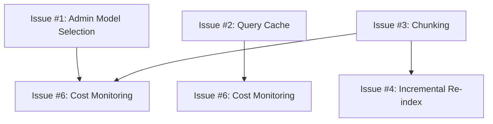

# Embedding Optimization Issues

**Data**: 2025-11-22
**Category**: Performance & Cost Optimization
**Status**: 📋 Planning
**Priority**: 🟡 High

---

## 📊 Overview

Piano completo di ottimizzazione del sistema di embeddings per MeepleAI. Obiettivo: **ridurre costi da $30/mese a ~$0-5/mese** mantenendo >95% accuracy, con configurabilità admin per modelli OpenRouter.

**Statistiche**:
- **Totale Issues**: 6
- **Risparmio Stimato**: $25-30/mese (83-100%)
- **Performance Gain**: 60-75% latency reduction
- **Effort Totale**: 40-50 ore
- **Timeline**: 3-4 settimane

---

## 🎯 Issues per Priorità

### 🔴 Priorità CRITICA (Quick Wins)

| Issue | Risparmio | Effort | Impact |
|-------|-----------|--------|--------|
| [Issue #1: Admin UI Embedding Model Selection](./issue-001-admin-embedding-model-selection.md) | $0-30/mese | 12-16h | ⬆️ Flexibility, ⬇️ Costs |
| [Issue #2: Query Embedding Cache](./issue-002-query-embedding-cache.md) | 60% latency | 6-8h | ⬆️ Performance |

### 🟡 Priorità ALTA

| Issue | Risparmio | Effort | Impact |
|-------|-----------|--------|--------|
| [Issue #3: Chunking Optimization](./issue-003-chunking-optimization.md) | -30% embeddings | 8-10h | ⬆️ Performance, ⬇️ Storage |
| [Issue #4: Incremental Re-indexing](./issue-004-incremental-reindexing.md) | 90% re-index | 12-16h | ⬇️ Costs |

### 🟢 Priorità MEDIA

| Issue | Risparmio | Effort | Impact |
|-------|-----------|--------|--------|
| [Issue #5: Ollama Batch Parallelization](./issue-005-ollama-batch-parallel.md) | 3-5x speed | 4-6h | ⬆️ Performance |
| [Issue #6: Embedding Cost Monitoring](./issue-006-embedding-cost-monitoring.md) | Visibility | 6-8h | ⬆️ Observability |

---

## 📈 Cost Reduction Roadmap

### Current State
```
Provider: OpenAI text-embedding-3-small
Cost: $0.020 per 1M tokens
Monthly Usage:
  - PDF Uploads: 500 × 100 chunks = 50K embeddings
  - User Queries: 100K queries = 100K embeddings
  - Total: 150K embeddings × ~500 tokens = 75M tokens
  - Monthly Cost: 75M × $0.020/M = $30-50/mese ❌
```

### Target State (After All Issues)
```
Provider: Admin-configurable (Ollama local OR OpenRouter)
  - Development: Ollama nomic-embed-text (FREE)
  - Production: Ollama OR OpenRouter (admin choice)

Optimizations:
  - Query cache: 60% cache hit = -60% query embeddings
  - Chunk optimization: -30% PDF embeddings
  - Incremental re-index: -90% re-index embeddings

Monthly Cost:
  - Ollama (local): $0/mese ✅
  - OpenRouter (if admin selects): $3-10/mese ✅ (with cache)

Savings: $30-50 → $0-10 = 67-100% reduction ✅
```

---

## 🚀 Implementation Phases

### Phase 1: Admin Configuration (Week 1)
**Goal**: Enable admin to select embedding provider and model

- ✅ Issue #1: Admin UI Embedding Model Selection
  - Add OpenRouter embedding models catalog
  - Admin page for model selection
  - Runtime model switching
  - Cost estimation per model

**Deliverable**: Admin can switch between Ollama and 10+ OpenRouter embedding models

### Phase 2: Performance Optimization (Week 2)
**Goal**: Reduce latency and improve user experience

- ✅ Issue #2: Query Embedding Cache
  - Memory cache for frequent queries
  - 60% cache hit rate target
  - Cache invalidation strategy

- ✅ Issue #5: Ollama Batch Parallelization
  - Parallel embedding generation
  - 3-5x faster PDF indexing

**Deliverable**: 60-75% latency reduction, faster PDF uploads

### Phase 3: Cost Optimization (Week 3)
**Goal**: Minimize embedding generation costs

- ✅ Issue #3: Chunking Optimization
  - Adaptive chunk sizing (512 → 768 char)
  - Test accuracy impact (target >95%)
  - 30% fewer chunks per PDF

- ✅ Issue #4: Incremental Re-indexing
  - Chunk hash comparison
  - Only re-embed modified chunks
  - 90% reduction on re-index

**Deliverable**: 50-70% total embedding reduction

### Phase 4: Monitoring & Analytics (Week 4)
**Goal**: Cost visibility and optimization insights

- ✅ Issue #6: Embedding Cost Monitoring
  - Grafana dashboard
  - Cost breakdown by provider
  - Usage trends and alerts

**Deliverable**: Real-time cost tracking, proactive optimization

---

## 🔧 OpenRouter Embedding Models Support

### Supported Models (Issue #1)

| Model | Provider | Dimensions | Cost/1M tokens | Best For |
|-------|----------|------------|----------------|----------|
| `text-embedding-3-small` | OpenAI | 1536 | $0.020 | General purpose |
| `text-embedding-3-large` | OpenAI | 3072 | $0.130 | High accuracy |
| `text-embedding-ada-002` | OpenAI | 1536 | $0.100 | Legacy |
| `voyage-2` | Voyage AI | 1024 | $0.100 | Multilingual |
| `jina-embeddings-v2-base-en` | Jina AI | 768 | FREE tier | English only |
| `nomic-embed-text` | Ollama (local) | 768 | $0 (FREE) | Cost-effective |

**Admin Selection**: Dynamic dropdown with cost preview

---

## 📊 Success Metrics

| Metric | Before | Target | Status |
|--------|--------|--------|--------|
| **Monthly Cost** | $30-50 | $0-10 | 🔴 Pending |
| **Query Latency (P95)** | 200ms | 80ms (cache) | 🔴 Pending |
| **PDF Indexing Time** | 30s (100 chunks) | 10s (parallel) | 🟡 Pending |
| **Storage (Qdrant)** | 1536 dim | 768 dim (-50%) | 🟡 Pending |
| **Re-index Cost** | 100% embeddings | 10% (incremental) | 🟢 Pending |
| **Cache Hit Rate** | 0% | 60%+ | 🔴 Pending |

---

## 🧪 Testing Strategy

### Unit Tests
```bash
# Test embedding provider switching
dotnet test --filter "EmbeddingServiceTests"

# Test cache hit/miss scenarios
dotnet test --filter "CachedEmbeddingServiceTests"

# Test chunking optimization
dotnet test --filter "TextChunkingServiceTests"
```

### Integration Tests
```bash
# Test OpenRouter embedding models
dotnet test --filter "OpenRouterEmbeddingIntegrationTests"

# Test incremental re-indexing
dotnet test --filter "IncrementalIndexingTests"
```

### Performance Tests
```bash
# Benchmark embedding latency
dotnet test --filter "EmbeddingPerformanceTests"

# Measure cache effectiveness
# Target: >60% hit rate after 1 hour
```

### Acceptance Tests
```bash
# Admin can select model via UI
pnpm test:e2e -- admin-embedding-selection

# Cost tracking dashboard shows accurate data
pnpm test:e2e -- embedding-cost-dashboard
```

---

## 📂 Repository Structure

```
docs/issues/embedding-optimization/
├── README.md                                    # This file
├── issue-001-admin-embedding-model-selection.md # Admin UI
├── issue-002-query-embedding-cache.md           # Performance
├── issue-003-chunking-optimization.md           # Cost reduction
├── issue-004-incremental-reindexing.md          # Cost reduction
├── issue-005-ollama-batch-parallel.md           # Performance
└── issue-006-embedding-cost-monitoring.md       # Observability
```

---

## 🔗 Dependencies

### Issue Dependencies


### External Dependencies
- HybridLlmService (existing, ADR-004b)
- Admin UI infrastructure
- Grafana/Prometheus monitoring
- Qdrant vector database

---

## 🎯 Migration Plan

### Step 1: Backup Current Config
```bash
# Save current embedding configuration
cp .env.production .env.production.backup.$(date +%Y%m%d)

# Document current model
echo "Current: text-embedding-3-small (OpenAI)" > EMBEDDING_MIGRATION.md
```

### Step 2: Deploy Issue #1 (Admin UI)
```bash
# Deploy admin model selection
# Admin can test different models in staging
```

### Step 3: Gradual Rollout
```bash
# Week 1: Test Ollama in development
# Week 2: Test in staging with A/B test
# Week 3: Production rollout (50% traffic)
# Week 4: Full production (100% traffic)
```

### Step 4: Monitor & Optimize
```bash
# Track metrics in Grafana
# Adjust model based on cost/accuracy trade-off
```

---

## 📚 Related Documentation

- [EmbeddingService.cs](../../../apps/api/src/Api/Services/EmbeddingService.cs)
- [ADR-004b: Hybrid LLM Strategy](../../01-architecture/adr/adr-004b-hybrid-llm.md)
- [Cost Tracking System (BGAI-026)](../../02-development/implementation/bgai-026-cost-tracking.md)
- [Multi-Environment Strategy](../../05-operations/deployment/multi-environment-strategy.md)

---

## 👥 Team & Ownership

**Lead Developer**: Backend Team
**Reviewers**: Engineering Lead, DevOps
**QA Engineer**: QA Team
**Admin Testing**: Product Manager

**Contact**: Per domande, contattare #backend-optimization (Slack)

---

**Last Updated**: 2025-11-22
**Version**: 1.0
**Author**: Engineering Team
