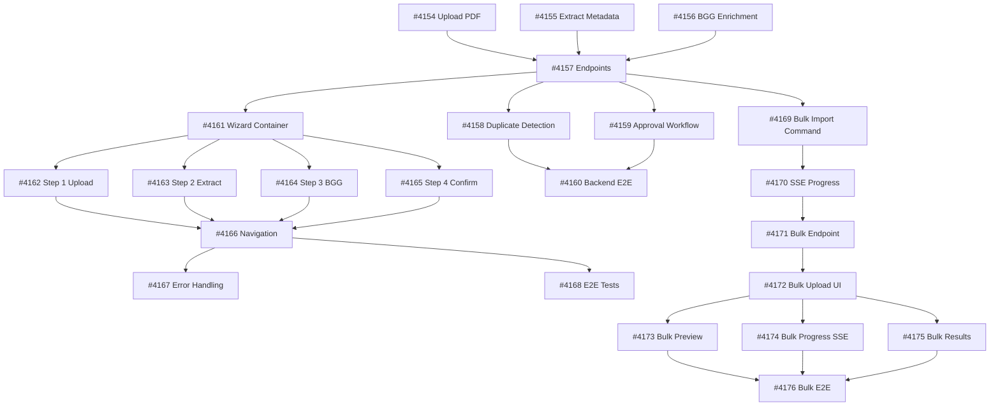

# Plan: Epic #4136 - PDF Wizard per SharedGameCatalog

## Hypothesis (仮説)

Creare un sistema wizard multi-step che permetta ad Admin/Editor di:
1. **Upload PDF locale** → Estrazione automatica metadati con AI
2. **Match BGG** → Arricchimento dati con BoardGameGeek
3. **Bulk Import** → Import massivo giochi da JSON con BGG IDs

**Perché questo approccio**:
- Riutilizza `EnhancedPdfProcessingOrchestrator` esistente (DocumentProcessing BC)
- Riutilizza `ImportGameFromBggCommand` + `IBggApiClient` esistenti
- Pattern CQRS già ben consolidato in SharedGameCatalog BC
- Approval workflow già esistente (`SubmitSharedGameForApprovalCommand`)

## Expected Outcomes (定量的)

**Deliverables**:
- 23 sub-issues completate in 3 fasi sequenziali
- 7 nuovi endpoint REST (wizard + bulk import)
- ~15 nuovi command/query handlers
- ~30 componenti React (wizard steps + bulk import UI)

**Quality Metrics**:
- Backend test coverage: 90%+ (target standard)
- Frontend test coverage: 85%+ (target standard)
- E2E tests: 2 complete flows (wizard + bulk)
- Code review score: ≥80% per ogni PR

**Performance Targets**:
- PDF upload (50MB): <5s
- Metadata extraction: <30s
- BGG API match: <2s
- Bulk import 100 games: <5 minutes

**Timeline**:
- Phase 1 (Backend Wizard): 5-6 giorni lavorativi
- Phase 2 (Frontend Wizard): 6-7 giorni lavorativi
- Phase 3 (Bulk Import): 4-5 giorni lavorativi
- **Total**: 15-18 giorni (3-4 settimane)

## Risks & Mitigation

### 🔴 Critical Risks

**Risk 1: SmolDocling OCR accuracy insufficiente**
- Impact: Extracted metadata poco accurato → Manual input fallback required
- Probability: Medium (dipende da qualità PDF)
- Mitigation:
  - Implementare confidence scoring (0.0-1.0)
  - Threshold ≥0.50 required, ≥0.80 optimal
  - Fallback: Manual input se confidence <0.50
  - Test con golden dataset (10+ PDF vari formati)

**Risk 2: BGG API rate limiting / timeout**
- Impact: Match BGG fallisce → Wizard bloccato
- Probability: Low-Medium (BGG API può essere lento)
- Mitigation:
  - Timeout 10s con retry (3 tentativi)
  - Manual BGG ID input come alternativa
  - Cache BGG responses (HybridCache 24h)
  - Error handling graceful (continua wizard senza BGG data)

**Risk 3: Approval workflow breaking changes**
- Impact: Editor/Admin flow rotto → Deployment bloccato
- Probability: Low (workflow già esistente)
- Mitigation:
  - Issue #6 (Approval Workflow Extension) = verifica + test existing
  - NO breaking changes al workflow esistente
  - Integration tests: Editor create → Admin approve
  - Rollback plan: revert single issue se breaking

### 🟡 Important Risks

**Risk 4: Frontend wizard state management complexity**
- Impact: Bug state transitions → UX rotta
- Probability: Medium (4 steps, molti state fields)
- Mitigation:
  - Zustand store centralizzato (#8)
  - Unit tests per ogni state transition
  - Checkpoint auto-save ogni step (LocalStorage)
  - Session timeout handling (preserva draft)

**Risk 5: Bulk import performance con 1000+ games**
- Impact: Timeout, memory overflow → Import fallisce
- Probability: Medium (bulk import intensivo)
- Mitigation:
  - Batching: 100 games per batch max
  - SSE progress tracking (#17)
  - Rate limiting: 1 bulk import ogni 5 minuti
  - Background job processing (BggImportQueueBackgroundService)

**Risk 6: E2E test flakiness (Playwright)**
- Impact: CI/CD instabile → Deploy rallentati
- Probability: Medium (E2E tests notoriamente flaky)
- Mitigation:
  - Mock BGG API per deterministic tests
  - Mock SmolDocling per fast tests
  - Retry failed tests (max 3)
  - Visual regression con snapshot tolerance

### 🟢 Low Risks

**Risk 7: Dependency upgrade breaking changes**
- Impact: Build failure durante implementazione
- Probability: Low (no dependency changes planned)
- Mitigation: Lock dependency versions durante Epic

## Implementation Strategy

### Sequential Phase Execution (Backend → Frontend → Bulk)

**Rationale**: Frontend dipende da backend API completo

```yaml
Phase 1 (Backend Wizard):
  Blockers: None
  Parallel: Issues #1, #2, #3 possono essere parallele DOPO initial setup
  Critical Path: #1 → #2 → #3 → #4 → #5, #6, #7

Phase 2 (Frontend Wizard):
  Blockers: Requires Phase 1 complete (#4 endpoints)
  Parallel: Steps #9-#12 possono essere paralleli DOPO #8 (container)
  Critical Path: #8 → [#9, #10, #11, #12 parallel] → #13 → #14, #15

Phase 3 (Bulk Import):
  Blockers: Requires Phase 1 #4 (endpoints infra)
  Parallel: Backend (#16, #17, #18) + Frontend (#19-#22) possono overlappare
  Critical Path: #16 → #17 → #18 || #19 → [#20, #21, #22 parallel] → #23
```

### MCP Tool Loading Strategy (Zero-Token Baseline)

**Phase 1 (Backend)**:
```yaml
Load: [serena, context7]
- serena: Symbol navigation (existing CQRS patterns)
- context7: FluentValidation patterns, MediatR best practices
Unload After: Phase 1 complete
```

**Phase 2 (Frontend)**:
```yaml
Load: [magic, context7, serena]
- magic: UI component generation (21st.dev patterns)
- context7: React patterns, Zustand best practices
- serena: Frontend symbol navigation
Unload After: Phase 2 complete
```

**Phase 3 (Bulk + Testing)**:
```yaml
Load: [playwright, sequential, serena]
- playwright: E2E testing automation
- sequential: Complex debugging analysis
- serena: Cross-file test coordination
Unload After: Epic complete
```

## Quality Gates (Per Issue)

**Backend Issues (#1-#7, #16-#18)**:
```yaml
Gate 1 - Compilation:
  - dotnet build --no-restore succeeds
  - No new warnings

Gate 2 - Unit Tests:
  - dotnet test --filter "Category=Unit" passes
  - Coverage ≥90% for new code

Gate 3 - Integration Tests:
  - dotnet test --filter "Category=Integration" passes
  - Testcontainers DB scenarios green

Gate 4 - Code Review:
  - /code-review:code-review score ≥80%
  - No critical issues (confidence ≥70%)
```

**Frontend Issues (#8-#15, #19-#23)**:
```yaml
Gate 1 - Type Check:
  - pnpm typecheck passes
  - No TypeScript errors

Gate 2 - Unit Tests:
  - pnpm test passes
  - Coverage ≥85% for new components

Gate 3 - Lint:
  - pnpm lint passes
  - No ESLint errors

Gate 4 - E2E Tests (per #15, #23):
  - pnpm test:e2e passes
  - Visual regression baseline green

Gate 5 - Code Review:
  - /code-review:code-review score ≥80%
  - No critical issues
```

## Dependency Graph



## Parallel Execution Opportunities

### Week 1 - Backend Foundation (Sequential)
- **Day 1**: #4154 (Upload PDF) ← Foundation
- **Day 2**: #4155 (Extract Metadata) ← Depends on #4154
- **Day 3**: #4156 (BGG Enrichment) ← Depends on #4155
- **Day 4**: #4157 (Endpoints) ← Depends on #4154, #4155, #4156
- **Day 5**: **PARALLEL** → #4158 (Duplicate) || #4159 (Approval)

### Week 2 - Frontend Wizard (Mixed)
- **Day 6**: #4161 (Wizard Container) ← Depends on #4157 endpoints
- **Day 7-8**: **PARALLEL** → #4162 (Step 1) || #4163 (Step 2) || #4164 (Step 3) || #4165 (Step 4)
- **Day 9**: #4166 (Navigation) ← Integration
- **Day 10**: **PARALLEL** → #4167 (Error Handling) || #4160 (Backend E2E)

### Week 3 - Bulk Import Backend + Frontend (Mixed)
- **Day 11**: #4169 (Bulk Command)
- **Day 12**: #4170 (SSE Progress)
- **Day 13**: **PARALLEL** → #4171 (Bulk Endpoint) || #4172 (Bulk Upload UI)
- **Day 14**: **PARALLEL** → #4173 (Preview) || #4174 (Progress UI) || #4175 (Results)
- **Day 15**: #4168 (Frontend E2E Wizard)

### Week 4 - Testing & Polish
- **Day 16**: #4176 (Bulk E2E)
- **Day 17**: Documentation (#24, #25) + Final polish
- **Day 18**: Buffer per fix code review issues

**Maximum Parallelization**: 4 issues concorrenti (Day 7-8)

## Next Actions (今回)

1. **Immediate**: Eseguire `/implementa 4154` (Upload PDF Command)
2. **Then**: Sequential execution #4155 → #4156 → #4157
3. **Checkpoint**: Ogni sera write_memory("execution/epic-4136/do")
4. **Review**: Code review OBBLIGATORIO per ogni PR
5. **Validate**: Checkbox aggiornate su GitHub ad ogni completamento

## Success Criteria (Epic Closure)

**Functional**:
- ✅ Wizard completo funzionante (4 steps)
- ✅ Bulk import operativo con SSE progress
- ✅ Approval workflow Editor → Admin integrato
- ✅ Duplicate detection accurato con warnings

**Technical**:
- ✅ 23/23 sub-issues closed
- ✅ Test coverage targets raggiunti (90% backend, 85% frontend)
- ✅ All E2E tests green (#7, #15, #23)
- ✅ Performance targets rispettati

**Documentation**:
- ✅ API reference completa (Swagger + Postman)
- ✅ User guide con screenshots
- ✅ PDCA complete (plan → do → check → act)
- ✅ MEMORY.md aggiornata con patterns learned

---

**Created**: 2026-02-12
**PM Agent**: Auto-orchestration con phase-based MCP loading
**Execution Model**: Sequential phases, parallel issues within phases
