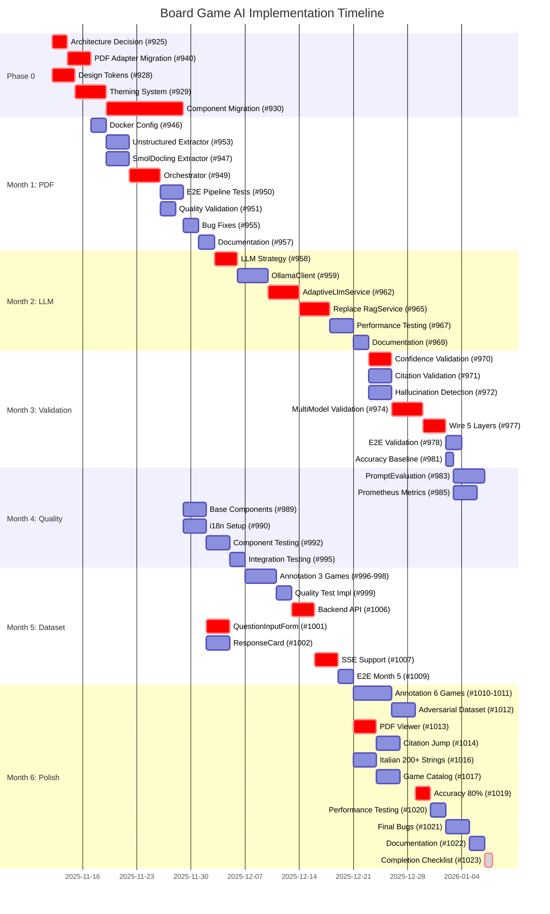

# Gantt Chart - Board Game AI Implementation

**Timeline**: 28 settimane (7 mesi)
**Legenda**:
- 🔴 Critical path
- 🟡 High priority
- 🟢 Medium/Low priority
- ⚡ Can run in parallel
- 🔗 Dependency

---

## VISUAL GANTT CHART

```
SETTIMANE:  1    2    3    4    5    6    7    8    9   10   11   12   13   14   15   16   17   18   19   20   21   22   23   24   25   26   27   28
            │────│────│────│────│────│────│────│────│────│────│────│────│────│────│────│────│────│────│────│────│────│────│────│────│────│────│────│────│

PHASE 0: FOUNDATION
─────────────────────────────────────────────────────────────────────────────────────────────────────────────────────────────────────────────────────────────
Backend:
#925 🔴   [██]                                                                                                                     Architecture Decision
#940 🔴      [███]                                                                                                                 PDF Adapter Migration
            🔗925

Frontend:
#988 ✅   [DONE] Shadcn/ui
#928 🔴   [███]                                                                                                                    Design Tokens
#929 🔴      [████]                                                                                                                Theming System
            🔗928
#930 🔴         [████████]                                                                                                        Component Migration
            🔗928,929

MONTH 1: PDF PROCESSING (Weeks 3-6)
─────────────────────────────────────────────────────────────────────────────────────────────────────────────────────────────────────────────────────────────
Backend:
#946 🟡         [██] ⚡                                                                                                           Docker Config
#953 🔴            [███]                                                                                                          Unstructured Extractor
               🔗946,940
#954 🟢               [██]                                                                                                       Unstructured Tests
               🔗953
#947 🔴            [███] ⚡                                                                                                       SmolDocling Extractor
               🔗946,940
#948 🟢               [██] ⚡                                                                                                     SmolDocling Tests
               🔗947
#949 🔴                  [████]                                                                                                  Orchestrator (3-stage)
               🔗953,947
#950 🟡                     [███]                                                                                                E2E Pipeline Tests
               🔗949
#951 🟡                     [██] ⚡                                                                                               Quality Validation
               🔗949
#955 🟢                        [██]                                                                                              Bug Fixes
               🔗950
#956 🟢                           [█]                                                                                            Code Review
               🔗ALL
#957 🟢                           [██]                                                                                           Documentation
               🔗ALL

MONTH 2: LLM INTEGRATION (Weeks 7-10)
─────────────────────────────────────────────────────────────────────────────────────────────────────────────────────────────────────────────────────────────
Backend:
#958 🔴                              [███]                                                                                       LLM Strategy Evaluation
#959 🔴                                 [████]                                                                                    OllamaClient
               🔗958
#960 🟡                                 [████] ⚡                                                                                 OpenRouterClient (conditional)
               🔗958
#961 🟢                                     [██]                                                                                 LLM Client Tests
               🔗959,960
#962 🔴                                        [████]                                                                             AdaptiveLlmService
               🔗959,960
#963 🟢                                           [█]                                                                            Feature Flag Config
               🔗962
#964 🟡                                           [███]                                                                          Integration Tests Routing
               🔗962
#965 🔴                                              [████]                                                                       Replace RagService LLM calls
               🔗962
#966 🟡                                                 [██]                                                                      Backward Compat Tests
               🔗965
#967 🟡                                                 [███] ⚡                                                                  Performance Testing
               🔗965
#968 🟢                                                    [██] ⚡                                                                Cost Tracking
               🔗962
#969 🟢                                                       [██]                                                                Documentation + ADR
               🔗ALL

MONTH 3: MULTI-MODEL VALIDATION (Weeks 11-14)
─────────────────────────────────────────────────────────────────────────────────────────────────────────────────────────────────────────────────────────────
Backend:
#970 🔴                                                          [███] ⚡                                                         ConfidenceValidation
               🔗M2
#971 🔴                                                          [███] ⚡                                                         CitationValidation
               🔗M2
#972 🔴                                                          [███] ⚡                                                         HallucinationDetection
               🔗M2
#973 🟢                                                             [██]                                                         Validation Tests
               🔗970,971,972
#974 🔴                                                                [████]                                                     MultiModelValidation
               🔗962
#975 🟡                                                                   [██]                                                   Consensus Similarity
               🔗974
#976 🟢                                                                     [███]                                                Consensus Tests
               🔗974,975
#977 🔴                                                                        [███]                                             Wire 5 Validation Layers
               🔗970-976
#978 🟡                                                                          [██]                                            E2E Validation Testing
               🔗977
#979 🟢                                                                          [███] ⚡                                         Parallel Optimization
               🔗977
#980 🟢                                                                             [██]                                         Bug Fixes
               🔗978
#981 🟡                                                                                [█]                                        Accuracy Baseline
               🔗977
#982 🟢                                                                                [██]                                       Update ADRs
               🔗ALL

MONTH 4: QUALITY FRAMEWORK (Weeks 15-18)
─────────────────────────────────────────────────────────────────────────────────────────────────────────────────────────────────────────────────────────────
Backend:
#983 🟡                                                                                   [████]                                  PromptEvaluationService
               🔗M3
#984 🟢                                                                                      [██]                                 Automated Evaluation Job
               🔗983
#985 🟡                                                                                      [███] ⚡                              Prometheus Metrics
               🔗983
#986 🟢                                                                                         [███] ⚡                           Grafana Dashboard
               🔗985
#987 🟢                                                                                            [██]                          Quality Tests
               🔗983-986

Frontend:
#989 🟡                                                                                   [███] ⚡                                 Base Components (BGAI)
               🔗930
#990 🔴                                                                                   [███] ⚡                                 i18n Setup
               🔗NONE (parallel)
#992 🟡                                                                                      [███]                                Component Testing (90%+)
               🔗989,990
#993 🟡                                                                                         [██] ⚡                           Responsive Testing
               🔗989
#994 🟢                                                                                            [██] ⚡                        Build Optimization
               🔗989-993
#995 🟡                                                                                               [██]                       Integration Testing
               🔗989-994

MONTH 5: GOLDEN DATASET (Weeks 19-22)
─────────────────────────────────────────────────────────────────────────────────────────────────────────────────────────────────────────────────────────────
Backend:
#996 🟡                                                                                                  [███] ⚡                 Annotation: Terraforming Mars
#997 🟡                                                                                                  [██] ⚡                  Annotation: Wingspan
#998 🟡                                                                                                  [██] ⚡                  Annotation: Azul
#999 🟡                                                                                                     [██]                 Quality Test Implementation
               🔗996-998
#1000 🟡                                                                                                       [█]               First Accuracy Test
               🔗999
#1006 🔴                                                                                                  [███]                  Backend API Integration
               🔗M4
#1007 🟡                                                                                                     [███]                Streaming SSE Support
               🔗1006

Frontend:
#1001 🔴                                                                                                  [███]                  QuestionInputForm
               🔗989
#1002 🔴                                                                                                  [███] ⚡                ResponseCard Component
               🔗989
#1003 🟢                                                                                                     [██] ⚡              GameSelector Dropdown
               🔗989
#1004 🟢                                                                                                        [██] ⚡           Loading/Error States
               🔗1001-1003
#1005 🟡                                                                                                           [██]          Jest Tests Q&A (20)
               🔗1001-1004
#1007 🟡                                                                                                              [███]       SSE Client Implementation
  (FE)        🔗BE#1007
#1008 🟢                                                                                                                 [██]    Error Handling/Retry
               🔗1007
#1009 🟡                                                                                                                    [██] E2E Testing Month 5
               🔗1001-1008

MONTH 6: ITALIAN UI & POLISH (Weeks 23-28)
─────────────────────────────────────────────────────────────────────────────────────────────────────────────────────────────────────────────────────────────
Backend:
#1010 🟡                                                                                                                       [████] ⚡ Annotation: 3 games (30 Q&A)
#1011 🟡                                                                                                                       [████] ⚡ Annotation: 3 games (30 Q&A)
#1012 🟡                                                                                                                          [███] Adversarial Dataset
               🔗1010,1011
#1019 🔴                                                                                                                             [██] Accuracy Validation (80%)
               🔗1010-1012
#1020 🟡                                                                                                                             [██] ⚡ Performance Testing
               🔗ALL
#1021 🟢                                                                                                                                [██] Bug Fixes
               🔗1019,1020
#1022 🟢                                                                                                                                   [██] Documentation
               🔗ALL
#1023 🟡                                                                                                                                      [█] Completion Checklist
               🔗ALL

Frontend:
#1013 🔴                                                                                                                       [███]     PDF Viewer Integration
               🔗M5
#1014 🟡                                                                                                                          [███]  Citation → Jump to Page
               🔗1013
#1015 🟢                                                                                                                             [██] PDF Viewer Tests
               🔗1013,1014
#1016 🔴                                                                                                                       [███] ⚡   Italian UI (200+ strings)
               🔗990
#1017 🟢                                                                                                                          [███] ⚡ Game Catalog Page
  (FE)        🔗BE#1017
#1018 🟡                                                                                                                                [██] E2E Testing (Q→PDF)
               🔗1013-1017

ADMIN CONSOLE (OPTIONAL - Can Run Anytime)
─────────────────────────────────────────────────────────────────────────────────────────────────────────────────────────────────────────────────────────────
FASE 3:
#911 🟢                        [██] ⚡                                                                                           UserActivityTimeline
#912 🟢                        [██] ⚡                                                                                           BulkActionBar
#913 🟢                           [██]                                                                                          Jest Tests
               🔗911,912
#914 🟢                              [███]                                                                                      E2E + Security
               🔗ALL

FASE 4:
#915     [EPIC - Contains #916-922]
#916 🟢                                 [███]                                                                                    ReportingService
               🔗FASE3
#917 🟢                                    [██]                                                                                  Report Templates
               🔗916
#918 🟢                                       [██]                                                                               Email Delivery
               🔗916
#919 🟢                                          [██]                                                                            Unit Tests Reporting
               🔗916-918
#920 🟢                                             [███]                                                                        Report Builder UI
               🔗916
#921 🟢                                                [██]                                                                      Enhanced Alert UI
               🔗916
#922 🟢                                                   [██]                                                                   E2E Report Tests
               🔗916-921

FRONTEND EPICS (LOW PRIORITY - Can Run Alongside BGAI)
─────────────────────────────────────────────────────────────────────────────────────────────────────────────────────────────────────────────────────────────
#931          [████████████████████████████]                                                                                    Epic: React 19 Optimization
  (Epic)      🔗930 (after Phase 1)
#933                                             [████████████████████████]                                                     Epic: App Router Migration
  (Epic)      🔗931 (after Phase 2)
#932                                                                        [████████████████████]                              Epic: Advanced Features
  (Epic)      🔗933 (after Phase 3)
#934                                                                                                   [████████████]           Epic: Design Polish
  (Epic)      🔗932 (after Phase 4)
#935                                                                                                                      [████████] Epic: Performance & A11y
  (Epic)      🔗934 (after Phase 5)

INFRASTRUCTURE (Can Run Anytime)
─────────────────────────────────────────────────────────────────────────────────────────────────────────────────────────────────────────────────────────────
#936 🟢      [██] ⚡                                                                                                             Infisical POC (Research)
```

---

## PARALLELIZATION OPPORTUNITIES

### Week 1-2 (Foundation)
```
PARALLEL:
├─ Backend: #925 (Architecture Decision)
└─ Frontend: #928 (Design Tokens)

SEQUENTIAL:
#925 → #940 (PDF Adapter)
#928 → #929 (Theming) → #930 (Component Migration)
```

### Week 3-6 (Month 1)
```
PARALLEL:
├─ #946 (Docker Config)
├─ #947 (SmolDocling) + #948 (Tests)
└─ #953 (Unstructured) + #954 (Tests)

SEQUENTIAL:
[#946, #947, #953] → #949 (Orchestrator) → #950 (E2E Tests)
                                         → #951 (Quality) ⚡

FINAL:
#950, #951 → #955 (Bug Fixes) → #956 (Review) + #957 (Docs) ⚡
```

### Week 7-10 (Month 2)
```
PARALLEL:
├─ #959 (OllamaClient)
└─ #960 (OpenRouterClient) - if Option B

SEQUENTIAL:
#958 (Strategy) → [#959, #960] → #961 (Tests) → #962 (Adaptive) → #965 (RagService)

PARALLEL FINISH:
├─ #966 (Backward Compat)
├─ #967 (Performance)
└─ #968 (Cost Tracking)

FINAL: #969 (Docs)
```

### Week 11-14 (Month 3)
```
PARALLEL START:
├─ #970 (Confidence)
├─ #971 (Citation)
└─ #972 (Hallucination)

SEQUENTIAL:
[#970, #971, #972] → #973 (Tests) → #974 (MultiModel) → #975 (Similarity) → #976 (Tests) → #977 (Wire All)

PARALLEL FINISH:
├─ #978 (E2E)
└─ #979 (Optimization)

FINAL:
#978, #979 → #980 (Bugs) → #981 (Accuracy) + #982 (ADRs) ⚡
```

### Week 15-18 (Month 4)
```
BACKEND PARALLEL:
├─ #983 (PromptEval)
├─ #985 (Prometheus) ⚡
└─ #986 (Grafana) ⚡

FRONTEND PARALLEL:
├─ #989 (Base Components)
└─ #990 (i18n Setup)

SEQUENTIAL:
Backend: #983 → #984 (Cron) → #987 (Tests)
Frontend: [#989, #990] → #992 (Jest) → [#993 (Responsive), #994 (Build)] ⚡ → #995 (Integration)
```

### Week 19-22 (Month 5)
```
BACKEND PARALLEL:
├─ #996 (Terraforming Mars)
├─ #997 (Wingspan)
└─ #998 (Azul)

FRONTEND PARALLEL:
├─ #1001 (QuestionInputForm)
├─ #1002 (ResponseCard)
└─ #1003 (GameSelector)

SEQUENTIAL:
Backend: [#996-998] → #999 (Quality Tests) → #1000 (First Accuracy) → #1006 (API) → #1007 (SSE)
Frontend: [#1001-1003] → #1004 (Loading/Error) → #1005 (Jest) → #1007 (SSE Client) → #1008 (Retry) → #1009 (E2E)
```

### Week 23-28 (Month 6)
```
BACKEND PARALLEL:
├─ #1010 (3 games, 30 Q&A)
├─ #1011 (3 games, 30 Q&A)
└─ #1012 (Adversarial)

FRONTEND PARALLEL:
├─ #1013 (PDF Viewer)
└─ #1016 (Italian 200+ strings)

SEQUENTIAL:
Backend: [#1010-1012] → #1019 (Accuracy 80%) → [#1020 (Performance), #1021 (Bugs)] ⚡ → #1022 (Docs) → #1023 (Checklist)
Frontend: #1013 → #1014 (Citation Jump) → #1015 (PDF Tests)
         #1016 + #1017 (Game Catalog) ⚡ → #1018 (E2E Final)
```

---

## CRITICAL PATH ANALYSIS

### Longest Chain (Critical Path): 🔴 28 weeks
```
#925 (Arch) → #940 (PDF Adapter) → #946 (Docker) → #953 (Unstructured) → #949 (Orchestrator) →
#950 (E2E) → #955 (Bugs) → #958 (LLM Strategy) → #959 (Ollama) → #962 (Adaptive) →
#965 (RagService) → #970 (Confidence) → #974 (MultiModel) → #977 (Wire 5 Layers) →
#978 (E2E) → #983 (PromptEval) → #999 (Quality Test) → #1006 (API) → #1001 (QuestionForm) →
#1013 (PDF Viewer) → #1019 (Accuracy) → #1023 (Completion)
```

### Parallel Efficiency Gains

**Week 3-6 (Month 1)**: 40% time saved
- Without parallelization: 16 giorni
- With parallelization: 10 giorni
- Savings: 6 giorni

**Week 11-14 (Month 3)**: 35% time saved
- Without: 20 giorni
- With: 13 giorni
- Savings: 7 giorni

**Week 19-22 (Month 5)**: 45% time saved
- Without: 18 giorni
- With: 10 giorni
- Savings: 8 giorni

**Total Time Savings**: ~21 giorni (3 settimane) risparmiati con parallelizzazione

---

## DEPENDENCY MATRIX

### Backend Dependencies
```
Month 1 → Month 2 → Month 3 → Month 4 → Month 5 → Month 6
  ↓         ↓         ↓         ↓         ↓         ↓
PDF      LLM      Validation Quality   Dataset  Polish
Pipeline  Adapt    5-Layer   Framework  50 Q&A   100 Q&A

#925 (Arch) blocks ALL
#940 (Adapter) blocks Month 1
Month 1 complete blocks Month 2
Month 2 complete blocks Month 3
Month 3 complete blocks Month 4
Month 4 complete blocks Month 5
Month 5 complete blocks Month 6
```

### Frontend Dependencies
```
Foundation → Month 4 → Month 5 → Month 6
    ↓          ↓         ↓         ↓
#928-930   Components Q&A UI   Italian UI
Tokens     + i18n              + PDF

#988 (shadcn) ✅ blocks #928-930
#928-930 blocks Month 4 frontend
Month 4 frontend blocks Month 5
Month 5 frontend blocks Month 6
```

### Cross-Track Dependencies
```
Backend Month 4 → Frontend Month 4 (API contracts)
Backend Month 5 (#1006 API) → Frontend Month 5 (#1001-1009 UI)
Backend Month 6 → Frontend Month 6 (PDF endpoints)
```

---

## RESOURCE ALLOCATION RECOMMENDATIONS

### Optimal Team Composition

**Weeks 1-10 (Foundation + Month 1-2)**:
- 2 Backend devs (1 on architecture, 1 on PDF/LLM)
- 1 Frontend dev (design system migration)
- 0.5 DevOps (Docker, infrastructure)

**Weeks 11-18 (Month 3-4)**:
- 2 Backend devs (validation layers, quality framework)
- 1 Frontend dev (BGAI components, i18n)
- 0.5 QA (testing, validation)

**Weeks 19-28 (Month 5-6)**:
- 1 Backend dev (dataset annotation, performance)
- 2 Frontend devs (Q&A UI, PDF viewer, Italian translations)
- 1 QA (E2E testing, accuracy validation)

---

## RISK MITIGATION TIMELINE

### Week 2: Architecture Review Gate
- ✅ #925 decision approved
- ✅ #940 migration complete
- Risk: Architecture change later = 2-4 weeks rework

### Week 6: PDF Pipeline Gate
- ✅ 3-stage fallback working
- ✅ Quality score ≥0.80
- Risk: PDF quality issues = 1-2 weeks debugging

### Week 10: LLM Integration Gate
- ✅ Adaptive service functional
- ✅ Cost tracking in place
- Risk: LLM cost overruns = budget issues

### Week 14: Validation Gate
- ✅ 5 layers working
- ✅ Multi-model consensus ≥0.90
- Risk: Validation complexity = performance issues

### Week 18: Quality Framework Gate
- ✅ Monitoring operational
- ✅ Frontend components ready
- Risk: UI/UX issues = user confusion

### Week 22: Dataset Gate
- ✅ 50 Q&A annotated
- ✅ Accuracy ≥80%
- Risk: Low accuracy = dataset expansion needed

### Week 28: Production Readiness Gate
- ✅ 100 Q&A validated
- ✅ Italian UI complete
- ✅ All tests passing
- Risk: Last-minute bugs = delayed launch

---

## MILESTONE DELIVERABLES

### Milestone 1 (Week 6): PDF Pipeline Ready
**Deliverables**:
- ✅ 3-stage PDF extraction
- ✅ Quality score ≥0.80
- ✅ Docker deployment
- ✅ E2E tests passing

### Milestone 2 (Week 10): LLM Integration Complete
**Deliverables**:
- ✅ Ollama + OpenRouter clients
- ✅ Adaptive routing
- ✅ Cost tracking
- ✅ Performance <3s P95

### Milestone 3 (Week 14): Validation Framework Live
**Deliverables**:
- ✅ 5-layer validation
- ✅ Multi-model consensus
- ✅ Accuracy baseline measured
- ✅ Monitoring operational

### Milestone 4 (Week 18): Frontend Foundation Ready
**Deliverables**:
- ✅ Design system complete
- ✅ i18n configured
- ✅ 20-30 components migrated
- ✅ BGAI base UI ready

### Milestone 5 (Week 22): Q&A Interface Functional
**Deliverables**:
- ✅ 50 Q&A golden dataset
- ✅ Question/Answer UI working
- ✅ SSE streaming functional
- ✅ E2E tests passing

### Milestone 6 (Week 28): Production Launch
**Deliverables**:
- ✅ 100 Q&A validated (80%+ accuracy)
- ✅ Italian UI (200+ strings)
- ✅ PDF viewer with citations
- ✅ Performance validated (<3s P95)
- ✅ All documentation complete

---

## VELOCITY TRACKING

### Expected Velocity (Story Points per Week)
- Week 1-6: 15-20 SP/week (ramp-up phase)
- Week 7-14: 25-30 SP/week (steady state)
- Week 15-22: 20-25 SP/week (integration complexity)
- Week 23-28: 15-20 SP/week (polish and testing)

### Story Point Estimates
- 🔴 Critical issues: 8-13 SP
- 🟡 High priority: 5-8 SP
- 🟢 Medium/Low: 2-5 SP

### Buffer Time (20% contingency)
- Expected: 28 weeks
- With 20% buffer: 34 weeks (~8 months)
- Recommended timeline: **7-8 months** for production launch

---

## GANTT CHART LEGEND

```
Symbol Meaning:
[███]   Work duration (each block = ~1 day)
⚡      Can run in parallel with other tasks
🔗XXX   Depends on issue #XXX or milestone XXX
M2      Depends on Month 2 completion
BE      Backend issue
FE      Frontend issue

Priority Colors:
🔴      Critical path (blocks other work)
🟡      High priority (important but not blocking)
🟢      Medium/Low (can be deferred if needed)
✅      Completed
```

---

## INTERACTIVE GANTT CHART (Mermaid)



---

## BOTTLENECK ANALYSIS

### Identified Bottlenecks

1. **Week 1-2: Architecture Decision (#925)**
   - Blocks: ALL backend work
   - Mitigation: Prioritize this decision ASAP
   - Parallel work: Frontend can proceed independently

2. **Week 6: Orchestrator (#949)**
   - Blocks: Month 2 start
   - Mitigation: Ensure #953 and #947 complete on time
   - Parallel: Can start #958 (LLM strategy) research early

3. **Week 10: AdaptiveLlmService (#962)**
   - Blocks: Month 3 validation work
   - Mitigation: Ensure #958-961 stay on schedule
   - Parallel: Frontend Month 4 work can proceed

4. **Week 14: Wire 5 Layers (#977)**
   - Blocks: Month 4-5 quality framework
   - Mitigation: Ensure all validation layers (#970-976) complete on time
   - Parallel: Frontend base components (#989-990) can proceed

5. **Week 22: API Integration (#1006)**
   - Blocks: Frontend Q&A interface functionality
   - Mitigation: API contract agreed early, frontend can build against mock
   - Parallel: PDF viewer (#1013) can proceed independently

---

## OPTIMIZATION STRATEGIES

### 1. Early API Contracts
Define API contracts in Week 15 (before implementation) to allow:
- Frontend mocking and parallel development
- Integration testing preparation
- Schema validation setup

### 2. Component Library First
Complete #930 (component migration) by Week 4 to enable:
- Faster BGAI UI development in Month 4-5
- Consistent styling from start
- Reduced rework

### 3. Dataset Annotation Parallelization
Start annotation work (#996-998) in Week 18 (1 week early) to:
- Spread annotation workload
- Allow early quality testing
- Reduce pressure in Month 5

### 4. Documentation as You Go
Write documentation incrementally (not at end) to:
- Capture decisions when fresh
- Reduce end-of-month doc burden
- Enable knowledge transfer earlier

### 5. Continuous Integration
Run tests and validation after each issue to:
- Catch regressions early
- Maintain 90%+ coverage
- Prevent technical debt accumulation

---

## STAKEHOLDER CHECKPOINTS

### Week 4: Foundation Review
- Architecture decision finalized
- Design system foundation ready
- Go/No-Go for Month 1 start

### Week 10: Backend Core Review
- PDF + LLM pipelines functional
- Performance benchmarks met
- Go/No-Go for validation work

### Week 18: Quality Framework Review
- Monitoring operational
- Frontend components ready
- Go/No-Go for dataset work

### Week 24: Pre-Launch Review
- 100 Q&A dataset complete
- Italian UI finalized
- Go/No-Go for production launch

---

**End of Gantt Chart**
