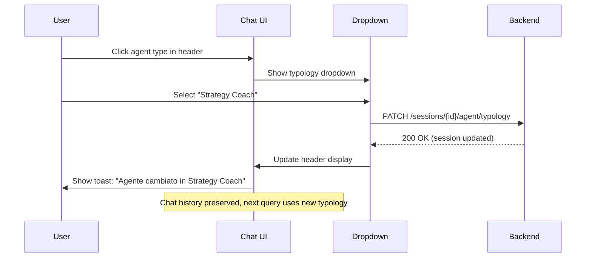
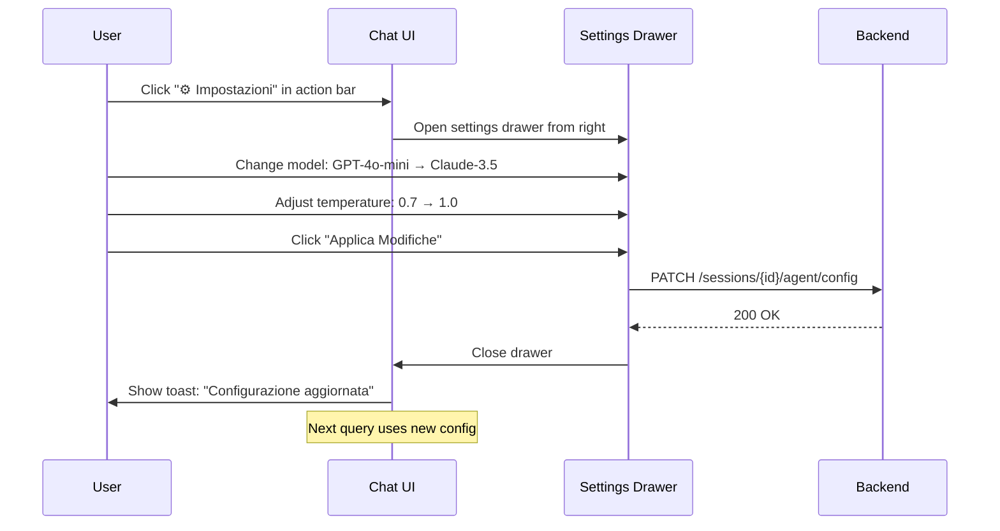
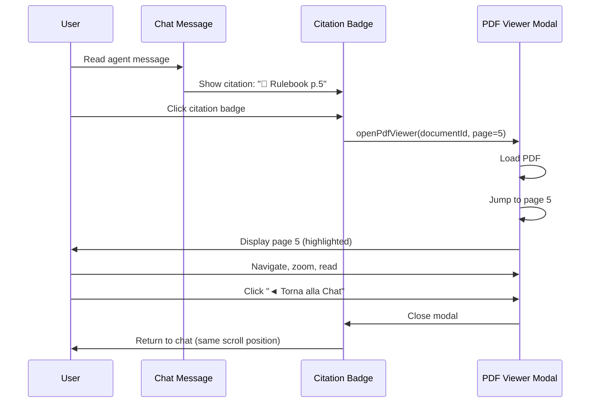

# Agent Page - Enhanced Requirements & Missing Features

**Date**: 2026-01-31
**Source**: User feedback on initial design
**Impact**: Critical features missing from v1.0 epic

---

## Missing Critical Features

### 1. Dynamic Agent Type Switching (During Active Chat)

**Requirement**: User può cambiare tipo agente SENZA chiudere la chat corrente.

**User Story**:
```
As a player chatting with "Rules Expert" agent,
I want to switch to "Strategy Coach" without losing my chat session,
So that I can get different types of help in the same conversation.
```

**Current Design Gap**: AgentConfigSheet solo per initial config, no switching dopo launch.

**Proposed Solution**:
- Add "🔄 Cambia Tipo Agente" button in chat header
- Opens slide-in panel from right with template carousel
- Selection updates agent session (keeps chat history, changes typology)
- Backend: `PATCH /game-sessions/{sessionId}/agent/typology` endpoint

**API Change Needed**:
```csharp
// New command
public record UpdateAgentTypologyCommand(
    Guid SessionId,
    Guid NewTypologyId
) : IRequest<Unit>;

// Handler preserves chat history, updates typology + prompt template
```

---

### 2. Settings Panel for Runtime Configuration Changes

**Requirement**: User può modificare model, temperature, strategy SENZA riavviare sessione.

**Parameters Modifiable**:
- ✅ AI Model (GPT-4o-mini → Claude-3.5 se upgrade)
- ✅ Temperature (0-2)
- ✅ Max tokens (512-8192)
- ✅ RAG Strategy (HybridSearch, VectorOnly, MultiModel)
- ✅ topK, minScore (advanced settings)
- ❌ Game (FIXED - agent bound to game)

**Current Design Gap**: No settings panel in chat interface.

**Proposed Solution**:
- Add "⚙️ Settings" button in action bar (chat state)
- Opens slide-in drawer from right (Sheet component)
- Reuse AgentConfigModal layout pattern
- Changes apply immediately to next query (no session restart)

**UI Layout** (Settings Drawer):
```
┌────────────────────┐
│ Chat       Settings│ ← Split view
├────────────────────┤
│ Messages   ┌──────┐│
│            │ Model││ ← Settings panel
│            │ [▼]  ││   (slide-in from right)
│            │      ││
│            │ Temp ││
│            │ [━●━]││
│            │      ││
│            │ [✓]  ││ ← Apply button
│            └──────┘│
└────────────────────┘
```

**Backend Support**: AgentConfigModal già usa questo pattern, extend per chat runtime.

---

### 3. PDF Viewer Integration

**Requirement**: User può visualizzare PDF regolamento DURANTE la chat.

**Use Cases**:
- **UC1**: User clicca citation badge → PDF apre alla pagina citata
- **UC2**: User clicca "📄 Vedi Regolamento" in header → PDF apre dalla prima pagina
- **UC3**: Desktop: Split view chat + PDF side-by-side (optional)

**Current Design Gap**: No PDF viewer integration in chat interface.

**Proposed Solutions**:

**Option A - Modal Overlay** (Raccomandato per MVP):
- Reuse `PdfViewerModal.tsx` (già implementato!)
- Citation badge onClick → `<PdfViewerModal open={true} initialPage={citation.page} />`
- Header button "📄 Regolamento" → `<PdfViewerModal open={true} />`

**Option B - Split View** (Desktop only, Post-MVP):
- Chat 60% + PDF 40% on desktop (≥1024px)
- Mobile: Full-screen toggle between chat/PDF
- More complex state management

**Recommended**: Start with Option A (reuse existing modal), add split view in v2.0.

---

### 4. Citation Links to PDF Pages

**Requirement**: Citation badges devono essere link cliccabili che aprono PDF alla pagina specifica.

**Current Citation Format** (from backend):
```json
{
  "citations": [
    {
      "source": "Chess Rulebook",
      "page": 5,
      "snippet": "Pawns move forward one square...",
      "documentId": "uuid-123"
    }
  ]
}
```

**Enhanced Citation Badge**:
```typescript
// Old: Static display
<span className="citation-badge">📄 Chess Rulebook p.5</span>

// New: Clickable link with PDF viewer trigger
<button
  onClick={() => openPdfViewer(citation.documentId, citation.page)}
  className="citation-badge hover:bg-primary/20 cursor-pointer"
>
  <FileText className="h-3 w-3" />
  {citation.source} p.{citation.page}
</button>
```

**State Management**:
```typescript
// agentStore.ts addition
interface AgentStore {
  // ... existing
  pdfViewerOpen: boolean;
  pdfViewerPage: number | null;
  pdfViewerDocumentId: string | null;

  openPdfViewer: (documentId: string, page: number) => void;
  closePdfViewer: () => void;
}
```

---

### 5. Game Binding (Cannot Change Game)

**Requirement**: Agent è BOUND al gioco selezionato, user NON può cambiare gioco senza creare nuovo agent.

**Design Clarity**:
- Game selector DISABLED durante chat (show as read-only badge)
- To change game: Must "End Session" → Create new agent
- UI should clearly indicate: "Agente attivo per [Chess]"

**Visual Pattern**:
```typescript
// In chat header
<div className="flex items-center gap-2">
  <GameIcon />
  <span className="font-semibold">Chess</span>
  <Badge variant="outline" className="cursor-not-allowed opacity-60">
    Fisso
  </Badge>
  <Tooltip>
    <TooltipTrigger><Info /></TooltipTrigger>
    <TooltipContent>
      L'agente è legato a questo gioco. Per cambiare gioco, termina la sessione.
    </TooltipContent>
  </Tooltip>
</div>
```

---

## Updated Component Requirements

### ChatHeader Component (Enhanced)

**New Elements**:
```typescript
<div className="chat-header">
  {/* Left: Game + Agent Type (with switcher) */}
  <div className="flex items-center gap-2">
    <StatusIndicator />
    <GameBadge game={currentGame} isFixed={true} />
    <span>-</span>
    <AgentTypeSwitcher currentType={typology} onSwitch={handleSwitch} />
  </div>

  {/* Right: PDF + Settings + Close */}
  <div className="flex items-center gap-2">
    <Button variant="ghost" size="sm" onClick={openPdfViewer}>
      <FileText className="h-4 w-4" />
      Regolamento
    </Button>
    <Button variant="ghost" size="sm" onClick={openSettings}>
      <Settings className="h-4 w-4" />
    </Button>
    <Button variant="ghost" size="sm" onClick={closeChat}>
      <X className="h-4 w-4" />
    </Button>
  </div>

  {/* Metadata row */}
  <div className="chat-meta">
    <ModelBadge model={currentModel} />
    <Separator />
    <TokenCounter used={tokenQuota.used} limit={tokenQuota.limit} />
  </div>
</div>
```

### AgentTypeSwitcher Component (NEW)

**Functionality**: Dropdown to switch between agent typologies without closing chat.

```typescript
export function AgentTypeSwitcher({
  currentType,
  availableTypes,
  onSwitch
}: AgentTypeSwitcherProps) {
  return (
    <DropdownMenu>
      <DropdownMenuTrigger asChild>
        <Button variant="ghost" size="sm" className="font-semibold">
          {currentType.name}
          <ChevronDown className="h-4 w-4 ml-1" />
        </Button>
      </DropdownMenuTrigger>
      <DropdownMenuContent>
        {availableTypes.map(type => (
          <DropdownMenuItem
            key={type.id}
            onClick={() => onSwitch(type.id)}
            className={currentType.id === type.id ? 'bg-muted' : ''}
          >
            <span className="mr-2">{type.icon}</span>
            {type.name}
            {currentType.id === type.id && <Check className="ml-auto h-4 w-4" />}
          </DropdownMenuItem>
        ))}
      </DropdownMenuContent>
    </DropdownMenu>
  );
}
```

### CitationBadge Component (Enhanced)

**Functionality**: Clickable link that opens PDF viewer at specific page.

```typescript
interface CitationBadgeProps {
  citation: {
    source: string;
    page: number;
    snippet: string;
    documentId: string;
  };
  onOpenPdf: (documentId: string, page: number) => void;
}

export function CitationBadge({ citation, onOpenPdf }: CitationBadgeProps) {
  return (
    <Tooltip>
      <TooltipTrigger asChild>
        <button
          onClick={() => onOpenPdf(citation.documentId, citation.page)}
          className="inline-flex items-center gap-1 px-2 py-1 rounded-md text-xs bg-orange-50 text-orange-700 border border-orange-200 hover:bg-orange-100 hover:border-orange-300 transition-all hover:-translate-y-0.5"
        >
          <FileText className="h-3 w-3" />
          {citation.source} p.{citation.page}
        </button>
      </TooltipTrigger>
      <TooltipContent className="max-w-xs">
        <p className="text-xs">{citation.snippet}</p>
        <p className="text-xs text-muted-foreground mt-1">
          Click per aprire alla pagina {citation.page}
        </p>
      </TooltipContent>
    </Tooltip>
  );
}
```

### AgentSettingsDrawer Component (NEW)

**Functionality**: Slide-in settings panel for runtime config changes.

```typescript
export function AgentSettingsDrawer({
  isOpen,
  onClose,
  currentConfig,
  onUpdate
}: AgentSettingsDrawerProps) {
  return (
    <Sheet open={isOpen} onOpenChange={onClose}>
      <SheetContent side="right" className="w-[400px]">
        <SheetHeader>
          <SheetTitle className="font-quicksand">
            ⚙️ Impostazioni Agente
          </SheetTitle>
          <SheetDescription>
            Le modifiche si applicano alla prossima domanda
          </SheetDescription>
        </SheetHeader>

        <div className="space-y-6 py-6">
          {/* Model Selector */}
          <div>
            <Label className="font-quicksand font-semibold">⚡ Modello AI</Label>
            <Select value={model} onValueChange={setModel}>
              {/* Options filtered by tier */}
            </Select>
          </div>

          {/* Temperature Slider */}
          <div>
            <Label className="font-quicksand font-semibold">
              🌡️ Temperatura: {temperature.toFixed(1)}
            </Label>
            <Slider
              min={0}
              max={2}
              step={0.1}
              value={[temperature]}
              onValueChange={([v]) => setTemperature(v)}
            />
          </div>

          {/* RAG Strategy */}
          <div>
            <Label className="font-quicksand font-semibold">🔍 Strategia Ricerca</Label>
            <RadioGroup value={strategy} onValueChange={setStrategy}>
              <RadioItem value="hybrid">Ibrida (Vector + Keyword)</RadioItem>
              <RadioItem value="vector">Solo Vector</RadioItem>
              <RadioItem value="multi">Multi-Model Consensus</RadioItem>
            </RadioGroup>
          </div>

          {/* Advanced Settings (Collapsible) */}
          <Accordion type="single" collapsible>
            <AccordionItem value="advanced">
              <AccordionTrigger>Impostazioni Avanzate</AccordionTrigger>
              <AccordionContent>
                <div className="space-y-4">
                  <div>
                    <Label>Top K Risultati</Label>
                    <Input type="number" min={3} max={20} value={topK} />
                  </div>
                  <div>
                    <Label>Min Score</Label>
                    <Slider min={0.5} max={0.95} step={0.05} value={[minScore]} />
                  </div>
                </div>
              </AccordionContent>
            </AccordionItem>
          </Accordion>
        </div>

        <SheetFooter>
          <Button variant="outline" onClick={onClose}>Annulla</Button>
          <Button onClick={() => onUpdate(config)}>
            <Check className="h-4 w-4 mr-2" />
            Applica Modifiche
          </Button>
        </SheetFooter>
      </SheetContent>
    </Sheet>
  );
}
```

---

## Updated Chat Interface Layout

### Desktop Layout (≥1024px) - Split View Option

```
┌──────────────────────────────────────────────────────┐
│ Chat Header: Chess - [Rules Expert ▼] | 445/500 tok │
│ [📄 Regolamento] [⚙️ Settings] [×]                  │
├──────────────────────────────────────────────────────┤
│                                                      │
│ ┌─────────────────────┬─────────────────────────┐  │
│ │ CHAT (60%)          │ PDF VIEWER (40%)        │  │
│ │                     │                         │  │
│ │ [Messages...]       │ [PDF Page 5]            │  │
│ │                     │                         │  │
│ │                     │ [Zoom] [Page Nav]       │  │
│ │                     │                         │  │
│ │ [Citation p.5] ──────→ (Highlights page 5)    │  │
│ │                     │                         │  │
│ └─────────────────────┴─────────────────────────┘  │
│                                                      │
│ [Input + Send]                                       │
├──────────────────────────────────────────────────────┤
│ ACTION BAR: [📄 Regolamento] [⚙️ Settings] [Minimize]│
└──────────────────────────────────────────────────────┘
```

### Mobile Layout (< 768px) - Toggle Views

```
STATE A: Chat View
┌─────────────────────────┐
│ Chess - Rules Expert ▼  │
│ [📄] [⚙️] [×]           │ ← PDF and Settings buttons
├─────────────────────────┤
│                         │
│ [Chat Messages]         │
│                         │
│ [Citation p.5] ─────────┐ ← Click opens PDF modal
│                         │
│ [Input + Send]          │
├─────────────────────────┤
│ [📄 Regolamento] [⚙️]   │ ← Action bar
└─────────────────────────┘

STATE B: PDF Viewer Modal (full-screen)
┌─────────────────────────┐
│ ◄ Torna   Chess Rulebook│
├─────────────────────────┤
│                         │
│   [PDF Page 5]          │ ← Opened from citation
│   (highlighted)         │
│                         │
│   [Zoom] [Nav]          │
│                         │
└─────────────────────────┘
```

---

## Enhanced Action Bar States

### Chat State (Updated)

**Before** (v1.0):
```typescript
<ActionBar state="chat">
  <Button>⚙️ Settings</Button>
  <Button>📤 Export</Button>
  <Button>Minimize ▼</Button>
</ActionBar>
```

**After** (v1.1 - Enhanced):
```typescript
<ActionBar state="chat">
  <Button onClick={openPdfViewer}>
    <FileText className="h-4 w-4 mr-1" />
    📄 Regolamento
  </Button>
  <Button onClick={openSettings}>
    <Settings className="h-4 w-4 mr-1" />
    ⚙️ Impostazioni
  </Button>
  <Button onClick={minimizeChat}>
    Riduci ▼
  </Button>
</ActionBar>
```

**Behavior**:
- **📄 Regolamento**: Opens PdfViewerModal at page 1 (or last viewed)
- **⚙️ Impostazioni**: Opens AgentSettingsDrawer from right
- **Riduci**: Minimizes chat (closes sheet, returns to game page)

---

## Backend API Changes Needed

### New Endpoints

**1. Update Agent Typology** (switch template during session):
```
PATCH /api/v1/game-sessions/{sessionId}/agent/typology
Body: { "typologyId": "uuid" }
Response: 200 OK, session updated
```

**2. Update Agent Config** (runtime changes):
```
PATCH /api/v1/game-sessions/{sessionId}/agent/config
Body: {
  "modelType": "gpt-4o",
  "temperature": 0.7,
  "maxTokens": 2000,
  "ragStrategy": "HybridSearch",
  "ragParams": { "topK": 8, "minScore": 0.75 }
}
Response: 200 OK, config updated (applies to next query)
```

**3. Get Game Documents** (for PDF viewer):
```
GET /api/v1/library/games/{gameId}/documents
Response: [
  {
    "documentId": "uuid",
    "fileName": "Chess_Rulebook.pdf",
    "pdfUrl": "/api/v1/documents/{id}/download",
    "pageCount": 24,
    "uploadedAt": "2026-01-15T..."
  }
]
```

### Enhanced Citation Response

**Backend should return**:
```json
{
  "citations": [
    {
      "source": "Chess Rulebook",
      "page": 5,
      "snippet": "Pawns move forward one square...",
      "documentId": "uuid-123",
      "pdfUrl": "/api/v1/documents/uuid-123/download",
      "chunkId": "chunk-uuid"
    }
  ]
}
```

**Frontend uses**:
- `documentId` + `page` → `<PdfViewerModal pdfUrl={pdfUrl} initialPage={page} />`
- `snippet` → Citation tooltip preview

---

## Updated User Flows

### Flow 1: Switch Agent Type During Chat



### Flow 2: Change Model/Settings During Chat



### Flow 3: Click Citation → Open PDF



---

## Component Dependencies Update

### New Components Needed

```typescript
// agentStore.ts - Enhanced state
interface AgentStore {
  // ... existing config/chat state

  // PDF Viewer state (NEW)
  pdfViewerOpen: boolean;
  pdfViewerDocumentId: string | null;
  pdfViewerPage: number | null;
  pdfViewerUrl: string | null;

  // Settings drawer state (NEW)
  settingsDrawerOpen: boolean;

  // Runtime config (NEW)
  runtimeConfig: {
    model: AIModel;
    temperature: number;
    maxTokens: number;
    ragStrategy: string;
    ragParams: Record<string, any>;
  };

  // Actions (NEW)
  openPdfViewer: (documentId: string, page: number, url: string) => void;
  closePdfViewer: () => void;
  openSettingsDrawer: () => void;
  closeSettingsDrawer: () => void;
  updateAgentTypology: (sessionId: string, typologyId: string) => Promise<void>;
  updateRuntimeConfig: (sessionId: string, config: RuntimeConfig) => Promise<void>;
}
```

### Enhanced Chat Components

```
apps/web/src/components/agent/chat/
├── AgentChatSheet.tsx            # UPDATED: Add PDF + Settings integration
├── ChatHeader.tsx                # NEW: Header with game, type switcher, actions
├── AgentTypeSwitcher.tsx         # NEW: Dropdown to switch template
├── ChatMessageList.tsx
├── ChatMessage.tsx               # UPDATED: Enhanced citation badges
├── CitationBadge.tsx             # UPDATED: Clickable with PDF trigger
├── ChatInput.tsx
├── AgentSettingsDrawer.tsx       # NEW: Runtime config changes
└── PdfViewerIntegration.tsx      # NEW: Wrapper for PdfViewerModal with agent context
```

---

## Updated Issue Breakdown

### New Issues Needed (Frontend)

**FRONT-013**: Agent Type Switcher Component
- Priority: P1 High
- Estimate: 1 day
- Tasks: AgentTypeSwitcher dropdown, PATCH endpoint integration, toast notifications
- Dependencies: #FRONT-006 (Chat Sheet)

**FRONT-014**: Agent Settings Drawer (Runtime Config)
- Priority: P1 High
- Estimate: 1.5 days
- Tasks: Settings drawer UI, model/temp/strategy selectors, PATCH config endpoint
- Dependencies: #FRONT-006, backend PATCH /agent/config endpoint

**FRONT-015**: PDF Viewer Integration & Citation Links
- Priority: P0 Critical
- Estimate: 1 day
- Tasks: Integrate PdfViewerModal, clickable citations, page jump, state management
- Dependencies: #FRONT-008 (Citations), existing PdfViewerModal component

**FRONT-016**: Split View Layout (Desktop, Post-MVP)
- Priority: P3 Low
- Estimate: 1 day
- Tasks: Split view chat+PDF, responsive toggle, state sync
- Dependencies: #FRONT-015

### Updated Total
- **Original**: 12 issues (12.5 days)
- **Enhanced**: 15 issues (16 days)
- **Increase**: +3 issues (+3.5 days)

---

## Backend Requirements (for Frontend to Work)

### Critical Missing Endpoints

**1. Update Typology** (Agent type switching):
```csharp
// KnowledgeBase/Application/Commands/UpdateAgentSessionTypologyCommand.cs
public record UpdateAgentSessionTypologyCommand(
    Guid SessionId,
    Guid NewTypologyId
) : IRequest<Unit>;

// Handler: Update AgentSession.TypologyId, reload prompt template
```

**2. Update Runtime Config** (Settings changes):
```csharp
// KnowledgeBase/Application/Commands/UpdateAgentRuntimeConfigCommand.cs
public record UpdateAgentRuntimeConfigCommand(
    Guid SessionId,
    string ModelType,
    double Temperature,
    int MaxTokens,
    string RagStrategy,
    Dictionary<string, object> RagParams
) : IRequest<Unit>;

// Handler: Update AgentSession config, applies to next ChatWithSessionAgentCommand
```

**3. Get Game Documents** (PDF list):
```csharp
// GameManagement/Application/Queries/GetGameDocumentsQuery.cs
public record GetGameDocumentsQuery(
    Guid GameId
) : IRequest<List<GameDocumentDto>>;

// Response: List of PDF documents associated with game
```

---

## Action Items - Immediate

### 1. Validate Existing PDF Viewer
- [ ] Test `PdfViewerModal` with sample PDF
- [ ] Verify `initialPage` prop works (jumps to page)
- [ ] Check `jumpToPage()` method availability
- [ ] Confirm mobile responsive behavior

### 2. Update Epic Document
- [ ] Add 3 new issues (FRONT-013, 014, 015)
- [ ] Update dependencies graph
- [ ] Add PDF integration section
- [ ] Add backend API requirements

### 3. Create Enhanced Mockup
- [ ] Add settings drawer to HTML mockup
- [ ] Add agent type switcher in header
- [ ] Show PDF viewer modal interaction
- [ ] Update action bar with PDF button

### 4. Coordinate with Backend
- [ ] Verify PATCH endpoints feasibility
- [ ] Check if `AgentSession.TypologyId` can be updated
- [ ] Confirm game documents API exists
- [ ] Validate citation format includes `documentId`

---

## Next Steps

**Vuoi che proceda con:**

**A)** 🎨 **Aggiorno il mockup HTML** con settings drawer + PDF viewer + type switcher

**B)** 📝 **Creo le 3 nuove GitHub issue** (FRONT-013, 014, 015) con design corretto

**C)** 🔍 **Analizzo PdfViewerModal** in dettaglio per capire integration patterns

**D)** 🤝 **Verifico backend** se gli endpoint PATCH esistono o servono nuove issue backend

**Quale preferisci per primo?** 🚀
