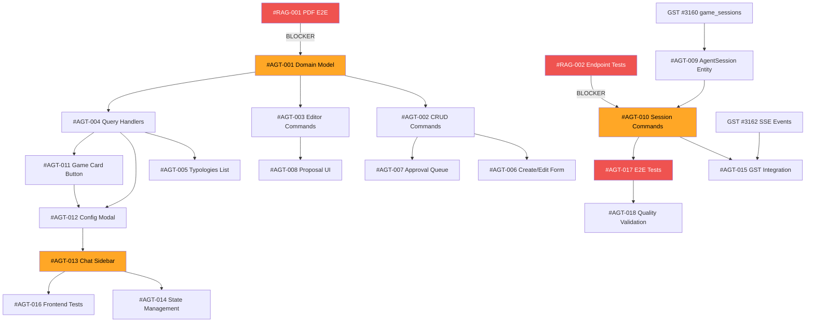

# AI Agent System - Epic & Issue Breakdown

**PRD**: `docs/prd/ai-agent-system-mvp.md`
**Created**: 2026-01-30
**Total Issues**: 18 (3 epics)
**Estimated Time**: 5 settimane (25 giorni)

---

## Epic Structure

```
EPIC 1: Agent Typology Management (Backend + Admin UI) - 8 issue
├── Sprint 1.1: Backend Domain & CQRS (4 issue) - Week 1
├── Sprint 1.2: Admin UI (3 issue) - Week 2
└── Sprint 1.3: Editor Proposals (1 issue) - Week 2

EPIC 2: Session-Based Agent Integration - 6 issue
├── Sprint 2.1: Backend Session State (2 issue) - Week 3
├── Sprint 2.2: Frontend Game Card + Chat (3 issue) - Week 4
└── Sprint 2.3: GST Integration (1 issue) - Week 5

EPIC 3: RAG Validation & Testing - 4 issue
├── Sprint 3.0: Prerequisites (2 issue) - Week 1 (BLOCKER)
└── Sprint 3.1: E2E Testing (2 issue) - Week 5
```

---

## 🔴 EPIC 0: RAG Prerequisites Validation (BLOCKER)

**Goal**: Validare che RAG pipeline funziona end-to-end PRIMA di sviluppare features
**Priority**: P0 Critical (blocca tutto)
**Time**: 2 giorni (Week 1)

### Issue #RAG-001: PDF Processing E2E Validation 🔴

**Type**: Validation Task
**Priority**: P0 - Critical Blocker
**Estimate**: 1 day
**Assignee**: Backend Dev + QA

**Description**:
Validare che almeno 1 gioco ha PDF rulebook caricato, processato e indicizzato in Qdrant.

**Tasks**:
- [ ] Identificare 1 gioco target in SharedGameCatalog (preferenza: gioco semplice per test)
- [ ] Upload PDF rulebook usando endpoint esistente
- [ ] Trigger processing pipeline: `POST /api/v1/documents/process`
- [ ] Verificare chunking: Query `text_chunks` table, expect >10 chunks
- [ ] Verificare embedding: Query `vector_documents` table, check embedding_model + dimensions
- [ ] Verificare Qdrant: `GET /qdrant/collections/meepleai_documents` expect count > 0
- [ ] Test RAG query: `POST /agents/qa` con domanda sample ("How do I setup the game?")
- [ ] Validare risposta: confidence > 0.7, citazioni presenti, no hallucination

**Acceptance Criteria**:
- ✅ PDF processed successfully (status = Completed)
- ✅ >10 chunks in PostgreSQL
- ✅ Vectors in Qdrant (cosine similarity working)
- ✅ RAG query returns relevant answer (confidence ≥ 0.7)

**Blocker Resolution**:
- If fails: Fix DocumentProcessing pipeline BEFORE continuing
- If partial: Reduce scope to minimum viable (5 chunks OK for MVP test)

**Related**:
- DocumentProcessing bounded context
- Qdrant collection: `meepleai_documents`
- Services: embedding-service, unstructured-service, smoldocling-service

---

### Issue #RAG-002: Agent Endpoints Smoke Test 🔴

**Type**: Validation Task
**Priority**: P0 - Critical Blocker
**Estimate**: 0.5 day
**Assignee**: Backend Dev

**Description**:
Validare che endpoint agent esistenti funzionano correttamente.

**Tasks**:
- [ ] Test `POST /agents` - Create sample agent (Admin)
- [ ] Test `GET /agents` - List agents
- [ ] Test `GET /agents/{id}` - Get agent by ID
- [ ] Test `POST /agents/{id}/configure` - Configure strategy
- [ ] Test `POST /agents/{id}/invoke` - Invoke agent con RAG (usa gioco da #RAG-001)
- [ ] Test `POST /agents/qa/stream` - SSE streaming funziona
- [ ] Test `GET /library/games/{gameId}/agent-config` - Get user agent config
- [ ] Test `POST /library/games/{gameId}/agent-config` - Save agent config

**Acceptance Criteria**:
- ✅ Tutti gli endpoint ritornano 2xx per happy path
- ✅ Agent invocation usa RAG e ritorna risposta valida
- ✅ SSE streaming completo senza disconnessioni
- ✅ Agent configuration persiste correttamente

**API Test Collection**:
```bash
# Create agent (Admin)
POST /api/v1/agents
{
  "name": "Chess Rules Expert",
  "type": "RulesExpert",
  "strategyName": "HybridSearch",
  "strategyParameters": {"vectorWeight": 0.7, "topK": 5}
}

# Invoke agent (User)
POST /api/v1/agents/{agent_id}/invoke
{
  "query": "How do pawns move?",
  "gameId": "{game_id_from_RAG001}"
}

# Expected: Response with confidence > 0.7, citations present
```

---

## 🟠 EPIC 1: Agent Typology Management

**Goal**: Admin/Editor possono creare, gestire e approvare tipologie agent
**Priority**: P1 High
**Time**: 2 settimane
**Dependencies**: EPIC 0 completato

### Sprint 1.1: Backend Domain & CQRS (Week 2)

#### Issue #AGT-001: AgentTypology Domain Model & Migration 🟠

**Type**: Backend - Domain Layer
**Priority**: P1 High
**Estimate**: 1 day
**Assignee**: Backend Dev 1

**Description**:
Creare entity `AgentTypology` e `PromptTemplate` nel KnowledgeBase bounded context.

**Domain Model**:
```csharp
// KnowledgeBase/Domain/Entities/AgentTypology.cs
public class AgentTypology
{
    public Guid Id { get; private set; }
    public string Name { get; private set; } // "Rules Expert"
    public string Description { get; private set; }
    public string BasePrompt { get; private set; }
    public AgentStrategy DefaultStrategy { get; private set; }
    public TypologyStatus Status { get; private set; }
    public Guid CreatedBy { get; private set; }
    public Guid? ApprovedBy { get; private set; }
    // ... audit fields
}

// KnowledgeBase/Domain/Entities/PromptTemplate.cs
public class PromptTemplate
{
    public Guid Id { get; private set; }
    public Guid TypologyId { get; private set; }
    public string Content { get; private set; }
    public int Version { get; private set; }
    public bool IsCurrent { get; private set; }
    // ... audit fields
}
```

**Tasks**:
- [ ] Create `AgentTypology.cs` entity (private setters, factory methods)
- [ ] Create `PromptTemplate.cs` entity
- [ ] Add `TypologyStatus` enum (Draft/Pending/Approved/Rejected)
- [ ] Create EF configurations: `AgentTypologyEntityConfiguration.cs`
- [ ] Add migration: `AddAgentTypologyAndPromptTemplate`
- [ ] Seed 3 default typologies (Rules, Setup, Ledger)

**Acceptance Criteria**:
- ✅ Migration applied successfully
- ✅ 3 default typologies seeded with status=Approved
- ✅ Foreign keys: typology → created_by/approved_by users
- ✅ Unique constraint on typology.name

**Related Files**:
- `BoundedContexts/KnowledgeBase/Domain/Entities/`
- `Infrastructure/EntityConfigurations/KnowledgeBase/`
- `Infrastructure/Migrations/`

---

#### Issue #AGT-002: Typology CRUD Commands 🟠

**Type**: Backend - Application Layer
**Priority**: P1 High
**Estimate**: 1.5 days
**Assignee**: Backend Dev 1
**Dependencies**: #AGT-001

**Description**:
Implementare CQRS commands per Admin gestione tipologie.

**Commands**:
1. `CreateAgentTypologyCommand` (Admin)
2. `UpdateAgentTypologyCommand` (Admin)
3. `DeleteAgentTypologyCommand` (Admin, soft delete)
4. `ApproveAgentTypologyCommand` (Admin)

**Tasks**:
- [ ] Create `CreateAgentTypologyCommand.cs` + Validator
- [ ] Create `CreateAgentTypologyCommandHandler.cs`
- [ ] Create `UpdateAgentTypologyCommand.cs` + Validator
- [ ] Create `UpdateAgentTypologyCommandHandler.cs`
- [ ] Create `DeleteAgentTypologyCommand.cs`
- [ ] Create `DeleteAgentTypologyCommandHandler.cs` (soft delete: is_deleted=true)
- [ ] Create `ApproveAgentTypologyCommand.cs`
- [ ] Create `ApproveAgentTypologyCommandHandler.cs` (status: Pending → Approved)
- [ ] Unit tests per ogni handler (>90% coverage)

**Validation Rules**:
- Name: required, 3-100 chars, unique
- BasePrompt: required, max 5000 chars
- DefaultStrategy: must be valid AgentStrategy
- ApproveTypology: only if status=Pending

**Acceptance Criteria**:
- ✅ 4 commands funzionanti con validators
- ✅ Soft delete preserva dati per audit
- ✅ Approval workflow: Draft → Pending → Approved
- ✅ Unit tests >90% coverage

---

#### Issue #AGT-003: Editor Proposal Commands 🟡

**Type**: Backend - Application Layer
**Priority**: P2 Medium
**Estimate**: 1 day
**Assignee**: Backend Dev 2 (parallel a AGT-002)
**Dependencies**: #AGT-001

**Description**:
Implementare workflow per Editor proposta tipologie.

**Commands**:
1. `ProposeAgentTypologyCommand` (Editor)
2. `TestAgentTypologyCommand` (Editor, sandbox)

**Tasks**:
- [ ] Create `ProposeAgentTypologyCommand.cs` + Validator
- [ ] Create `ProposeAgentTypologyCommandHandler.cs` (status=Draft, requires_approval=true)
- [ ] Create `TestAgentTypologyCommand.cs`
- [ ] Create `TestAgentTypologyCommandHandler.cs` (invoke agent con Draft typology)
- [ ] Add authorization: Editor can propose, only Admin can approve
- [ ] Unit tests (>90% coverage)

**Business Rules**:
- Editor proposals start with status=Draft
- Editor can test their own Draft typologies (sandbox)
- Only Editor creator can submit Draft → Pending
- Only Admin can change Pending → Approved/Rejected

**Acceptance Criteria**:
- ✅ Editor può proporre tipologie (saved as Draft)
- ✅ Editor può testare in sandbox prima di submit
- ✅ Submit cambia status: Draft → Pending
- ✅ Authorization corretta (Editor ≠ Admin capabilities)

---

#### Issue #AGT-004: Typology Query Handlers 🟠

**Type**: Backend - Application Layer
**Priority**: P1 High
**Estimate**: 0.5 day
**Assignee**: Backend Dev 1
**Dependencies**: #AGT-001

**Description**:
Implementare queries per leggere tipologie (Admin/Editor/User).

**Queries**:
1. `GetAllAgentTypologiesQuery` (Admin: all, User: approved only)
2. `GetTypologyByIdQuery`
3. `GetPendingTypologiesQuery` (Admin approval queue)
4. `GetMyProposalsQuery` (Editor own proposals)

**Tasks**:
- [ ] Create `GetAllAgentTypologiesQuery.cs`
- [ ] Create `GetAllAgentTypologiesQueryHandler.cs` (filter by user role)
- [ ] Create `GetTypologyByIdQuery.cs` + Handler
- [ ] Create `GetPendingTypologiesQuery.cs` + Handler (Admin only)
- [ ] Create `GetMyProposalsQuery.cs` + Handler (Editor only)
- [ ] Add DTOs: `AgentTypologyDto`, `TypologyProposalDto`
- [ ] Unit tests

**Authorization Logic**:
```csharp
// User: only approved typologies
if (userRole == "User")
    query = query.Where(t => t.Status == TypologyStatus.Approved);

// Editor: approved + own drafts
if (userRole == "Editor")
    query = query.Where(t => t.Status == Approved || t.CreatedBy == userId);

// Admin: all typologies
if (userRole == "Admin")
    query = query; // no filter
```

**Acceptance Criteria**:
- ✅ Role-based filtering corretto
- ✅ DTOs completi con navigation properties
- ✅ Unit tests con mock authorization

---

### Sprint 1.2: Admin UI (Week 2)

#### Issue #AGT-005: Admin Typologies List Page 🟠

**Type**: Frontend - Admin UI
**Priority**: P1 High
**Estimate**: 1 day
**Assignee**: Frontend Dev 1
**Dependencies**: #AGT-004 (query handlers)

**Description**:
Admin UI per visualizzare e gestire tutte le tipologie agent.

**Route**: `/admin/agent-typologies`

**UI Components**:
- `<TypologyListPage>` - Main container
- `<TypologyTable>` - DataTable con sorting/filtering
- `<TypologyStatusBadge>` - Visual status (Draft/Pending/Approved)
- `<CreateTypologyButton>` - Primary CTA

**Features**:
- Table columns: Name, Description, Status, Created By, Created At, Actions
- Filters: Status (All/Draft/Pending/Approved), Created By
- Sorting: Name, Created At, Status
- Actions: Edit, Delete (soft), Approve (if Pending)
- Search bar (filter by name/description)

**API Integration**:
```typescript
// app/admin/agent-typologies/page.tsx
const { data: typologies } = useQuery({
  queryKey: ['admin', 'typologies'],
  queryFn: () => fetch('/api/v1/admin/agent-typologies').then(r => r.json())
});
```

**Acceptance Criteria**:
- ✅ Table displays all typologies with correct status badges
- ✅ Filters and sorting work correctly
- ✅ "Create New" button navigates to form
- ✅ Actions menu with Edit/Delete/Approve
- ✅ Loading and error states

---

#### Issue #AGT-006: Create/Edit Typology Form 🟠

**Type**: Frontend - Admin UI
**Priority**: P1 High
**Estimate**: 1.5 days
**Assignee**: Frontend Dev 1
**Dependencies**: #AGT-002 (CRUD commands)

**Description**:
Form per creare o modificare tipologie agent con prompt template editor.

**Routes**:
- `/admin/agent-typologies/create` - New typology
- `/admin/agent-typologies/{id}/edit` - Edit existing

**UI Components**:
- `<TypologyForm>` - Main form container
- `<PromptTemplateEditor>` - Rich text editor con variables
- `<StrategySelector>` - Dropdown per default strategy
- `<PromptPreview>` - Live preview con sample data

**Form Fields**:
- Name (text, required, 3-100 chars)
- Description (textarea, optional, max 500 chars)
- Base Prompt (rich text, required, max 5000 chars, variables support)
- Default Strategy (dropdown: HybridSearch/VectorOnly/MultiModel/etc.)
- Strategy Parameters (JSON editor, optional)
- Is Active (toggle, default true)

**Prompt Variables**:
- `{{gameTitle}}` - Nome del gioco
- `{{userQuestion}}` - Domanda dell'utente
- `{{gameState}}` - Stato partita (JSON, solo per session-based)
- `{{playerName}}` - Nome giocatore

**API Integration**:
```typescript
// Create
POST /api/v1/admin/agent-typologies
{
  name: "Rules Expert",
  description: "Explains game rules...",
  basePrompt: "You are a Rules Expert for {{gameTitle}}...",
  defaultStrategy: "HybridSearch",
  strategyParameters: {vectorWeight: 0.7, topK: 5}
}

// Update
PUT /api/v1/admin/agent-typologies/{id}
{...}
```

**Acceptance Criteria**:
- ✅ Form validation con error messages
- ✅ Prompt preview updates in real-time
- ✅ Variables autocomplete in prompt editor
- ✅ Strategy parameters editor (JSON)
- ✅ Save and redirect to list
- ✅ Cancel button con confirmation

---

#### Issue #AGT-007: Typology Approval Queue 🟡

**Type**: Frontend - Admin UI
**Priority**: P2 Medium
**Estimate**: 1 day
**Assignee**: Frontend Dev 1
**Dependencies**: #AGT-002 (ApproveTypologyCommand)

**Description**:
Admin UI per approvare o rifiutare tipologie proposte da Editor.

**Route**: `/admin/agent-typologies/pending`

**UI Components**:
- `<ApprovalQueuePage>` - Main container
- `<PendingTypologyCard>` - Card per ogni proposal
- `<ApprovalDialog>` - Confirmation con note field
- `<RejectionDialog>` - Rejection reason required

**Features**:
- List di tipologie con status=Pending
- Card displays: Name, Description, Prompt preview, Proposed By, Created At
- Actions: Approve (green), Reject (red), View Full Details
- Bulk actions: Approve all, Reject all (confirmation dialog)

**API Integration**:
```typescript
// Get pending
GET /api/v1/admin/agent-typologies?status=Pending

// Approve
POST /api/v1/admin/agent-typologies/{id}/approve
{
  approvalNote: "Looks good, approved for production"
}

// Reject
PUT /api/v1/admin/agent-typologies/{id}
{
  status: "Rejected",
  rejectionReason: "Prompt too generic, needs refinement"
}
```

**Acceptance Criteria**:
- ✅ Queue mostra solo status=Pending
- ✅ Approve cambia status: Pending → Approved
- ✅ Reject cambia status: Pending → Rejected (con reason)
- ✅ Real-time updates (optimistic UI)
- ✅ Empty state quando no pending proposals

---

### Sprint 1.3: Editor Proposals UI (Week 2)

#### Issue #AGT-008: Editor Proposal Form & Test Sandbox 🟡

**Type**: Frontend - Editor UI
**Priority**: P2 Medium
**Estimate**: 1.5 days
**Assignee**: Frontend Dev 2 (parallel a AGT-006/007)
**Dependencies**: #AGT-003 (ProposeTypologyCommand)

**Description**:
Editor UI per proporre nuove tipologie e testarle in sandbox.

**Routes**:
- `/editor/agent-proposals` - List my proposals
- `/editor/agent-proposals/create` - Propose new
- `/editor/agent-proposals/{id}/test` - Test sandbox

**UI Components**:
- `<ProposalListPage>` - My proposals con status tracking
- `<ProposalForm>` - Simplified version of admin form
- `<TestSandbox>` - Chat interface per test queries
- `<SubmitForApprovalButton>` - Submit Draft → Pending

**Features**:
- List proposals con status badges (Draft/Pending/Approved/Rejected)
- Create proposal (saved as Draft, requires_approval=true)
- Test sandbox: Chat interface con sample queries
- Submit for approval (Draft → Pending)
- Edit Draft proposals (before submit)
- View rejection reason (if status=Rejected)

**Test Sandbox Flow**:
1. Editor creates Draft typology
2. Opens test sandbox
3. Asks sample questions
4. Agent responds using Draft prompt template
5. Editor refines prompt based on responses
6. Submits for Admin approval when satisfied

**Acceptance Criteria**:
- ✅ Editor può creare Draft proposals
- ✅ Test sandbox funzionante (uses Draft typology)
- ✅ Submit for approval (Draft → Pending)
- ✅ View status and rejection reasons
- ✅ Cannot edit after Pending/Approved

---

## 🟠 EPIC 2: Session-Based Agent Integration

**Goal**: Agent legato a game session con state persistence e chat UI
**Priority**: P1 High
**Time**: 3 settimane
**Dependencies**: EPIC 1 + GST #3167 Sprint 1.1 (backend)

### Sprint 2.1: Backend Session State (Week 3)

#### Issue #AGT-009: AgentSession Entity & Migration 🟠

**Type**: Backend - Domain Layer
**Priority**: P1 High
**Estimate**: 1 day
**Assignee**: Backend Dev 1
**Dependencies**: GST #3160 (game_sessions table)

**Description**:
Creare `AgentSession` entity per legare agent a game session con state persistence.

**Domain Model**:
```csharp
// KnowledgeBase/Domain/Entities/AgentSession.cs
public class AgentSession
{
    public Guid Id { get; private set; }
    public Guid AgentId { get; private set; }
    public Guid GameSessionId { get; private set; } // FK to GST
    public Guid UserId { get; private set; }
    public Guid GameId { get; private set; }
    public Guid TypologyId { get; private set; }
    public string CurrentGameStateJson { get; private set; } // Serialized state
    public DateTime StartedAt { get; private set; }
    public DateTime? EndedAt { get; private set; }
    public bool IsActive { get; private set; }

    // Navigation
    public Agent Agent { get; private set; }
    public AgentTypology Typology { get; private set; }
    public IReadOnlyList<ChatLog> ConversationHistory { get; private set; }
}
```

**Game State JSON Schema**:
```json
{
  "currentTurn": 3,
  "activePlayer": "user_guid",
  "playerScores": {
    "user1_guid": 45,
    "user2_guid": 32
  },
  "gamePhase": "midgame",
  "lastAction": "placed worker on farm",
  "timestamp": "2026-01-30T14:30:00Z"
}
```

**Tasks**:
- [ ] Create `AgentSession.cs` entity
- [ ] Create `GameState` value object (parse/validate JSON)
- [ ] Add EF configuration: `AgentSessionEntityConfiguration.cs`
- [ ] Add migration: `AddAgentSession`
- [ ] Add FK constraint: game_session_id → game_sessions.id (GST)
- [ ] Add unique constraint: (game_session_id, user_id)

**Acceptance Criteria**:
- ✅ Migration applied
- ✅ FK to GST game_sessions table works
- ✅ Unique constraint prevents duplicate agent per user+session
- ✅ GameState JSON validated on save

---

#### Issue #AGT-010: Session Agent Commands 🟠

**Type**: Backend - Application Layer
**Priority**: P1 High
**Estimate**: 2 days
**Assignee**: Backend Dev 1
**Dependencies**: #AGT-009

**Description**:
Implementare CQRS commands per session-based agent lifecycle.

**Commands**:
1. `LaunchSessionAgentCommand` - Create AgentSession
2. `ChatWithSessionAgentCommand` - RAG query con game state context
3. `UpdateAgentSessionStateCommand` - Update current_game_state
4. `EndSessionAgentCommand` - Deactivate agent session

**Tasks**:
- [ ] `LaunchSessionAgentCommand.cs` + Handler
  - Create AgentSession linked to game_session_id
  - Initialize conversation history (ChatLog)
  - Load typology and config
- [ ] `ChatWithSessionAgentCommand.cs` + Handler (SSE streaming)
  - Retrieve AgentSession + game state
  - Inject game state into prompt variables
  - Call InvokeAgentCommand with enhanced context
  - Stream response via SSE
  - Save to ChatLog with sequence_number
- [ ] `UpdateAgentSessionStateCommand.cs` + Handler
  - Update current_game_state JSON
  - Triggered by GST events (score update, turn change)
- [ ] `EndSessionAgentCommand.cs` + Handler
  - Set is_active=false, ended_at=now
  - Preserve conversation history (no delete)

**Enhanced Prompt with State**:
```
You are a {{typologyName}} for {{gameTitle}}.

Current game situation:
- Turn: {{gameState.currentTurn}}
- Active player: {{gameState.activePlayer}}
- Scores: {{gameState.playerScores}}
- Phase: {{gameState.gamePhase}}
- Last action: {{gameState.lastAction}}

User question: {{userQuestion}}

Answer based on official rules and current game context.
```

**Acceptance Criteria**:
- ✅ LaunchSessionAgent creates AgentSession + ChatLog
- ✅ ChatWithSessionAgent injects game state into prompt
- ✅ SSE streaming funzionante (reuse existing pattern)
- ✅ UpdateAgentSessionState validates JSON schema
- ✅ EndSessionAgent preserves history (no cascade delete)
- ✅ Unit tests >90%, integration tests con Testcontainers

---

### Sprint 2.2: Frontend Game Card + Chat (Week 4)

#### Issue #AGT-011: Game Card "Ask Agent" Button 🟠

**Type**: Frontend - Library UX
**Priority**: P1 High
**Estimate**: 0.5 day
**Assignee**: Frontend Dev 1
**Dependencies**: #2867 (Game Cards component)

**Description**:
Aggiungere "Ask Agent" button a `<UserGameCard>` component.

**Component**: `apps/web/src/components/library/UserGameCard.tsx`

**Changes**:
```tsx
// Add to UserGameCard.tsx
<Button
  variant="outline"
  size="sm"
  onClick={() => onAskAgent(game.id)}
  disabled={!game.hasPdfDocuments}
  className="w-full"
>
  <Bot className="h-4 w-4 mr-2" />
  Ask Agent
</Button>

{!game.hasPdfDocuments && (
  <Tooltip>
    <TooltipTrigger asChild>
      <InfoIcon className="h-3 w-3 text-muted-foreground" />
    </TooltipTrigger>
    <TooltipContent>
      No rulebook available for this game
    </TooltipContent>
  </Tooltip>
)}
```

**Tasks**:
- [ ] Add "Ask Agent" button to UserGameCard
- [ ] Add disabled state when no PDF linked
- [ ] Add tooltip explaining why disabled
- [ ] Add click handler: opens AgentConfigModal
- [ ] Add visual indicator if agent already configured (gear icon)

**Acceptance Criteria**:
- ✅ Button visible on all game cards
- ✅ Disabled correctly when game.hasPdfDocuments=false
- ✅ Click opens modal (AGT-012)
- ✅ Tooltip explains disabled state

---

#### Issue #AGT-012: Agent Configuration Modal 🟠

**Type**: Frontend - Library UX
**Priority**: P1 High
**Estimate**: 1 day
**Assignee**: Frontend Dev 1
**Dependencies**: #AGT-004 (typologies query), #AGT-011 (button)

**Description**:
Modal per selezionare tipologia agent e modello AI prima di lanciare chat.

**Component**: `apps/web/src/components/library/AgentConfigModal.tsx`

**UI Layout**:
```
┌─────────────────────────────────────┐
│ Configure AI Agent                  │
│ ─────────────────────────────────── │
│                                     │
│ Agent Type:                         │
│ [🎲 Rules Expert        ▼]          │
│   Explains rules, resolves doubts   │
│                                     │
│ AI Model:                           │
│ [GPT-4o-mini (Free)     ▼]          │
│   Est. cost: $0.001/query           │
│   Your quota: 450/500 tokens        │
│                                     │
│ ⚠️ Approaching token limit          │
│    Consider upgrading to Premium    │
│                                     │
│         [Cancel]  [Launch Agent]    │
└─────────────────────────────────────┘
```

**Features**:
- Typology dropdown (populated from `GET /admin/agent-typologies`)
- Model dropdown (filtered by user tier)
  - Free: GPT-4o-mini, Llama-3.3-70b
  - Premium: Claude-3.5-Haiku, GPT-4
- Cost estimation per query (from model pricing)
- Quota display (current usage / limit)
- Warning if >90% quota used
- Remember last selection (localStorage)

**API Integration**:
```typescript
// Get typologies
const { data: typologies } = useQuery({
  queryKey: ['typologies'],
  queryFn: () => fetch('/api/v1/admin/agent-typologies?status=Approved').then(r => r.json())
});

// Get user quota
const { data: quota } = useQuery({
  queryKey: ['user', 'quota'],
  queryFn: () => fetch('/api/v1/users/me/token-quota').then(r => r.json())
});

// Save config
const mutation = useMutation({
  mutationFn: (config) =>
    fetch(`/api/v1/library/games/${gameId}/agent-config`, {
      method: 'POST',
      body: JSON.stringify(config)
    })
});
```

**Acceptance Criteria**:
- ✅ Typology dropdown populated con approved typologies
- ✅ Model dropdown filtered by user tier
- ✅ Cost estimation shown per selected model
- ✅ Quota display accurate (updates real-time)
- ✅ Warning when >90% quota
- ✅ Launch button saves config and opens chat
- ✅ Config persists (next time skips modal)

---

#### Issue #AGT-013: Agent Chat Sidebar Component 🔴

**Type**: Frontend - Library UX
**Priority**: P0 Critical (core UX)
**Estimate**: 2 days
**Assignee**: Frontend Dev 2 (parallel a AGT-012)
**Dependencies**: #AGT-010 (ChatWithSessionAgent SSE)

**Description**:
Chat sidebar component con SSE streaming per interazione real-time con agent.

**Component**: `apps/web/src/components/agent/AgentChatSidebar.tsx`

**UI Layout (Desktop)**:
```
┌─────────────────────────────────┐
│ 🤖 Rules Expert     [−][×]      │
│ ─────────────────────────────── │
│                                 │
│ ┌─ USER ───────────────┐        │
│ │ How do I setup the  │        │
│ │ game?               │        │
│ └─────────────────────┘        │
│                                 │
│ ┌─ AGENT ──────────────────┐   │
│ │ To setup the game:       │   │
│ │ 1. Place board...        │   │
│ │ 2. Shuffle cards...      │   │
│ │                          │   │
│ │ 📄 Source: Rulebook p.3  │   │
│ └──────────────────────────┘   │
│                                 │
│ ┌─ AGENT (streaming) ──────┐   │
│ │ For your first turn...   │   │
│ │ ▊                        │   │
│ └──────────────────────────┘   │
│                                 │
│ [                          ] 📎│
│ [Type your question...]    ⬆️ │
└─────────────────────────────────┘
```

**UI Layout (Mobile - Bottom Sheet)**:
```
┌───────────────────┐
│ [Swipe down]      │
│ ───────────────── │
│ 🤖 Rules Expert   │
│                   │
│ [Messages...]     │
│                   │
│ [Input + Send]    │
└───────────────────┘
```

**Features**:
- SSE streaming con progressive text display
- Auto-scroll to latest message
- Loading indicator (typing animation)
- Message timestamps
- Citations as clickable badges
- Copy message to clipboard
- Export conversation (JSON/TXT)
- Minimize/Maximize sidebar
- Mobile: Bottom sheet pattern

**SSE Integration**:
```typescript
// useAgentChat.ts hook
const { messages, sendMessage, isStreaming } = useAgentChat({
  gameSessionId,
  onMessage: (chunk) => appendToLastMessage(chunk),
  onComplete: (fullMessage) => saveToHistory(fullMessage),
  onError: (error) => showErrorToast(error)
});

// SSE EventSource
const eventSource = new EventSource(
  `/api/v1/game-sessions/${sessionId}/agent/chat?query=${encodeURIComponent(query)}`
);

eventSource.onmessage = (event) => {
  const data = JSON.parse(event.data);
  if (data.type === 'chunk') {
    appendChunk(data.content);
  } else if (data.type === 'complete') {
    finishStreaming(data.metadata);
  }
};
```

**Acceptance Criteria**:
- ✅ SSE streaming progressivo (chunk by chunk)
- ✅ Auto-scroll durante streaming
- ✅ Reconnection logic se SSE drops
- ✅ Citations clickable (scroll to PDF page - future)
- ✅ Copy/export conversation
- ✅ Mobile responsive (bottom sheet)
- ✅ Minimize/maximize sidebar
- ✅ Loading states (typing indicator)

---

#### Issue #AGT-014: Agent Config Persistence & State 🟡

**Type**: Frontend - State Management
**Priority**: P2 Medium
**Estimate**: 0.5 day
**Assignee**: Frontend Dev 2
**Dependencies**: #AGT-012 (modal), #AGT-013 (chat)

**Description**:
Gestire persistenza configurazione agent e stato chat in Zustand store.

**Store**: `apps/web/src/stores/agentStore.ts`

**State Schema**:
```typescript
interface AgentStore {
  // Config per game
  gameConfigs: Record<string, AgentConfig>; // gameId → config

  // Active sessions
  activeSessions: Record<string, AgentSessionState>; // sessionId → state

  // Chat history
  conversations: Record<string, ChatMessage[]>; // sessionId → messages

  // Actions
  loadConfig: (gameId: string) => Promise<AgentConfig | null>;
  saveConfig: (gameId: string, config: AgentConfig) => Promise<void>;
  launchAgent: (sessionId: string, config: AgentConfig) => Promise<void>;
  sendMessage: (sessionId: string, message: string) => Promise<void>;
  endSession: (sessionId: string) => Promise<void>;
}
```

**Persistence Strategy**:
- Config: Backend persistence via `/library/games/{id}/agent-config`
- Active sessions: Zustand store (ephemeral)
- Conversations: Backend ChatLog (permanent)
- Local cache: localStorage for last 5 conversations (quick access)

**Acceptance Criteria**:
- ✅ Config loaded from backend on mount
- ✅ Config saved on modal submit
- ✅ Active sessions tracked in store
- ✅ Conversations synced with backend
- ✅ localStorage cache for offline access

---

#### Issue #AGT-015: GST Integration - Agent State Sync 🟡

**Type**: Backend - Integration
**Priority**: P2 Medium
**Estimate**: 1 day
**Assignee**: Backend Dev 1
**Dependencies**: #AGT-009, GST #3162 (SSE events)

**Description**:
Sincronizzare stato agent con eventi GST (score updates, turn changes).

**Integration Pattern**:
```csharp
// GameSessionToolkit/Application/EventHandlers/GameStateChangedEventHandler.cs
public class GameStateChangedEventHandler : INotificationHandler<GameStateChangedEvent>
{
    private readonly IMediator _mediator;

    public async Task Handle(GameStateChangedEvent evt, CancellationToken ct)
    {
        // Find active agent sessions for this game session
        var sessions = await GetActiveAgentSessions(evt.GameSessionId);

        foreach (var session in sessions)
        {
            // Update agent session state
            await _mediator.Send(new UpdateAgentSessionStateCommand(
                AgentSessionId: session.Id,
                GameState: new GameState(
                    CurrentTurn: evt.CurrentTurn,
                    PlayerScores: evt.Scores,
                    GamePhase: evt.Phase,
                    LastAction: evt.LastAction
                )
            ), ct);
        }
    }
}
```

**GST Events to Listen**:
- `ScoreUpdatedEvent` → Update playerScores in AgentSession
- `TurnAdvancedEvent` → Update currentTurn
- `GamePhaseChangedEvent` → Update gamePhase
- `SessionEndedEvent` → EndSessionAgent (cascade)

**Tasks**:
- [ ] Subscribe to GST domain events (MediatR INotificationHandler)
- [ ] Create `GameStateChangedEventHandler`
- [ ] Implement UpdateAgentSessionStateCommand (if not in AGT-010)
- [ ] Test event flow: GST event → Agent state updated
- [ ] Integration test con Testcontainers (GST + Agent)

**Acceptance Criteria**:
- ✅ Agent state updates when GST fires events
- ✅ State sync latency <500ms
- ✅ Agent session ends when game session ends
- ✅ Integration test validates event flow

---

### Sprint 2.3: Testing (Week 5)

#### Issue #AGT-016: Frontend Agent Components Tests 🧪

**Type**: Frontend - Testing
**Priority**: P2 Medium
**Estimate**: 1 day
**Assignee**: Frontend Dev 2

**Description**:
Unit tests per componenti agent UI (modal, chat, button).

**Test Files**:
- `AgentConfigModal.test.tsx`
- `AgentChatSidebar.test.tsx`
- `UserGameCard.test.tsx` (extend existing)
- `agentStore.test.ts`

**Test Coverage**:
- AgentConfigModal: dropdown selection, validation, save config
- AgentChatSidebar: SSE streaming, message display, send message
- UserGameCard: button enabled/disabled logic
- agentStore: config CRUD, session management

**Tools**:
- Vitest + React Testing Library
- MSW (Mock Service Worker) per API mocking
- vitest-mock-extended per EventSource mock

**Acceptance Criteria**:
- ✅ Component tests >85% coverage
- ✅ SSE EventSource mocked correttamente
- ✅ User interactions tested (click, type, send)
- ✅ API calls mocked con MSW

---

## 🧪 EPIC 3: E2E Testing & Quality

**Goal**: Validare flusso completo agent + RAG + chat
**Priority**: P1 High
**Time**: 1 settimana
**Dependencies**: EPIC 1 + EPIC 2

### Issue #AGT-017: Agent E2E Test Flow 🔴

**Type**: E2E Testing
**Priority**: P0 Critical
**Estimate**: 2 days
**Assignee**: QA Engineer
**Dependencies**: #AGT-013 (chat UI), #AGT-010 (backend commands)

**Description**:
E2E test completo: User launch agent → configure → chat → receive answer.

**Test File**: `apps/web/e2e/agent/agent-rag-flow.spec.ts`

**Test Scenarios**:

**E2E-AGT-001**: First-Time Agent Launch (No Config)
```typescript
test('User launches agent for first time, configures, and asks question', async ({ page }) => {
  // 1. Login as User
  await loginAsUser(page);

  // 2. Navigate to Library
  await page.goto('/library');

  // 3. Find game card with PDF
  const gameCard = page.locator('[data-testid="game-card"]').filter({ hasText: 'Chess' });

  // 4. Click "Ask Agent" button
  await gameCard.locator('[data-testid="ask-agent-button"]').click();

  // 5. Verify modal opens
  await expect(page.locator('[data-testid="agent-config-modal"]')).toBeVisible();

  // 6. Select typology
  await page.locator('[data-testid="typology-select"]').selectOption('Rules Expert');

  // 7. Select model
  await page.locator('[data-testid="model-select"]').selectOption('GPT-4o-mini');

  // 8. Launch agent
  await page.locator('[data-testid="launch-agent-button"]').click();

  // 9. Verify chat sidebar opens
  await expect(page.locator('[data-testid="agent-chat-sidebar"]')).toBeVisible();

  // 10. Type question
  await page.locator('[data-testid="chat-input"]').fill('How do pawns move in chess?');

  // 11. Send message
  await page.locator('[data-testid="send-button"]').click();

  // 12. Wait for SSE streaming response
  await expect(page.locator('[data-testid="agent-message"]').last()).toContainText('Pawns move', { timeout: 10000 });

  // 13. Verify citation present
  await expect(page.locator('[data-testid="citation-badge"]').first()).toBeVisible();

  // 14. Verify confidence score
  const confidence = await page.locator('[data-testid="confidence-score"]').textContent();
  expect(parseFloat(confidence!)).toBeGreaterThan(0.7);
});
```

**E2E-AGT-002**: Returning User (Config Exists)
```typescript
test('User with existing config launches agent directly', async ({ page }) => {
  // Setup: Create agent config for user+game
  await setupAgentConfig(page, { gameId: 'chess-id', typology: 'Rules Expert' });

  // Test
  await page.goto('/library');
  await page.locator('[data-testid="ask-agent-button"]').first().click();

  // Should skip modal and open chat directly
  await expect(page.locator('[data-testid="agent-config-modal"]')).not.toBeVisible();
  await expect(page.locator('[data-testid="agent-chat-sidebar"]')).toBeVisible();
});
```

**E2E-AGT-003**: Token Quota Enforcement
```typescript
test('User exceeding quota falls back to free model', async ({ page }) => {
  // Setup: Set user quota to 95% used
  await setUserQuota(page, { used: 475, limit: 500 });

  // Launch agent
  await launchAgent(page, { gameId: 'chess-id' });

  // Verify warning shown
  await expect(page.locator('[data-testid="quota-warning"]')).toContainText('Approaching limit');

  // Send message (should auto-fallback to Llama-3.3-70b)
  await sendMessage(page, 'Test query');

  // Verify response from free model
  const response = await waitForAgentResponse(page);
  expect(response.model).toBe('llama-3.3-70b');
});
```

**E2E-AGT-004**: Admin Approval Workflow
```typescript
test('Editor proposes typology, Admin approves, User uses it', async ({ page }) => {
  // 1. Editor proposes
  await loginAsEditor(page);
  await page.goto('/editor/agent-proposals/create');
  await fillProposalForm(page, { name: 'Strategy Coach', prompt: '...' });
  await page.locator('[data-testid="submit-proposal-button"]').click();

  // 2. Admin approves
  await loginAsAdmin(page);
  await page.goto('/admin/agent-typologies/pending');
  await page.locator('[data-testid="approve-button"]').first().click();

  // 3. User sees new typology
  await loginAsUser(page);
  await launchAgent(page, { gameId: 'chess-id' });
  await expect(page.locator('[data-testid="typology-select"]')).toContainText('Strategy Coach');
});
```

**Acceptance Criteria**:
- ✅ All 4 E2E scenarios pass
- ✅ SSE streaming stable for 5-minute chat session
- ✅ Agent responses have confidence >0.7
- ✅ No console errors during flow
- ✅ Mobile tests pass (bottom sheet UI)

---

### Issue #AGT-018: RAG Quality Validation 🧪

**Type**: Quality Assurance
**Priority**: P1 High
**Estimate**: 1 day
**Assignee**: QA Engineer
**Dependencies**: #AGT-017 (E2E tests), #RAG-001 (PDF indexed)

**Description**:
Validare qualità risposte RAG su 20 sample questions.

**Test Dataset**: `tests/fixtures/agent-validation-questions.json`
```json
[
  {
    "gameId": "chess-uuid",
    "question": "How do pawns move?",
    "expectedKeywords": ["forward", "one square", "capture diagonally"],
    "expectedCitations": ["rulebook"],
    "minConfidence": 0.8
  },
  {
    "gameId": "chess-uuid",
    "question": "Can I castle if my king moved earlier?",
    "expectedKeywords": ["no", "king must not have moved"],
    "expectedCitations": ["rulebook p.7"],
    "minConfidence": 0.9
  }
  // ... 18 more questions
]
```

**Validation Metrics**:
- **Accuracy**: Answer contains expected keywords (target >90%)
- **Confidence**: Score ≥ min_confidence (target >90% pass rate)
- **Citations**: Valid PDF references present (target >95%)
- **Hallucination**: No forbidden keywords (target 0%)
- **Latency**: Response time <5s (target >95% within SLA)

**Tasks**:
- [ ] Create 20 sample questions (10 easy, 5 medium, 5 hard)
- [ ] Automated test script: iterate questions, call API, validate responses
- [ ] Measure metrics: accuracy, confidence, citation rate, latency
- [ ] Generate quality report (Markdown)
- [ ] Fix prompt templates if accuracy <90%

**Quality Report Template**:
```markdown
## RAG Quality Report - 2026-01-30

### Summary
- Total questions: 20
- Accuracy: 18/20 (90%) ✅
- Avg confidence: 0.82 ✅
- Citation rate: 19/20 (95%) ✅
- Hallucination: 0/20 (0%) ✅
- Avg latency: 3.2s ✅

### Failed Questions (2)
1. Q15: "What happens if..." - Confidence: 0.62 (below threshold)
2. Q18: "Can I..." - Missing citation (hallucinated answer)

### Recommendations
- Refine prompt template for edge cases (Q15)
- Increase keyword search weight for factual questions (Q18)
```

**Acceptance Criteria**:
- ✅ 20 questions tested automatically
- ✅ Accuracy ≥90% (18/20 correct)
- ✅ Confidence ≥0.7 for 90% of responses
- ✅ Citation rate ≥95%
- ✅ Hallucination rate <3%
- ✅ Quality report generated

---

## Implementation Sequence (5 Weeks)

### Week 1: Validation 🔴
```
Day 1-2: #RAG-001 + #RAG-002 (PDF processing + endpoint tests)
BLOCKER: Must pass before continuing
```

### Week 2: Backend + Admin UI (Parallel)
```
Backend Track:
- Day 3-4: #AGT-001 (Domain model + migration)
- Day 4-5: #AGT-002 (CRUD commands)
- Day 5: #AGT-004 (Query handlers)

Frontend Track:
- Day 3-4: #AGT-005 (Typologies list)
- Day 5-6: #AGT-006 (Create/Edit form)
- Day 6-7: #AGT-007 (Approval queue)

Editor Track (Parallel):
- Day 5-6: #AGT-003 (Proposal commands)
- Day 6-7: #AGT-008 (Proposal UI + sandbox)
```

### Week 3: Session Backend
```
Day 8-9: #AGT-009 (AgentSession entity)
Day 9-10: #AGT-010 (Session commands + SSE)
Day 10: #AGT-015 (GST integration)
```

### Week 4: Frontend Chat UI
```
Day 11: #AGT-011 (Game card button)
Day 11-12: #AGT-012 (Config modal)
Day 12-14: #AGT-013 (Chat sidebar SSE)
Day 14: #AGT-014 (State management)
```

### Week 5: Testing & Quality
```
Day 15-16: #AGT-016 (Frontend tests)
Day 17-18: #AGT-017 (E2E tests)
Day 19: #AGT-018 (Quality validation)
```

---

## Dependencies Graph



---

## Parallelization Strategy

### Week 2 - 3 Parallel Tracks

**Track A (Backend Dev 1)**:
- #AGT-001 → #AGT-002 → #AGT-004

**Track B (Backend Dev 2)**:
- #AGT-003 (starts after AGT-001)

**Track C (Frontend Dev 1)**:
- #AGT-005 → #AGT-006 → #AGT-007

**Track D (Frontend Dev 2)**:
- #AGT-008 (starts after AGT-003/004)

### Week 4 - 2 Parallel Tracks

**Track A (Backend Dev 1)**:
- #AGT-009 → #AGT-010 → #AGT-015

**Track B (Frontend Dev 1 + 2)**:
- #AGT-011 → #AGT-012 → #AGT-013 → #AGT-014

---

## GitHub Issues Template

Ogni issue seguirà questo template:

```markdown
## Description
[Detailed description from breakdown above]

## Tasks
- [ ] Task 1
- [ ] Task 2
- [ ] ...

## Acceptance Criteria
- [ ] AC 1
- [ ] AC 2
- [ ] ...

## Technical Notes
[Architecture decisions, patterns to follow, related files]

## Dependencies
- Blocked by: #issue-number
- Blocks: #issue-number
- Related: #issue-number

## Definition of Done
- [ ] Code implemented and reviewed
- [ ] Unit tests >90% coverage (backend) or >85% (frontend)
- [ ] Integration tests passing
- [ ] Documentation updated
- [ ] PR merged to main-dev
- [ ] Issue closed with reference commit

## Estimate
- Complexity: [Small/Medium/Large]
- Time: [0.5d/1d/2d]
- Assignee: [Role]
```

---

## Risk Mitigation Plan

### Critical Path Risks

**R1: #RAG-001 Fails (PDF Processing)**
- Contingency: Use sample PDF documents for testing
- Alternative: Mock Qdrant responses for UI development
- Recovery: 2 days to debug DocumentProcessing pipeline

**R2: SSE Streaming Instability**
- Contingency: Fallback to polling (request/response)
- Alternative: WebSocket instead of SSE
- Recovery: 1 day to implement fallback

**R3: GST #3167 Delays**
- Impact: #AGT-015 blocked (GST integration)
- Contingency: Ship agent WITHOUT session state (stateless)
- Recovery: Add session state in v2.0

### Quality Risks

**R4: RAG Accuracy <90%**
- Mitigation: A/B test different prompt templates
- Alternative: Multi-model consensus (GPT-4 + Claude)
- Recovery: 2 days prompt engineering

**R5: Performance Issues (>5s latency)**
- Mitigation: Optimize Qdrant queries (reduce topK, increase minScore)
- Alternative: Add response caching (HybridCache TTL 1h)
- Recovery: 1 day performance tuning

---

## Success Criteria Validation

### MVP Launch Checklist

**Functionality** (Must-Have):
- [ ] #RAG-001: PDF processing E2E works
- [ ] #RAG-002: Agent endpoints smoke tests pass
- [ ] #AGT-001-004: Typology management backend complete
- [ ] #AGT-005-008: Admin/Editor UI complete
- [ ] #AGT-009-010: Session-based agent backend complete
- [ ] #AGT-011-014: Game card + chat UI complete
- [ ] #AGT-017: E2E tests pass (4 scenarios)
- [ ] #AGT-018: Quality validation ≥90% accuracy

**Quality** (Must-Meet):
- [ ] Backend coverage ≥90%
- [ ] Frontend coverage ≥85%
- [ ] E2E tests stable (no flakiness)
- [ ] Performance: <5s E2E latency
- [ ] Hallucination rate <3%

**Infrastructure** (Must-Verify):
- [ ] Qdrant healthy and populated
- [ ] Embedding service responsive (<1s)
- [ ] OpenRouter quota sufficient ($100/month)
- [ ] SSE streaming stable (no disconnects)

---

**Version**: 1.0
**Status**: Ready for GitHub Issue Creation
**Next Step**: Create issues in GitHub with labels and milestones
