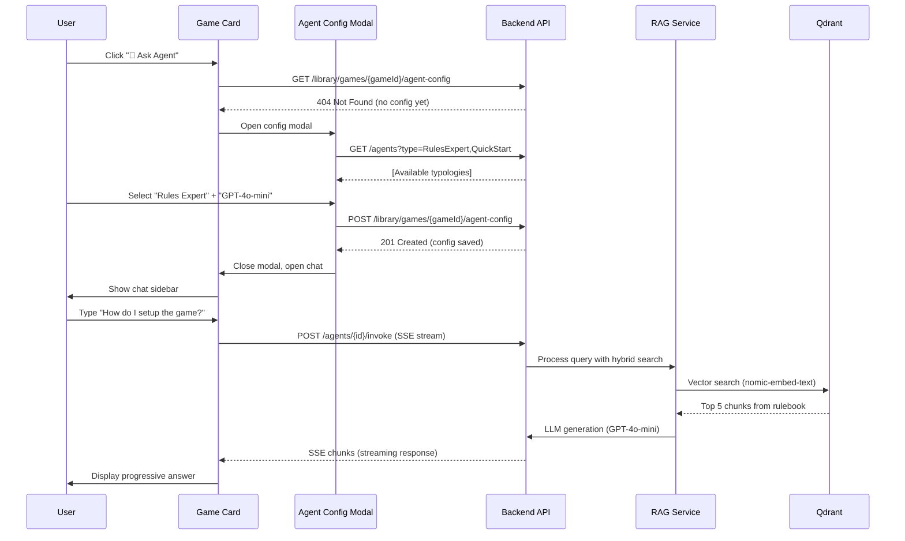
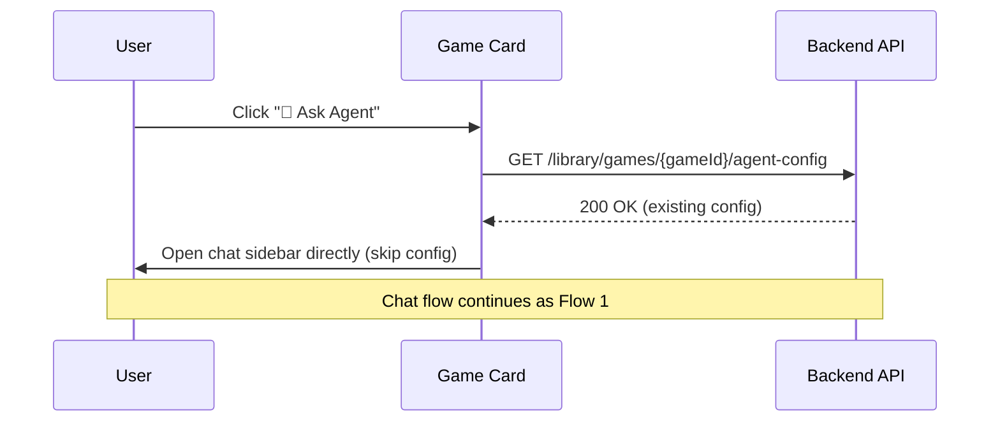
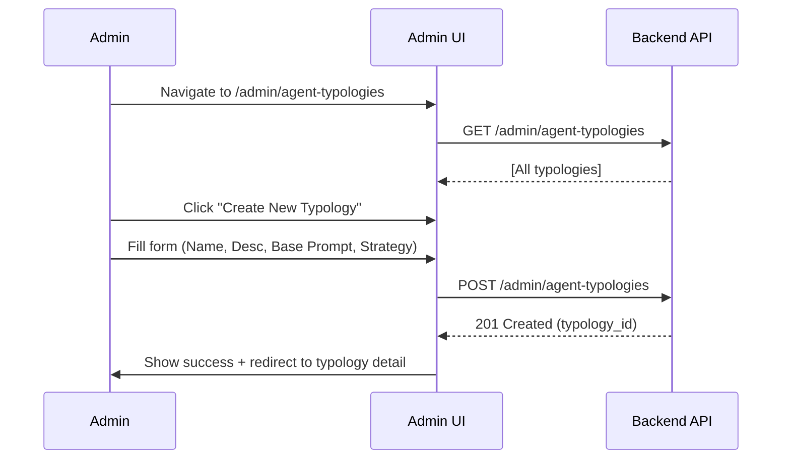
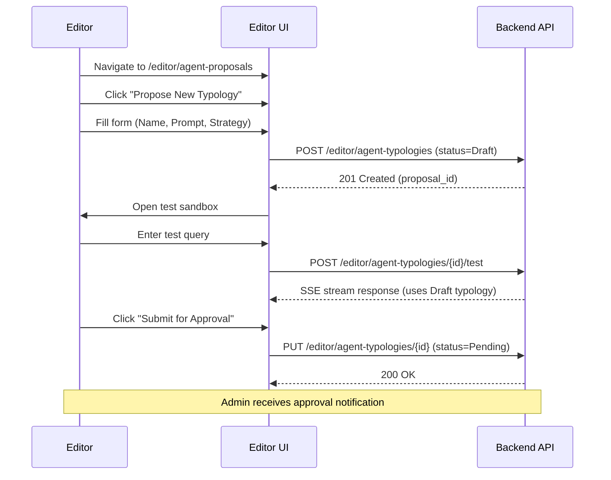

# PRD: AI Agent System - MVP

**Epic**: AI Agent RAG Integration
**Version**: 1.0
**Created**: 2026-01-30
**Status**: Draft - Requirements Discovery Complete
**Owner**: Development Team

---

## Executive Summary

**Vision**: Giocatori possono lanciare AI agents dalla game card per ottenere assistenza real-time su regole, strategie, setup e altro. Admin ed Editor gestiscono tipologie di agent, prompt templates e configurazioni.

**MVP Scope**: Provare iterazione completa RAG → Agent → Chat con almeno 2 tipologie agent (Rules Expert + Quick Start) e validare l'infrastruttura end-to-end.

**Infrastructure Status**: 🟢 **90% già implementato** - Backend RAG pipeline, SSE streaming, multi-model LLM, cost tracking tutti funzionanti.

**Critical Gap**: 10% frontend UI + agent strategy management + session state persistence

---

## Problem Statement

### User Pain Points
1. **Durante il gioco**: Giocatori hanno dubbi su regole complesse → perdono tempo cercando nel manuale
2. **Setup iniziale**: Nuovi giocatori non sanno da dove iniziare → frustrazione e abbandono
3. **Strategia avanzata**: Giocatori vogliono migliorare → mancano suggerimenti personalizzati
4. **Varianti/espansioni**: Regole homebrew e espansioni → confusione su interazioni

### Business Value
- **Retention**: Riduce abbandono giochi complessi (target: +30% session completion)
- **Engagement**: Aumenta interazioni app (target: +50% time-on-site)
- **Differentiation**: Killer feature vs competitori (BoardGameGeek, Dized)
- **Upsell**: Premium tiers con modelli AI migliori (GPT-4, Claude)

---

## Goals & Success Metrics

### MVP Goals
1. ✅ Giocatore può lanciare agent dalla game card
2. ✅ Agent risponde usando RAG (PDF rulebook)
3. ✅ Chat interface funzionante con SSE streaming
4. ✅ Admin può gestire tipologie agent
5. ✅ Token usage tracking e tier-based limits

### Success Metrics (MVP)

| Metric | Target | Measurement |
|--------|--------|-------------|
| **Agent Response Accuracy** | > 90% | User feedback thumbs up/down |
| **Response Latency** | < 5s E2E | Server-side tracking |
| **Chat Engagement** | > 3 msg/session | Chat analytics |
| **PDF Coverage** | 100% rulebooks | Admin dashboard |
| **Cost per Query** | < $0.02 | LlmCostLog aggregation |

### Non-Goals (Post-MVP)
- ❌ Multi-game knowledge (agent cross-game)
- ❌ Voice input/output
- ❌ Proactive agent suggestions
- ❌ Agent personalization (learning user preferences)
- ❌ Mobile app native integration

---

## User Stories

### Epic 1: Player Experience

**US-1.1**: Launch Agent from Game Card
```
As a player viewing a game in my library,
I want to click "Ask Agent" button on the game card,
So that I can quickly get help without leaving the page.

Acceptance Criteria:
- [x] Game card displays "🤖 Ask Agent" button
- [x] Button opens modal/sidebar with agent configuration
- [x] Configuration persists per user+game
- [x] Button disabled if no PDF associated with game
```

**US-1.2**: Select Agent Type & Model
```
As a player launching an agent,
I want to select agent type (Rules, Setup, Strategy) and AI model,
So that I get the right kind of help within my tier limits.

Acceptance Criteria:
- [x] Dropdown "Agent Type" with available typologies
- [x] Dropdown "AI Model" filtered by user tier
- [x] Estimated cost per query displayed
- [x] Warning if approaching token quota
```

**US-1.3**: Chat with Agent (Real-Time)
```
As a player interacting with an agent,
I want to ask questions and receive answers in real-time,
So that I can continue playing without interruptions.

Acceptance Criteria:
- [x] Chat interface with input field + send button
- [x] SSE streaming for progressive response display
- [x] Loading indicator while agent is thinking
- [x] Chat history saved (session-based)
- [x] Ability to scroll through conversation
- [x] Copy/export conversation
```

### Epic 2: Admin/Editor Management

**US-2.1**: Manage Agent Typologies (Admin)
```
As an admin,
I want to create, edit, and approve agent typologies,
So that I can control what kinds of agents users can launch.

Acceptance Criteria:
- [x] Admin UI: List all agent typologies
- [x] Create new typology: Name, Description, Base Prompt, Default Strategy
- [x] Edit existing typology (versioning support)
- [x] Enable/Disable typologies (soft delete)
- [x] Approve editor-proposed typologies
```

**US-2.2**: Propose Agent Typologies (Editor)
```
As an editor,
I want to propose new agent typologies for testing,
So that I can experiment before they're available to all users.

Acceptance Criteria:
- [x] Editor UI: Propose new typology
- [x] Test typology in sandbox (editor-only)
- [x] Submit for admin approval
- [x] Status tracking: Draft → Pending → Approved/Rejected
```

**US-2.3**: Configure Prompt Templates
```
As an admin,
I want to manage prompt templates for each typology,
So that I can optimize agent responses over time.

Acceptance Criteria:
- [x] Template editor with variables support ({{gameTitle}}, {{userQuestion}})
- [x] Preview prompt with sample data
- [x] Version history (rollback capability)
- [x] A/B testing support (2 versions comparison)
```

### Epic 3: Session Integration

**US-3.1**: Session-Based Agent State
```
As a player in an active game session,
I want the agent to remember the current game state,
So that I get context-aware answers about my specific situation.

Acceptance Criteria:
- [x] Agent linked to session_id (from GST #3167)
- [x] Agent can access: current turn, player scores, game phase
- [x] Agent state persists across chat messages
- [x] Agent state cleared when session ends
```

---

## Technical Architecture

### Domain Model (Extensions to KnowledgeBase)

#### New Entities

**AgentTypology** (Admin-managed):
```csharp
public class AgentTypology
{
    public Guid Id { get; private set; }
    public string Name { get; private set; } // "Rules Expert", "Quick Start"
    public string Description { get; private set; }
    public string BasePrompt { get; private set; } // Template with {{variables}}
    public AgentStrategy DefaultStrategy { get; private set; }
    public bool IsActive { get; private set; }
    public bool RequiresApproval { get; private set; } // Editor-proposed
    public TypologyStatus Status { get; private set; } // Draft/Pending/Approved/Rejected
    public Guid CreatedBy { get; private set; } // Admin or Editor
    public Guid? ApprovedBy { get; private set; }
    public DateTime CreatedAt { get; private set; }
    public DateTime? ApprovedAt { get; private set; }
}
```

**AgentSession** (Session-based state):
```csharp
public class AgentSession
{
    public Guid Id { get; private set; }
    public Guid AgentId { get; private set; }
    public Guid GameSessionId { get; private set; } // Link to GST #3167
    public Guid UserId { get; private set; }
    public Guid GameId { get; private set; }
    public string CurrentGameState { get; private set; } // JSON: turn, scores, phase
    public DateTime StartedAt { get; private set; }
    public DateTime? EndedAt { get; private set; }
    public bool IsActive { get; private set; }

    // Navigation
    public Agent Agent { get; private set; }
    public List<ChatLog> ConversationHistory { get; private set; }
}
```

**PromptTemplate** (Versioned prompts):
```csharp
public class PromptTemplate
{
    public Guid Id { get; private set; }
    public Guid TypologyId { get; private set; }
    public string Content { get; private set; } // Template con {{variables}}
    public int Version { get; private set; }
    public bool IsCurrent { get; private set; }
    public DateTime CreatedAt { get; private set; }
    public Guid CreatedBy { get; private set; }

    // Navigation
    public AgentTypology Typology { get; private set; }
}
```

### API Endpoints (New)

**Admin Agent Management**:
```
POST   /api/v1/admin/agent-typologies              → CreateTypologyCommand
GET    /api/v1/admin/agent-typologies              → GetAllTypologiesQuery
PUT    /api/v1/admin/agent-typologies/{id}         → UpdateTypologyCommand
DELETE /api/v1/admin/agent-typologies/{id}         → DeleteTypologyCommand (soft)
POST   /api/v1/admin/agent-typologies/{id}/approve → ApproveTypologyCommand
```

**Editor Agent Proposals**:
```
POST   /api/v1/editor/agent-typologies             → ProposeTypologyCommand
GET    /api/v1/editor/agent-typologies/my-proposals → GetMyProposalsQuery
PUT    /api/v1/editor/agent-typologies/{id}/test   → TestTypologyCommand (sandbox)
```

**Prompt Template Management**:
```
POST   /api/v1/admin/prompt-templates              → CreatePromptTemplateCommand
GET    /api/v1/admin/prompt-templates/{typologyId} → GetTemplatesQuery
PUT    /api/v1/admin/prompt-templates/{id}/activate → ActivateTemplateVersionCommand
```

**Session-Based Agent**:
```
POST   /api/v1/game-sessions/{sessionId}/agent/launch → LaunchSessionAgentCommand
POST   /api/v1/game-sessions/{sessionId}/agent/chat   → ChatWithSessionAgentCommand (SSE)
GET    /api/v1/game-sessions/{sessionId}/agent/state  → GetAgentStateQuery
DELETE /api/v1/game-sessions/{sessionId}/agent        → EndSessionAgentCommand
```

### Frontend Components (New)

**Game Card Integration**:
- `<GameCard>` + "Ask Agent" button
- `<AgentLaunchModal>` - Configuration (typology + model select)

**Chat Interface**:
- `<AgentChatSidebar>` - Compact sidebar con SSE streaming
- `<ChatMessage>` - Message bubble (user/agent)
- `<ChatInput>` - Input field con send button
- `<TypingIndicator>` - Loading animation

**Admin UI**:
- `/admin/agent-typologies` - List, Create, Edit, Approve
- `<TypologyEditor>` - Form con prompt template editor
- `<PromptTemplateVersionHistory>` - Version comparison

**Editor UI**:
- `/editor/agent-proposals` - My proposals, Test sandbox
- `<ProposalForm>` - Propose new typology
- `<TestSandbox>` - Test typology con sample queries

---

## MVP Agent Typologies (3 iniziali)

### 1. Rules Expert 🎲
**Scope**: Spiega regole, risolve dubbi, chiarisce meccaniche
**Base Prompt**:
```
You are a Rules Expert for {{gameTitle}}.
Answer questions about game rules using ONLY information from the official rulebook.
Be precise, cite page numbers, and clarify ambiguities.
If a rule is unclear, say so and provide the exact rulebook text.
Never invent rules or make assumptions.
```
**Strategy**: HybridSearch (vector 70% + keyword 30%)
**Model**: GPT-4o-mini (Free tier), Claude-3.5-Haiku (Premium)

### 2. Quick Start Guide 📚
**Scope**: Setup, tutorial, FAQ, guida rapida al gioco
**Base Prompt**:
```
You are a Quick Start Guide for {{gameTitle}}.
Help new players set up the game and understand basic mechanics.
Provide step-by-step instructions for game setup, first turn, and win conditions.
Use simple language and focus on getting players started quickly.
```
**Strategy**: VectorOnly (pure semantic similarity)
**Model**: Llama-3.3-70b (Free tier), GPT-4o (Premium)

### 3. Ledger Master 📝 (Post-MVP - require GST integration)
**Scope**: Registra partite, traccia punteggi, suggerisce mosse basate su storico
**Base Prompt**:
```
You are a Ledger Master for {{gameTitle}}.
Track game state, record scores, and provide context-aware suggestions.
Current state: Turn {{currentTurn}}, Scores {{playerScores}}, Phase {{gamePhase}}.
Use session history to provide personalized recommendations.
```
**Strategy**: MultiModelConsensus (GPT-4 + Claude agreement)
**Model**: GPT-4 (Premium only)

---

## User Flow (MVP)

### Flow 1: First-Time Agent Launch



### Flow 2: Returning User (Config Exists)



### Flow 3: Admin Creates New Typology



### Flow 4: Editor Proposes & Tests Typology



---

## Technical Requirements

### Backend (CQRS Commands/Queries)

#### New Commands

**Agent Strategy Management**:
- `CreateAgentTypologyCommand` (Admin)
- `UpdateAgentTypologyCommand` (Admin)
- `DeleteAgentTypologyCommand` (Admin, soft delete)
- `ApproveAgentTypologyCommand` (Admin)
- `ProposeAgentTypologyCommand` (Editor)
- `CreatePromptTemplateCommand` (Admin)
- `ActivatePromptTemplateVersionCommand` (Admin)

**Session-Based Agent**:
- `LaunchSessionAgentCommand` (User) - Create AgentSession
- `ChatWithSessionAgentCommand` (User) - SSE streaming
- `UpdateAgentSessionStateCommand` (System) - Persist game state
- `EndSessionAgentCommand` (User/System) - Cleanup

#### New Queries

**Agent Strategy Management**:
- `GetAllAgentTypologiesQuery` (Admin/Editor)
- `GetTypologyByIdQuery` (Admin/Editor)
- `GetPendingTypologiesQuery` (Admin) - Approval queue
- `GetMyProposalsQuery` (Editor)
- `GetPromptTemplatesQuery` (Admin)

**Session-Based Agent**:
- `GetAgentSessionQuery` (User)
- `GetAgentSessionStateQuery` (User)

### Database Schema (New Tables)

**agent_typologies**:
```sql
CREATE TABLE agent_typologies (
    id UUID PRIMARY KEY,
    name VARCHAR(100) NOT NULL UNIQUE,
    description TEXT,
    base_prompt TEXT NOT NULL,
    default_strategy_json JSONB, -- AgentStrategy serialized
    is_active BOOLEAN DEFAULT true,
    requires_approval BOOLEAN DEFAULT false,
    status VARCHAR(20), -- Draft/Pending/Approved/Rejected
    created_by UUID NOT NULL REFERENCES users(id),
    approved_by UUID REFERENCES users(id),
    created_at TIMESTAMP NOT NULL,
    approved_at TIMESTAMP,
    updated_at TIMESTAMP,
    is_deleted BOOLEAN DEFAULT false,
    deleted_at TIMESTAMP,

    CONSTRAINT chk_status CHECK (status IN ('Draft', 'Pending', 'Approved', 'Rejected'))
);
```

**prompt_templates**:
```sql
CREATE TABLE prompt_templates (
    id UUID PRIMARY KEY,
    typology_id UUID NOT NULL REFERENCES agent_typologies(id) ON DELETE CASCADE,
    content TEXT NOT NULL,
    version INT NOT NULL,
    is_current BOOLEAN DEFAULT false,
    created_by UUID NOT NULL REFERENCES users(id),
    created_at TIMESTAMP NOT NULL,

    UNIQUE(typology_id, version)
);
```

**agent_sessions**:
```sql
CREATE TABLE agent_sessions (
    id UUID PRIMARY KEY,
    agent_id UUID NOT NULL REFERENCES agents(id),
    game_session_id UUID NOT NULL REFERENCES game_sessions(id), -- GST #3167
    user_id UUID NOT NULL REFERENCES users(id),
    game_id UUID NOT NULL REFERENCES shared_games(id),
    typology_id UUID NOT NULL REFERENCES agent_typologies(id),
    current_game_state JSONB, -- {turn: 3, scores: {...}, phase: "midgame"}
    started_at TIMESTAMP NOT NULL,
    ended_at TIMESTAMP,
    is_active BOOLEAN DEFAULT true,

    UNIQUE(game_session_id, user_id) -- One agent per user per session
);
```

### Frontend Routes (New)

**Player Routes**:
- `/library/games/{gameId}` - Game detail con "Ask Agent" button (extends existing)
- `/game-session/{sessionId}/agent` - Agent chat sidebar (overlay)

**Admin Routes**:
- `/admin/agent-typologies` - List all typologies
- `/admin/agent-typologies/create` - Create new typology
- `/admin/agent-typologies/{id}` - Edit typology
- `/admin/agent-typologies/pending` - Approval queue
- `/admin/prompt-templates/{typologyId}` - Template versions

**Editor Routes**:
- `/editor/agent-proposals` - My proposals list
- `/editor/agent-proposals/create` - Propose new typology
- `/editor/agent-proposals/{id}/test` - Test sandbox

### RAG Configuration (Per Typology)

Each typology can override default RAG settings:

```json
{
  "typologyId": "rules-expert-uuid",
  "ragConfig": {
    "topK": 5,
    "minScore": 0.75,
    "strategy": "HybridSearch",
    "strategyParams": {
      "vectorWeight": 0.8,
      "keywordWeight": 0.2
    },
    "maxQueryVariations": 4,
    "enableReranking": true
  },
  "llmConfig": {
    "temperature": 0.3,
    "maxTokens": 800,
    "stopSequences": ["</answer>"]
  }
}
```

---

## Dependencies & Prerequisites

### ✅ Already Implemented (No Work Needed)

1. **RAG Pipeline**: Hybrid search, RRF fusion, Query expansion ✅
2. **Vector DB**: Qdrant configured and healthy ✅
3. **Embedding**: nomic-embed-text service running ✅
4. **Reranker**: Cross-encoder service running ✅
5. **LLM Integration**: OpenRouter + Ollama with circuit breaker ✅
6. **Cost Tracking**: LlmCostLog with token/cost metrics ✅
7. **SSE Streaming**: `/agents/qa/stream`, `/agents/explain/stream` ✅
8. **Basic Endpoints**: Create agent, Invoke agent, Configure agent ✅

### ⏳ Prerequisites to Validate

1. **PDF Processing E2E**:
   - Action: Upload 1 rulebook PDF to SharedGameCatalog
   - Validate: PDF → Extract → Chunk → Embed → Qdrant
   - Test: Query Qdrant and retrieve relevant chunks
   - Blocker if fails: Cannot test RAG without indexed documents

2. **Existing Agent Entities**:
   - Action: Check if sample agents exist in DB
   - Validate: Query `GET /agents` and verify response
   - Create: If empty, seed 2 sample agents (Rules + Setup)

3. **Game-PDF Association**:
   - Action: Verify at least 1 game has PDF linked
   - Validate: Query SharedGameCatalog for games with documents
   - Fix: If none, upload sample rulebook and link to game

---

## Risk Assessment

### High Risk 🔴

**R1: PDF Processing Pipeline Failure**
- Impact: Cannot test RAG if documents not indexed
- Mitigation: Validate E2E BEFORE starting frontend work
- Contingency: Use sample documents for testing

**R2: SSE Streaming Instability**
- Impact: Poor UX with dropped connections
- Mitigation: Implement reconnection logic + fallback to polling
- Contingency: Start with polling, add SSE later

### Medium Risk 🟡

**R3: Token Quota Enforcement**
- Impact: Users bypass limits, cost explosion
- Mitigation: Hard limits at API gateway + UI warnings
- Contingency: Admin override capability

**R4: Agent Response Quality**
- Impact: <90% accuracy → user frustration
- Mitigation: 5-layer validation already implemented
- Contingency: Allow user to switch models

### Low Risk 🟢

**R5: UI Performance (Chat Sidebar)**
- Impact: Laggy chat interface
- Mitigation: Virtual scrolling for long conversations
- Contingency: Pagination for message history

---

## Implementation Phases

### Phase 0: Validation (Week 1) 🔴 BLOCKER

**Goal**: Validate all prerequisites before development

**Tasks**:
1. Upload 1 rulebook PDF to SharedGameCatalog (Admin)
2. Trigger PDF processing pipeline (extract → chunk → embed)
3. Verify Qdrant collection has documents (`GET /qdrant/collections`)
4. Test RAG query: `POST /agents/qa` with sample question
5. Verify SSE streaming: `POST /agents/qa/stream`

**Success Criteria**:
- ✅ At least 1 game with PDF processed
- ✅ Qdrant collection `meepleai_documents` populated
- ✅ RAG query returns relevant chunks (confidence > 0.7)
- ✅ SSE streaming works end-to-end

**Blockers**: If fails, stop and fix infrastructure BEFORE continuing

### Phase 1: Agent Strategy Management (Week 2-3)

**Backend** (1 week):
- Create `AgentTypology`, `PromptTemplate` entities + migrations
- Implement CRUD commands/queries (6 commands, 4 queries)
- Add approval workflow logic (Editor → Admin)
- Seed 3 default typologies (Rules, Setup, Ledger)

**Frontend** (1 week):
- Admin UI: `/admin/agent-typologies` (list, create, edit, approve)
- Editor UI: `/editor/agent-proposals` (propose, test, submit)
- Prompt template editor component
- Approval queue component

### Phase 2: Session-Based Agent (Week 4-5)

**Backend** (1 week):
- Create `AgentSession` entity + migration
- Implement session commands (Launch, Chat, UpdateState, End)
- Integration con GST `game_sessions` table (#3167)
- Agent state persistence logic

**Frontend** (1 week):
- Game card "Ask Agent" button
- Agent config modal (typology + model select)
- Chat sidebar component (compact, mobile-friendly)
- SSE streaming integration
- Token usage display

### Phase 3: Testing & Polish (Week 6)

**E2E Tests**:
- E2E-001: User launches agent → asks question → receives answer
- E2E-002: Admin creates typology → Editor proposes → Admin approves
- E2E-003: Agent session with game state persistence
- E2E-004: Token quota enforcement (exceed limit → fallback to free model)

**Performance Testing**:
- Load test: 10 concurrent agent sessions
- Latency validation: <5s E2E response time
- SSE stability: 1-hour session without disconnects

**Quality Validation**:
- Test 20 sample questions → measure accuracy (target >90%)
- Hallucination detection (target <3%)
- Citation accuracy (target >95%)

---

## Out of Scope (Post-MVP)

**v2.0 Features**:
- Strategy Coach (analizza situazioni, suggerisce mosse)
- Competitive Analyst (statistiche, probabilità)
- Lore Master (background, tematiche gioco)
- Multi-game knowledge (agent cross-game)
- Voice input/output
- Proactive suggestions
- Agent personalization (learning preferences)

**Infrastructure**:
- Agent analytics dashboard (#3080 AI Usage Dashboard)
- A/B testing framework for prompts
- Custom embedding models per game genre
- Local LLM fine-tuning

---

## Dependencies on Other Epics

### Critical Dependencies

**GST #3167 (Game Session Toolkit)**:
- **Required for**: Ledger Master typology (requires session state)
- **Integration**: `agent_sessions.game_session_id` FK to `game_sessions.id`
- **Timeline**: GST Sprint 1.1-1.2 must complete BEFORE Agent Phase 2

**Library UX #2866/#2867**:
- **Required for**: Game card "Ask Agent" button placement
- **Integration**: Extends existing `<GameCard>` component
- **Timeline**: Can work in parallel, merge before Agent Phase 2

### Optional Dependencies

**AI Usage Dashboard #3080**:
- **Enhances**: Agent token usage visibility
- **Integration**: Shared LlmCostLog data source
- **Timeline**: Independent, can be done after MVP

**Testing #3082 (50 E2E flows)**:
- **Includes**: Agent E2E tests as part of comprehensive suite
- **Integration**: Agent tests = subset of 50 flows
- **Timeline**: Agent E2E tests done in Phase 3, rest can continue

---

## Cost Estimation

### Development Effort

| Phase | Backend | Frontend | Testing | Total |
|-------|---------|----------|---------|-------|
| **Phase 0: Validation** | 1d | 0d | 1d | 2d |
| **Phase 1: Strategy Mgmt** | 3d | 3d | 2d | 8d |
| **Phase 2: Session Agent** | 4d | 4d | 2d | 10d |
| **Phase 3: Testing** | 1d | 1d | 3d | 5d |
| **TOTAL** | **9d** | **8d** | **8d** | **25d** |

**Assumptions**:
- 2 backend devs (parallel work on different contexts)
- 2 frontend devs (parallel UI components)
- 1 QA engineer (continuous testing)

### Infrastructure Costs (Monthly)

| Service | Usage | Cost |
|---------|-------|------|
| **OpenRouter** (GPT-4o-mini) | 10K queries/month @ $0.001 | $10 |
| **OpenRouter** (Claude-3.5) | 2K queries/month @ $0.003 | $6 |
| **Qdrant** (self-hosted) | 1M vectors | $0 |
| **Embedding** (self-hosted) | Unlimited | $0 |
| **Total** | | **$16/month** |

**Note**: Free tier users (80%) use Llama-3.3-70b via OpenRouter free tier ($0 cost)

---

## Open Questions & Decisions Needed

### Architecture Decisions

**Q1**: AgentTypology in quale bounded context?
- Option A: Estensione KnowledgeBase (consigliato - già ha Agent entities)
- Option B: Nuovo bounded context "AgentManagement"
- **Decisione**: KnowledgeBase extension (meno overhead, DDD compliant)

**Q2**: Approval workflow sincrono o asincrono?
- Option A: Editor propone → notifica Admin → Admin approva in UI
- Option B: Editor propone → sistema notifica → Admin approva da queue
- **Decisione**: Option B (scalabile, audit trail)

**Q3**: Agent session state format?
- Option A: JSON libero (flessibile, no schema)
- Option B: Typed DTO (type-safe, validato)
- **Decisione**: JSON con schema validation (flessibile + safe)

### Technical Decisions

**Q4**: SSE streaming per chat sidebar?
- Pro: Real-time progressive display, better UX
- Con: Più complesso, richiede reconnection logic
- **Decisione**: Sì, già implementato backend, riuso pattern

**Q5**: Chat history persistence?
- Option A: Session-based (cleared on session end)
- Option B: Permanent (always saved)
- **Decisione**: Session-based per MVP, permanent in v2.0

**Q6**: Mobile chat UI pattern?
- Option A: Full-screen modal (mobile-first)
- Option B: Bottom sheet (compact)
- **Decisione**: Bottom sheet (meno invasivo)

---

## Acceptance Criteria (MVP)

### Must-Have

- [ ] User può lanciare agent da game card
- [ ] Agent risponde con RAG usando PDF rulebook
- [ ] Chat sidebar funzionante con SSE streaming
- [ ] Admin può creare/edit/approve tipologie
- [ ] Editor può proporre tipologie per test
- [ ] Token usage tracking e tier-based limits
- [ ] 2 tipologie funzionanti (Rules + Setup)
- [ ] E2E test: user → agent → chat → answer
- [ ] Response accuracy >90% su sample questions
- [ ] Response latency <5s E2E

### Should-Have

- [ ] 3 tipologie (+ Ledger Master)
- [ ] Prompt template versioning
- [ ] Agent session state persistence (game state)
- [ ] Chat history export
- [ ] Mobile-optimized chat UI
- [ ] Admin analytics (agent usage stats)

### Nice-to-Have (Post-MVP)

- [ ] 6 tipologie complete (+ Strategy, Competitive, Lore)
- [ ] Multi-game knowledge
- [ ] Voice input
- [ ] Proactive suggestions
- [ ] Agent personalization

---

**Version**: 1.0
**Status**: Ready for Epic Breakdown
**Next Step**: Create GitHub issues from this PRD
