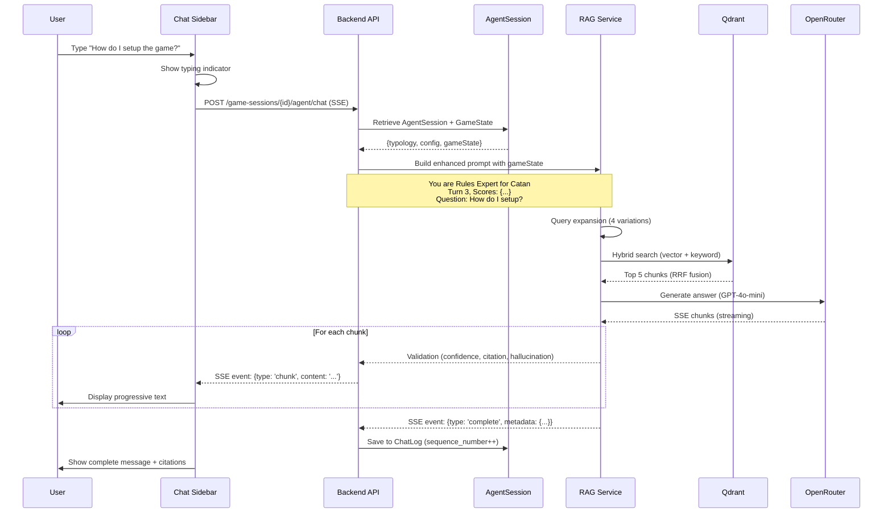

# AI Agent System - Visual Roadmap

**Quick Reference**: Epic structure, dependencies, e timeline in formato visuale

---

## 🎯 System Architecture Overview

```
┌─────────────────────────────────────────────────────────────────┐
│                        USER EXPERIENCE                          │
├─────────────────────────────────────────────────────────────────┤
│                                                                 │
│  Game Card → [🤖 Ask Agent] → Config Modal → Chat Sidebar      │
│                                   ↓              ↓              │
│                          Select Typology    SSE Streaming       │
│                          Select Model       Real-Time Chat      │
│                                                                 │
└─────────────────────────────────────────────────────────────────┘
                              ↓
┌─────────────────────────────────────────────────────────────────┐
│                      BACKEND API LAYER                          │
├─────────────────────────────────────────────────────────────────┤
│                                                                 │
│  POST /game-sessions/{id}/agent/launch                         │
│       ↓                                                         │
│  LaunchSessionAgentCommand → Create AgentSession               │
│       ↓                                                         │
│  POST /game-sessions/{id}/agent/chat (SSE)                     │
│       ↓                                                         │
│  ChatWithSessionAgentCommand → InvokeAgent + GameState         │
│                                                                 │
└─────────────────────────────────────────────────────────────────┘
                              ↓
┌─────────────────────────────────────────────────────────────────┐
│                    RAG PIPELINE (90% DONE ✅)                   │
├─────────────────────────────────────────────────────────────────┤
│                                                                 │
│  Query Expansion → Hybrid Search → RRF Fusion → LLM → Validate │
│       ↓                 ↓              ↓          ↓        ↓    │
│   4 variations    Vector 70%      k=60 merge  GPT-4   5-layer  │
│                   Keyword 30%                  Claude  quality  │
│                                                                 │
└─────────────────────────────────────────────────────────────────┘
                              ↓
┌─────────────────────────────────────────────────────────────────┐
│                   DATA LAYER (ALL HEALTHY ✅)                   │
├─────────────────────────────────────────────────────────────────┤
│                                                                 │
│  Qdrant (vectors) ← Embedding Service ← PDF Rulebooks          │
│  PostgreSQL (chunks, chat logs, typologies)                    │
│  Redis (HybridCache, 24h TTL)                                  │
│                                                                 │
└─────────────────────────────────────────────────────────────────┘
```

---

## 📊 Epic Dependency Graph (Critical Path)

```
                     ┌─────────────┐
                     │   EPIC 0    │
                     │ Validation  │ Week 1 🔴 BLOCKER
                     │  (2 days)   │
                     └──────┬──────┘
                            │
              ┌─────────────┴─────────────┐
              ↓                           ↓
       ┌──────────────┐           ┌──────────────┐
       │   EPIC 1     │           │   EPIC 2     │
       │  Typology    │           │   Session    │ Week 2-4 🟠
       │ Management   │           │    Agent     │
       │ (2 weeks)    │           │ (2 weeks)    │
       └──────┬───────┘           └──────┬───────┘
              │                          │
              └─────────────┬────────────┘
                            ↓
                     ┌──────────────┐
                     │   EPIC 3     │
                     │   Testing    │ Week 5 🔴
                     │  (1 week)    │
                     └──────┬───────┘
                            │
                            ↓
                      ┌──────────┐
                      │   MVP    │
                      │ Complete │ ✅
                      └──────────┘
```

---

## 🗓️ 5-Week Timeline (Gantt Chart)

```
Week:        1         2         3         4         5
Task:     |─────|─────|─────|─────|─────|─────|─────|─────|─────|─────|

EPIC 0    [Validation]
           ▓▓

EPIC 1    Backend Domain
                  [AGT-001][AGT-002]
                  ▓▓▓▓▓▓▓▓▓▓

EPIC 1    Backend Queries
                        [AGT-003][AGT-004]
                        ▓▓▓▓▓▓▓▓▓▓

EPIC 1    Admin UI
                  [AGT-005][AGT-006][AGT-007]
                  ▓▓▓▓▓▓▓▓▓▓▓▓▓▓▓▓▓▓▓▓

EPIC 1    Editor UI
                        [AGT-008]
                        ▓▓▓▓▓▓▓▓

EPIC 2    Session BE
                              [AGT-009][AGT-010][AGT-015]
                              ▓▓▓▓▓▓▓▓▓▓▓▓▓▓▓▓▓▓

EPIC 2    Frontend UI
                                    [AGT-011][AGT-012][AGT-013][014]
                                    ▓▓▓▓▓▓▓▓▓▓▓▓▓▓▓▓▓▓▓▓▓▓▓▓▓▓

EPIC 3    Testing
                                                      [AGT-016][017][018]
                                                      ▓▓▓▓▓▓▓▓▓▓▓▓▓▓

Checkpoints:  CP0    CP1                      CP2              FINAL
               ↓      ↓                        ↓                ↓
```

**Legend**:
- `▓` Active development
- `CP0` Validation complete (GO/NO-GO)
- `CP1` Typology management ready
- `CP2` Session agent ready
- `FINAL` MVP launch

---

## 📦 Deliverables by Epic

### EPIC 0: Validation (2 giorni) 🔴

**Deliverables**:
- ✅ 1 gioco con PDF rulebook processato e indicizzato in Qdrant
- ✅ Smoke test tutti gli endpoint agent (2xx responses)
- ✅ RAG query test: confidence >0.7, citations present
- ✅ SSE streaming test: no disconnects for 5-minute session

**Issues**: #RAG-001, #RAG-002

---

### EPIC 1: Typology Management (2 settimane) 🟠

**Backend Deliverables**:
- ✅ `AgentTypology` entity + migration
- ✅ `PromptTemplate` entity + versioning
- ✅ 4 Admin commands: Create, Update, Delete, Approve
- ✅ 2 Editor commands: Propose, Test
- ✅ 4 Query handlers: GetAll, GetById, GetPending, GetMyProposals
- ✅ 3 default typologies seeded (Rules, Setup, Ledger)

**Frontend Deliverables**:
- ✅ Admin UI: `/admin/agent-typologies` (list, create, edit, approve)
- ✅ Editor UI: `/editor/agent-proposals` (propose, test, submit)
- ✅ Prompt template editor con variables autocomplete
- ✅ Approval queue con bulk actions

**Issues**: #AGT-001 → #AGT-008 (8 issue)

---

### EPIC 2: Session Agent (2 settimane) 🟠

**Backend Deliverables**:
- ✅ `AgentSession` entity + migration (FK to GST)
- ✅ Session commands: Launch, Chat, UpdateState, End
- ✅ Game state JSON persistence (turn, scores, phase)
- ✅ GST event integration (state sync)

**Frontend Deliverables**:
- ✅ Game card "Ask Agent" button (extends UserGameCard)
- ✅ Agent config modal (typology + model dropdowns)
- ✅ Chat sidebar component (SSE streaming)
- ✅ Mobile bottom sheet UI
- ✅ Zustand store (config + session + conversation state)

**Issues**: #AGT-009 → #AGT-015 (6 issue, #AGT-016 frontend tests)

---

### EPIC 3: Testing & Quality (1 settimana) 🔴

**Deliverables**:
- ✅ Frontend component tests (>85% coverage)
- ✅ E2E tests (4 scenarios):
  1. First-time agent launch
  2. Returning user (config exists)
  3. Token quota enforcement
  4. Admin approval workflow
- ✅ RAG quality validation (20 questions, >90% accuracy)
- ✅ Performance tests (latency <5s, SSE stability)

**Issues**: #AGT-016, #AGT-017, #AGT-018 (3 issue + #RAG-001/002)

---

## 🚦 Go/No-Go Decision Points

### Checkpoint 0: Validation (End of Week 1)

**Criteria**:
- ✅ #RAG-001 passed: PDF indexed in Qdrant
- ✅ #RAG-002 passed: Agent endpoints return valid responses

**Decision**:
- **GO**: Proceed to EPIC 1 development
- **NO-GO**: Fix infrastructure issues, delay 1 week

### Checkpoint 1: Typology Management (End of Week 2)

**Criteria**:
- ✅ Admin can create/edit/approve typologies
- ✅ Editor can propose and test typologies
- ✅ 3 default typologies seeded

**Decision**:
- **GO**: Proceed to EPIC 2 (Session Agent)
- **NO-GO**: Fix admin workflow issues, delay frontend

### Checkpoint 2: Session Agent (End of Week 4)

**Criteria**:
- ✅ User can launch agent from game card
- ✅ Chat sidebar works with SSE streaming
- ✅ Agent config persists per user+game

**Decision**:
- **GO**: Proceed to EPIC 3 (Testing)
- **NO-GO**: Fix chat UI or SSE issues

### Checkpoint FINAL: MVP Launch (End of Week 5)

**Criteria**:
- ✅ E2E tests pass (4/4 scenarios)
- ✅ Quality >90% accuracy
- ✅ Performance <5s latency
- ✅ No critical bugs

**Decision**:
- **GO**: Merge to main, deploy to production
- **NO-GO**: Fix quality issues, delay launch 1 week

---

## 🎨 UI Mockup References

### Game Card with Agent Button
```
┌────────────────────────────┐
│ ┌──────────────────────┐   │
│ │  [Game Cover Image]  │   │
│ └──────────────────────┘   │
│                            │
│ **Catan**                  │
│ ★★★★☆ (4.2)                │
│                            │
│ Complexity: Medium         │
│ Players: 3-4               │
│ Duration: 60-90 min        │
│                            │
│ [📊 Stats] [🎮 Play Now]   │
│ [🤖 Ask Agent] <-- NEW     │
└────────────────────────────┘
```

### Agent Config Modal
```
┌─────────────────────────────────────────┐
│ Configure AI Agent for Catan            │
├─────────────────────────────────────────┤
│                                         │
│ What kind of help do you need?          │
│ ┌─────────────────────────────────────┐ │
│ │ 🎲 Rules Expert            [▼]      │ │
│ └─────────────────────────────────────┘ │
│ Explains rules, resolves doubts         │
│                                         │
│ AI Model (based on your Free tier):    │
│ ┌─────────────────────────────────────┐ │
│ │ GPT-4o-mini (Recommended)  [▼]      │ │
│ └─────────────────────────────────────┘ │
│ • Est. cost: $0.001/query               │
│ • Speed: ~3s response time              │
│ • Quality: Good for rules questions     │
│                                         │
│ Your Token Usage:                       │
│ ▓▓▓▓▓▓▓▓▓▓▓▓▓░░ 450/500 (90%)          │
│ ⚠️ Approaching limit - 50 queries left  │
│                                         │
│           [Cancel]  [Launch Agent]      │
└─────────────────────────────────────────┘
```

### Chat Sidebar (Desktop)
```
┌─────────────────────────────────────┐
│ 🤖 Rules Expert for Catan  [−][×]   │
├─────────────────────────────────────┤
│                                     │
│ ┌─ YOU ─────────────────┐           │
│ │ How do I trade        │ 14:32     │
│ │ resources?            │           │
│ └───────────────────────┘           │
│                                     │
│ ┌─ AGENT ───────────────────────┐   │
│ │ In Catan, you can trade       │   │
│ │ resources in two ways:        │   │
│ │                               │   │
│ │ 1. **With other players**:    │   │
│ │    Propose any trade ratio    │   │
│ │    (e.g., 2 wheat for 1 ore)  │   │
│ │                               │   │
│ │ 2. **With the bank**:         │   │
│ │    Exchange 4:1 (4 identical  │   │
│ │    resources for 1 of choice) │   │
│ │                               │ 14:32
│ │ 📄 Source: Rulebook p.8       │   │
│ │ ✓ Confidence: 0.92            │   │
│ └───────────────────────────────┘   │
│                                     │
│ ┌─ AGENT (typing...) ──────────┐    │
│ │ If you have a harbor port,   │    │
│ │ you can trade at better▊     │    │
│ └──────────────────────────────┘    │
│                                     │
│ ─────────────────────────────────── │
│                                     │
│ [Type your question...         ] 📎 │
│                                  ⬆️ │
└─────────────────────────────────────┘
```

### Admin Typologies Management
```
/admin/agent-typologies

┌─────────────────────────────────────────────────────────────────┐
│ Agent Typologies Management                  [+ Create New]     │
├─────────────────────────────────────────────────────────────────┤
│                                                                 │
│ Filters: [All ▼] [Search...                              ]     │
│                                                                 │
│ ┌─────────────────────────────────────────────────────────────┐ │
│ │ Name           │ Status    │ Created By │ Created  │ Actions││
│ ├─────────────────────────────────────────────────────────────┤ │
│ │ Rules Expert   │ ✅ Approved│ Admin      │ 2026-01-15│ [...] ││
│ │ Quick Start    │ ✅ Approved│ Admin      │ 2026-01-15│ [...] ││
│ │ Ledger Master  │ ✅ Approved│ Admin      │ 2026-01-20│ [...] ││
│ │ Strategy Coach │ ⏳ Pending │ @editor42  │ 2026-01-28│ [✓][✗]││
│ │ Lore Master    │ 📝 Draft   │ @editor15  │ 2026-01-29│ [...] ││
│ └─────────────────────────────────────────────────────────────┘ │
│                                                                 │
│ Pending Approvals: 1  |  Total Typologies: 5                   │
└─────────────────────────────────────────────────────────────────┘
```

---

## 🔄 Data Flow (User Asks Question)



---

## 🎭 Agent Typologies (MVP: 3)

### 1. Rules Expert 🎲 (Priority 1)

**Use Case**: Giocatore ha dubbio su regola specifica durante partita
**Prompt Strategy**: Citazioni precise, no interpretazioni
**Model**: GPT-4o-mini (Free), Claude-3.5-Haiku (Premium)
**RAG Config**: HybridSearch (vector 80%, keyword 20% - più keyword per regole esatte)

**Sample Queries**:
- "Can I move my knight backwards?"
- "What happens if I roll doubles three times?"
- "Is there a hand limit for cards?"

**Expected Behavior**:
- Always cite rulebook page
- Quote exact rule text
- Say "not specified" if rule unclear
- Never invent house rules

---

### 2. Quick Start Guide 📚 (Priority 2)

**Use Case**: Nuovo giocatore vuole iniziare partita rapidamente
**Prompt Strategy**: Step-by-step, linguaggio semplice, focus su prima partita
**Model**: Llama-3.3-70b (Free), GPT-4o (Premium)
**RAG Config**: VectorOnly (pure semantic, no keyword - setup è concettuale)

**Sample Queries**:
- "How do I setup the game?"
- "What do I do on my first turn?"
- "How do I win?"

**Expected Behavior**:
- Numbered steps (1, 2, 3...)
- Visual descriptions (place board, shuffle cards)
- Focus on minimum to start playing
- Skip advanced rules

---

### 3. Ledger Master 📝 (Priority 3, requires GST)

**Use Case**: Giocatore in session vuole tracking automatico punteggi e suggerimenti
**Prompt Strategy**: Context-aware, usa game state, suggerisce mosse
**Model**: GPT-4 (Premium only, richiede ragionamento complesso)
**RAG Config**: MultiModelConsensus (GPT-4 + Claude agreement per decisioni strategiche)

**Sample Queries**:
- "Should I build a settlement or a city?"
- "Who is winning right now?"
- "What's the optimal next move?"

**Expected Behavior**:
- Reference current game state (turn, scores, phase)
- Suggest moves based on rulebook + situation
- Explain reasoning (probabilità, statistics)
- Track score changes automatically

**Dependencies**:
- GST #3167 (game_sessions table)
- #AGT-015 (GST integration)

---

## 🧪 Test Strategy

### Unit Tests (Week 2-4)
```
Backend:
├── AgentTypology entity tests (invariants, factory methods)
├── Command handler tests (CRUD, approval workflow)
├── Query handler tests (filtering, authorization)
├── AgentSession state tests (JSON validation, FK constraints)
└── Target: >90% coverage

Frontend:
├── AgentConfigModal tests (dropdown, validation, submit)
├── AgentChatSidebar tests (SSE, messages, send)
├── agentStore tests (CRUD, session management)
└── Target: >85% coverage
```

### Integration Tests (Week 3-4)
```
Backend:
├── AgentTypology repository tests (Testcontainers)
├── Approval workflow E2E (Editor → Admin)
├── AgentSession CRUD with FK to game_sessions
├── SSE streaming stability (5-minute session)
└── Target: All critical paths covered
```

### E2E Tests (Week 5)
```
Playwright:
├── E2E-AGT-001: First-time launch + configure + chat
├── E2E-AGT-002: Returning user (skip config modal)
├── E2E-AGT-003: Token quota enforcement + fallback
├── E2E-AGT-004: Editor proposal → Admin approval → User usage
└── Target: 100% pass rate, no flakiness
```

### Quality Validation (Week 5)
```
RAG Testing:
├── 20 sample questions (10 easy, 5 medium, 5 hard)
├── Metrics: Accuracy, Confidence, Citations, Latency
├── Target: >90% accuracy, <5s latency, <3% hallucination
└── Report: Markdown quality summary
```

---

## 📈 Success Metrics (KPIs)

### Launch Metrics (Week 6)

| Metric | Target | Measurement Method |
|--------|--------|--------------------|
| **Agent Adoption** | >20% users launch agent | Analytics: button clicks |
| **Response Accuracy** | >90% | User feedback thumbs up/down |
| **Chat Engagement** | >3 messages/session | ChatLog analytics |
| **Response Latency** | <5s E2E | Server-side tracking (P95) |
| **Hallucination Rate** | <3% | Validation layer tracking |
| **Cost per Query** | <$0.02 | LlmCostLog aggregation |

### Business Metrics (3 months)

| Metric | Baseline | Target | Impact |
|--------|----------|--------|--------|
| **Session Completion** | 60% | 90% | +30% retention |
| **Time on Site** | 15 min | 22 min | +50% engagement |
| **Premium Conversion** | 2% | 5% | +3% upsell (AI features) |
| **Monthly Cost** | $0 | $16 | OpenRouter API ($10 GPT + $6 Claude) |

---

## 🔧 Technical Debt & Future Work

### Known Limitations (MVP)
- ❌ No multi-game knowledge (agent can't cross-reference games)
- ❌ Chat history not exportable (only view in sidebar)
- ❌ No voice input/output (text-only)
- ❌ No proactive suggestions (reactive only)
- ❌ No agent personalization (no learning from user preferences)

### v2.0 Roadmap
1. **Strategy Coach** (analizza mosse, suggerisce ottimali)
2. **Competitive Analyst** (statistiche, probabilità, win rates)
3. **Lore Master** (background, tematiche, ambientazione gioco)
4. **Multi-Game RAG** (agent può usare knowledge da più giochi correlati)
5. **Voice Interface** (speech-to-text input, text-to-speech output)
6. **Proactive Mode** (agent suggerisce senza essere interrogato)
7. **Personalization** (agent impara preferenze utente, stile comunicazione)

### Technical Improvements
1. **Embedding Fine-Tuning**: Custom model per board game domain
2. **Reranker Optimization**: Cross-encoder fine-tuned su game rules
3. **Caching Advanced**: Semantic cache per query simili (vector similarity <0.1)
4. **Latency Optimization**: Reduce generation time 5s → 2s (target P95)

---

## 📞 Questions for Stakeholders

### Product Decisions
1. **Pricing Strategy**: Free tier = 500 queries/month sufficiente? O troppo generoso?
2. **Premium Features**: Quali modelli riservare a Premium? (Claude-3.5, GPT-4?)
3. **Launch Timeline**: 5 settimane OK o serve faster delivery?

### Technical Decisions
4. **Mobile Priority**: Bottom sheet UI sufficiente o serve native app integration?
5. **Analytics Integration**: Agent usage in existing dashboard (#3080) o separato?
6. **Monitoring**: Alerting su hallucination rate >5% o quality drop?

### Business Decisions
7. **Beta Testing**: Soft launch con subset di utenti (10%) o full release?
8. **Marketing**: Agent system come hero feature per acquisition campaign?
9. **Partnerships**: OpenRouter credit deals per volume discounts?

---

**Version**: 1.0 - Visual Roadmap
**Audience**: Product, Engineering, QA Teams
**Format**: Quick reference, high-level overview
**Detail Level**: See full PRD and Epic Breakdown for deep dive
