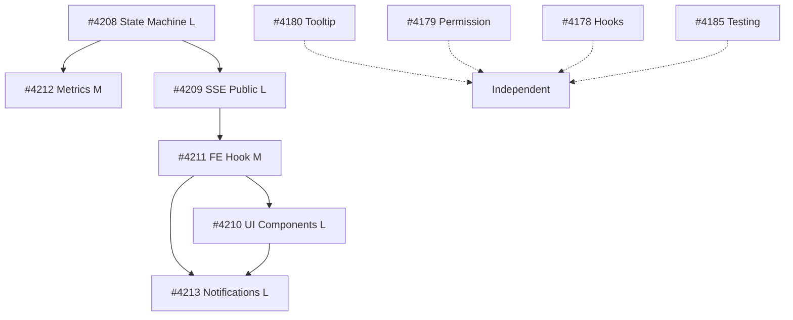

# P1-High Issues Execution Plan
> Generated: 2026-02-13 | PM Agent | Epic #4071 PDF Status Tracking

## 📊 Overview

**Total Issues**: 10 P1-High
**Total Estimate**: ~20-25 days
**Execution Strategy**: Sequential foundations → Parallel waves → Cleanup
**Workflow**: `/implementa` for each issue

---

## 🔗 Dependency Chain



**Critical Path**: #4208 → #4209 → #4211 → #4210 → #4213 (17-22 days)

---

## 📅 Execution Phases

### **Phase 1: Foundation** (3-4 days) - SEQUENTIAL
**Critical**: State machine must be stable before other work

| Issue | Title | Type | Size | Estimate | Blocking |
|-------|-------|------|------|----------|----------|
| **#4208** | PDF State Machine & Error Handling | Backend | L | 3-4d | #4212, #4209 |

**Deliverables**:
- State transition validation
- Error categorization (Transient/Permanent/Validation)
- Manual retry endpoint
- Automatic retry with exponential backoff
- 15+ unit tests

**Command**: `/implementa 4208`

---

### **Phase 2: Metrics & Streaming** (4-6 days) - PARALLEL

| Issue | Title | Type | Size | Estimate | Blocked By | Can Parallel |
|-------|-------|------|------|----------|------------|--------------|
| **#4212** | Processing Duration Metrics & ETA | Backend | M | 2-3d | #4208 | ✅ with #4209 |
| **#4209** | SSE Progress Stream Public PDFs | Backend | L | 3-4d | #4208 | ✅ with #4212 |

**Parallel Strategy**:
- Both depend only on #4208 (completed in Phase 1)
- No shared code modifications (different files)
- #4212 focuses on metrics DB schema + calculation
- #4209 focuses on SSE streaming infrastructure

**Commands**:
```bash
# Terminal 1
/implementa 4212

# Terminal 2 (parallel)
/implementa 4209
```

**Merge Order**: #4212 first (ETA needed by #4209), then #4209

---

### **Phase 3: Frontend SSE Hook** (2-3 days) - SEQUENTIAL

| Issue | Title | Type | Size | Estimate | Blocked By |
|-------|-------|------|----------|----------|------------|
| **#4211** | SSE Connection Management & Polling Fallback | Frontend | M | 2-3d | #4209 |

**Why Sequential**: Requires #4209 SSE endpoint to be deployed and tested

**Deliverables**:
- `usePdfProgress` hook with SSE + polling fallback
- Reconnection logic (max 5 attempts, exponential backoff)
- Connection state tracking
- 90%+ test coverage

**Command**: `/implementa 4211`

---

### **Phase 4: UI Components** (4-5 days) - SEQUENTIAL

| Issue | Title | Type | Size | Estimate | Blocked By |
|-------|-------|------|----------|----------|------------|
| **#4210** | Real-time Progress UI Components | Frontend | L | 4-5d | #4211 |

**Why Sequential**: Requires `usePdfProgress` hook from #4211

**Deliverables**:
- 4 components: ProgressModal, ProgressCard, ProgressToast, ProgressBadge
- Storybook documentation (3+ variants each)
- Visual regression tests (Playwright)
- 80%+ component test coverage

**Command**: `/implementa 4210`

---

### **Phase 5: Notifications** (4-5 days) - SEQUENTIAL

| Issue | Title | Type | Size | Estimate | Blocked By |
|-------|-------|------|----------|----------|------------|
| **#4213** | Configurable Notifications System | Fullstack | L | 4-5d | #4210, #4211 |

**Why Sequential**: Integrates UI from #4210 and SSE from #4211

**Deliverables**:
- User preferences UI (toast/email/push toggle)
- Email service integration (async queue)
- PWA push notifications (Service Worker)
- Notification history page (`/notifications`)
- E2E notification delivery tests

**Command**: `/implementa 4213`

---

### **Phase 6: Polish & Quality** (3-5 days) - PARALLEL

| Issue | Title | Type | Estimate | Can Parallel |
|-------|-------|------|----------|--------------|
| **#4180** | Tooltip Accessibility WCAG 2.1 AA | Frontend | 1d | ✅ |
| **#4179** | MeepleCard Permission Integration | Frontend | 1d | ✅ |
| **#4178** | Permission Hooks & Utilities | Frontend | 1-2d | ✅ |
| **#4185** | Integration Testing & Documentation | Docs/Test | 2d | ✅ |

**Parallel Strategy**: All independent, no shared files

**Commands** (4 terminals or sequential):
```bash
/implementa 4180  # Terminal 1
/implementa 4179  # Terminal 2
/implementa 4178  # Terminal 3
/implementa 4185  # Terminal 4 (or last if sequential)
```

---

## ⚡ Optimization Opportunities

### Parallel Execution Windows

**Wave 1** (Phase 2): 2 terminals
- T1: `/implementa 4212` (Backend metrics)
- T2: `/implementa 4209` (Backend SSE)
- **Time Saved**: ~2 days (vs sequential)

**Wave 2** (Phase 6): 4 terminals
- T1: `/implementa 4180` (Tooltips)
- T2: `/implementa 4179` (Permissions)
- T3: `/implementa 4178` (Hooks)
- T4: `/implementa 4185` (Testing)
- **Time Saved**: ~3 days (vs sequential)

**Total Parallel Savings**: ~5 days

---

## 📈 Timeline Projection

### Sequential Execution
| Phase | Duration | Cumulative |
|-------|----------|------------|
| Phase 1 | 3-4d | 4d |
| Phase 2 (seq) | 5-7d | 11d |
| Phase 3 | 2-3d | 14d |
| Phase 4 | 4-5d | 19d |
| Phase 5 | 4-5d | 24d |
| Phase 6 (seq) | 5d | 29d |
| **Total** | **~29 days** | |

### Parallel Execution (Recommended)
| Phase | Duration | Cumulative | Parallel? |
|-------|----------|------------|-----------|
| Phase 1 | 3-4d | 4d | No |
| Phase 2 | 3-4d | 8d | ✅ 2 terminals |
| Phase 3 | 2-3d | 11d | No |
| Phase 4 | 4-5d | 16d | No |
| Phase 5 | 4-5d | 21d | No |
| Phase 6 | 2d | 23d | ✅ 4 terminals |
| **Total** | **~23 days** | | **6 days saved** |

---

## 🎯 Resource Allocation

### Per-Issue Resources

| Issue | Backend | Frontend | Fullstack | Tests | Docs |
|-------|---------|----------|-----------|-------|------|
| #4208 | ●●●● | - | - | ●●● | ●● |
| #4212 | ●●● | - | - | ●●● | ● |
| #4209 | ●●●● | - | - | ●●● | ●● |
| #4211 | - | ●●●● | - | ●●●● | ●● |
| #4210 | - | ●●●●● | - | ●●●● | ●●● |
| #4213 | ●● | ●●●● | ●● | ●●●● | ●●● |
| #4180 | - | ●● | - | ●● | ● |
| #4179 | - | ●● | - | ●● | ● |
| #4178 | - | ●●● | - | ●●● | ●● |
| #4185 | - | - | - | ●●●●● | ●●●●● |

**Legend**: ● = 1 day effort

---

## 🔄 PDCA Integration

### Plan Phase (Each Issue Start)
```bash
# Create hypothesis document
docs/pdca/[issue-id]-[title]/
  ├── plan.md        # Architecture + approach
  └── .gitkeep
```

### Do Phase (During Implementation)
```bash
# Continuous logging
docs/pdca/[issue-id]-[title]/
  └── do.md          # Trial-and-error log, errors, solutions
```

### Check Phase (After Implementation)
```bash
# Evaluation
docs/pdca/[issue-id]-[title]/
  └── check.md       # Metrics, what worked, what failed
```

### Act Phase (Post-Merge)
```bash
# Knowledge capture
docs/pdca/[issue-id]-[title]/
  └── act.md         # Formalized patterns, CLAUDE.md updates

# Move to permanent docs
docs/patterns/[pattern-name].md
docs/mistakes/[mistake-name].md (if applicable)
```

---

## 🎬 Execution Commands

### Sequential (Safe, Slower)
```bash
/implementa 4208  # Wait for merge
/implementa 4212  # Wait for merge
/implementa 4209  # Wait for merge
/implementa 4211  # Wait for merge
/implementa 4210  # Wait for merge
/implementa 4213  # Wait for merge
/implementa 4180  # Wait for merge
/implementa 4179  # Wait for merge
/implementa 4178  # Wait for merge
/implementa 4185  # Final
```

**Timeline**: ~29 days

### Parallel (Recommended, Faster)
```bash
# Phase 1
/implementa 4208

# Phase 2 (after #4208 merged) - PARALLEL
# Terminal 1:
/implementa 4212

# Terminal 2 (simultaneously):
/implementa 4209

# Phase 3
/implementa 4211

# Phase 4
/implementa 4210

# Phase 5
/implementa 4213

# Phase 6 - PARALLEL (4 terminals)
/implementa 4180  # T1
/implementa 4179  # T2
/implementa 4178  # T3
/implementa 4185  # T4
```

**Timeline**: ~23 days (6 days saved)

---

## 🚨 Risk Mitigation

### High-Risk Issues

| Issue | Risk | Mitigation |
|-------|------|------------|
| #4208 | Complex state machine, race conditions | Extra testing time, code review mandatory |
| #4209 | Multi-client SSE, memory leaks | Load testing, memory profiling |
| #4213 | Email/push integration, external deps | Mock services, graceful degradation |

### Checkpoints

- After #4208: Verify state machine stability before continuing
- After #4211: Test SSE hook thoroughly (E2E with real backend)
- After #4213: Complete integration testing of entire flow

---

## 📝 Session Continuity (Serena Memory)

### Memory Keys

```yaml
Execution Plan:
  plan/p1-high-execution/overview
  plan/p1-high-execution/phase-[1-6]
  plan/p1-high-execution/dependencies

Per-Issue State:
  execution/issue-[number]/status
  execution/issue-[number]/checkpoint
  execution/issue-[number]/blockers

Session Tracking:
  session/pm-context
  session/last-completed-issue
  session/next-planned-issue
```

---

## 🎯 Success Criteria

**Phase Completion**:
- All DoD items checked ✅
- Code review passed
- PR merged to main-dev
- Issue closed
- Branch cleaned up

**Overall Completion**:
- 10/10 issues merged
- 0 blocking bugs
- >85% test coverage maintained
- Documentation complete
- PDCA cycles documented for major issues

---

**Status**: PLAN READY
**Next Action**: Start Phase 1 with `/implementa 4208`
