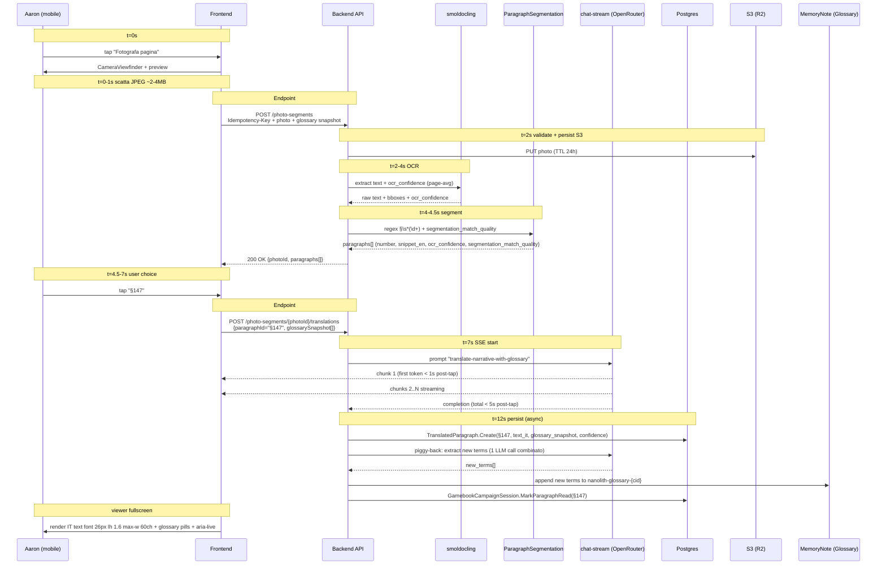

> **Naming convention** (per Doumont review, m1):
> - Le sezioni numeriche (1.1, 2.1, ...) seguono la struttura del documento
> - I **Goal ID** `N1`-`N4` sono identificatori semantici stabili (referenziati in test, plan, issue tracker)
> - Gli **Scenario ID** `N1.1`-`N4.5` referenziano `N{goal}.{scenario}` per traceability cross-document

# Libro Game Nanolith — Demo Dogfooding Design

> **DOCUMENT TYPE**: Spec design per **MVP Iter 1** (1.A + 1.B) di una demo dogfooding. NON è il vision a 12 mesi (vedi [vision-doc 2026-05-04](2026-05-04-libro-game-assistant-vision.md)). NON è il plan d'implementazione (verrà dopo via writing-plans skill).

## Executive Summary

**Caso d'uso**: Aaron (project owner, superadmin di MeepleAI) gioca a **Nanolith** con 3-4 amici sul tavolo di casa. L'app aiuta con (a) tutorial setup dal Press Start indicizzato, (b) Q&A regole in-game dal Rules indicizzato, (c) traduzione paragrafi narrativi dello Storybook fotografando le pagine fisiche, (d) save/resume cross-day per la campagna mista.

**Pain risolto**: lo Storybook è cartaceo solo, in EN. Senza app, Aaron deve leggere ad alta voce traducendo a braccio o consultare il PDF cartaceo. La partita rischia di "morire alla seconda sessione" (pain dichiarato vision §1.2). Il dogfooding di Aaron è il **primo alpha test reale** del vision.

**Differenza dal vision**:
- Vision G1 (acquisizione manuale via foto Rules) ❌ skippato — KB Rules + Press Start già pre-indicizzati
- Vision G4 (traduzione paragrafo da KB indicizzato) ❌ inadeguato — Storybook NON sarà mai indicizzato (privacy + copyright + ephemeralità). Sostituito da **N3** "translate-on-the-fly" via foto pagina single-shot
- Vision §1.5 dichiara "save/resume → MVP-1" ❌ ribaltato — N4 save/resume cross-day è MVP perché dogfooding richiede campagna persistente

**Status MVP demo**: scope-cap rigoroso a **2 settimane di lavoro** (Iter 1.A + Iter 1.B). Encounter Book UX cheatsheet + multi-device + voice/TTS + altre feature deferred a Iter 2 o vision MVP-1/v2.

---

## Indice

- [0. Operational Definitions](#0-operational-definitions)
- [1. Context & Persona](#1-context--persona)
- [2. User Goals SMART](#2-user-goals-smart)
- [3. Scenari Gherkin](#3-scenari-gherkin)
- [4. Architettura & Data Flow](#4-architettura--data-flow)
- [5. Persistence Model](#5-persistence-model)
- [6. Failure Modes & Resilience](#6-failure-modes--resilience)
- [7. Testing Strategy](#7-testing-strategy)
- [8. Pre-condizioni & Seed Dataset](#8-pre-condizioni--seed-dataset)
- [9. Out of Scope](#9-out-of-scope)
- [10. Decisions Log](#10-decisions-log)
- [11. Open Questions Carry-forward](#11-open-questions-carry-forward)
- [12. Riferimenti](#12-riferimenti)
- [13bis. Mockup Inventory (asset visivi Iter 1)](#13bis-mockup-inventory-asset-visivi-iter-1)
- [13. Glossario Terminologia Tecnica](#13-glossario-terminologia-tecnica)

---

## 0. Operational Definitions

> **Spec-panel fix C1 (Wiegers)**: termini soggettivi nelle DoD ("actionable", "consistency", "letti senza esitazione") rendevano le metriche non-ripetibili. Definizione operativa qui consolidata.

### 0.1 *Actionable* (referenziato in N1, N2 DoD)

Una risposta è **actionable** se soddisfa **tutti e tre** i criteri seguenti:

1. **Specificità nominale**: nomina almeno un componente/concetto specifico del gioco (es. "tabellone Avalon", "carta personaggio", "dado nero") — non frasi generiche tipo "metti i pezzi al loro posto"
2. **Indicazioni quantitative o posizionali**: include numeri (es. "5 carte", "3 dadi") oppure indicazioni spaziali concrete (es. "al centro del tavolo", "sopra il tabellone") — non vaghi "intorno", "vicino"
3. **Self-contained**: eseguibile senza consultare PDF/regolamento esterno per quel singolo step

Validation pattern: review manuale post-sessione su Google Sheet `nanolith-dogfood-eval.gsheet`, 1 riga per query, 3 colonne boolean (criterio 1, 2, 3), DoD met se ≥ 4/5 query con tutti e 3 i criteri TRUE.

### 0.2 *Glossary consistency* (referenziato in N4 DoD)

```
consistency_rate = count(translated_paragraphs WHERE term_used == glossary[term].term_it)
                 / count(translated_paragraphs WHERE term_present)
```

dove:
- `term_present` = il paragrafo EN contiene il termine (case-insensitive match) glossary entry
- `term_used` = la traduzione IT contiene il valore `term_it` registrato nel glossario
- N (sample size) ≥ 20 paragrafi che contengono almeno 1 termine glossary

DoD met se `consistency_rate ≥ 0.95` calcolato su sample N ≥ 20.

### 0.3 *Letto senza esitazione* (referenziato in N3 DoD)

Aaron annota durante la sessione su Google Sheet `nanolith-dogfood-eval.gsheet` per ogni paragrafo tradotto letto a voce alta: 1 colonna boolean `read_fluent` con criterio:
- TRUE = lettura completa senza pause > 2 sec, senza correzioni grammatica/sintassi mid-frase, senza ricorso a EN originale
- FALSE = pause prolungate, correzioni manuali, fallback EN

DoD met se ≥ 28/30 paragrafi annotati TRUE.

### 0.4 *Confidence score binning* (referenziato in N1, N2)

Mapping confidence numerico → label visibile UI:
- **alta** (verde): confidence ≥ 0.85
- **media** (amber): 0.70 ≤ confidence < 0.85
- **bassa** (rosso): confidence < 0.70

Confidence < 0.70 → forced disclaimer UI: "non sono certo, controlla pag. X".

### 0.5 *Hallucination rate* (referenziato in N2 DoD)

```
hallucination_rate = count(responses WHERE Aaron_review == "sbagliata" AND confidence >= 0.85)
                   / count(responses WHERE confidence >= 0.85)
```

Sample N ≥ 20 responses post-sessione. DoD met se rate ≤ 3% target, **0% target su confidence > 0.85**.

---

## 1. Context & Persona

### 1.1 Persona dogfooding

> **Aaron (badsworm@gmail.com), superadmin MeepleAI**, project owner. Possiede Nanolith fisico, ha pre-indicizzato Rules + Press Start dal datasource `data/rulebook/nanolith_datasource/` (2 PDF: `Nanolith Rules ENG.pdf` 101MB + `Nanolith Press Start ENG.pdf` 36MB). Ha pre-creato un agente `Nanolith Tutor` linked a entrambi i KB. Vuole giocare 1 campagna mista con 3-4 amici al tavolo, smartphone in mano (single-device GM), connessione WiFi domestica.

> *Job-to-be-done emozionale*: «Voglio giocare Nanolith con i miei amici senza che la sera muoia tra traduzione live, regole consultate sul PDF, e dimenticarci a che paragrafo eravamo alla seconda sessione».

### 1.2 Modello d'uso

Nanolith è una **campagna mista** (vedi brainstorming): lo **Storybook** è narrativa lunga multi-sessione (mesi, branching, paragrafi numerati `§N`); l'**Encounter Book** è on-demand sotto-sessione self-contained. Per Iter 1 entrambi usano lo stesso flusso N3 (foto pagina → OCR → translate); UX cheatsheet card per Encounter è deferred a Iter 2.

### 1.2bis Stakeholder map

> **Spec-panel fix M5 (Cockburn)**: il design originale tratta Aaron come unico attore. In realtà gli amici al tavolo sono il "purpose" reale — Aaron è proxy della loro esperienza.

| Stakeholder | Ruolo | Interesse / "Win condition" | Loss condition |
|---|---|---|---|
| **Aaron (badsworm)** | Primary actor — GM operatore app | Non rovinare la sera, tradurre fluentemente, validare vision | App fallisce silently → ripiego cartaceo, sera "morta" |
| **Marco / Giulia / Luca** (amici al tavolo) | Secondary stakeholders — passive consumer della traduzione | Partita fluida (no attese > 30s), divertimento, immersione narrativa | Aaron costretto a continue interruption per tech-fix → frustrazione tavolo |
| **Aaron-as-developer** | Tertiary stakeholder | Telemetria / feedback per iterare Iter 2+ | Sessione senza dati = no learning, dogfooding sterile |
| **Anthropic / OpenRouter** (LLM providers) | External dependency | Costi prevedibili (≤ €1-3/sessione), no abuse | Cost runaway su bug retry-loop |
| **Nanolith publisher** (stakeholder etico) | External (no contatto diretto) | Foto storybook NON persistite long-term (copyright) | Storage permanente di pagine narrative protette |

**Implicazione design**: Iter 1 success = (a) Aaron completa la sessione, **(b) gli amici NON dicono "perché continui ad armeggiare col telefono?"**, (c) Aaron ha dati per iterare. (b) è il vero termometro qualità — non misurabile in CI ma da raccogliere via post-sessione informal feedback.

### 1.3 Mapping su Bounded Context MeepleAI esistenti (riuso totale)

| Capability | BC riusato | Estensione richiesta |
|---|---|---|
| Q&A setup tutorial + regole in-game (N1, N2) | `KnowledgeBase` (RAG su Press Start + Rules) | filtro `language=it` per output IT |
| Foto pagina Storybook → IT (N3) | `DocumentProcessing` + `KnowledgeBase` chat-stream | nuovo endpoint `POST /api/v1/gamebook/{gameId}/photo-translate` (single-shot OCR + paragraph segmentation + translate) |
| Save state campagna cross-day (N4) | `SessionTracking` + `GameManagement` | nuovo aggregato `GamebookCampaignSession` (paragrafi letti, glossario, scelte narrative, party) |
| Glossario per-campagna (N4) | `AgentMemory` | riuso diretto `MemoryNote` con tag `nanolith-glossary-{campaign_id}` |

**Nessun nuovo Bounded Context**.

### 1.4 Asset di codice riusabili

| Asset | Stato | Riuso |
|---|---|---|
| `useTranslateParagraph` hook | In worktree commit `aa72b1b70` (cherry-pickable) | Backbone single-shot translate flow |
| Mockup SP6-D translation-viewer fullscreen | Untracked HTML/JSX | Spec UI per Storybook reading viewer |
| Mockup SP6-C play-session | Untracked HTML/JSX | Spec UI per shell route `/play` |
| Componenti `v2/gamebook/*` (16 file) | Su `main-dev` | CameraViewfinder, PageThumb, ConfidenceBadge, OfflineBanner, CancelModal, ecc. |
| `chat-stream` LLM pipeline | Production | Backbone traduzione (no nuovo endpoint LLM) |
| `KnowledgeBase` BC + RAG | Production | Q&A regolamento Nanolith (riuso 100%) |
| `AgentDefinition` + `AgentMemory` BC | Production | Glossario per-campagna |
| `SessionTracking` BC | Production | Save state cross-day |

L'unico asset critico mancante è il backend pipeline single-shot photo → OCR → paragraph segmentation. Il resto è già pronto.

### 1.5 Vincolo FREEZE v2 attivo (issue #807, #808)

**MEMORY**: SP6 v2 expansion FREEZE 2026-05-06 vieta nuovi v2 component con pattern `hsl(*, 89%, 48%)` + `hsla(*, 89%, *, 0.10)` fino a token redesign #807 Fase 2.

**Decisione**: il viewer Storybook di N3 è una **page composition** (`apps/web/src/app/(authenticated)/library/games/[gameId]/play/paragraph/[num]/page.tsx`) che usa **solo primitive v2 esistenti** (`auth-card`, `btn`, `drawer`, `CameraViewfinder`, `PageThumb`, `ConfidenceBadge`, `OfflineBanner`). I mockup SP6-D + SP6-C usano solo token CSS semantic vars (`var(--c-agent)`, `var(--c-game)`, `var(--c-kb)`, `var(--c-warning)`), zero pattern HSL freeze-violating, quindi sono spec UI valida.

---

## 2. User Goals SMART

Quattro user goal numerati N1-N4, mappati a Iter 1.A/1.B per scope-cap.

### 2.0 Goal level hierarchy (Cockburn)

> **Spec-panel fix M6 (Cockburn)**: i 4 goal originali mescolavano livelli (subfunction/user/summary). Riorganizzati gerarchicamente.

```
SUMMARY GOAL (months / multi-session)
└── G_summary: "Aaron porta a termine 1 campagna Nanolith con gli amici via app companion"
    │
    USER GOAL (single sitting, 4h sessione tipo)
    ├── G_user_session: "Aaron gestisce 1 sessione gioco di 4h"
    │
    SUBFUNCTION GOALS (atomic actions durante sessione)
    ├── N1 — Q&A setup (pre-sessione, durata 30 min)
    ├── N2 — Q&A regole (during-session, on-demand 15-25 volte)
    ├── N3 — Translate paragraph (during-session, on-demand 30 volte)
    └── N4 — Resume cross-day (between-session, durata 30 sec)
```

**Mappa Iter implementation**:
- **Sprint 0 (validazione pre-condizioni)**: N1 baseline check (riuso 100% codice esistente, "sanity test" del setup)
- **Iter 1.A (settimana 1)**: N2 + N3 core
- **Iter 1.B (settimana 2)**: N4 cross-day persistence + glossary

### 🎯 N1 — Q&A setup & tutorial Nanolith (Press Start KB)

> Aaron, prima di iniziare la prima sessione, chiede al chat "come si setupa Nanolith per 4 giocatori?" e riceve guida actionable in IT con citazione pagina.

| SMART | Valore |
|---|---|
| **S — Specific** | Q&A in linguaggio naturale (testo, IT) sul Press Start KB, risposta che enumera step di setup con citazione pagina sorgente del Press Start indicizzato |
| **M — Measurable** | (a) ≥ 80% delle risposte di setup giudicate "actionable senza ricorrere al PDF" da Aaron su 5 query test; (b) citation accuracy ≥ 90% verificata manualmente; (c) confidence score visibile (alta/media/bassa); (d) per confidence bassa: messaggio esplicito "non sono sicuro, controlla pag. X" |
| **A — Achievable** | **Zero codice nuovo**: riuso totale `useAgentChatStream` + `KnowledgeBase` RAG + agente Nanolith preesistente |
| **R — Relevant** | Setup è il momento più frustrante del primo gioco; senza app, Aaron deve leggere ad alta voce IT-tradotto il quickstart EN agli amici |
| **T — Time-bound** | (a) P50 < 4 sec, P95 < 8 sec (rilassato vs in-game perché setup è asincrono); (b) Aaron usa il chat 5-10 volte durante setup; (c) **scope effort: 0 giorni** (riuso al 100%) |

**Definition of Done**: Aaron apre `/library/games/nanolith/play` 30 minuti prima dell'arrivo amici. Pone 5 domande tipiche ("setup 4 giocatori", "componenti necessari", "come si decide chi inizia", "fase 1 prima azione", "regola dei dadi neri"). Riceve 5 risposte IT con citazione Press Start, ≥ 4/5 actionable senza fallback PDF.

**Iter mapping**: **Sprint 0 — Pre-condition Validation** (smoke test baseline, riuso 100%, durata < 1 giorno). Se N1 fallisce → blocker per Iter 1.A (significa che KB indexing o agent setup non funzionano, da risolvere prima di scrivere nuovo codice).

### 🎯 N2 — Q&A regole in-game durante partita (Rules KB)

> Durante la sessione, Marco chiede "il mago tira d6 o d8 per il fuoco?". Aaron digita la domanda nel chat panel laterale, ottiene risposta IT in <5 sec con citazione Rules pag. 47.

| SMART | Valore |
|---|---|
| **S — Specific** | Q&A in linguaggio naturale (testo, IT) sul Rules KB durante una sessione attiva, risposta single-statement (1-3 frasi) leggibile a voce alta in <10 sec, citazione pagina + preview cliccabile |
| **M — Measurable** | (a) **P95 latenza < 5 sec** (matching vision §4 G3 target); (b) ≥ 17/20 risposte giudicate "utili" su sessione 4h; (c) hallucination rate target 0% su confidence > 0.85 (manualmente verificato post-sessione); (d) confidence < 0.7 → messaggio "non sono sicuro" + suggerimento alternativo |
| **A — Achievable** | **Zero codice nuovo**: stesso meccanismo di N1, KB diverso |
| **R — Relevant** | Pain point #1 vision: senza app, ogni domanda ferma il flow per 2-5 minuti |
| **T — Time-bound** | (a) P50 < 3 sec, P95 < 5 sec; (b) Aaron pone 15-25 domande in 4h; (c) **scope effort: 0 giorni** (riuso al 100%) |

**Definition of Done**: Su 1 sessione 4h, Aaron pone 20 domande regole sparse, ≥ 17 risposte "utili" (annotate inline "OK / sbagliata / non lo so"), ≥ 18 in <5 sec. Le 2-3 "non lo so" hanno suggerimento azionable.

**Iter mapping**: Iter 1.A.

### 🎯 N3 — Tradurre paragrafo Storybook via foto pagina

> Aaron raggiunge §147 nel libro narrativo. Apre la fotocamera, scatta una foto della pagina aperta, vede una lista "§146, §147, §148" segmentata, sceglie §147, l'app traduce in IT e mostra il testo a font 26px sul viewer fullscreen. Aaron legge ad alta voce.

| SMART | Valore |
|---|---|
| **S — Specific** | Pipeline single-shot: 1 foto pagina A4 storybook → backend OCR + paragraph segmentation (riconosce numerazione § e separa paragrafi) → utente seleziona quale § tradurre → LLM single-pass translate IT preservando tono narrativo → display fullscreen viewer (mockup SP6-D) |
| **M — Measurable** | (a) **paragraph segmentation accuracy ≥ 90%** su 20 foto storybook test; (b) **OCR confidence ≥ 0.7** su pagine fotografate in luce salotto normale; (c) **translation latency P95 < 8 sec** end-to-end (foto → primo testo IT visibile streaming); (d) testo IT renderizzato a font 26px line-height 1.6 max-width 60ch (mockup SP6-D spec, WCAG-compliant a 1.5m); (e) ≥ 28/30 paragrafi tradotti giudicati "letti senza esitazione" |
| **A — Achievable** | (a) Backend nuovo endpoint `POST /api/v1/gamebook/{gameId}/photo-translate` (riuso smoldocling per OCR + nuovo `ParagraphSegmentationService`); (b) Frontend cherry-pick `useTranslateParagraph` da `aa72b1b70` adattato single-shot; (c) UI page composition con primitive v2 esistenti (FREEZE-compliant); (d) WiFi instabile → retry exponential backoff 31s totali |
| **R — Relevant** | Pain assoluto della demo: senza N3, niente partita. Storybook è solo EN, Aaron non può leggere ad alta voce a braccio per 30 paragrafi/sessione |
| **T — Time-bound** | (a) Foto-to-text-visible: P95 < 8 sec end-to-end; (b) costo LLM: ≤ 3¢/paragrafo medio target (200-400 parole) — superadmin bypass quota; (c) **scope effort: ~5-7 giorni** Iter 1.A |

**Definition of Done**: Aaron fotografa 30 pagine storybook durante sessione 4h. ≥ 28/30 traduzioni: OCR riconosce paragrafo target, traduzione IT leggibile a voce alta senza esitazione, latency < 8 sec. ≤ 2 fallback (rifoto / numero § manuale).

**Iter mapping**: **Iter 1.A core** (cuore della demo).

### 🎯 N4 — Resume campagna cross-day con glossario

> Aaron chiude l'app a metà sessione (paragrafo §289, glossario 12 termini, party 4 personaggi). Una settimana dopo riapre `/library/games/nanolith/play`, vede "Riprendi sessione: ultimo §289 — 12 termini glossario". Tappa, ritrova esattamente lo stato. La traduzione successiva di §290 usa coerentemente i termini del glossario.

| SMART | Valore |
|---|---|
| **S — Specific** | Aggregato persistente `GamebookCampaignSession` (campaign_id, party, last_paragraph_id, scoring, scelte narrative, traduzioni cached, glossario per-game) salvato in DB Postgres. Glossario auto-arricchito da ogni traduzione (LLM piggy-back call estrazione term-level). Resume UI: card "Riprendi" su `/library/games/nanolith/play` se sessione attiva |
| **M — Measurable** | (a) **save state survives**: chiusura app + ripristino dopo 7 giorni → 100% paragrafi precedentemente tradotti restano consultabili senza ri-tradurre (cache hit); (b) **glossary consistency**: termine "Voidstone" tradotto come "Pietra del Vuoto" alla prima occorrenza → tutte le traduzioni successive usano stessa traduzione (≥ 95% consistency su 20 termini test); (c) **resume latency**: tap "Riprendi" → UI restored < 2 sec; (d) **transaction-safe**: nessun data loss su crash mid-write |
| **A — Achievable** | (a) Estensione `SessionTracking` BC con aggregato `GamebookCampaignSession` (factory + 1 EF migration); (b) Riuso `AgentMemory.MemoryNote` per glossario; (c) Frontend hook `useCampaignSession(campaignId)` query + mutation; (d) Glossary extraction: piggy-back LLM call su translate (1 prompt template combinato) |
| **R — Relevant** | Senza N4, alla seconda sessione Aaron ritrova solo PDF cartacei → **partita muore alla seconda sessione**. N4 risolve esattamente il pain |
| **T — Time-bound** | (a) Save automatico ogni 30 sec o ad ogni tap "prossimo §" / "rifotografa"; (b) Resume garantito ≥ 90 giorni (DB persistence); (c) **scope effort: ~5-7 giorni** Iter 1.B |

**Definition of Done**: Sessione 1 (4h, 30 paragrafi tradotti, 12 termini glossario). Chiude. Una settimana dopo riapre, tappa "Riprendi", ritrova: ultimo paragrafo §289, glossario 12 termini, party 4 personaggi. Traduce §290: "Voidstone" → "Pietra del Vuoto" coerente con sessione 1.

**Iter mapping**: **Iter 1.B** (seconda settimana).

### 📊 Goal coverage matrix

| Goal | Iter | Effort stima | Riuso | Codice nuovo |
|---|---|---|---|---|
| N1 — Q&A setup Press Start | Pre-1.A | 0 giorni | 100% | nessuno |
| N2 — Q&A regole Rules in-game | 1.A | 0 giorni | 100% | nessuno |
| N3 — Translate Storybook foto | 1.A | 5-7 giorni | 70% | endpoint photo-translate + paragraph-segmentation + viewer wired |
| N4 — Resume + glossario | 1.B | 5-7 giorni | 60% | aggregato `GamebookCampaignSession` + EF migration + glossary extraction prompt |

**Totale Iter 1**: ~10-14 giorni di lavoro effettivo distribuiti su 2 settimane calendario.

---

## 3. Scenari Gherkin

Convenzione tag: `@happy` happy path, `@edge` casi limite plausibili, `@error` failure mode, `@dogfood` setup reale Aaron (vincolato all'account `badsworm@gmail.com` e Nanolith fisico).

### N1 — Q&A setup tutorial Press Start

#### N1.1 — Setup partita per 4 giocatori @happy @dogfood
```gherkin
Given Aaron è loggato come superadmin badsworm@gmail.com
And il gioco "Nanolith" è in collection di Aaron
And il KB "Nanolith Press Start ENG.pdf" è indicizzato con confidence ≥ 0.85
And l'agente "Nanolith Tutor" è creato e linkato al Press Start KB
When Aaron apre `/library/games/nanolith/play` 30 minuti prima dell'arrivo amici
And tappa l'icona chat panel laterale
And digita "come si setupa Nanolith per 4 giocatori?"
Then in P95 < 8 sec riceve una risposta IT che enumera ≥ 5 step actionable
And ogni step cita una pagina specifica del Press Start ("pag. 4", "pag. 7", ...)
And almeno 4 step su 5 sono giudicati "actionable senza fallback PDF" da Aaron
And la response include un confidence score visibile (alta/media/bassa)
```

#### N1.2 — Domanda fuori contesto Press Start @edge
```gherkin
Given Aaron è in chat con l'agente Nanolith Tutor
When digita "qual è il setup ottimale di Tainted Grail?"
Then l'agente risponde "Non ho informazioni su Tainted Grail nel mio KB. Vuoi cambiare gioco?"
And NON inventa una risposta (hallucination = 0 in questo caso edge)
And confidence score = "bassa" o messaggio "non sono sicuro"
```

#### N1.3 — Confidence bassa su Press Start @edge
```gherkin
Given Aaron chiede una regola edge-case ("setup variante 5 giocatori")
And il Press Start non copre quella variante (confidence retrieval < 0.7)
When la response viene generata
Then l'agente risponde "Non sono sicuro — il quickstart copre 2-4 giocatori. Per 5+ controlla il regolamento completo (Rules KB)."
And suggerisce esplicitamente di passare al Rules KB
And NON inventa step setup per 5 giocatori
```

### N2 — Q&A regole in-game

#### N2.1 — Domanda regola durante combat @happy @dogfood
```gherkin
Given Aaron sta giocando una sessione attiva di Nanolith con 3 amici
And ha il chat panel laterale aperto sull'agente Nanolith Tutor con KB Rules
When Marco al tavolo chiede "il mago tira d6 o d8 per il fuoco?"
And Aaron digita "quanti dadi tira il mago per il fuoco?"
Then in P95 < 5 sec riceve una risposta IT single-statement ≤ 3 frasi
And la risposta cita una pagina specifica delle Rules ("pag. 47, sezione Magia")
And la risposta è leggibile a voce alta in < 10 sec
And il confidence score è ≥ 0.85
```

#### N2.2 — Domanda ambigua o multi-interpretazione @edge
```gherkin
Given Aaron è in chat
When digita "che succede se tira 3?"
Then l'agente risponde con 1-2 chiarimenti possibili invece di guessare
And include "Vuoi sapere: (a) tiro attacco, (b) tiro difesa, (c) tiro magia?"
And NON inventa una regola fittizia
```

#### N2.3 — Hallucination guard su confidence borderline @error
```gherkin
Given una domanda con retrieval confidence 0.65 (sotto target 0.85, sopra threshold 0.5)
When la risposta viene generata
Then la UI mostra il confidence badge "media" (warning amber)
And la risposta include esplicitamente "non sono certo, controlla pag. X"
And se Aaron post-sessione marca questa risposta "sbagliata", entra in metric tracking
And hallucination rate target ≤ 3% verificato post-sessione su 20 domande sample
```

#### N2.4 — Latenza superiore a P95 budget @error
```gherkin
Given una domanda viene posta
And il backend supera il P95 budget (5 sec)
When passano 8 sec senza risposta visibile
Then la UI mostra un loader esplicito "sto cercando..."
And se passano 15 sec totali, il sistema mostra timeout + retry CTA
And NON lascia Aaron in attesa silenziosa
```

### N3 — Translate Storybook via foto pagina

#### N3.1a — Foto pagina A4: segmentazione 3 paragrafi @happy @dogfood
```gherkin
Given Aaron è in `/library/games/nanolith/play/paragraph/§147`
And il Storybook fisico è aperto alla pagina contenente §146, §147, §148
And la luce salotto è normale (non bassa)
When Aaron tappa il bottone "Fotografa pagina" (CameraViewfinder primitive)
And scatta 1 foto della pagina A4 con il telefono
And la foto è uploaded a `POST /api/v1/gamebook/{gameId}/photo-segments`
Then in ≤ 4.5 sec backend restituisce 3 paragrafi separabili (segmentation accuracy ≥ 90%)
And la UI mostra una lista "Paragrafi trovati: §146, §147, §148" con preview snippet EN first 50 chars
And ogni paragrafo include `ocr_confidence` per-page-avg (smoldocling) + `segmentation_match_quality` ('exact' | 'partial' | 'fallback')
```

#### N3.1b — Translate selected paragraph: latency budget @happy
```gherkin
Given Aaron ha completato N3.1a e vede 3 paragrafi
When Aaron tappa "§147"
And il frontend invia `POST /api/v1/gamebook/{gameId}/photo-segments/{photoId}/translations` con paragraphId="§147"
Then in ≤ 1 sec post-tap il primo token della traduzione IT è visibile nel viewer fullscreen (streaming SSE)
And in ≤ 5 sec post-tap la traduzione IT completa è visibile (completion)
And cumulato dallo scatto (N3.1a inizio) al primo token: P95 < 8 sec
```

#### N3.1c — Translate viewer rendering: read-aloud @happy @dogfood
```gherkin
Given Aaron ha completato N3.1b e vede la traduzione IT renderizzata
When il testo è visibile nel viewer fullscreen
Then è renderizzato a font 26px, line-height 1.6, max-width 60ch (mockup SP6-D spec)
And ha aria-live="polite" per accessibility
And i termini glossario sono pill cliccabili inline (es. "Voidstone")
And Aaron legge ad alta voce e annota "read_fluent=TRUE" (vedi §0.3) sul tracking sheet post-paragrafo
```

#### N3.2 — Foto sfocata o luce bassa @edge
```gherkin
Given Aaron fotografa una pagina con luce ambient bassa
When backend OCR riporta confidence < 0.5 sulla pagina
Then la UI mostra un banner amber "Foto poco leggibile — confidence 35%"
And mostra azioni: [📸 Rifotografa, 🔢 Inserisci numero § manualmente, ⏭️ Procedi comunque]
And se Aaron tappa "Procedi comunque" la traduzione viene tentata ma con disclaimer
And NON viene salvata cached con confidence < 0.5 (no cache pollution)
```

#### N3.3 — Backend non riesce a segmentare paragrafi @edge
```gherkin
Given Aaron fotografa una pagina densa (testo continuo senza § visibili)
When backend OCR riconosce solo 1 blocco testo, no segmentation
Then la UI mostra "Non vedo paragrafi numerati. Inserisci il numero §:"
And Aaron digita manualmente "§147"
And il sistema traduce l'intera pagina come fosse il paragrafo §147
And la sessione continua normalmente
```

#### N3.4 — Connessione WiFi instabile durante upload @error
```gherkin
Given Aaron scatta una foto con WiFi che cala intermittente
When l'upload fallisce al primo tentativo
Then il sistema retry con exponential backoff [1s, 2s, 4s, 8s, 16s] = 31s totali
And durante i retry mostra cancel button visibile
And se tutti i retry falliscono, errore esplicito "Upload fallito — verifica connessione"
And la foto resta in coda offline (IndexedDB) per re-upload manuale
```

#### N3.5 — Glossario incoerente al primo paragrafo @edge
```gherkin
Given è il primo paragrafo tradotto della campagna (glossario vuoto)
When LLM traduce §147 e estrae "Voidstone" come termine glossario
Then la UI mostra inline una pill cliccabile "Voidstone → Pietra del Vuoto" sopra il testo
And Aaron può tappare per modificare la traduzione del termine se non gli piace
And la modifica viene persistita in `AgentMemory.MemoryNote[tag=nanolith-glossary-{campaign_id}]`
And tutte le traduzioni successive useranno la traduzione approvata da Aaron
```

#### N3.6 — Costo LLM oltre soglia mensile @edge
```gherkin
Given Aaron è in superadmin mode con bypass quota
When traduce 100 paragrafi in una sessione (≥ €3 di costo)
Then la UI mostra un cost indicator discreto in bottom-right ("€2.40 questa sessione")
And NON blocca l'azione (superadmin bypass)
And invia evento telemetry a backend per tracking dogfooding cost real-world
```

#### N3.7 — Foto di pagina con script non-Latin @error
```gherkin
Given Aaron per errore fotografa una pagina di un manuale giapponese
When backend OCR rileva script CJK
Then risponde "Script non supportato (giapponese) — al momento supportiamo Latin script"
And mostra azione [⏪ Riprova con altra pagina]
And NON tenta traduzione random
```

#### N3.8 — Segmentation accuracy sotto threshold (rolling) @error
> **Spec-panel fix M4 (Adzic)**: behavior quando metric SMART viene violato.

```gherkin
Given i ultimi 10 photo-segments hanno segmentation accuracy media < 0.90 (sotto target SMART)
When viene completato un nuovo photo-segment
Then backend emette metric `segmentation_accuracy_below_threshold_total` (Prometheus)
And alert PagerDuty/log warning a livello WARN
And la UI mostra (visibile solo a Aaron come superadmin) un banner "⚠️ Qualità segmentation degradata (87% media ultimi 10)"
And la sessione continua normalmente (non blocca utente)
And la metrica entra in dashboard dogfooding-feedback per review post-sessione
```

#### N3.9 — Privacy: EXIF location stripping su upload @happy
> **Spec-panel fix m7 (Crispin)**: privacy/EXIF è failure mode #14 ma mancava test coverage.

```gherkin
Given Aaron scatta una foto al tavolo di casa
And il device incorpora GPS coordinates nei EXIF metadata
When la foto viene uploaded a `POST /api/v1/gamebook/{gameId}/photo-segments`
Then prima dell'invio (client-side), i campi EXIF GPS (`GPSLatitude`, `GPSLongitude`, `GPSTimestamp`) sono rimossi
And il payload server NON contiene location data
And NESSUN face detection viene persistito (anche se il foto contiene volti accidentali nello sfondo)
And la foto è cifrata in transit (HTTPS)
And la foto è conservata su R2 per max 24h con purge automatica
```

#### N3.10 — Sessione 4h end-to-end happy combinato @e2e-day @dogfood
> **Spec-panel fix M3 (Adzic)**: scenario orchestration di "una serata tipo" che combina N1-N4 sequence.

```gherkin
Given Aaron ha completato Sprint 0 (N1 setup tutorial OK)
And gli amici sono al tavolo, sessione iniziata alle 21:00
When durante 4 ore Aaron:
  | Azione                               | Conteggio | User goal |
  | Q&A regola via chat panel laterale   | 20 query  | N2        |
  | Foto storybook + traduzione paragrafo| 30 paragrafi | N3      |
  | Edit glossary pill inline            | 2 termini | N3.5      |
  | Save state automatico ogni 30s       | ~480 saves| N4 (auto) |
Then alle 01:00 (4h dopo) Aaron chiude l'app
And la `GamebookCampaignSession` è persistita con: ultimo §, glossary aggiornato, party intatto
And costo LLM totale ≤ €1.50 (target dogfooding)
And Aaron annota su `nanolith-dogfood-eval.gsheet`:
  | DoD criteria               | Target | Achieved |
  | N2: ≥17/20 risposte utili  | 85%    | TBD      |
  | N3: ≥28/30 fluent reads    | 93%    | TBD      |
  | N3 P95 latency < 8s        | 100%   | TBD      |
  | N4 auto-save survive       | 100%   | TBD      |
And gli amici NON dicono "perché continui ad armeggiare col telefono?" (qualitativo, §1.2bis)
```

### N4 — Resume cross-day + glossario

#### N4.1 — Resume sessione N giorni dopo @happy @dogfood
> **Spec-panel fix M1 (Adzic)**: date hardcoded sostituite con relative time per riproducibilità in CI.

```gherkin
Given Aaron ha giocato sessione 1 in data X (30 paragrafi, 12 termini glossario, party 4 personaggi)
And ha chiuso l'app a paragrafo §289
And la `GamebookCampaignSession` è persistita in DB
When Aaron riapre `/library/games/nanolith/play` Y giorni dopo (Y in [1, 90])
Then la UI mostra una card "Riprendi sessione: ultimo §289 letto Y giorni fa · 12 termini glossario"
And tappa la card
And in < 2 sec la sessione è ripristinata: ultimo §, glossario, party
And il viewer è posizionato pronto a ricevere il prossimo paragrafo §290
```

E2E test parametrizzato: `for Y in [1, 7, 30, 90] run resume_test(Y)`.

#### N4.2 — Coerenza glossario nella sessione 2 @happy @dogfood
```gherkin
Given Aaron ha glossario sessione 1: { Voidstone: "Pietra del Vuoto", Reaver: "Razziatore", ... }
When Aaron traduce §290 in sessione 2 (foto pagina contenente "Voidstone")
Then il LLM riceve glossario inline nel prompt template
And la traduzione di §290 usa "Pietra del Vuoto" coerente con sessione 1 (≥ 95% term consistency)
And il glossario non viene "reset" o "ri-imparato"
```

#### N4.3 — Crash mid-write durante save state @error
```gherkin
Given Aaron sta traducendo §200 e il backend è a metà del save transaction
When il browser crasha (refresh accidentale) o la rete cade
Then la transaction `GamebookCampaignSession.UpdateLastParagraph` è atomica (rollback su crash)
And al resume, l'ultimo paragrafo persistito è §199 (ultimo committed)
And la traduzione cached di §200 è in IndexedDB locale (non persa)
And Aaron al resume può "ricommit" §200 senza ri-tradurre
```

#### N4.4 — Multipli campagne attive sullo stesso gioco @edge
```gherkin
Given Aaron ha 2 campagne Nanolith parallele (gruppo A con amici-of-friends, gruppo B con la fidanzata)
When apre `/library/games/nanolith/play`
Then la UI mostra una lista "Campagne attive" con 2 card
And ogni card ha glossario, party, ultimo § distinti
And Aaron sceglie quale riprendere
And il save state non si "contamina" tra campagne (campaign_id diverso)
```

#### N4.5 — Resume dopo > 90 giorni @edge
```gherkin
Given Aaron non gioca per 100 giorni
And la `GamebookCampaignSession` è ancora persistita (no auto-purge)
When riapre l'app
Then la card "Riprendi" mostra warning "Ultima sessione 100 giorni fa — vuoi riprendere o ricominciare?"
And se sceglie "ricomincia", la sessione vecchia viene archiviata (soft-delete) NON cancellata hard
And se sceglie "riprendi", il glossario è ancora consistente
```

---

## 4. Architettura & Data Flow

### 4.1 Topology runtime

```
[Aaron phone, Chrome]
   └── /library/games/nanolith/play  (Iter 1)
        ├── ContextBar: campagna corrente, ultimo § letto
        ├── CameraButton → POST /photo-translate
        │                  ├── OCR backend (smoldocling-service)
        │                  ├── Paragraph segmentation (NEW)
        │                  ├── LLM translate IT (chat-stream existing)
        │                  └── Cache 24h locale + DB persistente
        ├── TranslationViewer fullscreen (mockup SP6-D)
        │   ├── Render paragrafo IT, font 26px, lh 1.6, max-width 60ch
        │   ├── Tap "prossimo §" / "rifotografa"
        │   └── Glossario inline (terms già tradotti coerenti)
        └── ChatPanel laterale → useAgentChatStream existing
            └── Q&A Rules KB con citazione pagina
```

### 4.2 Data flow N3 happy path (sequence diagram + frame timing)

> **Spec-panel fix m3 (Doumont)**: ASCII art frame-by-frame sostituito da Mermaid sequence diagram per leggibilità cross-device.



**P95 latency budget recap**:

| Phase | Target | Frame |
|---|---|---|
| Photo upload + OCR + segmentation | ≤ 4.5s | photo → list visible |
| User choice (NOT in CI budget, user-controlled) | ~2-3s | tap "§147" |
| Translate streaming first token (post-tap) | ≤ 1s | first chunk visible |
| Translate streaming completion (post-tap) | ≤ 5s | full text visible |
| **Wall clock first token (cumulato dallo scatto)** | **P95 < 8s** | end-to-end target |

> **Spec-panel fix M8 (Fowler)**: confidence disambiguation. Due metriche distinte:
> - `ocr_confidence` (decimal 0-1, **page-level avg** restituito da smoldocling)
> - `segmentation_match_quality` (enum: `exact` = regex match perfetto §N, `partial` = match con OCR noise tolerato, `fallback` = no match, intera pagina come 1 paragrafo)

### 4.3 Componenti coinvolti

**Frontend (page composition)**:
- Route NEW: `/library/games/[gameId]/play/paragraph/[num]/page.tsx` — server component sottile + client island viewer
- Hook NEW: `useTranslateParagraph(campaignId)` — cherry-pick da `aa72b1b70`, adatta single-shot
- Hook NEW: `useCampaignSession(campaignId)` — `useQuery` + `useMutation` save state
- Composizione primitive v2 esistenti: `CameraViewfinder`, `PageThumb`, `ConfidenceBadge`, `OfflineBanner`, `auth-card`, `btn`, `drawer` (Q&A panel)
- **Zero nuovi component v2 con HSL pattern** (FREEZE-compliant)

**Backend (.NET 9, MediatR)** — endpoint REST resource-oriented:

> **Spec-panel fix C3 (Fowler) + m6 (Fowler)**: rename per coerenza REST + service interface astratta non rivela implementazione.

- Endpoint NEW 1: `POST /api/v1/gamebook/{gameId}/photo-segments` → `IngestPhotoCommand` → **`IPhotoSegmentationHandler`** (returns `{photoId, paragraphs[]}`)
- Endpoint NEW 2: `POST /api/v1/gamebook/{gameId}/photo-segments/{photoId}/translations` → `TranslateParagraphCommand` → `IParagraphTranslationHandler` (returns SSE stream + persisted `TranslatedParagraph`)
- Service NEW: `IParagraphSegmentationService` (Domain interface, Application impl con regex + fallback). Output enum `SegmentationMatchQuality`
- Service riusato: `ISmoldoclingClient` (DocumentProcessing BC)
- Aggregati NEW (in `SessionTracking` BC, vedi M7 fix §5.1):
  - `GamebookCampaignSession` (root aggregate)
  - `TranslatedParagraph` (separate aggregate, 1-N relationship con session)
- EF migration: nuove tabelle `gamebook_campaign_sessions` + `gamebook_translated_paragraphs` + `gamebook_photo_artifacts`
- Riuso `AgentMemory.MemoryNote` con tag `nanolith-glossary-{campaign_id}`

> **Spec-panel fix C3 (Fowler) cross-BC**: `gamebook_photo_artifacts.campaign_session_id` FK punta a tabella in BC diverso (`SessionTracking`). Soluzione adottata: **sposta `gamebook_photo_artifacts` in `SessionTracking` BC** (è transitorio per session, conceptual fit). Foto fisica resta su R2, solo metadata ref. Documentato in [ADR-053](../../architecture/adr/adr-053-shared-game-detail-cross-bc-read-model.md) come precedente.

**Glossary feedback loop** (con M11 race condition fix):
- Round-trip: ogni translate → glossary extraction prompt piggy-back (1 LLM call combinato)
- **Glossary snapshot at translate-start** (no hot-reload mid-stream): translate request include `glossarySnapshot[]` come immutabile reference per quella translation
- Persistenza: `MemoryNote` per-campaign tagged, write at translate-completion
- Inline editing: tap pill → edit modal → PUT to MemoryNote (optimistic + rollback). Translations già completed restano con vecchio value finché Aaron non re-fotografa quella pagina

### 4.4 API versioning policy

> **Spec-panel fix m4 (Newman)**: policy esplicita per evolvere v1 → v2.

- Tutti gli endpoint sotto `/api/v1/` per Iter 1
- Breaking change rules:
  - Aggiunta field response = non breaking (consumers ignorano unknown fields)
  - Rimozione field / rename = breaking → bump v2 obbligatorio
  - Cambio request shape = breaking → bump v2
- Strategia: deprecazione 90 giorni v1 prima di sunset, response header `Deprecation: true; sunset="2026-12-01"` durante deprecazione
- Reference futura: OpenAPI spec auto-generata via Scalar (CLAUDE.md), reachable a `/scalar/v1` (vedi [§12 Riferimenti](#12-riferimenti))

---

## 5. Persistence Model

### 5.1 Schema DB nuovo (1 EF migration, 3 tabelle)

> **Spec-panel fix M7 (Fowler)**: `translated_paragraphs_jsonb` cresce illimitatamente nell'aggregate root. Estratto come **`TranslatedParagraph` aggregate separato** (1-N relationship). Vantaggi: performance (no full-aggregate load per ogni paragrafo), concurrency granulare (paragraph-level lock), soft-delete granulare.
>
> **Spec-panel fix C3 (Fowler)**: `gamebook_photo_artifacts` spostato in `SessionTracking` BC (era cross-BC). Conceptual fit: photo è transitoria per-session.

**Tabella `gamebook_campaign_sessions`** — `SessionTracking` BC, root aggregate:

| Campo | Tipo | Note |
|---|---|---|
| `id` | uuid PK | aggregato root |
| `user_id` | uuid FK auth_users | owner |
| `shared_game_id` | uuid FK shared_games | gioco |
| `title` | varchar(120) | "Campagna 1", default auto |
| `party_json` | jsonb | `{members:[{name,class,hp,...}]}` free-form per-gioco |
| `last_paragraph_id` | varchar(20) | es. `"§289"` |
| `scoring_json` | jsonb | free-form per-gioco |
| `created_at, updated_at, deleted_at` | timestamptz | audit + soft delete |
| `created_by, updated_by` | uuid | audit |
| `row_version` | bytea (timestamp) | optimistic concurrency |

Indici: `(user_id, deleted_at)`, `(shared_game_id, deleted_at)`.

**Tabella `gamebook_translated_paragraphs`** — `SessionTracking` BC, aggregate separato (1-N con session):

| Campo | Tipo | Note |
|---|---|---|
| `id` | uuid PK | aggregato |
| `campaign_session_id` | uuid FK gamebook_campaign_sessions | parent |
| `paragraph_id` | varchar(20) | es. `"§147"` (UNIQUE per `(campaign_session_id, paragraph_id)`) |
| `text_it` | text | traduzione completa |
| `glossary_snapshot_jsonb` | jsonb | snapshot glossary a translate-start (per audit, M11 fix) |
| `ocr_confidence` | decimal(3,2) | page-avg da smoldocling |
| `segmentation_match_quality` | varchar(10) | enum: `exact` \| `partial` \| `fallback` |
| `llm_provider` | varchar(50) | es. `openrouter:anthropic-haiku-3` (audit fallback chain) |
| `llm_cost_eur` | decimal(6,4) | costo stimato per dogfooding tracking |
| `translated_at` | timestamptz | |
| `created_at, updated_at, deleted_at` | timestamptz | audit + soft delete |
| `row_version` | bytea | optimistic concurrency paragraph-level |

Indici: `(campaign_session_id, deleted_at)`, `(campaign_session_id, paragraph_id)` UNIQUE WHERE `deleted_at IS NULL`.

**Tabella `gamebook_photo_artifacts`** — `SessionTracking` BC (spostata da `DocumentProcessing` per fix C3), transitoria:

| Campo | Tipo | Note |
|---|---|---|
| `id` | uuid PK | photoId |
| `campaign_session_id` | uuid FK | parent (in stesso BC, no cross-BC) |
| `s3_key` | varchar | R2 storage key |
| `ocr_confidence_avg` | decimal(3,2) | da smoldocling |
| `detected_paragraphs_jsonb` | jsonb | output segmentation (cache per re-translate altri §) |
| `created_at` | timestamptz | |
| `expires_at` | timestamptz | now() + 24h, background job purge (vedi §6.4 M9) |

**Riuso esistente**: `MemoryNote` in `AgentMemory` BC con tag `nanolith-glossary-{campaign_id}`, content JSON `{term_en, term_it, first_seen_paragraph, user_edited: bool}`.

### 5.2 Cache layer multi-livello

```
Lvl 1: IndexedDB browser locale (offline-first re-read)
   - chiave: campaign_id:paragraph_id
   - valore: text_it cached + glossary snapshot
   - TTL: 24h
   - hit rate target: ≥ 80% per re-read sessione corrente
Lvl 2: Server-side translated_paragraphs_jsonb (DB)
   - persistenza cross-device + cross-day
   - hit rate target: 100% per paragrafi già tradotti, no re-LLM
Lvl 3: LLM provider (OpenRouter chain)
   - solo cache miss livelli 1+2
   - costo reale: ~3¢/paragrafo medio 200-400 parole
```

### 5.3 Idempotency

- Upload foto: `Idempotency-Key: ${campaignSessionId}:${ts}` + server dedup `(campaignSessionId, sha256(photoBytes))` last 5min → stesso `photoId`
- Translate paragraph: `Idempotency-Key: ${photoId}:${paragraphNumber}` → cached response entro 24h
- Save state: optimistic locking via `row_version`, retry max 3 con exponential backoff

### 5.4 Recovery strategies

| Scenario | Strategia |
|---|---|
| Crash mid-translate | LLM stream interrotto → frontend mostra parziale + auto-retry; backend non persiste finché stream completa |
| Crash mid-save state | Transaction atomica: `MarkParagraphRead` aggiorna `last_paragraph_id` + `translated_paragraphs_jsonb` insieme. Rollback su write fail |
| Browser cache cleared | DB Lvl 2 ricostruisce IndexedDB Lvl 1 al primo resume |
| User cambia device | Last-write-wins su `last_paragraph_id` con warning UI se conflict (`updated_at` delta < 5min) |
| Sessione 90+ giorni stale | Resume mostra warning, NO auto-purge. Soft-delete solo via user action explicit "ricomincia" |

---

## 6. Failure Modes & Resilience

### 6.1 Failure modes (18 finali consolidati)

| # | Failure | Frame | Detection | User-visible behavior | Fallback |
|---|---|---|---|---|---|
| 1 | Camera permission denied | 2 | browser API | Inline swap → file picker, ≤ 500ms | gallery upload |
| 2 | Photo > 10MB | 4 | backend validate | Toast "Foto troppo grande, ricomprimi (max 10MB)" | retry compresso lato client |
| 3 | OCR confidence < 0.5 | 5 | smoldocling output | Banner amber "Foto poco leggibile (35%)" + 3 azioni: [📸 Rifoto, 🔢 Numero manuale, ⏭️ Procedi] | manual fallback |
| 4 | Paragraph segmentation no match | 6 | regex empty | "Non vedo paragrafi numerati. Inserisci §:" + input | manual input |
| 5 | LLM 429 / rate limit | 10 | provider error | Toast "Provider lento" + countdown retry | OpenRouter fallback chain (existing) |
| 6 | LLM stream interrupted | 10-12 | SSE close pre-complete | Mostra parziale + "Sto riprovando…" + CTA "Mostra EN" | full retry stesso prompt |
| 7 | WiFi drop / S3 upload fail | 3-4 | XHR error | Exponential backoff `[1s,2s,4s,8s,16s]=31s` + cancel CTA | IndexedDB offline queue, manual re-upload |
| 8 | DB write `MarkParagraphRead` fail | 11 | EF exception | Optimistic UI + retry async background + log error | localStorage fallback per quel § (re-sync su next success) |
| 9 | Resume conflict (device 2 attivo) | N4.1 | `updated_at` conflict | Warning "Altra sessione aperta su altro device — ultima modifica X min fa" | manual user choice |
| 10 | Glossary inconsistency (LLM ignora glossario) | 10 | post-translate diff check | Pill cliccabile term-edit + auto-highlight | inline edit + apply MemoryNote |
| 11 | Browser crash / tab close mid-stream | 12 | beforeunload | Save partial → IndexedDB + recovery prompt al next open | recovery UI |
| 12 | Script non-Latin (CJK) | 5 | smoldocling lang detect | "Script non supportato (giapponese)" + retry CTA | nessuno automatico |
| 13 | Concurrency conflict optimistic locking | 8/11 | `DbUpdateConcurrencyException` | Refetch + auto-merge se possibile, prompt user se ambiguo | optimistic retry max 3 |
| 14 | Privacy/EXIF (location GPS, volti background) | upload pre-frame 3 | client EXIF parse | strip EXIF location prima upload, NO display volti, NO policy block | client-side EXIF stripper |
| 15 | OpenRouter chain totalmente esausta | 10 | catch-all fallback | banner red persistente "Tutti i provider AI non rispondono. Riprova tra qualche minuto." | offline use traduzioni cached |
| 16 | Foto orientation EXIF (landscape vs portrait) | 5 | OCR text incoerente | auto-rotate via `image-orientation: from-image` + EXIF normalization backend pre-OCR | re-photo CTA |
| 17 | Long paragraph multi-pagina (§147 occupa 4 pag) | 6 | fragment ending mid-sentence | Banner "Sembra che §147 continui sulla pagina dopo. Fotografa la pagina successiva?" + concat workflow | concatenate translations |
| 18 | R2 storage quota exhausted | 4 | `507 Insufficient Storage` | Backpressure: response `503 Service Unavailable` + header `Retry-After: 300` + toast "Storage temporaneo pieno, riprova tra 5 min" | **NO local FS fallback** (anti-pattern: container ephemeral, no persist) — fix M10 |

### 6.2 Strategie trasversali

- **Visible failures only**: nessun silent error, ogni fallimento → toast/banner + actionable suggestion
- **Fallback chain LLM**: OpenRouter → Anthropic Claude Haiku → DeepSeek (riuso esistente)
- **Photo retention 24h**: background job purge per copyright safety + cost control
- **Offline-first re-read**: IndexedDB Lvl 1 → re-leggere paragrafi già tradotti senza WiFi
- **Hallucination detection**: confidence < 0.7 → forced disclaimer "non sono certo, controlla pag. X"
- **Privacy minimization**: EXIF location stripped pre-upload, no face detection persistence, no permanent photo storage

### 6.3 Cost cap (out of scope paywall, MA hard cap superadmin)

Superadmin bypass quota durante dogfooding. Cost indicator visibile ma non blocca. **Tuttavia hard cap di sicurezza superadmin** (Nygard fix): `daily_cost_eur ≤ 5.00` per account, oltre questo tetto le translation request ricevono `503 + Retry-After: <seconds_to_midnight_UTC>`. Previene cost runaway su bug retry-loop.

Integrazione paywall enforcement (per non-superadmin) → quando si esporrà l'app a Sara/beta tester (out of scope Iter 1).

### 6.4 Resilience patterns + monitoring

> **Spec-panel fix C2 (Nygard) + M9 + M11**: circuit breaker, bulkhead, monitoring + photo retention job + glossary snapshot semantics.

#### 6.4.1 Circuit breaker per LLM provider chain

| Stato | Trigger | Behavior |
|---|---|---|
| **Closed** (default) | Sistema healthy | Tutte le request passano al provider primary |
| **Open** | 5 consecutive failures entro 30s su provider X | Skip provider X, salta al next nella chain (OpenRouter → Anthropic Haiku → DeepSeek) |
| **Half-Open** | 60s dopo Open | 1 request di prova al provider X. Se OK → Closed. Se fail → torna Open con cooldown raddoppiato (max 600s) |

Implementazione: libreria Polly (.NET) con `CircuitBreakerPolicy<HttpResponseMessage>`. Telemetry: emit metric `llm_circuit_breaker_state{provider="x"}`.

#### 6.4.2 Bulkhead — isolation pool

LLM calls usano connection pool dedicato (max 5 concurrent), separato dal pool delle Q&A regolari. Una translation lenta NON blocca Q&A in-game (N2 latency budget rimane < 5s anche durante translation slow). Polly `BulkheadPolicy(maxConcurrency: 5, maxQueue: 10)`.

#### 6.4.3 Glossary snapshot semantics (M11 fix)

Race condition: Aaron edita un termine glossario inline mentre N translations sono mid-stream con vecchio value. Soluzione:

```
1. translate request → server reads MemoryNote glossary, snapshot a JSON immutable
2. snapshot serialized in `gamebook_translated_paragraphs.glossary_snapshot_jsonb`
3. LLM riceve glossary snapshot inline nel prompt (no fresh read mid-stream)
4. Aaron edita pill → MemoryNote update applies to FUTURE translations only
5. Translations già completate restano con vecchio snapshot (audit trail)
6. Per re-applicare new glossary value su translation passata, Aaron deve esplicitamente "re-translate" (cache miss)
```

#### 6.4.4 Photo retention background job (M9 fix)

`Api.HostedServices.PhotoArtifactPurgeJob` (NEW, .NET `BackgroundService`):

- **Schedule**: cron `0 */6 * * *` (ogni 6 ore)
- **Logic**: `DELETE FROM gamebook_photo_artifacts WHERE expires_at < now()` + S3 `DeleteObject` per ogni `s3_key`
- **Monitoring**: emit metric `photo_purge_backlog_total` (count rows con `expires_at < now()`). Alert se > 100 (job stuck/failing)
- **Idempotency**: safe to run concurrent (UPSERT delete pattern)

#### 6.4.5 Monitoring & alerting (Prometheus / OpenTelemetry)

Metrica obbligatorie esposte da Iter 1.A:

| Metric name | Type | Labels | Threshold alert |
|---|---|---|---|
| `translation_success_rate` | gauge | `provider`, `confidence_bin` | < 0.95 → WARN |
| `ocr_confidence_p50` | histogram | - | < 0.70 → WARN (foto qualità degrading) |
| `glossary_consistency_rate` | gauge | `campaign_id` | < 0.95 → WARN |
| `llm_chain_saturation` | gauge | `provider` | > 0.80 → WARN |
| `retry_rate_per_endpoint` | counter | `endpoint`, `reason` | > 0.10 → WARN |
| `segmentation_accuracy_below_threshold_total` | counter | - | rolling avg < 0.90 → N3.8 alert |
| `daily_cost_eur` | gauge | `user_id` | > 5.00 → CRIT (cost cap reached) |
| `photo_purge_backlog_total` | gauge | - | > 100 → WARN |
| `circuit_breaker_state` | gauge | `provider` | state == open → INFO log |

Dashboard Grafana: `dashboards/nanolith-dogfood-feedback.json` (NEW asset Iter 1.A).

---

## 7. Testing Strategy

### 7.1 Unit (target 90%+ backend, 85%+ frontend)

**Backend (xUnit + FluentAssertions)**:
- `ParagraphSegmentationServiceTests` — regex multi-paragrafo, fallback no-match, edge cases (`§ 147` con spazio, `§147a` lettera, multi-page)
- `GamebookCampaignSessionTests` — factory, `MarkParagraphRead()`, soft-delete, concurrency `RowVersion`
- `TranslatedParagraphTests` — factory, `glossary_snapshot_jsonb` serialization, soft-delete granulare, paragraph-level concurrency (M7 aggregate fix)
- `PhotoSegmentationHandlerTests` — happy + 4 validation errors + OCR fail + S3 fail (rinominato per m6)
- `ParagraphTranslationHandlerTests` — happy + glossary snapshot immutable mid-stream (M11) + LLM error + idempotency cache hit
- `GlossaryExtractionPromptTests` — JSON parsing robustness, dedup case-insensitive, `user_edited` preservation
- **`ExifStripperTests`** (NEW per m7 privacy): given JPEG con EXIF GPS data (lat/lon/timestamp), post-strip ha NO GPS fields. Test su sample JPEG fixture con `exiftool` reference baseline
- **`CircuitBreakerPolicyTests`** (NEW per C2): 5 consecutive failures → Open state; 60s timeout → Half-Open; success → Closed; failure during Half-Open → Open con cooldown doubled (cap 600s)
- **`BulkheadPolicyTests`** (NEW per C2): 5 concurrent translate requests OK; 6th con queue; 16th rejected con 503
- **`PhotoArtifactPurgeJobTests`** (NEW per M9): given N artifacts con `expires_at` past + future, post-run delete only past, S3 DeleteObject called N times, metric `photo_purge_backlog_total` updated
- **`DailyCostCapTests`** (NEW per §6.3 hard cap): given `daily_cost_eur >= 5.00`, translate request returns 503 + `Retry-After` header con seconds-to-midnight-UTC

**Frontend (Vitest + RTL)**:
- `useTranslateParagraph.test.ts` — 22 tests cherry-pick + 5 nuovi single-shot pattern
- `useCampaignSession.test.ts` — query/mutation/optimistic/rollback (~15 tests)
- Component tests page composition (renders, primitives wired, glossary pills clickable, error states)
- `clientExifStripper.test.ts` (NEW per m7): given File con GPS EXIF, post-strip has no GPS, image content unchanged byte-by-byte

### 7.2 Integration (Testcontainers Postgres)

- `GamebookCampaignSessionRepositoryTests` — migration + CRUD + soft-delete query filter
- `TranslatedParagraphRepositoryTests` (NEW M7) — paragraph-level CRUD, UNIQUE constraint `(campaign_session_id, paragraph_id)`, soft-delete granulare
- `PhotoSegmentationIntegrationTests` (renamed m6) — full pipeline upload → S3 (testcontainer minio) → smoldocling (mock) → segmentation → DB write
- `MemoryNoteGlossaryIntegrationTests` — tag-based query, dedup, multi-campaign isolation
- **`GlossaryConsistencyIntegrationTest`** (NEW M12): operationalizzazione concreta della metrica DoD N4
  ```csharp
  // Pseudocode
  // 1. Seed glossary con 20 entries: [{term_en: "Voidstone", term_it: "Pietra del Vuoto"}, ...]
  // 2. Translate 20 paragrafi mock_storybook_with_glossary_terms.txt (each contains ≥ 1 glossary term)
  // 3. For each translated paragraph, parse text_it
  // 4. Count match: term_used (term_it appears in text_it) / term_present (term_en in source)
  // 5. Assert consistency_rate >= 0.95
  ```
- `LlmFallbackChainIntegrationTest` (NEW C2) — given OpenRouter mock returns 503, expect fallback to Anthropic, expect telemetry `llm_circuit_breaker_state{provider="openrouter"}=open`

### 7.3 E2E (Playwright)

- `N3.1-photo-translate-happy.spec.ts` — camera mock + photo file fixture + backend mock + assert IT text visible at font 26px + glossary pills present
- `N3.2-low-confidence-fallback.spec.ts` — mock OCR < 0.5 → assert banner + 3 actions
- `N3.4-offline-retry.spec.ts` — block network mid-upload, assert backoff sequence + cancel CTA
- `N4.1-resume-cross-day.spec.ts` — seed DB state, reload page, assert resume card + state restored
- `N4.4-multi-campaign.spec.ts` — seed 2 campaigns, assert listing + isolation
- `latency-budget.spec.ts` — assertion P95 < 8s end-to-end con backend mock latency-injected

### 7.4 Coverage gates

- Backend ≥ 90% line + branch su nuovi service/handler/aggregato
- Frontend ≥ 85% statements
- Latency budget P95 < 8s asserito su CI con mock fissi
- Hallucination rate ≤ 3% verificato post-sessione **manualmente** (review esplicita Aaron su 20 sample) — non automabile

---

## 8. Pre-condizioni & Seed Dataset

### 8.1 Pre-condizioni dogfooding (sessione 1 demo reale Aaron)

Da verificare/setup **prima** di Iter 1.A merge:

| # | Pre-condizione | Owner | Verificabile via |
|---|---|---|---|
| 1 | Account `badsworm@gmail.com` con role `SuperAdmin` | Aaron | `SELECT role FROM auth_users WHERE email='badsworm@gmail.com'` |
| 2 | Nanolith in `shared_games` catalog | Aaron | `SELECT id FROM shared_games WHERE LOWER(name)='nanolith'` |
| 3 | `Nanolith Press Start ENG.pdf` indicizzato (KB tutorial) | Aaron | `pdf_documents` row con `embedding_status='complete'` + chunks indexed |
| 4 | `Nanolith Rules ENG.pdf` indicizzato (KB regole) | Aaron | idem |
| 5 | `AgentDefinition` "Nanolith Tutor" linked a entrambi i KB + `IsActive=true` | Aaron | `agent_definitions.kb_links` array, `is_active=true` |
| 6 | LLM provider chain configurato (OpenRouter primary) | Aaron (già setup) | `make secrets-sync` |
| 7 | R2 storage configurato (foto temp 24h) | Aaron | factory `STORAGE_PROVIDER=s3` |
| 8 | Background job purge foto 24h schedulato | Iter 1.A task | `Api.HostedServices.PhotoArtifactPurgeJob` |

### 8.2 Materiali fisici Aaron (verifica logistica)

- Storybook fisico Nanolith — al tavolo con gli amici
- Encounter Book fisico Nanolith — non usato Iter 1
- Telefono carico, WiFi domestico stabile, illuminazione ambient adeguata per OCR

### 8.3 Seed dataset E2E CI (NON per demo reale, solo Playwright)

Per E2E test riproducibili senza toccare account reali:

```typescript
// tests/e2e/fixtures/nanolith-e2e-seed.ts
export const NANOLITH_E2E_SEED = {
  user: 'nanolith-e2e@meeple.test',
  game: { id: 'e2e-nanolith-uuid', name: 'Nanolith E2E' },
  knowledgeBases: [
    { type: 'press-start', source: 'fixtures/press-start-trim.pdf' },  // 5 pag CI speed
    { type: 'rules', source: 'fixtures/rules-trim.pdf' }  // 10 pag CI
  ],
  agent: { id: 'e2e-nanolith-tutor', kbs: ['press-start', 'rules'] },
  campaign: {
    id: 'e2e-campaign-1',
    party: [{ name: 'TestHero', class: 'fixture', hp: 10 }],
    lastParagraphId: '§145',
    glossary: [{ term_en: 'Voidstone', term_it: 'Pietra del Vuoto' }]
  },
  fixturePhoto: 'fixtures/storybook-page-fixture.jpg'
};
```

I tag `@dogfood` nei scenari Gherkin (Sezione 3) si riferiscono al setup reale di Aaron (#1-#8). I scenari `@happy` non taggati `@dogfood` usano il seed E2E.

---

## 9. Out of Scope

### 9.1 Out of Scope Iter 1 (deferred a Iter 2 o vision MVP-1/v2/v3)

| Feature | Motivazione | Successivo iter |
|---|---|---|
| Encounter Book UX cheatsheet card popup dedicato (stat block layout-aware, combat tracker, HP/AC sidebar) | Aspettare prima sessione reale per capire consumo encounter. **NB**: photo-translate base delle pagine Encounter Book È IN scope Iter 1, riusa pipeline N3 con `pageType=encounter` flag — solo l'UX combat dedicata è deferred | Iter 2 (post-feedback) |
| G1 vision (acquisizione manuale via foto Rules) | KB già pre-indicizzato | vision Phase 1.5 |
| Pre-translate chapter background | Aaron preferisce on-demand controllo costi | vision MVP-1 |
| Setup wizard interattivo a checklist | Riusiamo Q&A chat panel su Press Start (zero work) | vision MVP-1 |
| Multi-device collaborativo full + QR | Aaron al tavolo single-device | vision v3 |
| Voice input / TTS narrator | Aaron legge ad alta voce manualmente | vision v2 |
| AI Narrator audio | idem | vision v2 |
| User-controlled LLM provider selection | Superadmin usa default chain | vision v2 |
| Indicizzazione persistente foto storybook al KB | Storybook NON va nel KB (privacy + copyright + ephemeralità) | mai (decisione architetturale) |
| Cost cap & paywall enforcement | Superadmin bypass | quando si espone a Sara/beta |
| Real-time hallucination detection automatico | Aaron review manualmente post-sessione | vision v2 (instrumentation) |
| Glossary export/import cross-game | Glossario per-campagna isolato | nice-to-have iter 3+ |
| Storybook table of contents auto-extracted | Aaron scrolla manualmente | nice-to-have iter 3+ |
| PDF cartaceo viewer integrato in app | Libro fisico al tavolo | mai |

### 9.2 Out of Scope assoluto MVP demo

- Marketing polish (animations elaborate, micro-interactions ricche, branded onboarding)
- Telemetria heavy per dashboard analytics — bastano `console.log` + 1-2 evento `cost_per_session`
- Setup demo deterministico per fiere/showcase — vedi seed E2E §8.3
- Multi-locale UI (tutto IT, no i18n switch)
- Accessibility audit completo WCAG AAA — manteniamo AA livello base
- Performance benchmark suite — manteniamo solo P95 latency budget assertion in CI

---

## 10. Decisions Log

Decisioni prese durante la sessione di brainstorming socratico (2026-05-07):

| # | Decisione | Razionale |
|---|---|---|
| D1 | "Demo" = dogfooding personale di Aaron (non showcase / non test interno) | Risposta utente: "(a)". Quality bar = "non rovinare la sera con gli amici". Failure mode tollerabile = visibile, mai silenzioso |
| D2 | 4 documenti fisici Nanolith, di cui 2 PDF (Rules + Press Start) indicizzati. Storybook + Encounter Book sono cartacei → richiedono flusso "foto live → translate" non in vision originale | Risposta utente: "(b)". Conferma G5 "translate-on-the-fly" come nuovo user goal (qui N3) |
| D3 | Modalità campagna mista: Storybook lungo (mesi), Encounter one-shot self-contained | Risposta utente: "(d)". Save/resume cross-day OBBLIGATORIO (ribalta vision §1.5 deferral MVP-1 → MVP) |
| D4 | Deadline soft "quando funziona bene". Scope-cap: ~2 settimane di lavoro = Solid (B), né bones (A) né polished (C) | Risposta utente: "(d)". Bones rischio dogfooding fail; polished overdesign senza esperienza reale |
| D5 | UX granularità foto: pagina intera A4 → segmentation multi-paragrafo. UX dipende dal contesto (Storybook viewer fullscreen, Encounter cheatsheet card). Encounter rinviato Iter 2 | Risposta utente: "(d)". Storybook è il flusso primario Iter 1, Encounter posteriormente |
| D6 | Approccio architetturale = (2) Estensione `v2/gamebook` esistente, NO standalone NO localStorage-only | Risposta utente: "si va bene". Riuso 70% asset esistenti, future-proof verso vision roadmap |
| D7 | FREEZE v2 (#807, #808): N3 viewer = page composition di primitive v2 esistenti, zero nuovi component v2 con HSL pattern. Mockup SP6-D + SP6-C già FREEZE-compliant (usano solo token semantic vars) | Risposta utente: "(a) ho accesso a claude design se serve, non voglio avere codice legacy". Verificato grep su mockup |
| D8 | 4 user goal SMART: N1 (Q&A setup Press Start, riuso 100%), N2 (Q&A Rules in-game, riuso 100%), N3 (translate Storybook foto, Iter 1.A core), N4 (resume + glossario, Iter 1.B) | Risposta utente: "si" alle metriche e scope. Conferma 4 goal ben separati |
| D9 | Two-phase API (segment + translate) invece che single-shot auto-pick | Aaron sceglie il paragrafo (a volte deve leggere il "prossimo dopo §146"). Single-shot rischia § sbagliato |
| D10 | Streaming SSE + cache full text al complete | UX migliore (Aaron inizia a leggere primi caratteri); cache solo su completion per evitare cache pollution |
| D11 | Photo storage S3 (R2) con retention 24h forzata + EXIF location stripping client-side | Privacy minimization, copyright safety storybook, cost control |
| D12 | EF migration con 2 nuove tabelle (`gamebook_campaign_sessions` + `gamebook_photo_artifacts`) | Risposta utente: "s5 nuove tabelle". Production-grade, no localStorage-only |
| D13 | Failure modes review: 18 finali (15 originali - 3 fusi/rimossi + 6 aggiunti) | Risposta utente: "s6 review". Aggiunti privacy/EXIF, OpenRouter chain exhausted, orientation, long paragraph, glossary race, R2 quota |
| D14 | Tag `@dogfood` su scenari Gherkin per setup reale Aaron + Nanolith reali. Seed E2E solo per CI | Risposta utente: "s7 reali". Revert su decisione precedente fixture-only |
| D15 | Aaron email = `badsworm@gmail.com` (non `@libero.it` che è email Claude/sistema) | Risposta utente: "@gmail.com, badsworm@gmail.com" |
| D16 | sc:spec-panel review applicata (Wiegers, Adzic, Cockburn, Fowler, Newman, Nygard, Crispin, Doumont). 23 fix applicati: 3 critical + 12 major + 8 minor | Risposta utente: "b e minor issue anche". Quality score pre-fix: 7.1/10. Tracking fix in §0, §1.2bis, §2.0, §3 (split N3.1, new N3.8/N3.9/N3.10, fix N4.1), §4.2 (Mermaid), §4.3 (REST naming), §4.4 (API versioning), §5.1 (TranslatedParagraph aggregate), §6 (rename + R2 backpressure + §6.4 resilience), §7 (privacy + consistency tests), §12 (OpenAPI), §13 (glossario tech) |
| D17 | Phase 0 mockup generation aggiunta al plan: 2 nuovi mockup hi-fi (G resume-state + H glossary-editor) via `claude.ai/design/` workflow, oltre a 3 commit di mockup untracked (C, D, E). G blocca Iter 1.B, H blocca Iter 1.A. FREEZE-compliance enforced via grep gate | Risposta utente: "aggiungiamo al piano la produzione di mock con claude design web". §13bis Mockup Inventory aggiunta al doc |
| D18 | **Brainstorm follow-up 2026-05-07b** (10 socratic questions Q1-Q10): tutte risposte confermate. **Q1** sessione = campagna multi-serata. **Q2** history paragrafi = array ordinato, no branching graph Iter 1. **Q3** Encounter Book = same N3 pipeline + `pageType=encounter` flag, no UX combat dedicata. **Q4** glossario = auto-bootstrap dai KB indicizzati + Aaron edita. **Q5** modulo generico via `game.hasGamebook=true`, mapping Nanolith hardcoded Iter 1. **Q6** una chat unificata, mode implicito (no route separata tutorial vs Q&A). **Q7** TTS deferred Iter 2, screen-only. **Q8** OCR layout-aware best-effort + fallback text-only. **Q9** foto illeggibile = reject + retry + fallback typing manuale. **Q10** foto server-side, retention ephemeral 24h sessione-scoped (already D11). **Encounter Book photo-translate IN-scope** (chiarimento §9.1). 4 SMART goals re-validated G1=N1, G2=N2, G3=N3, G4=N4 — no goal change | Risposta utente: "1. confermo, 2. ok 3, poi 4" |

---

## 11. Open Questions Carry-forward

Domande da risolvere **solo dopo l'esperienza reale** della prima sessione dogfooding:

1. Encounter Book UX: card popup vs viewer fullscreen vs sidebar slide-out?
2. Glossario per-game vs cross-game (universal terms)?
3. Glossary auto-edit detection (LLM ignora glossario → flag automatico)?
4. Storybook reading "next page" auto-suggest dopo lettura (predizione §148 dopo §147)?
5. Foto multi-pagina batch (snap 5 foto in fila → process in background → leggi nel frattempo)?
6. Audio TTS read-aloud (Aaron mani occupate con dadi/segnalini)?

Da prioritizzare DOPO feedback dogfooding sessione 1.

---

## 12. Riferimenti

**Spec & vision**:
- [Vision Document 2026-05-04](2026-05-04-libro-game-assistant-vision.md) — vision a 12 mesi, persona "Sara casual designer", 4 user goal G1-G4
- [SP6 Migration Plan 2026-05-06](../../for-developers/plans/2026-05-06-sp6-libro-game-migration.md) — plan tecnico Phase A/B/C
- [ADR-053 Cross-BC read-model](../../architecture/adr/adr-053-shared-game-detail-cross-bc-read-model.md) — pattern citato in fix C3

**API documentation**:
- OpenAPI / Scalar interactive: http://localhost:8080/scalar/v1 (dev) — auto-generato da endpoint annotations (riferimento m5)
- Endpoint `POST /api/v1/gamebook/{gameId}/photo-segments` e `POST /api/v1/gamebook/{gameId}/photo-segments/{photoId}/translations` esposti in OpenAPI a Iter 1.A merge
- API versioning policy: vedi §4.4

**Asset codice**:
- Worktree commit demo: `aa72b1b70` (`useTranslateParagraph` + `TranslateParagraphDemo` + 43 tests cherry-pickable)
- Componenti `apps/web/src/components/v2/gamebook/*` (16 file FREEZE-compliant)

**Mockup hi-fi**:
- SP6-D translation-viewer: `admin-mockups/design_files/sp6-libro-game-translation-viewer.html` (untracked)
- SP6-C play-session: `admin-mockups/design_files/sp6-libro-game-play-session.html` (untracked)

**Datasource & operativi**:
- Nanolith PDF: `data/rulebook/nanolith_datasource/` (Rules ENG.pdf 101MB + Press Start ENG.pdf 36MB)
- MEMORY freeze policy: `project_sp6_v2_freeze.md` (issue #807, #808)
- MEMORY DeepSeek LLM: `project_deepseek_llm.md` (provider chain fallback)
- MEMORY LLM routing chain: `feedback_llm_routing_chain.md` (debugging "0 tokens")

**Tracking dogfooding**:
- Google Sheet `nanolith-dogfood-eval.gsheet` (Aaron-managed) — riferito in §0.1, §0.3, §0.5

---

## 13bis. Mockup Inventory (asset visivi Iter 1)

> Mockup hi-fi generati via `claude.ai/design/` workflow (vedi MEMORY `project_sp6_libro_game_mockups_wip.md`). Tutti FREEZE-compliant (verificato grep: zero pattern `hsl(*, 89%, 48%)` hardcoded, solo `var(--c-*)` semantic tokens).

### 13bis.1 Mockup esistenti riusabili per Iter 1

| ID | Mockup | File | Stato git | Coverage Iter 1 |
|---|---|---|---|---|
| A | `sp6-libro-game-index` | `admin-mockups/design_files/sp6-libro-game-index.html`+`.jsx` | committed | Entry point shell. **Manca resume card** |
| B | `sp6-libro-game-photo-upload` | idem | committed | Acquisizione manuale (G1 vision) — non usato Iter 1 (KB pre-indicizzato). Riutilizzabile come reference layout |
| C | `sp6-libro-game-play-session` | idem | untracked, da committare | Shell `/play` route — **usato per Iter 1.A** |
| D | `sp6-libro-game-translation-viewer` | idem | untracked, da committare | Viewer fullscreen N3 — **usato per Iter 1.A core** (font 26px, lh 1.6, max-w 60ch) |
| E | `sp6-libro-game-quota-credits` | idem | untracked | N3.6 cost indicator — superadmin bypass, usabile come reference UI |
| F | `sp6-libro-game-house-rule` | n.d. | pending | NON usato Iter 1 (house rules out of scope) |

### 13bis.2 Mockup NUOVI necessari Iter 1 (da generare via claude.ai/design/)

| ID | Mockup proposto | Coverage scenario | Priority | Note |
|---|---|---|---|---|
| **G** | `sp6-libro-game-resume-state` | N4.1 (resume card 1 campagna), N4.4 (multi-campagna list 2+ card), N4.5 (warning > 90 giorni) | **HIGH** (Iter 1.B blocker) | Estensione/sostituzione del mockup A index. Stati: 0 sessioni · 1 sessione resume · 2+ campagne · 1 campagna stale |
| **H** | `sp6-libro-game-glossary-editor` | N3.5 (inline pill edit modal con override traduzione) | **HIGH** (Iter 1.A core, glossary loop) | Modal popup sopra viewer D. Stati: edit pristine · edited · save error · existing term collision |

**Mockup non necessari** (riuso primitive v2 esistenti, no nuovo design):
- Confidence banner amber (N3.2, N3.8) → riuso `OfflineBanner` pattern
- Q&A chat panel laterale (N1, N2) → riuso `drawer` + `chat-stream` esistenti
- Cost indicator bottom-right (N3.6) → riuso primitive `auth-card` + `var(--c-warning)` token

### 13bis.3 Workflow generazione mockup G + H

Sessione fresca su `claude.ai/design/` con:
- **Files riallegati**: tokens.css + components.css + brief SP6 + 5 mockup esistenti A-E + design doc 2026-05-07 (questo)
- **Brief specifico per G**: stati 4-5 elencati sopra, persona Aaron al tavolo single-device, riuso primitive v2 (auth-card, btn, drawer)
- **Brief specifico per H**: modal popup, input text edit, save/cancel, error state collision con term esistente
- **Output atteso**: `sp6-libro-game-resume-state.html` + `.jsx` (file 1500-2500 righe ciascuno, pattern A-E) + `sp6-libro-game-glossary-editor.html` + `.jsx`
- **FREEZE-compliance check** post-gen: `grep -E "hsl\([0-9]+,?\s*89%,\s*48%\)" sp6-libro-game-{resume-state,glossary-editor}.html` deve restituire zero match

### 13bis.4 Workflow ordering (decisione utente: mockup PRECEDONO il plan)

> **Decisione D17b**: l'utente ha scelto sequence `design → mockup G → mockup H → writing-plans → implementation` invece di mettere Phase 0 dentro il plan. Razionale: il plan implementativo deve potersi riferire a mockup committed e ispezionabili, non a brief da generare in futuro. I mockup sono input al plan, non un task del plan.

Sequenza:

1. **(in corso)** Generazione mockup G `sp6-libro-game-resume-state` via claude.ai/design/ (~30 min sessione + commit)
2. **(next)** Generazione mockup H `sp6-libro-game-glossary-editor` via claude.ai/design/ (~30 min sessione + commit)
3. Commit mockup C, D, E untracked sullo stesso branch
4. FREEZE compliance grep gate su G+H+C+D+E (zero `hsl(*, 89%, 48%)` hardcoded)
5. Update `admin-mockups/briefs/SP6-libro-game.md` con G+H entries
6. Update `MEMORY.md` `project_sp6_libro_game_mockups_wip.md` da "A+B+C+D+E ✅" a "A+B+C+D+E+G+H ✅"
7. **(then)** Invocazione `superpowers:writing-plans` skill per implementation plan Iter 1.A + 1.B basato su spec reviewed + mockup completi A,C,D,E,G,H disponibili

Iter 1.A wira `useTranslateParagraph` su mockup C, D, H. Iter 1.B usa mockup G per resume + multi-campagna list.

---

## 13. Glossario Terminologia Tecnica

> **Spec-panel fix m2 (Doumont)**: glossario per stakeholder non-tech che leggessero questo doc.

| Termine | Significato |
|---|---|
| **BC (Bounded Context)** | Confine logico DDD che raggruppa entità/servizi correlati, isola lessico/regole di business. Vedi [CLAUDE.md §DDD](../../../CLAUDE.md) |
| **CQRS** | Command-Query Responsibility Segregation. Pattern architetturale che separa write (Commands) e read (Queries) — qui implementato via MediatR |
| **MediatR** | Libreria .NET per implementare CQRS via in-process messaging. Endpoint API → `IMediator.Send(Command)` → `IHandler` |
| **EF Core** | Entity Framework Core, ORM Microsoft per .NET |
| **EF migration** | Script SQL versionato che modifica schema DB (add table, alter column, etc.) |
| **Aggregate root** | Entità DDD che è punto di ingresso ad un cluster di entità correlate; garantisce invarianti |
| **Soft-delete** | Pattern: `IsDeleted = true` + `DeletedAt = now()` invece di DELETE SQL fisico |
| **Optimistic concurrency** | Lock-free concurrency via `RowVersion` timestamp; conflitto rilevato a write-time, non lock-time |
| **HSL FREEZE pattern** | Specifico CSS pattern (`hsl(*, 89%, 48%)`) bloccato per nuovi component v2 fino a token redesign #807 Fase 2 |
| **Page composition** | Strategia frontend: build una page React combinando primitive esistenti senza creare nuovo "component" v2 (FREEZE-compliant) |
| **OCR** | Optical Character Recognition. Qui via `smoldocling-service` (fork di Docling per docs structured) |
| **Smoldocling** | Servizio Python di document processing usato per OCR con bounding boxes + confidence per page |
| **OpenRouter** | LLM provider abstraction layer; permette di switchare provider (Anthropic, OpenAI, DeepSeek) via 1 API |
| **Circuit breaker** | Pattern Nygard "Release It!": dopo N failures, il circuit "apre" e skippa il provider failing per evitare cascading failures |
| **Bulkhead** | Pattern isolation: thread pools/connection pools dedicati per evitare che 1 servizio lento impatti gli altri |
| **R2** | Cloudflare's S3-compatible object storage; usato per photo storage temp 24h |
| **SSE (Server-Sent Events)** | Protocollo HTTP che permette streaming server→client unidirezionale; usato per `chat-stream` LLM token-by-token |
| **IndexedDB** | API browser per storage persistente locale (no cookie size limit); qui Lvl 1 cache traduzioni |
| **Idempotency key** | Header HTTP che permette retry-safe: stesso key → stesso risultato, no duplicate side-effect |
| **SMART criteria** | Specific, Measurable, Achievable, Relevant, Time-bound. Framework Wiegers per requirement quality |
| **Gherkin** | Linguaggio Adzic specification-by-example: `Given/When/Then` clauses per test scenarios eseguibili |
| **DoD (Definition of Done)** | Lista criteri concreti che definiscono "feature complete" — superato a Iter merge |
| **MVP** | Minimum Viable Product. Qui = scope-cap rigoroso "Iter 1.A + 1.B" |
| **§N** | Notazione gamebook per "paragrafo N" (es. §147 = paragrafo 147 dello Storybook) |
| **Storybook** | Libro narrativo di Nanolith, paragrafi numerati, lettura sequenziale ad alta voce |
| **Encounter Book** | Libro scenari/scontri di Nanolith, on-demand, self-contained per encounter |
| **Glossary per-game** | Mappa `term_en → term_it` specifica della campagna corrente, garantisce coerenza traduzione |
