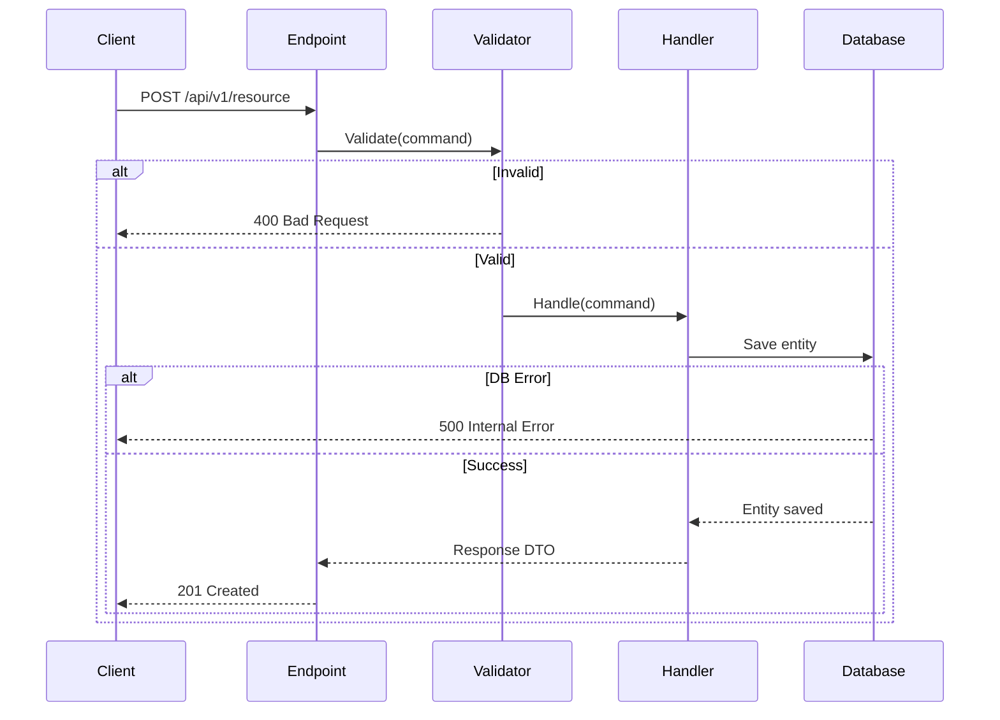

# [Feature Name] - API Reference

## Endpoint Summary

| Method | Endpoint | Auth | Description |
|--------|----------|------|-------------|
| GET | `/api/v1/[resource]` | ✅ Required | List all resources |
| GET | `/api/v1/[resource]/{id}` | ✅ Required | Get single resource |
| POST | `/api/v1/[resource]` | ✅ Required | Create resource |
| PUT | `/api/v1/[resource]/{id}` | ✅ Required | Update resource |
| DELETE | `/api/v1/[resource]/{id}` | ✅ Required | Delete resource |

## Quick Examples

```bash
# List resources
curl http://localhost:8080/api/v1/[resource] \
  -H "Authorization: Bearer {token}"

# Get single resource
curl http://localhost:8080/api/v1/[resource]/123e4567-e89b-12d3-a456-426614174000 \
  -H "Authorization: Bearer {token}"

# Create resource
curl -X POST http://localhost:8080/api/v1/[resource] \
  -H "Content-Type: application/json" \
  -H "Authorization: Bearer {token}" \
  -d '{"field1": "value1", "field2": "value2"}'

# Update resource
curl -X PUT http://localhost:8080/api/v1/[resource]/123e4567-e89b-12d3-a456-426614174000 \
  -H "Content-Type: application/json" \
  -H "Authorization: Bearer {token}" \
  -d '{"field1": "updated_value"}'

# Delete resource
curl -X DELETE http://localhost:8080/api/v1/[resource]/123e4567-e89b-12d3-a456-426614174000 \
  -H "Authorization: Bearer {token}"
```

## Endpoint Details

### GET /api/v1/[resource]

**Description**: Retrieve paginated list of resources

**Query Parameters**:
| Parameter | Type | Required | Default | Description |
|-----------|------|----------|---------|-------------|
| `page` | int | ❌ | 1 | Page number (1-based) |
| `pageSize` | int | ❌ | 20 | Items per page (max: 100) |
| `sortBy` | string | ❌ | `createdAt` | Sort field |
| `sortOrder` | string | ❌ | `desc` | `asc` or `desc` |
| `filter` | string | ❌ | - | Filter expression |

**Response**: `200 OK`
```json
{
  "items": [
    {
      "id": "123e4567-e89b-12d3-a456-426614174000",
      "field1": "value1",
      "field2": "value2",
      "createdAt": "2026-02-12T10:00:00Z",
      "updatedAt": "2026-02-12T11:00:00Z"
    }
  ],
  "totalCount": 42,
  "page": 1,
  "pageSize": 20,
  "totalPages": 3
}
```

**Error Responses**:
| Code | Description | Example |
|------|-------------|---------|
| 401 | Unauthorized | Missing/invalid token |
| 403 | Forbidden | Insufficient permissions |
| 400 | Bad Request | Invalid query parameters |

---

### GET /api/v1/[resource]/{id}

**Description**: Retrieve single resource by ID

**Path Parameters**:
| Parameter | Type | Required | Description |
|-----------|------|----------|-------------|
| `id` | guid | ✅ | Resource unique identifier |

**Response**: `200 OK`
```json
{
  "id": "123e4567-e89b-12d3-a456-426614174000",
  "field1": "value1",
  "field2": "value2",
  "relatedEntity": {
    "id": "...",
    "name": "..."
  },
  "createdAt": "2026-02-12T10:00:00Z",
  "updatedAt": "2026-02-12T11:00:00Z"
}
```

**Error Responses**:
| Code | Description | Example |
|------|-------------|---------|
| 404 | Not Found | Resource doesn't exist |
| 401 | Unauthorized | Missing/invalid token |
| 403 | Forbidden | No access to resource |

---

### POST /api/v1/[resource]

**Description**: Create new resource

**Request Body**:
```json
{
  "field1": "value1",
  "field2": "value2",
  "optionalField": "value3"
}
```

**Field Validation**:
| Field | Type | Required | Constraints |
|-------|------|----------|-------------|
| `field1` | string | ✅ | 1-100 chars, not empty |
| `field2` | string | ✅ | 1-500 chars |
| `optionalField` | string | ❌ | Max 200 chars |

**Response**: `201 Created`
```json
{
  "id": "123e4567-e89b-12d3-a456-426614174000",
  "field1": "value1",
  "field2": "value2",
  "createdAt": "2026-02-12T10:00:00Z"
}
```

**Error Responses**:
| Code | Description | Example |
|------|-------------|---------|
| 400 | Validation Failed | `{"errors": {"field1": ["Field1 is required"]}}` |
| 409 | Conflict | Resource already exists |
| 401 | Unauthorized | Missing/invalid token |

---

### PUT /api/v1/[resource]/{id}

**Description**: Update existing resource

**Path Parameters**:
| Parameter | Type | Required | Description |
|-----------|------|----------|-------------|
| `id` | guid | ✅ | Resource unique identifier |

**Request Body**:
```json
{
  "field1": "updated_value1",
  "field2": "updated_value2"
}
```

**Response**: `200 OK`
```json
{
  "id": "123e4567-e89b-12d3-a456-426614174000",
  "field1": "updated_value1",
  "field2": "updated_value2",
  "updatedAt": "2026-02-12T12:00:00Z"
}
```

**Error Responses**:
| Code | Description | Example |
|------|-------------|---------|
| 404 | Not Found | Resource doesn't exist |
| 400 | Validation Failed | Invalid field values |
| 409 | Conflict | Concurrency conflict |

---

### DELETE /api/v1/[resource]/{id}

**Description**: Delete resource (soft delete)

**Path Parameters**:
| Parameter | Type | Required | Description |
|-----------|------|----------|-------------|
| `id` | guid | ✅ | Resource unique identifier |

**Response**: `204 No Content`

**Error Responses**:
| Code | Description | Example |
|------|-------------|---------|
| 404 | Not Found | Resource doesn't exist |
| 401 | Unauthorized | Missing/invalid token |
| 403 | Forbidden | Cannot delete resource |

## Request Flow



## Authentication

**Header Format**:
```
Authorization: Bearer {access_token}
```

**Token Acquisition**:
```bash
# Login to get token
curl -X POST http://localhost:8080/api/v1/auth/login \
  -H "Content-Type: application/json" \
  -d '{"email": "user@example.com", "password": "password"}'

# Response
{
  "accessToken": "eyJhbGciOiJIUzI1NiIsInR5cCI6IkpXVCJ9...",
  "refreshToken": "...",
  "expiresIn": 3600
}
```

## Rate Limiting

| Endpoint Pattern | Limit | Window |
|------------------|-------|--------|
| `/api/v1/[resource]` (GET) | 100 req | 1 minute |
| `/api/v1/[resource]` (POST/PUT) | 20 req | 1 minute |
| `/api/v1/[resource]/{id}` (DELETE) | 10 req | 1 minute |

**Rate Limit Headers**:
```
X-RateLimit-Limit: 100
X-RateLimit-Remaining: 95
X-RateLimit-Reset: 1644667200
```

## Pagination

**Request Pattern**:
```
GET /api/v1/[resource]?page=2&pageSize=50
```

**Response Metadata**:
```json
{
  "items": [...],
  "totalCount": 250,
  "page": 2,
  "pageSize": 50,
  "totalPages": 5,
  "hasNextPage": true,
  "hasPreviousPage": true
}
```

## Filtering & Sorting

**Filter Syntax**:
```
?filter=field1 eq 'value' and field2 gt 100
?filter=status in ['active', 'pending']
```

**Sort Syntax**:
```
?sortBy=createdAt&sortOrder=desc
?sortBy=field1,field2&sortOrder=asc
```

## Error Format

**Standard Error Response**:
```json
{
  "type": "https://tools.ietf.org/html/rfc7231#section-6.5.1",
  "title": "Validation Failed",
  "status": 400,
  "traceId": "00-trace-id-00",
  "errors": {
    "field1": ["Field1 is required"],
    "field2": ["Field2 must be between 1 and 100"]
  }
}
```

**Common Error Types**:
| Status | Type | When to Use |
|--------|------|-------------|
| 400 | `ValidationFailed` | Invalid input data |
| 401 | `Unauthorized` | Missing/invalid auth |
| 403 | `Forbidden` | Insufficient permissions |
| 404 | `NotFound` | Resource doesn't exist |
| 409 | `Conflict` | Business rule violation |
| 500 | `InternalError` | Unexpected server error |

## Testing

**Test File Location**: `tests/Api.Tests/Integration/[Feature]EndpointTests.cs`

**Test Categories**:
```csharp
[Trait("Category", TestCategories.Integration)]
[Trait("BoundedContext", "[BoundedContext]")]
public class [Feature]EndpointTests : IClassFixture<ApiFactory>
{
    [Fact]
    public async Task GetAll_ReturnsPagedResults() { }

    [Fact]
    public async Task GetById_WithValidId_ReturnsResource() { }

    [Fact]
    public async Task Create_WithValidData_ReturnsCreated() { }

    [Fact]
    public async Task Update_WithValidData_ReturnsUpdated() { }

    [Fact]
    public async Task Delete_WithValidId_ReturnsNoContent() { }
}
```

## Related Documentation

- **Architecture**: [Link to architecture template]
- **Development Guide**: [Link to development template]
- **Testing Guide**: [Link to testing template]
