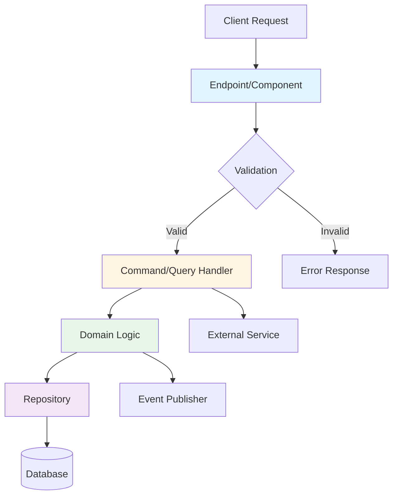
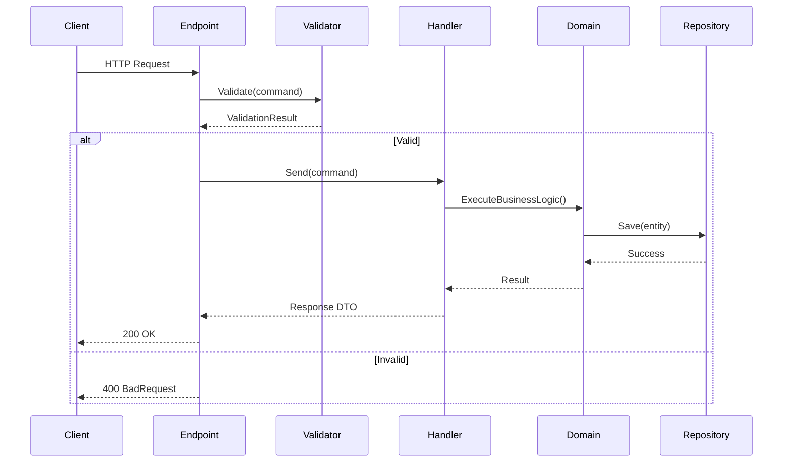
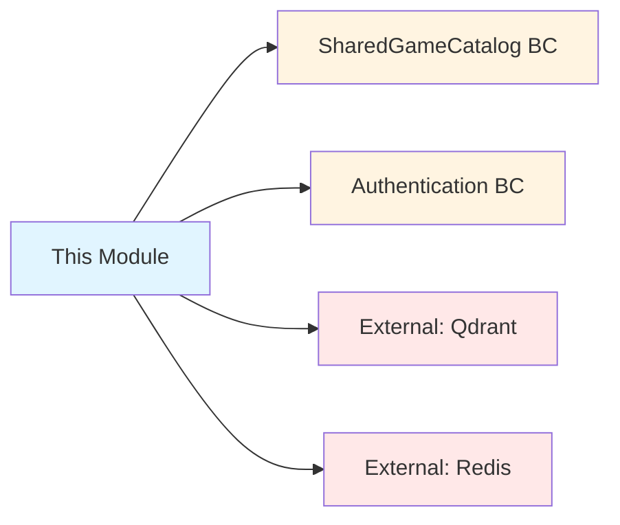

# [Feature/Module Name] - Architecture

## Quick Reference

| Aspect | Value |
|--------|-------|
| **Bounded Context** | [Context Name] |
| **Layer** | Domain / Application / Infrastructure |
| **Dependencies** | [List key dependencies] |
| **Entry Point** | [API endpoint or component] |
| **Responsibility** | [One-line description] |

## Architecture Diagram



## Component Responsibilities

| Component | Responsibility | Input | Output |
|-----------|---------------|-------|--------|
| **Endpoint** | HTTP routing, DTO mapping | HTTP Request | IResult |
| **Validator** | Business rule validation | Command/Query | ValidationResult |
| **Handler** | Orchestration logic | Command/Query | Response DTO |
| **Domain Entity** | Core business logic | Method calls | State changes |
| **Repository** | Data persistence | Entity | Entity/bool |
| **Service** | Cross-cutting concerns | Varies | Varies |

## Data Flow



## Layer Interaction Rules

```
┌─────────────────────────────────────────┐
│         Presentation Layer              │
│  (Endpoints, Controllers, Components)   │
└─────────────────┬───────────────────────┘
                  ↓ (DTOs only)
┌─────────────────────────────────────────┐
│        Application Layer                │
│   (Commands, Queries, Handlers)         │
└─────────────────┬───────────────────────┘
                  ↓ (Domain entities)
┌─────────────────────────────────────────┐
│          Domain Layer                   │
│    (Entities, Value Objects, Events)    │
└─────────────────┬───────────────────────┘
                  ↑ (Repository interfaces)
┌─────────────────────────────────────────┐
│       Infrastructure Layer              │
│  (Repositories, External Services)      │
└─────────────────────────────────────────┘
```

**✅ ALLOWED**:
- Presentation → Application (via DTOs)
- Application → Domain (via entities)
- Infrastructure → Domain (implements interfaces)

**❌ FORBIDDEN**:
- Presentation → Domain (bypass Application)
- Domain → Infrastructure (direct dependency)
- Infrastructure → Application (upward dependency)

## Key Design Patterns

| Pattern | Usage | Location |
|---------|-------|----------|
| **CQRS** | Separate read/write models | Commands/Queries |
| **Repository** | Data access abstraction | Infrastructure |
| **Factory Method** | Entity creation | Domain entities |
| **Value Object** | Immutable domain concepts | Domain |
| **Domain Event** | Async side effects | Domain → Handlers |

## Decision Tree: When to Use

```
Need data persistence?
├─ Yes → Repository pattern
│   └─ Multiple data sources?
│       ├─ Yes → Unit of Work pattern
│       └─ No → Single repository
└─ No → In-memory/stateless service

Need validation?
├─ Yes → FluentValidation in Application layer
│   └─ Domain rules? → Also in Domain entity
└─ No → Simple DTO mapping

Need async communication?
├─ Yes → Domain Events + MediatR
└─ No → Direct method calls
```

## File Organization

```
BoundedContext/
├── Domain/
│   ├── Entities/
│   │   └── [EntityName].cs
│   ├── ValueObjects/
│   │   └── [ValueObjectName].cs
│   ├── Events/
│   │   └── [EventName].cs
│   └── Repositories/
│       └── I[EntityName]Repository.cs
├── Application/
│   ├── Commands/
│   │   ├── [Action]Command.cs
│   │   ├── [Action]CommandValidator.cs
│   │   └── [Action]CommandHandler.cs
│   └── Queries/
│       ├── [Query]Query.cs
│       ├── [Query]QueryValidator.cs
│       └── [Query]QueryHandler.cs
└── Infrastructure/
    └── Repositories/
        └── [EntityName]Repository.cs
```

## Testing Strategy

| Test Type | Target | Tool | Coverage Goal |
|-----------|--------|------|---------------|
| **Unit** | Domain entities, validators | xUnit | 90%+ |
| **Integration** | Handlers + DB | Testcontainers | 85%+ |
| **E2E** | Full request flow | API tests | 70%+ |

## Common Pitfalls

| ❌ Anti-Pattern | ✅ Correct Pattern |
|----------------|-------------------|
| Direct service injection in endpoints | Use `IMediator.Send()` only |
| `InvalidOperationException` for business rules | Use domain-specific exceptions |
| Public setters on entities | Private setters + factory methods |
| Shared DTOs between commands/queries | Separate DTO per operation |
| Fat handlers with business logic | Logic in Domain, orchestration in Handler |

## Performance Considerations

| Concern | Solution | Implementation |
|---------|----------|----------------|
| **Caching** | HybridCache for queries | `IHybridCacheService` |
| **N+1 Queries** | Eager loading | `.Include()` in repositories |
| **Large result sets** | Pagination | `Skip().Take()` pattern |
| **Expensive operations** | Background jobs | Quartz.NET |

## Dependencies



## Configuration

| Setting | Environment Variable | Default | Required |
|---------|---------------------|---------|----------|
| [Setting 1] | `ENV_VAR_NAME` | `default_value` | ✅ Yes |
| [Setting 2] | `ENV_VAR_NAME` | `default_value` | ❌ No |

## Related Documentation

- **API Reference**: [Link to API template]
- **Testing Guide**: [Link to testing template]
- **Troubleshooting**: [Link to troubleshooting template]
