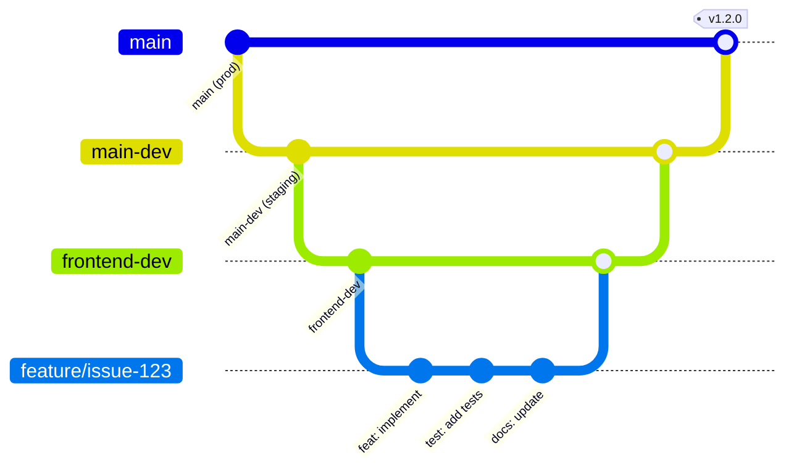
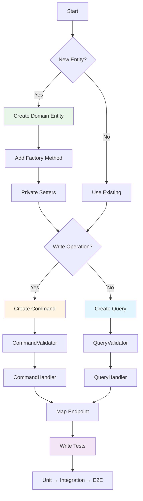
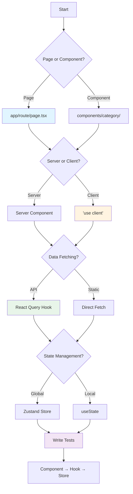

# [Feature Name] - Development Guide

## Quick Start Decision Tree

```
Starting new feature?
├─ Define scope & requirements
│   └─ Create issue with acceptance criteria
│
├─ Read bounded context README
│   └─ Understand domain rules & patterns
│
├─ Design approach
│   ├─ Backend?
│   │   ├─ Domain entity needed?
│   │   │   ├─ Yes → Create Entity + Factory
│   │   │   └─ No → Use existing entity
│   │   ├─ New operation?
│   │   │   ├─ Write → Command + Handler + Validator
│   │   │   └─ Read → Query + Handler + Validator
│   │   └─ Endpoint → Map endpoint in Routing/
│   │
│   └─ Frontend?
│       ├─ New page → app/[route]/page.tsx
│       ├─ Component → components/[category]/
│       └─ State → Store (Zustand) or React Query
│
├─ Implement (TDD cycle)
│   ├─ Write failing test
│   ├─ Implement minimum code
│   ├─ Make test pass
│   └─ Refactor
│
└─ Verify & commit
    ├─ Run tests (dotnet test / pnpm test)
    ├─ Check coverage (90% backend, 85% frontend)
    ├─ Lint & format
    └─ Commit with conventional message
```

## Development Workflow

### 1. Branch Strategy



**Branch Types**:
| Branch | Purpose | Merge To |
|--------|---------|----------|
| `main` | Production | - |
| `main-dev` | Development staging | `main` |
| `frontend-dev` | Frontend integration | `main-dev` |
| `feature/issue-{n}-{desc}` | Feature work | Parent branch |

**Commands**:
```bash
# Start new feature
git checkout frontend-dev && git pull
git checkout -b feature/issue-123-desc
git config branch.feature/issue-123-desc.parent frontend-dev

# Daily sync
git fetch origin
git rebase origin/frontend-dev

# Complete feature
git push -u origin feature/issue-123-desc
# Create PR to frontend-dev
# After merge:
git checkout frontend-dev && git pull
git branch -D feature/issue-123-desc
```

### 2. Backend Development Pattern



**File Creation Order**:
```
1. Domain/Entities/[EntityName].cs
2. Domain/ValueObjects/[ValueObject].cs (if needed)
3. Application/Commands/[Action]Command.cs
4. Application/Commands/[Action]CommandValidator.cs
5. Application/Commands/[Action]CommandHandler.cs
6. Routing/[Feature]Endpoints.cs
7. Tests: Unit → Integration → E2E
```

**Code Template**:
```csharp
// 1. Domain Entity
public class GameSession
{
    public Guid Id { get; private set; }
    public string Name { get; private set; } = string.Empty;
    public DateTime CreatedAt { get; private set; }

    private GameSession() { } // EF Core

    public static GameSession Create(string name)
    {
        ArgumentException.ThrowIfNullOrWhiteSpace(name);
        return new GameSession
        {
            Id = Guid.NewGuid(),
            Name = name,
            CreatedAt = DateTime.UtcNow
        };
    }

    public void UpdateName(string newName)
    {
        ArgumentException.ThrowIfNullOrWhiteSpace(newName);
        Name = newName;
    }
}

// 2. Command
public record CreateGameSessionCommand(string Name) : IRequest<Guid>;

// 3. Validator
public class CreateGameSessionCommandValidator : AbstractValidator<CreateGameSessionCommand>
{
    public CreateGameSessionCommandValidator()
    {
        RuleFor(x => x.Name)
            .NotEmpty()
            .MaximumLength(100);
    }
}

// 4. Handler
internal class CreateGameSessionCommandHandler(IGameSessionRepository repository)
    : IRequestHandler<CreateGameSessionCommand, Guid>
{
    public async Task<Guid> Handle(CreateGameSessionCommand request, CancellationToken cancellationToken)
    {
        var session = GameSession.Create(request.Name);
        await repository.AddAsync(session, cancellationToken);
        return session.Id;
    }
}

// 5. Endpoint
public static void MapGameSessionEndpoints(this IEndpointRouteBuilder app)
{
    var group = app.MapGroup("/api/v1/sessions")
        .RequireAuthorization()
        .WithTags("GameSessions");

    group.MapPost("/", async (CreateGameSessionCommand command, IMediator mediator) =>
        Results.Ok(await mediator.Send(command)))
        .WithName("CreateGameSession");
}
```

### 3. Frontend Development Pattern



**File Creation Order**:
```
1. components/[category]/[component-name].tsx
2. lib/hooks/use-[feature].ts (if needed)
3. lib/stores/[feature]-store.ts (if needed)
4. lib/api/[feature]-client.ts
5. __tests__/[component-name].test.tsx
```

**Code Template**:
```tsx
// 1. Component
'use client';

import { FC } from 'react';
import { useGameSessions } from '@/lib/hooks/use-game-sessions';

interface GameSessionListProps {
  userId: string;
}

export const GameSessionList: FC<GameSessionListProps> = ({ userId }) => {
  const { data, isLoading, error } = useGameSessions(userId);

  if (isLoading) return <div>Loading...</div>;
  if (error) return <div>Error: {error.message}</div>;

  return (
    <div className="space-y-4">
      {data?.map((session) => (
        <div key={session.id} className="p-4 border rounded">
          {session.name}
        </div>
      ))}
    </div>
  );
};

// 2. React Query Hook
import { useQuery } from '@tanstack/react-query';
import { adminClient } from '@/lib/api/admin-client';

export const useGameSessions = (userId: string) => {
  return useQuery({
    queryKey: ['game-sessions', userId],
    queryFn: () => adminClient.getGameSessions(userId),
    staleTime: 5 * 60 * 1000, // 5 minutes
  });
};

// 3. API Client
export const adminClient = {
  getGameSessions: async (userId: string) => {
    const response = await fetch(`/api/v1/users/${userId}/sessions`);
    if (!response.ok) throw new Error('Failed to fetch sessions');
    return response.json();
  },
};

// 4. Zustand Store (if needed)
import { create } from 'zustand';

interface SessionStore {
  selectedSession: string | null;
  setSelectedSession: (id: string | null) => void;
}

export const useSessionStore = create<SessionStore>((set) => ({
  selectedSession: null,
  setSelectedSession: (id) => set({ selectedSession: id }),
}));
```

### 4. Testing Strategy

**Test Pyramid**:
```
           /\
          /E2E\         5% - Full user flows
         /------\
        /  INT   \      25% - API + DB integration
       /----------\
      /    UNIT    \    70% - Business logic
     /--------------\
```

**Backend Test Pattern**:
```csharp
// Unit Test
[Trait("Category", TestCategories.Unit)]
public class GameSessionTests
{
    [Fact]
    public void Create_WithValidName_ReturnsSession()
    {
        // Arrange
        var name = "Test Session";

        // Act
        var session = GameSession.Create(name);

        // Assert
        session.Should().NotBeNull();
        session.Name.Should().Be(name);
        session.Id.Should().NotBeEmpty();
    }
}

// Integration Test
[Trait("Category", TestCategories.Integration)]
public class CreateGameSessionHandlerTests : IClassFixture<ApiFactory>
{
    [Fact]
    public async Task Handle_WithValidCommand_CreatesSession()
    {
        // Arrange
        var command = new CreateGameSessionCommand("Test");

        // Act
        var id = await _mediator.Send(command);

        // Assert
        var session = await _context.GameSessions.FindAsync(id);
        session.Should().NotBeNull();
    }
}
```

**Frontend Test Pattern**:
```tsx
// Component Test
describe('GameSessionList', () => {
  it('renders sessions correctly', () => {
    const mockSessions = [
      { id: '1', name: 'Session 1' },
      { id: '2', name: 'Session 2' },
    ];

    render(<GameSessionList sessions={mockSessions} />);

    expect(screen.getByText('Session 1')).toBeInTheDocument();
    expect(screen.getByText('Session 2')).toBeInTheDocument();
  });
});

// Hook Test
describe('useGameSessions', () => {
  it('fetches sessions successfully', async () => {
    const { result } = renderHook(() => useGameSessions('user-1'));

    await waitFor(() => {
      expect(result.current.data).toBeDefined();
    });
  });
});
```

## Common Patterns

### Domain-Driven Design

**Entity vs Value Object**:
```
Entity (has identity)
├─ Mutable state
├─ Tracked by ID
├─ Lifecycle events
└─ Example: User, Game, Session

Value Object (no identity)
├─ Immutable
├─ Compared by value
├─ No lifecycle
└─ Example: Email, Money, Address
```

**Repository Pattern**:
```csharp
// Interface in Domain
public interface IGameSessionRepository
{
    Task<GameSession?> GetByIdAsync(Guid id, CancellationToken ct);
    Task AddAsync(GameSession session, CancellationToken ct);
}

// Implementation in Infrastructure
internal class GameSessionRepository : IGameSessionRepository
{
    // EF Core implementation
}
```

### CQRS Pattern

**Command vs Query**:
| Aspect | Command | Query |
|--------|---------|-------|
| **Purpose** | Modify state | Read state |
| **Return** | ID or void | Data DTO |
| **Cache** | ❌ No | ✅ Yes |
| **Side Effects** | ✅ Yes | ❌ No |
| **Example** | CreateGameSession | GetGameSessions |

**Handler Pattern**:
```csharp
// Command Handler (write)
internal class CreateHandler(IRepository repo)
    : IRequestHandler<CreateCommand, Guid>
{
    public async Task<Guid> Handle(CreateCommand request, CancellationToken ct)
    {
        var entity = Entity.Create(request.Data);
        await repo.AddAsync(entity, ct);
        return entity.Id;
    }
}

// Query Handler (read + cache)
internal class GetAllHandler(IRepository repo, IHybridCacheService cache)
    : IRequestHandler<GetAllQuery, List<EntityDto>>
{
    public async Task<List<EntityDto>> Handle(GetAllQuery request, CancellationToken ct)
    {
        return await cache.GetOrCreateAsync(
            $"entities-{request.Filter}",
            async token => await repo.GetAllAsync(request.Filter, token),
            cancellationToken: ct
        );
    }
}
```

## Code Review Checklist

**Before Committing**:
- [ ] All tests pass (`dotnet test` / `pnpm test`)
- [ ] Coverage meets targets (90% backend, 85% frontend)
- [ ] No lint warnings (`pnpm lint`)
- [ ] Type check passes (`pnpm typecheck`)
- [ ] Build succeeds (`dotnet build` / `pnpm build`)

**PR Description Must Include**:
- [ ] Issue number reference (#123)
- [ ] What changed (features/fixes)
- [ ] How to test
- [ ] Screenshots (if UI changes)
- [ ] Breaking changes noted

**Review Criteria**:
| Aspect | Check |
|--------|-------|
| **Architecture** | Follows DDD, CQRS, Repository patterns |
| **Validation** | FluentValidation in Application layer |
| **Error Handling** | Domain-specific exceptions (not InvalidOperation) |
| **Testing** | Unit + Integration tests, coverage targets met |
| **Naming** | Consistent with project conventions |
| **Performance** | Caching, pagination, N+1 prevention |

## Troubleshooting

**Decision Tree**:
```
Build fails?
├─ Backend?
│   ├─ Missing reference? → dotnet restore
│   ├─ EF error? → dotnet ef database update
│   └─ Test failure? → Check Testcontainers
└─ Frontend?
    ├─ Missing deps? → pnpm install
    ├─ Type error? → pnpm typecheck
    └─ Build error? → rm -rf .next && pnpm build

Tests fail?
├─ Integration?
│   ├─ DB issue? → Check Docker containers
│   ├─ Concurrency? → Add [Collection] attribute
│   └─ Flaky? → Check for DateTime.Now usage
└─ Unit?
    ├─ Mock issue? → Verify setup
    └─ Assertion? → Check expected vs actual

Git issues?
├─ Wrong branch? → git checkout <correct-branch>
├─ Merge conflict? → git rebase origin/<parent>
└─ Diverged history? → git pull --rebase
```

## Related Documentation

- **Architecture**: [Link to architecture template]
- **API Reference**: [Link to API template]
- **Testing Guide**: [Link to testing template]
- **Troubleshooting**: [Link to troubleshooting template]
