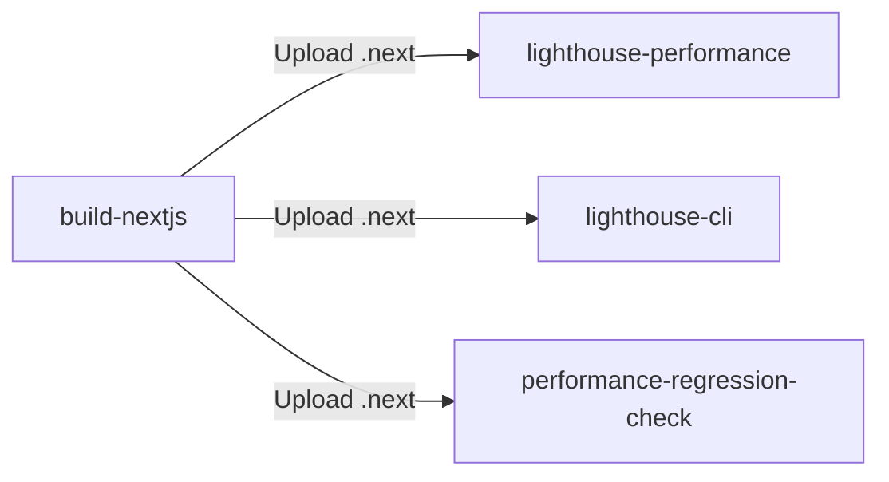
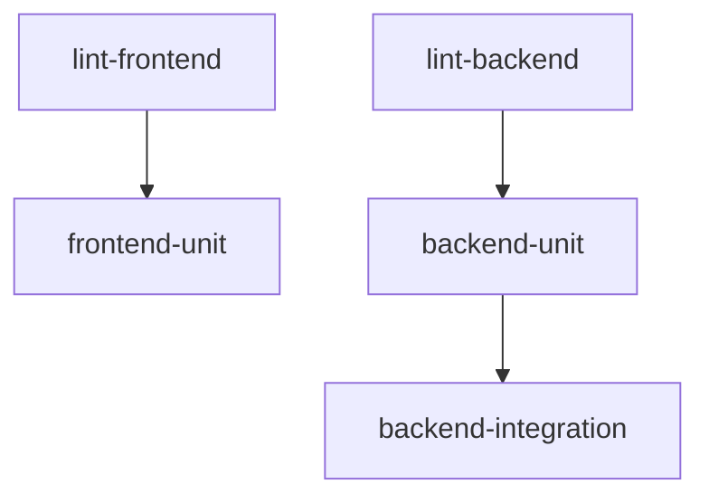
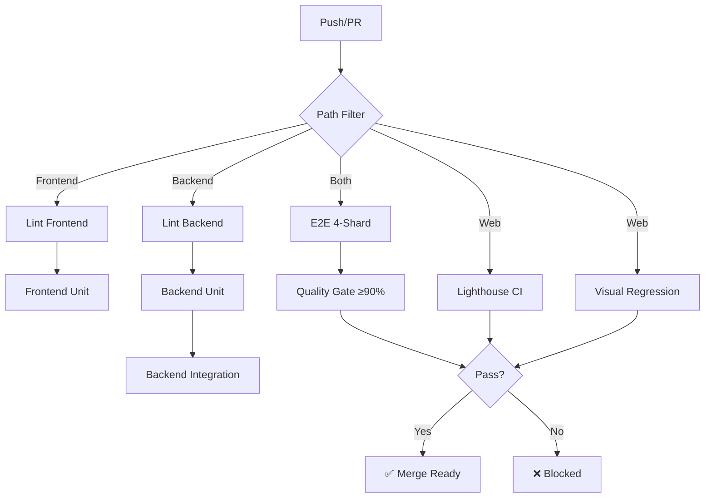

# CI/CD Pipeline Guide

**Comprehensive testing pipeline across 8 stages**

---

## Overview

| Metric | Target | Status |
|--------|--------|--------|
| **Backend Coverage** | ≥90% | ✅ Enforced |
| **Frontend Coverage** | ≥85% | ✅ Enforced |
| **E2E Pass Rate** | ≥90% | ✅ Quality Gate |
| **Performance Score** | ≥85% | ✅ Lighthouse CI |
| **Pipeline Duration** | <15 min | ✅ Optimized |

**Pipeline Design**: Speed (parallel), Quality (90%+ coverage), Observability (PR comments, artifacts)

---

## Workflow Architecture

### Workflow Distribution

| Workflow | Stages | Trigger | Duration |
|----------|--------|---------|----------|
| **ci.yml** | 1-5 (Lint, TypeCheck, Unit, Integration) | Push/PR to main branches | ~8-12 min |
| **e2e-tests.yml** | 6 (E2E 4-shard parallel) | Path filter (web/api) | ~6-8 min |
| **visual-regression.yml** | 7 (Playwright + Chromatic) | PR/push to main | ~5-7 min |
| **lighthouse-ci.yml** | 8 (Performance + CWV) | PR/push to main | ~4-6 min |

**Supporting**:
- `k6-performance.yml`: Load/stress (nightly + manual)
- `security.yml`: SAST, deps, secrets (weekly + PR)
- `branch-policy.yml`: Enforce git flow
- `dependabot-automerge.yml`: Auto-merge security patches

### Trigger Patterns

```yaml
# Push/PR (most workflows)
on:
  push:
    branches: [main, main-dev, frontend-dev]
  pull_request:
    branches: [main, main-dev, frontend-dev]

# Scheduled
schedule:
  - cron: '0 2 * * *'  # K6 nightly 2 AM UTC
  - cron: '0 0 * * 0'  # Security weekly Sunday

# Manual
workflow_dispatch:
  inputs:
    debug_enabled: { type: boolean, default: false }
```

### Concurrency Control

```yaml
concurrency:
  group: ${{ github.workflow }}-${{ github.event.pull_request.number || github.ref }}
  cancel-in-progress: true
```

**Effect**: One run per PR/branch, new pushes cancel in-progress

---

## Stage 1-5: Core CI Pipeline

**File**: `.github/workflows/ci.yml`

### Stage 1: Lint + TypeCheck (Fail Fast)

**Frontend**: `pnpm lint && pnpm typecheck` (~2-3min)
**Backend**: `dotnet build` (~2-3min)
**Strategy**: Fail-fast (blocks all subsequent jobs)

### Stage 2: Backend Unit Tests

```bash
dotnet test --filter "Category=Unit" -p:CollectCoverage=true
```

**Coverage**: ≥90% | **Output**: `coverage/unit-coverage.xml` → Codecov
**Tests**: Domain logic, value objects, handlers, validators (~3-4min)

### Stage 3: Frontend Unit Tests

```bash
pnpm test:coverage  # Vitest + MSW
```

**Coverage**: ≥85% | **Output**: `coverage/lcov.info` → Codecov
**Tests**: Components, hooks, utils, MSW-mocked API (~2-3min)

### Stage 4: Backend Integration Tests

```bash
dotnet test --filter "Category=Integration" -p:CollectCoverage=true
```

**Infrastructure**: Testcontainers (postgres, redis, qdrant)

**Service Containers**:

| Service | Image | Health Check | Timeout |
|---------|-------|--------------|---------|
| PostgreSQL | postgres:16-alpine | `pg_isready` | 5s × 10 = ~60s |
| Redis | redis:7-alpine | `redis-cli ping` | 3s × 10 = ~40s |
| Qdrant | qdrant:v1.12.4 | TCP check (bash) | 5s × 30 = ~160s |

**PostgreSQL Config** (Issue #2693):
```yaml
POSTGRES_INITDB_ARGS: "-c max_connections=500 --shared-buffers=512MB"
```

**Tests**: DB persistence, Redis cache, Qdrant vectors, MediatR flows (~4-6min)

### Stage 5: Frontend Integration Tests

**Included in Stage 3** (Vitest + MSW)
**Tests**: API integration (React Query), form validation, Zustand state

---

## Stage 6: E2E Tests

**File**: `.github/workflows/e2e-tests.yml` | **Tool**: Playwright

### 4-Shard Parallel Execution

```yaml
strategy:
  matrix:
    shard: [1, 2, 3, 4]
  fail-fast: false
```

**Distribution**: Auto (Playwright balances by file count + duration)
**Time**: Sequential (24min) → Parallel (6min) → **75% reduction**

### Execution Flow

1. Start services (postgres, redis, qdrant, n8n)
2. Build backend: `dotnet build`
3. Start API: `dotnet run` (:8080)
4. Build frontend: `pnpm build`
5. Start frontend: `pnpm start` (FORCE_PRODUCTION_SERVER=true)
6. Run shard: `playwright test --shard=N/4`

**Environment**:
```bash
CI=true
NODE_ENV=test
NEXT_PUBLIC_API_BASE=http://localhost:8080
FORCE_PRODUCTION_SERVER=true
```

### Quality Gate

**Job**: `e2e-quality-gate` (after all shards)

**Process**:
1. Download shard reports
2. Merge HTML reports
3. Parse results → calculate pass rate
4. Enforce ≥90% threshold

**PR Comment**:
```markdown
## 🎭 E2E Test Results
**Pass Rate:** 95% (104/109 tests)
**Quality Gate:** ✅ PASSED (≥90% required)

**Artifacts:** HTML Report, Screenshots (failures), Traces
```

### Cross-Browser Testing (Manual)

```yaml
matrix:
  project: [desktop-chrome, desktop-firefox, desktop-safari, mobile-chrome, mobile-safari, tablet-chrome]
```

**Duration**: ~25-30min (vs 2.5-3h sequential)

---

## Stage 7: Visual Regression

**File**: `.github/workflows/visual-regression.yml`

### Playwright Visual Testing

```bash
pnpm test:e2e:visual  # Snapshot assertions
```

**Config**: `screenshot: only-on-failure`, `video: retain-on-failure`
**Update Baseline**: `pnpm test:e2e:visual:update`

### Chromatic (Storybook)

```bash
pnpm chromatic:ci  # Component visual review
```

**Features**: Pixel-diff, approval UI, baseline management
**PR Comment**: Changes detected, review links
**Strategy**: Non-blocking (continue-on-error: true)
**Duration**: ~5-7min

---

## Stage 8: Performance Audit

**File**: `.github/workflows/lighthouse-ci.yml`

### Shared Build Strategy



**Benefit**: Build once (3min) vs 3× builds (9min) → **Save 6min**

### Configuration

**File**: `apps/web/.lighthouseci/lighthouserc.json`

```json
{
  "ci": {
    "collect": { "numberOfRuns": 3 },
    "assert": {
      "categories:performance": ["error", { "minScore": 0.85 }],
      "categories:accessibility": ["error", { "minScore": 0.95 }],
      "categories:best-practices": ["error", { "minScore": 0.90 }],
      "categories:seo": ["error", { "minScore": 0.90 }]
    }
  }
}
```

### Core Web Vitals Targets

| Metric | Target | Description |
|--------|--------|-------------|
| **LCP** | <2.5s | Largest Contentful Paint (loading) |
| **FID** | <100ms | First Input Delay (interactivity) |
| **CLS** | <0.1 | Cumulative Layout Shift (stability) |
| **FCP** | <1.8s | First Contentful Paint (perceived) |
| **TBT** | <200ms | Total Blocking Time (main thread) |
| **SI** | <3.4s | Speed Index (visual progression) |

### Regression Detection

```bash
DIFF=$(echo "$CURRENT - $BASE" | bc)
if (( $(echo "$DIFF < -0.10" | bc -l) )); then
  echo "Performance regression: ${DIFF}%"
  exit 1
fi
```

**Threshold**: 10% degradation = build failure

**PR Comment**:
```markdown
## 🚀 Lighthouse Performance Audit
**Performance:** 89% (+2% vs base)
**Core Web Vitals:** ✅ LCP 2.1s | ✅ FID 45ms | ✅ CLS 0.05
**Regressions:** None detected
```

**Duration**: ~4-6min | **Strategy**: Non-blocking (alpha phase)

---

## Parallel Execution Strategies

### 1. E2E 4-Shard Parallelization

**Time**: Sequential (24min) → Parallel (6min) → **75% reduction**

```yaml
matrix:
  shard: [1, 2, 3, 4]
```

Playwright auto-distributes tests, merges reports in quality-gate job.

### 2. Frontend/Backend Parallel Jobs



**Savings**: ~3-4min vs sequential

### 3. Shared Build Caching

**Lighthouse CI**: Build once → 3 jobs download
**Savings**: 9min → 4.5min (avoid 3× builds)

### 4. Cross-Browser Matrix

6 projects in parallel → 25-30min (vs 2.5-3h sequential)

---

## Coverage & Reporting

### Codecov Integration

| Source | File | Flag | Job |
|--------|------|------|-----|
| Frontend | `apps/web/coverage/lcov.info` | `frontend` | ci.yml |
| Backend Unit | `apps/api/coverage/unit-coverage.xml` | `backend` | ci.yml |
| Backend Integration | `apps/api/coverage/integration-coverage.xml` | `backend` | ci.yml |
| E2E | `apps/web/coverage-e2e/` | `e2e` | e2e-tests.yml |

**Targets**: Backend ≥90%, Frontend ≥85%, E2E ≥70% (monitored)

### PR Comment Automation

**E2E Quality Gate**:
```markdown
## 🎭 E2E Test Results
**Pass Rate:** 95% (104/109)
**Quality Gate:** ✅ PASSED
**Artifacts:** Report, Screenshots, Traces
```

**Lighthouse**:
```markdown
## 🚀 Performance Audit
**Scores:** Perf 89%, A11y 97%, BP 92%, SEO 95%
**CWV:** ✅ All passing
**Regressions:** None
```

**Chromatic**:
```markdown
## 🎨 Visual Regression
**Changes:** 3 components
**Status:** ⚠️ Review required
**Links:** Build, Storybook, Report
```

---

## Artifact Management

### Upload Patterns

**Conditional** (failures only):
```yaml
- if: failure()
  uses: actions/upload-artifact@v4
  with:
    name: screenshots-${{ matrix.shard }}
    retention-days: 7
```

**Always**:
```yaml
- if: always()
  uses: actions/upload-artifact@v4
  with:
    name: playwright-report-${{ matrix.shard }}
    retention-days: 7
```

### Retention Policies

| Artifact | Retention | Rationale |
|----------|-----------|-----------|
| Shared builds (.next) | 1 day | Temporary for jobs |
| E2E reports/screenshots | 7 days | Recent debugging |
| Lighthouse reports | 7 days | Performance history |
| K6 reports | 30 days | Trend analysis |
| K6 baseline | 90 days | Long-term baselines |

**Sizes**: Playwright 5-50MB, Screenshots 1-30MB, Traces 2-20MB, Lighthouse 1-5MB

---

## Path Filtering

**Tool**: `dorny/paths-filter@v3`

### Filter Definitions

```yaml
- uses: dorny/paths-filter@v3
  with:
    filters: |
      frontend: ['apps/web/**', 'package.json', 'pnpm-lock.yaml']
      backend: ['apps/api/**', 'global.json']
      e2e: ['apps/web/**', 'apps/api/**']
      infra: ['infra/**', 'docker-compose*.yml']
```

**Usage**: `if: steps.changes.outputs.frontend == 'true'`

### Workflow-Specific Filters

| Workflow | Filters | Skip Strategy |
|----------|---------|---------------|
| ci.yml | frontend, backend, e2e | Skip backend on frontend-only |
| e2e-tests.yml | web, api | Skip if neither changed |
| lighthouse-ci.yml | web | Skip on backend-only |
| k6-performance.yml | admin_endpoints, k6_tests | Skip on unrelated changes |

### Benefits

**Time Savings**:
- Frontend-only change: Skip backend (~5-8min)
- Backend-only change: Skip frontend (~4-6min)
- Infra-only change: Skip E2E (~6-8min)

**Example**: PR changes `apps/web/page.tsx`
- **Run**: frontend tests, E2E, lighthouse, visual
- **Skip**: backend tests, k6
- **Time**: 12-15min (vs 20-25min)

---

## Troubleshooting

### Common Issues

| Issue | Detection | Fix |
|-------|-----------|-----|
| **Testhost blocking** (#2593) | `tasklist \| grep testhost` | `taskkill //PID <PID> //F` |
| **Port in use** | `netstat -ano \| findstr :8080` | `taskkill /PID <PID> /F` |
| **DB connection fail** | `docker ps --filter name=postgres` | Increase health retries |
| **Qdrant health fail** | Missing wget/curl | Use TCP check: `bash -c '</dev/tcp/127.0.0.1/6333'` |
| **Coverage upload fail** | Check CODECOV_TOKEN | Set `fail_ci_if_error: false` |
| **E2E gate false fail** | Parse errors | Debug: `jq '.stats' results.json` |
| **Build artifact missing** | Build job failed | Verify `if: success()` on upload |
| **Chromatic token expired** | Auth failure | Regenerate at chromatic.com |
| **K6 flaky** (#2286) | Resource contention | Increase retries, exponential backoff |
| **Service race condition** | Connection refused | Add `sleep 5` after health checks |

### CI Mitigation Patterns

**Kill testhost (Windows)**:
```yaml
- if: runner.os == 'Windows'
  run: Get-Process -Name testhost -ErrorAction SilentlyContinue | Stop-Process -Force
  shell: pwsh
```

**PostgreSQL optimization** (Issue #2693):
```yaml
POSTGRES_INITDB_ARGS: "-c max_connections=500 --shared-buffers=512MB"
```

**Qdrant health check** (no wget/curl):
```yaml
options: >-
  --health-cmd "bash -c '</dev/tcp/127.0.0.1/6333'"
  --health-retries 30
```

**Service wait**:
```yaml
- run: |
    echo "Health checks passed, waiting 5s"
    sleep 5
```

---

## Performance Optimization

### Best Practices

1. **Fail Fast**: Lint/typecheck before expensive tests
2. **Caching**: Auto-cache pnpm, NuGet
3. **Parallelization**: Matrix strategies for independent jobs
4. **Path Filtering**: Skip irrelevant tests
5. **Service Optimization**: fsync=off (CI only), shared_buffers=512MB

### Resource Management

- **Concurrency**: Cancel superseded runs
- **Retention**: Artifact auto-cleanup
- **Uploads**: Conditional (failures only for screenshots)

### Monitoring Metrics

**Track**:
- Pipeline duration (target: <15min)
- Pass rate trends (target: ≥95%)
- Flaky tests (retries needed)
- Actions minutes consumption

**GitHub Actions Insights**: Workflow duration trends, job timing, artifact storage

---

## Mermaid Workflow Diagram



---

## Additional Resources

- **Test Docs**: `docs/05-testing/README.md`
- **Performance**: `docs/05-testing/performance-benchmarks.md`
- **Visual Regression**: `docs/05-testing/visual-regression.md`
- **Playwright Best Practices**: `docs/05-testing/playwright-best-practices.md`
- **Testcontainers**: `docs/05-testing/testcontainers-best-practices.md`

---

**Last Updated**: 2026-01-23 | **Related Issues**: #2921, #2693, #2593, #2542, #2918, #2286, #2284
